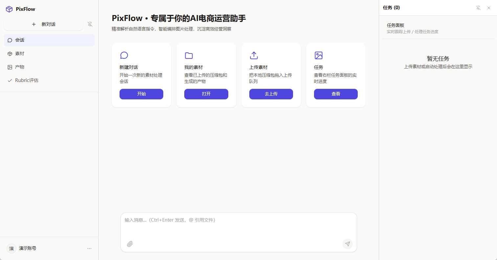
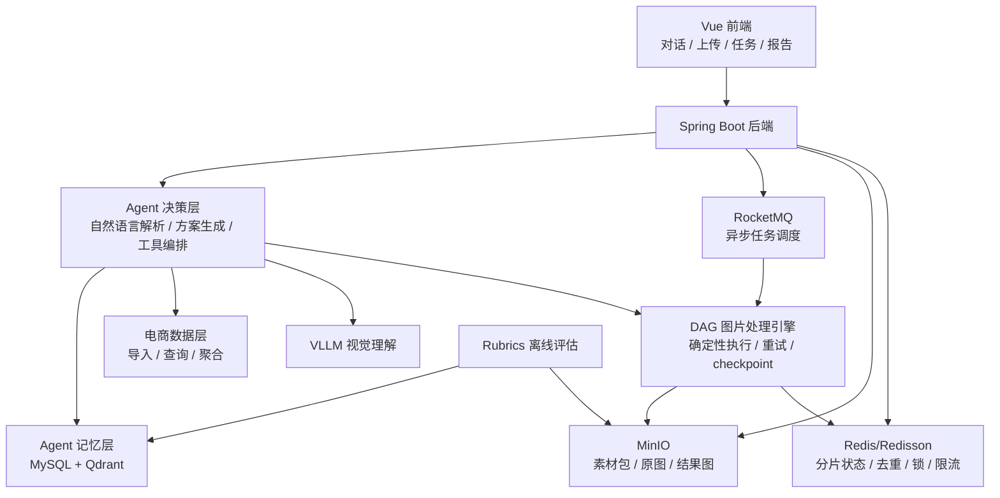

# PixFlow 电商运营助理 Agent


PixFlow 是一个面向电商运营场景的 Agent 平台，支持大文件稳定上传、自然语言驱动的图片批量智能处理、电商数据分析与报告生成。系统将商品素材、电商指标、视觉理解、长期记忆和可编排图片处理工具整合到同一个工作流中，帮助运营人员用对话完成批量图片优化和数据化决策。

## 界面预览



## 技术栈

Spring Boot、MySQL、Redis/Redisson、RocketMQ、MinIO、Qdrant、Spring AI、Vue

## 核心功能

- 自然语言图片处理：Agent 可以解析类似“先换白底再裁 1:1”的指令，自动构建 DAG 图片处理链，并按节点顺序执行。
- 可编排处理节点：将背景更换、智能裁剪、图片压缩、水印、格式转换、AI 重绘等能力封装为可组合节点，支持批量图片处理。
- 异步任务调度：使用 RocketMQ 调度文件解压、图片处理、视觉富化和电商数据导入任务，将上传后的解析与处理从同步请求中解耦。
- 大文件稳定上传：采用分片上传与断点续传机制，通过 Redis 记录分片状态，保障 GB 级素材包在弱网环境下稳定上传。
- 内容去重与幂等：基于 Redis 和 SHA-256 做内容去重，避免相同图片重复上传、重复处理和资源浪费。
- 视觉理解：接入 VLLM 对商品图进行结构化分析，并在送入模型前完成图片降采样与格式归一，控制 API 调用成本。
- 断点恢复与重试：通过 checkpoint 记录任务进度，任务异常后可从最近断点恢复，避免整条链路重复计算和 token 浪费。
- API 成本控制：基于 Redis 实现令牌桶限流与指数退避重试，降低异常流量和第三方 API 抖动带来的成本风险。
- 电商数据分析：提供电商数据导入与查询能力，支持单商品数据查询、类目均值对比和趋势聚合。
- 运营报告生成：Agent 基于电商数据、商品图分析结果和历史经验生成结构化运营分析报告。
- Agent 记忆层：基于 MySQL + Qdrant 沉淀用户偏好、商品图处理历史和分析结论，通过混合检索自动召回，并引入衰减、强化和遗忘机制治理长期记忆。
- Rubrics 评估闭环：使用 LLM judge 对图片质量、文案质量和决策质量进行评估，驱动 Prompt 与工具设计持续迭代。

## 系统架构



## 图片处理流程

1. 用户上传素材包，前端按分片上传，后端通过 Redis 记录分片状态。
2. 文件上传完成后，系统发布 RocketMQ 任务，异步执行解压和素材解析。
3. Agent 读取用户自然语言指令，结合商品数据、历史记忆和图片分析结果生成处理方案。
4. 系统将处理方案编译为 DAG，节点可以包含换底、裁剪、压缩、格式转换、AI 重绘等操作。
5. 用户确认后，DAG 引擎按节点顺序执行，并在每个关键阶段记录 checkpoint。
6. 如果任务中断或部分节点失败，系统从最近断点恢复，并对异常节点执行重试或隔离。
7. 处理结果写入 MinIO，任务进度和状态通过 Redis、MySQL 和实时推送接口反馈给前端。

## 电商数据与报告

PixFlow 支持导入商品运营数据，并为 Agent 提供结构化查询能力：

- 单商品指标查询
- 类目均值对比
- 趋势聚合分析
- 商品图处理历史查询
- Rubrics 评分回写
- 结构化运营分析报告生成

Agent 在生成建议时可以引用数据依据，例如点击率低于类目均值、历史白底图处理效果、同类 SKU 的转化变化等，让图片处理建议不只依赖经验判断。

## 快速开始 (本地部署与启动)

### 环境依赖
- JDK 21+
- Maven 3.6+
- Node.js 18+ & pnpm
- Docker & Docker Compose

### 1. 启动基础设施
项目依赖 MySQL、Redis、RocketMQ、Qdrant 和 MinIO，推荐通过 Docker Compose 一键启动：
```bash
docker-compose up -d
```

### 2. 启动后端应用
后端是基于 Spring Boot 的 Maven 多模块项目，主服务位于 `pixflow-app` 模块下。
```bash
# 1. 在项目根目录执行打包
mvn clean install -DskipTests

# 2. 进入应用目录并启动
cd pixflow-app
mvn spring-boot:run
```

### 3. 启动前端应用
前端是一个基于 Vue 3 + Vite 的项目，位于 `pixflow-web` 目录下。
```bash
cd pixflow-web

# 1. 安装依赖
pnpm install

# 2. 启动开发服务器
pnpm run dev
```
启动成功后，浏览器访问控制台输出的地址（如 `http://localhost:5173`）即可使用 PixFlow。

## 项目状态

项目仍处于开发阶段，目标架构以 `docs/design-docs/` 下的设计文档和执行计划为准。当前 README 聚焦项目介绍、核心能力和架构说明，不代表所有能力都已作为稳定版本发布。

## 文档

- [总体设计文档](docs/design-docs/design.md)
- [设计文档目录](docs/design-docs/index.md)
- [Lint 与静态分析](docs/development/linting.md)
