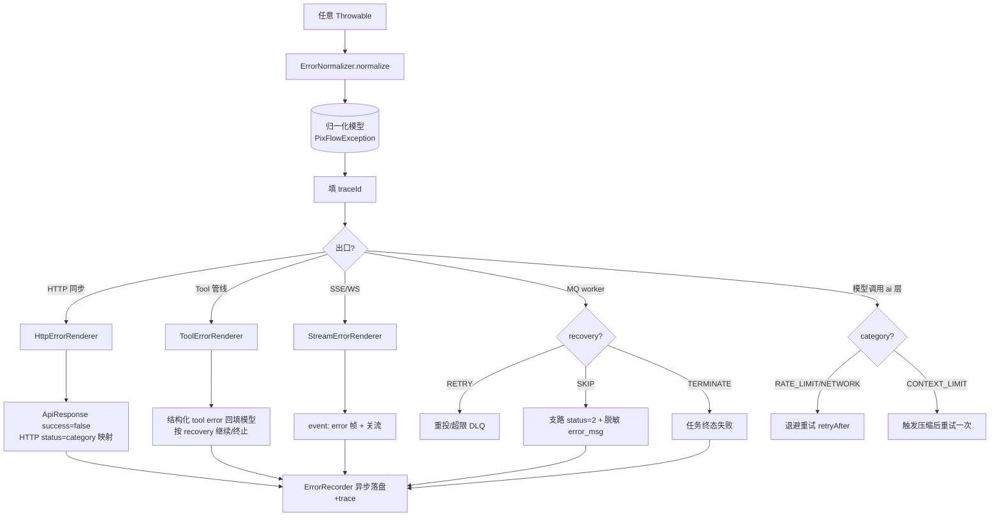

# common —— 统一错误处理与通用响应（Wave 0 地基）

> 本文是 PixFlow 完整重写阶段 `common` 模块的设计文档，对应 `design.md` 第十二章「业务模块划分」与 `module-dependency-dag-plan.md` 的 **Wave 0 地基**。
> 范围：统一错误处理、统一响应信封、分页、脱敏。本文不涉及 MVP 既有实现，从新架构需求重新推导。
> 思路参考 `docs/references/error-handling-architecture.md`（Python/OneCode），但**仅借鉴理念，全部以 Java 17 + Spring Boot 3 重新设计**。

---

## 目录

- [一、文档定位与设计原则](#一文档定位与设计原则)
- [二、为什么不是「拦截器中心」模型](#二为什么不是拦截器中心模型)
- [三、模块结构与依赖位置](#三模块结构与依赖位置)
- [四、归一化错误模型](#四归一化错误模型)
- [五、核心抽象](#五核心抽象)
- [六、多出口渲染器](#六多出口渲染器)
- [七、统一响应信封与分页](#七统一响应信封与分页)
- [八、各出口错误流时序](#八各出口错误流时序)
- [九、可观测性、脱敏与 traceId](#九可观测性脱敏与-traceid)
- [十、infra 异常收口策略](#十infra-异常收口策略)
- [十一、跨切进度通知 SPI](#十一跨切进度通知-spi)
- [十二、错误码目录约定](#十二错误码目录约定)
- [十三、对其他模块的契约](#十三对其他模块的契约)
- [十四、测试策略](#十四测试策略)
- [十五、暂不考虑](#十五暂不考虑)

---

## 一、文档定位与设计原则

`common` 是依赖 DAG 的最底层节点（Wave 0），被 `infra` / `harness` / `module` / `agent` 全量依赖，因此**只承载归一化契约与无业务知识的横切能力**，不得反向依赖任何上层模块。

错误处理专属设计原则：

1. **归一化优先**。任何异常一旦跨出其产生边界，就被归一化为统一的**错误模型**（`PixFlowException` 承载）。下游消费者只读模型，绝不回头 `instanceof` 原始异常。
2. **分类驱动行为**。重试 / 跳过 / 终止 / 压缩等跨切行为只依赖标准化的 `ErrorCategory` 与 `RecoveryHint`，不依赖具体业务码或底层库类型。
3. **多出口平权**。HTTP 响应只是众多错误出口之一。Tool error、流式 error 帧、MQ 投递判定与 HTTP 渲染地位平等，共享同一归一化模型。
4. **安全边界不靠文案**。`PERMISSION` 类错误（权限层硬 deny、确认令牌）天然不可重试、不可被降级，渲染时不暴露内部细节。
5. **内外分离 + 脱敏**。对外只给 `safeMessage` + `traceId` + 结构化 `details`；内部原文与堆栈进错误日志/trace，落盘前必经脱敏。
6. **码分散、契约统一**。错误码按模块自治（接口化），`common` 只定义契约与通用码，避免单一巨枚举成为并行开发瓶颈。

---

## 二、为什么不是「拦截器中心」模型

传统 Spring 项目把 `@RestControllerAdvice` 当错误处理的中心，隐含假设是「所有错误最终汇成一个 HTTP 响应」。这个假设在 PixFlow 不成立——系统有多个并列的错误消费者：

| 消费者 | 所属层 | 它要做的决策 |
|---|---|---|
| Tool 执行管线 | `harness/tools` | handler 抛错 → 结构化 tool error 回填模型，不崩主循环 |
| 模型重试器 | `infra/ai` | NETWORK/RATE_LIMIT → 退避重试；其余放弃 |
| 上下文压缩器 | `harness/context` | CONTEXT_LIMIT → 触发 reactive 压缩后再战 |
| FailureIsolator | `module/dag` | 支路工作单元失败 → 隔离该支路，其余继续 |
| MQ worker | `module/task` | ack / 重投 / 进 DLQ |
| SSE / WebSocket | app 级传输实现，各模块经 SPI 发布 | 流式中途出错 → 推 error 帧；进度事件 → 推 progress 帧 |
| HTTP 控制器 | 各 controller | 同步请求 → HTTP 状态码 + 响应体 |
| 可观测 | `harness/eval` | 打点、落错误日志、回放 |

因此中心不是拦截器，而是 **`ErrorNormalizer` + 归一化模型**；`@RestControllerAdvice` 降级为一个**渲染器**。

---

## 三、模块结构与依赖位置

源码包：`com.pixflow.common`

```
common/
├── error/
│   ├── ErrorCategory.java        # 领域分类（含默认 RecoveryHint / 默认 HTTP）
│   ├── RecoveryHint.java         # RETRY / SKIP / TERMINATE / COMPACT
│   ├── ErrorCode.java            # 接口：code / category / httpStatus / messageKey
│   ├── CommonErrorCode.java      # 通用码 enum（INTERNAL / INVALID_PARAM / NOT_FOUND ...）
│   ├── PixFlowException.java     # 归一化模型的异常载体（基类）
│   ├── BusinessException.java    # 4xx 业务规则违例（extends PixFlowException）
│   ├── ErrorNormalizer.java      # 任意 Throwable → PixFlowException
│   └── render/
│       ├── HttpErrorRenderer.java    # @RestControllerAdvice，HTTP 出口
│       ├── ToolErrorRenderer.java    # → 结构化 tool error（给模型）
│       └── StreamErrorRenderer.java  # → SSE / WS error 帧
├── sanitize/
│   └── Sanitizer.java            # mask token/AK-SK、相对化路径、截断
├── web/
│   ├── ApiResponse.java          # 统一响应信封（成功/失败同构）
│   ├── ErrorPayload.java         # 失败时的 code/message/details
│   ├── Pagination.java           # 入参校验
│   └── PageResponse.java         # 分页出参（嵌于 ApiResponse.data）
├── observability/
│   └── ErrorRecorder.java        # SPI 接口；落盘/trace 由 harness/eval 实现
└── progress/
    └── ProgressNotifier.java     # SPI 接口；进度推送传输由 pixflow-app 实现
```

依赖方向：`common` 不依赖任何上层；`observability/ErrorRecorder` 与 `progress/ProgressNotifier` 仅是接口，实现分别由 `harness/eval` 与 `pixflow-app` 注入（依赖倒置，避免 common → eval/app 反向依赖）。

---

## 四、归一化错误模型

所有出口消费的统一模型，由 `PixFlowException` 承载字段：

| 字段 | 类型 | 含义 | 消费者 |
|---|---|---|---|
| `code` | `ErrorCode` | 细粒度业务码（自带 category / httpStatus） | HTTP、流式、文案展示 |
| `category` | `ErrorCategory` | 领域分类（由 code 推导） | 全部跨切行为路由 |
| `recovery` | `RecoveryHint` | 控制流指令 | Tool 管线、MQ worker、loop |
| `safeMessage` | `String` | 脱敏后对外文案 | HTTP、流式、tool error |
| `internalMessage` | `String` | 内部原文（含上下文） | 错误日志、trace |
| `details` | `Map<String,Object>` | 结构化现场 | 程序化处理、前端定位 |
| `retryAfter` | `Duration`（可空） | 退避时长 | RATE_LIMIT 重试器 |
| `traceId` | `String` | 调用链关联 | 全部出口 + 可观测 |
| `cause` | `Throwable` | 原始异常 | 错误日志 |

`category` 与 `recovery` 不强制每次手填：`code` 决定 `category`，`category` 给出**默认** `recovery`，构造异常时可覆盖。

---

## 五、核心抽象

### 5.1 `ErrorCategory` —— 领域分类轴

横切分类，每一类预置「默认 RecoveryHint」与「默认 HTTP 状态」。`recovery` 决定**非 HTTP 出口**的控制流，HTTP 出口只看状态映射。

| Category | 默认 Recovery | 默认 HTTP | retryAfter | 典型来源 |
|---|---|---|---|---|
| `VALIDATION` | TERMINATE | 400 | - | 参数、DAG 结构/schema 校验失败 |
| `BUSINESS_RULE` | TERMINATE | 409 | - | 状态不符、素材包被任务引用、组张数不符 |
| `NOT_FOUND` | TERMINATE | 404 | - | 对话/素材包/任务/结果不存在 |
| `PERMISSION` | TERMINATE | 403 | - | 权限层硬 deny、确认令牌缺失/失效 |
| `RATE_LIMIT` | RETRY | 429 | 有 | 第三方抠图/生图/LLM 限流 |
| `NETWORK` | RETRY | 504 | - | 连接失败、超时 |
| `PROVIDER` | RETRY | 502 | - | 供应商 5xx、模型返回非法 |
| `CONTEXT_LIMIT` | COMPACT | 500 | - | 上下文超窗（一般不冒泡到 HTTP） |
| `STORAGE` | RETRY | 500 | - | MinIO / 文件 I/O |
| `IMAGE_PROCESSING` | SKIP | 500 | - | 编解码、像素工具失败（支路隔离） |
| `TOOL` | SKIP | 500 | - | Agent 级工具 handler 运行时异常 |
| `DEPENDENCY` | RETRY | 503 | - | MySQL/Redis/MQ/Qdrant 不可用 |
| `INTERNAL` | TERMINATE | 500 | - | 兜底未预期异常 |

> 默认值是「兜底建议」，不是铁律。例如某个 `PROVIDER` 错误明确不可重试时，构造异常时把 `recovery` 覆盖为 `TERMINATE`。

### 5.2 `RecoveryHint` —— 控制流指令

```java
public enum RecoveryHint {
    RETRY,      // 可安全重试，消费者按自身退避策略处理
    SKIP,       // 不可重试；隔离当前工作单元/工具调用，流程其余部分继续
    TERMINATE,  // 不可重试；终止当前执行单位（HTTP 请求 / Agent 一轮 / 整任务）并上报
    COMPACT     // 先触发上下文压缩，再重试一次
}
```

各消费者对 `RecoveryHint` 的解释：

| 消费者 | RETRY | SKIP | TERMINATE | COMPACT |
|---|---|---|---|---|
| Tool 管线 | 重试该工具调用 | 返回 tool error，循环继续 | 终止本轮 | n/a（由 ai 层先消化） |
| MQ worker | nack 重投（≤上限）否则 DLQ | 标记该支路失败，继续其余 | 整任务失败 | n/a |
| FailureIsolator | 整支路重算 | 该支路 `status=2`，其余继续 | 上抛 | n/a |
| 模型重试器 | 退避重试 | n/a | 放弃并上抛 | 压缩后重试一次 |

### 5.3 `ErrorCode` —— 接口化业务码

```java
public interface ErrorCode {
    String code();              // 稳定字符串标识，作为响应 code 字段（如 "DAG_CYCLE_DETECTED"）
    ErrorCategory category();   // 决定 HTTP 映射与默认 recovery
    default HttpStatus httpStatus() { return category().defaultHttpStatus(); }
    default String messageKey() { return code(); }  // i18n 文案 key，默认与 code 同名
}
```

- 各模块定义自己的 `enum implements ErrorCode`（如 `DagErrorCode`、`TaskErrorCode`、`PermissionErrorCode`）。
- `common` 仅提供 `CommonErrorCode`（通用兜底码）。
- HTTP 状态由 `category` 统一推导，**业务码无需逐个声明状态**，消除 MVP 式「码与状态手工绑定」的重复。
- 文案走 i18n（`messageKey` → `MessageSource`），支持中英；`details` 提供占位参数。

`CommonErrorCode` 初始集合：

| code | category |
|---|---|
| `INTERNAL_ERROR` | INTERNAL |
| `INVALID_PARAM` | VALIDATION |
| `RESOURCE_NOT_FOUND` | NOT_FOUND |
| `PERMISSION_DENIED` | PERMISSION |
| `DEPENDENCY_UNAVAILABLE` | DEPENDENCY |
| `RATE_LIMITED` | RATE_LIMIT |

### 5.4 `PixFlowException` —— 归一化载体

```java
public class PixFlowException extends RuntimeException {
    private final ErrorCode code;
    private final Map<String, Object> details;     // 不可变拷贝
    private final RecoveryHint recoveryOverride;    // null = 用 category 默认
    private final Duration retryAfter;              // 可空
    private String traceId;                         // 出口处填充（见 §9）

    public ErrorCategory category() { return code.category(); }

    public RecoveryHint recovery() {
        return recoveryOverride != null ? recoveryOverride : code.category().defaultRecovery();
    }

    // builder 风格构造，支持 code / message 覆盖 / details / cause / retryAfter
}
```

- `BusinessException extends PixFlowException`：语义糖，约束只用于 4xx 业务规则违例（VALIDATION / BUSINESS_RULE / NOT_FOUND / PERMISSION），服务层显式抛出。
- `internalMessage` 取 `getMessage()`，`safeMessage` 由渲染器经 `Sanitizer` + i18n 产出，不存在异常对象里（避免提前脱敏丢信息）。

### 5.5 `ErrorNormalizer` —— 边界归一化

把任意 `Throwable` 映射为 `PixFlowException`，对应参考架构的 `to_error`。在每个**非 HTTP 出口**与 HTTP 出口共用：

```java
public PixFlowException normalize(Throwable t) {
    if (t instanceof PixFlowException e) return e;          // 已归一化，直接用
    // Spring 框架异常
    if (t instanceof MethodArgumentNotValidException e) ... // → INVALID_PARAM + field details
    if (t instanceof MaxUploadSizeExceededException e) ...  // → 文件超限码
    // JDK / 基础设施
    if (t instanceof TimeoutException) ...                  // → NETWORK
    // 兜底
    return new PixFlowException(CommonErrorCode.INTERNAL_ERROR, t);
}
```

映射规则集中维护；infra 专属异常的处理见 [§10](#十infra-异常收口策略)。

### 5.6 `Sanitizer` —— 脱敏

落盘/对外前必经，三类处理：

1. **凭证遮蔽**：正则替换 `Bearer\s+\S+`、`sk-[A-Za-z0-9]+`、阿里云 `LTAI...` AK 及 SK 串 → `***`。
2. **路径相对化**：绝对路径（`D:\...`、`/var/...`）相对化为 workspace 相对或标记 `<external>`；MinIO key 保留（非敏感）。
3. **截断**：超长 message / details 值截断（默认 1000 字），供 `process_result.error_msg`（design 约定 ≤1000 字）等场景直接复用。

---

## 六、多出口渲染器

渲染器不产生新错误，只把归一化模型「翻译成某出口的形态」。三个渲染器 + 一处非渲染消费（MQ）。

### 6.1 `HttpErrorRenderer`（`@RestControllerAdvice`）

```
Throwable → ErrorNormalizer.normalize → 填 traceId
  → Sanitizer 出 safeMessage（i18n） → ApiResponse.error(...)
  → HTTP status = code.httpStatus()
  → 日志：5xx category 记 error，其余记 warn
  → ErrorRecorder.record（异步，含内部原文 + 栈）
```

### 6.2 `ToolErrorRenderer`（给模型）

`harness/tools` 的 handler 抛错时调用，产出结构化 tool error 回填模型上下文：

```json
{ "isError": true, "category": "PROVIDER", "message": "<safeMessage>", "recovery": "SKIP" }
```

主循环据 `recovery` 决定继续/终止；模型看见 `message` 自行决策后续动作。**绝不把堆栈或内部原文喂给模型**（污染上下文 + 泄露）。

### 6.3 `StreamErrorRenderer`（SSE / WS）

流式响应中途出错无法用 HTTP status 表达，改推一个 error 事件帧：

```
event: error
data: { "code": "...", "message": "<safeMessage>", "traceId": "..." }
```

之后正常关闭流。

### 6.4 MQ 投递判定（非渲染，直接消费模型）

`module/task` 的消费者 catch → `normalize` → 读 `recovery`：

- `RETRY` → 返回 RocketMQ 重投决策，超限进 DLQ
- `SKIP` → 当前支路 `process_result.status=2` + 脱敏 `error_msg`，ack，继续
- `TERMINATE` → 任务终态失败，ack

---

## 七、统一响应信封与分页

成功与失败**同构**，前端单一解析路径。

### 7.1 `ApiResponse<T>`

```java
public record ApiResponse<T>(
    boolean success,
    String code,            // 成功固定 "OK"；失败为 ErrorCode.code()
    String message,         // 成功可空；失败为 safeMessage
    T data,                 // 成功负载；失败为 null
    Map<String,Object> details,  // 失败结构化现场；成功为 null
    String traceId
) {
    public static <T> ApiResponse<T> ok(T data) { ... }
    public static <T> ApiResponse<T> error(PixFlowException e, String safeMessage) { ... }
}
```

成功：
```json
{ "success": true, "code": "OK", "message": null, "data": { ... }, "traceId": "a1b2" }
```
失败：
```json
{ "success": false, "code": "DAG_CYCLE_DETECTED", "message": "DAG 存在环，无法执行",
  "data": null, "details": { "cycleNodes": ["n3","n5"] }, "traceId": "a1b2" }
```

`@JsonInclude(NON_NULL)`：`message` / `data` / `details` 为空不序列化。

### 7.2 分页

`PageResponse<T>` 嵌于 `ApiResponse.data`：

```java
public record PageResponse<T>(List<T> records, long total, long page, long size) { ... }
```

`Pagination.of(Long page, Long size)`：`null` 回退默认（page=1, size=20），约束 `page≥1`、`size∈[1,100]`，越界抛 `BusinessException(CommonErrorCode.INVALID_PARAM)` 带 `details{page,size,maxSize}`。各列表端点统一以 `Pagination` 收口。

最终列表响应形如 `ApiResponse<PageResponse<T>>`。

---

## 八、各出口错误流时序



要点：无论从哪个出口走，**归一化只发生一次**（已是 `PixFlowException` 则直接透传），`traceId` 贯穿，`ErrorRecorder` 统一收尾。

---

## 九、可观测性、脱敏与 traceId

### 9.1 Trace 与 Error 日志分离

- **控制台/对外**：仅简短事件 + `safeMessage` + `traceId`，不刷堆栈。
- **Error 日志/trace**：完整 `internalMessage` + 栈 + `details`，经 `Sanitizer` 后由 `ErrorRecorder` 落库（`harness/eval` 的 `agent_trace` / 专用错误表）。
- `common` 只定义 `ErrorRecorder` SPI；`harness/eval` 提供实现并注入，保持依赖单向。

### 9.2 traceId：Micrometer Tracing + 异步边界手动透传

- **基座**：Micrometer Tracing（Brave/OTel 桥接），自动生成 traceId/spanId、注入 MDC（日志 `%X{traceId}`）、自动覆盖同步 HTTP 链路与 `@Async`。
- **手动透传的两个边界**（Micrometer 不自动覆盖）：
  - **RocketMQ**：生产时把 traceId 写入 user properties；消费时取出重建 span，使任务执行链与提交请求关联。
  - **SSE/WebSocket**：长连接帧内携带 traceId。
- **与业务回合维度并存**：`agent_trace.conversation_id + turn_no` 是「业务回合」维度（供 Rubrics/回放）；`traceId` 是「技术调用链」维度（供排障）。两者不合并。

### 9.3 指标

`ErrorRecorder` 实现侧用 Micrometer 计数：`pixflow.error.count{category, code, recovery}`，供 Actuator/监控面板观察错误分布与重试率。

---

## 十、infra 异常收口策略

采用**混合策略**（讨论中的方案 c）：该早带分类的早带，该延迟翻译的延迟。

| 异常 | 处理方式 | 理由 |
|---|---|---|
| 第三方限流/网络/供应商错误（`infra/thirdparty`、`infra/ai`） | **源头即构造** 带 category（RATE_LIMIT/NETWORK/PROVIDER）+ retryAfter 的 `PixFlowException` | Resilience4j 与模型重试器需尽早拿到 retryable 信息 |
| `ImageProcessingException`（`infra/image`） | **保持独立** 纯领域异常，由 `ErrorNormalizer` 在边界翻译为 IMAGE_PROCESSING | `FailureIsolator` 已按此具体类型做支路隔离判定，不污染底层纯粹性 |
| `StorageException`（`infra/storage`） | 保持独立，边界翻译为 STORAGE | 同上，底层只懂 I/O |
| JDK / Spring 框架异常 | `ErrorNormalizer` 统一映射 | 集中维护映射表 |

原则：**infra 内部模块互相 catch 用自己的具体类型**（语义清晰），只在**跨出 infra 边界**或进入某出口时归一化一次。

---

## 十一、跨切进度通知 SPI

`ProgressNotifier` 是跨模块发布进度事件的最小接口。它解决的问题是：底层或业务模块需要告诉前端「某个长任务进度更新了」，但这些模块不应该直接依赖 WebSocket、STOMP、SSE 或 `SimpMessagingTemplate` 等传输实现。接口放在 `common`，实现放在上层应用装配处，保持依赖方向单向。

接口形态：

```java
public interface ProgressNotifier {
    void publish(String channel, Object event);
}
```

- `channel` 是逻辑频道键，不包含传输前缀。例如 file 模块发布素材包解压进度时使用 `packages/{packageId}/progress`。
- `event` 是可序列化事件对象，由发布模块定义。事件内应携带业务 id、当前进度、总数、状态与 traceId。
- `common` 不引入 `spring-messaging`，也不拼 `/topic/`、`event:` 等传输细节。
- `pixflow-app` 提供生产实现，例如 `StompProgressNotifier` 内部把 `channel` 映射为 `/topic/{channel}` 并调用 `SimpMessagingTemplate.convertAndSend(...)`。
- 测试或无 WebSocket 环境可注入 no-op 实现。进度事实源仍必须落在对应业务表或状态读模型中；推送只是 best-effort 实时层，不能作为唯一事实源。

该 SPI 与 `ErrorRecorder` 属于同一类依赖倒置接缝：接口在 `common`，实现由更高层模块注入。它允许 `module/file` 在 Wave 2 复用 app 级 WebSocket 通道，而不反向依赖 Wave 4 的 `module/task` / `module/conversation`。

---

## 十二、错误码目录约定

码接口化、按模块自治，但需保证全局可审计：

- **命名**：`UPPER_SNAKE_CASE`，模块内唯一；建议加模块前缀避免歧义（`DAG_CYCLE_DETECTED`、`TASK_NOT_FOUND`）。
- **单一职责**：每个码声明 `category`，HTTP 状态由 category 推导，禁止逐码手绑状态。
- **全局视图**：不再依赖单一巨枚举。改由一个聚合测试在启动期扫描所有 `ErrorCode` 实现，校验：① code 全局唯一；② 每个 code 有对应 i18n 文案 key；③ 无 category 缺失。测试产物可导出为「错误码目录」文档（替代手工维护的大表）。
- **i18n**：`messages_zh.properties` / `messages_en.properties` 以 code 为 key，`details` 提供占位参数。

各模块的具体码清单在各自模块设计文档中维护（如 `module-dag.md`、`module-task.md`），`common` 不集中罗列业务码。

---

## 十三、对其他模块的契约

| 模块 | 契约 |
|---|---|
| `permission` | 硬 deny 抛 `PixFlowException(category=PERMISSION, recovery=TERMINATE)`；Hook 的 allow 不能覆盖 |
| `harness/tools` | handler 异常经 `ToolErrorRenderer` 转 tool error；按 `recovery` 决定继续/终止 |
| `harness/context` | 捕获 CONTEXT_LIMIT，触发压缩；不向上抛到 HTTP |
| `infra/ai` | 模型调用异常归一化为 NETWORK/RATE_LIMIT/PROVIDER/CONTEXT_LIMIT |
| `infra/thirdparty` | 源头构造带 category + retryAfter 的异常，配合 Resilience4j |
| `module/dag` | `DagValidator` 校验失败抛 VALIDATION 码；`FailureIsolator` 消费 `recovery` |
| `module/task` | MQ 消费按 `recovery` 做 ack/重投/DLQ；`error_msg` 用 `Sanitizer` 截断 |
| `harness/eval` | 实现 `ErrorRecorder` SPI，落 trace + 指标 |
| `pixflow-app` | 实现 `ProgressNotifier` SPI，把逻辑频道映射到实际 WebSocket/STOMP/SSE 目的地；没有实时推送能力时提供 no-op 实现 |
| `module/file` | 通过 `ProgressNotifier` 发布素材包解压进度，事实源仍是 `asset_package.status/image_count/extracted_count` |
| 所有 controller | 仅返回 `ApiResponse<T>`；异常交给 `HttpErrorRenderer`，不自行拼错误体 |

---

## 十四、测试策略

- **分类映射**：参数化测试覆盖每个 `ErrorCategory` → 默认 recovery / HTTP 状态。
- **归一化**：对每类被 `ErrorNormalizer` 识别的异常断言映射结果（含 Spring 框架异常、infra 独立异常）。
- **脱敏**：构造含 token / AK-SK / 绝对路径的样本，断言遮蔽与相对化、截断长度。
- **渲染器**：HTTP（MockMvc 断言 status + body 同构）、tool error（断言无堆栈泄露）、流式 error 帧。
- **`ProgressNotifier` SPI**：common 只验证接口可被 no-op/fake 实现消费；具体 STOMP 目的地映射由 `pixflow-app` 的测试覆盖。
- **码目录一致性**：启动期聚合测试校验 code 唯一性 + i18n 文案齐全 + category 非空。
- **MQ 投递判定**：用 recovery 三态驱动 ack/重投/DLQ 分支。

---

## 十五、暂不考虑

- 多租户隔离的错误视图（本期单租户）。
- 错误码的运行时热更新/远程配置。
- 跨服务分布式事务补偿（本期单体 + 以 MySQL 为事实源 + 可重建侧存储）。
- 面向终端用户的错误自助修复引导（前端层未来再做）。

## Revision Notes

2026-06-28 / Codex: 为 `module/file` 的生产级素材包解压进度推送新增 `ProgressNotifier` SPI 设计口径。接口放在 common，app 级实现具体 WebSocket/STOMP/SSE 传输，业务模块只发布逻辑进度事件；该调整保持 common 不依赖上层模块，也避免 Wave 2 的 file 反向依赖 Wave 4 的 task/conversation。
### 5.7 协作取消原语

`com.pixflow.common.concurrent` 提供不依赖 Reactor 或业务模块的协作取消契约：`CancellationSource` 负责发起取消，`CancellationToken` 负责查询、订阅和检查，`CancellationReason` 记录首个终止原因，`OperationCancelledException` 用于跨同步调用栈快速退出。

- `CancellationSource.cancel(reason)` 使用 CAS，只接受第一次取消；后续原因不能覆盖首因。
- `cancellationSignal()` 是只完成一次的 `CompletionStage<Void>`。消费者取消自己的订阅时不得反向 cancel 该公共 signal。
- `throwIfCancellationRequested()` 抛出的取消异常是生命周期控制信号，不是内部错误；调用方不得把它归一化成 tool error 或写入 `ErrorRecorder`。
- `CancellationToken.NONE` 只用于明确不可取消的离线入口和测试。conversation 的在线 Agent 回合必须传真实 token。
