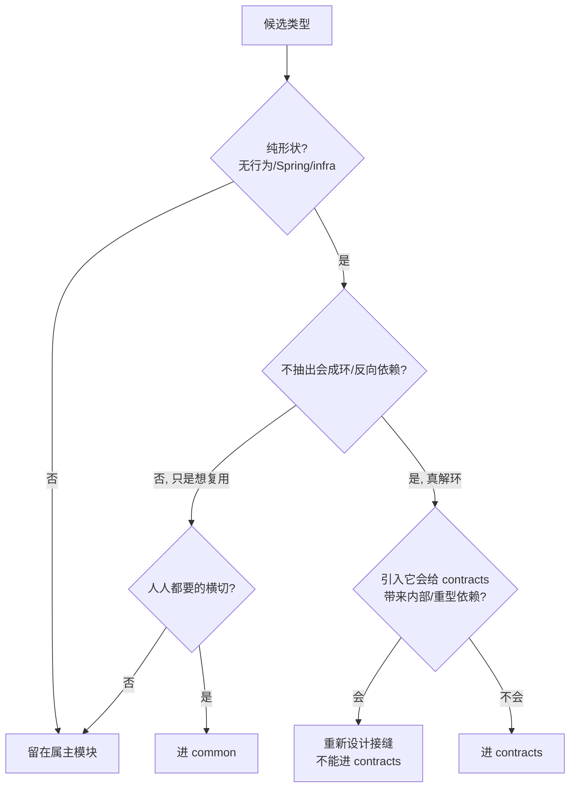

# contracts —— 跨模块共享契约（独立 Maven 模块，Wave 0 地基）

> 本文是 PixFlow 完整重写阶段 `contracts` 模块的设计文档，对应 `design.md` 第二章设计原则七「共享契约独立成模块」、第十二章「业务模块划分」，以及 `module-dependency-dag-plan.md` 的 **Wave 0 地基**。
> 范围：跨模块共享的**纯契约**——接口（SPI）、record、enum、常量。本文不涉及 MVP 既有实现（MVP 无此层），从新架构需求重新推导。
> 与 `common.md`、`permission.md`、`cache.md` 配套阅读：`common` 是人人依赖的横切地基，`contracts` 是把「会形成环」的兄弟模块解耦开的**倒置接缝**，二者定位不同（见 [§二](#二存在理由倒置接缝而非-dto-共享)）。

---

## 目录

- [一、文档定位与设计原则](#一文档定位与设计原则)
- [二、存在理由：倒置接缝，而非 DTO 共享](#二存在理由倒置接缝而非-dto-共享)
- [三、Option A：真正的 Maven 模块（编译期强约束）](#三option-a真正的-maven-模块编译期强约束)
- [四、准入准则（防止沦为垃圾场）](#四准入准则防止沦为垃圾场)
- [五、模块结构与包布局](#五模块结构与包布局)
- [六、确认令牌契约](#六确认令牌契约)
- [七、依赖关系：零依赖叶子](#七依赖关系零依赖叶子)
- [八、稳定性与演进策略](#八稳定性与演进策略)
- [九、从现状迁移](#九从现状迁移)
- [十、对其他模块的契约](#十对其他模块的契约)
- [十一、测试与约束守护](#十一测试与约束守护)
- [十二、暂不考虑](#十二暂不考虑)

---

## 一、文档定位与设计原则

`contracts` 与 `common` 并列处于依赖 DAG 的最底层（Wave 0）。但它**不是** `common` 的同类：`common` 承载人人都要的横切能力（错误归一化、响应信封、分页、脱敏），它带行为、带 Spring 渲染器；`contracts` 只承载「为了拆开两个互不应依赖的兄弟模块」而抽出的**纯形状**，不带任何行为。

`contracts` 专属设计原则：

1. **只放形状，不放行为**。仅定义接口（SPI）、record、enum、常量。**不出现**任何方法实现逻辑、Spring Bean、注解处理器、Redis/MySQL/序列化配置、业务流程。
2. **倒置优先，复用其次**。一个类型进入 `contracts` 的首要理由是**打破潜在依赖环**（依赖倒置），而不是「被多处复用」。复用但无环风险的类型留在其属主模块。
3. **零依赖叶子**。`contracts` 不依赖任何内部模块——**包括不依赖 `common`**。它只用 JDK 类型（`Instant`、`Duration`、`Optional` 等）。这样它是整个工程最稳定、绝不可能成环的根。
4. **不依赖业务，也不依赖基础设施**。`contracts` 不能依赖 `permission`、`task`、`dag`、`infra/*` 等任何上层或基础设施模块。
5. **稳定即契约**。它是编译期共享库（本期单体，无跨进程协议）；一旦发布，字段语义与签名的**语义级**向后兼容是硬要求，破坏性变更必须跨依赖方协同（见 [§八](#八稳定性与演进策略)）。
6. **小而克制**。当前只承载确认令牌契约。新增任何类型都必须过 [§四](#四准入准则防止沦为垃圾场) 的准入准则，宁缺毋滥。


---

## 二、存在理由：倒置接缝，而非 DTO 共享

`contracts` 唯一的结构性存在理由是**依赖倒置**，集中体现在确认令牌存储 SPI 上：

- `permission`（`harness/permission`）需要一个「保存令牌 + 原子消费令牌」的能力来完成 `verifyAndConsume`。
- 这个能力的真实实现是 Redis，归属 `infra/cache`。
- 但 `permission → infra/cache` 会让安全边界反向依赖基础设施实现；`infra/cache → permission` 又会让地基依赖业务。两条边都不可接受。

解法：把 **`ConfirmationTokenStore` SPI** 放进中立的零依赖叶子 `contracts`：

```text
           contracts.ConfirmationTokenStore (SPI)
                 ▲                        ▲
        实现/校验 │                        │ 提供实现
   permission ───┘                        └─── infra/cache (RedisConfirmationTokenStore)
```

`permission` 面向 SPI 编程、`infra/cache` 提供实现、Spring 在装配期注入——两个兄弟模块**谁都不依赖谁**。这就是 `contracts` 的核心价值。

由此引出一个判断准则：**DTO 是搭 SPI 便车进来的，不是主角。** `TokenClaims`、`ConfirmationToken`、`ConfirmationAction`、`ConfirmationLevel` 之所以在 `contracts`，仅仅因为 `ConfirmationTokenStore` 的方法签名要引用它们。没有 SPI 牵引、单纯「想共享」的 DTO 不应进来（见 [§四](#四准入准则防止沦为垃圾场)）。

### `contracts` 与 `common` 的边界

| 维度 | `common` | `contracts` |
|---|---|---|
| 谁依赖它 | **所有人**（infra/harness/module/agent 全量） | 只有**特定的、会成环的兄弟对**（当前：permission + infra/cache） |
| 内容 | 横切能力：错误模型、响应信封、分页、脱敏（**带行为/Spring 渲染器**） | 纯形状：SPI + record + enum（**零行为**） |
| 依赖 | JDK + Spring（渲染器需要） | **仅 JDK，零内部依赖** |
| 进入理由 | 这是「人人都需要的通用基建」 | 这是「为打破某条依赖环而抽出的接缝」 |

一句话：**需求「通用」就进 `common`；需求「解环」才进 `contracts`。**

---

## 三、Option A：真正的 Maven 模块（编译期强约束）

`contracts` 采用**真正的独立 Maven 模块**（reactor 子模块），而非「单 artifact 内靠约定/ArchUnit 守护的包」。理由：`contracts` 的全部价值是「保证它看不见上层类型」，唯有把它做成独立 artifact，才能让**编译器**来兜这条底线——`contracts` 的 classpath 里根本没有 `permission`/`infra` 的类，想违规也 import 不进来。约定 + 测试是事后拦截，编译期不可达才是硬约束。

### 3.1 目标 reactor 形态（contracts 视角）

整个工程演进为多模块 reactor（父 POM `packaging=pom` 聚合 `common`、`contracts`、各 `infra/*`、`harness/*`、`module/*`、`agent`）。完整 reactor 拆分属于独立的「多模块化构建改造」工作项，本文只锁定 **`contracts` 子模块自身**的形态：

```text
pixflow (parent, packaging=pom)
├── pixflow-common        (com.pixflow.common)
├── pixflow-contracts     (com.pixflow.contracts)   ← 本模块
├── pixflow-permission    (com.pixflow.harness.permission)   依赖 contracts
├── pixflow-infra-cache   (com.pixflow.infra.cache)          依赖 contracts (+ common)
└── ...
```

### 3.2 `pixflow-contracts` 的 POM 约束

```xml
<artifactId>pixflow-contracts</artifactId>
<!-- 关键约束：
     1) 不声明任何 pixflow 内部依赖（零依赖叶子）。
     2) 不引入 Spring、Lombok、Jackson 等任何运行时/注解处理依赖。
     3) 仅 JDK 17；record 原生可用，无需 Lombok。
     4) reactor 层用 maven-enforcer 的 bannedDependencies 锁死，
        禁止本模块出现 com.pixflow:* 之外或任意上层依赖。 -->
```

- **不引 Lombok**：契约全部用 Java 17 `record`，天然不可变、`equals/hashCode/toString` 自带，无需注解处理；保持零注解处理器、零编译期魔法。
- **不引 Jackson**：契约不写序列化注解。令牌从不进 LLM 可见区、也不直接做 HTTP body（见 `permission.md §5.1`），其 JSON 序列化由 `infra/cache` 的 codec 在实现侧处理，契约层不绑定任何序列化框架。
- **enforcer 守护**：reactor 父 POM 对 `pixflow-contracts` 配置 `maven-enforcer-plugin` 的 `bannedDependencies`，把它钉死为叶子；这是对「编译期不可达」的二次保险。

---

## 四、准入准则（防止沦为垃圾场）

没有准入门槛，`contracts` 会被「看起来要共享」的类型逐渐塞满，最终变成隐形的上帝模块。准入是**硬规则、可测试**——一个类型进入 `contracts` 必须**同时**满足：

1. **纯形状**：是 interface / record / enum / 常量类；无行为实现、无 Spring、无 infra、无业务流程。
2. **真解环**：被**两个及以上、彼此不应互相依赖**的模块共享，且不抽出就会形成依赖环或反向依赖。仅仅「被多处复用」不够。
3. **不破坏叶子**：引入它不会给 `contracts` 带来任何内部模块或重型框架依赖。

三条缺一不可。配套的**排除项**（明确不进 `contracts`）：

- **属主明确、消费者都在下游**的类型 → 留在属主模块。例：`module/dag` 的 DAG DTO 被 `module/task` 消费，这是合法的**向下依赖**（task → dag），不存在环，DAG DTO 留在 `dag`，不进 `contracts`。
- **人人都要的横切能力** → 进 `common`（`ApiResponse`/`ErrorCode`/`PageResponse`/`Sanitizer` 等），不进 `contracts`。
- **带行为的服务**（如 `ConfirmationTokenService`）→ 留在属主模块（permission），只把它**依赖的纯 SPI/DTO** 抽到 `contracts`。

判定流程图：



---

## 五、模块结构与包布局

源码根包：`com.pixflow.contracts`，按**主题子包**组织。当前只有确认令牌一个主题。

```text
pixflow-contracts/
└── src/main/java/com/pixflow/contracts/
    └── confirmation/
        ├── ConfirmationToken.java         # 不透明令牌句柄（record）
        ├── TokenClaims.java               # 令牌绑定载荷（record）
        ├── ConfirmationAction.java        # 受控动作枚举
        ├── ConfirmationLevel.java         # 确认级别枚举
        └── ConfirmationTokenStore.java    # 存储 SPI（倒置接缝核心）
```

约定：

- **按主题分子包**（`confirmation/`），不按类型种类分（不设 `dto/`、`enum/`、`spi/` 这种横切目录）。后续若出现新的解环主题，再加同级子包（如 `xxx/`），不在现有子包里堆叠不相关类型。
- 每个子包应当能对应到一条明确的「解环故事」（哪两个模块、为什么不能互相依赖）。讲不出这个故事的子包不该存在。

---

## 六、确认令牌契约

确认令牌是 PixFlow 生产级安全边界的核心机制（详见 `permission.md §五`、`design.md §6.3 / §13.3`）。`contracts` 只承载其中**与 LLM 物理隔离、需跨 permission/cache 共享的纯形状**；签发与校验的**行为**在 `permission`，Redis 存储**实现**在 `infra/cache`。

### 6.1 `ConfirmationToken`

不透明令牌句柄，只暴露 `tokenId`，不携带任何 claims——claims 存储侧（Redis）保管，避免令牌句柄本身泄露载荷。

```java
public record ConfirmationToken(String tokenId) {
    public ConfirmationToken {
        if (tokenId == null || tokenId.isBlank()) {
            throw new IllegalArgumentException("tokenId 不能为空");
        }
    }
}
```

> 这里的非空校验是**构造不变量**（值对象自洽），不是业务行为，符合「纯形状」原则——record 的 compact constructor 做参数防御是惯用法，不引入任何外部依赖。

### 6.2 `TokenClaims`

令牌绑定的真实执行载荷，是「确认便宜方案、执行贵方案」漂移的防线（与 `design.md §5.3`「服务端独立校验、不信任前端回传」一脉相承）。

```java
public record TokenClaims(
        ConfirmationAction action,    // SUBMIT_DAG / IMAGEGEN
        String conversationId,
        String packageId,
        String payloadHash,           // 规范化 DAG JSON 哈希；生图为 源图集+提示词 哈希
        ConfirmationLevel level,      // NORMAL / BULK
        int expectedCount,            // 签发时服务端算出的 图片×支路 总数
        Instant issuedAt,
        Instant expiresAt,
        String nonce                  // 单次使用标识
) { /* compact constructor 做非空/区间/时序校验 */ }
```

字段语义边界：

- `payloadHash` / `expectedCount` 的**计算**由各业务边界（conversation 确认端点、task 提交、imagegen）负责，`contracts` 只定义字段形状，不规定算法。
- `level` 与 `expectedCount` 配合支撑超阈值二次确认（BULK），阈值本身是 `permission` 的配置，不在契约里。
- 校验仅做值对象自洽（非空、`expectedCount ≥ 0`、`expiresAt > issuedAt`），**不做业务规则判断**（业务校验在 `ConfirmationTokenService`）。

### 6.3 `ConfirmationAction`

受确认闸门管辖的动作枚举。当前两个值（对应 `permission.md` 决策 Q4）：

```java
public enum ConfirmationAction {
    SUBMIT_DAG,   // 提交确定性 DAG 执行（"重跑"复用此值，以实际 DAG 载荷哈希区分）
    IMAGEGEN      // 生成式重绘
}
```

> 「重跑」不是独立动作：它在确定性路径上就是「再提交一次（可能裁剪过的）DAG」，复用 `SUBMIT_DAG` 闸门，`payloadHash` 以实际待执行支路集合计算，天然覆盖「只重跑失败支路」。

### 6.4 `ConfirmationLevel`

```java
public enum ConfirmationLevel {
    NORMAL,   // 常规确认
    BULK      // 超阈值（图片×支路 总数）二次确认
}
```

### 6.5 `ConfirmationTokenStore`（倒置接缝核心）

整个模块的存在理由。只描述「保存」与「原子消费」两个能力，**不暗示任何存储介质**：

```java
public interface ConfirmationTokenStore {
    void save(String tokenId, TokenClaims claims, Duration ttl);

    /** 原子读取 + 删除：并发下只有一次成功，杜绝重放/重复提交。 */
    Optional<TokenClaims> consume(String tokenId);
}
```

- **`consume` 的「原子读+删」语义是契约的一部分**（注释明确），实现方（`infra/cache`）必须用 Lua `GET+DEL` 或等价机制保证；这是「单次使用」防重放的根基。
- 契约不提供「查询不删除」的 peek 方法：避免出现「先看后用」的非原子使用模式，从 API 形状上堵死重放窗口。
- 测试替身：`permission` 自带一个 `InMemoryConfirmationTokenStore`（仅测试作用域）实现本 SPI，无需 Redis 即可跑令牌三态用例。

---

## 七、依赖关系：零依赖叶子

```text
            ┌──────────────┐
            │  contracts   │   仅依赖 JDK，零内部依赖
            └──────┬───────┘
        被依赖      │
   ┌───────────────┼────────────────┐
   ▼               ▼                 ▼
permission     infra/cache       (未来需解环的兄弟)
(实现校验)      (提供 Redis 实现)
```

- `contracts` **无任何入边**：不依赖 `common`、不依赖 infra、不依赖业务。
- `permission → contracts`：用契约签发/校验/消费令牌。
- `infra/cache → contracts`：提供 `RedisConfirmationTokenStore` 实现 SPI。
- `permission` 与 `infra/cache` 之间**无直接依赖**——这正是 `contracts` 要达成的解耦。

> `design.md §12` 与 `module-dependency-dag-plan.md` 的依赖图已同步去掉 `common → contracts` 边，`contracts` 在三处文档中统一为零依赖叶子（见 [§一](#一文档定位与设计原则) 末尾说明）。

---

## 八、稳定性与演进策略

`contracts` 是工程里最稳定的模块，但要**右尺寸**对待：本期是**单体**，`contracts` 是**编译期共享库**，不是跨进程线协议。因此：

1. **关注语义兼容，而非线兼容**。所有依赖方与 `contracts` 一起编译、一起部署，不存在新旧版本并存的进程边界。所以无需 protobuf/OpenAPI/版本号协议（见 [§十二](#十二暂不考虑)）；真正要守的是**语义**——不得悄悄改变 `payloadHash`、`expectedCount`、枚举值的含义。
2. **加性演进优先**。新增字段/枚举值优于修改既有字段；删除或改义字段视为破坏性变更。
3. **破坏性变更必须协同**。任何破坏性改动是一次跨 `permission` + `infra/cache` + 签发端点（`module/conversation`）的**协同提交**，不能单独改 `contracts`。
4. **enum 演进谨慎**：`ConfirmationAction`/`ConfirmationLevel` 新增值时，所有 `switch`/分支消费方（permission 评估、UI 展示）必须同步覆盖；契约层不放兜底逻辑。
5. **契约即文档**：字段语义以本文 + 类型上的 Javadoc 为准；语义变更必须先改文档再改码。

---

## 九、从现状迁移

当前代码与本设计存在偏差，需要一次定向迁移（实现阶段执行，本文先标清楚）：

**现状**：确认令牌相关类型全部物理位于 `com.pixflow.harness.permission.token` 包内（与 `ConfirmationTokenService` 混放），且工程是单 artifact。

**目标**：

| 类型 | 现位置 | 目标位置 | 去向 |
|---|---|---|---|
| `ConfirmationToken` | `harness.permission.token` | `contracts.confirmation` | **移入 contracts** |
| `TokenClaims` | `harness.permission.token` | `contracts.confirmation` | **移入 contracts** |
| `ConfirmationAction` | `harness.permission.token` | `contracts.confirmation` | **移入 contracts** |
| `ConfirmationLevel` | `harness.permission.token` | `contracts.confirmation` | **移入 contracts** |
| `ConfirmationTokenStore` | `harness.permission.token` | `contracts.confirmation` | **移入 contracts** |
| `ConfirmationTokenService` | `harness.permission.token` | 保持在 `permission` | **留下**（带行为，依赖 `PermissionContext`/`PermissionSubject`/`PermissionErrorCode`） |

迁移要点：

1. **先拉起 reactor**（父 POM + `pixflow-contracts` + `pixflow-common` 等子模块）是本迁移的前置（属「多模块化构建改造」工作项）。在 reactor 未就绪前，可先按包边界落位、用 ArchUnit 临时守护，但**最终形态以独立 artifact 为准**。
2. 包名从 `com.pixflow.harness.permission.token.*` 改为 `com.pixflow.contracts.confirmation.*`；`permission`/`infra/cache` 更新 import。
3. `ConfirmationTokenService` 留在 `permission`，改为依赖 `contracts.confirmation.*`；其内部对 `PermissionContext`/`PermissionSubject` 的引用不变（这些是 permission 自己的类型，**不进 contracts**）。
4. `InMemoryConfirmationTokenStore`（测试替身）随 `permission` 测试作用域走，实现 `contracts` 的 SPI。
5. `RedisConfirmationTokenStore` 落在 `infra/cache`，实现 `contracts` 的 SPI（见 `cache.md §三 confirmation/`）。

---

## 十、对其他模块的契约

| 模块 | 契约 |
|---|---|
| `common` | **无依赖关系**（contracts 是零依赖叶子，不依赖 common；common 也不依赖 contracts） |
| `permission` | 依赖 `contracts.confirmation.*` 完成令牌签发/校验/消费；`ConfirmationTokenService` 面向 `ConfirmationTokenStore` SPI 编程，不感知存储介质 |
| `infra/cache` | 提供 `RedisConfirmationTokenStore implements ConfirmationTokenStore`，保证 `consume` 的原子读+删（Lua）；不依赖 permission |
| `module/conversation` | 令牌**签发**入口（确认 REST 端点）使用 `TokenClaims`/`ConfirmationToken` 形状，但签发动作经 `permission` 的 service，不直接碰 store |
| `module/task` / `module/imagegen` | 提交/生图前由 permission 校验，业务侧只负责按真实载荷算 `payloadHash`/`count` 填入流程，消费的是 permission 行为而非直接用 contracts |
| reactor 父 POM | 对 `pixflow-contracts` 用 maven-enforcer `bannedDependencies` 锁死为叶子 |

**反向不变量**：`contracts` 对以上任何模块**零依赖、零业务词、零框架依赖**。

---

## 十一、测试与约束守护

`contracts` 几乎无行为，测试重心是**约束守护**而非逻辑覆盖：

- **值对象自洽**：`ConfirmationToken`（空 tokenId 抛错）、`TokenClaims`（非空/`expectedCount ≥ 0`/`expiresAt > issuedAt`）的 compact constructor 校验单测。
- **零依赖守护**：reactor 层 maven-enforcer `bannedDependencies` 保证 `pixflow-contracts` POM 不出现任何内部/重型依赖；CI 构建即校验（编译期不可达是第一道，enforcer 是第二道）。
- **依赖方向守护（过渡期）**：reactor 未完全拆分前，用 ArchUnit 断言 `com.pixflow.contracts..` 不依赖 `..permission..`/`..infra..`/`..module..`/`..agent..`/`..common..`，作为迁移期的临时底线。
- **SPI 契约测试归属实现方**：`consume` 的「原子读+删/单次消费/并发只一次成功」由 `infra/cache`（Testcontainers 真实 Redis）与 `permission`（InMemory 替身）各自验证；`contracts` 本身不含可测行为。
- **枚举完备性**：消费方（permission 评估、UI）对 `ConfirmationAction`/`ConfirmationLevel` 的 switch 覆盖由各自模块测试保证；契约层不兜底。

---

## 十二、暂不考虑

- **跨进程线协议**（protobuf / OpenAPI / 版本化协议 / 远程契约分发）：本期单体，contracts 是编译期共享库，无进程边界需要版本化。
- **业务级 DTO 聚合层**：不把各模块 DTO 往 contracts 汇总；只有「真解环」的纯形状才进来（见 [§四](#四准入准则防止沦为垃圾场)）。
- **契约的运行时热更新/远程配置**：契约是编译期产物，不存在运行时下发。
- **令牌签名/加密的契约化**：采用不透明 Redis 令牌（见 `permission.md §5.4`），无对外密钥与签名格式需进契约。
- **多租户/多账号相关的共享契约**：`design.md §16` 明确本期不做多账号。
