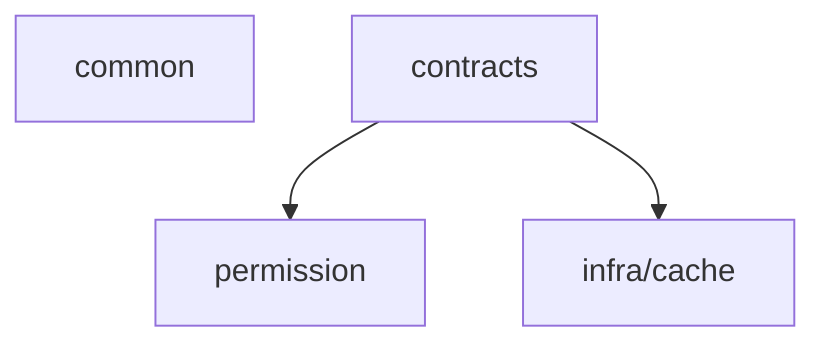

# PixFlow 电商运营 Agent — 总体设计文档

> 本文是 PixFlow 从「自然语言批量图片处理工具」演进为「电商运营 Agent」阶段的总体架构与技术选型设计。
> 需求来源：`requirement.md`；本阶段为**完整重写**，不以既有 MVP 实现为约束，仅复用其中经过验证的事实层结论（如像素工具清单、SKU 绑定规则）。

---

## 目录

- [一、文档定位与范围](#一文档定位与范围)
- [二、设计原则](#二设计原则)
- [三、总体架构](#三总体架构)
- [四、技术栈选型](#四技术栈选型)
- [五、Harness 横切层](#五harness-横切层)
- [六、Agent 决策层](#六agent-决策层)
- [七、RAG 记忆层](#七rag-记忆层)
- [八、电商数据接入层](#八电商数据接入层)
- [九、DAG 确定性执行引擎](#九dag-确定性执行引擎)
- [十、子 Agent 设计](#十子-agent-设计)
- [十一、Rubrics 评估（离线阶段）](#十一rubrics-评估离线阶段)
- [十二、业务模块划分](#十二业务模块划分)
- [十三、数据模型](#十三数据模型)
- [十四、异步执行时序](#十四异步执行时序)
- [十五、技术风险](#十五技术风险)
- [十六、暂不考虑](#十六暂不考虑)

---

## 一、文档定位与范围

PixFlow 面向电商运营人员，以对话窗口为唯一入口，由 Agent 消费用户指令与外部电商数据，在 Human-in-the-loop（HITL）约束下给出数据支撑的处理建议，确认后执行批量图片处理。系统以 **RAG 为记忆底座、DAG 引擎为确定性执行核心、子 Agent 为视觉/生成辅助、Rubrics 为离线评估闭环、Harness 为横切安全约束层**。

本文覆盖：总体架构、技术选型、Maven 多模块组织、Harness 六件套、Agent 决策循环、三类子 Agent、两条产图路径、RAG 记忆、电商数据接入、异步执行、数据模型、技术风险。

不覆盖（见 [十六](#十六暂不考虑)）：视频处理、计费限流、外部电商平台真实 API 对接、参数自动猜测、Rubrics 评估的具体评分细则（待数据集确定后单独设计）。

---

## 二、设计原则

1. **两层循环分离**。上层是 **Agent 决策循环**（非确定性，think-act-observe，驱动召回、分析、建议、确认、重跑决策）；下层是 **DAG 确定性执行引擎**（可预测、可测试的批处理底座）。DAG 执行是 Agent 决策循环里的一个动作，本身不是 Agent，绝不内嵌自主迭代。

2. **确定性底座不被污染**。Agent 永远不直接调用像素工具（`remove_bg`/`resize`…），它只「编译出 DAG 并请求确认执行」。两套工具严格分离（见 [5.2](#52-tool-registry)）。

3. **安全边界是硬约束，不是 Prompt 约束**。「Agent 无法自主拍板执行、必须等用户确认」「超阈值二次确认」等，由**权限层硬 deny** 实现，Agent 无法自签发确认令牌。Hook 只能观察/改写/软阻断，其 allow 不能覆盖权限层 deny。

4. **Harness 是横切 services 层，不是领域模块**。六件套贯穿执行各阶段，靠注册/注入接入，不按业务领域切分。

5. **测试/评估与主循环解耦**。Rubrics 评估是独立离线阶段，消费 Evaluation Interface 的 trace + 本地数据集，与主循环无关。主循环中的子 Agent 是辅助能力（视觉理解、生图），不是测试工具。

6. **完整项目标准**。对象存储、异步、断点恢复、可观测、韧性都按生产标准设计，不做 MVP 式简化。

7. **共享契约独立成模块**。跨模块只共享接口、record、enum 与纯 DTO，统一放入独立的 `contracts` Maven 模块；`common` 继续只承载错误处理、分页、脱敏等横切能力。

---

## 三、总体架构

```
┌────────────────────────────────────────────────────────────────┐
│                      Vue 3 前端（对话 / 文件 / 结果 / 评分展示）        │
└───────────────┬───────────────────────────┬────────────────────┘
        SSE(LLM流式) │                WebSocket/STOMP(进度推送) │  REST
┌───────────────▼───────────────────────────▼────────────────────┐
│                        Spring Boot 主后端                          │
│                        共享契约层 contracts                         │
│                                                                  │
│  ┌────────────────────── Agent 决策层 ──────────────────────┐    │
│  │  Execution Loop (think-act-observe, max iterations)       │    │
│  │  动态 Prompt 组装 + section 缓存                            │    │
│  │  自动记忆召回 + 动态 Prompt 组装                            │    │
│  │  Tool Registry(Agent级动作): search / read / agent /       │    │
│  │     submit_image_plan / submit_imagegen_plan / plan /      │    │
│  │     plan_exit                                              │    │
│  └───────┬─────────────┬──────────────┬───────────┬─────────┘    │
│          │             │              │           │              │
│  ┌───────▼──────┐ ┌────▼─────┐  ┌─────▼────┐ ┌────▼─────────┐    │
│  │ RAG 记忆层    │ │电商数据层 │  │ 子Agent   │ │ DAG 编译/校验 │    │
│  │ Qdrant+MySQL │ │本地集+API │  │视觉/生图   │ │              │    │
│  └──────────────┘ └──────────┘  └─────┬────┘ └────┬─────────┘    │
│                                       │           │ submit(确认后) │
│  ┌──────────────── Harness 横切层 ─────┼───────────┼───────────┐  │
│  │ Context Manager · Lifecycle Hooks · State Store · Eval IF  │  │
│  └────────────────────────────────────┼───────────┼──────────┘  │
└───────────────────────────────────────┼───────────┼─────────────┘
                                  调用第三方│    RocketMQ│(任务分发)
                          ┌──────────────▼──┐ ┌───────▼──────────┐
                          │ 抠图API/VLLM/生图  │ │ DAG 确定性执行引擎  │
                          │ /文本LLM(Spring AI)│ │ 分支展开+并发+失败隔离│
                          └──────────────────┘ └───────┬──────────┘
                                                       │
              ┌────────────┬──────────────┬───────────┼────────────┐
        ┌─────▼────┐ ┌─────▼─────┐ ┌──────▼─────┐ ┌───▼────┐ ┌─────▼────┐
        │ MySQL 8  │ │  Redis    │ │  Qdrant    │ │ MinIO  │ │ 离线Rubrics│
        │ 关系数据  │ │锁/断点/进度│ │ 向量检索   │ │对象存储 │ │ 评估(独立) │
        └──────────┘ └───────────┘ └────────────┘ └────────┘ └──────────┘
```

两条产图路径：
- **确定性路径**：Agent 编译 DAG → 确认 → DAG 引擎执行像素工具（抠图/换底/缩放/压缩/水印/格式转换/分组聚合）。
- **生成式路径**：Agent 综合数据+记忆+用户要求撰写生图提示词 → 生图子 Agent 以源图+提示词重绘新图。

---

## 四、技术栈选型

| 维度 | 选型 | 理由 |
|---|---|---|
| 后端框架 | Spring Boot 3 | 主体服务 |
| 工程组织 | Maven multi-module | `common`、`contracts`、`harness`、`module`、`infra`、`agent` 分层编译 |
| LLM 抽象 | **Spring AI + Spring AI Alibaba** | Spring 原生;一套抽象覆盖文本/多模态(Qwen-VL)/生图(通义万相)/嵌入;内置 Qdrant VectorStore;手写 Agent 循环只用其调用层 |
| 任务队列 | **RocketMQ** | topic/tag/consumer group 适合任务级与包级异步作业；支持可靠投递、消费重试、DLQ、延迟消息；与 MySQL 事实源恢复扫描配合形成至少一次处理 |
| 并发/缓存 | **Redis + Redisson** | 分布式锁(看门狗续期)、支路断点缓存、进度计数、第三方 API 限流(信号量) |
| 向量库 | **Qdrant** | 分析结论记忆的语义召回 |
| 关系库 | **MySQL 8 + MyBatis-Plus** | 任务/结果/记忆结构化数据/电商数据;向量交给 Qdrant 故无需换 PG |
| 对象存储 | **MinIO** | S3 兼容,可无缝切阿里云 OSS;原图/结果图/生图/大 tool-result 外置 |
| 去背景 | **第三方 API** | 抽象客户端封装(remove.bg / 阿里云智能抠图),HTTP 调用,无本地模型 |
| 图片处理 | **TwelveMonkeys ImageIO + Thumbnailator** | 纯 Java 补齐格式读取 + 高质量缩放;无原生依赖 |
| WebP 写出 | **scrimage(libwebp 绑定)** | 弥补 Java WebP 写出短板 |
| 第三方韧性 | **Resilience4j** | 重试/熔断/限流/舱壁,落地 Tool Registry 失败策略 |
| 实时推送 | **SSE + WebSocket(STOMP)** | SSE 做 LLM token 流式;WebSocket 做任务进度/完成通知;轮询兜底 |
| 可观测/Eval IF | **MySQL trace 表 + Micrometer/Actuator** | trace 表供 Rubrics 当数据查询+回放;Micrometer 补运维指标 |
| Token 计数 | **jtokkit** | Context Manager 预算裁剪 |
| 定时任务 | **Spring @Scheduled (+ ShedLock 多节点)** | 启动断点恢复扫描、延迟清理 |
| 文档解析 | **Apache POI + commons-csv** | 文案文档 + 电商数据导入 |
| 容器编排 | **Docker Compose** | 统一拉起 MySQL/Redis/RocketMQ/Qdrant/MinIO |
| 前端 | Vue 3 + Vite + Tailwind CSS + radix-vue + 自绘视觉层（见 [web.md](./web.md)） | 对话/文件/任务/Rubrics 评分展示；**浅色主题**，图标统一 SVG |

> 模型具体型号（文本 LLM、Qwen-VL、生图模型、embedding 模型）由配置承载，不在本文锁定——抽象层定了即可随时替换。

### 4.1 Windows 本地 Testcontainers 约束

**现象**：Windows + Docker Desktop 29.4.x 下，`mvn -pl pixflow-infra-cache -am test` 等 Testcontainers 集成测试在容器启动阶段抛 `Could not find a valid Docker environment`，本地复现稳定。

**根因**：Docker Desktop 29.4.x 把 `\\.\pipe\dockerDesktopLinuxEngine` 改成只读代理管道——Java 客户端 `GET /info` 收到 400/空壳响应，`Labels` 仅含 `com.docker.desktop.address=npipe://\\.\pipe\docker_cli`，不包含 Moby daemon 真实信息。docker-java 探测判定为「daemon 不可用」并抛错。该问题与 Docker daemon 状态无关——daemon 正常运行时仍触发。

**修复**：项目通过环境变量和 Maven profile 直接指定 Testcontainers 的 Docker 入口，绕过 Docker Desktop 29.4.x 的 read-only 代理管道问题。Windows 本地跑集成测试时使用 `-Pwindows-docker-tcp` 或直接设置 `DOCKER_HOST=npipe:////./pipe/docker_engine`，让 Testcontainers 走可用的本机命名管道或 TCP 入口。父 POM 同步锁定 docker-java 版本 `3.5.0`，规避 docker-java 端 Labels 回填 bug。

**备选**：仅在 Docker Desktop 未保留 `\\.\pipe\docker_engine`（极少数精简部署）下回退到 TCP：Docker Desktop 启用 `Expose daemon on tcp://localhost:2375 without TLS`，再用 `-Pwindows-docker-tcp` profile。`windows-docker-desktop-linux-npipe` profile 保留作 bug 回归对照，不再推荐日常使用。

---

## 五、Harness 横切层

Harness 是贯穿运行全生命周期的横切 `services` 层，由六个扩展点组成。它们靠注册/注入接入 Agent 决策循环与 DAG 引擎，不按业务领域切分。设计参照成熟 Agent runtime（tool runtime / hooks / context / compaction / subagents / prompts）的边界划分。

### 5.1 Execution Loop（执行主循环）

驱动 Agent 的 think-act-observe 主循环，是手写的显式循环（**不依赖 Spring AI 的自动 function-calling**，以便把 Tool Registry 执行管线、Hooks、Context Manager、权限拦截插入每一步）。

- 设置while true循环，有工具调用时继续，没有工具调用时输出最后的文本并终止循环。
- 每轮记录 ContextSnapshot（system prompt + 消息 + 可见工具 schema），异常可回溯。
- 单轮流程：组装 Prompt → 调 LLM（带可见工具 schema）→ 解析工具调用 → 经 Tool Registry 执行管线执行 → 观察结果回填 → 判断是否继续或自然结束（无工具调用即 TurnStopped）。
- 循环内每个动作节点须经 Lifecycle Hooks + 权限层校验后方可执行。

### 5.2 Tool Registry（工具注册表）

**关键边界：系统有两套完全独立的「工具」，绝不合并。**

| | Agent 级动作（本 Registry 管理） | DAG 级像素工具（DAG 引擎内部） |
|---|---|---|
| 例 | `search`、`read`、`agent`、`submit_image_plan`、`submit_imagegen_plan`、`plan`、`plan_exit` | `remove_bg`、`set_background`、`resize`、`compress`、`watermark`、`convert_format`、`generate_copy`、`compose_group` |
| 调用者 | Agent 决策循环 | DAG 执行引擎 |
| 校验 | 执行管线（schema→分类→权限→hook→handler→结果预算） | DAG 校验器（结构/白名单/参数 schema/无环） |
| 性质 | 非确定性决策动作 | 确定性处理单元 |

Agent **永不直接调像素工具**，只通过 `submit_image_plan` 提交待确认的 DAG 提案。该工具只校验并入确认队列，不执行像素处理；真实执行由用户确认后的 REST 边界触发。

Tool Registry 执行管线（每次工具调用串行 preflight）：
```
registry.get(name) → schema 校验 → 工具级 validate → 调用分类(classify)
→ 权限评估(deny-first) → PreToolUse hook(可改写输入,改写后重新校验)
→ handler 执行(Resilience4j 包裹) → 结果预算(超限外置 MinIO+返回引用)
→ PostToolUse/ToolError hook → 记录 trace
```
- **结果预算**：工具结果超阈值（默认 50KB）写 MinIO，模型只见引用+预览，防上下文膨胀。
- **失败策略**：handler 异常转结构化 tool error 回填模型，不让主循环崩溃；按 Tool Registry 注册的策略（重试/跳过/终止）处理。

### 5.3 Context Manager（上下文管理）

维护每轮对话的上下文质量与体积，超窗口时分两层治理（确定性 cheap pipeline + 摘要式 destructive compaction）。详见 `harness/context.md`。

- **运行期工作内存，持久化倒置给 session**。context 自身不直连 MySQL，只持有 append-only 内存链；落库经 `TranscriptPort` SPI 委托 `harness/session`（session 是 `message` 表唯一写者）。这对应依赖 DAG 中 `context → session` 的箭头方向。
- **多节点模型**：无状态后端每回合从 MySQL `message` 表 rehydrate 内存链，配可选 Redis 热缓存（`MessageChainCache` SPI，由 infra/cache 实现；可丢可重建、压缩时失效），不做会话-节点亲和。
- **cheap pipeline（确定性，每轮必跑、不改写链）**：大结果外置 MinIO（模型只见引用+preview）→ 投影滑窗（保留 tool call/result 配对，丢弃孤立 tool_result）→ microcompact（旧 tool result 降级占位符）→ jtokkit Token 估算。
- **destructive compaction（摘要式，超阈值/CONTEXT_LIMIT 触发，改写链）**：调 LLM 把历史摘要成「边界+摘要+tail」。LLM 摘要经 `SummarizationPort` SPI 倒置给 agent 层（fork 子 Agent 实现），context 不依赖 LLM 调用；触发分 AUTO/MANUAL/REACTIVE。
- **确定性兜底**：`SummarizationPort` 缺失或连续失败（断路器）时，回退按优先级裁剪——**保留顺序**：用户最新指令 > 当前任务状态 > Lifecycle Hooks 强规则 > 关键记忆片段 > 历史对话。这保证 context 可脱离 agent 层独立运行与属性测试。

### 5.4 State Store（状态存储）

持久化 Agent 运行状态与任务执行状态，支撑断点恢复。

| 存储 | 内容 |
|---|---|
| MySQL | 任务进度、已完成节点/支路（`process_result` 天然 checkpoint）、当前 DAG 结构、会话 transcript |
| Redis | 任务运行态、支路中间产物**引用**（节点完成标记 + MinIO key，非原始字节）、进度计数器、取消标志位、分布式锁、第三方信号量 |
| MinIO | 中间产物文件本体（字节落此）、外置大结果 |

> 中间产物存储边界：Redis 只放轻量引用（"某节点已完成，产物在 MinIO key X"），**原始图片/大字节一律落 MinIO**，避免 Redis 内存膨胀与序列化压力；真正的持久断点是 MySQL `process_result`，Redis 缓存只是同一次运行内避免重算的优化，可丢失可重建。

断点恢复策略见 [9.4](#94-断点恢复与失败隔离)。State Store 同时为任务调度提供状态查询接口（轮询/WebSocket 推送的数据源）。

### 5.5 Lifecycle Hooks（生命周期钩子）

在关键时机插入扩展点。**Hook 可阻断/改写/补充 metadata，但其 allow 不能覆盖权限层 deny——安全边界在权限层。**

核心事件：`UserPromptSubmit`、`PreToolUse`、`PostToolUse`、`ToolError`、`AssistantMessageCompleted`、`TurnStopped`、`TaskCreated`、`TaskCompleted`、`PreCompact`/`PostCompact`。

requirement 的强规则拦截落点：

| 拦截点 | 实现层 | 机制 |
|---|---|---|
| 生成建议后必须等用户确认，禁止自动执行 | **确认 REST 边界 + 权限层硬 deny** | `submit_image_plan` / `submit_imagegen_plan` 只产生待确认提案；真实执行只能由用户确认 REST 端点触发 |
| 大批量重处理二次确认（超阈值张数） | **确认 REST 边界 + 权限层硬 deny** | 超阈值执行在确认 REST 边界要求二次确认令牌 |
| 生图/重跑前用户确认 | **确认 REST 边界 + 权限层硬 deny** | 生图提案同样只入队；确认后带外执行 |
| DAG 参数异常检测 | PreToolUse hook + DAG 校验器 | 拦截非法参数 |
| Rubrics 评分低于阈值推送预警 | PostTaskExecution（离线阶段触发通知） | 观察 + 通知 |

### 5.6 Evaluation Interface（评估接口）

统一可观测接口，暴露每轮循环的输入输出、工具调用记录、记忆召回内容、上下文裁剪日志，写入 MySQL trace 表（JSON 列，可 SQL 查询、可回放）。

- 为 Rubrics 离线评估提供完整数据来源。
- 支持任务回放与问题追溯。
- Micrometer/Actuator 补充运维指标（QPS、延迟、错误率）。

---

## 六、Agent 决策层

### 6.1 主循环行为

用户每次发消息 = 一个 Agent 决策回合（请求内同步执行，秒级 LLM 调用）。典型一轮：

```
UserPromptSubmit
  → 召回用户偏好(置于 Prompt 静态前缀) + 召回相关记忆/分析结论
  → search(发现候选 SKU) / read(include=["data"] 时读取电商指标)
  → [可选] agent(type=vision/explore)(查看图片或探索关联 SKU)
  → 生成带数据支撑的处理建议(确定性 DAG 方案 和/或 生成式重绘方案)
  → submit_image_plan(提交 DAG 提案入确认队列，不执行) / submit_imagegen_plan(提交生图提示词提案，不执行)
  → 返回建议 + 待确认提案引用(SSE 流式)
  ── 用户确认/修改 ──
  → 确认 REST 端点校验令牌与载荷 → 异步任务 / 生图执行
```

建议必须附数据支撑说明（如「该 SKU 近 30 天点击率低于类目均值 40%，历史数据显示白底处理后点击率平均提升 18%，建议执行去背景白底方案」）。

### 6.2 动态 Prompt 组装 + section 缓存

Prompt 缓存 = 动态组装 + section 级缓存（**不依赖服务商 context caching**）。

- 静态前缀（identity、行为规则、工具列表、用户偏好画像）各自带 fingerprint 缓存，按 `(section_key, fingerprint)` 复用渲染结果。
- 动态部分（用户当次指令、当前 SKU 数据、召回记忆片段）每轮重组。
- 用户偏好画像更新时，只失效对应 section 的缓存。
- 可见工具视图单一来源：Prompt 中工具说明与 LLM 可见 tool schema 来自同一可见集合。

### 6.3 HITL 确认

所有触发真实副作用的动作（执行 DAG、生图、重跑）都不作为 Agent 工具暴露。Agent 只能通过 `submit_image_plan` / `submit_imagegen_plan` 生成待确认提案；用户确认后，前端调用确认 REST 端点，由服务端签发/校验确认令牌并触发真实执行。Agent 无法自主拍板，也无法看到或携带确认令牌。

分组聚合的张数预期不符时同样触发 HITL：用户指定了组内张数（如「三张拼接」）但实际成员数不符，确认 REST 端点在执行前拦截，向用户确认「按实际张数处理」还是「漏传图片」，由用户裁决（见 [9.5](#95-分组聚合三视图--合成图)）。

---

## 七、RAG 记忆层

三类记忆性质不同，分开存储、统一检索接口，按需召回。**只有「分析结论记忆」真正需要向量库。**

| 记忆类型 | 存储 | 召回方式 | 内容 |
|---|---|---|---|
| **用户偏好画像** | MySQL | 每轮 Prompt 组装前全量召回，置于 memory section | 偏好底色、常用水印位置、文案风格、历史确认/拒绝行为 |
| **SKU 处理历史** | MySQL | 系统从附件/素材包/任务上下文提取 SKU 后精确召回 | 处理时间、参数、前后电商数据对比、Rubrics 评分变化 |
| **分析结论记忆** | **MySQL(事实源) + Qdrant(active 索引)** | **系统自动规划 + 混合检索 + RRF + 衰减排序** | 类目级洞察(如「夏季连衣裙白底图转化率高于场景图 30%」),标注来源、置信度、重要性与生命周期 |

- 记忆召回不是 Agent 工具。系统在 Prompt 组装前自动调用 `module/memory`，按用户输入、附件、SKU、类目、任务阶段与会话上下文规划召回，并把结果注入 Prompt 的 memory section。
- 嵌入由 Spring AI EmbeddingModel 生成后写入 Qdrant active 索引（embedding 模型由配置定）。
- Rubrics 评估结果写回各记忆，与对应 SKU 处理历史 / 分析结论绑定，并可强化或抑制分析结论。

**分析结论记忆采用自动召回 + 衰减生命周期设计**（详见 `module/memory.md` 与 `infra/vector.md`）：

- **写入：异步抽取与巩固**。turn 自然结束后**异步**（推荐由 `TURN_STOPPED` Hook 接线触发）从本轮完整上下文抽取原子结论；先取 top-N active 近邻当去重/冲突上下文，再做 MD5 去重、重复强化、冲突抑制、批量 embed，先写 MySQL 事实源，再 upsert Qdrant active point。
- **召回：自动规划 + 向量 + 关键词混合 + RRF + 衰减排序**。系统确定性规划召回类型和过滤条件；分析结论走稠密向量召回（Qdrant）∥ 关键词召回（MySQL `analysis_insight.text` FULLTEXT）两路独立召回，按 RRF 融合，再叠加 confidence / importance / decay_score / reinforcement / recency 排序取 topN。
- **遗忘：active 派生索引**。`analysis_insight` 有 `ACTIVE` / `SUPPRESSED` / `EXPIRED` 生命周期；Qdrant 只保存 `ACTIVE` 记忆。过期或被抑制的记忆从 Qdrant 删除，但 MySQL 保留审计和重建依据。
- 仅「分析结论记忆」走此管线；偏好画像与 SKU 历史维持 MySQL 结构化读写。

---

## 八、电商数据接入层

系统不拥有电商平台数据，通过标准接口消费外部数据。

- 当前阶段：导入本地数据集（CSV/Excel，POI + commons-csv 解析）。
- 预留外部店铺数据 API 接入接口（适配器模式，后续对接真实平台）。
- 数据字段：`SKU_ID`、曝光量、点击率、加购率、购买率、时间周期。
- Agent 通过 `search` 发现候选 SKU，通过 `read` 精读 SKU 文案；当 `read.include=["data"]` 时关联电商指标，供 Agent 生成数据支撑说明。

---

## 九、DAG 确定性执行引擎

### 9.1 编译、校验、分支展开

- **编译**：Agent 在普通对话轮中直接产出 DAG JSON（nodes/edges）作为 `submit_image_plan` 入参，节点 `tool` 仅限像素工具白名单。缺必填参数则逐项列出向用户追问（LLM 判断，不自动猜测）。不再设置单独的 `compile_dag` Agent 工具。
- **校验**：`submit_image_plan` 工具只做浅层入参与提案入队；真实执行前，确认 REST 端点仍由服务端独立严格校验（不信任前端回传）：结构 → 节点数(1–50) → 工具白名单 → 参数 schema → 边引用 → 无环。任一失败不创建任务。
- **分支展开**：DAG 支持单节点后分出多条并行路径（如去背景后同出 800×800 主图与 200×200 缩略图）。展开为 source→sink 支路，每条分配唯一 branchId，独立执行、结果分别持久化。
- **文案分支解耦**：`generate_copy` 建模为独立分支，不串接像素流水线末端，以 SKU 的 `asset_copy`（product_name/keywords/description）为上下文。

### 9.2 异步任务分发（RocketMQ）

```
确认 REST 端点(确认令牌通过)
  → 创建 process_task(status=待执行) + 序列化已校验 DAG 入库
  → 发布任务消息到 RocketMQ(任务级粒度,一条消息=一个任务)
  → 立即返回 taskId(前台可继续操作)
  → worker 消费 → 任务内 fan-out [图片×支路] 到本地线程池
  → 进度写 Redis 计数器 → WebSocket 推送 "已处理 320/800"
  → 完成 → 推送通知 + 提供预览/下载入口
```
- 任务级消息保持 MQ 消息量低、断点恢复简单。
- RocketMQ 消费重试 / DLQ + Resilience4j 支路级重试处理消费失败。

### 9.3 并发保障（Redis + Redisson）

- Redisson 分布式锁防同一任务/工作单元被重复消费。
- 任务内并发线程数 ≤ 配置上限（默认 8）。
- 第三方 API（抠图/生图/VLLM）并发用 Redisson 信号量 + Resilience4j 限流。

### 9.4 断点恢复与失败隔离

- **支路幂等**：恢复时整条支路重跑（非节点级续传），实现简单（支路本就是独立单元）。
- **断点缓存**：支路中间产物的**轻量引用**（节点完成标记 + MinIO key）缓存进 Redis（原始字节落 MinIO，见 [13.3](#133-redis键约定)）；**支路成功后立即删除该支路全部缓存引用**；失败可重试。持久断点以 MySQL `process_result` 为准，Redis 缓存仅为同次运行内避免重算的优化。
- **恢复触发**：启动时 `@Scheduled` 扫描 `status=执行中` 的任务重新入队；worker 靠已落库的成功 `process_result` 跳过已完成单元 + Redis 缓存避免重算。
- **中断**：Redis 取消标志位，在工作单元之间检查，优雅停并持久化断点。
- **失败隔离**：单「图片×支路」工作单元失败 → 该 `process_result` 标记失败(status=2)、记 error_msg(≤1000字)、不保留半成品 output_path；同图其余支路、批次其余图片继续。
- **任务终态**：至少一条成功 → 完成(2)；全失败 → 失败(3)。

### 9.5 分组聚合（三视图 → 合成图）

部分商品的多张图片（如正/侧/背三视图）需作为整体加工、合成为单张图。引入与支路正交的「组（group）」维度：普通处理仍是 `[图片 × 支路]`，分组聚合是 `[组 × 支路]`。**不含聚合节点的 DAG 行为与原先完全一致。**

- **分组来源（文件名驱动，落 `module/file`）**：约定文件名（去扩展名）按 `_` 分段——
  - 三段 `组id_商品id_图id` → 分组图：`group_key=组id`、`sku_id=商品id`、`view_id=图id`；同 `(package_id, group_key)` 的图片构成一组。
  - 两段 `组id_图id` → 普通单图：`group_key` 置空，首段作 `sku_id`。
  - 其余/无下划线 → 回退现有 `SkuExtractor`，`group_key` 置空。
  分组完全由文件名编号决定，不做视觉识别。

- **聚合工具**：DAG 像素工具白名单新增 `compose_group`（输入基数 N≠1，区别于其余逐图工具）。参数：`layout`（horizontal/vertical/grid 枚举，必填）、可选 `order`（按 view_id 排序）、可选 `expected_count`（正整数，仅供 HITL 张数校验）、可选 `gap`/`background`。一组 N 张 → 输出 1 张。

- **组支路**：`BranchExpander` 识别含 `compose_group` 的支路为「组支路」。聚合节点之前的逐图节点（remove_bg/resize…）对组内每张成员各自施加；聚合节点 fan-in 合成；聚合节点之后的节点作用于合成后的单图。`DagValidator` 增校验：组支路内 `compose_group` 唯一、其前驱均为逐图工具。

- **张数预期与 HITL（确认时校验）**：
  - 用户说「整组全部拼接」→ `compose_group` 不带 `expected_count`，以组内实际成员为准，无张数校验。
  - 用户说「这组三张拼接」→ Agent 编译时置 `expected_count=3`；确认 REST 端点执行前按组比对实际成员数，不一致则**不执行、走 HITL 二次确认**（提示「该组实际仅 2 张：确认按 2 张处理，还是漏传图片？」），由用户裁决，Agent 不自行拍板。

- **断点缓存（边界①）**：组内各成员预处理中间产物**引用**（同样只存引用，字节落 MinIO）缓存键加组维度 `group:cache:{taskId}:{groupKey}:{branchId}:{imageId}`，**推迟到整组聚合成功后统一删除**；非组支路仍走 `branch:cache:*` 即删旧逻辑。

- **失败隔离与缺图（边界②，运行期）**：组支路工作单元内任一预期成员读取/解码/处理失败 → **整条组支路 `status=2`**，`error_msg` 标注缺失视图，不留半成品 `output_path`；其他组、其他普通支路、批次其余图片继续。

- **恢复**：组支路整体幂等重算（与支路幂等一致）；组结果 `process_result` 落库即视为该组完成，恢复时整组跳过。

> 「各自处理但保持一致」（N→N，统一画布/底色等）：参数为静态固定值时，逐图支路用同一份 DAG 参数处理即天然一致，沿用原设计无需改动；仅当共享参数需由组内联合推导（如取组内最大尺寸再回填各图）时，才需额外的组参数推导步骤，本期不做。

---

## 十、子 Agent 设计

主循环中的子 Agent 是 Agent 的**tool能力**（非测试）。child runtime 独立装配、工具裁剪、结果只回最终 ToolExecutionResult。三类：

### 10.1 视觉理解子 Agent（VLLM）

- 主 Agent 按需调用：分析商品数据时查看其图片构图/卖点呈现、理解具体图片内容、判断图片是否符合描述。
- 输入：图片（MinIO 引用）+ 问题；输出：结构化视觉描述/评估。
- 走 Spring AI 多模态（Qwen-VL 类）。
- 抽样/单图按需，量小则同步跑在 Agent turn 内（量大再降级后台子任务）。

### 10.2 生图子 Agent（生成式重绘路径）

- 主 Agent 综合数据分析 + 召回记忆 + 用户要求，撰写生图提示词。
- 把源图 + 提示词发给生图 LLM（通义万相类），重新生成新图。
- 与确定性 DAG 并列的第二条产图路径；产出同样落 MinIO + `process_result`。
- 触发执行需用户确认令牌（HITL 硬拦截）。

### 10.3 通用/规划子 Agent（可选）

- 复杂任务的子规划、只读探索等，按需扩展，保持 subagent 接入边界统一（一个 `run_subagent` 动作 + 类型参数），不在主循环加特例分支。

---

## 十一、Rubrics 评估（离线阶段）

**完全独立于主循环的离线环节**，消费 Evaluation Interface 的 trace + 本地数据集。详细设计见 `module/rubrics.md`。

### 11.1 核心方法论：LLM 二元判定 + 程序计分

> **关键约定**：LLM judge 适合做二元判定（好/坏），不擅长连续数值打分。本模块所有维度的 LLM 输出强制收口为 **PASS / FAIL（必要时含 LOW / MED / HIGH 三档置信）**，由程序按权重与公式聚合出 0~100 分数。LLM 永远不直接给出"70 分"这样的连续数值。

聚合公式：

```
dimensionScore = verdict == PASS ? (confidence==HIGH?100:confidence==MED?80:60)
                              : (confidence==HIGH?0  :confidence==MED?20:40)
domainScore    = Σ (dimensionScore × weight) / Σ weight
overallScore   = Σ (domainScore × domainWeight) / Σ domainWeight
```

### 11.2 评估维度与混合评估者

| Domain | Dimension (key) | Verifier | 说明 |
|---|---|---|---|
| **IMAGE_QUALITY** | bg_cleanliness, bg_uniformity, watermark_compliance, visual_consistency, composition | **LLM judge** | 开放式视觉判断 |
| **IMAGE_QUALITY** | resolution_compliance, format_compliance, alpha_residue, file_size_bound, background_color | **RuleVerifier** | 确定性判断（毫秒级、可复现、不调 LLM） |
| **COPY_QUALITY** | factual_accuracy, brand_voice_alignment, keyword_coverage, cta_strength, readability, audience_relevance | **LLM judge** | 开放式文本判断 |
| **DECISION_QUALITY** | proposal_data_backed, memory_utilization, consistency | **LLM judge** | 开放式决策判断 |
| **DECISION_QUALITY** | hitl_smoothness, coverage_completeness, param_validity | **RuleVerifier** | 确定性决策指标 |

每个 dimension 都带 `evidence`（图 MinIO key / trace_id / 数据 id），形成可追溯链。

### 11.3 模板与版本

- 本地 YAML 模板（classpath + `$PIXFLOW_HOME/rubrics/` 用户目录），启动时扫描合并
- 评分按 `(templateId, version)` 引用，模板改后历史评分仍可解释（不重算）
- 运营/PM 可改 YAML 调阈值、加 dimension、调权重；改复杂逻辑需新增 `RuleVerifier` 子类并 PR

### 11.4 数据模型

`rubrics_score` 表（扩列）：
```
rubrics_score(id, result_id, task_id, run_id,
              template_id, template_version,
              overall_score, image_score, copy_score, decision_score,
              dimension_scores_json, explanation_json,
              alert_flag, created_at,
              UNIQUE KEY uk_result, KEY idx_task, KEY idx_run)
```

新增辅助表：`rubrics_run` / `rubrics_run_item`（断点续跑）/ `rubrics_baseline` / `rubrics_alert`。

### 11.5 基线对比与回归检测

- 历史 run 可被「指定为基线」/「替换」/「对比」
- per-dimension delta + 退化维度 Top-K；退化 ≥ 阈值写 `rubrics_alert`
- 不做 A/B 实验、不做自动选最佳基线、不做多人协作评审

### 11.6 三层评分写回

1. `rubrics_score` 事实落库（每条 process_result 一行）
2. `sku_history.rubrics_score` 写回（Agent 召回 SKU 历史时可见）
3. 低分高频模式异步抽取为 `analysis_insight(NEUTRAL)` 类别（触发条件：同 SKU 最近 N 次连续低 / 高分），由 `module/memory` 治理衰减生命周期

### 11.7 触发

- 手动触发（REST：`POST /api/rubrics/runs`）
- 事件驱动（订阅 `harness/hooks` 的 `TaskCompleted`，可关）
- 定时批量（@Scheduled + ShedLock，默认每日 03:00，可关）

### 11.8 暂不做

- 实时评估服务（不在 Agent 工具层暴露，不在主循环同步调用）
- 自训练 evaluator LLM（如 Prometheus 思路）
- A/B 实验、灰度发布、模板可视化编辑器
- 评分数据导出为 RLHF/DPO 训练信号
- 决策质量评估中依赖滞后电商反馈的部分（仍归 §16「暂不考虑」）

---

## 十二、业务模块划分

```
spring-boot 主工程
├── common/                     错误处理 / 分页 / 通用
├── contracts/                  共享契约（确认令牌等纯接口/DTO）
├── harness/                    横切 services 层（不依赖业务领域）
│   ├── loop/                   Execution Loop
│   ├── tools/                  Tool Registry + 执行管线
│   ├── context/                Context Manager（运行期工作内存/投影/预算/摘要压缩；持久化倒置给 session）
│   ├── state/                  State Store（MySQL+Redis+MinIO 状态聚合）
│   ├── hooks/                  Lifecycle Hooks
│   ├── permission/             权限层（硬 deny 安全边界）
│   ├── session/                session会话transcript（message 表唯一写者，实现 context 的 TranscriptPort）
│   └── eval/                   Evaluation 评估
├── agent/                      Agent 决策层（主循环编排、Prompt 组装、子Agent runner）
├── module/
│   ├── file/                   素材管理（上传/解压/SKU 绑定/结果管理/评分展示）
│   ├── conversation/           对话与消息（SSE 流式、附件关联；对 message 表只读查询，写入经 session）
│   ├── dag/                    DAG 编译/校验/分支展开/执行引擎
│   ├── task/                   任务调度（RocketMQ 消费、进度、断点恢复、下载）
│   ├── memory/                 RAG 记忆（偏好/SKU历史/分析结论；Qdrant+MySQL）
│   ├── commerce/               电商数据接入（本地导入 + 预留 API）
│   ├── vision/                 视觉理解子 Agent
│   ├── imagegen/               生图子 Agent
│   └── rubrics/                Rubrics 离线评估
├── infra/
│   ├── ai/                     Spring AI 封装（文本/多模态/生图/嵌入）
│   ├── image/                  图片编解码 + 像素工具执行器
│   ├── storage/                MinIO 对象存储抽象
│   ├── mq/                     RocketMQ 封装
│   ├── cache/                  Redis/Redisson 封装
│   ├── vector/                 Qdrant 封装
│   └── thirdparty/             抠图 API 等第三方客户端 + Resilience4j
```

> `contracts` 是**零依赖叶子**（仅依赖 JDK，不依赖 `common` 或任何模块），只放跨模块契约，不包含 Spring Bean、Redis/DB 实现或业务流程。`permission` 与 `infra/cache` 通过它共享确认令牌相关类型（SPI 倒置），避免基础设施反向依赖业务模块。详见 `module/contracts.md`。



---

## 十三、数据模型

### 13.1 MySQL（关系数据）

| 表 | 关键字段 | 说明 |
|---|---|---|
| `asset_package` | id, name, minio_zip_key, doc_key, image_count, status, created_at | 素材包 |
| `asset_image` | id, package_id, sku_id, group_key, view_id, minio_key, original_path, created_at | 单图,软关联;`group_key` 非空表示分组成员 |
| `asset_copy` | id, package_id, sku_id, product_name, keywords, description | 文案条目 |
| `conversation` | id, title, created_at, updated_at | 对话 |
| `message` | id, conversation_id, seq, role, content, tool_call_id, compaction_marker, metadata, attached_package_id, task_id, created_at | 消息 transcript append-only 事实源；`role` 为 USER/ASSISTANT/TOOL_RESULT/ATTACHMENT；`seq` 为会话内单调顺序且 `(conversation_id, seq)` 唯一；`compaction_marker` 为 null/BOUNDARY/SUMMARY；`metadata` 保存 context 消息标记与 tool-result 外置引用；由 `harness/session` 唯一写入(实现 context 的 `TranscriptPort`),`module/conversation` 只读 |
| `message_compaction` | id, conversation_id, boundary_message_id, summary_message_id, covered_up_to_seq, trigger, created_at | session 自治压缩纪元表；记录最近 destructive compaction 如何把 append-only transcript 派生成压缩后活动链；`covered_up_to_seq` 只按普通消息 seq 取值 |
| `process_task` | id, conversation_id, package_id, dag_json, status, total_count, done_count, created_at, finished_at | 任务 |
| `process_result` | id, task_id, image_id, sku_id, group_key, branch_id, source_path(确定性/生成式), output_minio_key, generated_copy, status, error_msg | 结果(支路级,天然 checkpoint);组支路结果 `group_key` 非空、`image_id` 置空 |
| `process_result_member` | id, result_id, image_id, view_id | 组支路结果的成员明细(N 张源图),普通支路无此记录 |
| `user_preference` | id, key, value, updated_at | 用户偏好画像 |
| `sku_history` | id, sku_id, task_id, params_json, metrics_before, metrics_after, rubrics_score, created_at | SKU 处理历史 |
| `analysis_insight` | id, text, category, source, confidence, related_sku, content_hash, importance, status, access_count, last_recalled_at, last_reinforced_at, decay_score, created_at, updated_at, expires_at | 分析结论事实源;`id`=Qdrant point id;`content_hash`=MD5 去重;`status`=ACTIVE/SUPPRESSED/EXPIRED;`text` 建 FULLTEXT 索引供关键词召回 |
| `commerce_data` | id, sku_id, impressions, ctr, add_cart_rate, purchase_rate, period, created_at | 电商数据 |
| `rubrics_score` | id, result_id, image_score, copy_score, decision_score, alert, created_at | 评分 |
| `agent_trace` | id, conversation_id, turn_no, input_json, tool_calls_json, recall_json, prune_log_json, created_at | Evaluation IF |

### 13.2 Qdrant（向量）

- collection `analysis_insight`：只保存 `status=ACTIVE` 的分析结论；向量 = 结论文本 embedding；payload = {结论文本, 类目, 来源, 置信度, 关联SKU, importance, decay_score, created_at, last_reinforced_at}，与 MySQL `analysis_insight` 按 `id`（=point id）对齐。
- 仅承载稠密向量召回这一路；关键词召回走 MySQL `analysis_insight.text` 的 FULLTEXT，RRF 融合与衰减排序在 `module/memory` 应用层完成（不引入 sparse/BM25 向量与实体集合）。

### 13.3 Redis（键约定）

| 键 | 用途 |
|---|---|
| `lock:task:{taskId}` / `lock:unit:{...}` | Redisson 分布式锁 |
| `progress:task:{taskId}` | 进度计数(原子 incr) |
| `cancel:task:{taskId}` | 取消标志位 |
| `branch:cache:{taskId}:{imageId}:{branchId}` | 支路中间产物**引用**(节点完成标记+MinIO key,非字节;成功即删) |
| `group:cache:{taskId}:{groupKey}:{branchId}:{imageId}` | 组支路成员中间产物**引用**(非字节;整组聚合成功后统一删) |
| `sem:thirdparty:{api}` | 第三方 API 并发信号量 |

> `submit_image_plan` 与 `submit_imagegen_plan` 在工具层只生成待确认提案，不携带确认令牌。确认 REST 端点使用的确认令牌类型、载荷模型与存储契约放在独立的 `contracts` Maven 模块；`permission` 负责签发与校验，`infra/cache` 负责存取实现，`design.md` 仅在这里定义 Redis 运行时键，不承载令牌契约。

### 13.4 MinIO（对象）

```
packages/{packageId}/source.zip
packages/{packageId}/images/{relPath}
packages/{packageId}/doc/{fileName}
results/{taskId}/{skuId}_{imageId}_{branchId}.{ext}
tool-results/{id}.txt              # 外置的大 tool result
```

大 tool-result 的阈值判定、preview 截断、去重 key 生成、引用结构和缺失回读降级由 `infra/storage` 中共享的 `ToolResultStorage` 抽象承载，底层仍通过 `ObjectStorage` 与 `StorageKeys.toolResult(id)` 写入 `TOOL_RESULTS` 逻辑桶。`harness/context`、`harness/tools`、`harness/session` 复用同一抽象，避免三处各自拼 key、各自定义 metadata。

---

## 十四、异步执行时序

```
用户确认执行
   │
   ├─ 确认 REST 端点(确认令牌) ── 权限层硬校验通过
   │
   ├─ DagValidator 服务端独立校验 ── 失败则不创建任务
   │
   ├─ 创建 process_task(待执行) + DAG 入库
   │
   ├─ 发布任务消息 → RocketMQ ──────────► 立即返回 taskId(前台不阻塞)
   │
   ▼ (worker 异步)
 消费任务消息
   ├─ Redisson 锁 lock:task:{id}
   ├─ 加载图片 + 分支展开
   ├─ 线程池并发 [图片×支路]:
   │     ├─ 跳过已成功(process_result 检查)
   │     ├─ 确定性支路: readMinIO→像素工具链→encode→writeMinIO
   │     │              中间态缓存 Redis,成功删缓存
   │     ├─ 文案支路: LLM 生成→写 generated_copy
   │     ├─ 失败 → FailureIsolator 隔离,继续其余
   │     ├─ Redis 进度 incr → WebSocket 推送
   │     └─ 工作单元间检查 cancel 标志
   ├─ 写任务终态(2/3) + finished_at + done_count
   └─ 释放锁 → 推送完成通知(预览/下载入口)

崩溃/重启恢复:
   @Scheduled 扫 status=执行中 → 重新入队 → worker 靠 process_result + Redis 跳过已完成
```

---

## 十五、技术风险

| 风险 | 等级 | 说明与缓解 |
|---|---|---|
| Agent 循环非确定性削弱可测试性 | 高 | 安全规则一律权限层硬拦截而非 Prompt;Evaluation IF 全程 trace 支持回放;确定性底座单独属性测试 |
| 断点恢复正确性 | 高 | 支路幂等重算(非节点续传)+ process_result 作 checkpoint + Redis 缓存成功即删;恢复时跳过已成功单元 |
| Context Manager 裁剪正确性 | 中 | 按 requirement 优先级裁剪;裁剪日志进 Evaluation IF 便于调试;保 tool call/result 配对 |
| 第三方 API（抠图/生图/VLLM）抖动与成本 | 中 | Resilience4j 重试/熔断 + Redisson 信号量限流;失败隔离不拖垮整批 |
| 多模态/生图延迟 | 中 | 视觉子 Agent 抽样量小则同步,量大降级后台;生图为按需触发 |
| WebP 写出兼容 | 中 | scrimage(libwebp) 专门补;无写出器格式按"无法编码"记入跳过清单 |
| Spring AI Alibaba 对所需模型/能力覆盖度 | 中 | 抽象层隔离,必要时为个别能力直连 SDK;先做能力 spike 验证 |
| 多存储一致性（MySQL/Redis/MinIO/Qdrant） | 中 | 以 MySQL 为事实源;Redis/MinIO 可重建;Qdrant 写入失败可异步补偿 |

---

## 十六、暂不考虑

视频处理、计费与限流（业务层面）、外部电商平台 API 的真实对接（本期用本地数据集替代）、参数不明确时的自动猜测、Rubrics 决策质量中依赖滞后电商反馈的部分、Rubrics 具体评分细则（待数据集确定后单独设计）。

> 注：本阶段可以补一层轻量的单机账号登录与 JWT 鉴权作为基础设施；这里暂不考虑的是多租户、组织级 RBAC 和复杂权限矩阵。

## Revision Notes

2026-07-02 / Codex: 同步 `infra/mq.md` 的 RocketMQ 目标设计，将总体架构、技术栈选型、模块划分与异步执行时序中的任务队列从 RabbitMQ / Spring AMQP 口径改为 RocketMQ 口径。核心不变量不变：MySQL 仍是任务事实源，MQ 只承担异步分发，断点恢复仍靠 `process_result` checkpoint 与恢复扫描兜底。
