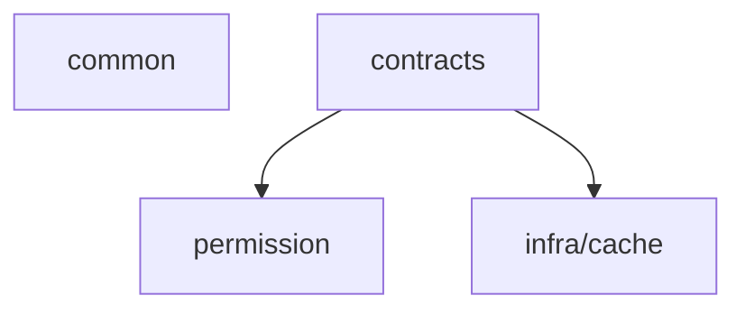

# PixFlow 电商运营 Agent — 总体设计文档

> 本文是 PixFlow 从「自然语言批量图片处理工具」演进为「电商运营 Agent」阶段的总体架构与技术选型设计。
> 需求来源：`requirement.md`；本阶段为**完整重写**，不以既有 MVP 实现为约束，仅复用其中经过验证的事实层结论（如像素工具清单、SKU 绑定规则）。

---

## 目录

- [一、文档定位与范围](#一文档定位与范围)
- [二、设计原则](#二设计原则)
- [三、总体架构](#三总体架构)
- [四、技术栈选型](#四技术栈选型)
- [五、Harness 横切层](#五harness-横切层)
- [六、Agent 决策层](#六agent-决策层)
- [七、RAG 记忆层](#七rag-记忆层)
- [八、电商数据接入层](#八电商数据接入层)
- [九、DAG 确定性执行引擎](#九dag-确定性执行引擎)
- [十、子 Agent 设计](#十子-agent-设计)
- [十一、Rubrics 评估（离线阶段）](#十一rubrics-评估离线阶段)
- [十二、业务模块划分](#十二业务模块划分)
- [十三、数据模型](#十三数据模型)
- [十四、异步执行时序](#十四异步执行时序)
- [十五、技术风险](#十五技术风险)
- [十六、暂不考虑](#十六暂不考虑)

---

## 一、文档定位与范围

PixFlow 面向电商运营人员，以对话窗口为主要工作入口，由 Agent 消费用户指令、canonical Asset References 与外部电商数据，在 Human-in-the-loop（HITL）约束下给出数据支撑的处理建议，确认后执行图片处理。系统以 **DAG 引擎为确定性执行核心、持久 Product Visual Facts 与生图能力为辅助、Rubrics 为后端离线评估能力、Harness 为横切安全约束层**；当前只读召回已有记忆，不把对话或任务结果写回业务记忆。

本文覆盖：总体架构、技术选型、Maven 多模块组织、Harness 六件套、Agent 决策循环、Product Visual Facts、生图辅助、两条产图路径、RAG 记忆、电商数据接入、异步执行、数据模型、技术风险。

不覆盖（见 [十六](#十六暂不考虑)）：视频处理、用户/租户级计费预算与真实账单核算、外部电商平台真实 API 对接、参数自动猜测、Rubrics evaluator 后训练与依赖滞后电商反馈的判定。出站 provider attempt 的 Redis 请求权重桶属于基础设施保护，不等同于业务计费。

---

## 二、设计原则

1. **两层循环分离**。上层是 **Agent 决策循环**（非确定性，think-act-observe，驱动召回、分析、建议、确认、重跑决策）；下层是 **DAG 确定性执行引擎**（可预测、可测试的批处理底座）。DAG 执行是 Agent 决策循环里的一个动作，本身不是 Agent，绝不内嵌自主迭代。

2. **确定性底座不被污染**。Agent 永远不直接调用像素工具（`remove_bg`/`resize`…），它只「编译出 DAG 并请求确认执行」。两套工具严格分离（见 [5.2](#52-tool-registry)）。

3. **安全边界是硬约束，不是 Prompt 约束**。Agent 无法自主拍板执行，只有完整校验后发布的 Proposal 可由用户逐项确认。一次确认直接触发执行；不存在 challenge、固定短语、确认令牌或超阈值二次确认。权限、载荷哈希和 compare-and-set 仍由后端硬校验。

4. **Harness 是横切 services 层，不是领域模块**。六件套贯穿执行各阶段，靠注册/注入接入，不按业务领域切分。

5. **测试/评估与主循环解耦**。Rubrics 评估是独立离线阶段，消费 Evaluation Interface 的 trace + 本地数据集，与主循环无关。商品视觉理解由持久 Product Visual Facts 提供，生图辅助也不是测试工具。

6. **完整项目标准**。对象存储、异步、断点恢复、可观测、韧性都按生产标准设计，不做 MVP 式简化。

7. **共享契约独立成模块**。跨模块只共享接口、record、enum 与纯 DTO，统一放入独立的 `contracts` Maven 模块；`common` 继续只承载错误处理、分页、脱敏等横切能力。

---

## 三、总体架构

```
┌────────────────────────────────────────────────────────────────┐
│                 Vue 3 前端（Chat / Materials / Outputs / Activity）   │
└───────────────┬───────────────────────────┬────────────────────┘
        SSE(LLM流式) │          STOMP 全局 Activity 推送        │  REST 快照
┌───────────────▼───────────────────────────▼────────────────────┐
│                        Spring Boot 主后端                          │
│                        共享契约层 contracts                         │
│                                                                  │
│  ┌────────────────────── Agent 决策层 ──────────────────────┐    │
│  │  Execution Loop (think-act-observe, max iterations)       │    │
│  │  动态 Prompt 组装 + section 缓存                            │    │
│  │  已有记忆只读召回 + 动态 Prompt 组装                        │    │
│  │  Tool Registry(Agent级动作): search / read / agent /       │    │
│  │     submit_image_plan / submit_imagegen_plan / plan /      │    │
│  │     plan_exit                                              │    │
│  └───────┬─────────────┬──────────────┬───────────┬─────────┘    │
│          │             │              │           │              │
│  ┌───────▼──────┐ ┌────▼─────┐  ┌─────▼────┐ ┌────▼─────────┐    │
│  │ RAG 记忆层    │ │电商数据层 │  │ 子Agent   │ │ DAG 编译/校验 │    │
│  │ Qdrant+MySQL │ │本地集+API │  │视觉/生图   │ │              │    │
│  └──────────────┘ └──────────┘  └─────┬────┘ └────┬─────────┘    │
│                                       │           │ submit(确认后) │
│  ┌──────────────── Harness 横切层 ─────┼───────────┼───────────┐  │
│  │ Context Manager · Lifecycle Hooks · State Store · Eval IF  │  │
│  └────────────────────────────────────┼───────────┼──────────┘  │
└───────────────────────────────────────┼───────────┼─────────────┘
                                  调用第三方│    RocketMQ│(任务分发)
                          ┌──────────────▼──┐ ┌───────▼──────────┐
                          │ 抠图API/VLLM/生图  │ │ DAG 确定性执行引擎  │
                          │ /文本LLM(Spring AI)│ │ 分支展开+并发+失败隔离│
                          └──────────────────┘ └───────┬──────────┘
                                                       │
              ┌────────────┬──────────────┬───────────┼────────────┐
        ┌─────▼────┐ ┌─────▼─────┐ ┌──────▼─────┐ ┌───▼────┐ ┌─────▼────┐
        │ MySQL 8  │ │  Redis    │ │  Qdrant    │ │ MinIO  │ │ 离线Rubrics│
        │ 关系数据  │ │锁/断点/进度│ │ 向量检索   │ │对象存储 │ │ 评估(独立) │
        └──────────┘ └───────────┘ └────────────┘ └────────┘ └──────────┘
```

两条产图路径：
- **确定性路径**：Agent 编译 DAG → 确认 → DAG 引擎执行像素工具（抠图/换底/缩放/压缩/水印/格式转换/分组聚合）。
- **生成式路径**：Agent 综合数据、素材事实与用户要求撰写生图提示词；每个 Proposal 绑定一个具体 IMAGE `referenceKey`，以一张源图重绘一张新图。成功结果获得新的 `imageId`，成为 Outputs 中可再次 mention 的独立素材。

---

## 四、技术栈选型

| 维度 | 选型 | 理由 |
|---|---|---|
| 后端框架 | Spring Boot 3 | 主体服务 |
| 工程组织 | Maven multi-module | `common`、`contracts`、`harness`、`module`、`infra`、`agent` 分层编译 |
| LLM 抽象 | **Spring AI + Spring AI Alibaba** | Spring 原生；一套调用抽象覆盖文本/多模态(Qwen-VL)/生图(通义万相)/查询嵌入；Qdrant 只读检索由独立 `infra/vector` 封装；手写 Agent 循环只用模型调用层 |
| 任务队列 | **RocketMQ** | topic/tag/consumer group 适合任务级与包级异步作业；支持可靠投递、消费重试、DLQ、延迟消息；与 MySQL 事实源恢复扫描配合形成至少一次处理 |
| 并发/缓存 | **Redis + Redisson** | 分布式锁(看门狗续期)、支路断点缓存、进度计数、第三方 API 全局并发信号量 + Redis Lua 加权令牌桶 |
| 向量库 | **Qdrant** | 分析结论记忆的语义召回 |
| 关系库 | **MySQL 8 + MyBatis-Plus** | 任务/结果/记忆结构化数据/电商数据;向量交给 Qdrant 故无需换 PG |
| 对象存储 | **MinIO** | S3 兼容,可无缝切阿里云 OSS;原图/结果图/生图/大 tool-result 外置 |
| 去背景 | **第三方 API** | 抽象客户端封装(remove.bg / 阿里云智能抠图),HTTP 调用,无本地模型 |
| 图片处理 | **TwelveMonkeys ImageIO + Thumbnailator** | 纯 Java 补齐格式读取 + 高质量缩放;无原生依赖 |
| WebP 写出 | **scrimage(libwebp 绑定)** | 弥补 Java WebP 写出短板 |
| 第三方韧性 | **Resilience4j** | 重试/熔断/舱壁/超时；集群级限速由 Redis 令牌桶负责，不叠单 JVM RateLimiter |
| 实时推送 | **SSE + WebSocket(STOMP)** | SSE 做当前 Agent 回合流式；STOMP 只推全局 Activity 增量，`GET /api/activities` 负责重连/冷启动快照 |
| 可观测/Eval IF | **MySQL trace 表 + Micrometer/Actuator** | trace 表供 Rubrics 当数据查询+回放;Micrometer 补运维指标 |
| Token 计数 | **jtokkit** | Context Manager 预算裁剪 |
| 定时任务 | **Spring @Scheduled (+ ShedLock 多节点)** | 启动断点恢复扫描、延迟清理 |
| 文档解析 | **Apache POI + commons-csv** | 文案文档 + 电商数据导入 |
| 容器编排 | **Docker Compose** | 统一拉起 MySQL/Redis/RocketMQ/Qdrant/MinIO |
| 前端 | Vue 3 + Vite + Tailwind CSS + radix-vue + 自绘视觉层（见 [frontend/README.md](./frontend/README.md)） | Chat / Materials / Outputs / 全局 Activity；没有 Rubrics/评估中心页面；**浅色主题**，图标统一 SVG |

> 模型具体型号（文本 LLM、Qwen-VL、生图模型、embedding 模型）由配置承载，不在本文锁定——抽象层定了即可随时替换。

### 4.1 Windows 本地 Testcontainers 约束

**现象**：Windows + Docker Desktop 29.4.x 下，`mvn -pl pixflow-infra-cache -am test` 等 Testcontainers 集成测试在容器启动阶段抛 `Could not find a valid Docker environment`，本地复现稳定。

**根因**：Docker Desktop 29.4.x 把 `\\.\pipe\dockerDesktopLinuxEngine` 改成只读代理管道——Java 客户端 `GET /info` 收到 400/空壳响应，`Labels` 仅含 `com.docker.desktop.address=npipe://\\.\pipe\docker_cli`，不包含 Moby daemon 真实信息。docker-java 探测判定为「daemon 不可用」并抛错。该问题与 Docker daemon 状态无关——daemon 正常运行时仍触发。

**修复**：项目通过环境变量和 Maven profile 直接指定 Testcontainers 的 Docker 入口，绕过 Docker Desktop 29.4.x 的 read-only 代理管道问题。Windows 本地跑集成测试时使用 `-Pwindows-docker-tcp` 或直接设置 `DOCKER_HOST=npipe:////./pipe/docker_engine`，让 Testcontainers 走可用的本机命名管道或 TCP 入口。父 POM 同步锁定 docker-java 版本 `3.5.0`，规避 docker-java 端 Labels 回填 bug。

**备选**：仅在 Docker Desktop 未保留 `\\.\pipe\docker_engine`（极少数精简部署）下回退到 TCP：Docker Desktop 启用 `Expose daemon on tcp://localhost:2375 without TLS`，再用 `-Pwindows-docker-tcp` profile。`windows-docker-desktop-linux-npipe` profile 保留作 bug 回归对照，不再推荐日常使用。

---

## 五、Harness 横切层

Harness 是贯穿运行全生命周期的横切 `services` 层，由六个扩展点组成。它们靠注册/注入接入 Agent 决策循环与 DAG 引擎，不按业务领域切分。设计参照成熟 Agent runtime（tool runtime / hooks / context / compaction / subagents / prompts）的边界划分。

### 5.1 Execution Loop（执行主循环）

驱动 Agent 的 think-act-observe 主循环，是手写的显式循环（**不依赖 Spring AI 的自动 function-calling**，以便把 Tool Registry 执行管线、Hooks、Context Manager、权限拦截插入每一步）。

- 设置while true循环，有工具调用时继续，没有工具调用时输出最后的文本并终止循环。
- 每轮记录 ContextSnapshot（system prompt + 消息 + 可见工具 schema），异常可回溯。
- 单轮流程：组装 Prompt → 调 LLM（带可见工具 schema）→ 解析工具调用 → 经 Tool Registry 执行管线执行 → 观察结果回填 → 判断是否继续或自然结束（无工具调用即 TurnStopped）。
- 循环内每个动作节点须经 Lifecycle Hooks + 权限层校验后方可执行。

### 5.2 Tool Registry（工具注册表）

**关键边界：系统有两套完全独立的「工具」，绝不合并。**

| | Agent 级动作（本 Registry 管理） | DAG 级像素工具（DAG 引擎内部） |
|---|---|---|
| 例 | `search`、`read`、`agent`、`submit_image_plan`、`submit_imagegen_plan`、`plan`、`plan_exit` | `remove_bg`、`set_background`、`resize`、`compress`、`watermark`、`convert_format`、`generate_copy`、`compose_group` |
| 调用者 | Agent 决策循环 | DAG 执行引擎 |
| 校验 | 执行管线（schema→分类→权限→hook→handler→结果预算） | DAG 校验器（结构/白名单/参数 schema/无环） |
| 性质 | 非确定性决策动作 | 确定性处理单元 |

Agent **永不直接调像素工具**，只通过 `submit_image_plan` 提交待确认的 DAG 提案。该工具只校验并入确认队列，不执行像素处理；真实执行由用户确认后的 REST 边界触发。

Tool Registry 执行管线（每次工具调用串行 preflight）：
```
registry.get(name) → schema 校验 → 工具级 validate → 调用分类(classify)
→ 权限评估(deny-first) → PreToolUse hook(可改写输入,改写后重新校验)
→ handler 执行(Resilience4j 包裹) → 结果预算(超限外置 MinIO+返回引用)
→ PostToolUse/ToolError hook → 记录 trace
```
- **结果预算**：工具结果超阈值（默认 50KB）写 MinIO，模型只见引用+预览，防上下文膨胀。
- **失败策略**：handler 异常转结构化 tool error 回填模型，不让主循环崩溃；按 Tool Registry 注册的策略（重试/跳过/终止）处理。

### 5.3 Context Manager（上下文管理）

维护每轮对话的上下文质量与体积，超窗口时分两层治理（确定性 cheap pipeline + 摘要式 destructive compaction）。详见 `harness/context.md`。

- **运行期工作内存，持久化倒置给 session**。context 自身不直连 MySQL，只持有 append-only 内存链；落库经 `TranscriptPort` SPI 委托 `harness/session`（session 是 `message` 表唯一写者）。这对应依赖 DAG 中 `context → session` 的箭头方向。
- **多节点模型**：无状态后端每回合从 MySQL `message` 表 rehydrate 内存链，配可选 Redis 热缓存（`MessageChainCache` SPI，由 infra/cache 实现；可丢可重建、压缩时失效），不做会话-节点亲和。
- **cheap pipeline（确定性，每轮必跑、不改写链）**：大结果外置 MinIO（模型只见引用+preview）→ 投影滑窗（保留 tool call/result 配对，丢弃孤立 tool_result）→ microcompact（旧 tool result 降级占位符）→ jtokkit Token 估算。
- **destructive compaction（摘要式，超阈值/CONTEXT_LIMIT 触发，改写链）**：调 LLM 把历史摘要成「边界+摘要+tail」。LLM 摘要经 `SummarizationPort` SPI 倒置给 agent 层（fork 子 Agent 实现），context 不依赖 LLM 调用；触发分 AUTO/MANUAL/REACTIVE。
- **确定性兜底**：`SummarizationPort` 缺失或连续失败（断路器）时，回退按优先级裁剪——**保留顺序**：用户最新指令 > 当前任务状态 > Lifecycle Hooks 强规则 > 关键记忆片段 > 历史对话。这保证 context 可脱离 agent 层独立运行与属性测试。

### 5.4 State Store（状态存储）

持久化 Agent 运行状态与任务执行状态，支撑断点恢复。

| 存储 | 内容 |
|---|---|
| MySQL | 任务进度、已完成节点/支路（`process_result` 天然 checkpoint）、当前 DAG 结构、会话 transcript |
| Redis | 任务运行态、支路中间产物**引用**（节点完成标记 + MinIO key，非原始字节）、进度计数器、取消标志位、分布式锁、第三方信号量 |
| MinIO | 中间产物文件本体（字节落此）、外置大结果 |

> 中间产物存储边界：Redis 只放轻量引用（"某节点已完成，产物在 MinIO key X"），**原始图片/大字节一律落 MinIO**，避免 Redis 内存膨胀与序列化压力；真正的持久断点是 MySQL `process_result`，Redis 缓存只是同一次运行内避免重算的优化，可丢失可重建。

断点恢复策略见 [9.4](#94-断点恢复与失败隔离)。State Store 同时为应用层全局 Activity 提供投影输入。前端只读取 `GET /api/activities` 快照并订阅 `/user/queue/activity`，不按 task 建立专属轮询或订阅。

### 5.5 Lifecycle Hooks（生命周期钩子）

在关键时机插入扩展点。**Hook 可阻断/改写/补充 metadata，但其 allow 不能覆盖权限层 deny——安全边界在权限层。**

核心事件：`UserPromptSubmit`、`PreToolUse`、`PostToolUse`、`ToolError`、`AssistantMessageCompleted`、`TurnStopped`、`TaskCreated`、`TaskCompleted`、`PreCompact`/`PostCompact`。

requirement 的强规则拦截落点：

| 拦截点 | 实现层 | 机制 |
|---|---|---|
| 生成建议后必须等用户确认，禁止自动执行 | **Proposal REST 边界 + 权限层硬 deny** | `submit_image_plan` / `submit_imagegen_plan` 只发布已完整校验的 Proposal；真实执行只能由用户逐项确认触发 |
| Proposal 技术错误 | **属主校验器 + tool error** | schema、素材、权限、readiness、计数或事实校验失败时不展示 Proposal；错误回到同一 Agent 回合供其修正 |
| 生图/重跑前用户确认 | **Proposal REST 边界 + 权限层硬 deny** | 每个 Proposal 一次确认直接执行；无二次确认或确认令牌 |
| DAG 参数异常检测 | PreToolUse hook + DAG 校验器 | 拦截非法参数 |
| Rubrics 已验证 criterion 发生回归 | Rubrics 离线回归流程 | 观察 + 通知；不接入在线 hook 链 |

### 5.6 Evaluation Interface（评估接口）

统一可观测接口，暴露每轮循环的输入输出、工具调用记录、记忆召回内容、上下文裁剪日志，写入 MySQL trace 表（JSON 列，可 SQL 查询、可回放）。

- 为 Rubrics 离线评估提供完整数据来源。
- 支持任务回放与问题追溯。
- Micrometer/Actuator 补充运维指标（QPS、延迟、错误率）。

---

## 六、Agent 决策层

### 6.1 主循环行为

用户每次发消息 = 一个 Agent 决策回合（请求内同步执行，秒级 LLM 调用）。典型一轮：

```
UserPromptSubmit
  → 注入用户 prompt + referenceKey/display snapshot；按需只读召回已有记忆
  → search(发现候选 SKU) / read(include=["data"] 时读取电商指标)
  → [按需] get_product_visual_facts(referenceKey)(读取当前商品视觉事实；IMAGE 可补齐目标图事实)
  → [可选] agent(type=explore)(探索关联 SKU)
  → 生成带数据支撑的处理建议(确定性 DAG 方案 和/或 生成式重绘方案)
  → submit_image_plan(referenceKeys, dag) / submit_imagegen_plan(referenceKey, prompt, params)
  → 属主完整校验；失败回 tool error，成功才返回 proposal_ready(SSE)
  ── 用户逐项确认或拒绝 ──
  → 确认 REST 端点以 proposalId 幂等绑定任务 → 异步执行
```

建议必须附数据支撑说明（如「该 SKU 近 30 天点击率低于类目均值 40%，历史数据显示白底处理后点击率平均提升 18%，建议执行去背景白底方案」）。

### 6.2 动态 Prompt 组装 + section 缓存

Prompt 缓存 = 动态组装 + section 级缓存（**不依赖服务商 context caching**）。

- 静态前缀（identity、行为规则、工具列表、只读召回到的已有偏好画像）各自带 fingerprint 缓存，按 `(section_key, fingerprint)` 复用渲染结果。
- 动态部分（用户当次指令、当前 SKU 数据、召回记忆片段）每轮重组。
- 已有偏好事实被管理员离线更新时，只失效对应 section 的缓存；Agent 回合本身不写回偏好。
- 可见工具视图单一来源：Prompt 中工具说明与 LLM 可见 tool schema 来自同一可见集合。

### 6.3 HITL 确认

所有触发真实副作用的动作（执行 DAG、生图、重跑）都不作为 Agent 可直接执行的工具暴露。Agent 只能通过 `submit_image_plan` / `submit_imagegen_plan` 请求发布 Proposal。属主服务必须在发布前完成结构、素材解析、权限、readiness、计数与事实一致性校验；技术错误返回 Agent 修正。每个 Proposal 独立确认或拒绝，`proposalId` 是唯一业务幂等身份。用户一次确认后直接触发任务，不存在 challenge、确认令牌、随机 HTTP 幂等键或二次确认。

分组聚合的张数预期不符属于 Proposal 发布前的事实冲突：校验器不发布错误计划，Agent 通过正常会话询问用户“按实际张数处理”还是“补充素材”。这不是第一次确认后的第二个确认步骤。

---

## 七、RAG 记忆层

三类记忆性质不同，分开存储、统一检索接口，按需召回。**只有「分析结论记忆」真正需要向量库。**

| 记忆类型 | 存储 | 召回方式 | 内容 |
|---|---|---|---|
| **用户偏好画像** | MySQL | 每轮 Prompt 组装前全量召回，置于 memory section | 偏好底色、常用水印位置、文案风格、历史确认/拒绝行为 |
| **SKU 处理历史** | MySQL | 系统从 canonical Asset References 与任务上下文解析 SKU 后精确召回 | 已有处理时间、参数与前后电商数据；当前流程只读 |
| **分析结论记忆** | **MySQL(事实源) + Qdrant(active 索引)** | **系统自动规划 + 混合检索 + RRF + 衰减排序** | 类目级洞察(如「夏季连衣裙白底图转化率高于场景图 30%」),标注来源、置信度、重要性与生命周期 |

- 记忆召回不是 Agent 工具。系统在 Prompt 组装前只读调用 `module/memory`，按用户输入、canonical Asset References、类目、任务阶段与会话上下文规划召回，并把已有结果注入 Prompt 的 memory section。
- 在线运行时只为召回查询文本生成 embedding；Qdrant 中的 ACTIVE 索引由独立的管理员数据导入/重建流程预先准备，不接受 Agent、Conversation、Task、Hooks 或 Rubrics 写入。
- 当前产品不提供任何对话、任务或 Rubrics 结果写回业务记忆的入口；Rubrics 判定只保存在 Rubrics 事实表。

**分析结论记忆采用自动只读召回，并解释既有生命周期字段**（详见 `module/memory.md` 与 `infra/vector.md`）：

- **写入：当前关闭**。删除 assistant/turn/task 完成后自动抽取、强化、抑制、embed 与 upsert 的接线；运行时只读既有数据。未来若重新启用写回，必须作为新的明确设计决策，不复活旧 Hook。
- **召回：自动规划 + 向量 + 关键词混合 + RRF + 衰减排序**。系统确定性规划召回类型和过滤条件；分析结论走稠密向量召回（Qdrant）∥ 关键词召回（MySQL `analysis_insight.text` FULLTEXT）两路独立召回，按 RRF 融合，再叠加 confidence / importance / decay_score / reinforcement / recency 排序取 topN。
- **生命周期：只读解释**。`analysis_insight` 可已有 `ACTIVE` / `SUPPRESSED` / `EXPIRED` 状态，在线召回只读取 `ACTIVE`。管理员维护流程可在应用运行边界外重建 ACTIVE 派生索引；在线产品不修改状态或删除向量。
- 仅「分析结论记忆」使用该只读召回管线；偏好画像与 SKU 历史同样只读，不由 Agent 运行时写入。

---

## 八、电商数据接入层

系统不拥有电商平台数据，通过标准接口消费外部数据。

- 当前阶段：导入本地数据集（CSV/Excel，POI + commons-csv 解析）。
- 预留外部店铺数据 API 接入接口（适配器模式，后续对接真实平台）。
- 数据字段：`SKU_ID`、曝光量、点击率、加购率、购买率、时间周期。
- Agent 通过 `search` 发现候选 SKU，通过 `read` 精读 SKU 文案；当 `read.include=["data"]` 时关联电商指标，供 Agent 生成数据支撑说明。

---

## 九、DAG 确定性执行引擎

### 9.1 编译、校验、分支展开

- **Agent 提案**：Agent 在普通对话轮中产出 DAG JSON（nodes/edges）作为 `submit_image_plan` 入参；这只是待确认的 `Image Plan`，不是可直接执行的运行时对象。节点 `tool` 仅限现有像素工具白名单，缺必填参数时逐项追问，不自动猜测，也不新增 `compile_dag` Agent 工具。
- **规范化与校验**：服务端把提案规范化为 `Canonical DAG`，并在提案入队和确认执行前使用同一套校验：结构 → 节点数(1–50) → 工具白名单 → 参数 schema → 边引用 → 无环。确认端不信任前端回传；任一失败不创建任务。
- **确定性编译**：`DagCompiler` 只接受校验通过的 Canonical DAG，把原始 JSON 参数一次性映射成类型化 external/local-image/group/copy steps，并验证每条依赖都有真实执行实现。相同 canonical bytes + schema version 必须产生相同 `Typed Execution Plan`；worker 不在运行期用 `Map<String,Object>` 临时派发节点。
- **分支展开**：Typed Execution Plan 支持单节点后分出多条并行路径（如去背景后同出 800×800 主图与 200×200 缩略图）。展开为 source→sink 支路，每条分配确定性 branchId，独立执行、结果分别持久化。
- **文案分支解耦**：`generate_copy` 建模为独立分支，不串接像素流水线末端。`asset_copy` 是用户/文档提供的商品资料；依赖商品外观的营销文案由主 Agent 先读取当前 Product Visual Facts，再输出自然语言草案，不由 VLLM 直接写入 `asset_copy`。

### 9.2 异步任务分发（RocketMQ）

```
确认 REST 端点(proposalId 通过权限/载荷/CAS 校验)
  → 创建 process_task(status=待执行) + 序列化已校验 DAG 入库
  → 发布任务消息到 RocketMQ(任务级粒度,一条消息=一个任务)
  → 立即返回 taskId(前台可继续操作)
  → worker 消费 → 任务内 fan-out [图片×支路] 到本地线程池
  → 进度写 Redis 计数器 → 投影全局 Activity
  → 完成 → 推送通知 + 提供预览/下载入口
```
- 任务级消息保持 MQ 消息量低、断点恢复简单。
- RocketMQ 重投 / DLQ 只处理消息接管和 worker 系统故障；provider、AI、存储边界各自拥有有界 attempt retry。task 不为正常失败工作单元再包一层通用重试循环。

### 9.3 并发保障（Redis + Redisson）

- task worker 在整个 execution run 持有 Redisson `RLock lock:task:{taskId}:execution`，由 watchdog 续期，防同一任务被并发消费；锁获取失败即退出当前消息，不强制解锁其他 owner。
- worker 获得锁后以 MySQL 原子递增 `process_task.run_epoch` 取得本次 execution epoch。epoch 不是第二把锁，只用于所有结果/终态写入的 stale-worker fencing；写入条件必须包含 `task.status=RUNNING AND run_epoch=?`。
- 任务内 worker pool 控制排队与线程数；所有确定性图片任务还共享 JVM 级全局 Pixel Budget。图片必须先 probe 尺寸、成功取得加权像素许可后才能 decode，线程许可不能代替内存准入。
- 第三方 API（抠图/生图/VLLM）用 Redisson 信号量封跨实例在途数，用 Redis Lua 加权令牌桶封跨实例出站速率/相对成本；Resilience4j 只负责 retry/circuit/bulkhead/timeout。
- 信号量与令牌桶都位于**每个真实 provider attempt** 内：重试要重新消费额度，退避期间不占信号量。Redis 故障 fail-closed，不自动退化为本机桶。

### 9.4 断点恢复与失败隔离

- **恢复粒度 = Work Unit**：普通图片支路、组支路或单次生成式操作是最小 checkpoint；不保存节点 checkpoint/history。worker 崩溃后只跳过 MySQL 中 `SUCCESS` 的 `unit_key`，其余已选择单元在新 epoch 下整支路重算。
- **运行态引用不是 checkpoint**：Redis 只保存当前 epoch 内可丢弃的 MinIO 中间产物引用，不能证明工作单元完成；新 epoch 不靠旧引用跳节点。唯一持久 checkpoint 是 MySQL 成功 `process_result`。
- **恢复触发**：`@Scheduled` 只扫描 `status=RUNNING AND heartbeat_at` 过期的任务并重新入队；新 worker 必须先取得 Redisson task lock，再递增 `run_epoch`。旧 worker 即使稍后恢复，也会因 epoch 不匹配而无法提交结果或终态。
- **中断**：Redis 取消标志位，在工作单元之间检查，优雅停并持久化断点。
- **失败隔离**：单「图片×支路」工作单元在其边界 retry 耗尽后 → `process_result` 标记 `FAILED`，持久化结构化最终节点失败（code/category/recovery/node/tool/attempts/safe details），不保留未被 fenced row 引用的半成品；同图其余支路、批次其余图片继续。
- **任务终态**：全部所选工作单元 `SUCCESS` 才是 `COMPLETED`；全无成功且存在失败为 `FAILED`；成功与 `FAILED/SKIPPED` 混合为 `PARTIAL`；取消且无成功为 `CANCELLED`。四种终态均不可变。
- **显式重试**：用户只能对终态任务执行“重试失败项”。该操作创建新的 derived task，`retry_of_task_id` 指向来源任务，`unit_selection_json` 固定为来源任务的失败 `unit_key` 集合；不得把 `PARTIAL/FAILED` 原地改回 `RUNNING`。

### 9.5 分组聚合（三视图 → 合成图）

部分商品的多张图片（如正/侧/背三视图）需作为整体加工、合成为单张图。引入与支路正交的「组（group）」维度：普通处理仍是 `[图片 × 支路]`，分组聚合是 `[组 × 支路]`。**不含聚合节点的 DAG 行为与原先完全一致。**

- **分组来源（文件名驱动，落 `module/file`）**：约定文件名（去扩展名）按 `_` 分段——
  - 三段 `组id_商品id_图id` → 分组图：`group_key=组id`、`sku_id=商品id`、`view_id=图id`；同 `(package_id, group_key)` 的图片构成一组。
  - 两段 `组id_图id` → 普通单图：`group_key` 置空，首段作 `sku_id`。
  - 其余/无下划线 → 回退现有 `SkuExtractor`，`group_key` 置空。
  分组完全由文件名编号决定，不做视觉识别。

- **聚合工具**：DAG 像素工具白名单新增 `compose_group`（输入基数 N≠1，区别于其余逐图工具）。参数：`layout`（horizontal/vertical/grid 枚举，必填）、可选 `order`（按 view_id 排序）、可选 `expected_count`（正整数，仅供 HITL 张数校验）、可选 `gap`/`background`。一组 N 张 → 输出 1 张。

- **组支路**：`BranchExpander` 识别含 `compose_group` 的支路为「组支路」。聚合节点之前的逐图节点（remove_bg/resize…）对组内每张成员各自施加；聚合节点 fan-in 合成；聚合节点之后的节点作用于合成后的单图。`DagValidator` 增校验：组支路内 `compose_group` 唯一、其前驱均为逐图工具。

- **张数预期与事实校验（Proposal 发布前）**：
  - 用户说「整组全部拼接」→ `compose_group` 不带 `expected_count`，以组内实际成员为准，无张数校验。
  - 用户说「这组三张拼接」→ Agent 编译时置 `expected_count=3`；Proposal 校验器按组比对实际成员数。不一致时不发布 Proposal，返回事实差异给 Agent，由 Agent 在正常会话中询问“按 2 张处理还是补充素材”；用户答复后生成新 Proposal，不存在确认后的二次确认。

- **运行态引用（边界①）**：组内各成员预处理中间产物引用只服务当前 execution epoch 的 fan-in，键为 `runref:group:{taskId}:{runEpoch}:{unitKeyHash}:{imageId}`，compose 完成或 epoch 结束后删除、TTL 兜底。普通支路不写节点引用；新 epoch 不读取旧引用。

- **失败隔离与缺图（边界②，运行期）**：组支路工作单元内任一预期成员读取/解码/处理失败 → **整条组支路 `status=2`**，`error_msg` 标注缺失视图，不留半成品 `output_path`；其他组、其他普通支路、批次其余图片继续。

- **恢复**：组支路整体幂等重算（与普通支路一致）；只有组结果 `process_result.status=SUCCESS` 才是 Work Unit Checkpoint。新 epoch 恢复时成功组整组跳过，其余组忽略旧运行态引用并从源成员重算。

> 「各自处理但保持一致」（N→N，统一画布/底色等）：参数为静态固定值时，逐图支路用同一份 DAG 参数处理即天然一致，沿用原设计无需改动；仅当共享参数需由组内联合推导（如取组内最大尺寸再回填各图）时，才需额外的组参数推导步骤，本期不做。

---

## 十、辅助能力设计

### 10.1 商品视觉事实（OpenAI-compatible VLM）

- 素材包解压完成后，按 `(packageId, skuId)` 创建内部异步分析批次；每个 SKU 是独立可恢复工作项。
- 同 SKU 确定性伪随机抽最多两张图（仅一张则只发一张），经最长边 1280、约 1.6MP、JPEG 0.85、透明铺白、不放大的统一预处理后，一次多图调用视觉模型。
- 沿用 `VisionModelClient -> ChatModelClient -> OpenAI-compatible /v1/chat/completions`，强制模型调用 `submit_product_visual_facts` 输出观察事实；模型不生成营销文案或重绘 Prompt。
- 每个 SKU 与具体目标图只保留一份可变当前事实和一个当前工作项，不保留事实修订或已完成运行历史。管理员可在 Materials 的商品视觉分析表单直接覆盖 SKU 事实，或显式发起重新分析。
- 只有同 SKU Original Image 的新增、删除、替换或内容哈希变化会清空当前 SKU 事实并自动重新分析；模型、提示词、预处理和事实 schema 版本变化不自动重跑。相同图片集合的手动重新分析继续使用同一组确定性样本。
- 主 Agent 只通过 `get_product_visual_facts(referenceKey)` 读取当前事实，不接收 AI/人工来源元数据，也不会因普通 lookup 启动新的 SKU 分析 generation。
- 视觉事实不进入 Qdrant 或自动 Memory recall。通用 `agent(type=vision)` / 任意图片问答入口取消；完整设计见 `module/vision.md` 与 ADR 0008。

### 10.2 生图子 Agent（生成式重绘路径）

- 主 Agent 综合数据分析 + 召回记忆 + 用户要求，撰写生图提示词。
- 每个 Proposal 把一张源图 + 提示词发给生图 LLM（通义万相类），重新生成一张新图；一次回合最多发布 20 个独立 Proposal。
- 与确定性 DAG 并列的第二条产图路径；结果先落临时对象与 `process_result`，成功发布后由 File 分配新的 `imageId`，以 canonical IMAGE key 进入 Outputs。
- 触发执行需用户对该 Proposal 一次确认（HITL 硬拦截），不使用确认令牌或批量确认。

### 10.3 通用/规划子 Agent（可选）

- 复杂任务的子规划、只读探索等，按需扩展，保持 subagent 接入边界统一（一个 `run_subagent` 动作 + 类型参数），不在主循环加特例分支。

---

## 十一、Rubrics 评估（离线阶段）

**完全独立于主循环的离线环节**，消费任务事实、Evaluation Interface trace、对象存储证据与版本化 Evaluation Dataset。详细设计见 `module/rubrics.md`，领域语言见 `pixflow-module-rubrics/CONTEXT.md`。

### 11.1 核心方法论：原子 criterion + 证据约束判定

Rubrics 不生成 0~100 质量分。人工审核的版本化模板为一个 subject type 定义原子 Criterion：显式要求是 `Hard Rule`，隐含质量期望是 `Principle`。每项输出 `PASS / FAIL / INCONCLUSIVE / NOT_APPLICABLE`；missing evidence、judge 故障和无多数意见不能伪装成 FAIL。

`Hard Rule` 与 `Principle` 都是二元 PASS/FAIL 命题，但记录四态 criterion verdict（另有 `INCONCLUSIVE` / `NOT_APPLICABLE` 弃权状态）。`Hard Rule` 组成 `PASSED / FAILED / UNKNOWN` Quality Gate；`Principle` 可额外展示透明的 `passRate = PASS / (PASS + FAIL)`，无可判定项时为 `null`；`coverage` 单独表示可判定比例。模型自报 confidence 不参与任何聚合。

### 11.2 Typed Evaluation Subject

| Subject type | 评估对象 | 主要证据 |
|---|---|---|
| `IMAGE_RESULT` | 单个输出图片 | 输出对象、图像元信息、相关源图引用 |
| `COPY_RESULT` | 单份生成/导入文案 | 文案原文、商品事实、受众/语气要求 |
| `TASK_DECISION` | 任务级提案或决策 | 需求、提案、DAG 快照、相关 trace 与事实数据 |

三类 subject 分开落评估事实，不再让每条 `process_result` 同时承载图片、文案和决策判定。

### 11.3 Evidence Pack 与 judge

- 系统先构建并哈希 Evidence Pack；criterion 声明所需 evidence 类型和 applicability。
- judge 只能引用 Evidence Pack 中的 ID，未知引用使该 rollout 无效。
- 文本与视觉评估分别使用版本锁定的 `RUBRICS_JUDGE_TEXT` / `RUBRICS_JUDGE_VISION` 逻辑角色，不复用 `PRIMARY_CHAT`。
- LLM criterion 默认独立运行 3 次，以严格多数得到 PASS/FAIL；无多数为 `INCONCLUSIVE`，agreement 只作为可靠性元数据。
- 规则 verifier 执行一次；异常或证据缺失同样为 `INCONCLUSIVE`。

### 11.4 模板、校准与自动化门

- 生产事实源是 `(templateId, version, templateHash)` 标识的静态 YAML；模型可生成待审核候选，但不能运行时改变生产 rubric。
- template/criterion 生命周期为 `EXPERIMENTAL / VALIDATED / PRODUCTION`。
- criterion 必须在版本化 gold set 上通过人工一致性、judge-human macro-F1、重复一致率、coverage 与 inconclusive-rate 验收。
- `EXPERIMENTAL` 只允许手动 run；事件驱动与定时触发必须等相关 template 进入 validated/production 且显式启用。

### 11.5 数据模型与回归

目标事实包括 `rubrics_run`、`rubrics_run_item`、`rubrics_evaluation`、`rubrics_criterion_result`、`rubrics_judge_rollout`、`rubrics_dataset`、`rubrics_gold_label`、`rubrics_baseline` 与 `rubrics_alert`。不存在 `rubrics_promotion`。现有 `rubrics_score` 作为 v1 历史表保留，新模型不再写 `overall_score / image_score / copy_score / decision_score`。

正式回归必须在同一个版本化 Evaluation Dataset 上成对重放，比较 per-criterion PASS rate、`PASS -> FAIL` 转移、Hard Rule 失败率、coverage、inconclusive rate 与 agreement。任意历史生产 run 只能做趋势监控，不能直接成为正式 baseline。

### 11.6 Memory 边界

Rubrics 结果只留在 Rubrics 事实表。确定性 Hard Rule 可产生离线告警，但 verdict、pass rate、告警和人工审核结果当前都不能写入 Agent memory；本期不实现 Promotion 写回通道。

### 11.7 实施顺序与暂不做

第一条纵向切片为 `IMAGE_RESULT`（分辨率/格式 Hard Rules + 背景洁净/商品可见 Principles），随后是 `COPY_RESULT`，最后是依赖复杂 trace 证据的 `TASK_DECISION`。

本期不做 evaluator SFT/GRPO/DPO/RLHF 等后训练、运行时生产 rubric 生成、概率 margin 计分、A/B 实验、自动 memory 反馈、训练信号导出、实时 Agent-loop 评分或依赖滞后电商反馈的判定。

---

## 十二、业务模块划分

```
spring-boot 主工程
├── common/                     错误处理 / 分页 / 通用
├── contracts/                  仅容纳真正解环的纯接口/DTO；不含确认令牌或 pending-plan 契约
├── harness/                    横切 services 层（不依赖业务领域）
│   ├── loop/                   Execution Loop
│   ├── tools/                  Tool Registry + 执行管线
│   ├── context/                Context Manager（运行期工作内存/投影/预算/摘要压缩；持久化倒置给 session）
│   ├── state/                  State Store（MySQL+Redis+MinIO 状态聚合）
│   ├── hooks/                  Lifecycle Hooks
│   ├── permission/             权限层（硬 deny 安全边界）
│   ├── session/                session会话transcript（message 表唯一写者，实现 context 的 TranscriptPort）
│   └── eval/                   Evaluation 评估
├── agent/                      Agent 决策层（主循环编排、Prompt 组装、子Agent runner）
├── module/
│   ├── file/                   素材管理（ZIP/RAR/7z 上传解压/Asset Reference/Materials/Outputs）
│   ├── conversation/           对话、消息 references、SSE 与临时 Proposal 决策边界
│   ├── dag/                    DAG 编译/校验/分支展开/执行引擎
│   ├── task/                   任务调度（RocketMQ 消费、进度、断点恢复、下载）
│   ├── memory/                 RAG 记忆（偏好/SKU历史/分析结论；Qdrant+MySQL）
│   ├── commerce/               电商数据接入（本地导入 + 预留 API）
│   ├── vision/                 当前 Product Visual Facts 与可恢复分析
│   ├── imagegen/               生图子 Agent
│   └── rubrics/                Rubrics 离线评估
├── infra/
│   ├── ai/                     Spring AI 封装（文本/多模态/生图/嵌入）
│   ├── image/                  图片编解码 + 像素工具执行器
│   ├── storage/                MinIO 对象存储抽象
│   ├── mq/                     RocketMQ 封装
│   ├── cache/                  Redis/Redisson 封装
│   ├── vector/                 Qdrant 封装
│   └── thirdparty/             抠图 API 等第三方客户端 + Resilience4j
```

> `contracts` 是**零依赖叶子**（仅依赖 JDK，不依赖 `common` 或任何模块），只放真正为解环所需的纯形状，不包含 Spring Bean、Redis/DB 实现或业务流程。确认令牌与 durable pending-plan 机制已从目标设计删除；素材身份统一遵循 `base/asset-references.md`。



---

## 十三、数据模型

### 13.1 MySQL（关系数据）

本地开发环境由 `docker-compose.yml` 初始化 MySQL 8，数据库名为 `pixflow`。当前开发库初始化凭据固定为：root 用户密码 `pixflow_root_20260705`；应用用户 `pixflow`，密码 `pixflow_dev_20260705`。`pixflow-app/src/main/resources/application-dev.yml` 必须与该应用用户密码保持一致。注意：MySQL 官方镜像的 `MYSQL_*` 环境变量只在空数据目录首次初始化时生效；如果 `pixflow_mysql_data` 卷已存在，修改 compose 文件不会自动改库内密码，需显式重置账号或删除该卷重新初始化。

| 表 | 关键字段 | 说明 |
|---|---|---|
| `asset_package` | id, name, source_object_key, archive_format, image_count, status, created_at | ZIP/RAR/7z 素材包；metadata 文档只来自压缩包内部 |
| `asset_image` | id, package_id, sku_id, source_type, source_task_id, source_result_id, source_image_id, group_key, view_id, minio_key, original_path, created_at | ORIGINAL/GENERATED 图片；生成结果获得新 id 并记录 lineage，绝不复用源图 id |
| `asset_copy` | id, package_id, sku_id, product_name, keywords, description | 文案条目 |
| `vision_analysis_job` | id, package_id, status, total_count, success_count, failed_count, updated_at | 每包一条当前视觉分析聚合；重置而不追加，不作为用户可见 process task |
| `vision_analysis_item` | id, package_id, sku_id, image_id, scope, input_fingerprint, status, analysis_generation, run_epoch, heartbeat_at, provider_attempt_count, structure_round_count, last_request_id, failure_* | SKU/目标图各一条当前可恢复工作项；每 generation 最多 3 次实际 provider attempt，不累积已完成运行历史 |
| `asset_visual_analysis` | id, package_id, sku_id, input_fingerprint, facts_json, version, last_writer, operational_metadata_json, updated_at | 每 SKU 一条可变当前 Product Visual Facts；管理员编辑或分析成功原地覆盖，不保留历史 |
| `asset_image_visual_analysis` | id, package_id, sku_id, image_id, input_fingerprint, facts_json, version, operational_metadata_json, updated_at | 每目标图一条可变当前 Image Visual Facts；用于具体图片重绘 Prompt，不保留历史 |
| `conversation` | id, title, created_at, updated_at | 对话 |
| `message` | id, conversation_id, seq, role, content, tool_call_id, compaction_marker, metadata, task_id, created_at | 消息 transcript append-only 事实源；USER message 的 metadata 保存有序 `referenceKey + displayPathSnapshot`，不保存单一 attached_package_id 或文件字节；由 `harness/session` 唯一写入，`module/conversation` 只读 |
| `message_compaction` | id, conversation_id, boundary_message_id, summary_message_id, covered_up_to_seq, trigger, created_at | session 自治压缩纪元表；记录最近 destructive compaction 如何把 append-only transcript 派生成压缩后活动链；`covered_up_to_seq` 只按普通消息 seq 取值 |
| `process_task` | id, conversation_id, package_id, task_type, idempotency_identity, dag_json, schema_version, unit_selection_json, retry_of_task_id, status, run_epoch, heartbeat_at, total_count, done_count, created_at, finished_at | 任务；Proposal 使用 `proposalId`，失败派生重试使用 `retry-failed:{sourceTaskId}` 作为稳定业务幂等身份；不接受客户端随机 key |
| `process_result` | id, task_id, unit_key, unit_kind, source_image_id, generated_image_id, sku_id, group_key, branch_id, source_path, output_minio_key, generated_copy, status, run_epoch, attempt_count, failure_code, failure_category, failure_recovery, failed_node_id, failed_tool, failure_details_json, error_msg | Work Unit 结果；`generated_image_id` 指向成功发布的新 Asset Image；`UNIQUE(task_id, unit_key)`，SUCCESS 在执行记录保留期间不可覆盖 |
| `process_result_member` | id, result_id, image_id, view_id | 组支路结果的成员明细(N 张源图),普通支路无此记录 |
| `user_preference` | id, key, value, updated_at | 用户偏好画像 |
| `sku_history` | id, sku_id, task_id, params_json, metrics_before, metrics_after, created_at | 既有 SKU 处理历史；当前 Agent/Task/Rubrics 流程不写回 |
| `analysis_insight` | id, text, category, source, confidence, related_sku, content_hash, importance, status, access_count, last_recalled_at, last_reinforced_at, decay_score, created_at, updated_at, expires_at | 分析结论事实源;`id`=Qdrant point id;`content_hash`=MD5 去重;`status`=ACTIVE/SUPPRESSED/EXPIRED;`text` 建 FULLTEXT 索引供关键词召回 |
| `commerce_data` | id, sku_id, impressions, ctr, add_cart_rate, purchase_rate, period, created_at | 电商数据 |
| `rubrics_score` | id, result_id, image_score, copy_score, decision_score, alert, created_at | v1 历史评分表；新评估不再写入 |
| `rubrics_evaluation` / `rubrics_criterion_result` | run/subject/template/evaluator/evidence identity, gate, verdict, rationale, agreement, coverage | v2 typed-subject criterion 判定事实 |
| `rubrics_dataset` / `rubrics_gold_label` | versioned subject manifest, human-adjudicated labels | 校准与正式回归的可重放数据集 |
| `agent_trace` | id, conversation_id, turn_no, input_json, tool_calls_json, recall_json, prune_log_json, created_at | Evaluation IF |

### 13.2 Qdrant（向量）

- collection `analysis_insight`：管理员预先准备的只读 ACTIVE 派生索引；向量 = 结论文本 embedding；payload = {结论文本, 类目, 来源, 置信度, 关联SKU, importance, decay_score, created_at, last_reinforced_at}，与 MySQL `analysis_insight` 按 `id`（=point id）对齐。在线应用只有查询权限。
- 仅承载稠密向量召回这一路；关键词召回走 MySQL `analysis_insight.text` 的 FULLTEXT，RRF 融合与衰减排序在 `module/memory` 应用层完成（不引入 sparse/BM25 向量与实体集合）。

### 13.3 Redis（键约定）

| 键 | 用途 |
|---|---|
| `lock:task:{taskId}:execution` | Redisson `RLock` 任务互斥；watchdog 续期，禁止 recovery 强制解锁 |
| `lock:vision:{packageId}:{skuId}:{scope}:{target}` | SKU/目标图当前视觉分析互斥；异步 consumer、恢复、手动重分析与目标图补偿共享 watchdog 锁，MySQL `analysis_generation + run_epoch` 负责迟到写 fencing |
| `task:idempotency:{businessIdentity}` | 任务业务身份到 taskId 的缓存映射；Proposal=`proposalId`，重试=`retry-failed:{sourceTaskId}`，MySQL UNIQUE 为事实源 |
| `progress:task:{taskId}` | 进度计数(原子 incr) |
| `cancel:task:{taskId}` | 取消标志位 |
| `runref:group:{taskId}:{runEpoch}:{unitKeyHash}:{imageId}` | 当前 epoch 组支路成员中间产物引用（非字节、非 checkpoint；epoch 结束后删除，TTL 兜底） |
| `sem:thirdparty:{provider}:{api}` | 非模型第三方 API 跨实例并发信号量 |
| `bucket:thirdparty:{provider}:{api}` | 非模型第三方 provider attempt 加权令牌桶 |
| `bucket:ai:{provider}:{quotaGroup}` | 模型 provider attempt 加权令牌桶；多个 role 可显式共享 quotaGroup |

> `submit_image_plan` 与 `submit_imagegen_plan` 在工具层只发布已完整校验的 Proposal。系统没有确认令牌 Redis key、challenge 状态或 durable pending-plan；确认以 `proposalId` 直接调用 Conversation 边界。

### 13.4 MinIO（对象）

```
packages/{packageId}/source.{zip|rar|7z}
packages/{packageId}/images/{relPath}
packages/{packageId}/doc/{fileName}
assets/generated/{packageId}/{generatedImageId}/{fileName}
results/{taskId}/{skuId}_{imageId}_{branchId}.{ext}
results/{taskId}/units/{unitKeyHash}/epochs/{runEpoch}/output.{ext}  # Work Unit 确定性结果路径
tool-results/{id}.txt              # 外置的大 tool result
```

旧的扁平 `results/{taskId}/{skuId}_{imageId}_{branchId}.{ext}` 仅为历史示意；新任务统一使用 `taskId + unitKeyHash + runEpoch` 路径。对象写成功后，只有携带同一 epoch 的 MySQL fenced `SUCCESS` 提交成功才会把该 key 发布为结果；失去锁的旧 worker 写出的 epoch 对象不会被结果行引用，由生命周期清理回收。

大 tool-result 的阈值判定、preview 截断、去重 key 生成、引用结构和缺失回读降级由 `infra/storage` 中共享的 `ToolResultStorage` 抽象承载，底层仍通过 `ObjectStorage` 与 `StorageKeys.toolResult(id)` 写入 `TOOL_RESULTS` 逻辑桶。`harness/context`、`harness/tools`、`harness/session` 复用同一抽象，避免三处各自拼 key、各自定义 metadata。

---

## 十四、异步执行时序

```
用户确认 Proposal
   │
   ├─ 确认 REST 端点(proposalId) ── 权限/载荷/CAS 硬校验通过
   │
   ├─ DagValidator 服务端独立校验 + DagCompiler 确定性编译 ── 失败则不创建任务
   │
   ├─ 创建 process_task(待执行) + Canonical DAG/schema_version/所选单元入库
   │
   ├─ 发布任务消息 → RocketMQ ──────────► 立即返回 taskId(前台不阻塞)
   │
   ▼ (worker 异步)
 消费任务消息
   ├─ 获取 Redisson RLock lock:task:{id}:execution（watchdog）
   ├─ MySQL 原子 claim：RUNNING + run_epoch++ + heartbeat_at
   ├─ 重新编译 typed plan + 加载图片 + 确定性分支展开
   ├─ 线程池并发 [图片×支路]:
   │     ├─ 只跳过已 SUCCESS 的 unit_key
   │     ├─ 图片 probe → 全局 Pixel Budget acquire → decode
   │     ├─ 确定性支路: readMinIO→像素工具链→encode→writeMinIO
   │     │              运行态引用只在当前 epoch 内有效
   │     ├─ 文案支路: LLM 生成→写 generated_copy
   │     ├─ 失败 → FailureIsolator 隔离,继续其余
   │     ├─ 结果/终态写入均校验 run_epoch；SUCCESS 不可覆盖
   │     ├─ Redis 进度 incr → 全局 Activity 事件投影
   │     └─ 工作单元间检查 cancel 标志
   ├─ 全成功→COMPLETED；混合→PARTIAL；全失败→FAILED；取消无成功→CANCELLED
   └─ 释放锁 → 成功结果注册新 Asset Image → 推送 Activity 完成通知

崩溃/重启恢复:
   @Scheduled 扫 RUNNING + heartbeat 过期 → 重新入队 → 新 worker 获锁并递增 epoch
   → 只跳过 MySQL SUCCESS unit_key，其余所选 Work Unit 整体重算
```

---

## 十五、技术风险

| 风险 | 等级 | 说明与缓解 |
|---|---|---|
| Agent 循环非确定性削弱可测试性 | 高 | 安全规则一律权限层硬拦截而非 Prompt;Evaluation IF 全程 trace 支持回放;确定性底座单独属性测试 |
| 断点恢复正确性 | 高 | 支路幂等重算(非节点续传)+ process_result 作 checkpoint + Redis 缓存成功即删;恢复时跳过已成功单元 |
| Context Manager 裁剪正确性 | 中 | 按 requirement 优先级裁剪;裁剪日志进 Evaluation IF 便于调试;保 tool call/result 配对 |
| 第三方 API（抠图/生图/VLLM）抖动与成本 | 中 | Resilience4j/ModelRetryRunner 处理重试与熔断，Redisson 信号量封并发，Redis Lua 加权令牌桶封 attempt 速率；Redis 故障 fail-closed，失败隔离不拖垮整批 |
| 多模态/生图延迟 | 中 | 上传包进入 `READY/PARTIAL` 后按 SKU 异步分析并持久化事实；Agent 查询缺失事实时只触发补偿并短暂等待，仍未完成则返回 `ANALYSIS_PENDING`；生图按需且须确认后触发 |
| WebP 写出兼容 | 中 | scrimage(libwebp) 专门补;无写出器格式按"无法编码"记入跳过清单 |
| Spring AI Alibaba 对所需模型/能力覆盖度 | 中 | 抽象层隔离,必要时为个别能力直连 SDK;先做能力 spike 验证 |
| 多存储一致性（MySQL/Redis/MinIO/Qdrant） | 中 | 以 MySQL 为事实源;Redis/MinIO 可重建;Qdrant 写入失败可异步补偿 |

---

## 十六、暂不考虑

视频处理、用户/租户级 HTTP 防滥用、每日费用预算、真实 LLM TPM 与供应商账单核算、外部电商平台 API 的真实对接（本期用本地数据集替代）、参数不明确时的自动猜测、Rubrics 决策质量中依赖滞后电商反馈的部分、Rubrics evaluator 后训练与 verdict 训练信号导出。本期 Redis 令牌桶只限制出站 provider attempt 的请求权重，不对外宣称业务计费或用户级限流。

> 公网演示部署必须启用单一配置管理员访问：注册路由不存在（404），登录、refresh、`/me` 与每个 JWT 请求都校验账号名等于 `PIXFLOW_AUTH_ADMIN_USERNAME`。数据库允许保留其他账号，但它们不能获得或继续使用有效会话。前端注册入口仅显示“暂未开放注册”。本期仍不做多租户、组织级 RBAC 和复杂权限矩阵。

## Revision Notes

2026-07-12 / Codex: 重构 Rubrics 目标设计：按 `IMAGE_RESULT / COPY_RESULT / TASK_DECISION` 拆分 subject，以原子 Hard Rule / Principle 输出四态 criterion verdict；删除 confidence 到 0~100 的映射和总体质量分，引入系统 Evidence Pack、三次 judge 多数决、gold-set 校准、版本化 dataset 回归与 template lifecycle 自动化门。后训练保持不做。当前设计进一步删除全部 Promotion memory 写回机制。

2026-07-12 / Codex: 固化图片 DAG 与异常恢复模型：Agent 只提出 Image Plan，`DagCompiler` 从 Canonical DAG 确定性生成 Typed Execution Plan；恢复 checkpoint 固定为 Work Unit 的 MySQL SUCCESS，不保存节点 checkpoint/history。任务互斥使用 Redisson `RLock`，MySQL `run_epoch` 仅做 stale-worker fencing；图片并发增加全局 Pixel Budget。混合结果统一为 PARTIAL，终态不可变，失败项重试创建带 `retry_of_task_id` 和固定 `unit_selection_json` 的派生任务；结果以 `unit_key` 唯一并按 task/unit/epoch 确定性寻址。

2026-07-11 / Codex: 将第三方/模型出站限速统一为 `infra/cache` Redis Lua 加权令牌桶，删除目标架构中的 resilience4j 单 JVM RateLimiter。总体不变量为：每个真实 provider attempt 重新获取并发许可并消费请求权重，退避不占许可，Redis 故障 fail-closed；该能力不等同于用户级防滥用、真实 token 计费或账单预算。

2026-07-02 / Codex: 同步 `infra/mq.md` 的 RocketMQ 目标设计，将总体架构、技术栈选型、模块划分与异步执行时序中的任务队列从 RabbitMQ / Spring AMQP 口径改为 RocketMQ 口径。核心不变量不变：MySQL 仍是任务事实源，MQ 只承担异步分发，断点恢复仍靠 `process_result` checkpoint 与恢复扫描兜底。
