# PixFlow 模块依赖 DAG 与实现任务规划

> 本文基于 `design.md` 第十二章「业务模块划分」及全文依赖描述，对各模块做依赖建模与拓扑排序，给出建议的设计/实现顺序与任务清单。
> 用途：作为分阶段开发的路线图，明确「先做什么、什么可并行、关键路径在哪」。

---

## 目录

- [一、依赖建模说明](#一依赖建模说明)
- [二、模块依赖 DAG](#二模块依赖-dag)
- [三、拓扑分层（实现波次）](#三拓扑分层实现波次)
- [四、关键路径与排序理由](#四关键路径与排序理由)
- [五、任务清单（按波次）](#五任务清单按波次)
- [六、一句话顺序总结](#六一句话顺序总结)

---

## 一、依赖建模说明

把每个模块当作 DAG 的一个节点，有向边 `A → B` 表示 **「B 依赖 A，A 必须先于 B 设计完成」**。在这份文档里，箭头从前置依赖指向后续依赖。

依赖来源分三类：

1. **分层依赖**：`{common, contracts} → infra/harness → module → agent`（上层使用下层，反向不成立）。`common` 与 `contracts` 同为零依赖地基、彼此独立：`common` 是人人依赖的横切能力，`contracts` 是零依赖叶子（仅 JDK），只为打破 `permission ↔ infra/cache` 的环而存在（见 `module/contracts.md`）。
2. **横切注入**：harness 六件套被 Execution Loop 编排、被各业务 module 调用。
3. **功能调用与 Prompt 注入**：Agent 级动作映射到具体业务模块（`search/read→commerce`、`agent(type=vision/explore)→agent runner + vision/commerce`、`submit_image_plan→dag 提案入确认队列`、`submit_imagegen_plan→imagegen 提案入确认队列`、`plan/plan_exit→loop 会话状态`）。`module/memory` 不再作为 Agent 工具暴露，而是在 Agent Prompt 组装前由系统自动召回并注入。真实 DAG 执行与生图执行不再是 Agent 工具，由用户确认后的 REST 边界触发。

整图无环，可做拓扑排序。

---

## 二、模块依赖 DAG

```mermaid
graph TD
    %% ===== 地基 =====
    common[common 通用]
    contracts[contracts 共享契约]
    permission[permission 权限硬deny]

    %% ===== infra 基础设施 =====
    storage[infra/storage MinIO]
    cache[infra/cache Redis/Redisson]
    mq[infra/mq RabbitMQ]
    vector[infra/vector Qdrant]
    ai[infra/ai Spring AI]
    image[infra/image 编解码+像素执行器]
    thirdparty[infra/thirdparty 非模型第三方集成层]
    testsupport[infra/test-support Windows docker strategy  test-only]

    %% ===== harness 横切层 =====
    state[harness/state 状态存储]
    context[harness/context 上下文管理]
    hooks[harness/hooks 生命周期钩子]
    eval[harness/eval 评估接口]
    session[harness/session 会话transcript]
    tools[harness/tools 工具注册表+执行管线]
    loop[harness/loop 执行主循环]

    %% ===== module 业务模块 =====
    file[module/file 素材管理]
    commerce[module/commerce 电商数据]
    memory[module/memory 自动记忆]
    dag[module/dag DAG引擎]
    vision[module/vision 视觉子Agent]
    imagegen[module/imagegen 生图子Agent]
    conversation[module/conversation 对话消息]
    task[module/task 任务调度]
    rubrics[module/rubrics 离线评估]

    %% ===== agent 决策层 =====
    agent[agent 决策层编排]

    %% ---- common 出边 ----
    common --> storage
    common --> cache
    common --> mq
    common --> vector
    common --> ai
    common --> image
    common --> permission
    contracts --> permission
    contracts --> cache

    %% ---- infra 内部 ----
    cache --> thirdparty

    %% ---- infra 内部(test-only) ----
    testsupport -.test-scope.-> cache
    testsupport -.test-scope.-> mq
    testsupport -.test-scope.-> vector
    testsupport -.test-scope.-> storage

    %% ---- harness 依赖 ----
    cache --> state
    storage --> state
    storage --> context
    storage --> eval
    storage --> session
    permission --> hooks
    context --> session
    permission --> tools
    hooks --> tools
    storage --> tools
    tools --> loop
    hooks --> loop
    context --> loop
    permission --> loop
    eval --> loop

    %% ---- module 依赖 ----
    storage --> file
    vector --> memory
    ai --> memory
    image --> dag
    ai --> dag
    cache --> dag
    storage --> dag
    thirdparty --> dag
    ai --> vision
    storage --> vision
    image --> vision
    mq --> vision
    ai --> imagegen
    storage --> imagegen
    permission --> imagegen
    context --> conversation
    session --> conversation
    mq --> task
    cache --> task
    dag --> task
    storage --> task
    state --> task
    eval --> rubrics
    ai --> rubrics
    memory --> rubrics

    %% ---- agent 依赖 ----
    loop --> agent
    tools --> agent
    memory --> agent
    commerce --> agent
    dag --> agent
    task --> agent
    vision --> agent
    imagegen --> agent
```



> 说明：`mysql/mybatis-plus`、`jtokkit`、`POI/commons-csv`、`micrometer` 等作为基础技术依赖普遍存在，未单独画成节点，避免噪声。

---

## 三、拓扑分层（实现波次）

同一波次内的模块互相无依赖，可并行开发。

| 波次 | 模块 | 依赖说明 |
|---|---|---|
| **Wave 0 地基** | `common`、`contracts` | common 先定错误/响应/脱敏，contracts 先定跨模块纯契约 |
| **Wave 1 安全边界 + 基础设施** | `permission`、`infra/storage`、`infra/cache`、`infra/mq`、`infra/vector`、`infra/ai`、`infra/image`、`infra/thirdparty` | permission 依赖 common + contracts；多数 infra 模块可并行；thirdparty 依赖 cache，因此要排在 cache 之后实现 |
| **Wave 2 harness基础 + 基础数据** | `state`、`context`、`hooks`、`eval`；`file`、`commerce`、`memory` | harness 基础件 + 仅依赖 infra 的数据模块，可并行 |
| **Wave 3 横切组合 + 确定性核心 + 子能力** | `tools`、`session`、`dag`、`vision`、`imagegen` | tools 依赖 permission+hooks+storage；session 依赖 context+storage（实现 `TranscriptPort` 并复用共享 `ToolResultStorage` 外置大结果）；dag 依赖 image+ai+cache+storage+thirdparty；vision 显式拆为阶段 A「分析面」（依赖 infra/ai+infra/storage+infra/image）与阶段 B「富化作业」（再增 infra/mq） |
| **Wave 4 主循环 + 编排模块** | `loop`、`conversation`、`task` | loop 依赖 tools+hooks+context+permission+eval；task 依赖 mq+cache+dag+storage+state |
| **Wave 5 Agent 决策层** | `agent` | 把所有能力接成 Agent 级动作 + Prompt 组装 + 子 Agent runner |
| **Wave 6 离线闭环 + 端到端** | `rubrics`、前端联调/集成 | rubrics 与主循环解耦，消费 eval trace，可最后做 |

---

## 四、关键路径与排序理由

最长依赖链（决定最短工期的关键路径）：

```
common → infra/ai → dag → task → agent
contracts → permission → tools → loop → agent
```

排序关键决策：

1. **`contracts` 前置到 Wave 0**。确认令牌的 token / claims / store SPI 是 `permission` 与 `infra/cache` 的共同契约，必须先稳定，避免二者互相依赖。`contracts` 是零依赖叶子（不依赖 `common`），与 `common` 并列为关键路径的两个起点之一。
2. **`permission` 前置到 tools/loop 之前**。设计原则三：安全边界是硬约束不是 Prompt 约束；真实 DAG 执行、生图、重跑的确认令牌在确认 REST 边界由它硬校验。Agent 工具层只提交提案，不携带令牌。
3. **`dag` 早于 `task`**。task 是 dag 的异步执行外壳（校验通过才入队、worker 才 fan-out），确定性引擎须先稳定。
4. **`tools` 早于 `loop`**。loop 单轮流程依赖 Tool Registry 执行管线，否则无可编排。
5. **`memory`/`commerce` 与 harness 并行（Wave 2）**。它们只依赖 infra，不依赖 harness，可提前为 agent 的自动记忆 Prompt 注入和 `search` / `read` 工具 handler 备好。
6. **`rubrics` 放最后**。它是完全独立的离线阶段，消费 eval trace，不阻塞主链路。
7. **`vision`/`imagegen` 在 Wave 3 就绪**，但真正被接成 Agent 动作是在 Wave 5；模块本身只要 infra/ai 到位即可独立开发联调。

---

## 五、任务清单（按波次）

### Wave 0 — 地基
- [x] `common`：统一错误处理、分页、通用响应体、基础工具类
- [x] `contracts`：确认令牌相关纯契约（token/claims/store/enum）

### Wave 1 — 安全边界 + 基础设施
- [x] `permission`：权限评估引擎（deny-first）、确认令牌签发与校验、超阈值二次确认规则
- [x] `infra/storage`：MinIO 抽象（原图/结果/生图/大 tool-result 外置）、桶与路径约定
- [x] `infra/cache`：Redis/Redisson 封装（分布式锁/看门狗、进度计数、信号量、断点缓存键、确认令牌 Redis 实现）
- [x] `infra/mq`：RabbitMQ 封装（任务队列、DLQ、重试、prefetch）
- [x] `infra/vector`：Qdrant 封装（collection `analysis_insight`、读写检索）
- [x] `infra/ai`：Spring AI + Alibaba 封装（文本/多模态 Qwen-VL/生图 通义万相/嵌入）
- [x] `infra/image`：TwelveMonkeys + Thumbnailator + scrimage(WebP)；像素工具执行器骨架
- [x] `infra/thirdparty`：非模型第三方集成层（背景去除能力接口、provider adapter、通用 HTTP 内核、Resilience4j、分布式信号量）

### Wave 2 — harness 基础 + 基础数据
- [x] `harness/state`：MySQL/Redis/MinIO 状态聚合；状态查询接口（轮询/WS 数据源）
- [x] `harness/context`：消息 append-only 存储、投影滑窗、jtokkit 预算裁剪、microcompact
- [x] `harness/hooks`：生命周期事件总线（UserPromptSubmit/PreToolUse/... ），可改写/软阻断
- [x] `harness/eval`：trace 表（JSON 列）写入与回放接口、Micrometer 指标
- [x] `module/file`：上传/解压、文件名驱动 SKU/分组绑定、结果管理
- [x] `module/commerce`：本地 CSV/Excel 导入（POI+commons-csv）、支撑 `search` / `read(include=["data"])` 的查询；预留 API 适配器
- [x] `module/memory`：用户偏好(MySQL)/SKU 历史(MySQL)/分析结论(MySQL + Qdrant active 索引) 三类存储 + 自动召回、Prompt 注入、异步巩固、衰减遗忘

### Wave 3 — 横切组合 + 确定性核心 + 子能力
- [x] `harness/tools`：Tool Registry + 执行管线（schema→分类→权限→hook→handler→结果预算→trace）
- [x] `harness/session`：会话 transcript 管理
- [x] `module/dag`：`DagValidator` 服务端校验、`submit_image_plan` 提案入队接线、`BranchExpander` 分支/组支路展开、`compose_group` 聚合
- [x] `module/vision`：视觉理解子 Agent（Qwen-VL，图片+问题→结构化描述）。**显式拆分**：阶段 A「分析面」（VisionService.analyze + 图片预处理 + 防御性解析 + 4 条 VisionErrorCode + ArchUnit 守护），阶段 B「富化作业」（CopyEnrichmentConsumer + ProductCopyExtractor + AssetCopyWriteMapper + 2 条 VisionEnrichErrorCode + Testcontainers 集成测试）。阶段 A 完成后 Wave 5 agent(type=vision) 即可对接；阶段 B 是独立里程碑。
- [x] `module/imagegen`：生图子 Agent（源图+提示词→重绘，HITL 令牌）

### Wave 4 — 主循环 + 编排模块
- [ ] `harness/loop`：手写 think-act-observe 主循环、ContextSnapshot 记录、自然结束判定
- [ ] `module/conversation`：对话与消息、SSE 流式、附件关联
- [ ] `module/task`：RabbitMQ 消费、任务内 fan-out [图片×支路/组×支路]、进度计数、WebSocket 推送、断点恢复、失败隔离、下载

### Wave 5 — Agent 决策层
- [ ] `agent`：主循环编排、动态 Prompt 组装 + section 缓存、Agent 级动作接线、子 Agent runner、HITL 确认流

### Wave 6 — 离线闭环 + 端到端
- [ ] `module/rubrics`：图片质量(VLLM)/文案质量(LLM)/决策质量(综合) 评估、评分写回 RAG、预警通知
- [ ] 前端：Vue 3 对话/文件/结果/评分展示，SSE + WebSocket 接入
- [ ] 集成：Docker Compose 拉起 MySQL/Redis/RabbitMQ/Qdrant/MinIO，端到端联调

---

## 六、一句话顺序总结

```
common+contracts
  → permission + infra(storage/cache/mq/vector/ai/image/thirdparty)
  → (state/context/hooks/eval) + (file/commerce/memory)
  → (tools/session/dag/vision/imagegen)
  → (loop/conversation/task)
  → agent
  → rubrics + 前端集成
```

## Revision Notes

2026-06-27 / Codex: 统一 `module-dependency-dag-plan.md` 中 thirdparty 的正确说法，修正箭头含义为“前置依赖指向后续依赖”，将 `infra/thirdparty` 的描述从“抠图 API 客户端”改为“非模型第三方集成层”，并同步更新波次表与一句话顺序总结。

2026-06-27 / Codex: 完成 `infra/thirdparty` 模块实现并将 Wave 1 任务清单中的该项标记为完成；验证命令为 `mvn -pl pixflow-infra-thirdparty -am test`。

2026-06-28 / Codex: 调整 Windows 下 Testcontainers 的接入方式，改为通过环境变量和 Maven profile 直接选择可用的 Docker 入口，不再保留独立的 test-only 模块。该能力不入任何 Wave 的任务清单——它是测试启动配置，不在产品运行时路径上。

2026-06-28 / Codex: 补充 `storage --> eval` 依赖边，并将 Wave 2 的 `harness/eval` 标记为完成。原因是 eval 模块已实现 trace 写入、查询回放、外置 payload 适配和 Micrometer 指标，且实现依赖 `pixflow-infra-storage` 的对象存储原语。

2026-06-29 / Codex: 同步 `harness/tools.md` 的新 Agent 工具清单：`query_commerce_data` 拆为 `search` / `read`，`compile_dag + submit_dag` 合并为 `submit_image_plan` 提案工具，`run_vision_subagent` 改为 `agent(type=vision)`，`run_imagegen_subagent` 改为 `submit_imagegen_plan` 提案工具；真实副作用执行移到确认 REST 边界。

2026-06-29 / Kiro: 修正 `module/vision` 的 DAG 依赖边：移除 `tools --> vision`（vision 不直产工具结果，由 agent 层 SubagentRunner 包装），新增 `storage --> vision`（vision 自己解析图片引用为字节，ai 不碰 MinIO）、`image --> vision`（送 VLLM 前的降采样与格式归一复用 infra/image）、`mq --> vision`（仅富化面：上传期文案抽取作业经 MQ 解耦，file 投递、vision 消费）。同时把 vision 显式拆为阶段 A「分析面」（infra/ai+storage+image+common）与阶段 B「富化作业」（再增 infra/mq），Wave 3 内部分两个里程碑推进。详细设计见 `module/vision.md` §三·一/§三·三/§十七。

2026-06-29 / Codex: 补充 `storage --> session` 依赖边。原因是 session 落 MySQL `message` 表前需要复用 `infra/storage` 抽取出的共享 `ToolResultStorage` 外置大 tool-result，并在 `load` rehydrate 时回读完整结果；`infra/storage` 在 Wave 1，session 在 Wave 3，无环。
