# PixFlow 模块依赖 DAG 与实现任务规划

> 本文基于 `design.md` 第十二章「业务模块划分」及全文依赖描述，对各模块做依赖建模与拓扑排序，给出建议的设计/实现顺序与任务清单。
> 用途：作为分阶段开发的路线图，明确「先做什么、什么可并行、关键路径在哪」。

---

## 目录

- [一、依赖建模说明](#一依赖建模说明)
- [二、模块依赖 DAG](#二模块依赖-dag)
- [三、拓扑分层（实现波次）](#三拓扑分层实现波次)
- [四、关键路径与排序理由](#四关键路径与排序理由)
- [五、任务清单（按波次）](#五任务清单按波次)
- [六、一句话顺序总结](#六一句话顺序总结)

---

## 一、依赖建模说明

把每个模块当作 DAG 的一个节点，有向边 `A → B` 表示 **「A 依赖 B，B 必须先于 A 设计完成」**。

依赖来源分三类：

1. **分层依赖**：`infra → harness → module → agent`（上层使用下层，反向不成立）。
2. **横切注入**：harness 六件套被 Execution Loop 编排、被各业务 module 调用。
3. **功能调用**：Agent 级动作映射到具体业务模块（`recall_memory→memory`、`query_commerce_data→commerce`、`compile_dag→dag`、`submit_dag→task`、`run_vision_subagent→vision`、`run_imagegen_subagent→imagegen`）。

整图无环，可做拓扑排序。

---

## 二、模块依赖 DAG

```mermaid
graph TD
    %% ===== 地基 =====
    common[common 通用]
    permission[permission 权限硬deny]

    %% ===== infra 基础设施 =====
    storage[infra/storage MinIO]
    cache[infra/cache Redis/Redisson]
    mq[infra/mq RabbitMQ]
    vector[infra/vector Qdrant]
    ai[infra/ai Spring AI]
    image[infra/image 编解码+像素执行器]
    thirdparty[infra/thirdparty 抠图API+Resilience4j]

    %% ===== harness 横切层 =====
    state[harness/state 状态存储]
    context[harness/context 上下文管理]
    hooks[harness/hooks 生命周期钩子]
    eval[harness/eval 评估接口]
    session[harness/session 会话transcript]
    tools[harness/tools 工具注册表+执行管线]
    loop[harness/loop 执行主循环]

    %% ===== module 业务模块 =====
    file[module/file 素材管理]
    commerce[module/commerce 电商数据]
    memory[module/memory RAG记忆]
    dag[module/dag DAG引擎]
    vision[module/vision 视觉子Agent]
    imagegen[module/imagegen 生图子Agent]
    conversation[module/conversation 对话消息]
    task[module/task 任务调度]
    rubrics[module/rubrics 离线评估]

    %% ===== agent 决策层 =====
    agent[agent 决策层编排]

    %% ---- common 出边 ----
    common --> storage
    common --> cache
    common --> mq
    common --> vector
    common --> ai
    common --> image
    common --> permission

    %% ---- infra 内部 ----
    ai --> thirdparty
    cache --> thirdparty

    %% ---- harness 依赖 ----
    cache --> state
    storage --> state
    storage --> context
    permission --> hooks
    context --> session
    permission --> tools
    hooks --> tools
    storage --> tools
    thirdparty --> tools
    tools --> loop
    hooks --> loop
    context --> loop
    permission --> loop
    eval --> loop

    %% ---- module 依赖 ----
    storage --> file
    vector --> memory
    ai --> memory
    image --> dag
    ai --> dag
    cache --> dag
    storage --> dag
    ai --> vision
    tools --> vision
    ai --> imagegen
    storage --> imagegen
    permission --> imagegen
    context --> conversation
    session --> conversation
    mq --> task
    cache --> task
    dag --> task
    storage --> task
    state --> task
    eval --> rubrics
    ai --> rubrics
    memory --> rubrics

    %% ---- agent 依赖 ----
    loop --> agent
    tools --> agent
    memory --> agent
    commerce --> agent
    dag --> agent
    task --> agent
    vision --> agent
    imagegen --> agent
```



> 说明：`mysql/mybatis-plus`、`jtokkit`、`POI/commons-csv`、`micrometer` 等作为基础技术依赖普遍存在，未单独画成节点，避免噪声。

---

## 三、拓扑分层（实现波次）

同一波次内的模块互相无依赖，可并行开发。

| 波次 | 模块 | 依赖说明 |
|---|---|---|
| **Wave 0 地基** | `common`、`permission` | permission 仅依赖 common，是硬约束安全边界，越早钉死越好 |
| **Wave 1 基础设施** | `infra/storage`、`infra/cache`、`infra/mq`、`infra/vector`、`infra/ai`、`infra/image`；随后 `infra/thirdparty` | 多数互相独立可并行；thirdparty 依赖 ai + cache |
| **Wave 2 harness基础 + 基础数据** | `state`、`context`、`hooks`、`eval`；`file`、`commerce`、`memory` | harness 基础件 + 仅依赖 infra 的数据模块，可并行 |
| **Wave 3 横切组合 + 确定性核心 + 子能力** | `tools`、`session`、`dag`、`vision`、`imagegen` | tools 依赖 permission+hooks+storage+thirdparty；dag 依赖 image+ai+cache+storage |
| **Wave 4 主循环 + 编排模块** | `loop`、`conversation`、`task` | loop 依赖 tools+hooks+context+permission+eval；task 依赖 mq+cache+dag+storage+state |
| **Wave 5 Agent 决策层** | `agent` | 把所有能力接成 Agent 级动作 + Prompt 组装 + 子 Agent runner |
| **Wave 6 离线闭环 + 端到端** | `rubrics`、前端联调/集成 | rubrics 与主循环解耦，消费 eval trace，可最后做 |

---

## 四、关键路径与排序理由

最长依赖链（决定最短工期的关键路径）：

```
common → infra/ai → dag → task → agent
common → permission → tools → loop → agent
```

排序关键决策：

1. **`permission` 前置到 Wave 0**。设计原则三：安全边界是硬约束不是 Prompt 约束；`submit_dag`/生图/重跑的确认令牌靠它硬 deny。仅依赖 common，提前钉死可避免 tools/loop/task 返工。
2. **`dag` 早于 `task`**。task 是 dag 的异步执行外壳（校验通过才入队、worker 才 fan-out），确定性引擎须先稳定。
3. **`tools` 早于 `loop`**。loop 单轮流程依赖 Tool Registry 执行管线，否则无可编排。
4. **`memory`/`commerce` 与 harness 并行（Wave 2）**。它们只依赖 infra，不依赖 harness，可提前为 agent 的 `recall_memory`/`query_commerce_data` 备好。
5. **`rubrics` 放最后**。它是完全独立的离线阶段，消费 eval trace，不阻塞主链路。
6. **`vision`/`imagegen` 在 Wave 3 就绪**，但真正被接成 Agent 动作是在 Wave 5；模块本身只要 infra/ai 到位即可独立开发联调。

---

## 五、任务清单（按波次）

### Wave 0 — 地基
- [x] `common`：统一错误处理、分页、通用响应体、基础工具类
- [x] `permission`：权限评估引擎（deny-first）、确认令牌签发与校验、超阈值二次确认规则

### Wave 1 — 基础设施
- [ ] `infra/storage`：MinIO 抽象（原图/结果/生图/大 tool-result 外置）、桶与路径约定
- [ ] `infra/cache`：Redis/Redisson 封装（分布式锁/看门狗、进度计数、信号量、断点缓存键）
- [ ] `infra/mq`：RabbitMQ 封装（任务队列、DLQ、重试、prefetch）
- [ ] `infra/vector`：Qdrant 封装（collection `analysis_insight`、读写检索）
- [ ] `infra/ai`：Spring AI + Alibaba 封装（文本/多模态 Qwen-VL/生图 通义万相/嵌入）
- [ ] `infra/image`：TwelveMonkeys + Thumbnailator + scrimage(WebP)；像素工具执行器骨架
- [ ] `infra/thirdparty`：抠图 API 客户端 + Resilience4j（重试/熔断/限流/舱壁）

### Wave 2 — harness 基础 + 基础数据
- [ ] `harness/state`：MySQL/Redis/MinIO 状态聚合；状态查询接口（轮询/WS 数据源）
- [ ] `harness/context`：消息 append-only 存储、投影滑窗、jtokkit 预算裁剪、microcompact
- [ ] `harness/hooks`：生命周期事件总线（UserPromptSubmit/PreToolUse/... ），可改写/软阻断
- [ ] `harness/eval`：trace 表（JSON 列）写入与回放接口、Micrometer 指标
- [ ] `module/file`：上传/解压、文件名驱动 SKU/分组绑定、结果管理
- [ ] `module/commerce`：本地 CSV/Excel 导入（POI+commons-csv）、`query_commerce_data` 查询；预留 API 适配器
- [ ] `module/memory`：用户偏好(MySQL)/SKU 历史(MySQL)/分析结论(Qdrant) 三类存储 + 统一 `recall_memory` 路由

### Wave 3 — 横切组合 + 确定性核心 + 子能力
- [ ] `harness/tools`：Tool Registry + 执行管线（schema→分类→权限→hook→handler→结果预算→trace）
- [ ] `harness/session`：会话 transcript 管理
- [ ] `module/dag`：`compile_dag`（NL→DAG JSON）、`DagValidator` 服务端校验、`BranchExpander` 分支/组支路展开、`compose_group` 聚合
- [ ] `module/vision`：视觉理解子 Agent（Qwen-VL，图片+问题→结构化描述）
- [ ] `module/imagegen`：生图子 Agent（源图+提示词→重绘，HITL 令牌）

### Wave 4 — 主循环 + 编排模块
- [ ] `harness/loop`：手写 think-act-observe 主循环、ContextSnapshot 记录、自然结束判定
- [ ] `module/conversation`：对话与消息、SSE 流式、附件关联
- [ ] `module/task`：RabbitMQ 消费、任务内 fan-out [图片×支路/组×支路]、进度计数、WebSocket 推送、断点恢复、失败隔离、下载

### Wave 5 — Agent 决策层
- [ ] `agent`：主循环编排、动态 Prompt 组装 + section 缓存、Agent 级动作接线、子 Agent runner、HITL 确认流

### Wave 6 — 离线闭环 + 端到端
- [ ] `module/rubrics`：图片质量(VLLM)/文案质量(LLM)/决策质量(综合) 评估、评分写回 RAG、预警通知
- [ ] 前端：Vue 3 对话/文件/结果/评分展示，SSE + WebSocket 接入
- [ ] 集成：Docker Compose 拉起 MySQL/Redis/RabbitMQ/Qdrant/MinIO，端到端联调

---

## 六、一句话顺序总结

```
common+permission
  → infra(storage/cache/mq/vector/ai/image)+thirdparty
  → (state/context/hooks/eval) + (file/commerce/memory)
  → (tools/session/dag/vision/imagegen)
  → (loop/conversation/task)
  → agent
  → rubrics + 前端集成
```
