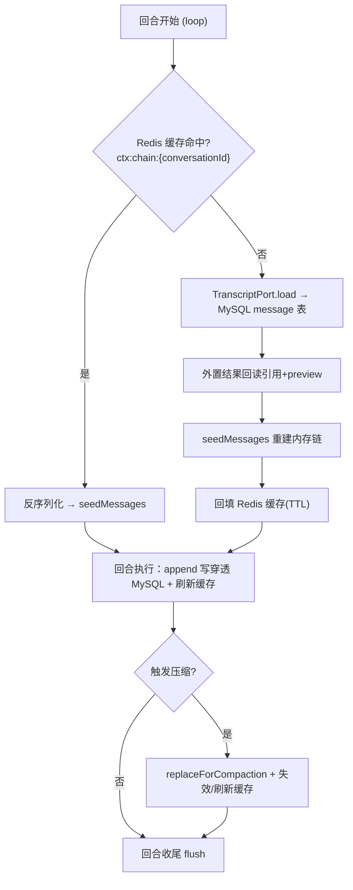
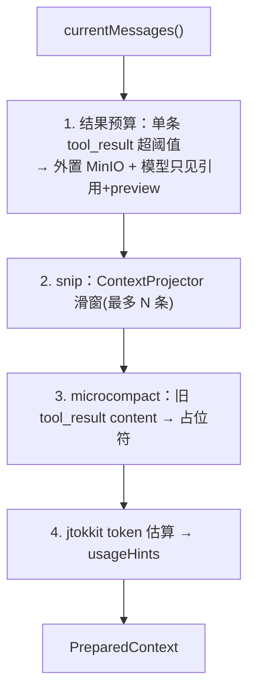

# context —— 上下文管理（运行期工作内存 + 投影 + 预算 + 压缩）（Wave 2 harness 基础）

> 本文是 PixFlow 完整重写阶段 `harness/context` 模块的设计文档，对应 `design.md` 第五章 5.1「Execution Loop（ContextSnapshot）」、5.3「Context Manager」，第六章 6.1「主循环行为」，以及 `module-dependency-dag-plan.md` 的 **Wave 2 harness 基础**。
> 范围：内部消息模型、append-only 运行期内存链、投影滑窗、Token 预算与确定性 cheap pipeline、摘要式 destructive compaction、ContextSnapshot 构建、子 Agent fork 上下文继承、大结果外置。本文不涉及 MVP 既有实现（MVP 无此层），从新架构需求重新推导。
> 思路参考 `docs/references/context-architecture.md`、`docs/references/compaction-architecture.md`（Python/OneCode），但**仅借鉴「内部消息模型 + 投影配对 + cheap/destructive 两层压缩 + snapshot 快照」的理念，存储模型、并发模型与类型契约全部以 Java 17 + Spring Boot 3 重新设计**。

---

## 目录

- [一、文档定位与设计原则](#一文档定位与设计原则)
- [二、与参考实现的本质差异](#二与参考实现的本质差异)
- [三、四方边界：context / session / conversation / 压缩归属](#三四方边界context--session--conversation--压缩归属)
- [四、模块结构与依赖位置](#四模块结构与依赖位置)
- [五、内部消息模型](#五内部消息模型)
- [六、MessageStore 与持久化接缝（TranscriptPort SPI）](#六messagestore-与持久化接缝transcriptport-spi)
- [七、多节点持久化模型：每轮 rehydrate + 可选 Redis 缓存](#七多节点持久化模型每轮-rehydrate--可选-redis-缓存)
- [八、投影滑窗（ContextProjector）](#八投影滑窗contextprojector)
- [九、Token 预算与确定性 cheap pipeline](#九token-预算与确定性-cheap-pipeline)
- [十、摘要式压缩（SummarizationPort SPI）与触发](#十摘要式压缩summarizationport-spi与触发)
- [十一、ContextSnapshot 与 ContextEngine](#十一contextsnapshot-与-contextengine)
- [十二、CurrentModelContext 与子 Agent fork 继承](#十二currentmodelcontext-与子-agent-fork-继承)
- [十三、大结果外置（共享 ToolResultStorage）](#十三大结果外置共享-toolresultstorage)
- [十四、与各模块的接缝契约](#十四与各模块的接缝契约)
- [十五、配置项](#十五配置项)
- [十六、测试策略](#十六测试策略)
- [十七、暂不考虑](#十七暂不考虑)

---

## 一、文档定位与设计原则

`harness/context` 在依赖 DAG 中处于 `infra/storage → context → {session, loop, conversation}` 的位置（Wave 2 harness 基础）。它是 Agent 决策回合的**运行期工作内存**：持有当前对话的消息链、把它投影/裁剪/压缩到模型上下文窗口、构建每轮模型调用的 `ContextSnapshot`，并为子 Agent fork 提供父轮上下文继承。

`context` 专属设计原则：

1. **纯运行期工作内存，持久化倒置给 session**。context 自身**不直连 MySQL**，只持有内存链与 append-only 语义；落库由 `TranscriptPort` SPI 委托给 `harness/session`（依赖倒置，复用 `common.ErrorRecorder` / `contracts.ConfirmationTokenStore` 同款手法）。这解释了依赖 DAG 中 `context → session` 的箭头方向——session 通过实现 context 的 SPI 反向接入。
2. **MySQL 是事实源，内存可重建**。`message` 表是会话 transcript 的唯一事实源（由 session 统一写）。context 的内存链与可选 Redis 缓存都是「同次运行内避免重复加载」的优化，**可丢可重建**，与 `design.md §5.4` State Store「Redis 缓存可丢失可重建、MySQL 才是断点」的口径一致。
3. **确定性优先，LLM 兜底**。上下文体积治理分两层：**cheap pipeline**（预算外置 + 投影滑窗 + microcompact，纯确定性、不调 LLM、不改写链）必跑；**destructive compaction**（摘要式，调 LLM）仅在超阈值/CONTEXT_LIMIT 时触发，且 LLM 摘要经 `SummarizationPort` SPI 倒置给 agent 层，context 不依赖 LLM 调用。
4. **不可变投影，杜绝别名修改**。对外返回的消息一律不可变拷贝（Java `record` + 防御性拷贝），替代参考实现的 `deepcopy`，避免上层句柄回写污染内部状态。
5. **保 tool call/result 配对**。任何投影/裁剪/压缩都不得产生孤立 `tool_result`（无对应 tool call），否则破坏 provider 协议；配对保护是投影器与压缩器的硬不变量。
6. **单一可见工具视图**。`ContextSnapshot.toolSchemas` 与 prompt 中工具说明同源（由调用方传入同一可见集合），context 不自行决定工具可见性，也不组装 system prompt——它只承载快照里的 `systemPrompt` 字符串结果。
7. **回合内线程封闭**。一个 `MessageStore` 实例封闭在单个回合的执行线程内；子 Agent fork 获得独立的 ephemeral 拷贝。并发由上层（同会话回合串行锁）保证，context 内部不引入复杂同步。

---

## 二、与参考实现的本质差异

参考实现 OneCode 是 Python/asyncio 单进程编码 Agent，上下文层是「内存优先 append-only + JSONL transcript 文件 + len/3 token 估算」，压缩层单独成 `services/compaction/`（cheap pipeline + fork 子 Agent 摘要 + session memory）。

PixFlow 的差异点：

| 维度 | OneCode（参考） | PixFlow（本模块） |
|---|---|---|
| 进程模型 | 单进程长驻，内存链一直在 | 多节点无状态 Spring，**每轮 rehydrate**（见 [七](#七多节点持久化模型每轮-rehydrate--可选-redis-缓存)） |
| 事实源 | JSONL 文件（`messages.jsonl`） | **MySQL `message` 表**（由 session 统一写） |
| 持久化归属 | message_store 直接写 transcript 文件 | context 经 `TranscriptPort` SPI 委托 session 落 MySQL |
| 热缓存 | 进程内内存即缓存 | 可选 Redis 缓存（可丢可重建），非事实源 |
| Token 估算 | `ceil(len/3)` 启发式 | **jtokkit**，按模型 encoding |
| 压缩模块切分 | `context` + `compaction` 两个 service | 合并在 `harness/context` 内（`design.md §12` 无独立 compaction 模块） |
| LLM 摘要 | compaction 持 `subagent_runner` 直接 fork | 经 `SummarizationPort` SPI 倒置给 agent 层实现 |
| session memory | 独立 `session-memory.md` + 提取子 Agent | **本期不做**（见 [十七](#十七暂不考虑)）；摘要直接进活动链 |
| 不可变 | `deepcopy` | `record` + 防御性拷贝 |

**可借鉴的结构骨架**：内部消息四角色、provider-neutral `tool_result`、投影滑窗配对保护、cheap/destructive 两层、ContextSnapshot/PreparedContext 中间产物、CurrentModelContext fork 继承、大结果外置 + 引用。
**必须重写的内核**：MySQL 事实源 + SPI 倒置持久化、每轮 rehydrate 多节点模型、jtokkit 预算、摘要 LLM 调用倒置、并发线程封闭。

---

## 三、四方边界：context / session / conversation / 压缩归属

参考实现把消息存储、transcript、投影、snapshot 全塞在 `services/context/`，压缩单独成 `services/compaction/`。PixFlow 按 `design.md §12` 拆成三个模块，并把压缩并入 context：

```
infra/storage ──► context ──► session ──► conversation
                     └──────► loop
                     ▲
        agent ───────┘  （实现 SummarizationPort SPI）
```

| 模块 | 职责 | 对应参考 |
|---|---|---|
| `harness/context` | **运行期工作内存**：消息模型、append-only 内存链、投影、Token 预算、cheap pipeline、摘要式压缩编排、ContextSnapshot、fork 继承、大结果外置 | `message_store` + `projector` + `snapshot` + `current_model_context` + `compaction/*` |
| `harness/session` | **transcript 持久化（唯一写者）**：实现 `TranscriptPort`，把消息链落 MySQL `message` 表、会话生命周期、恢复加载 | `transcript.py`（JSONL → MySQL） |
| `module/conversation` | **业务出口**：`conversation` 表 CRUD、REST、SSE 流式、附件关联；对 `message` 表**只读查询** | 无（参考无业务层） |

边界硬约束（与本次设计决策一致）：

1. **持久化归属**：context 纯内存 + SPI 委托；不直接读写 `message` 表。
2. **message 表唯一写者是 session**：所有 `message` 行的写入只经 session 的 `TranscriptPort` 实现；`module/conversation` 不写 `message` 表，只做查询与展示。用户发来的消息也经 context→`TranscriptPort`→session 落库，不由 conversation 直接插库。
3. **压缩归属**：cheap pipeline 与摘要式 destructive compaction 都在 context；LLM 摘要经 `SummarizationPort` 倒置给 agent。`design.md §12` 无独立 compaction 模块，本设计据此把压缩归 context。
4. **与 State Store / memory 不混**：`harness/state` 管任务/Agent 运行态（断点/进度/DAG 结构，任务维度）；`module/memory` 管业务记忆（偏好/SKU 历史/分析结论，经 `recall_memory` 召回）。context 只管**对话消息链**（会话维度），既不持久化任务态，也不做语义召回；裁剪优先级里的「关键记忆片段」只是一类需保留内容，其存取属 memory 模块。

---

## 四、模块结构与依赖位置

源码包：`com.pixflow.harness.context`（与仓库根包 `com.pixflow` 对齐；物理位置见 `design.md` 第十二章 `harness/context/`）。

```
harness/context/
├── model/
│   ├── Message.java               # 不可变 record：role + content + metadata + toolCallId
│   ├── MessageRole.java           # USER / ASSISTANT / TOOL_RESULT / ATTACHMENT
│   ├── MessageMetadata.java       # 压缩边界/摘要标记、外置引用标记等开放扩展位
│   └── ToolResultReference.java   # 外置结果引用（MinIO key + preview + 原始大小）
├── store/
│   ├── MessageStore.java          # 内存 append-only 链；currentMessages() 返回不可变拷贝
│   └── TranscriptPort.java        # SPI：append / load / replaceForCompaction（session 实现）
├── cache/
│   └── MessageChainCache.java     # SPI：热会话链可选缓存（infra/cache 实现，可丢可重建）
├── projection/
│   └── ContextProjector.java      # 滑窗投影，保 tool call/result 配对，丢孤立 tool_result
├── budget/
│   ├── TokenEstimator.java        # jtokkit 实现
│   └── ContextBudgetService.java  # cheap pipeline：结果预算 + snip + microcompact（确定性）
├── compaction/
│   ├── ContextCompactionService.java  # 编排 cheap + destructive；触发与断路
│   ├── SummarizationPort.java         # SPI：LLM 摘要（agent 层 fork 子 Agent 实现）
│   ├── CompactionTrigger.java         # MICRO / AUTO / MANUAL / REACTIVE
│   ├── CompactionConfig.java          # 窗口/阈值/保留条数/断路器配置
│   └── CompactionResult.java          # trigger / messages / tokenBefore/After / refs / metadata
├── snapshot/
│   ├── PreparedContext.java       # preparer 中间产物（messages + usageHints + refs）
│   └── ContextSnapshot.java       # 模型调用快照（systemPrompt + messages + toolSchemas + ...）
├── engine/
│   └── ContextEngine.java         # buildForModel：内存链 → preparer 链 → snapshot
└── runtime/
    └── CurrentModelContext.java   # 持有最近 snapshot，供子 Agent fork 继承父 systemPrompt
```

依赖方向：

```
context ──► common（PixFlowException / ErrorCategory.CONTEXT_LIMIT：超窗归一化）
context ──► infra/storage（大结果外置 ToolResultStorage；见 §13）
session ──► context（实现 TranscriptPort，落 MySQL message 表）
infra/cache ──► context（实现 MessageChainCache，可选热缓存）
agent ──► context（实现 SummarizationPort，fork 子 Agent 调 LLM 摘要）
loop ──► context（每轮 buildForModel 取 snapshot；append 用户/assistant/tool 消息）
conversation ──► context（共享消息模型；触发 append；只读查询走 session 侧 repo）
```

> **新增依赖边说明**：`SummarizationPort` 由 `agent` 层实现引入 `agent → context` 边（agent 在 Wave 5，远高于 context，无环）。`MessageChainCache` 由 `infra/cache` 实现引入 `infra/cache → context` 边（cache 在 Wave 1，但它只实现 context 定义的 SPI，是倒置接入，不构成环——与 `infra/cache` 实现 `contracts.ConfirmationTokenStore` 同理）。这两条 SPI 倒置边在 `module-dependency-dag-plan.md` 的依赖图中体现为「实现方指向 SPI 定义方」。

> **接口约束**：context 不引用 `harness/tools` 的 `ToolDescriptor` 等类型；`ContextSnapshot.toolSchemas` 用 context 自定义的最小 schema 视图（由调用方填充），避免 `context → tools` 倒挂。

---

## 五、内部消息模型

context 持有 provider-neutral 的内部消息，由 provider adapter（`infra/ai`）在调用前投影为目标 wire format。

### 5.1 `MessageRole`

```java
public enum MessageRole {
    USER,         // 用户输入
    ASSISTANT,    // 模型输出（可含 tool_use）
    TOOL_RESULT,  // 工具结果（provider-neutral，adapter 投影为目标格式）
    ATTACHMENT    // durable internal role：附件（图片/素材包引用），调用前投影后隐藏
}
```

- `TOOL_RESULT` 保持中立，不绑定任何供应商的 tool message 格式；`infra/ai` 的 adapter 负责投影。
- `ATTACHMENT` 是 durable internal role：承载素材包/图片引用，与 `module/conversation` 的附件关联对应。本期其投影为**轻量直通**（把 MinIO 引用/元信息拼入调用前可见内容，调用后在内部链保留、在模型视图隐藏），不做复杂附件治理（见 [十七](#十七暂不考虑)）。

### 5.2 `Message`

```java
public record Message(
    String id,                  // 内部消息 id（落库后与 message.id 对齐）
    MessageRole role,
    String content,             // 文本内容；大 tool_result 外置后此处为引用+preview
    String toolCallId,          // TOOL_RESULT 配对用；其它角色为 null
    MessageMetadata metadata,   // 压缩边界/摘要/外置标记等
    Instant createdAt
) {
    // compact constructor 做非空与配对自洽校验（TOOL_RESULT 必须有 toolCallId）
}
```

`MessageMetadata` 用开放扩展位（不可变 `Map` 包装）承载跨阶段标记：

| 标记键 | 含义 | 写入方 |
|---|---|---|
| `isCompactBoundary` | 压缩边界消息（摘要前的分界） | ContextCompactionService |
| `compactTrigger` | 触发来源（AUTO/MANUAL/REACTIVE） | ContextCompactionService |
| `isCompactSummary` | 摘要消息 | ContextCompactionService |
| `toolResultExternalized` + `toolResultRef` | 大结果外置标记与引用 | ContextBudgetService / session |
| `microcompacted` | 旧 tool_result 已降级为占位符 | ContextBudgetService |
| `placeholder` | fork 占位 tool_result（补未闭合 tool_use） | fork 流程（见 §12） |

---

## 六、MessageStore 与持久化接缝（TranscriptPort SPI）

### 6.1 `MessageStore`

内存优先 append-only 链，是回合执行期对消息的唯一可写入口。每次 append **写穿透**到 `TranscriptPort`（由 session 落 MySQL），并刷新可选热缓存。

```java
public final class MessageStore {
    Message appendUser(String content);
    Message appendAssistant(Message assistant);
    List<Message> appendToolResults(List<Message> results);
    List<Message> appendAttachments(List<Message> attachments);

    List<Message> currentMessages();   // 返回不可变拷贝
    List<Message> seedMessages(List<Message> messages);   // rehydrate 用

    /** 压缩改写活动链的唯一入口：替换内存链 + append-only 写入新 records。 */
    List<Message> replaceMessagesForCompaction(List<Message> messages,
                                               CompactionTrigger trigger,
                                               Map<String,Object> metadata);

    void bindConversation(String conversationId);
    void flush();   // 显式 flush transcript（回合收尾 / 测试）
}
```

- `currentMessages()` 返回**不可变拷贝**，外部无法回写内部状态。
- `replaceMessagesForCompaction` 是 destructive compaction 改写活动链的**唯一入口**；cheap pipeline 的投影**不**走它（只投影，不改写）。
- `MessageStore` 实例**回合内线程封闭**，不做内部锁；同会话回合串行由上层保证。

### 6.2 `TranscriptPort` SPI（倒置接缝核心）

context 定义、session 实现。这是 context 与 session 解耦的关键：context 面向 SPI 编程，session 提供 MySQL 实现并在装配期注入。

```java
public interface TranscriptPort {
    /** append-only 落库一批消息（session → MySQL message 表 + 大结果外置）。 */
    List<Message> append(String conversationId, List<Message> messages);

    /** rehydrate：按会话加载消息链（分页/上限可配；外置结果回读引用+preview）。 */
    List<Message> load(String conversationId);

    /** 压缩改写：append-only 写入新边界+摘要+tail records，并标注压缩元信息。 */
    List<Message> replaceForCompaction(String conversationId,
                                       List<Message> messages,
                                       CompactionTrigger trigger,
                                       Map<String,Object> metadata);
}
```

- **session 是 `message` 表唯一写者**（设计决策四）：`append` / `replaceForCompaction` 是 message 行的唯一写路径；`module/conversation` 不写此表。
- 大结果外置在 session 落库时同步进行（写 MinIO + 表内存引用），与 cheap pipeline 的外置共享同一 `ToolResultStorage`（见 [十三](#十三大结果外置共享-toolresultstorage)）。
- 恢复语义：`load` 回读时若外置结果文件缺失，保留 preview 并标 `missingExternalToolResult`，不阻断 rehydrate。

---

## 七、多节点持久化模型：每轮 rehydrate + 可选 Redis 缓存

参考实现的「内存优先」假设单进程长驻；PixFlow 是水平扩展的无状态 Spring 后端，同一会话的相邻回合可能落在不同节点。因此重新诠释为**每轮 rehydrate + 可选热缓存**：



- **事实源**：MySQL `message` 表。缓存 miss 时永远能从 MySQL 重建。
- **缓存键**：`ctx:chain:{conversationId}`，TTL 可配；压缩改写时**失效或整体刷新**，避免读到旧链。缓存由 `MessageChainCache` SPI 抽象，`infra/cache` 提供 Redis 实现（倒置接入，可丢可重建）。
- **故障转移**：节点切换后下一回合在新节点 rehydrate，无需会话-节点亲和。
- **并发**：同会话回合串行由上层（loop / conversation 的会话级锁）保证；context 不在缓存层做跨节点强一致，仅保证「单写者顺序写穿透 + 压缩时失效缓存」。

> 设计取舍：不引入 sticky 会话亲和。每轮 rehydrate 简单、天然支持故障转移与扩缩容，缓存只是减少 MySQL 往返的优化。这与 `design.md §5.4`「Redis 缓存仅为同次运行内避免重算的优化、可丢失可重建」一致。

---

## 八、投影滑窗（ContextProjector）

`ContextProjector` 是确定性、无副作用的纯函数组件：深拷贝输入 → 滑窗 → 丢弃孤立 `tool_result`。

```java
public final class ContextProjector {
    List<Message> project(List<Message> messages);                 // 深拷贝 + 滑窗 + 配对保护
    int adjustStartIndexToPreserveToolPairs(List<Message> msgs, int startIndex);
}
```

- 仅处理 `USER` / `ASSISTANT` / `TOOL_RESULT` 配对；**不处理 `ATTACHMENT`**（附件投影是 ATTACHMENT 角色的轻量直通，不归投影器）。
- **配对保护硬不变量**：滑窗起点若落在某 tool call/result 配对中间，向前回退起点以保留完整配对，绝不产出孤立 `tool_result`。
- 投影只读不改写内存链；它服务 cheap pipeline 的 snip 步骤与压缩的 tail 选取。

---

## 九、Token 预算与确定性 cheap pipeline

cheap pipeline 是**每次模型调用前必跑**的确定性治理，只投影不改写活动链。由 `ContextBudgetService` 实现，`ContextCompactionService.prepare` 调用。

顺序：



1. **结果预算**：单条 `tool_result` UTF-8 内容超阈值（默认 50KB，`design.md §5.2/§13.4`）→ 经共享 `ToolResultStorage` 写 MinIO，模型只见引用 + 前若干字符 preview。已外置的复用同一文件（去重）。
2. **snip**：`ContextProjector` 滑窗，最多 `snipMaxMessages` 条，保配对。
3. **microcompact**：保留最近 `microcompactKeepRecent` 条之外的、未外置的旧 `tool_result` content 降级为占位符（标 `microcompacted`），进一步压体积。
4. **Token 估算**：`TokenEstimator`（jtokkit，按模型 encoding）估算，写入 `usageHints`（含 `tokenAfter`、是否逼近阈值、`requestOverrides` 如 `maxOutputTokens`）。

`TokenEstimator` 用 jtokkit 取代参考的 `len/3`；encoding 按所选模型配置选择，无对应 encoding 时回退保守估算（偏高，宁可早压缩）。

---

## 十、摘要式压缩（SummarizationPort SPI）与触发

cheap pipeline 之上是 **destructive compaction**：当 token 仍逼近窗口阈值时，调用 LLM 把历史摘要成更短的边界+摘要消息，**改写活动链**。LLM 调用经 `SummarizationPort` 倒置给 agent 层（fork 子 Agent），context 不依赖 LLM 客户端。

### 10.1 `SummarizationPort` SPI

```java
public interface SummarizationPort {
    /** 把待压缩消息摘要成连续性文本；focus/summaryInstructions 可选注入。 */
    SummaryResult summarize(SummarizationRequest request);
}
```

- 由 `agent` 层实现（fork 子 Agent 调文本 LLM，复用 `infra/ai`）。这引入 `agent → context` 的 SPI 倒置边。
- `summaryInstructions` 来自 `PreCompact` hook 的 metadata（见 [十四](#十四与各模块的接缝契约)）。
- 子 Agent 摘要属于 agent 层 runner 的能力，context 只描述请求/结果形状。

### 10.2 触发与编排

```java
public final class ContextCompactionService {
    PreparedContext prepare(List<Message> messages, RuntimeState state);          // cheap pipeline 入口
    Optional<CompactionResult> maybeAutoCompact(List<Message> messages, RuntimeState state);
    CompactionResult manualCompact(RuntimeState state, String focus);
    CompactionResult reactiveCompact(RuntimeState state, PixFlowException contextLimitError);
}
```

| 触发 | 来源 | 行为 |
|---|---|---|
| `MICRO` | cheap pipeline 内 microcompact | 仅投影降级，不改写链、不调 LLM |
| `AUTO` | `prepare` 后 `tokenAfter ≥ autoCompactThreshold` 且当前非压缩子 Agent | 调 `SummarizationPort` 摘要 → 改写链 |
| `MANUAL` | 用户 `/compact`（经 conversation/loop） | 同上，可带 `focus` |
| `REACTIVE` | `infra/ai` 抛 `CONTEXT_LIMIT`（`common` 归一化）→ loop 触发 | 摘要后重试一次（`maxReactiveRetries`） |

destructive 产物：`(boundaryUserMsg, summaryUserMsg, *tail)`，经 `replaceMessagesForCompaction` 改写链；boundary 标 `isCompactBoundary`+`compactTrigger`，summary 标 `isCompactSummary`。tail 由 token/消息数选取，并用 `adjustStartIndexToPreserveToolPairs` 保配对。

### 10.3 LLM 不可用/失败的确定性兜底

`SummarizationPort` 未装配（如纯 harness 测试）或连续失败触发断路器时，**回退到 `design.md §5.3` 的优先级裁剪**（确定性，不调 LLM）：

> 保留顺序：**用户最新指令 > 当前任务状态 > Lifecycle Hooks 强规则 > 关键记忆片段 > 历史对话**。

即按优先级从低到高丢弃历史，直到 token 落到阈值内。这保证 context 在没有 agent 层 SPI 时**仍能独立工作并被属性测试**（`design.md §15` 把「确定性底座单独属性测试」列为风险缓解）。

- **断路器**：连续 destructive compaction 失败 ≥ `maxConsecutiveFailures` 后，跳过摘要、直接走优先级裁剪并发 `CompactFailed`。
- **REACTIVE 重试上限**：`maxReactiveRetries`（默认 1），超限则放弃摘要、用优先级裁剪保证可继续。

---

## 十一、ContextSnapshot 与 ContextEngine

### 11.1 `PreparedContext` / `ContextSnapshot`

```java
public record PreparedContext(
    List<Message> messages,
    Map<String,Object> usageHints,
    List<ToolResultReference> transcriptRefs
) {}

public record ContextSnapshot(
    String systemPrompt,                 // 由调用方(agent/loop)组装后传入，context 不组装
    List<Message> messages,
    List<ToolSchemaView> toolSchemas,    // 可见工具 schema（最小视图，单一可见集合）
    Map<String,Object> usageHints,
    List<ToolResultReference> transcriptRefs,
    CompactionResult transition          // 本轮发生压缩时的过渡信息，可空
) {}
```

- `systemPrompt` 与 `toolSchemas` 由**调用方传入**（prompt 组装在 agent 层 §6.2，可见工具集来自 tools registry）。context 只承载结果、保证「快照里的工具说明与模型可见 schema 同源」。
- `usageHints` 携带 token 估算、压缩信息、`requestOverrides`（如 `maxOutputTokens`）。

### 11.2 `ContextEngine`

每轮模型调用前由 loop 调用，把内存链跑过 preparer 链，产出快照并记录为当前快照。

```java
public final class ContextEngine {
    ContextSnapshot buildForModel(RuntimeState state,
                                  String systemPrompt,
                                  List<ToolSchemaView> toolSchemas);
}
```

流程：`currentMessages()` → `ContextCompactionService.prepare`（cheap pipeline）→ 必要时 `maybeAutoCompact` → 组装 `ContextSnapshot`（注入传入的 systemPrompt/toolSchemas）→ 写入 `CurrentModelContext` → 返回。

`design.md §5.1` 要求「每轮记录 ContextSnapshot，异常可回溯」：snapshot 是该可回溯记录的载体，由 loop 在调用 LLM 前后落入 trace（trace 写入是 loop 经 eval SPI 的责任，context 不自记）。

---

## 十二、CurrentModelContext 与子 Agent fork 继承

```java
public final class CurrentModelContext {
    void set(ContextSnapshot snapshot);
    Optional<ContextSnapshot> snapshot();
}
```

- `ContextEngine.buildForModel` 每次写入最近一次 `ContextSnapshot`。
- 子 Agent **fork** 时（`subagent-architecture.md`）继承父轮已渲染的 `ContextSnapshot.systemPrompt` 字符串，复用父上下文与 prompt 字节，而非重新组装。
- fork 构造消息链时：深拷贝父 `currentMessages()`；若末条 assistant 有未闭合 tool_use，为每个缺失 `toolCallId` 追加占位 `tool_result`（标 `placeholder`），修复 provider 协议错误；再追加 fork directive 的 user 消息。子 Agent 用 ephemeral `MessageStore`（不绑定 `TranscriptPort`、不落 `message` 表），中间消息只在子 runtime 内存，父链只收子 Agent 工具的最终结果。
- 该 holder 放在 context 边界，避免 `loop` 反向依赖 subagent 包（与参考一致）。

---

## 十三、大结果外置（共享 ToolResultStorage）

大 `tool_result` 外置到 MinIO、模型只见引用+preview，是防上下文膨胀的关键。**三处共享同一实现**，不各写一套：

| 使用点 | 触发 |
|---|---|
| transcript 落库（session） | 写 `message` 行时大内容外置 |
| cheap pipeline 结果预算（context） | 调用前单条 tool_result 超阈值 |
| Tool 执行管线结果预算（`harness/tools §5.2`） | handler 结果超阈值 |

共享实现归属 `infra/storage`（`storage → context` / `storage → tools` 边已存在；session 经 context 间接可达）。约定：

- 路径 `tool-results/{id}.txt`（`design.md §13.4`）。
- 命名/去重：同 `toolCallId` 且内容相同复用同一文件；同 id 内容不同用稳定内容 hash 后缀。
- 读取：回读完整 content；缺失则保留 preview 并标 `missingExternalToolResult`。
- context 只**消费** `ToolResultStorage`（持久化引用、生成模型可见引用文本），不拥有通用存储实现。

---

## 十四、与各模块的接缝契约

| 对接方 | 契约 |
|---|---|
| `harness/session` | 实现 `TranscriptPort`，是 `message` 表唯一写者；`append`/`load`/`replaceForCompaction`；落库时经共享 `ToolResultStorage` 外置大结果 |
| `module/conversation` | 共享 context 消息模型；用户消息经 context→`TranscriptPort` 落库（不直接写 `message` 表）；历史展示走**只读**查询；SSE 流式与附件关联在 conversation，附件以 `ATTACHMENT` 消息进 context |
| `harness/loop` | 每轮 `buildForModel` 取快照；append 用户/assistant/tool 消息；`CONTEXT_LIMIT` 时触发 `reactiveCompact`；snapshot 落 trace 由 loop 经 eval SPI 负责 |
| `agent` | 实现 `SummarizationPort`（fork 子 Agent 调 LLM 摘要）；组装 systemPrompt 与可见 toolSchemas 传入 `buildForModel` |
| `infra/ai` | provider adapter 把内部 `TOOL_RESULT`/`ATTACHMENT` 投影为目标 wire format；模型调用超窗抛 `CONTEXT_LIMIT`（`common` 归一化），由 context/loop 消费 |
| `infra/storage` | 提供共享 `ToolResultStorage`（外置/去重/回读） |
| `infra/cache` | 实现 `MessageChainCache`（Redis 热缓存，可丢可重建；压缩时失效） |
| `harness/hooks` | `PreCompact` 返回 `summaryInstructions` 注入 `SummarizationRequest`；`PostCompact`/`CompactFailed` 为观察事件（context 在压缩各阶段派发，hooks 不写 trace） |
| `common/error` | 捕获/认 `CONTEXT_LIMIT`（默认 `recovery=COMPACT`）触发压缩，**不向上冒泡到 HTTP**；内部异常归一化为 `PixFlowException` |
| `harness/state` / `module/memory` | 边界隔离：context 不持久化任务态、不做语义召回（见 [三](#三四方边界context--session--conversation--压缩归属)） |

**关键不变量**：① context 不直连 MySQL，持久化经 `TranscriptPort` 倒置给 session；② `message` 表唯一写者是 session；③ 任何投影/压缩保 tool call/result 配对；④ LLM 摘要经 `SummarizationPort` 倒置，缺失时确定性优先级裁剪兜底；⑤ context 零 `harness/eval` 依赖，trace 责任上移。

---

## 十五、配置项

```yaml
pixflow:
  context:
    cache:
      enabled: true                 # 热会话链 Redis 缓存开关（可丢可重建）
      ttl: 30m                      # 缓存 TTL
    budget:
      tool-result-externalize-threshold: 51200   # 50KB，超则外置 MinIO
      snip-max-messages: 80         # 投影滑窗最大消息条数
      microcompact-keep-recent: 5   # 保留最近 N 条 tool_result 不降级
    compaction:
      context-window-tokens: 128000         # 模型上下文窗口（按模型配置）
      summary-output-reserved-tokens: 20000 # 摘要输出预留
      auto-compact-buffer-tokens: 15000     # 自动压缩缓冲
      # 派生：effective = window - reserved；threshold = effective - buffer
      max-consecutive-failures: 3   # destructive 连续失败断路阈值
      max-reactive-retries: 1       # CONTEXT_LIMIT 反应式压缩重试上限
```

- 窗口/预留/缓冲为派生阈值的输入（参考默认值：window=128K、reserved=20K、buffer=15K → threshold≈93K），具体随所选模型配置。
- 阈值是「保守偏早压缩」取向：宁可早压缩，不冒超窗中断风险。

---

## 十六、测试策略

- **投影配对**：滑窗起点落在配对中间时，断言回退保留完整 tool call/result；断言绝不产出孤立 `tool_result`；ATTACHMENT 不被投影器处理。
- **不可变性**：`currentMessages()` 返回的 list 与元素修改不影响内部链。
- **cheap pipeline**：结果预算外置（>50KB 写 MinIO + 引用+preview、去重复用）、snip 上限、microcompact 占位、jtokkit 估算单调性。
- **持久化倒置**：用 in-memory `TranscriptPort` 替身验证 append 写穿透、`load` rehydrate、`replaceForCompaction` 改写；断言 context 不出现任何 MySQL 直连。
- **rehydrate + 缓存**：缓存命中走反序列化、miss 走 `load` 回填；压缩后缓存失效；缺失外置结果保 preview 不阻断。
- **destructive compaction**：AUTO/MANUAL/REACTIVE 三触发产物结构（boundary+summary+tail）、tail 配对保护、`transition` 填充。
- **SPI 缺失兜底**：无 `SummarizationPort` 时回退优先级裁剪（用户最新指令 > 任务状态 > Hooks 强规则 > 关键记忆 > 历史对话），断言按序丢弃且 token 落入阈值。
- **断路器/重试**：连续失败 ≥ 阈值跳过摘要、发 `CompactFailed`；REACTIVE 超重试上限回退裁剪。
- **fork 继承**：占位 tool_result 补未闭合 tool_use；子 Agent ephemeral store 不落 `message` 表；继承父 `systemPrompt`。
- **属性测试**：对投影/裁剪做属性测试（任意消息序列下，输出始终保配对、token 不超阈值、用户最新消息恒保留）。

---

## 十七、暂不考虑

- **session memory（跨压缩连续性 Markdown + 提取子 Agent）**：参考实现的 `session-memory.md` 机制本期不做；摘要直接进活动链，不维护独立 session 级 memory 文件。
- **附件治理**：`ATTACHMENT` 仅做轻量直通投影；复杂附件去重/降级/多模态附件预算治理本期不做。
- **稀疏/BM25 或语义层面的智能裁剪**：裁剪是确定性优先级 + 滑窗，不引入向量相似度选择保留消息（语义召回属 `module/memory`）。
- **跨会话上下文共享 / 多对话合并**：context 以单会话为单位，不做跨会话拼接。
- **会话-节点亲和（sticky session）**：采用每轮 rehydrate，不做节点亲和。
- **provider 级 context caching**：prompt 复用走 `agent §6.2` 的 section 缓存，不依赖服务商 context caching。
- **多租户上下文隔离**：`design.md §16` 本期不做多账号。
