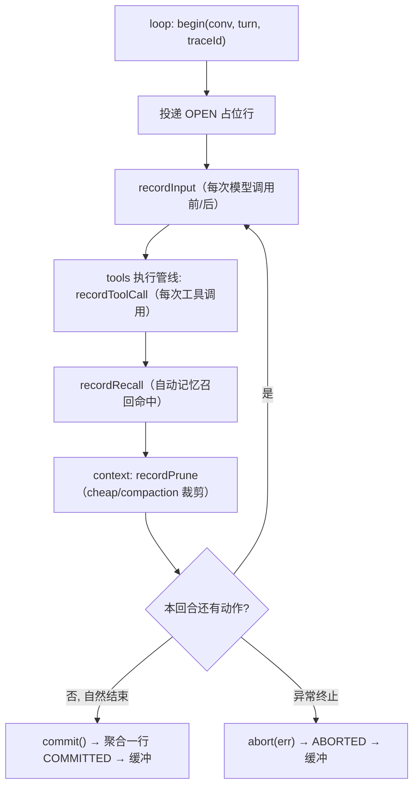
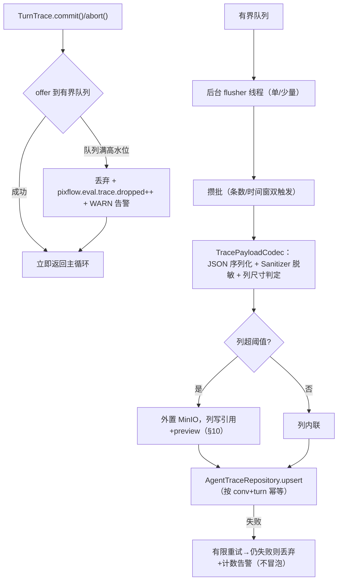

# eval —— Evaluation Interface（trace 记录汇聚 + 回放数据源 + 错误落盘）（Wave 2 harness 基础）

> 本文是 PixFlow 完整重写阶段 `harness/eval` 模块的设计文档，对应 `design.md` 第五章 5.6「Evaluation Interface（评估接口）」、第十一章「Rubrics 评估（离线阶段）」、第十二章 `harness/eval/`、第十三章 13.1 `agent_trace` 表，以及 `module-dependency-dag-plan.md` 的 **Wave 2 harness 基础**。
> 范围：trace 记录写面（回合级累积器 + 异步非阻塞落库）、读面（查询 / 回放，喂 `module/rubrics` 与问题追溯）、`common.ErrorRecorder` SPI 实现、`agent_trace` 数据模型、大 payload 外置、保留与归档。本文不涉及 MVP 既有实现（MVP 无此层），从新架构需求重新推导。
> 思路参考 `docs/references/hook-architecture.md` 中提到的 OneCode `TraceRecorder` 理念（registry 持 recorder 自记 span），但 PixFlow **把可观测责任上移给调用方、eval 退化为被动 sink**，执行模型、存储模型与类型契约全部以 Java 17 + Spring Boot 3 重新设计。

---

## 目录

- [一、文档定位与设计原则](#一文档定位与设计原则)
- [二、与参考实现的本质差异](#二与参考实现的本质差异)
- [三、模块结构与依赖位置](#三模块结构与依赖位置)
- [四、三个面：写 / 读 / 错误落盘](#四三个面写--读--错误落盘)
- [五、写面：回合级累积器（TraceRecorder / TurnTrace）](#五写面回合级累积器tracerecorder--turntrace)
- [六、异步非阻塞落库管线](#六异步非阻塞落库管线)
- [七、读面：查询与回放（喂 rubrics + 问题追溯）](#七读面查询与回放喂-rubrics--问题追溯)
- [八、ErrorRecorder SPI 实现](#八errorrecorder-spi-实现)
- [九、数据模型（agent_trace）](#九数据模型agent_trace)
- [十、大 payload 外置](#十大-payload-外置)
- [十一、保留与归档（7 天）](#十一保留与归档7-天)
- [十二、与各模块的接缝契约](#十二与各模块的接缝契约)
- [十三、配置项](#十三配置项)
- [十四、测试策略](#十四测试策略)
- [十五、暂不考虑](#十五暂不考虑)

---

## 一、文档定位与设计原则

`harness/eval` 在依赖 DAG 中处于 `eval → loop`、`eval → rubrics` 的位置（Wave 2 harness 基础）。它是 Agent 决策回合的**可观测记录汇聚层**：被动接收 loop / tools 投递的每轮 trace，异步落 MySQL `agent_trace` 表，对离线 `module/rubrics` 与人工问题追溯提供查询 / 回放数据源；同时实现 `common` 的 `ErrorRecorder` SPI，承接归一化错误的落盘与错误指标。

`eval` 专属设计原则：

1. **记录，不评估**。`design.md §5.6` 名为「Evaluation Interface」，含义是「为评估**提供**接口」，不是「执行评估」。所有评分（图片质量 / 文案质量 / 决策质量）归 `module/rubrics`（Wave 6 离线，`design.md §11`）。eval 只产出 trace + 回放 + 错误记录，绝不打分、绝不在线触发 Rubrics 预警（与 `hooks.md §六`「Rubrics 预警不接入在线 hook 链」一致）。

2. **被动 sink，可观测责任上移**。trace 责任在调用方：loop / tools **主动投递**数据给 eval，eval 不反向去 loop / tools 内部抓取。这正是 `context.md`「snapshot 落 trace 由 loop 经 eval SPI 负责」、`hooks.md`「hooks 零观测依赖，trace 由调用方记录」的承接端。eval 只定义投递契约 + 落库 + 查询。

3. **写路径异步非阻塞**。`design.md §6.1` 要求 Agent 回合「请求内同步执行、秒级」。trace 落库绝不能卡在主循环里等 MySQL——采用**进程内有界缓冲 + 批量异步刷库**，主循环 `commit()` 投递即返回。

4. **best-effort，不是事实源**。`agent_trace` 是旁路观测记录，**可丢可降级**；事实源是 `message`（session 写）/ `process_result`（task 写）。缓冲高水位时**丢弃 + 计数告警**，永不阻塞主循环、永不污染业务流程（trace 缺失由离线 rubrics 容忍）。这与 `design.md §5.4`「Redis 缓存可丢失可重建、MySQL 才是断点」的可靠性分层口径一致。

5. **单表单写者，直接拥有持久化**。`agent_trace` 由 eval **独占写入**（不像 `message` 表要倒置给 session）。无写者冲突，故 eval 直接持有自己的 MyBatis-Plus repository，不做持久化倒置——这比 context 倒置给 session 更简单，且不违反「单表单写者」纪律。

6. **崩溃可见**。回合中途崩溃时，已投递的分段 trace 仍可见（`turn_status=OPEN`），便于定位崩在哪一步；回合正常收尾置 `COMMITTED`。问题追溯价值优先于「每回合恰好一次写」。

7. **脱敏前置 + 不喂模型**。任何落库内容先过 `common.Sanitizer`（遮蔽 token/AK-SK、相对化路径、截断）。trace 是给离线分析与排障的，**绝不回流到模型上下文**（防泄露与上下文膨胀）。

8. **零评估依赖、零业务依赖**。eval 不依赖 `module/rubrics`、不依赖任何业务模块；是 rubrics 反向依赖 eval（`eval → rubrics` 边）。eval 只依赖 `common` 与 `infra/storage`。

---

## 二、与参考实现的本质差异

参考实现 OneCode 的可观测是「`HookRegistry` / executor 内部持有一个 `TraceRecorder`，在各扩展点自己记 span」——记录者与被记录者耦合在同一组件里。

PixFlow 的差异点：

| 维度 | OneCode（参考） | PixFlow（本模块） |
|---|---|---|
| 记录者归属 | 组件内自持 `TraceRecorder` 自记 | 责任上移：loop/tools 经 eval SPI **投递**，eval 独立成 sink |
| 存储 | 进程内 / 轻量文件 span | **MySQL `agent_trace`**（JSON 列，可 SQL 查询 + 回放） |
| 写入时机 | 同步随调用记录 | **异步有界缓冲 + 批量刷库**，主循环不阻塞 |
| 可靠性 | 尽力 | best-effort + 高水位告警 + 崩溃可见（`turn_status`） |
| 粒度 | 细粒度 span 流 | **每回合一行**聚合（含 input/tool_calls/recall/prune 四段） |
| 错误落盘 | 分散 | 统一实现 `common.ErrorRecorder`，错误并入 trace + 错误指标 |
| 评估耦合 | 无明确离线边界 | 严格区分：eval 记录、rubrics 离线评分，eval 零评估依赖 |
| 大结果 | 内联 | 复用 `infra/storage` 外置，trace 行只存引用 + preview |

**可借鉴的结构骨架**：`TraceRecorder` 抽象、span 字段（输入 / 工具调用 / 召回 / 裁剪）、回放数据来源理念。
**必须重写的内核**：责任上移的被动 sink 模型、异步有界缓冲落库、MySQL JSON 列事实记录、回合级聚合、崩溃可见状态机、错误落盘 SPI、大 payload 外置。

---

## 三、模块结构与依赖位置

源码包：`com.pixflow.harness.eval`（与仓库根包 `com.pixflow` 对齐；物理位置见 `design.md` 第十二章 `harness/eval/`）。

```
harness/eval/
├── api/
│   ├── TraceRecorder.java          # 写面 SPI：begin(...) → TurnTrace（loop/tools 调用）
│   ├── TurnTrace.java              # 回合级累积器：recordInput/ToolCall/Recall/Prune + commit
│   ├── TraceQuery.java             # 读面：按会话/回合/条件查询（rubrics + 排障）
│   └── TraceReplay.java            # 读面：回合回放重建（外置引用回读）
├── model/
│   ├── TraceInput.java             # system prompt 摘要 + 消息快照引用 + 可见工具 schema 视图
│   ├── TraceToolCall.java          # name/input/result引用/classification/permission决策视图/耗时/error
│   ├── TraceRecall.java            # 自动记忆召回内容（section/命中/分值/RRF/衰减）
│   ├── TracePruneEntry.java        # cheap pipeline / compaction 裁剪日志条目
│   ├── TurnTraceRecord.java        # 读面回放载体（一行 agent_trace 的解码视图）
│   └── TurnStatus.java             # OPEN / COMMITTED / ABORTED
├── recorder/
│   ├── DefaultTraceRecorder.java   # 写面实现：创建回合内 TurnTrace
│   ├── BufferedTurnTrace.java      # 回合内线程封闭累积，commit 投递缓冲
│   └── TraceIngestBuffer.java      # 有界队列 + 批量异步刷库 + 高水位降级
├── error/
│   └── EvalErrorRecorder.java      # 实现 common.observability.ErrorRecorder
├── store/
│   ├── AgentTraceEntity.java       # agent_trace 表映射
│   ├── AgentTraceMapper.java       # MyBatis-Plus mapper（eval 独占写）
│   └── AgentTraceRepository.java   # 落库 / 查询封装 + JSON 编解码
├── retention/
│   └── TraceRetentionJob.java      # @Scheduled + ShedLock：7 天保留清理
├── config/
│   ├── EvalProperties.java
│   └── EvalAutoConfiguration.java
└── support/
    └── TracePayloadCodec.java      # JSON 序列化 + 脱敏 + 列尺寸上限/外置判定
```

依赖方向：

```
eval ──► common（Sanitizer 脱敏；PixFlowException/ErrorCategory 归一化；实现 ErrorRecorder SPI）
eval ──► infra/storage（大 payload 外置 ToolResultStorage；见 §10）
loop  ──► eval（每轮 begin/record*/commit；snapshot 与工具调用落 trace）
tools ──► eval（执行管线把单次工具调用 span 投递给当前回合 TurnTrace）
rubrics ──► eval（离线消费 TraceQuery/TraceReplay）
common ──► eval（ErrorRecorder SPI 由 eval 实现，装配期注入；倒置接入，不构成环）
```

> **依赖边说明**：`common → eval` 是 SPI 倒置（common 定义 `ErrorRecorder`，eval 实现并注入），与 `common.md §9.1`「`common` 只定义 `ErrorRecorder` SPI，实现由 `harness/eval` 注入」一致，**不构成环**（实现方指向 SPI 定义方）。`storage → eval` 是 eval 消费 `infra/storage` 的 `ToolResultStorage`，是新增的一条真实编译依赖边——`module-dependency-dag-plan.md` 的依赖图当前未画此边，应同步补一条 `storage --> eval`（与 `storage --> context`/`storage --> tools` 同理：均为大结果外置消费方）。

> **接口约束**：eval 不引用 `harness/tools` 的 `ToolDescriptor`、`ToolCallClassification`，也不引用 `harness/context` 的 `ContextSnapshot` 等具体类型（否则 `eval → tools`/`eval → context` 倒挂）。写面 model（`TraceInput`/`TraceToolCall`/...）是 eval 自定义的**最小记录视图**，由调用方在投递前适配填充（含 `permissionDecision` / `classification` 的只读字符串视图）。

---

## 四、三个面：写 / 读 / 错误落盘

eval 对外是三个解耦的面，互不阻塞、各自职责单一：

| 面 | 接口 | 服务对象 | 性质 |
|---|---|---|---|
| **写面** | `TraceRecorder` / `TurnTrace` | `harness/loop`、`harness/tools` 执行管线 | 在线、被动、异步非阻塞 |
| **读面** | `TraceQuery` / `TraceReplay` | `module/rubrics`（离线）、人工问题追溯 | 离线、只读 |
| **错误落盘** | `common.ErrorRecorder`（eval 实现） | `common` 各渲染器 / MQ 消费判定 | 在线、异步、best-effort |

三个面共享同一 `agent_trace` 表与同一异步缓冲管线，但语义边界清晰：写面记「回合发生了什么」，读面供「事后看回合」，错误落盘把归一化错误关联进当前回合（或独立记录）。

**eval 不做指标门面**。`design.md §4` 选了 Micrometer/Actuator 作为运维指标基座，各模块（含 `hooks.md §9.3` 的 `pixflow.hook.dispatch`）**自行用 Micrometer API 埋点**，eval 不代理、不聚合通用指标，避免沦为「什么都塞」的杂物模块。eval 唯一自带的指标是 `ErrorRecorder` 实现侧的错误计数（`common.md §9.3` 约定的 `pixflow.error.count`，见 [§8](#八errorrecorder-spi-实现)）与缓冲健康度指标（见 [§6](#六异步非阻塞落库管线)）。

---

## 五、写面：回合级累积器（TraceRecorder / TurnTrace）

`agent_trace` 是**每回合一行**（`turn_no` + 四个 JSON 列），但一个回合内会发生多次工具调用、多次召回、多次裁剪。因此写面用一个**回合级累积器**：回合内分段收集、回合结束聚合成一行投递。

### 5.1 `TraceRecorder` / `TurnTrace`

```java
public interface TraceRecorder {
    /** 回合开始时由 loop 调用，开启该回合的累积器。 */
    TurnTrace begin(String conversationId, int turnNo, String traceId, RuntimeScope runtime);
}

public interface TurnTrace {
    void recordInput(TraceInput input);          // 一轮模型调用的输入：systemPrompt 摘要 + 消息快照引用 + 可见工具 schema 视图
    void recordToolCall(TraceToolCall call);     // 单次工具调用 span（tools 执行管线投递）
    void recordRecall(TraceRecall recall);       // 自动记忆召回内容
    void recordPrune(TracePruneEntry entry);     // cheap pipeline / destructive compaction 裁剪日志
    void commit();                               // 回合正常收尾：聚合一行 + 置 COMMITTED + 投递缓冲
    void abort(PixFlowException error);          // 回合异常终止：置 ABORTED + 投递（保留已收集分段）
}
```

要点：

- **回合内线程封闭**。一个 `TurnTrace` 实例封闭在该回合执行线程内，与 `context.MessageStore`、`hooks` 的回合内模型一致，内部不加锁。tools 执行管线在同一回合线程内把 span 投递给当前 `TurnTrace`（由 loop 通过回合上下文持有引用并传递，不让 eval 反向查找）。
- **`commit()` 不落库**。`commit()` 只把聚合后的回合记录丢进 `TraceIngestBuffer`（有界队列）后**立即返回**，真正落库在后台 flush 线程（见 [§6](#六异步非阻塞落库管线)）。
- **崩溃可见**。回合开始即以 `OPEN` 占位投递（或首个 record 时投递）；正常 `commit()` 升级 `COMMITTED`；`abort()` 标 `ABORTED`。这样进程崩在回合中途时，库里能看到 `OPEN` 的半截 trace 及最后停在哪一步。
- **只读视图填充**。`TraceToolCall` 内的 `classification`、`permissionDecision` 是调用方填好的字符串/枚举名只读视图（eval 不依赖 tools/permission 的具体类型，honor `permission → ...` 与接口约束）。

### 5.2 回合内分段累积流程



- 一个回合可能有多次 `recordInput`（think-act-observe 多轮模型调用），聚合为 `input_json` 的数组；`recordToolCall` 聚合为 `tool_calls_json` 数组；`recordRecall`/`recordPrune` 同理。
- prune 日志由 context 经 loop 转投（context 不依赖 eval，`context.md §十四`「snapshot 落 trace 由 loop 经 eval SPI 负责」）。

---

## 六、异步非阻塞落库管线

写路径的核心约束：**绝不阻塞主循环**。`TraceIngestBuffer` 是一个有界队列 + 后台批量刷库器。



设计取舍：

- **best-effort 丢弃**（决策 B）。队列满直接丢弃 + 计数（`pixflow.eval.trace.dropped`）+ 高水位 WARN 告警，**不退化为同步落库**、**不阻塞主循环**。rubrics 离线可容忍少量缺失；trace 不是事实源。
- **批量刷库**。按「批大小」或「最长等待窗」双触发攒批落库，降 MySQL 往返。
- **幂等 upsert**。同一 `(conversation_id, turn_no)` 多次投递（OPEN 占位 → COMMITTED 升级，或重试）按主键/唯一键 upsert，后到状态覆盖（`COMMITTED`/`ABORTED` 不被 `OPEN` 回退）。
- **落库失败隔离**。flusher 落库异常经 `common.ErrorNormalizer` 归一化后，有限重试仍失败则丢弃 + 告警，**绝不冒泡**到主循环或 worker。
- **多节点无状态**。trace 以 `conversation_id + turn_no + trace_id` 关联，任意节点可写可查，不依赖节点亲和（与 `context.md §七`、`design.md §5.4` 一致）。每个节点各自持有本地缓冲与 flusher，互不协调。
- **优雅停机**。容器关闭时 flusher 尽力 drain 剩余队列（有限超时），超时未刷出的按丢弃计数处理。

缓冲健康度指标（eval 自带）：`pixflow.eval.trace.buffer.size`（队列水位）、`pixflow.eval.trace.dropped`（丢弃计数）、`pixflow.eval.trace.flush.latency`（批刷延迟）。

---

## 七、读面：查询与回放（喂 rubrics + 问题追溯）

读面只读 `agent_trace`，服务离线 rubrics 与人工排障。

```java
public interface TraceQuery {
    Optional<TurnTraceRecord> getTurn(String conversationId, int turnNo);
    PageResponse<TurnTraceRecord> listByConversation(String conversationId, Pagination page);
    PageResponse<TurnTraceRecord> query(TraceQueryCriteria criteria, Pagination page);
    // criteria：时间范围 / 工具名 / 是否发生压缩 / turnStatus / 是否含 error 等
}

public interface TraceReplay {
    /** 回放：从一行 agent_trace 重建该回合的输入输出全貌，外置引用回读 content。 */
    ReplayedTurn replay(String conversationId, int turnNo);
}
```

- **rubrics（离线，Wave 6）** 经 `TraceQuery.query` 批量拉取回合 trace，结合本地数据集做图片/文案/决策质量评估（`design.md §11`）。决策质量评估消费 `tool_calls_json`（采纳/修改/追问行为）+ `recall_json`（召回质量）。
- **回放** 把外置引用回读为完整 content（缺失则保 preview + 标记 `missingExternal`，不阻断回放，与 `context.md` 外置回读语义一致）。
- 读面统一用 `common` 的 `Pagination`/`PageResponse` 收口（`common.md §7`），避免无界查询。
- 读面**只读**：不提供经读面修改 trace 的能力。

---

## 八、ErrorRecorder SPI 实现

`common.observability.ErrorRecorder` 是 SPI（`common.md §3/§9.1`），由 eval 实现并注入。它把归一化错误（`PixFlowException`）的内部原文 + 栈 + details 落盘（脱敏后）并打错误指标。

```java
public final class EvalErrorRecorder implements ErrorRecorder {
    @Override
    public void record(PixFlowException error /* 已含 traceId/category/recovery/internalMessage/details */) {
        // 1. Sanitizer 脱敏 internalMessage / details / 栈
        // 2. Micrometer：pixflow.error.count{category, code, recovery} ++
        // 3. 关联当前回合：若该 traceId/conversation 有活动 TurnTrace → 作为 error span 并入；
        //    否则（如回合外的 HTTP 请求错误）→ 仅打指标 + 结构化错误日志，不强行造 agent_trace 行
        // 4. 落盘走同一异步缓冲，best-effort，不阻塞错误渲染主链路
    }
}
```

边界澄清：

- **回合内错误并入 trace**：`ToolError`、压缩失败等发生在回合内的错误，作为 error span 并入当前 `TurnTrace`（落 `tool_calls_json`/`prune_log_json` 内对应条目或独立 error 段），保证回放能看到错误现场。
- **回合外错误只打指标 + 日志**：HTTP 同步请求、启动期等非回合错误，eval 不为它们伪造 `agent_trace` 行（`agent_trace` 是回合维度）；只发 `pixflow.error.count` 指标 + 结构化错误日志（含脱敏 `internalMessage` + 栈 + `traceId`）供排障。
- **指标是 eval 唯一自带的 Micrometer 指标**（加缓冲健康度），不破坏 [§4](#四三个面写--读--错误落盘)「eval 不做通用指标门面」的边界。
- **traceId 与回合维度并存**：`agent_trace.conversation_id + turn_no` 是业务回合维度（供 rubrics/回放）；`traceId` 是技术调用链维度（供排障），两者并存不合并（`common.md §9.2`）。

---

## 九、数据模型（agent_trace）

以 `design.md §13.1` 的 `agent_trace` 为基线，本设计补充生产必需的版本/状态/调用链列。新增列应同步回填到 `design.md §13.1`。

| 列 | 类型 | 说明 |
|---|---|---|
| `id` | BIGINT PK | 自增主键 |
| `conversation_id` | VARCHAR | 业务回合维度（关联 `conversation`） |
| `turn_no` | INT | 回合序号；`(conversation_id, turn_no)` 唯一键，支撑幂等 upsert |
| `trace_id` | VARCHAR | **新增**：技术调用链维度（`common.md §9.2`），供排障关联 |
| `schema_version` | INT | **新增**：trace JSON 结构版本，回放按版本兼容演进 |
| `turn_status` | TINYINT | **新增**：OPEN(0)/COMMITTED(1)/ABORTED(2)，崩溃可见 |
| `runtime_scope` | VARCHAR | **新增**：MAIN / 子 Agent 类型，区分主/子 Agent 回合 |
| `input_json` | JSON | 一轮/多轮模型调用输入数组：systemPrompt 摘要 + 消息快照引用 + 可见工具 schema 视图 |
| `tool_calls_json` | JSON | 工具调用 span 数组：name/input/result引用/classification/permission决策视图/耗时/error |
| `recall_json` | JSON | 自动记忆召回内容（section/命中/分值/RRF/衰减/降级记录） |
| `prune_log_json` | JSON | cheap pipeline + destructive compaction 裁剪日志 |
| `error_json` | JSON（可空） | **新增**：回合内归一化错误现场（脱敏） |
| `created_at` | DATETIME | 回合首次落库时间；保留清理按此列（见 §11） |
| `updated_at` | DATETIME | **新增**：状态升级 / 重试 upsert 时间 |

约定：

- **唯一键 `(conversation_id, turn_no)`**：写面幂等 upsert 的依据；状态只允许 `OPEN → COMMITTED/ABORTED` 单向升级，不回退。
- **JSON 列均经脱敏**：落库前 `TracePayloadCodec` 串 `Sanitizer`（`common.md §5.6`）。
- **`schema_version`**：当前 `1`；JSON 内部形状演进时 +1，`TraceReplay` 按版本解码，旧行可回放。
- **索引**：`(conversation_id, turn_no)` 唯一；`created_at`（保留清理 + 时间范围查询）；按需 `trace_id`（排障）。

> Qdrant/Redis 不参与 eval：trace 是结构化关系记录，纯 MySQL；`design.md §13.2/§13.3` 无 eval 相关键。

---

## 十、大 payload 外置

trace 的大部分内容**已是引用 + preview**——工具结果在 `harness/tools` 结果预算、`harness/context` cheap pipeline 阶段已外置到 MinIO（`context.md §十三`、`design.md §5.2/§13.4`），trace 只记这些引用视图，故通常不大。但聚合后的 JSON 列（多轮 input + 多次 tool span）仍可能超列阈值。

策略：复用 `infra/storage` 的共享 `ToolResultStorage`（与 transcript、cheap pipeline、tool 执行管线**同一实现**，`context.md §十三`），不另写一套。

- 单 JSON 列序列化后超阈值（默认 256KB，`pixflow.eval.column-externalize-threshold`）→ 写 MinIO，列内只存引用 + 前若干字符 preview。
- 路径沿用 `tool-results/{id}.txt` 约定（`design.md §13.4`）；同内容去重。
- 回读：`TraceReplay` 回读完整 content；缺失保 preview + 标 `missingExternal`，不阻断回放。
- eval 只**消费** `ToolResultStorage`，不拥有通用存储实现（引入 `storage → eval` 边，见 [§3](#三模块结构与依赖位置)）。

---

## 十一、保留与归档（7 天）

`agent_trace` 无界增长，需定期清理。保留期 **7 天**。

- **机制**：`@Scheduled` + ShedLock 多节点单跑（`design.md §4` 已选 `Spring @Scheduled (+ ShedLock 多节点)`）。`TraceRetentionJob` 定期删除 `created_at < now - 7d` 的行。
- **外置物连带清理**：被删 trace 行引用的 MinIO 外置对象一并清理（按引用回收），避免 MinIO 孤儿对象。
- **删除分批**：按主键分批删（避免大事务长锁），单次上限可配。
- **可配**：`pixflow.eval.retention.days`（默认 7）、清理 cron、单批上限。
- **与 rubrics 的时序约束**：rubrics 离线评估应在 trace 7 天保留期内消费完毕；超期 trace 视为已无评估价值（本期约束，离线评估窗口 < 保留期）。

---

## 十二、与各模块的接缝契约

| 对接方 | 契约 |
|---|---|
| `harness/loop` | 回合开始 `begin(...)` 开累积器；每轮模型调用前后 `recordInput`；自然结束 `commit()`、异常终止 `abort(err)`；把 context 的 prune 日志、tools 的 span 引用统一转投给当前 `TurnTrace`（responsibility 在 loop） |
| `harness/tools` 执行管线 | 在同一回合线程内向当前 `TurnTrace.recordToolCall` 投递单次工具调用 span（含 classification / permission 决策只读视图 / 耗时 / 结果引用 / error）；不反向依赖 eval 查找回合 |
| `harness/context` | context 零 eval 依赖；其 snapshot 与裁剪日志由 loop 经 eval SPI 落 trace（`context.md §十一/§十四`） |
| `harness/hooks` | hooks 零 eval 依赖；hook span（event/callbackCount/blocking/hookErrors/改写与否）由调用方（executor/loop）经 eval 记录（`hooks.md §9.3`） |
| `module/rubrics` | 离线消费 `TraceQuery`/`TraceReplay`；rubrics 评分写回 RAG 记忆（`design.md §11`），**不写回 `agent_trace`**；rubrics 反向依赖 eval（`eval → rubrics` 边） |
| `common` | 实现 `ErrorRecorder` SPI（落盘 + `pixflow.error.count` 指标）；落库前用 `Sanitizer` 脱敏；落库失败经 `ErrorNormalizer` 归一化后丢弃不冒泡 |
| `infra/storage` | 消费共享 `ToolResultStorage` 外置超阈值 JSON 列 + 回读 + 连带清理 |
| `module/task` | 任务维度可观测仍以 `process_task`/`process_result`（task 自管）为事实源；eval 只承接回合级 trace 与归一化错误，不替 task 记任务态 |

**关键不变量**：① eval 记录不评估，评分归 rubrics 离线；② 被动 sink，可观测责任在调用方；③ 写路径异步非阻塞、best-effort 可丢；④ `agent_trace` 单写者是 eval；⑤ trace 脱敏后落库、绝不回流模型；⑥ eval 只依赖 `common` 与 `infra/storage`，对 rubrics 是被依赖方。

---

## 十三、配置项

```yaml
pixflow:
  eval:
    enabled: true                       # 关闭则写面降级为 no-op（读面仍可查历史）
    buffer:
      capacity: 10000                   # 有界队列容量；满则丢弃+告警（best-effort）
      flush-batch-size: 200             # 批量落库条数触发
      flush-interval: 2s                # 批量落库时间窗触发
      flush-threads: 1                  # 后台 flusher 线程数
      drain-timeout-on-shutdown: 10s    # 优雅停机 drain 上限
    column-externalize-threshold: 262144   # 256KB，单 JSON 列超则外置 MinIO
    schema-version: 1                   # 当前 trace JSON 结构版本
    retention:
      days: 7                           # trace 保留期（7 天）
      cleanup-cron: "0 30 3 * * *"      # 每日 03:30 清理
      cleanup-batch-size: 1000          # 单批删除上限
```

- `enabled=false` 时写面为 no-op（不投递、不落库），适合纯压测排除 trace 开销；读面查询历史不受影响。
- 缓冲容量 / 批参数是「不阻塞主循环」与「落库吞吐」的平衡旋钮，按负载调。
- `column-externalize-threshold` 偏大（256KB）：因 trace 多为引用 + preview，少触发外置。

---

## 十四、测试策略

- **回合聚合**：多次 `recordInput`/`recordToolCall`/`recordRecall`/`recordPrune` 后 `commit()`，断言聚合为单行 `agent_trace`、四段 JSON 数组完整、`turn_status=COMMITTED`。
- **崩溃可见**：`begin` 后不 `commit` 模拟崩溃，断言库内存在 `OPEN` 行且停在最后投递步；`abort(err)` 断言 `ABORTED` + `error_json` 填充。
- **异步非阻塞**：断言 `commit()` 在 flusher 阻塞/慢时仍立即返回；用慢落库桩验证主循环线程不被阻塞。
- **best-effort 丢弃**：队列填满后 `commit()` 不抛异常、记 `pixflow.eval.trace.dropped`、发告警，主循环继续。
- **幂等 upsert**：同 `(conversation_id, turn_no)` 多次投递（OPEN→COMMITTED、重试）断言单行、状态单向升级不回退。
- **脱敏**：含 token/AK-SK/绝对路径的样本落库后断言遮蔽/相对化/截断（复用 `common.Sanitizer` 行为）。
- **大列外置**：构造超阈值 JSON 列，断言外置 MinIO + 列存引用+preview + 去重；回放回读完整 content；缺失保 preview + `missingExternal`。
- **ErrorRecorder**：回合内错误并入当前 trace 的 error 段 + 打 `pixflow.error.count`；回合外错误只打指标 + 日志、不造 `agent_trace` 行；落库失败不冒泡。
- **读面/回放**：`getTurn`/`query`/`listByConversation` 分页与筛选；`replay` 重建回合输入输出。
- **保留清理**：插入跨 7 天边界的行，断言 `TraceRetentionJob` 删过期行 + 连带回收 MinIO 外置物 + 分批；ShedLock 多节点单跑。
- **schema 版本**：旧 `schema_version` 行可被 `TraceReplay` 正确解码（向后兼容）。
- **多节点**：不同节点写同会话不同回合，断言无亲和依赖、查询聚合正确。

---

## 十五、暂不考虑

- **在线评分 / Rubrics 预警**：评分与预警是 `module/rubrics` 离线职责（`design.md §11`），eval 只提供数据源，本期不在 eval 做任何打分或在线告警。
- **trace 实时流式可视化**：本期 trace 落库后离线查询/回放，不做实时 trace 看板推送。
- **at-least-once / 跨进程可靠投递**：本期 best-effort 进程内缓冲，不引入持久化队列 / 跨进程可靠 trace 投递。
- **分布式 tracing backend（Jaeger/Tempo）接入**：`traceId` 由 Micrometer Tracing 生成（`common.md §9.2`），eval 落 MySQL trace；本期不接外部 tracing 后端做 span 可视化。
- **trace 采样 / 限流**：本期全量记录（best-effort 丢弃是兜底，非主动采样）；高负载采样策略待容量数据后再定。
- **跨会话 / 跨任务的 trace 聚合分析视图**：本期以单会话回合为查询单位，复杂聚合分析交离线 rubrics / SQL。
- **多租户 trace 隔离**：`design.md §16` 本期不做多账号。
```
