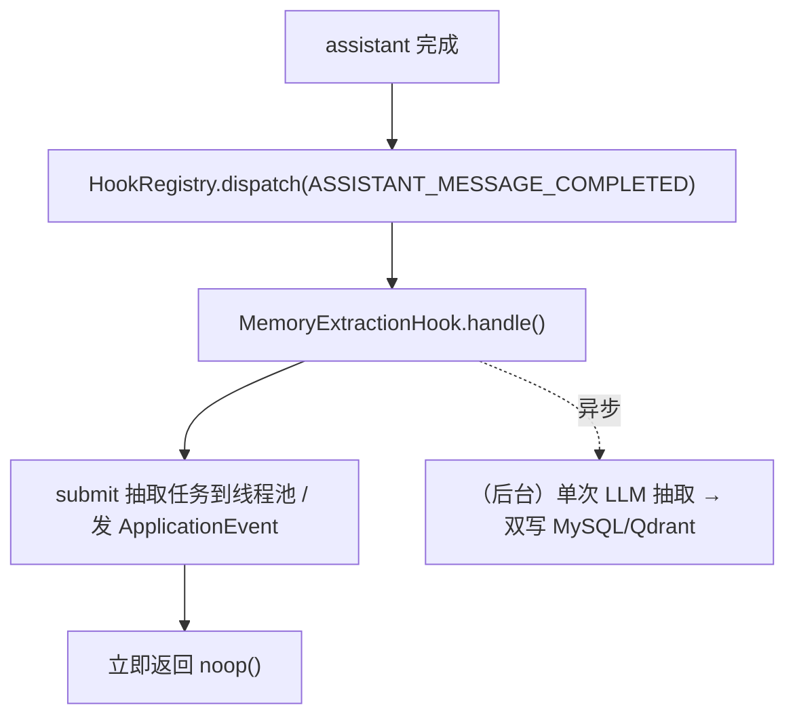
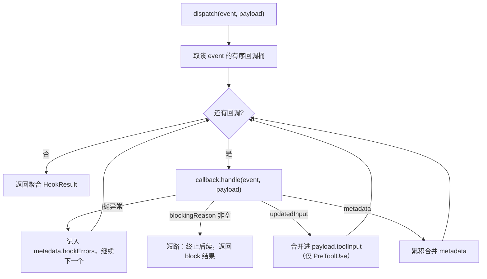

# hooks —— 生命周期扩展点总线（Wave 2 harness 基础）

> 本文是 PixFlow 完整重写阶段 `harness/hooks` 模块的设计文档，对应 `design.md` 第五章 5.5「Lifecycle Hooks」、第六章 6.1「主循环行为」，以及 `module-dependency-dag-plan.md` 的 **Wave 2 harness 基础**。
> 范围：生命周期事件总线、软阻断 / 输入改写 / metadata 累积 / 观察四类扩展能力、与 `permission`、`harness/tools`、`harness/loop`、`harness/context`、`module/task` 的接缝契约。本文不涉及 MVP 既有实现（MVP 无此层），从新架构需求重新推导。
> 思路参考 `docs/references/hook-architecture.md`（Python/OneCode），但**仅借鉴「扩展点总线 + 软阻断 + 安全边界不在 hook」的理念，执行模型与类型契约全部以 Java 17 + Spring Boot 3 重新设计**。

---

## 目录

- [一、文档定位与设计原则](#一文档定位与设计原则)
- [二、与参考实现的本质差异](#二与参考实现的本质差异)
- [三、模块结构与依赖位置](#三模块结构与依赖位置)
- [四、核心抽象](#四核心抽象)
- [五、执行模型](#五执行模型)
- [六、事件清单与调用点](#六事件清单与调用点)
- [七、阻断 / 改写 / metadata 语义](#七阻断--改写--metadata-语义)
- [八、与各模块的接缝契约](#八与各模块的接缝契约)
- [九、错误处理与可观测](#九错误处理与可观测)
- [十、配置项](#十配置项)
- [十一、测试策略](#十一测试策略)
- [十二、暂不考虑](#十二暂不考虑)

---

## 一、文档定位与设计原则

`harness/hooks` 在依赖 DAG 中处于 `permission → hooks → {tools, loop}` 的中间层（Wave 2）。它是贯穿运行全生命周期的**扩展点总线**：在关键时机派发事件给注册的回调，回调可以软阻断、改写工具输入、累积 metadata 或纯观察。

`hooks` 专属设计原则：

1. **hooks 不是安全边界**。安全边界在 `permission`（硬 deny）。hooks 结构上跑在 permission 之后——被 permission `DENY` 的调用在 `harness/tools` 执行管线里早已短路返回，**根本不会触发 PreToolUse**。因此 hook 的 allow 在物理上就不可能复活一个被拒的调用（`design.md` 设计原则三、`permission.md` 一致约束）。
2. **软阻断而非硬拒绝**。hook 的阻断是「策略性软挡」（如 DAG 参数异常拦截），归一化为**回填模型的结构化 tool error**（`recovery=SKIP`，循环继续），与 `PERMISSION` 类硬拒绝（`recovery=TERMINATE`）语义严格区分。
3. **改写必须重新过闸**。PreToolUse 改写 `tool_input` 后，`harness/tools` 必须**重新走** `validate → classify → guard → permission`；hook 不能借改写绕过任一硬校验（`tool-runtime-architecture.md` 一致约束）。
4. **薄总线、零观测依赖**。hooks 自身不写 trace、不依赖 `harness/eval`（依赖 DAG 中 `eval` 只喂 `loop`）。hook 执行的可观测由**调用方**（executor / loop，它们本就经 SPI 连 eval）记录。hooks 只返回结果与 metadata。
5. **同步派发、异步副作用自理**。回调是同步 Java 方法返回 `HookResult`；需要异步的副作用（如分析结论记忆抽取）由回调自身投递线程池 / 发应用事件后立即返回，总线不引入 reactive。
6. **类型安全优先**。每个事件有强类型 payload（sealed 接口 + record），不用裸 `Map` 承载事件数据；只有 `updatedInput` / `metadata` 这类「开放扩展位」才用 `Map`。
7. **异常隔离**。单个回调抛异常不中断整条链，错误收集进 `metadata["hookErrors"]`；只有显式 `blockingReason` 能终止后续回调。

---

## 二、与参考实现的本质差异

参考实现 OneCode 是 Python/asyncio 编码 Agent，hook 总线是：`HookEvent` 枚举（11 事件）+ `HookRegistry.run(event, payload)` + `HookResult(blocking_error / updated_input / metadata)` + 裸 dict payload + 同步/异步回调自动适配 + 可选 `TraceRecorder`。

PixFlow 的差异点：

| 维度 | OneCode（参考） | PixFlow（本模块） |
|---|---|---|
| 语言/并发 | Python asyncio，回调同步/异步自动适配 | Java 同步派发；异步副作用由回调自理 |
| payload | 裸 `dict` | sealed `HookPayload` + 每事件 record（强类型） |
| 注册 | `registry.register(event, callback)` 编程式 | Spring bean 收集 + 显式 `order()`（声明式） |
| 可观测 | registry 持有 `TraceRecorder`，自记 span | hooks 不自记；trace 由调用方（executor/loop）经 eval SPI 记录 |
| 阻断归一化 | 返回 `blocking_error` 字符串 | 经 `common` 归一化为 `VALIDATION` 类 tool error（`recovery=SKIP`） |
| 工具空间 | 开放（含 bash 任意命令） | 固定六个 Agent 级动作，PreToolUse 改写面很小 |
| 压缩事件 | Pre/Post/CompactFailed 完整接入（fork 子 Agent 摘要） | context 含摘要式 destructive compaction（`SummarizationPort` 倒置给 agent），Pre/Post/CompactFailed **接线** |

**可借鉴的结构骨架**：事件总线、顺序执行短路、`blockingReason / updatedInput / metadata` 三类结果、异常隔离、PreToolUse 改写后重校验的约束。
**必须重写的内核**：同步执行模型、强类型 payload、Spring 声明式注册、可观测责任上移、阻断错误归一化。

---

## 三、模块结构与依赖位置

源码包：`com.pixflow.harness.hooks`（与仓库根包 `com.pixflow` 对齐；物理位置见 `design.md` 第十二章 `harness/hooks/`）。

```
harness/hooks/
├── HookEvent.java              # 事件枚举
├── HookCallback.java           # 回调接口（supportedEvents / order / handle）
├── HookResult.java             # 结果 record（blockingReason / updatedInput / metadata）
├── HookRegistry.java           # 派发入口接口（dispatch）
├── DefaultHookRegistry.java    # Spring bean 收集 + 顺序派发 + 异常隔离实现
└── payload/
    ├── HookPayload.java            # sealed 接口；公共基段 conversationId/turnNo/traceId/runtime
    ├── UserPromptSubmitPayload.java
    ├── ToolUsePayload.java         # PreToolUse / PostToolUse / ToolError 共用（带 PermissionDecision 视图）
    ├── AssistantMessagePayload.java
    ├── TurnStoppedPayload.java
    ├── TaskLifecyclePayload.java   # TaskCreated / TaskCompleted
    └── CompactionPayload.java      # PreCompact / PostCompact / CompactFailed
```

依赖方向：

```
hooks ──► common（ErrorCode / PixFlowException：阻断归一化与异常承载）
hooks ──► permission（ToolUsePayload 暴露 PermissionDecision 只读视图，供观察型 hook 审计）
harness/tools ──► hooks（执行管线在 permission 之后派发 PreToolUse/PostToolUse/ToolError）
harness/loop  ──► hooks（回合级事件：UserPromptSubmit/AssistantMessageCompleted/TurnStopped）
harness/context ──► hooks（PreCompact/PostCompact/CompactFailed，摘要式压缩各阶段）
module/task ──► hooks（TaskCreated/TaskCompleted）
```

hooks **不依赖任何上层业务模块，也不依赖 `harness/eval`**。它对 `permission` 的依赖仅限于在 tool 事件 payload 中暴露 `PermissionDecision` 的只读视图（honor `module-dependency-dag-plan.md` 的 `permission → hooks` 边），不调用 permission 的任何行为。

> **接口约束**：hooks 不能引用 `harness/tools` 的 `ToolDescriptor`、`ToolCallClassification` 等类型（否则 `hooks → tools` 倒挂）。tool 事件 payload 只携带 hooks 自定义的最小视图（`toolName` / `toolInput` / `permissionDecision` / 结果摘要），由 `harness/tools` 在派发前适配填充。

---

## 四、核心抽象

### 4.1 `HookEvent` —— 事件枚举

```java
public enum HookEvent {
    USER_PROMPT_SUBMIT,          // 用户输入提交（回合入口）
    PRE_TOOL_USE,                // 工具执行前（可阻断 / 改写）
    POST_TOOL_USE,               // 工具成功后（观察）
    TOOL_ERROR,                  // 工具出错（观察）
    ASSISTANT_MESSAGE_COMPLETED, // assistant 消息完成（触发异步记忆抽取）
    TURN_STOPPED,                // 一轮无 tool call 自然结束（观察）
    TASK_CREATED,                // 异步任务创建（可阻断 → 回滚）
    TASK_COMPLETED,              // 异步任务完成（观察）
    PRE_COMPACT,                 // 摘要式压缩前（可注入 summaryInstructions）
    POST_COMPACT,                // 摘要式压缩后（观察）
    COMPACT_FAILED               // 压缩失败 / 断路回退确定性裁剪（观察）
}
```

> 含 `COMPACT_FAILED`：PixFlow context 含摘要式 destructive compaction（`context.md §十`），`SummarizationPort` 缺失或连续失败会断路回退到确定性优先级裁剪，该回退作为一等观察事件派发。

### 4.2 `HookResult` —— 回调结果

```java
public record HookResult(
    String blockingReason,            // 非空 = 软阻断，立即终止后续回调并归一化为 tool error
    Map<String, Object> updatedInput, // 仅 PreToolUse 有意义，触发上层重新校验
    Map<String, Object> metadata      // 跨回调累积合并的观测/上下文数据
) {
    public static HookResult noop() { ... }                 // 无效果
    public static HookResult block(String reason) { ... }   // 软阻断
    public static HookResult rewrite(Map<String,Object> updatedInput) { ... }
    public static HookResult withMetadata(Map<String,Object> metadata) { ... }
}
```

- `blockingReason` 非空即短路：dispatcher 立即停止后续回调，把该原因交回调用方归一化。
- `updatedInput` 仅 PreToolUse 消费；其它事件返回非空 `updatedInput` 由调用方忽略（dispatcher 不解释语义）。
- `metadata` 在一条事件链内**逐回调累积合并**（后者不静默覆盖前者键，冲突策略见 [七](#七阻断--改写--metadata-语义)）。
- 回调返回 `null` 等价于 `HookResult.noop()`。

### 4.3 `HookPayload` —— 强类型事件载荷

`sealed` 接口，公共基段由所有事件共享，子类型按事件携带专属字段：

```java
public sealed interface HookPayload
        permits UserPromptSubmitPayload, ToolUsePayload, AssistantMessagePayload,
                TurnStoppedPayload, TaskLifecyclePayload, CompactionPayload {

    String conversationId();   // 业务回合维度
    Integer turnNo();          // 当前回合序号（可空：task 异步事件无 turn）
    String traceId();          // 技术调用链维度（贯穿 §common 9.2）
    RuntimeScope runtime();    // 主 Agent / 子 Agent 标记，供回调 self-gate
}
```

`RuntimeScope` 用于 hook 自我门控（见 [五.4](#54-子-agent-作用域共享总线--self-gate)）：

```java
public record RuntimeScope(boolean subagent, String subagentType) {
    public static RuntimeScope main() { return new RuntimeScope(false, null); }
    public static RuntimeScope of(String type) { return new RuntimeScope(true, type); }
}
```

`ToolUsePayload` 是改写/阻断能力的核心载体，也是 hooks 对 `permission` 唯一的依赖落点：

```java
public record ToolUsePayload(
    String conversationId, Integer turnNo, String traceId, RuntimeScope runtime,
    HookEvent phase,                       // PRE_TOOL_USE / POST_TOOL_USE / TOOL_ERROR
    String toolName, String toolCallId,
    Map<String, Object> toolInput,         // PreToolUse 可被 updatedInput 覆盖
    PermissionDecision permissionDecision, // 只读视图：本次调用 permission 的判定（观察/审计用）
    Map<String, Object> resultSummary      // PostToolUse/ToolError：结果摘要 / 错误分类（不含大字节）
) implements HookPayload {}
```

> `permissionDecision` 仅供观察型 hook 审计「为什么放行/确认」，hook **不能据此翻转决策**——决策早已发生且 hooks 跑在其后。

### 4.4 `HookCallback` —— 回调接口

```java
public interface HookCallback {
    Set<HookEvent> supportedEvents();          // 订阅的事件集合
    default int order() { return 0; }          // 同事件内确定性排序，小者先执行
    HookResult handle(HookEvent event, HookPayload payload);
}
```

- 由 Spring 收集所有 `HookCallback` bean，按 `supportedEvents()` 分桶、按 `order()` 升序排序。
- 跨模块顺序敏感（如 DAG 参数异常检测须先于改写类 hook）一律用显式 `order()` 表达，**不依赖 bean 加载顺序**。

### 4.5 `HookRegistry` —— 派发入口

```java
public interface HookRegistry {
    HookResult dispatch(HookEvent event, HookPayload payload);
}
```

`DefaultHookRegistry` 是唯一实现：构造期注入 `List<HookCallback>`，分桶 + 排序；`dispatch` 顺序执行、短路、累积 metadata、隔离异常（见 [五](#五执行模型)）。

---

## 五、执行模型

### 5.1 同步派发

`dispatch` 在事件发生的**当前线程内联**同步执行整条回调链，返回聚合后的 `HookResult`。理由：

- PreToolUse 的阻断/改写本质要求拿到结果才能继续，必须同步。
- Spring MVC 主链路是阻塞模型；Agent 决策回合「请求内同步执行」（`design.md §6.1`）。
- 引入 `CompletableFuture`/reactive 只会让阻断语义与异常隔离复杂化，收益为零。

### 5.2 异步副作用由回调自理

需要异步的扩展（典型：`AssistantMessageCompleted` 触发**分析结论记忆抽取**，`design.md §7` mem0 ADD-only 异步写入），由回调内部投递到线程池 / 发布 Spring `ApplicationEvent` 后**立即返回 `noop()`**。总线不感知、不等待这些异步工作。



### 5.3 派发流程与短路



- **短路**：首个返回 `blockingReason` 的回调立即终止链，后续回调不执行。
- **异常隔离**：回调抛异常被捕获，写入 `metadata["hookErrors"]`（含 callback 类名 + 脱敏消息），链继续。异常**不**等同于阻断。
- **改写传播**：PreToolUse 链内，前一回调的 `updatedInput` 合并进 payload 后，后续回调看到的是改写后的 `toolInput`（与参考实现一致）。

### 5.4 子 Agent 作用域：共享总线 + self-gate

vision / imagegen 子 runtime 与主 Agent **共享同一个全局 `HookRegistry`**，不维护多套总线。是否对某子 Agent 生效由回调读取 `payload.runtime()` 自行门控：

```java
public HookResult handle(HookEvent e, HookPayload p) {
    if (p.runtime().subagent()) return HookResult.noop(); // 该 hook 只作用于主 Agent
    ...
}
```

理由：PixFlow 子 Agent 工具被裁剪、副作用受令牌硬约束（`permission.md §七`），hook 层无需再叠一层作用域隔离；self-gate 足够且更易测。若未来出现「某 hook 绝不能在子 Agent 触发」的硬隔离需求，再引入 scoped registry，不预先过度设计。

---

## 六、事件清单与调用点

| 事件 | 调用方 | 阻断? | 改写? | PixFlow 典型用途 |
|---|---|---|---|---|
| `USER_PROMPT_SUBMIT` | `harness/loop`（回合入口） | 否 | 否 | 观察 / 标注；偏好召回本身是 loop 逻辑，hook 仅补充审计 |
| `PRE_TOOL_USE` | `harness/tools` 执行管线（permission 之后） | **是** | **是** | **DAG 参数异常检测**（`design.md §5.5`）、输入规范化改写 |
| `POST_TOOL_USE` | `harness/tools`（handler 成功后） | 否 | 否 | 观察工具成功结果、补充 metadata |
| `TOOL_ERROR` | `harness/tools`（handler 异常） | 否 | 否 | 观察错误分类（payload 带 `resultSummary` 的 category） |
| `ASSISTANT_MESSAGE_COMPLETED` | `harness/loop` | 否 | 否 | **触发分析结论记忆异步抽取**（mem0 ADD-only） |
| `TURN_STOPPED` | `harness/loop`（无 tool call 自然结束） | 否 | 否 | 观察 / 回合收尾审计 |
| `TASK_CREATED` | `module/task`（任务入库后） | **是** | 否 | 阻断则回滚已创建任务（与参考一致语义） |
| `TASK_COMPLETED` | `module/task`（任务终态） | 否 | 否 | 观察任务完成；Rubrics 预警**不**在此在线触发（见下） |
| `PRE_COMPACT` | `harness/context` | 否 | 否 | 摘要式压缩前注入 `summaryInstructions`（影响摘要 prompt） |
| `POST_COMPACT` | `harness/context` | 否 | 否 | 观察压缩结果（token 前后、trigger） |
| `COMPACT_FAILED` | `harness/context` | 否 | 否 | 观察摘要失败/断路回退确定性裁剪 |

**关于 Rubrics 预警**：`design.md §5.5` 拦截点表写「Rubrics 评分低于阈值推送预警」，但 Rubrics 是**离线阶段**（`design.md §十一`）。在线只发 `TASK_COMPLETED`（纯观察）；Rubrics 预警由离线流程消费 eval trace 后另行通知，**不接入在线 hook 链**。本文据此澄清，避免把离线评估误并入在线总线。

---

## 七、阻断 / 改写 / metadata 语义

### 7.1 软阻断（blockingReason）

- 仅在能阻断的事件（`PRE_TOOL_USE`、`TASK_CREATED`）有控制流意义；其它事件返回 `blockingReason` 由调用方按观察处理（记录但不阻断）。
- **PreToolUse 阻断**：`harness/tools` 把 `blockingReason` 经 `common` 归一化为**回填模型的结构化 tool error**：

  ```json
  { "isError": true, "category": "VALIDATION", "message": "<safeMessage>", "recovery": "SKIP" }
  ```

  `recovery=SKIP` 表示「该工具调用未执行，错误回填模型，主循环继续」——这与 `PERMISSION` 类硬拒绝（`recovery=TERMINATE`、HTTP 403）严格区分：hook 阻断是策略软挡，不是越权。
- **TaskCreated 阻断**：`module/task` 回滚删除已创建的 `process_task`，向调用链返回业务级失败（`BUSINESS_RULE`）。

> hook 阻断**绝不**使用 `PERMISSION` 类。`PERMISSION` 是 `permission` 模块硬 deny 的专属语义（`common.md §五`、`permission.md §九`）；混用会污染审计与前端「确认 vs 被拒」的区分。

### 7.2 输入改写（updatedInput）

- 仅 `PRE_TOOL_USE` 链消费。回调返回 `updatedInput` 后，dispatcher 合并进 `payload.toolInput`，后续回调看到改写后的输入。
- 链结束后，`harness/tools` 若检测到 `toolInput` 被改写，**必须重新执行** `validate → classify → guard → permission`（`tool-runtime-architecture.md`、`permission.md §八`）。hook 不能借改写绕过任一硬校验：改写后的输入若被 permission `DENY`，依然 deny。

### 7.3 metadata 累积

- 一条事件链内逐回调合并。**键冲突策略**：默认后者不静默覆盖前者；同键写入时把值收敛为列表（或按命名空间前缀隔离，如 `dagCheck.*`、`memory.*`），避免跨模块 hook 互相踩键。
- `hookErrors` 是 dispatcher 保留键，回调不得写入。

---

## 八、与各模块的接缝契约

| 对接方 | 契约 |
|---|---|
| `harness/tools` 执行管线 | 在 `validate → classify → guard → permission → **PreToolUse**` 派发；`blockingReason` 在 handler 前短路并归一化为 tool error；`updatedInput` 触发**重新校验+授权**；成功后派发 `PostToolUse`，异常派发 `ToolError`。tool 事件 payload 由 tools 适配填充（含 `PermissionDecision` 只读视图） |
| `harness/loop` | 回合入口派发 `UserPromptSubmit`；assistant 消息完成派发 `AssistantMessageCompleted`；无 tool call 自然结束派发 `TurnStopped`。`dispatch` 同步返回，loop 据 `metadata` 做后续编排 |
| `harness/context` | 摘要式 destructive compaction 各阶段派发 `PreCompact`（返回 `summaryInstructions` 注入摘要 prompt）/`PostCompact`/`CompactFailed`（观察）；详见 `context.md §十、§十四` |
| `module/task` | 任务入库后派发 `TaskCreated`（阻断则回滚）；任务终态派发 `TaskCompleted`（观察）。异步 worker 线程内同步派发，payload `turnNo` 可空 |
| `permission` | hooks 在 payload 暴露 `PermissionDecision` 只读视图；**hook 的 allow 不能翻转 permission DENY**（物理上 deny 的调用不触发 PreToolUse） |
| `common/error` | `blockingReason` 经 `ErrorNormalizer` 归一化为 `VALIDATION`（PreToolUse）/`BUSINESS_RULE`（TaskCreated）类 `PixFlowException`；回调异常经 `Sanitizer` 脱敏后入 `hookErrors` |
| `harness/eval` | **hooks 不依赖 eval**；hook 执行的 trace 由调用方（executor/loop，经 eval SPI）记录 `event / callback 数 / blocking / hookErrors 数 / 改写与否` |

**关键不变量**：① 安全边界在 permission，hook 跑在其后且只能软挡；② 改写后必重校验；③ hooks 零观测依赖，trace 责任上移。

---

## 九、错误处理与可观测

### 9.1 回调异常隔离

回调抛任意 `Throwable` 被 dispatcher 捕获，经 `common.Sanitizer` 脱敏后写入 `metadata["hookErrors"]`（结构：`[{callback, category, safeMessage}]`），链继续。异常**不**等同阻断，避免一个坏 hook 拖垮整条链或整个回合。

### 9.2 阻断归一化

见 [七.1](#71-软阻断blockingreason)：PreToolUse 阻断 → `VALIDATION`/`recovery=SKIP` tool error；TaskCreated 阻断 → `BUSINESS_RULE` 失败。两者都不暴露内部细节，只给 `safeMessage` + `traceId`。

### 9.3 可观测（责任上移）

hooks 自身不写 trace。调用方在 `dispatch` 返回后，用各自已有的 eval SPI 记录一条 hook span：`hookEvent`、`callbackCount`、`blocking`（是否短路）、`toolName/toolCallId`（tool 事件）、`hookErrorCount`、`inputRewritten`。Micrometer 指标 `pixflow.hook.dispatch{event, blocking}` 由调用方侧补充。这样 hooks 保持零 `harness/eval` 依赖，符合依赖 DAG。

---

## 十、配置项

hooks 总线本身近乎无状态，配置极简：

```yaml
pixflow:
  hooks:
    fail-fast-on-callback-error: false   # 默认 false：回调异常隔离不中断链
                                         # true 仅用于本地调试，定位坏 hook
```

- 不提供「运行时启停某 hook」的远程开关（本期无此需求；增删 hook 通过 bean 装配）。
- 不提供 hook 优先级的运行时热更新；`order()` 是编译期常量。

---

## 十一、测试策略

- **顺序与短路**：注册多个不同 `order()` 的回调，断言执行顺序、首个 `blockingReason` 短路后续不执行。
- **异常隔离**：构造抛异常的回调，断言链继续、`hookErrors` 收集正确、其它回调结果不丢。
- **改写传播**：PreToolUse 链内前置回调改写 `toolInput`，断言后续回调看到改写值；断言 dispatcher 不对非 PreToolUse 事件应用 `updatedInput`。
- **metadata 累积**：多回调写不同键/同键，断言合并与冲突收敛策略。
- **阻断归一化**：PreToolUse 阻断 → 断言归一化为 `VALIDATION`/`recovery=SKIP`，**绝不**为 `PERMISSION`；TaskCreated 阻断 → `BUSINESS_RULE` 且任务回滚。
- **安全边界不可越权**：构造 PreToolUse 回调返回「试图放行」的 metadata，断言无法影响已发生的 permission 决策（hooks 无翻转能力）。
- **子 Agent self-gate**：payload `runtime().subagent()=true` 时，仅作用于主 Agent 的 hook 返回 `noop()`。
- **同步契约**：断言 `dispatch` 同步返回；异步副作用型 hook（记忆抽取）断言其 `handle` 立即返回 `noop()` 且不阻塞调用线程。
- **payload 类型完备**：sealed `HookPayload` 的每个子类型与对应事件的映射、公共基段非空约束。

---

## 十二、暂不考虑

- **session memory 提取的 hook 接入**：参考实现的 `session-memory.md` 机制本期不做（`context.md §十七`），摘要直接进活动链；故无 session-memory 专属 hook。`PreCompact/PostCompact/CompactFailed` 已随摘要式压缩接线（见 [六](#六事件清单与调用点)）。
- **回调的运行时热插拔 / 远程开关 / 优先级热更新**：本期增删 hook 经 Spring bean 装配，无运行时治理面。
- **异步 / reactive 派发管线**：本期同步派发，异步副作用由回调自理；不引入 `CompletableFuture`/响应式总线。
- **hook 级细粒度权限 / 配额**：hook 是受信内部扩展点，不面向外部租户，无需鉴权与限额（多租户本身 `design.md §16` 暂不做）。
- **跨进程 / 分布式 hook 分发**：本期单体，hooks 是进程内总线，无跨进程协议。
