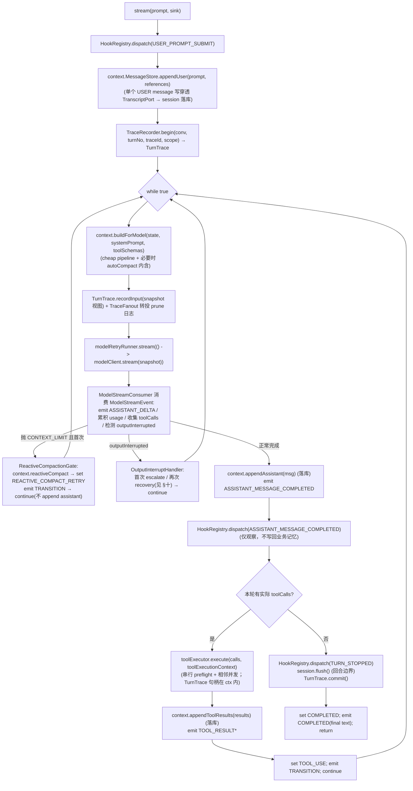

# loop —— 执行主循环（think-act-observe 薄编排引擎）（Wave 4 主循环）

> 本文是 PixFlow 完整重写阶段 `harness/loop` 模块的设计文档，对应 `design.md` 第五章 5.1「Execution Loop」、第六章 6.1「主循环行为」，以及 `module-dependency-dag-plan.md` 的 **Wave 4 主循环 + 编排模块**。
> 范围：手写 think-act-observe 主循环、`RuntimeState` 运行态、`TransitionReason` 续轮/终止语义、`AgentEvent` 事件流（SSE 流式接出）、单轮模型调用编排、续轮判定、CONTEXT_LIMIT 与输出截断两类跨模块恢复、子 Agent fork 继续入口、与 tools / context / session / hooks / eval / permission / infra-ai 的接缝契约。本文不涉及 MVP 既有实现（MVP 无此层），从新架构需求重新推导。
> 思路参考 `docs/references/core-runtime-architecture.md`（`core/loop.py` 薄主循环）、`docs/references/model-provider-architecture.md`、`docs/references/error-handling-architecture.md`（Python/OneCode）以及 `docs/references/loop/query.ts`、`QueryEngine.ts`（生产级 Claude Code），但**仅借鉴「薄编排 + transition 状态机 + 续轮只看 tool_calls + 错误恢复分层 + ContextSnapshot 可回溯」的理念，并发模型、流式接出、类型契约全部以 Java 17 + Spring Boot 3 重新设计**。

---

## 目录

- [loop —— 执行主循环（think-act-observe 薄编排引擎）（Wave 4 主循环）](#loop--执行主循环think-act-observe-薄编排引擎wave-4-主循环)
  - [目录](#目录)
  - [一、文档定位与设计原则](#一文档定位与设计原则)
  - [二、与参考实现的本质差异](#二与参考实现的本质差异)
  - [三、loop / agent 边界（Wave 4 引擎 vs Wave 5 装配）](#三loop--agent-边界wave-4-引擎-vs-wave-5-装配)
  - [四、回合与迭代：两级粒度澄清](#四回合与迭代两级粒度澄清)
  - [五、模块结构与依赖位置](#五模块结构与依赖位置)
  - [六、核心抽象](#六核心抽象)
    - [6.1 `AgentLoop` —— 主循环入口](#61-agentloop--主循环入口)
    - [6.2 `RuntimeState` —— 单会话可变运行态](#62-runtimestate--单会话可变运行态)
    - [6.3 `TransitionReason` —— 续轮/终止语义](#63-transitionreason--续轮终止语义)
    - [6.4 `AgentEvent` / `AgentEventSink` —— 事件流](#64-agentevent--agenteventsink--事件流)
  - [七、执行模型：阻塞主循环 + 事件流](#七执行模型阻塞主循环--事件流)
    - [7.1 为什么是阻塞 + 事件回调，而非 Reactor](#71-为什么是阻塞--事件回调而非-reactor)
    - [7.2 流式接出形态](#72-流式接出形态)
  - [八、单轮 think-act-observe 流程](#八单轮-think-act-observe-流程)
  - [九、续轮判定](#九续轮判定)
  - [十、错误恢复分层](#十错误恢复分层)
  - [十一、Transition 语义表](#十一transition-语义表)
  - [十二、子 Agent fork 继续入口](#十二子-agent-fork-继续入口)
  - [十三、与各模块的接缝契约](#十三与各模块的接缝契约)
  - [十四、多节点与无状态](#十四多节点与无状态)
  - [十五、配置项](#十五配置项)
  - [十六、可观测](#十六可观测)
  - [十七、测试策略](#十七测试策略)
  - [十八、暂不考虑](#十八暂不考虑)
  - [Revision Notes](#revision-notes)

---

## 一、文档定位与设计原则

`harness/loop` 在依赖 DAG 中处于 `{tools, hooks, context, permission, eval} → loop → agent` 的位置（Wave 4）。它是 Agent 决策回合的**驱动核心**：手写显式 while 循环，编排「组装上下文 → 调 LLM → 解析工具调用 → 执行工具 → 观察回填 → 判定续轮/结束」，把过程 emit 成事件流供 SSE 流式接出。

loop 是 `design.md §5.1` 明确要求的「**手写的显式循环，不依赖 Spring AI 的自动 function-calling**」——只有手写，才能把 Tool Registry 执行管线、Hooks、Context Manager、权限拦截插入每一步。

`loop` 专属设计原则：

1. **薄编排，零功能堆放**。loop 只表达**生命周期、运行态、transition**，绝不承载具体工具逻辑、provider wire、安全策略、prompt 文本、上下文治理算法、记忆召回、UI 渲染。这些分别归 `harness/tools`、`infra/ai`、`permission`、`agent`（prompt）、`harness/context`、`module/memory`、web 层。loop 模块本体应保持很小，文档大头是「接缝契约」而非「内部算法」（对齐 `core-runtime-architecture.md`「core 不负责的内容」）。
2. **provider-neutral**。loop 只依赖 `infra/ai` 暴露的 provider-neutral 抽象（`ChatModelClient` 协议、`ChatStreamEvent`、`ProviderError`、`ModelUsage`），不理解任何供应商 wire 协议、不读私有 `stop_reason`、不碰 API key 与模型目录（`model-provider-architecture.md` 一致约束）。
3. **续轮判定单一信号**。是否继续循环只看「本轮 assistant 是否产生了**实际工具调用**」（`ModelStreamEvent.messageCompleted.metadata["toolCalls"]` 非空），**不依赖 provider 的 finish_reason / stop_reason**（后者不可靠，`core-runtime-architecture.md`「续轮判定」一致）。
4. **不设迭代上限（无 maxTurns）**。循环的**唯一正常终止条件是「本轮无工具调用，自然结束」**；不设硬性迭代次数上限。运行边界由三道天然约束兜底：① 模型自然收敛（无工具调用即停）；② `harness/context` 的预算/压缩使上下文不会无界膨胀；③ `RuntimeState.usage` 全程可观测 + 请求级超时（web 层）。安全规则一律由 `permission` 硬拦截、由确认 REST 边界把真实副作用挡在工具空间之外，循环本身不靠次数上限做安全（`design.md` 设计原则三）。
5. **回合内线程封闭**。一个回合在单个执行线程内同步跑完整条 while 循环；`RuntimeState`、`MessageStore`、`TurnTrace` 都封闭在该线程内，loop 内部不加锁。并发外移：同会话回合串行由上层（conversation / 会话级锁）保证（与 context / session / hooks / eval / state 文档统一口径）。
6. **错误恢复分层、各司其职**。可重试错误（限流/网络/5xx）由 `infra/ai` 的模型调用 retry 边界消化；已发射文本后发生的可恢复错误通过 `ChatStreamEvent.AttemptReset` 暴露给 loop，loop 只转成非终态 `RATE_LIMIT_RETRY` transition。loop 只处理需要**跨模块协调**才能恢复的两类——`CONTEXT_LIMIT`（触发 context 反应式压缩）和**输出截断**（抬高 max output / 续写恢复）；不可恢复错误经 `common.ErrorRecorder` 落盘后向上抛（`error-handling-architecture.md` 分层）。
7. **每轮可回溯**。每次模型调用前的 `ContextSnapshot`（system prompt + 消息 + 可见工具 schema）经 `harness/eval` 的 `TurnTrace.recordInput` 落 trace，异常可回放（`design.md §5.1`「每轮记录 ContextSnapshot，异常可回溯」）。
8. **trace 责任在 loop，但不自存**。context / hooks / tools 都是「零 eval 依赖」，它们的 snapshot / 裁剪日志 / 工具 span / hook 执行的 trace 投递责任**统一上移到 loop**：loop 持有当前 `TurnTrace`，把各模块产出的可观测数据转投给 eval（承接 `context.md`/`hooks.md`/`tools.md`/`eval.md` 的「可观测责任上移」约定）。

---

## 二、与参考实现的本质差异

参考实现有两个层级：`core/loop.py`（OneCode 蒸馏出的薄主循环，最贴近本模块定位）与 `query.ts`/`QueryEngine.ts`（生产级 Claude Code 主循环，功能极繁，含 fallback model、task budget、context collapse、snip、microcompact、缓存编辑等大量特性）。PixFlow 取 `core/loop.py` 的骨架，**主动不引入** query.ts 的绝大多数特性。

| 维度 | OneCode / Claude Code（参考） | PixFlow（本模块） |
|---|---|---|
| 语言/并发 | Python asyncio `async generator`（`yield` 事件） | Java 阻塞主循环 + `AgentEventSink` 回调（SSE 流式接出，见 [七](#七执行模型阻塞主循环--事件流)） |
| 迭代上限 | `max_turns`（默认 20）→ `MAX_TURNS` transition | **无 maxTurns**：仅靠「无工具调用自然结束」终止（见 [一.4](#一文档定位与设计原则)） |
| 续轮信号 | `message_completed.metadata["tool_calls"]` 非空 | 同（provider-neutral，不读 stop_reason） |
| 重试 | `ModelRetryRunner`（services/model） | `ChatModelClient.stream` 内部的模型调用 retry（loop 不注入 retry runner） |
| 上下文治理 | loop 内联调 microcompact/snip/autocompact/collapse | 全部下沉 `harness/context.ContextEngine.buildForModel`（cheap pipeline 内含），loop 只调一个入口 |
| 压缩 LLM | loop/compaction 持 subagent_runner fork | context 经 `SummarizationPort` 倒置给 `agent`，loop 仅在 `CONTEXT_LIMIT` 时触发 `reactiveCompact` |
| prompt 组装 | `QueryEngine` 内 `fetchSystemPromptParts` | 归 `agent` 层（Wave 5），作为 `buildForModel` 入参传入，loop 不组装 |
| 可见工具集 | `QueryEngine` 持 tools | 归 `agent` 层取 `visibleDescriptors`，作为入参传入 |
| transcript | `recordTranscript` 写 JSONL | 经 context 的 `appendXxx` → `TranscriptPort` 落 MySQL（session），loop 不直接写 |
| session memory | `AssistantMessageCompleted` 触发 fork 提取 | 本期 session memory 不做（`context.md §十七`）；该 hook 仅触发**分析结论记忆**异步抽取（`hooks.md`） |
| 特性 | fallback model / task budget / context collapse / snip / 缓存编辑 / skill prefetch | **一律不引入**（见 [十八](#十八暂不考虑)） |
| 错误 | 部分作 assistant error message yield | 不可恢复错误经 `ErrorRecorder` 落盘后**向上抛**，由 web 层归一化 HTTP；loop 不 emit error 事件 |

**可借鉴的结构骨架**：while 循环 + transition 状态机、续轮只看 tool_calls、ContextSnapshot 每轮可回溯、错误恢复分层（retry / reactive compact / output 恢复）、fork child 继承父 snapshot、缓冲式重试丢弃失败 attempt 的 partial。
**必须重写或删除的内核**：async generator → 阻塞 + 事件回调；删除 maxTurns；上下文治理/压缩/prompt/可见工具集全部外移为注入；transcript 落库经 context/session；删除 query.ts 全部高级特性。

---

## 三、loop / agent 边界（Wave 4 引擎 vs Wave 5 装配）

参考实现里 `core/loop.py`（引擎）与 `QueryEngine.ts`（装配 prompt/工具/模型/processUserInput）是两层。PixFlow 沿用此切法，**loop 是可复用的 provider-neutral 引擎，agent 是业务装配**。`agent` 模块的详细装配契约（Prompt 动态组装、Skill 工具化、Session Memory 累积、Subagent Runner、SPI 实现）见 **`docs/design-docs/agent.md`**；本节只描述 loop 与 agent 的接缝边界。

| 关注点 | 归属 | 说明 |
|---|---|---|
| while 循环驱动、transition、运行态、续轮判定 | **`harness/loop`（Wave 4）** | 本模块 |
| CONTEXT_LIMIT / 输出截断恢复编排 | **`harness/loop`** | 跨模块协调，留在引擎 |
| 事件流 emit（assistant_delta / tool / transition / completed） | **`harness/loop`** | 引擎产出，web 层接 SSE |
| 回合协作取消 checkpoints、模型订阅取消、trace CANCELLED | **`harness/loop`** | 消费 `common.CancellationToken`，取消不进入 ErrorRecorder |
| 动态 Prompt 组装 + section 缓存 | `agent`（Wave 5） | 作为 `buildForModel(state, systemPrompt, toolSchemas)` 的 `systemPrompt` 入参传入 |
| 可见工具集 `visibleDescriptors` → tool schema | `agent`（Wave 5） | 作为 `toolSchemas` 入参传入 |
| `SummarizationPort`（fork 子 Agent 摘要） | `agent`（Wave 5） | context 经 SPI 倒置调用，与 loop 无关 |
| 子 Agent runner 装配（explore） | `agent`（Wave 5） | loop 只暴露 `continueStream` 引擎入口（见 [十二](#十二子-agent-fork-继续入口)）；商品视觉事实走普通工具，不建 child runtime |
| 自动记忆召回与注入 | `agent` / `module/memory`（Wave 5） | 在 prompt 组装前完成，注入 memory section，非 loop 职责 |
| HITL 确认流（确认 REST 边界） | `module/conversation` + `permission` | 带外触发，不是 loop 工具 |

边界硬约束：

1. **loop 不组装 prompt、不决定可见工具集**。这两样由调用方（agent 层）传入 `buildForModel`，对应参考的 `PromptAssembler` / `ToolSchemaProvider` 注入点。loop 只保证「快照里的工具说明与模型可见 schema 同源」（同一份入参）。
2. **loop 可脱离 agent 独立测试**。注入 fake `ModelClient` + no-op prompt/toolSchemas + in-memory context/tools 替身即可跑 transition / 续轮 / 恢复用例（`design.md §15`「确定性底座单独属性测试」）。
3. **loop 不依赖任何业务 module**（commerce/dag/vision/imagegen/memory…）。业务能力全部经 `harness/tools` 的 `ToolHandler` 倒置接入，loop 只调 `ToolExecutor`。

---

## 四、回合与迭代：两级粒度澄清

这是本模块必须先钉死的术语。参考实现里 query.ts 的 `turnCount` 是「每次模型调用 +1」，而 QueryEngine 的 `turnCount` 是「每条用户消息 +1」——两者粒度不同。PixFlow 的其余 harness 文档（eval / hooks / session）统一把「回合」定义在**用户消息**粒度，因此本文严格区分两级：

| 术语 | 定义 | 粒度 | 对应 |
|---|---|---|---|
| **回合（turn）** | 用户一次发消息 = 一个 Agent 决策回合 = 一次 `stream()` 调用 | 用户消息级 | `eval.turnNo`、`hooks` 的 `UserPromptSubmit`/`TurnStopped`、`session` 回合边界 flush |
| **迭代（iteration）** | 回合内部一次「调 LLM → 执行工具 → 回填」的循环单轮 | 模型调用级 | 一次 `recordInput`、一次 `modelClient.stream` |

一个回合内含 1..N 次迭代（think-act-observe 多轮）：

- `eval` 的 `TurnTrace` 是**回合级累积器**，`recordInput` 每次迭代追加一项，聚合成 `input_json` 数组（`eval.md §5.2`）。
- `hooks` 的 `UserPromptSubmit` 在回合入口派发一次；`AssistantMessageCompleted` 每次迭代的 assistant 完成都派发；`TurnStopped` 在回合自然结束派发一次（`hooks.md §六`）。
- `session` 的 flush 在**回合边界**触发（`session.md §八`）。

**去掉 maxTurns 后，迭代次数不设上限**；loop 内部保留一个 `iterationCount` 仅用于 trace 标注与调试，不做任何 capping。

---

## 五、模块结构与依赖位置

源码包：`com.pixflow.harness.loop`（与仓库根包 `com.pixflow` 对齐；物理位置见 `design.md` 第十二章 `harness/loop/`）。

```
harness/loop/
├── AgentLoop.java                 # 主循环入口：stream / continueStream（薄编排）
├── RuntimeState.java              # 单会话可变运行态（usage/transition/scope/metadata）
├── TransitionReason.java          # provider-neutral transition 枚举
├── event/
│   ├── AgentEvent.java            # 事件 record（type + 载荷）
│   ├── AgentEventType.java        # 事件类型枚举
│   └── AgentEventSink.java        # 事件接出 SPI（web 层 SseEmitter 适配 / 测试收集）
├── port/
│   └── (依赖注入的协作协议引用，均为他模块定义的接口)
├── recovery/
│   ├── ReactiveCompactionGate.java # CONTEXT_LIMIT → context.reactiveCompact 编排
│   └── OutputInterruptHandler.java # 输出截断 escalate / recovery 编排
├── stream/
│   └── ModelStreamConsumer.java   # 消费 ModelStreamEvent：emit delta / 累积 usage / 收集 tool calls
├── trace/
│   └── TraceFanout.java           # 把 context/tools/hooks 产出转投当前 TurnTrace（责任上移落点）
├── config/
│   ├── LoopProperties.java
│   └── LoopAutoConfiguration.java
└── error/
    └── LoopErrorCode.java         # enum implements ErrorCode（loop 自治码，极少）
```

依赖方向：

```
loop ──► harness/tools（ToolExecutor.execute；构造 ToolExecutionContext 注入 PermissionContext + TurnTrace 句柄）
loop ──► harness/context（ContextEngine.buildForModel；MessageStore.appendXxx；ContextCompactionService.reactiveCompact）
loop ──► harness/hooks（HookRegistry.dispatch：UserPromptSubmit/AssistantMessageCompleted/TurnStopped）
loop ──► harness/eval（TraceRecorder.begin → TurnTrace.record*/commit/abort）
loop ──► permission（构造 PermissionContext 交给 tools；loop 自身不评估权限）
loop ──► infra/ai（ChatModelClient 协议 / ChatStreamEvent / ProviderError / ModelUsage）
loop ──► common（PixFlowException / ErrorCategory：CONTEXT_LIMIT 等归一化；经 ErrorRecorder 落盘）
agent ──► loop（Wave 5 装配：注入 systemPrompt/toolSchemas、SummarizationPort、子 Agent runner，驱动 stream/continueStream）
```

> **新增依赖边说明（需同步 `module-dependency-dag-plan.md`）**：当前 DAG 已有 `tools→loop`、`hooks→loop`、`context→loop`、`permission→loop`、`eval→loop`、`loop→agent`。但 loop 还需依赖 `infra/ai` 的 provider-neutral 抽象（`ChatModelClient`/`ChatStreamEvent`），DAG 当前**缺一条 `ai --> loop` 边**，应补上（`infra/ai` 在 Wave 1，loop 在 Wave 4，无环；与 `ai→dag`/`ai→vision` 等同理：均为 infra/ai 能力消费方）。
>
> **接口约束**：loop 不引用任何业务 module 类型；不引用 provider 具体适配器（只认 `infra/ai` 的 provider-neutral 接口）。prompt 字符串与可见 tool schema 由 agent 层填充传入，loop 不持有 `ToolDescriptor`/prompt 文本。

---

## 六、核心抽象

### 6.1 `AgentLoop` —— 主循环入口

```java
public final class AgentLoop {

    /** 普通用户交互入口：派发 UserPromptSubmit、追加 user 消息、进入 while 循环。 */
    void stream(String prompt, List<MessageReference> references, AgentEventSink sink,
                String systemPrompt, List<ToolSchemaView> toolSchemas,
                CancellationToken cancellation);

    /** 子 Agent / 恢复场景：从已 seed 的消息链继续，不重复追加用户 prompt。 */
    void continueStream(AgentEventSink sink, String systemPrompt,
                        List<ToolSchemaView> toolSchemas,
                        CancellationToken cancellation);
}
```

- 两个入口对应参考的 `stream` / `continue_stream`。`stream` 是用户回合入口（追加一个携带 canonical Message References 的 USER message 后跑循环）；`continueStream` 用于子 Agent fork 与恢复（消息链已由调用方 seed，见 [十二](#十二子-agent-fork-继续入口)）。
- 构造依赖（注入，均为他模块协议）：`RuntimeState`、`MessageStore`（context）、`ContextEngine`（context）、`ContextCompactionService`（context）、`ChatModelClient`（infra/ai）、`ToolExecutor`（tools）、`HookRegistry`（hooks）、`TraceRecorder`（eval）、`CurrentModelContext`（context，供子 Agent fork 继承）、`PermissionContextFactory`（permission）。除前几个核心外，缺省可注入 no-op 替身用于测试与子 Agent fork。
- **素材引用解析、prompt 组装、可见工具集、权限评估都不在 loop**：调用方（conversation/agent）传入已规范化且已去重的 `MessageReference(referenceKey, displayPathSnapshot)`；prompt/toolSchemas 由 agent 层在每轮 `buildForModel` 时传入；权限评估在 tools 执行管线内。

### 6.2 `RuntimeState` —— 单会话可变运行态

provider-neutral 的单会话可变状态，回合内线程封闭。

```java
public final class RuntimeState {
    ModelUsage usage;                    // 累加每次模型调用的 token usage
    int iterationCount;                  // 仅用于 trace 标注/调试，不做 capping（无 maxTurns）
    boolean hasAttemptedReactiveCompact; // 本回合是否已做过反应式压缩（防抖，单次）
    int maxOutputRecoveryCount;          // 输出截断 recovery 次数（上限 maxOutputRecoveryLimit）
    boolean hasEscalatedMaxOutput;       // 是否已抬高 max output tokens（单次）
    TransitionReason lastTransition;     // 上一轮续轮原因（首轮为 null）
    String conversationId;               // 会话身份（PixFlow 无独立 sessionId）
    RuntimeScope runtimeScope;           // 主 Agent / 子 Agent（复用 hooks.RuntimeScope）
    Map<String,Object> metadata;         // 开放扩展位（见下）

    void addUsage(ModelUsage delta);
    void setTransition(TransitionReason reason);
}
```

- **无 `maxTurns` 字段**（按本期决策去掉）；`iterationCount` 不参与终止判断。
- **无 `sessionId`**：PixFlow 会话身份即 `conversationId`（与 `session.md` 一致，无文件 session 概念）。
- `metadata` 当前承载：`subagent` / `subagentType`、`readOnlyAgent`（子 Agent 只读硬约束标记，permission 消费）、`deniedTools` / `disabledTools` / `hiddenTools`、`planMode`（Plan 模式标志，tools 可见集与 permission 消费）、`modelRequestOverrides`（如 `maxOutputTokens`）、`isForkChild`。这些是 loop 传递给 tools/permission/context 的运行态视图载体，loop 自身不解释其业务语义。

### 6.3 `TransitionReason` —— 续轮/终止语义

```java
public enum TransitionReason {
    TOOL_USE,                    // 有实际工具调用 → 执行后 continue
    COMPLETED,                   // 无工具调用，自然结束 → return（唯一正常终止）
    RATE_LIMIT_RETRY,            // ChatModelClient.stream 发出 AttemptReset（loop 仅记录，退避在 infra/ai）
    REACTIVE_COMPACT_RETRY,      // CONTEXT_LIMIT 首次 → 反应式压缩后重试本迭代
    MAX_OUTPUT_TOKENS_ESCALATE,  // 首次输出截断 → 抬高 max output → 重试本迭代
    MAX_OUTPUT_TOKENS_RECOVERY   // 再次输出截断 → 追加截断 assistant + 续写 prompt → continue
}
```

- **去掉 `MAX_TURNS`**（无迭代上限）。
- **不引入 `STOP_HOOK_CONTINUE`**：PixFlow 的 `TurnStopped` 是纯观察 hook（`hooks.md` 明确不可阻断），不做 stop-hook 续跑（避免过度设计，见 [十八](#十八暂不考虑)）。
- `transition` 写入 `RuntimeState.lastTransition`，并 emit `transition` 事件供前端/排障感知；测试据此断言恢复路径触发，无需检查消息内容（参考一致）。

### 6.4 `AgentEvent` / `AgentEventSink` —— 事件流

```java
public enum AgentEventType {
    ASSISTANT_DELTA,             // LLM token 流式增量（SSE 主体）
    ASSISTANT_MESSAGE_COMPLETED, // 一次 assistant 消息完成
    TOOL_CALL_READY,             // 解析出工具调用（含 name/input 预览）
    TOOL_STARTED,                // 工具开始执行
    TOOL_RESULT,                 // 工具结果（含引用/预览，非大字节）
    TRANSITION,                  // 一次 transition 发生
    COMPLETED                    // 回合自然结束（final text）
}

public record AgentEvent(
    AgentEventType type,
    String text,                 // delta / final text
    Object payload,              // tool call / result / transition 等结构化载荷
    Map<String,Object> metadata
) {}

public interface AgentEventSink {
    void emit(AgentEvent event);   // 同步推送；web 层适配 SseEmitter，测试用收集器
}
```

- 事件集合**精简**：不含 `interaction_started` 这类纯 UI 事件；**不 emit `error` 事件**——不可恢复错误经 `ErrorRecorder` 落盘后向上抛，由 web 层统一归一化为 HTTP/SSE error 帧（避免参考实现里「error 事件泄漏给 SDK 调用方导致会话被误终止」的问题，见 query.ts 注释）。
- `AgentEventSink` 是**同步**接口：loop 在回合执行线程内调用 `emit`，web 层把它桥接到 `SseEmitter`（LLM token 流式）；上传、解压、DAG 与 IMAGEGEN 的 Activity 更新经全局 `/user/queue/activity` 推送，不走本 sink。
- 模型 retry 期间，loop 不自行重订阅或过滤 attempt；它只消费 `ChatModelClient.stream` 产出的 `TextDelta`、`AttemptReset` 与 `Completed`。是否透明丢弃失败 attempt 的 partial、是否用 `AttemptReset` 暴露重试状态，均由 infra/ai 的首次发射边界决定。

---

## 七、执行模型：阻塞主循环 + 事件流

### 7.1 为什么是阻塞 + 事件回调，而非 Reactor

loop 在**单线程内同步**跑完整条 while 循环，每产生一个事件就 `sink.emit(...)`。理由（与全栈口径一致）：

- `design.md §6.1`：Agent 回合「请求内同步执行、秒级 LLM 调用」。
- 全部 harness 模块统一假设回合内线程封闭 / 同步：`context`「回合内线程封闭」、`hooks`「同步派发」、`session`「turn 内缓冲 + 边界 flush」、`eval`「回合内线程封闭累积器」。
- 错误恢复（反应式压缩 / 输出截断）需要「消费完一次模型 stream 后再决定 continue」，阻塞迭代比 Flux 直观得多；模型调用 retry 的退避与重订阅保持在 infra/ai 内部。
- LLM token 的流式来自 `infra/ai` 的 `ModelClient.stream`（SSE 解析为 `ModelStreamEvent`），loop 阻塞消费并转发为 `ASSISTANT_DELTA`，再由 web 层经 `SseEmitter` 出前端。整条链是阻塞迭代，无 reactor 心智负担。

不引入 Reactor `Flux<AgentEvent>`：它与 Spring MVC 阻塞主链路、各 harness 模块的线程封闭/同步假设相悖，会把 transition / 短路 / 异常隔离全部复杂化，收益为零（见 [十八](#十八暂不考虑)）。

### 7.2 流式接出形态

```mermaid
flowchart LR
  Web["web 层 (conversation REST/SSE 端点)"] -->|stream(prompt, sink)| Loop["AgentLoop (回合线程)"]
  Loop -->|emit AgentEvent| Sink["AgentEventSink"]
  Sink -->|SseEmitter.send| SSE["SSE → 前端 (LLM token 流式)"]
  Loop -->|ModelClient.stream| AI["infra/ai (SSE 解析 ModelStreamEvent)"]
  AI -->|ModelStreamEvent| Loop
```

- conversation 先构造 `AgentTurnRequest(conversationId, prompt, references, cancellation)`，其中 `references` 是有序且按 canonical `referenceKey` 去重的 Message References；agent 装配层把同一 token 传入 `loop.stream(...)`。loop 仍同步跑完整个 while，但 SSE session 位于独立 worker 中。
- `ModelStreamConsumer` 用 token signal 作为 `takeUntilOther` publisher；适配时必须 suppress cancel，避免模型流先完成后反向取消公共 signal。`blockLast` 返回或抛错后再次检查 token，取消不能被误判为空模型成功。
- Activity 状态与进度经全局 `/user/queue/activity` WebSocket/STOMP 链路推送，并以 `GET /api/activities` 作为首次快照；它与 loop 的 SSE token 流正交，不混用。

---

## 八、单轮 think-act-observe 流程

`stream(prompt, sink)` 的完整编排（`continueStream` 跳过「派发 UserPromptSubmit + 追加 user 消息」，其余相同）：



PixFlow 特定接缝点（文档级硬约定）：

1. **`ToolExecutionContext` 由 loop 构造并喂 tools**，至少含：`PermissionContext`、当前 `TurnTrace` 句柄、`RuntimeScope` 和本回合 `CancellationToken`。loop **不评估权限**，只把上下文与取消信号交给 tools 执行管线。
2. **trace 责任上移落点 `TraceFanout`**：`buildForModel` 产出的 cheap/compaction 裁剪日志由 loop 转投 `TurnTrace.recordPrune`；tools 执行管线把单次工具 span 投递给 ctx 内的 `TurnTrace`（tools 直接调，loop 提供句柄）；hooks 执行的 span 由 loop 在 `dispatch` 返回后记录（`hooks.md §9.3`）。
3. **append 顺序与协议配对**：assistant（可能含 tool_use）先落库再执行工具，工具结果回填后落库；保证 tool call/result 配对由 context 投影器维护（loop 不裁剪消息）。
4. **异常终止**：循环内任意不可恢复异常 → `TurnTrace.abort(err)` + `ErrorRecorder.record(err)` 后向上抛（不 emit error 事件、不吞）。`OperationCancelledException` 单独处理：`TurnTrace.cancel()`，派发一次 `TURN_STOPPED(cancelled:<reason>)`，不写 ErrorRecorder、不 emit `completed`，继续向 web 边界抛出。

> **context 接口微调建议**：当前 `ContextEngine.buildForModel` 返回 `ContextSnapshot`，未显式把本轮 cheap/compaction 的 prune 日志回带给调用方。为落实「prune 日志由 loop 转投 eval」，建议 `buildForModel` 在 `ContextSnapshot`（或一个伴随返回结构）中带出本轮裁剪条目列表（`TracePruneEntry` 形状），供 `TraceFanout` 转投。此为 loop 对 `harness/context` 的接口微调建议，落地时在 `context.md` 同步。

---

## 九、续轮判定

- **唯一信号**：本轮 `ModelStreamEvent.messageCompleted.metadata["toolCalls"]` 是否含**实际工具调用**。非空 → `TOOL_USE` → 执行工具后 `continue`；空 → `COMPLETED` → 派发 `TURN_STOPPED` + flush + commit + return final text。
- **不读 provider stop_reason / finish_reason** 做续轮判定（`core-runtime-architecture.md`「续轮判定」）。`finish_reason` 仅用于**输出截断检测**（`length`/`max_tokens` → `outputInterrupted`，见 [十](#十错误恢复分层)），这是恢复信号，不是续轮信号。
- **空工具调用即自然结束**：去掉 maxTurns 后，这是唯一正常终止路径。模型不再调用工具即代表「已给出最终建议/答复」，回合结束，SSE 流关闭。

---

## 十、错误恢复分层

完全承接 `error-handling-architecture.md` 与 `model-provider-architecture.md` 的分层，loop 只负责其中两类「需跨模块协调」的恢复，其余下沉/上抛。

| 错误 | 处理层 | loop 行为 |
|---|---|---|
| 限流 / 网络 / 5xx（`retryable=true` 且非 `context_limit`） | `infra/ai` 的 `ChatModelClient.stream` | 缓冲式指数退避在 infra/ai 内消化；已发射文本后失败且还有重试次数时，loop 收到 `AttemptReset` 并 emit 非终态 `RATE_LIMIT_RETRY`；耗尽后异常上抛到 web 边界 |
| `CONTEXT_LIMIT`（上下文超窗） | **loop + context** | retry runner 不处理；首次（`!hasAttemptedReactiveCompact`）→ `context.reactiveCompact` → `REACTIVE_COMPACT_RETRY` 重试本迭代（不 append assistant）；置 `hasAttemptedReactiveCompact`。context 内部超 `maxReactiveRetries` 回退确定性优先级裁剪保证可继续（`context.md §10.3`） |
| 输出截断（`finish_reason ∈ {length,max_tokens}` → `outputInterrupted`） | **loop** | 首次（`!hasEscalatedMaxOutput`）→ 设 `metadata.modelRequestOverrides.maxOutputTokens` 抬高 → `MAX_OUTPUT_TOKENS_ESCALATE` 重试本迭代（不 append assistant）；再次且 `maxOutputRecoveryCount < limit` → 追加截断 assistant + 续写 prompt → `MAX_OUTPUT_TOKENS_RECOVERY` → `continue` |
| 不可恢复（鉴权/配置/工具崩溃逃逸/落库失败等） | **向上抛** | `TurnTrace.abort` + `ErrorRecorder.record`（脱敏落盘 + 错误指标）后抛出，由 web 层归一化 HTTP；loop 不 emit error 事件、不吞 |
| 协作取消（客户端断开/SSE 超时/服务停机/调用方中止） | **conversation + loop + tools** | 每个稳定边界检查同一 token；模型 Flux 停止、工具 future best-effort cancel；`TurnTrace.cancel`，不写 ErrorRecorder，不 emit completed |

要点：

- **retry 所有权单一**：loop 不包裹或重订阅 `ChatModelClient.stream`。失败 attempt 是否透明丢弃、是否发 `AttemptReset` 由 infra/ai 按首次发射边界决定；loop 只消费这些 provider-neutral 事件。反应式压缩 / escalate 重试本迭代时**不 append assistant**（避免把半截/超窗的 assistant 写进链）。
- **输出截断恢复的 infra/ai 前置依赖**：该恢复成立的前提是 `infra/ai` 把 provider 的 `finish_reason=length/max_tokens` 稳定映射为 `ModelStreamEvent.outputInterrupted=true`。**若本期 `infra/ai` 暂不暴露该信号**，loop 这级恢复自动空转（永不触发），不影响主路径；建议至少保证 `ESCALATE` 一级随 infra/ai 能力就绪即生效，`RECOVERY` 一级视能力分期。该依赖在 `infra/ai.md` 对齐。
- **工具 handler 异常不在此层**：tools 执行管线已把 handler 异常归一化为「回填模型的结构化 tool error」（`tools.md §十五`），loop 收到的是正常 `ToolExecutionResult(error=true)`，照常 append + 续轮，**不进本恢复表**。

---

## 十一、Transition 语义表

| Transition | 触发条件 | loop 行为 | 是否 append assistant |
|---|---|---|---|
| `TOOL_USE` | 本轮有实际工具调用 | 执行工具 → append 结果 → `continue` | 是（assistant 含 tool_use） |
| `COMPLETED` | 本轮无工具调用 | 派发 `TURN_STOPPED` + `session.flush` + `TurnTrace.commit` → return final text | 是（最终 assistant） |
| `RATE_LIMIT_RETRY` | `ChatModelClient.stream` 发出 `AttemptReset` | emit 非终态 transition，重试退避和下一 attempt 仍在 infra/ai 内部 | 否 |
| `REACTIVE_COMPACT_RETRY` | `CONTEXT_LIMIT` 且本回合首次 | `context.reactiveCompact` 后 `continue` | 否 |
| `MAX_OUTPUT_TOKENS_ESCALATE` | 首次 `outputInterrupted` | 抬高 `maxOutputTokens` 后 `continue` | 否 |
| `MAX_OUTPUT_TOKENS_RECOVERY` | 再次 `outputInterrupted` 且未超 recovery 上限 | append 截断 assistant + 续写 prompt 后 `continue` | 是（截断 assistant） |

- **无 `MAX_TURNS`**（无迭代上限）；**无 `STOP_HOOK_CONTINUE`**（不做 stop-hook 续跑）。
- 每次 transition 写 `RuntimeState.lastTransition` 并 emit `TRANSITION` 事件。

---

## 十二、子 Agent fork 继续入口

PixFlow 的 explore 子 Agent 通过 `agent(type=explore)` 使用 child runtime。商品视觉理解已经收窄为持久化事实工具 `get_product_visual_facts`，不使用 `continueStream`。loop 本期**只提供引擎入口 `continueStream`**，explore runner 的装配（child runtime、工具裁剪、结果汇总）留给 `agent` 层。

- `continueStream(sink)`：从**已 seed 的消息链**继续跑 while 循环，**不**派发 `UserPromptSubmit`、**不**追加用户 prompt（与 `stream` 的唯一区别）。
- fork 消息链由 context 的 fork 流程构造（`context.md §十二`）：深拷贝父 `currentMessages()`；若末条 assistant 有未闭合 tool_use，为每个缺失 `toolCallId` 追加占位 `tool_result`（标 `placeholder`）修复 provider 协议；再追加 fork directive 的 user 消息。子 Agent 用 ephemeral `MessageStore`（不绑 `TranscriptPort`、不落 `message` 表）。
- 子 Agent 继承父轮 `ContextSnapshot.systemPrompt`（经 `CurrentModelContext`），复用父 prompt 字节，不重新组装（`subagent-architecture.md`）。
- 子 Agent 的只读硬约束（`readOnlyAgent`）、递归 `agent` 禁用由 `permission` + 工具裁剪强制，**不在 loop**；loop 只是用 `continueStream` 把同一套引擎跑在 child runtime 上。
- 子 Agent 中间消息不写回父链；父链只收 `agent` 工具的最终 `ToolExecutionResult`（runner 在 agent 层负责）。

> 这样 loop 引擎在 Wave 4 就完整（`stream` + `continueStream`），Wave 5 接子 Agent 时无需回头改 loop。

---

## 十三、与各模块的接缝契约

| 对接方 | 契约 |
|---|---|
| `agent`（Wave 5） | 驱动 `stream`/`continueStream`；每轮 `buildForModel` 传入组装好的 `systemPrompt` 与可见 `toolSchemas`；实现 `SummarizationPort`（context 用，destructive compaction 备份路径）与 `SessionMemoryPort`（主要压缩手段）；实现 `agent` 工具 handler + 子 Agent runner + Plan 模式控制器；自动记忆召回（RRF 融合）/ Session Memory 累积提取 / Skill 工具注册 / Skill 加载的按需披露在 prompt 组装前完成。详细接缝见 `docs/design-docs/agent.md` |
| `harness/context` | 每迭代 `buildForModel(state, systemPrompt, toolSchemas)` 取快照（cheap pipeline 内含）；`appendUser(prompt, references)/appendAssistant/appendToolResults`（写穿透 session）；USER message metadata 保存 canonical Message References，不创建附件消息；`CONTEXT_LIMIT` 触发 `reactiveCompact`；prune 日志经 loop 转投 eval（建议 `buildForModel` 带出裁剪条目，见 [八](#八单轮-think-act-observe-流程)）；`CurrentModelContext` 供 fork 继承 |
| `harness/tools` | `ToolExecutor.execute(calls, ctx)`；loop 构造 `ToolExecutionContext`（`PermissionContext` + 当前 `TurnTrace` 句柄 + `RuntimeScope`）；loop 不评估权限、不理解工具语义；工具异常已被 tools 归一化为 tool error，loop 照常 append 续轮 |
| `harness/hooks` | 回合入口派发 `USER_PROMPT_SUBMIT`；每次 assistant 完成派发仅观察性的 `ASSISTANT_MESSAGE_COMPLETED`，不写回业务记忆；无工具调用自然结束派发 `TURN_STOPPED`；`dispatch` 同步返回，loop 据返回 metadata 决策；hook 执行的 trace 由 loop 经 eval 记录 |
| `harness/eval` | 回合开始 `TraceRecorder.begin` 开累积器；每迭代 `recordInput`；自然结束 `commit`、异常 `abort`；把 context 的 prune 日志、tools 的 span、hooks 的执行投递/转投给当前 `TurnTrace`（trace 责任在 loop） |
| `harness/session` | loop 不直接调 session；经 context 的 `appendXxx`/`TranscriptPort` 落库；在回合边界（`TURN_STOPPED`）调 `session.flush()` |
| `permission` | loop 构造 `PermissionContext`（含子 Agent 约束、Plan 模式 denied 集合）交 tools 执行管线；**loop 不调 permission 的评估**，安全硬 deny 在 tools 管线内发生 |
| `infra/ai` | 依赖 provider-neutral `ChatModelClient.stream(request)`、`ChatStreamEvent`（`Completed.toolCalls` 续轮信号、`AttemptReset` 重试提示、`StopReason.LENGTH` 恢复信号）、`ProviderError`（`CONTEXT_LIMIT` 等）、`ModelUsage` |
| `common` | `CONTEXT_LIMIT` 等经 `ErrorCategory` 归一化；不可恢复错误经 `ErrorRecorder`（eval 实现）落盘 + 错误指标后向上抛；文案脱敏经 `Sanitizer` |
| `module/conversation` / web 层 | 提供 REST/SSE 端点，创建 `SseEmitter` 适配为 `AgentEventSink`，调 `stream`；把用户消息携带的 canonical Message References 在调用前规范化并按 `referenceKey` 去重；不可恢复异常归一化为 HTTP/SSE error 帧 |

**关键不变量**：① loop 是 provider-neutral 薄编排，不组装 prompt、不决定可见工具集、不评估权限；② 续轮只看 tool_calls，不读 stop_reason；③ 无 maxTurns，唯一正常终止是无工具调用；④ 错误恢复分层（retry 在 infra/ai、CONTEXT_LIMIT 与输出截断在 loop、其余上抛）；⑤ trace 责任在 loop（其余 harness 零 eval 依赖）；⑥ 回合内线程封闭、并发外移。

---

## 十四、多节点与无状态

- loop 是无状态 service：每个回合在某节点的请求线程内跑完，运行态 `RuntimeState` 与 `MessageStore` 都是回合内对象，回合结束即释放。
- 同会话的相邻回合可落在不同节点：消息链每轮经 context 的 rehydrate（`load` from MySQL `message` 表，可选 Redis 热缓存）重建（`context.md §七`、`session.md §十一`），loop 不做会话-节点亲和。
- 同会话回合串行由上层（conversation / 会话级锁）保证；loop 内部不加锁、不引入跨节点协调（与全栈口径一致）。
- 异步任务执行态（图片处理进度/断点）不归 loop：那是 `module/task` + `harness/state` 的职责；loop 只跑「请求内同步的 Agent 决策回合」（`state.md §十八`「Agent 回合请求内同步执行，无需把 Agent 决策态落 state」）。

---

## 十五、配置项

```yaml
pixflow:
  loop:
    max-output-recovery-limit: 3        # 输出截断 recovery 次数上限（escalate 不计入）
    escalated-max-output-tokens: 64000  # 输出截断首次 escalate 抬高到的 max output tokens
    emit-tool-input-preview: true       # TOOL_CALL_READY 是否带工具输入预览（关可省带宽）
    tool-concurrency-pool-size: 8        # loop 托管的工具执行线程池大小，启动期限制在 1..64
```

- **无 `max-turns` 配置项**（本期决策去掉迭代上限）。
- `tool-concurrency-pool-size` 由 Spring auto-configuration 创建命名 Bean `loopToolExecutor` 并在应用关闭时 `shutdown`；`AgentLoop` 只接收外部注入的 executor，不在回合对象内自建线程池。
- 反应式压缩重试上限、上下文窗口/阈值等属 `pixflow.context.*`（`context.md §十五`），不在 loop 重复定义。
- 重试退避参数（`max-retries`/`base-delay` 等）属 `infra/ai` 的 `ModelRetryRunner`，不在 loop 配置。

---

## 十六、可观测

loop **不自存 trace**，但它是 trace 的**汇聚责任方**：把 context/tools/hooks 的可观测数据转投 `harness/eval`（见 [一.8](#一文档定位与设计原则)、[十三](#十三与各模块的接缝契约)）。loop 自身经 Micrometer 暴露的最小运维指标：

- `pixflow.loop.turn{result=completed|error}` + 回合时长计时器：回合健康度与延迟。
- `pixflow.loop.iterations`（分布）：每回合迭代次数分布（去掉 maxTurns 后，监控是否出现异常长循环）。
- `pixflow.loop.transition{reason}`：各 transition 触发频率（`REACTIVE_COMPACT_RETRY` / `MAX_OUTPUT_TOKENS_*` 高说明上下文/输出预算需调）。
- `pixflow.loop.model.usage{type=input|output|cache_read}`：token 用量（成本可观测，替代 maxTurns 的运行边界感知）。
- `pixflow.loop.recovery{kind=reactive_compact|output_escalate|output_recovery|rate_limit}`：恢复路径触发分布。

回合级业务归因（input/tool_calls/recall/prune）落 `agent_trace`（经 eval），loop 只出运维指标，不写 trace 表（与 `context.md`/`session.md`/`state.md` 同口径）。

---

## 十七、测试策略

- **续轮判定**：mock `ModelClient` 返回「带工具调用」→ 断言 `TOOL_USE` + 执行 + continue；返回「无工具调用」→ 断言 `COMPLETED` + 派发 `TURN_STOPPED` + flush + commit + 返回 final text；断言不读 stop_reason。
- **无 maxTurns**：构造连续多轮工具调用（N 轮后才无调用），断言循环跑满 N 轮自然结束、无任何次数上限中断；断言 `iterationCount` 仅累加不 capping。
- **反应式压缩**：mock 首次抛 `CONTEXT_LIMIT` → 断言触发 `context.reactiveCompact`、`REACTIVE_COMPACT_RETRY`、不 append assistant、重试本迭代；置位防抖（同回合不重复）。
- **输出截断恢复**：mock `outputInterrupted` → 首次断言 `ESCALATE`（抬高 maxOutputTokens、不 append）、再次断言 `RECOVERY`（append 截断 assistant + 续写、`maxOutputRecoveryCount` 递增）、超上限断言不再 recovery；infra/ai 不暴露该信号时断言这级空转不影响主路径。
- **malformed tool-call JSON**：模型返回非法 arguments JSON 时，loop 生成 `invalid_tool_input` 工具错误并继续主循环，业务 `ToolHandler` 不被调用，metadata 只保留脱敏错误、`rawLength`、`VALIDATION/SKIP` 分类。
- **重试边界**：mock `ChatModelClient.stream` 发出 `AttemptReset` 触发 `RATE_LIMIT_RETRY`（loop 仅记录、退避在 infra/ai）；retryable 异常终态上抛时断言 loop 不二次订阅、不 emit error 事件。
- **不可恢复异常**：mock 落库/鉴权异常 → 断言 `TurnTrace.abort` + `ErrorRecorder.record` + 向上抛、不 emit error 事件。
- **事件流**：断言成功 attempt 的 `ASSISTANT_DELTA` 顺序 emit；失败 attempt 的 partial delta **不 emit**；`TOOL_CALL_READY`/`TOOL_STARTED`/`TOOL_RESULT`/`TRANSITION`/`COMPLETED` 时序正确。
- **接缝转投**：断言 `ToolExecutionContext` 含 `PermissionContext` + `TurnTrace` 句柄；断言 context 的 prune 日志、hooks 的执行结果被转投 `TurnTrace`；断言 loop 不自评估 permission。
- **trace 单一路径**：一次工具调用只经 `LoopToolTraceSink` 写一条 tool span；metadata 防御性复制；timestamp 为 0 或倒序时修正为非负 latency，并记录 `timestampCorrected=true`。
- **hooks 时序**：`USER_PROMPT_SUBMIT`（回合入口一次）、`ASSISTANT_MESSAGE_COMPLETED`（每迭代）、`TURN_STOPPED`（自然结束一次）派发点正确；`continueStream` 不派发 `USER_PROMPT_SUBMIT`。
- **回合/迭代粒度**：断言 `TurnTrace` 回合级聚合（多 `recordInput`）、`session.flush` 仅回合边界、`turnNo` 与迭代计数分离。
- **fork 继续**：`continueStream` 从 seed 链继续、不追加 user、不派发 UserPromptSubmit；继承父 `systemPrompt`；ephemeral store 不落 `message` 表。
- **provider-neutral 守护**：ArchUnit 断言 `com.pixflow.harness.loop..` 不依赖任何 `module/*`、不依赖 provider 具体适配器（只依赖 `infra/ai` provider-neutral 接口）、不组装 prompt 文本、不持有 `ToolDescriptor`。
- **属性测试**：任意「工具调用/无调用/CONTEXT_LIMIT/输出截断」事件序列下，循环要么以 `COMPLETED` 终止、要么以异常上抛终止，绝不死循环于「同一恢复 transition 无限重试」（防抖标志保证 reactive/escalate 各回合至多一次）。

---

## 十八、暂不考虑

- **maxTurns / 迭代次数硬上限**：本期决策去掉；运行边界靠「无工具调用自然结束」+ 上下文压缩 + usage/超时可观测兜底。若未来出现 runaway 风险再评估引入「成本/墙钟」软上限（而非次数上限）。
- **stop-hook 续跑（`STOP_HOOK_CONTINUE`）**：`TurnStopped` 是纯观察 hook，不做「钩子要求继续」的续跑能力。
- **fallback model / task budget / context collapse / snip / 缓存编辑 / skill prefetch**：query.ts 的全部高级特性一律不引入；上下文治理只用 context 的 cheap pipeline + destructive compaction。
- **Reactor / 响应式主循环**：本期阻塞 + 事件回调（SSE 接出）；不引入 `Flux<AgentEvent>`。
- **error 事件 emit**：不可恢复错误向上抛由 web 层归一化，loop 不 emit error 事件（避免误终止会话）。
- **后台 agent / 跨进程子 Agent**：子 Agent 同步跑在回合线程内（量大降级后台属 `module/vision` 自身设计），loop 不做后台任务管理（`subagent-architecture.md` 的 background agent 本期不引入）。
- **provider context caching**：prompt 复用走 `agent §6.2` section 缓存，不依赖服务商 context caching。
- **多租户 / 会话-节点亲和**：`design.md §16` 本期不做多账号；多节点采用每轮 rehydrate，无亲和。

---

## Revision Notes

2026-06-29 / Kiro: 新建 `harness/loop` 设计文档。确立 loop 为 provider-neutral 薄编排引擎：手写 think-act-observe 主循环、阻塞 + `AgentEventSink`（SSE 流式接出）、续轮只看 tool_calls、**去掉 maxTurns（无迭代上限，唯一正常终止是无工具调用自然结束）**、错误恢复分层（限流/网络退避在 `infra/ai`、`CONTEXT_LIMIT` 反应式压缩与输出截断 escalate/recovery 在 loop、其余上抛）、子 Agent fork 经 `continueStream` 入口（runner 装配留 Wave 5 agent 层）、trace 责任上移由 loop 转投 eval。明确 loop/agent 边界（prompt 组装/可见工具集/SummarizationPort/子 Agent runner 归 agent 层）。本文提出两项接口建议：① `module-dependency-dag-plan.md` 补 `ai --> loop` 依赖边；② `harness/context` 的 `buildForModel` 带出本轮 prune 裁剪条目供 loop 转投 eval。

2026-06-30 / Codex: 新增 `docs/design-docs/agent.md`（Wave 5 Agent 决策层设计），更新 §三、§十三交叉引用指向 agent.md。明确 `SummarizationPort` 与 `SessionMemoryPort` 两个 SPI 都在 agent 层实现；压缩策略主次关系为 Session Memory 主要压缩、auto compact 应急备份；Session Memory 阈值**不入 transcript**，重入会话时从 `last_summarized_seq` 重算增量。

2026-07-09 / Codex: 按 loop 安全重构计划同步实现口径：工具 executor 改为 Spring 托管的 `loopToolExecutor`，配置大小限制为 1..64，`AgentLoop` 不再自建线程池；malformed tool-call JSON 在进入 tools 前转成 `invalid_tool_input` 工具错误；`ModelStreamConsumer` 传播 stop reason，并在 `StopReason.LENGTH` 时置 `outputInterrupted=true`；工具 trace 保留 `LoopToolTraceSink` 单一路径，trace metadata 防御性复制并修正异常 timestamp；PreToolUse 阻断 trace 记录为 `VALIDATION/SKIP`。

2026-07-10 / Codex: 按模型 retry/SSE 契约重构同步口径：`AgentLoop` 与 `AgentOrchestrator` 不再注入或调用 `ModelRetryRunner`，模型调用 retry 的唯一边界是 `ChatModelClient.stream` 内部；`ChatStreamEvent.AttemptReset` 在 `ModelStreamConsumer` 中转为非终态 `RATE_LIMIT_RETRY` transition，并携带 `attempt`、`retriesRemaining`、`errorCode`、`message`、`retrying` 等前端可见字段。
