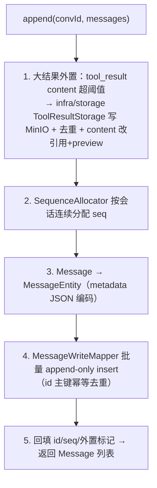
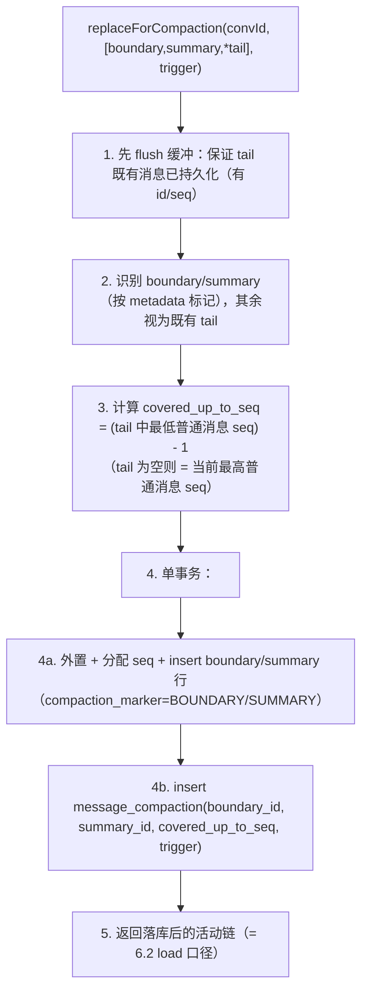
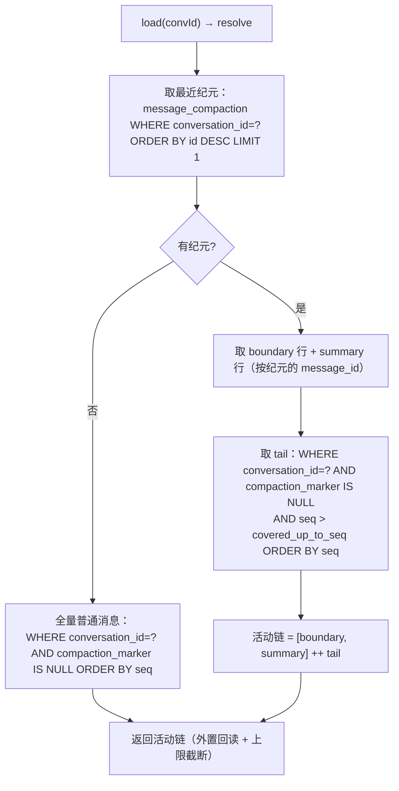

# session —— 会话 transcript 持久化（message 表唯一写者 / Wave 3）

> 本文是 PixFlow 完整重写阶段 `harness/session` 模块的设计文档，对应 `design.md` 第五章 5.3「Context Manager（持久化倒置给 session）」、第十二章「业务模块划分」`harness/session`、第十三章 13.1「数据模型 `message` 表」，以及 `module-dependency-dag-plan.md` 的 **Wave 3 横切组合**。
> 范围：实现 `context.TranscriptPort`、作为 `message` 表的唯一写者、压缩纪元与活动链重建、turn 内缓冲与边界 flush、大结果外置落库、会话内 seq 分配、并发/幂等/多节点语义、唯一写者约束守护。本文不涉及 MVP 既有实现（MVP 无此层），从新架构需求重新推导。
> 思路参考 `docs/references/context-architecture.md`（`JsonlTranscriptStore`）与 `docs/references/compaction-architecture.md`，但**仅借鉴「append-only transcript + 大结果外置 + 恢复加载」的理念；存储模型（JSONL → MySQL）、压缩后活动链重建、并发与多节点语义全部以 Java 17 + Spring Boot 3 + MyBatis-Plus 重新设计**。

---

## 目录

- [一、文档定位与设计原则](#一文档定位与设计原则)
- [二、与参考实现的本质差异](#二与参考实现的本质差异)
- [三、三方边界：session / context / conversation](#三三方边界session--context--conversation)
- [四、模块结构与依赖位置](#四模块结构与依赖位置)
- [五、数据模型：message 表扩展 + message_compaction](#五数据模型message-表扩展--message_compaction)
- [六、TranscriptPort 实现](#六transcriptport-实现)
- [七、压缩纪元与活动链重建（核心）](#七压缩纪元与活动链重建核心)
- [八、写穿透时机：turn 内缓冲 + 边界 flush](#八写穿透时机turn-内缓冲--边界-flush)
- [九、大结果外置（共享 ToolResultStorage）](#九大结果外置共享-toolresultstorage)
- [十、会话内 seq 分配](#十会话内-seq-分配)
- [十一、并发、幂等与多节点](#十一并发幂等与多节点)
- [十二、唯一写者约束守护](#十二唯一写者约束守护)
- [十三、错误处理与降级](#十三错误处理与降级)
- [十四、配置项](#十四配置项)
- [十五、与各模块的接缝契约](#十五与各模块的接缝契约)
- [十六、可观测](#十六可观测)
- [十七、测试策略](#十七测试策略)
- [十八、暂不考虑](#十八暂不考虑)

---

## 一、文档定位与设计原则

`harness/session` 在依赖 DAG 中处于 `context → session → conversation` 的位置（Wave 3）。它不是一个自由发挥的业务模块，而是被 `context` 用 `TranscriptPort` SPI **倒置出来的持久化实现方**：context 持有运行期工作内存（消息链），但「落 MySQL」这件事被委托给 session。session 是把会话 transcript 写进 MySQL `message` 表的**唯一通道**。

`session` 专属设计原则：

1. **唯一写者，纯持久化**。`message` 表的所有写入（携带 canonical references metadata 的用户消息、assistant、tool_result、压缩边界/摘要）只经 session。session 不做语义召回、不做上下文裁剪、不组装 prompt——这些分别归 `module/memory`、`harness/context`、`agent`。session 的全部价值是「把 context 的内存链可靠、可恢复、可审计地落库，并能反向重建出压缩后的活动链」。
2. **MySQL 是事实源，不引 Redis**。`message` 表是会话 transcript 的唯一事实源，同时承载 Rubrics 回放、eval trace、审计。session **本身不依赖 Redis**——活动链的热缓存是 `context.MessageChainCache` SPI 的职责（由 `infra/cache` 实现、context 调用、压缩时失效），与 session 解耦。这保证 session 的定位是「纯 MySQL 写者」，不与缓存层职责重叠（见 [§三](#三三方边界session--context--conversation)）。
3. **append-only 物理存储，逻辑活动链派生**。`message` 行只增不改（除幂等去重外不 UPDATE 业务字段），全量历史永久保留供审计；压缩「改写活动链」不是删除老行，而是写入新的边界/摘要标记 + 一条压缩纪元记录，由确定性重建逻辑派生出活动链（见 [§七](#七压缩纪元与活动链重建核心)）。
4. **倒置而非反向依赖**。session 实现 context 定义的 `TranscriptPort`，编译期 `session → context`；context 运行期经注入的 SPI 调 session。这与 `module/task` 实现 `state.CheckpointReadPort` 同类。
5. **并发外移**。同会话回合串行由**上层**（loop / conversation 的会话级锁）保证；session 不引入复杂同步，只靠 `(conversation_id, seq)` 唯一约束 + 主键幂等兜底。
6. **多节点无状态**。session 是无状态 service，任意节点都能 `load` 重建活动链（每轮 rehydrate，与 `context.md §七`、`state.md §十二` 同口径）。
7. **错误归一化遵从 common**。DB / 外置失败在跨出边界时归一化为 `DEPENDENCY` / `STORAGE`；session 自治的业务级失败用 `SessionErrorCode`。

---

## 二、与参考实现的本质差异

参考实现 OneCode 的 transcript 层是 `JsonlTranscriptStore`：单进程、按 session 写 `messages.jsonl`、缓冲 1s flush、大 tool result 外置到 `tool-results/<id>.txt`、`uuid`/`parent_uuid` 链。PixFlow 把它重写为多节点 MySQL 事实源：

| 维度 | OneCode（参考） | PixFlow（本模块） |
|---|---|---|
| 事实源 | `messages.jsonl` 文件 | **MySQL `message` 表** |
| 进程模型 | 单进程长驻，内存链常驻 | 多节点无状态，**每轮 rehydrate** |
| 写入接缝 | message_store 直接写文件 | context 经 `TranscriptPort` SPI **倒置**委托 session |
| flush | 缓冲 + 1s 定时 flush | **turn 内缓冲 + 回合边界 flush**（可配同步，见 [§八](#八写穿透时机turn-内缓冲--边界-flush)） |
| 活动链顺序 | `uuid`/`parent_uuid` 链 | **append seq + 压缩纪元重建**（marker 不进 tail，见 [§七](#七压缩纪元与活动链重建核心)） |
| 压缩落库 | 追加 JSONL 记录 | 写边界/摘要 marker 行 + `message_compaction` 纪元记录（单事务） |
| 大结果外置 | `utils/toolResultStorage` 写文件 | **共享 `infra/storage` 的 `ToolResultStorage`**（基于 `ObjectStorage` + `StorageKeys.toolResult(id)` 写 MinIO + 表内存引用） |
| 恢复 | `from_transcript` 全量读 | `load` 按压缩纪元重建活动链（可配条数上限） |
| 缓存 | 进程内内存即缓存 | **不在 session**；归 context 的 `MessageChainCache`（Redis，可丢可重建） |

**可借鉴的骨架**：provider-neutral `tool_result`、大结果外置 + 引用 + 去重、append-only transcript 作恢复事实源、压缩产物为「边界 + 摘要 + tail」。PixFlow 内部消息只有 USER / ASSISTANT / TOOL_RESULT 三种角色；素材引用是 USER metadata，不是第四种消息。
**必须重写的内核**：MySQL 事实源 + MyBatis-Plus 落库、压缩后活动链的确定性重建（append seq + 纪元，不用文件追加语义）、turn 缓冲 + 边界 flush、多节点 rehydrate、唯一写者编译/架构守护。

---

## 三、三方边界：session / context / conversation

`design.md §12` 把消息相关职责拆成三个模块，session 居中：

```
infra/storage ─┐
               ├─► context ──► session ──► conversation
   (ToolResultStorage)│           │
                      └ MessageChainCache(Redis 缓存,归 context↔infra/cache)
```

| 模块 | 职责 | 与 session 的边界 |
|---|---|---|
| `harness/context` | 运行期工作内存：消息模型、append-only 内存链、投影、预算、cheap pipeline、摘要式压缩**编排**、ContextSnapshot、fork 继承；定义 `TranscriptPort` / `MessageChainCache` SPI | context **不直连 MySQL**；落库经 `TranscriptPort` 委托 session。压缩的**决策与摘要**在 context（含 LLM 经 `SummarizationPort`），session 只负责把压缩产物**落库 + 重建** |
| `harness/session` | transcript 持久化（唯一写者）：实现 `TranscriptPort`，append/load/replaceForCompaction，压缩纪元、活动链重建、大结果外置落库、seq 分配 | 本模块 |
| `module/conversation` | 业务出口：`conversation` 表 CRUD、REST、SSE 流式、canonical Message Reference 规范化；对 `message` 表**只读查询**（历史展示） | conversation **不写 `message` 表**；用户消息也经 `context → TranscriptPort → session` 落库。conversation 的只读查询看「全量 transcript」（审计/展示），session 的 `load` 给「压缩后活动链」（喂模型） |

边界硬约束：

1. **写归属唯一**：`message` 行的写入只经 session 的 `TranscriptPort` 实现；conversation、memory、其他任何模块都不写此表。
2. **缓存不在 session**：活动链 Redis 热缓存归 `context.MessageChainCache`（infra/cache 实现），session 一律走 MySQL；session 不引 `infra/cache` 依赖。
3. **压缩决策不在 session**：触发判定、tail 选取、LLM 摘要都在 context；session 只接收已成形的 `(boundary, summary, *tail)` 并落库 + 维护纪元。
4. **两种读视图分离**：session.`load` = 压缩后**活动链**（模型视图）；conversation 的查询 = **全量 transcript**（人类/审计视图）。二者读同一张表，但语义不同，不可混用。

> 为什么 `load`（活动链重建）归 session 而不归 conversation？因为「压缩纪元如何派生活动链」是 transcript 持久化格式的内部知识（marker 行、covered_up_to_seq 语义），必须和写侧（replaceForCompaction）收敛在同一模块，否则两边对「什么是活动链」的理解极易漂移。conversation 只需要「全量按时间展示」，不碰纪元语义。

---

## 四、模块结构与依赖位置

源码包：`com.pixflow.harness.session`（与仓库根包 `com.pixflow` 对齐；物理位置见 `design.md` 第十二章 `harness/session/`）。

```
harness/session/
├── port/
│   └── (实现 com.pixflow.harness.context.store.TranscriptPort)
├── persistence/
│   ├── TranscriptService.java        # 实现 TranscriptPort：append / load / replaceForCompaction
│   ├── MessageEntity.java            # message 表 PO
│   ├── CompactionEntity.java         # message_compaction 表 PO
│   ├── MessageWriteMapper.java       # 唯一写者（session 私有，含 append-only insert / 幂等去重）
│   ├── MessageReadMapper.java        # 读：活动链重建所需查询
│   └── CompactionMapper.java         # message_compaction 读写
├── chain/
│   └── ActiveChainResolver.java      # 压缩纪元 → 有序活动链（确定性重建）
├── buffer/
│   └── TranscriptBuffer.java         # turn 内缓冲 + flush（可配同步直写）
├── externalize/
│   └── SessionToolResultExternalizer.java # 大结果外置（组合 infra/storage 的 ToolResultStorage）
├── seq/
│   └── SequenceAllocator.java        # 会话内 seq 分配（max+1，唯一约束兜底）
├── mapping/
│   └── MessageMapper.java            # context.Message <-> MessageEntity 双向映射（metadata JSON 编解码）
├── error/
│   └── SessionErrorCode.java         # enum implements ErrorCode（session 自治码）
└── config/
    └── SessionAutoConfiguration.java # 装配 TranscriptService 等 Bean，注入 ToolResultStorage
```

依赖方向：

```
session ──► harness/context（实现 TranscriptPort；复用 Message / MessageRole / MessageMetadata / ToolResultReference / CompactionTrigger 模型）
session ──► infra/storage（ToolResultStorage：大结果外置落 MinIO + 引用回读；底层使用 ObjectStorage）
session ──► common（PixFlowException / ErrorCode / Sanitizer）
session ──► MyBatis-Plus / MySQL（message / message_compaction 表的属主与唯一写者）
context ──► session（运行期经注入的 TranscriptPort 调 session；编译期是 session → context 的 SPI 倒置）
conversation ──► session 间接：conversation 只读 message 表用自己的查询，不调 session 写路径
```

> **依赖边说明**：DAG 中需要同时存在 `context --> session` 与 `infra/storage --> session`。session 通过实现 context 的 `TranscriptPort` 接入消息链，又在落库/rehydrate 时复用 `infra/storage` 的 `ToolResultStorage` 外置和回读大 tool-result。`infra/storage` 在 Wave 1，session 在 Wave 3，无环；这与 `harness/context → infra/storage`、`harness/tools → infra/storage` 同理——三处共享同一 `ToolResultStorage`。
>
> **接口约束**：session 不引用 `harness/tools`、`module/*` 的任何类型；它对外只通过 context 的模型类型（`Message` 等）和 `TranscriptPort` 接缝表达，不暴露 `MessageEntity`/`CompactionEntity` 等 PO 给上层。

---

## 五、数据模型：message 表扩展 + message_compaction

### 5.1 与 `design.md §13.1` 的差异（需同步）

`design.md §13.1` 的 message 以 metadata 保存 structured references 与 context 标记。session 负责把这些开放字段原样持久化，同时把常用压缩索引字段显式提列。

本设计据此扩展 `message` 表，并新增 `message_compaction` 纪元表。**这是对 `design.md §13.1` 的扩展，需回写同步**（见 [Revision Notes](#revision-notes)；本文先以 session 视角定义权威 schema）。

### 5.2 `message` 表（扩展后）

| 字段 | 类型 | 说明 |
|---|---|---|
| `id` | varchar PK | 消息 id，与 `context.Message.id` 对齐；append-only 幂等去重的主键 |
| `conversation_id` | varchar, idx | 会话 id |
| `seq` | bigint | **会话内单调序号**（append 物理顺序）；`(conversation_id, seq)` 唯一约束（见 [§十](#十会话内-seq-分配)） |
| `role` | enum/varchar | `USER` / `ASSISTANT` / `TOOL_RESULT`（与 `context.MessageRole` 对齐） |
| `content` | mediumtext | 文本内容；外置后此处为「引用 + preview」 |
| `tool_call_id` | varchar, null | TOOL_RESULT 配对用；其它角色为 null |
| `compaction_marker` | enum/varchar, null | `null`（普通消息）/ `BOUNDARY` / `SUMMARY`；活动链重建用（见 [§七](#七压缩纪元与活动链重建核心)） |
| `metadata` | json, null | USER 消息保存 ordered `references[{referenceKey,displayPathSnapshot}]`；同时保存 context 压缩、外置结果、placeholder 等开放标记 |
| `task_id` | varchar, null | 关联任务（沿用 `design.md`） |
| `created_at` | datetime | 落库时间 |

索引：主键 `id`；唯一 `(conversation_id, seq)`；普通索引 `(conversation_id, seq)` 已含于唯一约束，另建 `(conversation_id, compaction_marker)` 便于 tail 过滤与 marker 定位。

> `metadata` 选 JSON 列而非拆显式列：这些标记是 context 内部演进的开放位，DB 层不需要对它们建索引或做条件查询（活动链重建只依赖 `seq` 与 `compaction_marker` 两个已提列的字段）。`compaction_marker` 单独提列是因为它进入 tail 过滤的 `WHERE`，需要可索引、可确定性查询。

### 5.3 `message_compaction` 表（新增，session 自治）

记录每一次 destructive compaction 形成的「纪元」，是活动链重建的依据。

| 字段 | 类型 | 说明 |
|---|---|---|
| `id` | bigint PK auto | 纪元 id，单调递增（取最新即最近纪元） |
| `conversation_id` | varchar, idx | 会话 id |
| `boundary_message_id` | varchar | 本次压缩写入的边界 marker 行 id |
| `summary_message_id` | varchar | 本次压缩写入的摘要 marker 行 id |
| `covered_up_to_seq` | bigint | **本次摘要折叠的最高「普通消息」seq**；活动链 tail = 普通消息中 `seq > covered_up_to_seq` 者 |
| `trigger` | enum/varchar | `AUTO` / `MANUAL` / `REACTIVE`（对应 `context.CompactionTrigger`；`MICRO` 不落此表，它不改写链） |
| `created_at` | datetime | 压缩时间 |

索引：主键 `id`；普通索引 `(conversation_id, id)`（取最近纪元）。

> 选「独立纪元表」而非「把纪元塞进 boundary 行 metadata」：独立表让「取最近纪元」是一次 `ORDER BY id DESC LIMIT 1` 的确定性查询，重建逻辑无需扫 metadata；纪元语义（covered_up_to_seq、引用的 marker 行）显式、可审计、易测。该表是 session 自治内部表，不进 `contracts`、不被上层引用。

---

## 六、TranscriptPort 实现

session 的 `TranscriptService` 实现 `context.store.TranscriptPort`（`context.md §6.2`）三方法。所有方法以 `conversationId` 为操作键（session 无独立会话实体，会话身份即 `conversation_id`，`conversation` 表归 `module/conversation`）。

```java
public interface TranscriptPort {
    List<Message> append(String conversationId, List<Message> messages);
    List<Message> load(String conversationId);
    List<Message> replaceForCompaction(String conversationId,
                                       List<Message> messages,
                                       CompactionTrigger trigger,
                                       Map<String,Object> metadata);
}
```

### 6.1 `append`

append-only 落一批消息。流程：



- **外置**先于 insert：保证落库 content 已是「引用 + preview」，原始字节落 MinIO（见 [§九](#九大结果外置共享-toolresultstorage)）。
- **幂等**：以 `id` 主键去重（`INSERT ... ON DUPLICATE KEY` / `INSERT IGNORE` 语义），同一消息重复 append 不产生重复行（见 [§十一](#十一并发幂等与多节点)）。
- 返回值回填外置标记与最终 `seq`，供 context 内存链与 `id` 对齐。
- 缓冲模式下 `append` 仅入 `TranscriptBuffer`，真正 insert 推迟到 flush（见 [§八](#八写穿透时机turn-内缓冲--边界-flush)）。

### 6.2 `load`（rehydrate → 活动链）

按压缩纪元重建**压缩后活动链**（不是全量 transcript），供 context 每轮 rehydrate。算法见 [§七](#七压缩纪元与活动链重建核心)。

- 外置结果回读：活动链中标 `toolResultExternalized` 的消息，回读 MinIO 完整 content；缺失则保留 preview 并标 `missingExternalToolResult`，**不阻断 rehydrate**（`context.md §6.2`）。
- 条数上限可配（`load-max-messages`）：超长会话只取最近活动链尾部（仍保配对，丢弃由上限造成的孤立 tool_result 由 context 投影器兜底；session 侧按 seq 截断时优先在配对边界截）。

### 6.3 `replaceForCompaction`

接收 context 已成形的压缩产物 `messages = [boundary, summary, *tail]`，落库并建立新纪元。**单事务**保证原子性：



- boundary/summary 是**新行**（带 `compaction_marker`），tail 是**既有行**（不重插，只参与 covered 计算）。
- **不删除**被折叠的老消息行——它们留作审计；活动链重建靠纪元 + marker 过滤把它们排除（见 [§七](#七压缩纪元与活动链重建核心)）。
- `MICRO` 触发不进此路径（microcompact 只投影、不改写链，见 `context.md §10.2`）；只有 `AUTO`/`MANUAL`/`REACTIVE` 改写链、落纪元。

---

## 七、压缩纪元与活动链重建（核心）

这是本模块最难、也是正确性最关键的部分。矛盾在于：`message` 表是 **append-only 审计事实源**，但 `replaceForCompaction` 的语义是**改写活动链**——压缩后模型只该看到 `(boundary, summary, *tail)`，被摘要折叠的老消息既要从活动链消失，又要在表里留存供审计。`load` 必须确定性地重建出压缩后活动链。

### 7.1 为什么不能只靠全局 seq 排序

直觉做法是「活动链 = 按 seq 排序的某个后缀」，但它在跨多次压缩时会错位：boundary/summary 是压缩时新追加的行，seq 比被它们摘要的 tail 还高，而逻辑上摘要应排在活动链**最前**（它代表被折叠的前缀）。若按 seq 排序，摘要会跑到 tail 后面，顺序错乱；多次压缩后旧 marker 的高 seq 还会污染下一次的 tail 选取。

### 7.2 解法：marker 隔离 + 纪元 covered_up_to_seq

核心规则两条：

1. **marker 永不进 tail**。压缩边界/摘要行带 `compaction_marker`，tail 查询恒过滤 `compaction_marker IS NULL`，即 tail **只含普通消息**（USER/ASSISTANT/TOOL_RESULT）。历次压缩的旧 marker 永远被新摘要折叠、永不出现在活动链 tail 里。
2. **covered_up_to_seq 只对普通消息取值**。它是「本次摘要折叠的最高普通消息 seq」；活动链 tail = 普通消息中 `seq > covered_up_to_seq` 者。普通消息的 seq 是单调的，最近保留的 tail 必然是最高 seq 的连续后缀，故总存在一个干净的 seq 切点。

### 7.3 重建算法（`ActiveChainResolver.resolve`）



- 无纪元（从未压缩）：活动链 = 全量普通消息按 seq（也可不过滤 marker，因为无 marker 行）。
- 有纪元：活动链 = `[boundary, summary]` 显式前置 + `tail（seq > covered_up_to_seq 的普通消息，按 seq）`。压缩后新追加的普通消息 seq 更高，自然落在 tail 末尾、顺序正确。

### 7.4 正确性走查（多次压缩）

设普通消息 seq 1..100。

- **压缩1**：保留 tail 81..100，折叠 1..80。写 boundary(seq=101,marker)、summary(seq=102,marker)，纪元 `covered=80`。
  - 重建：`[boundary,summary]` + 普通消息 `seq>80` = 81..100。活动链 = `[b1, s1, 81..100]`。✓
- 追加普通消息 103..150（seq 递增）。重建：`[b1,s1]` + `seq>80` 普通 = `81..100,103..150`。✓
- **压缩2**：在活动链 `[b1,s1,81..100,103..150]` 上摘要前缀、保留 tail 140..150。
  - tail 只含普通消息 140..150，最低 seq=140 → `covered2 = 139`。b1/s1 是 marker，被折叠进 summary2、不进任何 tail。写 boundary2/summary2（更高 seq），纪元 `covered=139`。
  - 重建（取最近纪元2）：`[b2,s2]` + 普通消息 `seq>139` = 140..150。活动链 = `[b2,s2,140..150]`。✓ 旧 marker b1/s1（seq 101/102 < 139）被排除，旧普通消息 81..139 被排除，顺序正确。

> 退化边界：若活动链极短、保留的 tail 触及最前的 marker，则本就没有足够内容触发压缩（受 `context` 的 token 阈值与 `snip_max_messages` 约束）。`context` 不会在这种小链上发起 destructive compaction，故该退化不进入 session；session 只需保证「marker 永不进 tail + covered 只对普通消息取值」这一对不变量即可。

### 7.5 covered_up_to_seq 的计算

`replaceForCompaction` 收到的 tail 是既有普通消息（带 `id`，已持久化）。session：
- 解析 tail 中所有普通消息的 `id`，查 `min(seq)`；`covered_up_to_seq = min(seq) - 1`。
- tail 为空（全量折叠）：`covered_up_to_seq = ` 当前会话普通消息 `max(seq)`。
- 因 `replaceForCompaction` 先 flush（[§六.3](#六transcriptport-实现)），tail 的 `id`/`seq` 必定已存在，计算无歧义。

---

## 八、写穿透时机：turn 内缓冲 + 边界 flush

`context.MessageStore` 每次 append「写穿透」到 `TranscriptPort`。session 提供两种落库时机，默认缓冲、可配同步：

| 模式 | 行为 | 适用 |
|---|---|---|
| **BUFFERED（默认）** | append 入 `TranscriptBuffer` 内存队列；回合收尾 `flush()`（或缓冲超阈值）批量 insert | 默认。Agent 回合「请求内同步执行、秒级」（`design.md §6.1`）、同会话回合串行，turn 中途崩溃 = 该回合未完成、丢这批可接受，下次从上一稳定点 rehydrate |
| **SYNC** | 每次 append 立刻 insert | 强持久性诉求 / 排障；DB 往返更多 |

要点：

- **持久断点不靠 message 表**：任务图片处理进度的断点是 `process_result`（`state` 模块），message 表丢的是「对话进度」而非「图片处理进度」，影响可控。故缓冲窗口内崩溃的代价被限制在「一个未完成回合的对话消息」。
- **flush 触发点**：回合边界（`TurnStopped` 语义，由 loop 调 `flush()`）、缓冲条数/字节超阈值、`replaceForCompaction` 前（保证 tail 已落库）、子 Agent 边界（如有）。
- **flush 失败处理**：批量 insert 失败归一化为 `DEPENDENCY`（可重试）上抛给 loop；不静默吞——否则事实源缺失会导致下轮 rehydrate 不一致。
- 缓冲是**回合内线程封闭**（与 `context.MessageStore` 同口径），不跨回合复用、不做跨节点共享。

> 与 Redis 的关系：缓冲是**进程内内存**，不引 Redis。曾考虑「先写 Redis 再异步刷 MySQL」(write-behind)，否决——Redis 同样可丢，不解决持久性，反而多一跳 + 多一个非事实源中转。活动链的读加速由 context 的 `MessageChainCache`（Redis）负责，与 session 的写时机正交。

---

## 九、大结果外置（共享 ToolResultStorage）

大 `tool_result` 外置到 MinIO、表内只存「引用 + preview」，是防 transcript 行膨胀与上下文膨胀的关键。session 是 `context.md §13` 列出的**三处外置共享点之一**（另两处：context cheap pipeline、tools 执行管线），三处**共享 `infra/storage` 的同一 `ToolResultStorage` 实现**，不各写一套。`ToolResultStorage` 是对 `ObjectStorage` 与 `StorageKeys.toolResult(id)` 的薄封装，集中 key/hash/preview/ref/missing 语义；是否外置、阈值是多少仍由各调用方配置决定。

- **触发**：append/replaceForCompaction 落库时，单条 `TOOL_RESULT` 的 UTF-8 content 超阈值（默认 50KB，`design.md §5.2/§13.4`）→ 写 `tool-results/{id}.txt`（`design.md §13.4`），content 改为引用 + 前若干字符 preview，metadata 标 `toolResultExternalized` + `toolResultRef`。
- **去重**：同 `toolCallId` 且内容相同复用同一文件；同 id 内容不同用稳定内容 hash 后缀（与 `context.md §13` 一致）。
- **回读**：`load` 时回读完整 content；文件缺失保留 preview 并标 `missingExternalToolResult`，不阻断。
- **归属**：`ToolResultStorage` 实现归 `infra/storage`，session 只**消费**（持久化引用、生成可见引用文本），不拥有通用存储实现。session 独立按阈值外置 + 共享去重，落库语义自洽，不依赖 context 是否已外置（幂等去重保证不重复写）。

---

## 十、会话内 seq 分配

`seq` 是会话内单调序号，承担**排序**（活动链按 seq）与**幂等兜底**（`(conversation_id, seq)` 唯一约束）双职责。

- **分配方式**：应用层 `SequenceAllocator` 在批量 insert 前按会话取 `max(seq)+1` 起连续分配（同批次内递增）。不使用 Redis INCR——Redis 丢失会断单调性、还要回退 MySQL `max+1` 兜底，等于维护两套；DB 一套即可。
- **唯一约束兜底**：`(conversation_id, seq)` 唯一约束。并发或重试导致的 seq 冲突 → insert 失败 → session 重新取 `max(seq)+1` 重算后重试（有限次）。因同会话回合**串行**（上层锁），正常路径无冲突；约束只为异常并发兜底。
- **marker 也占 seq**：boundary/summary 行同样分配 seq（在普通消息之后），但活动链重建按 `compaction_marker` 过滤、按纪元前置，故 marker 的 seq 不影响 tail 顺序（见 [§七](#七压缩纪元与活动链重建核心)）。

---

## 十一、并发、幂等与多节点

- **并发外移**：同会话回合串行由上层（loop / conversation 会话级锁）保证；session 不加锁、不做内部同步（与 `context.md §一`、`state.md §一` 同口径）。
- **幂等**：
  - append 以 `message.id`（context 生成的内部 id）为主键去重；重复 append（请求重试、缓冲重放）不产生重复行。
  - replaceForCompaction 单事务：marker insert + 纪元 insert 原子；事务失败整体回滚，不留半成品纪元。
  - 重复触发同一压缩（罕见）：因 marker 行 id 由 context 生成且稳定，主键去重 + 事务保证不重复建纪元（同 id 冲突即视为已处理）。
- **多节点**：session 无状态，恢复/查询落在任意节点都从 MySQL 重建活动链；不做会话-节点亲和（与 `context.md §七`、`state.md §十二` 一致）。Redis 缓存（context 侧）miss 时永远能从 MySQL 重建。
- **写序一致性**：append-only insert 先于任何「活动链可见」假设；replaceForCompaction 的 flush-先行保证 tail 已落库，covered_up_to_seq 计算无悬空引用。

---

## 十二、唯一写者约束守护

「`message` 表唯一写者是 session」是硬不变量，用**类型隔离 + ArchUnit** 双重守护：

1. **读写 Mapper 拆分**：
   - `MessageWriteMapper`（含 insert / 幂等去重）声明在 session，**session 私有**，不对外暴露。
   - `MessageReadMapper` / conversation 自有的只读查询负责展示读。
2. **ArchUnit 守护**：
   - 断言 `MessageWriteMapper` 的写方法只被 `com.pixflow.harness.session..` 调用；任何 `module/conversation`、`module/memory` 等对它的引用编译/测试期失败。
   - 断言 `com.pixflow.harness.session..` 不依赖 `module/*`、`harness/tools`、`infra/cache`（session 不碰 Redis）。
   - 断言 `MessageEntity`/`CompactionEntity` 等 PO 不泄露到 session 包外（上层只见 context 的 `Message` 模型）。
3. **写路径单一**：用户消息也经 `context → TranscriptPort → session` 落库；conversation 的任何「新增消息」诉求都转为「让 context append」，不允许 conversation 直接 insert `message` 行。

---

## 十三、错误处理与降级

遵从 `common.md` 的归一化模型，session 不自定义 infra 异常处理：

| 场景 | 行为 | category / recovery |
|---|---|---|
| MySQL 写/读失败 | 上抛（事实源不可用无法回退） | `DEPENDENCY` / RETRY |
| `ToolResultStorage` 写失败（外置） | 上抛 | `STORAGE` / RETRY |
| 外置结果回读缺失 | **不上抛**：保留 preview + 标 `missingExternalToolResult` | 降级，不阻断 rehydrate |
| seq 唯一约束冲突 | 重取 `max+1` 重试（有限次），超限上抛 | 内部重试 → `DEPENDENCY` |
| 请求的 conversationId 无消息 | `load` 返回空活动链（不报错） | — |
| 纪元引用的 marker 行缺失（数据损坏） | 退化为「无纪元全量」并记 error 指标 | `SessionErrorCode` |

- `SessionErrorCode`（`enum implements ErrorCode`）承载 session 自治业务码：

| code | category |
|---|---|
| `SESSION_TRANSCRIPT_CORRUPTED` | INTERNAL（纪元/ marker 不一致等数据损坏） |
| `SESSION_SEQ_ALLOCATION_EXHAUSTED` | DEPENDENCY（seq 冲突重试超限） |

- 落盘/对外文案经 `common.Sanitizer`（content 可能含敏感串，外置 preview 与 error_msg 统一脱敏）。
- session **不自记 trace**：trace 写入责任在调用方（loop 经 `eval` SPI），与 `context.md`、`state.md` 同口径。session 零 `harness/eval` 依赖。

---

## 十四、配置项

```yaml
pixflow:
  session:
    write-mode: buffered            # buffered（默认）| sync
    buffer:
      flush-max-messages: 50        # 缓冲条数超此值提前 flush
      flush-max-bytes: 1048576      # 缓冲字节超此值提前 flush（1MB）
    load:
      max-messages: 400             # rehydrate 活动链条数上限（0=不限）；超限取最近后缀，优先在配对边界截
    externalize:
      tool-result-threshold: 51200  # 50KB，超则外置 MinIO（与 context/tools 同阈值）
    seq:
      allocation-retry: 3           # seq 唯一约束冲突重试上限
```

- 外置阈值与 `pixflow.context.budget.tool-result-externalize-threshold` 保持一致（同一 `ToolResultStorage` 语义），由部署侧统一配置。
- `load.max-messages` 取向「保配对 + 可截断」：截断由 session 按 seq 在配对边界附近裁，残留孤立 tool_result 由 context 投影器兜底丢弃。

---

## 十五、与各模块的接缝契约

| 对接方 | 契约 |
|---|---|
| `harness/context` | session 实现 `TranscriptPort`（`append`/`load`/`replaceForCompaction`），是 `message` 表唯一写者；复用 context 的 `Message`/`MessageRole`/`MessageMetadata`/`ToolResultReference`/`CompactionTrigger` 模型；`load` 返回**压缩后活动链**；缓存（`MessageChainCache`）由 context 持有，session 不感知 |
| `module/conversation` | conversation **只读** `message` 表做历史展示；用户消息经 `context → TranscriptPort → session` 落库，canonical references 作为 USER message metadata 保存，不创建附件消息或单一 package 外键 |
| `infra/storage` | session 经共享 `ToolResultStorage` 外置/去重/回读大结果；不拥有通用存储实现；DAG 已补 `infra/storage → session` 依赖边 |
| `harness/loop` | loop 在回合边界调 `flush()`；rehydrate 由 context.`buildForModel` 间接触发 session.`load`；trace 由 loop 经 eval SPI 负责，session 不自记 |
| `common` | DB/storage 异常归一化为 `DEPENDENCY`/`STORAGE`；session 业务失败抛 `SessionErrorCode`；文案经 `Sanitizer` |
| `harness/eval` | 零依赖：session 不写 trace；可观测指标由 session 自身经 Micrometer 暴露（见 [§十六](#十六可观测)） |
| `harness/state` / `module/memory` | 边界隔离：state 管任务运行态、memory 管业务记忆，均不碰 `message` 表；session 不做任务态持久化、不做语义召回 |

**关键不变量**：① `message` 表唯一写者是 session；② session 不直连 Redis（缓存归 context）；③ append-only 物理存储 + 压缩纪元派生活动链，marker 永不进 tail；④ 任何外置/回读与 context/tools 共享 `infra/storage` 的同一 `ToolResultStorage`；⑤ 并发外移、多节点从 MySQL rehydrate；⑥ session 零 `harness/eval` 依赖、不自记 trace。

---

## 十六、可观测

最小指标集（Micrometer，session 实现侧自暴露，不经 eval）：

- `pixflow.session.append{result=ok|error}` + 批量大小分布：落库健康度与批量规模。
- `pixflow.session.flush.latency`（计时器）+ `pixflow.session.flush.batch`（条数分布）：缓冲 flush 行为。
- `pixflow.session.load.latency` + `pixflow.session.load.size`：rehydrate 成本与活动链规模。
- `pixflow.session.compaction{trigger=auto|manual|reactive}`：压缩纪元产生频率。
- `pixflow.session.externalize{action=write|read|miss}`：大结果外置/回读/缺失分布（miss 高说明 MinIO 数据漂移）。
- `pixflow.session.seq.retry`：seq 冲突重试次数（高说明上层串行锁失效或并发异常）。

关键步骤（append/load/compaction）的业务回合归因经 loop 的 trace 记录（`agent_trace`），session 只出运维指标，不写 trace 表。

---

## 十七、测试策略

- **TranscriptPort 三方法**：append 落库 + 回填 id/seq；load 重建；replaceForCompaction 落 marker + 纪元（单事务）。
- **活动链重建（核心）**：
  - 无纪元 → 全量普通消息按 seq。
  - 单次压缩 → `[boundary,summary]` + `seq>covered` tail，顺序正确。
  - **多次压缩** → 旧 marker 被排除、旧普通消息被排除、新摘要前置，断言 [§七.4](#七压缩纪元与活动链重建核心) 走查序列。
  - 属性测试：任意「append/compact 交错」序列下，活动链恒满足「以最近 summary 开头 + 普通消息 seq 递增 tail + 无重复 + marker 永不进 tail」。
- **外置**：>50KB 写 MinIO + 引用+preview + 去重复用；回读缺失保 preview 标 `missingExternalToolResult` 不阻断。
- **写时机**：BUFFERED 下 append 不立即落库、flush 批量落；SYNC 下逐条落；replaceForCompaction 前强制 flush 使 tail 可见。
- **seq / 幂等**：`(conversation_id, seq)` 唯一约束；重复 id append 去重；seq 冲突重试。
- **唯一写者守护**：ArchUnit 断言 `MessageWriteMapper` 写方法仅 session 调用；session 不依赖 `module/*`、`harness/tools`、`infra/cache`；PO 不外泄。
- **归一化**：DB/storage 异常跨边界后为 `DEPENDENCY`/`STORAGE` 的 `PixFlowException`。
- **集成测试**：Testcontainers MySQL + MinIO 覆盖 append/load/compaction/外置端到端；Windows 本地按 `design.md §4.1` 用 `-Pwindows-docker-tcp` 或 `DOCKER_HOST=npipe:////./pipe/docker_engine`。单元层用 in-memory `ToolResultStorage` 替身 + H2/嵌入式或 fake mapper 跑重建/缓冲/降级逻辑。

---

## 十八、暂不考虑

- **session memory（跨压缩连续性 Markdown + 提取子 Agent）**：参考实现的 `session-memory.md` 机制本期不做（与 `context.md §十七` 一致）；摘要直接进活动链，不维护独立 session 级 memory 文件。
- **独立会话实体表**：session 无自己的会话表，会话身份即 `conversation_id`（`conversation` 表归 `module/conversation`）；会话生命周期（标题/时间戳）不归 session。
- **节点级续传 / 跨会话拼接**：session 以单会话 transcript 为单位，不做跨会话合并。
- **物理删除 / 归档**：append-only 全量保留，老消息的冷归档/TTL 清理待运维需求明确再设计（审计与 Rubrics 回放需要全量历史）。
- **Redis 缓存收编进 session**：活动链缓存坚持归 context 的 `MessageChainCache`，session 保持 MySQL-only。
- **多租户 transcript 隔离**：`design.md §16` 本期不做多账号。

## Revision Notes

2026-06-29 / Kiro: 新建 `harness/session` 设计文档。确立 session 为 `message` 表唯一写者、实现 context 的 `TranscriptPort`、append-only + 压缩纪元（`message_compaction`）派生活动链、turn 内缓冲 + 边界 flush（可配 sync）、共享 `infra/storage` 的 `ToolResultStorage` 外置、应用层会话内 seq 分配；明确 session 不引 Redis（活动链缓存归 context 的 `MessageChainCache`）。

2026-06-29 / Codex: 同步总设计和 DAG：`design.md §13.1` 已扩展 `message` 表并新增 `message_compaction` 表，`module-dependency-dag-plan.md` 已补 `infra/storage --> session` 边。根据实现讨论，`ToolResultStorage` 明确现在就抽取到 `infra/storage`，作为 `ObjectStorage + StorageKeys.toolResult(id)` 之上的共享外置/回读薄抽象，供 context/tools/session 共同消费。
