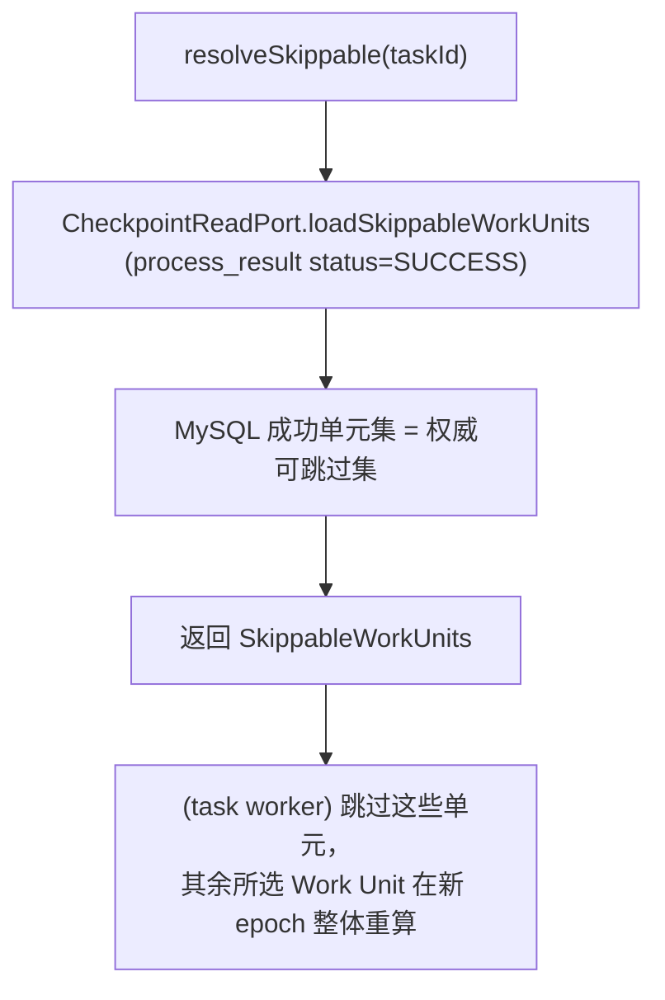
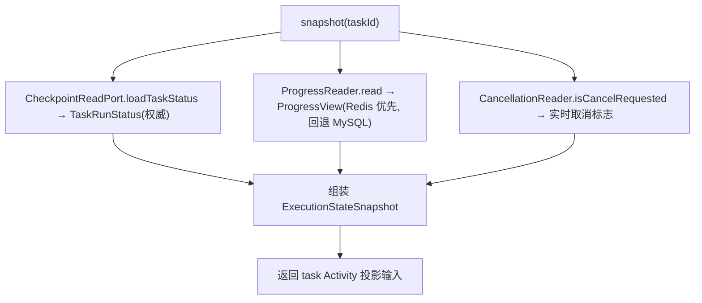

# state —— 执行运行态聚合与断点恢复协调（Wave 2 harness 基础）

> 本文是 PixFlow 完整重写阶段 `harness/state` 模块的设计文档，对应 `design.md` 第五章 5.4「State Store」、第九章 9.4「断点恢复与失败隔离」、9.5「分组聚合」、第十三章「数据模型」、第十四章「异步执行时序」，以及 `module-dependency-dag-plan.md` 的 **Wave 2 harness 基础**。
> 范围：跨 MySQL / Redis / MinIO 三存储的**执行运行态读模型聚合**、断点恢复的**已完成单元计算**、运行态引用存取、进度与取消的读侧协议、供应用层全局 Activity 投影使用的统一 task 状态快照。
> 与 `cache.md`、`storage.md`、`context.md`、`common.md` 配套阅读：cache 给原语、storage 给 I/O、task/dag 拥有键与表的写侧，**state 是把三存储拼成一份连贯运行态视图、并裁决"什么算完成 / 怎么恢复"的读侧聚合与协调层**。本文不涉及 MVP 既有实现（MVP 无此层），从新架构需求重新推导。

---

## 目录

- [一、文档定位与设计原则](#一文档定位与设计原则)
- [二、存在理由：读侧聚合 + 恢复协调，而非新存储](#二存在理由读侧聚合--恢复协调而非新存储)
- [三、四方边界：state / context / cache+storage / task+dag](#三四方边界state--context--cachestorage--taskdag)
- [四、模块结构与依赖位置](#四模块结构与依赖位置)
- [五、运行态读模型](#五运行态读模型)
- [六、MySQL checkpoint 接入：CheckpointReadPort SPI（倒置接缝）](#六mysql-checkpoint-接入checkpointreadport-spi倒置接缝)
- [七、运行态引用存取（Redis 引用，字节落 MinIO）](#七运行态引用存取redis-引用字节落-minio)
- [八、进度的双源对账](#八进度的双源对账)
- [九、取消的读侧协议](#九取消的读侧协议)
- [十、断点恢复协调（RecoveryCoordinator）](#十断点恢复协调recoverycoordinator)
- [十一、统一状态快照（查询 / WS 数据源）](#十一统一状态快照查询--ws-数据源)
- [十二、崩溃一致性与多节点模型](#十二崩溃一致性与多节点模型)
- [十三、降级分级与错误归一化](#十三降级分级与错误归一化)
- [十四、配置项](#十四配置项)
- [十五、与各模块的接缝契约](#十五与各模块的接缝契约)
- [十六、可观测](#十六可观测)
- [十七、测试策略](#十七测试策略)
- [十八、暂不考虑](#十八暂不考虑)

---

## 一、文档定位与设计原则

`harness/state` 在依赖 DAG 中处于 `{infra/cache, infra/storage} → state → task` 的位置。它是执行运行态的**聚合读模型 + 断点恢复协调权威**：把 MySQL、Redis、MinIO 三处事实融合成一份 task 快照，供 worker 恢复和应用层 Activity bridge 消费。state 不持有 WebSocket/SSE 连接，也不直接推帧。

`state` 专属设计原则：

1. **读侧聚合，不抢写侧**。进度、RLock/epoch、取消、当前 epoch 运行态引用与 `process_*` 写入归 task/dag；state 只负责对账、计算 Skippable Work Units 和组装快照。
2. **MySQL SUCCESS 是唯一 Work Unit Checkpoint**。Redis Runtime Reference 与计数只用于当前运行加速，可丢可重建且不跨 epoch；任何冲突一律 MySQL 胜。
3. **不拥有业务表，倒置接入 checkpoint**。`process_task` / `process_result` 是强业务语义表，属主是 task。state 不拥有、不直连这些表，而是定义 `CheckpointReadPort` SPI，由 `module/task` 实现（与 `context.TranscriptPort`←session、`common.ErrorRecorder`←eval 同类的依赖倒置）。state 只认“完成单元 + 计数”这个最小投影形状，不认全字段。
4. **组合 infra，不重造原语**。Redis 访问一律经 `infra/cache` 的 `CacheStore` / `AtomicCounter`，MinIO 访问一律经 `infra/storage` 的 `ObjectStorage`；state 不直接碰 Redisson / MinioClient，也不自定义键的环境前缀（键由调用方 / task/dag 的命名空间产出）。
5. **多节点无状态**。恢复扫描与状态查询可能落在任意节点，全部从 MySQL rehydrate，Redis 仅优化，不做会话 / 任务-节点亲和（与 `context.md §七` 每轮 rehydrate 口径一致）。
6. **降级分级复用 cache 契约**。取消 / 进度判定相关读不可静默吞（影响终态正确性），运行态引用读可降级为 miss（退化重算）；直接沿用 `cache.md §八` 的分级，不另立一套。
7. **横切而非领域**。state 是 harness 六件套之一，按注册 / 注入接入执行各阶段，不按业务领域切分；它对 task/dag 的领域知识只通过 SPI 投影与 `UnitKey` 这类中立标识表达，不内嵌 `dag_json` / `generated_copy` 等业务字段语义。

---

## 二、存在理由：读侧聚合 + 恢复协调，而非新存储

地基已经把"机制"切干净了，因此 state 的价值**不在新增存储能力**，而在**收敛口径**：

| 散落的事实 | 它在哪 | 谁写 | state 做什么 |
|---|---|---|---|
| SUCCESS Work Unit（含图片/组/生成式） | MySQL `process_result` | task worker | 读出来算 Skippable Work Units（恢复权威） |
| 任务终态计数（total / done / failed） | MySQL `process_task` + `process_result` | task | 作终态判定的权威计数 |
| 实时进度计数器 | Redis `progress:task:{taskId}` | task 自增 | 暴露给查询 / 推送，并与 MySQL 对账 |
| 取消标志 | Redis `cancel:task:{taskId}` | task / 用户触发 | 提供单元边界检查的读协议 |
| 当前 epoch 组成员 Runtime Reference | Redis `runref:group:{taskId}:{runEpoch}:*` | dag | 提供同 epoch引用 facade；不参与 checkpoint |
| 中间产物 / 结果字节 | MinIO | dag/task/imagegen | 回读引用对应的字节（按需） |

如果没有 state，上面这套"MySQL 真、Redis 可重建、缺失重算、双源对账"的协调逻辑会被 worker、恢复扫描器、查询端点各写一遍，且口径极易漂移（最典型：用 Redis 计数器判终态导致误判）。**state 把这套协调封装成单点，是它存在的唯一理由。** 它对外暴露的核心能力只有三类：

1. **恢复协调**：给定任务 → 可跳过单元集合（`RecoveryCoordinator`）。
2. **状态快照**：融合三存储 → `ExecutionStateSnapshot`（应用层 Activity 投影输入）。
3. **运行态引用存取**：当前 epoch group 引用读写 facade（`RunStateRefStore`），与 checkpoint 明确分离。

判断准则：**写运行态的是 task/dag，读懂整份运行态并裁决"什么算完成 / 怎么恢复"的是 state。** 任何"操作型写入"（自增、加锁、设标志、删缓存、落 `process_result`）一旦出现在 state 里，就是越界，应回到 task/dag。

---

## 三、四方边界：state / context / cache+storage / task+dag

```
infra/cache ──┐
              ├──► state ──► task （task 实现 CheckpointReadPort，消费查询/恢复协调）
infra/storage ┘        ▲
                       │ 实现 CheckpointReadPort
                  module/task
```

| 模块 | 职责 | 与 state 的边界 |
|---|---|---|
| `harness/context` | 会话维度**消息链**运行期工作内存 | context 不持久化任务态；state 不碰消息链、不做语义召回。二者维度正交（会话 vs 任务） |
| `module/memory` | 业务记忆（偏好 / SKU 历史 / 分析结论），由 Prompt 组装层自动召回并注入 | state 不做语义召回；裁剪 / 召回不归它 |
| `infra/cache` | Redis 原语（锁 / 计数 / 信号量 / KV），无业务词 | state **组合**它读运行态引用 / 进度；不重造原语、不定义键前缀 |
| `infra/storage` | MinIO 纯 I/O | state **组合**它回读字节；不拥有 key 模板 |
| `module/task` | 任务调度：MQ 消费、fan-out、**进度自增**、**加锁去重**、**设取消标志**、`process_*` 落库、断点恢复触发（`@Scheduled` 重扫）、下载 | task 是运行态**写侧**与恢复**执行方**；state 是**读侧聚合**与恢复**协调方**（算可跳过单元）。task 实现 `CheckpointReadPort` |
| `module/dag` | DAG 编译 / 校验 / 分支展开 / `compose_group`；当前 epoch group 运行态引用生命周期 | dag 拥有 `runref:group:*` 键；state 只提供 epoch-aware 引用形状与 facade |

边界硬约束：

1. **写归属**：进度自增、加锁、设取消、删缓存、`process_*` 落库 —— **全在 task/dag**，不在 state。
2. **事实源**：终态判定的权威是 MySQL；state 的所有融合结果在 Redis 与 MySQL 冲突时以 MySQL 为准。
3. **不直连 MySQL**：state 经 `CheckpointReadPort` 倒置读 checkpoint，不出现任何 MyBatis-Plus / JDBC 直连。
4. **不重造原语**：Redis / MinIO 访问只经 `infra/cache` / `infra/storage` 抽象。

---

## 四、模块结构与依赖位置

源码包：`com.pixflow.harness.state`

```
harness/state/
├── model/
│   ├── UnitKey.java                  # 工作单元中立标识：taskId + (imageId | groupKey) + branchId
│   ├── UnitKind.java                 # BRANCH / GROUP / GENERATIVE
│   ├── UnitStatus.java               # PENDING / SUCCEEDED / FAILED（镜像 process_result.status 语义）
│   ├── SkippableWorkUnits.java       # SUCCESS Work Unit Checkpoint 集合
│   ├── RuntimeArtifactRef.java       # 当前 run_epoch 引用，无 completed 语义
│   ├── ProgressView.java             # 进度视图：done/total/failed + 来源标记（REDIS/MYSQL）
│   ├── TaskRunStatus.java            # 任务运行态枚举（PENDING/RUNNING/SUCCEEDED/FAILED/CANCELLED）
│   └── ExecutionStateSnapshot.java   # 融合读模型（对外查询/WS 的统一出参）
├── port/
│   └── CheckpointReadPort.java       # SPI：按任务读已完成单元 + 终态计数（task 实现）
├── runtime/
│   ├── RunStateRefStore.java         # 当前 epoch group 引用 facade（组合 infra/cache）
│   ├── ProgressReader.java           # 进度双源读取 + 对账（Redis 实时 / MySQL 权威）
│   └── CancellationReader.java       # 取消标志读 + 单元边界检查协议（组合 infra/cache）
├── recovery/
│   └── RecoveryCoordinator.java      # 给定 task → SkippableWorkUnits（仅 MySQL SUCCESS）
├── query/
│   └── ExecutionStateService.java    # 组装 ExecutionStateSnapshot（融合三存储）
├── error/
│   └── StateErrorCode.java           # enum implements ErrorCode（state 自治码）
└── config/
    └── StateAutoConfiguration.java   # 装配 state Bean（注入 CacheStore/ObjectStorage/CheckpointReadPort）
```

依赖方向：

```
state ──► common（PixFlowException / ErrorCategory / Sanitizer）
state ──► infra/cache（CacheStore 读引用、AtomicCounter 读进度、CacheStore 读取消标志）
state ──► infra/storage（ObjectStorage 回读中间产物字节，按需）
task  ──► state（实现 CheckpointReadPort；消费 RecoveryCoordinator / ExecutionStateService）
```

> **SPI 倒置边说明**：`CheckpointReadPort` 由 `module/task` 实现，引入 `task → state` 边；与 `harness/session` 实现 `context.TranscriptPort` 同理，实现方指向 SPI 定义方，不构成环。
>
> **接口约束**：state 不引用 DAG DTO 或 `process_result` 实体；checkpoint 只以 `UnitKey` / `SkippableWorkUnits` 中立投影进入 state，避免倒挂。

---

## 五、运行态读模型

state 对外的所有事实都收敛到少量不可变 record。它们是**中立投影**，不携带 `dag_json` / `generated_copy` 等业务字段。

### 5.1 `UnitKey` —— 工作单元中立标识

`design.md §9.4 / §9.5` 的工作单元统一抽象为 `UnitKey`：普通支路是 `[图片×支路]`，组支路是 `[组×支路]`，生成式单元是 `[源图×生成计划]`。

```java
public enum UnitKind { BRANCH, GROUP, GENERATIVE }

public record UnitKey(
        String taskId,
        UnitKind kind,
        String memberId,   // BRANCH/GENERATIVE: imageId；GROUP: groupKey
        String branchId
) {
    // compact constructor：非空校验；kind 与 memberId 语义自洽
    public static UnitKey branch(String taskId, String imageId, String branchId) { ... }
    public static UnitKey group(String taskId, String groupKey, String branchId) { ... }
    public static UnitKey generative(String taskId, String imageId, String planId) { ... }
}
```

- 与 `process_result` 的对齐：普通支路 `image_id` 非空 / `group_key` 空；组支路 `group_key` 非空 / `image_id` 置空（`design.md §13.1`）。`UnitKey` 用 `kind + memberId` 统一表达，屏蔽这层差异。
- `UnitKey` 是 state 与 task 之间唯一的"单元"词汇，恢复跳过、引用键拼装、快照统计都基于它。

### 5.2 `SkippableWorkUnits` —— 可跳过工作单元集合

```java
public record SkippableWorkUnits(String taskId, Set<UnitKey> succeeded) {
    public boolean isDone(UnitKey unit) { return succeeded.contains(unit); }
    public int size() { return succeeded.size(); }
}
```

恢复协调的核心产物：worker 据此跳过 Work Unit Checkpoint。**只含 MySQL SUCCESS**；PENDING/RUNNING/FAILED/SKIPPED 都不进入集合，在父 task 仍 RUNNING 的新 execution epoch 下整 Work Unit 重算。

### 5.3 `RuntimeArtifactRef` —— 当前 execution epoch 中间产物引用

```java
public record RuntimeArtifactRef(
        UnitKey unit,
        long runEpoch,                 // 只允许同 epoch 使用
        ObjectLocation location,      // MinIO key（字节落此，引用不含字节）
        Map<String,Object> meta       // 尺寸/格式等轻量元信息
) {}
```

严守 `cache.md §九` 边界：**Redis 只放引用，原始字节一律落 MinIO**。Runtime Reference 是当前 group fan-in 的可丢优化，不含 completed/checkpoint 语义；新 epoch 或 Redis miss 时调用方从源输入重算。

### 5.4 `ExecutionStateSnapshot` —— 融合读模型

```java
public record ExecutionStateSnapshot(
        String taskId,
        TaskRunStatus status,         // 运行态（权威取自 MySQL process_task）
        ProgressView progress,        // done/total/failed + 来源标记
        boolean cancelRequested,      // Redis 取消标志（实时）
        Instant snapshotAt
) {}
```

`ProgressView` 携带来源标记，明示该次进度数字来自 Redis（实时）还是 MySQL 回退（权威），便于前端与排障区分（见 [§八](#八进度的双源对账)）。

---

## 六、MySQL Work Unit Checkpoint 接入：CheckpointReadPort SPI（倒置接缝）

state 不拥有、不直连 `process_*` 表。它定义只读 SPI，由 `module/task` 用 MyBatis-Plus 实现并在装配期注入。

```java
public interface CheckpointReadPort {

    /** 读某任务全部已成功单元（恢复跳过用）。基于 process_result.status=成功 投影为 UnitKey。 */
    SkippableWorkUnits loadSkippableWorkUnits(String taskId);

    /** 读终态权威计数（process_task.total_count 与 process_result 按状态聚合）。 */
    PersistedCounts loadCounts(String taskId);

    /** 读任务运行态（process_task.status）。 */
    TaskRunStatus loadTaskStatus(String taskId);

    /** 恢复扫描：列出处于"执行中"的任务 id（供 @Scheduled 重扫；分页/上限可配）。 */
    List<String> listRunningTaskIds(int limit);

    record PersistedCounts(int total, int succeeded, int failed) {}
}
```

约定：

- **只读**：本 SPI 不含任何写方法。`process_*` 的写入（创建任务、落 `process_result`、写终态）全在 task/dag，state 不参与。
- **投影而非全字段**：实现方只查询 `process_result.status=SUCCESS`，从显式 `unit_key/unit_kind` 投影 `UnitKey`；不再从 nullable `image_id/group_key` 猜身份。state 拿不到业务 payload 或结构化失败详情。
- **`listRunningTaskIds` 的归属**：扫描动作（`@Scheduled` 触发、重新入队）在 task；state 仅通过 SPI 提供"哪些任务还在执行中"的查询能力，**不持有调度器**。是否把扫描放 task 直接查库、还是经此 SPI，由 task 侧自行决定——本 SPI 提供能力但不强制路径。
- **测试替身**：state 自带 `InMemoryCheckpointReadPort`（测试作用域）实现本 SPI，无需 MySQL 即可跑恢复 / 快照用例。

---

## 七、运行态引用存取（Redis 引用，字节落 MinIO）

`RunStateRefStore` 是当前 execution epoch 组成员中间产物**运行态引用** facade，组合 `infra/cache` 的 `CacheStore`。

```java
public interface RunStateRefStore {
    void putRef(RuntimeRefKey key, RuntimeArtifactRef ref, Duration ttl);
    Optional<RuntimeArtifactRef> getRef(RuntimeRefKey key, long expectedRunEpoch);
    void deleteRef(RuntimeRefKey key);                          // 单 key 删（生命周期由调用方裁决）
}
```

边界划分（与 `cache.md §十三`、`design.md §9.4/§9.5/§13.3` 一致）：

- **键的归属在 dag**：`runref:group:{taskId}:{runEpoch}:{unitKeyHash}:{memberId}` 由 dag 构造；state 不拼业务键、不知道组语义。
- **生命周期在 dag**：普通支路不写引用；组支路 compose 完成或 epoch 结束后删除，TTL 兜底。`getRef` 遇到 epoch 不同视为 miss 并安排清理。
- **字节不进 Redis**：`putRef` 前字节须已落 MinIO，`RuntimeArtifactRef.location` 只保存 object key。
- **state 的增值**：明确 Runtime Reference 与 Work Unit Checkpoint 是两个概念。引用从不参与 checkpoint 对账或恢复跳过；MySQL SUCCESS 是唯一 authority。

> 设计取舍：为什么不让 dag 直接用 `CacheStore` 存自定义 DTO？因为"引用对象长什么样、引用与 checkpoint 如何对账"是跨 task/dag 的共享口径，收敛到 state 避免两边各定义一套 ref DTO 与对账逻辑导致漂移。键与生命周期仍属 dag，二者不冲突。

---

## 八、进度的双源对账

进度有两个来源，性质不同，必须明确谁负责什么：

| 来源 | 存储 | 性质 | 用途 |
|---|---|---|---|
| 实时计数 | Redis `progress:task:{taskId}`（task 自增） | 快、可漂移、可丢 | 构造 Activity 增量 |
| 权威计数 | MySQL `process_result` 按状态聚合 | 准、滞后、持久 | **终态判定**、Redis 不可用时回退 |

`ProgressReader` 规则：

```java
public interface ProgressReader {
    /** 实时进度：优先 Redis；Redis miss/不可用 → 回退 MySQL 权威计数（标记来源）。 */
    ProgressView read(String taskId);
}
```

- **实时展示**：优先读 Redis 计数器（`AtomicCounter.get`），快速响应高频查询。
- **Redis miss / 不可用**：按 `cache.md §八` 进度读不可静默吞的契约——但 state 的处理是**回退到 MySQL 权威计数**而非上抛失败，保证"状态查询永不挂掉"。`ProgressView` 标记来源为 `MYSQL`，前端可据此知道这是权威回退值。
- **终态判定不看 Redis**：任务终态只依据 MySQL；全部所选单元 SUCCESS 才 COMPLETED，混合 SUCCESS 与 FAILED/SKIPPED 为 PARTIAL，全无成功且有失败为 FAILED。
- **漂移可观测**：state 在组装快照时可计算 Redis 与 MySQL 计数差值，作为漂移指标上报（见 [§十六](#十六可观测)），但不自动"修正" Redis（修正是 task 的写侧职责）。

> 为什么 state 不直接信 Redis 终态？Redis 计数器是"同次运行加速"，崩溃 / 重启 / 多节点下可能丢失或重复，用它判终态会误判。MySQL `process_result` 是天然 checkpoint，必须是终态权威。

---

## 九、取消的读侧协议

取消是 **cooperative（协作式）**：state 只提供"读取消标志 + 在单元边界检查"的协议，真正优雅停并持久化断点是 worker（task）干的；state 不主动中断线程。

```java
public interface CancellationReader {
    boolean isCancelRequested(String taskId);   // 读 Redis cancel:task:{taskId}
    void throwIfCancelled(String taskId);        // 单元边界检查：已取消则抛 TaskCancelled
}
```

- **写归 task**：取消标志由 task / 用户触发动作 `CacheStore.put(cancel:task:{taskId}, true)` 设置；state 不写。
- **检查点**：worker 在工作单元之间调 `throwIfCancelled`（`design.md §9.4`"工作单元间检查 cancel 标志"），命中则优雅停、持久化已完成断点、释放锁。
- **不可静默吞**：取消读失败影响"该不该停"的正确性，按 `cache.md §八` 上抛（边界归一化为 `DEPENDENCY`）——宁可让 worker 感知到检查失败，也不能漏检导致取消失效。这与进度读"可回退 MySQL"不同：取消标志在 MySQL 无镜像（它是纯运行态信号），无权威可回退，故只能上抛。

---

## 十、断点恢复协调（RecoveryCoordinator）

`RecoveryCoordinator` 是恢复的**协调权威**：给定任务，算出"可跳过的已成功单元集合"。它**不执行**恢复（不重新入队、不跑像素工具），执行是 task 的事。

```java
public interface RecoveryCoordinator {
    /** 计算可跳过单元：以 MySQL process_result 成功记录为权威，Redis 引用仅供避算。 */
    SkippableWorkUnits resolveSkippable(String taskId);
}
```

算法（严守"MySQL 真、Redis 可重建"）：



要点：

- **可跳过 = MySQL SUCCESS Work Unit Checkpoint**。Redis Runtime Reference 不进入判定，也不跨 epoch 复用；恢复的其余所选单元从源输入整支路重算。
- **组支路一致**（`design.md §9.5` 恢复段）：组支路整体幂等重算，只有组结果 `process_result.status=SUCCESS` 才视为整组完成，恢复时整组跳过。`UnitKind.GROUP` 的 `UnitKey` 天然表达这点。
- **state 不触发重扫**：`@Scheduled` 扫 `status=执行中` 任务、重新入队 RocketMQ 是 task 的职责；state 经 `CheckpointReadPort.listRunningTaskIds` 提供"哪些在执行中"的查询，但不持有调度器、不发 MQ 消息。

---

## 十一、统一状态快照（Activity 投影输入）

`ExecutionStateService` 把三存储融合成一个 `ExecutionStateSnapshot`。应用层 bridge 将 task、upload、extraction 等不同来源统一投影到 `GET /api/activities` 和 `/user/queue/activity`；state 本身只负责 task 事实。

```java
public interface ExecutionStateService {
    ExecutionStateSnapshot snapshot(String taskId);
}
```

组装流程：



- **谁消费**：`module/task` 内部查询、恢复逻辑和应用层 Activity bridge 都拿 `ExecutionStateSnapshot`，不各自拼三存储。File 上传/解压不经过 state，而由同一 Activity bridge 接入自己的事件与快照。
- **权威与实时并存**：`status` 取 MySQL（权威），`progress` 优先 Redis（实时）、可回退 MySQL，`cancelRequested` 取 Redis（实时信号）。快照明示来源，消费方无需理解三存储细节。
- **state 不推送**：STOMP 连接管理和 `/user/queue/activity` 帧推送在 app 级传输实现中完成；state 不持有连接、不依赖 `SimpMessagingTemplate`、不直接推帧，也不定义 task-specific destination。

---

## 十二、崩溃一致性与多节点模型

### 12.1 写序与一致性

运行态写入由 task/dag 负责，但 state 的所有读取逻辑都建立在以下**写序假设**之上（task/dag 必须遵守，state 据此对账）：

1. **结果对象后写 checkpoint**：单元先写 `results/{taskId}/units/{unitKeyHash}/epochs/{runEpoch}/output`，再以父 task 当前 `run_epoch` fenced 提交 `process_result.status=SUCCESS`。只有成功行引用的对象对外可见；提交失败对象由生命周期清理。
2. **SUCCESS 不可覆盖**：重复消息、旧 worker 或更高 epoch 都不能改写已有 SUCCESS。非 SUCCESS 只在父 task 仍 RUNNING 且 higher epoch 时可重算。
3. **Runtime Reference 可丢**：当前 epoch group 引用/进度丢失时不影响 checkpoint；新 epoch 忽略旧引用。进度查询可回退 MySQL。
4. **终态只信 MySQL 且带 epoch**：终态聚合与 UPDATE 使用同一 `run_epoch`；旧 worker 更新 0 行，不发布完成事件。

### 12.2 多节点

- 恢复扫描、状态查询可能落在任意无状态节点，全部从 MySQL rehydrate；Redis 仅加速，可丢可重建（与 `context.md §七` 每轮 rehydrate 同口径）。
- state 不做任务-节点亲和；task 用 Redisson `RLock` 做互斥，并用 MySQL `run_epoch` fence 旧 worker 写入。两者职责不同：epoch 不替代锁，state 也不加锁。

---

## 十三、降级分级与错误归一化

直接复用 `cache.md §八` 的分级，按对正确性的影响面区分：

| 能力 | Redis 故障 / miss 时行为 | 理由 |
|---|---|---|
| `ProgressReader.read`（实时进度） | **回退 MySQL 权威计数**（标记来源），不上抛 | 查询不能挂；MySQL 有权威可回退 |
| `CancellationReader`（取消读） | **上抛**（边界归一化 `DEPENDENCY`/RETRY） | 漏检取消破坏正确性，且无权威可回退 |
| `RunStateRefStore.getRef`（运行态引用读） | **静默降级为 miss**（warn + 指标），调用方在当前 Work Unit 内重算 | 不影响正确性；跨 epoch 本就必须 miss |
| `RunStateRefStore.putRef`（引用写） | 由 `cache.md` 契约吞掉 + warn | 写失败只是下次不命中 |
| `CheckpointReadPort`（MySQL 读） | **上抛**（`DEPENDENCY`，MySQL 是事实源） | 事实源不可用无法回退，必须上抛触发重试 |

错误归一化：

- state 不抛自有 infra 异常；它消费的 `CacheException` / `StorageException` 在跨出 infra 边界时已由 `common.ErrorNormalizer` 归一化为 `DEPENDENCY` / `STORAGE`（`common.md §10`）。
- state 自身的业务级失败（如请求的 taskId 不存在）用 `StateErrorCode`（`enum implements ErrorCode`）抛 `PixFlowException`：

| code | category |
|---|---|
| `STATE_TASK_NOT_FOUND` | NOT_FOUND |
| `STATE_TASK_CANCELLED` | BUSINESS_RULE（`throwIfCancelled` 命中时，供 worker 识别协作式取消） |

- 落盘 / 对外文案经 `common.Sanitizer`（key 中可能含 id，非敏感，但统一走脱敏管线）。

---

## 十四、配置项

```yaml
pixflow:
  state:
    progress:
      prefer-redis: true            # 实时进度优先 Redis；false 则始终走 MySQL 权威（排障/弱一致环境）
      drift-warn-threshold: 5       # Redis 与 MySQL 进度差值超此值记 warn 指标
    recovery:
      running-scan-limit: 200       # listRunningTaskIds 单次上限（供 task @Scheduled 分批重扫）
    snapshot:
      include-progress: true        # 快照是否内联进度（高频 WS 可关以省 Redis 往返）
```

- 阈值取向偏"读永不挂、终态永准"：进度可回退、漂移仅告警不阻断。
- TTL / 键前缀等不在此配置——它们属 `infra/cache`（`pixflow.cache.*`）与调用方命名空间，state 不重复定义。

---

## 十五、与各模块的接缝契约

| 对接方 | 契约 |
|---|---|
| `module/task` | 实现 `CheckpointReadPort`，按显式 unit_key 只投影 SUCCESS；消费 `resolveSkippable`。写侧持有 Redisson RLock、MySQL run_epoch/heartbeat、结果和终态 fenced 写入、恢复重入队 |
| `module/dag` | 拥有 `runref:group:{taskId}:{runEpoch}:*` 生命周期；经 `RunStateRefStore` 读写 `RuntimeArtifactRef`。引用不参与恢复跳过 |
| `module/conversation` | 任务关联展示消费 `ExecutionStateSnapshot`（只读），不直接拼三存储 |
| `module/file` | 不依赖 state；素材包解压进度以 `asset_package` 为事实源，经 `common.ProgressNotifier` 发布实时事件，边界与 state 的「只供数据源、不持连接」原则一致 |
| `infra/cache` | state 经 `CacheStore` 读引用 / 取消标志、`AtomicCounter` 读进度；降级分级遵从 `cache.md §八` |
| `infra/storage` | state 经 `ObjectStorage` 按需回读中间产物字节；不拥有 `StorageKeys` |
| `common` | state 业务失败抛 `PixFlowException`（`StateErrorCode`）；消费的 infra 异常已在边界归一化为 `DEPENDENCY` / `STORAGE`；文案经 `Sanitizer` |
| `harness/context` | 边界隔离：state 管任务态、context 管会话消息链，互不持久化对方维度 |

**关键不变量**：① state 不直连 MySQL；② SUCCESS Work Unit Checkpoint 是唯一恢复 authority；③ Runtime Reference 不是 checkpoint 且不跨 epoch；④ 终态只信 MySQL fenced 写；⑤ 取消协作式；⑥ state 不重造 Redis/MinIO 原语、不拼业务键。

---

## 十六、可观测

最小指标集（Micrometer）：

- `pixflow.state.snapshot{result=ok|error}` + 组装耗时计时器：状态查询健康度。
- `pixflow.state.progress.source{source=redis|mysql}`：进度来源分布（mysql 占比高说明 Redis 频繁 miss / 不可用）。
- `pixflow.state.progress.drift`（gauge / distribution）：Redis 与 MySQL 进度差值，漂移可见性。
- `pixflow.state.recovery.skippable{}`：恢复时算出的可跳过单元数（间接反映重算规模）。
- 恢复协调、快照组装的关键步骤经 `harness/eval` 的 trace 记录（state 不自记 trace，trace 写入责任在调用方 loop / task，与 `context.md` 同口径）。

---

## 十七、测试策略

- **恢复协调**：注入 PENDING/RUNNING/SUCCESS/FAILED/SKIPPED，断言只返回 SUCCESS；组支路按 UnitKind 整组跳过；显式 unit_key 投影不依赖 nullable image/group 列。
- **进度双源对账**：Redis 命中 → 来源 REDIS；Redis miss / 故障注入 → 回退 MySQL、来源标 MYSQL、不上抛；漂移差值正确计算。
- **取消协议**：`isCancelRequested` 读 Redis 正确；`throwIfCancelled` 命中抛 `STATE_TASK_CANCELLED`；取消读故障**上抛**（区别于进度读回退）。
- **运行态引用**：字节须先落 MinIO；同 epoch 命中；不同 epoch 强制 miss；引用存在也不能让非 SUCCESS 单元进入可跳过集。
- **快照组装**：融合 status（MySQL 权威）+ progress（Redis 优先）+ cancel（Redis 实时）；taskId 不存在抛 `STATE_TASK_NOT_FOUND`。
- **降级分级**：故障注入验证"进度回退、取消 / checkpoint 上抛、引用读降级 miss"三类固定行为。
- **归一化**：断言消费的 cache / storage 异常跨边界后为 `DEPENDENCY` / `STORAGE` 的 `PixFlowException`。
- **边界守护**：ArchUnit 断言 `com.pixflow.harness.state..` 不出现 MyBatis-Plus / JDBC / Redisson / MinioClient 直连，且不依赖 `module/task`、`module/dag` 的业务类型。
- 单元层用 in-memory 替身跑协调逻辑；真实 MySQL/Redis/MinIO 的失锁、higher epoch、checkpoint/object 写序与故障注入必须在 task 联合集成测试实际运行，skipped 不算通过。

---

## 十八、暂不考虑

- **Agent 决策循环级运行态持久化**（如多轮 Agent 中断续跑的 Agent 状态机）：本期 Agent 回合是请求内同步执行（`design.md §6.1`），无需把 Agent 决策态落 state；state 聚焦**异步任务执行态**。会话消息链由 context/session 负责。
- **节点级续传/历史表**：恢复以 Work Unit 整体重算；state 不保存 Node Attempt、节点 checkpoint 或节点 history。
- **任务-节点亲和（sticky）**：采用多节点无状态 + 每次从 MySQL rehydrate，不做亲和。
- **跨任务 / 全局运行态聚合视图**（如全系统在跑任务总览看板）：本期按单任务查询，全局看板待运维需求明确再加。
- **运行态写入收编进 state**：进度自增 / 加锁 / 设取消 / 落 `process_*` 本期坚持留在 task/dag；若未来出现强一致需求再评估，但那会改动 `cache.md` 契约，属独立工作项。
- **以 `run_epoch` 替代 Redisson 锁**：明确不做。run_epoch 只 fence 写入，task 互斥仍必须持有 Redisson RLock。

## Revision Notes

2026-07-12 / Codex: 统一领域语言为 Work Unit Checkpoint、Skippable Work Units 与 Runtime Reference。恢复只认 MySQL SUCCESS；FAILED/运行态引用都不是 checkpoint，新 execution epoch 忽略旧引用并整 Work Unit 重算。补充 Redisson RLock 与 MySQL run_epoch 的职责分离、SUCCESS 不可覆盖、epoch 结果对象写序和真实依赖故障注入要求。

2026-06-28 / Codex: 同步 `module/file` 的进度推送边界决策。state 继续只做任务运行态数据源与恢复协调，不持有 WebSocket/SSE 连接；实时传输上移到 app 级 `ProgressNotifier` 实现，各业务模块发布逻辑进度事件。`module/file` 不依赖 state，它的素材包解压进度以 `asset_package` 为事实源。
