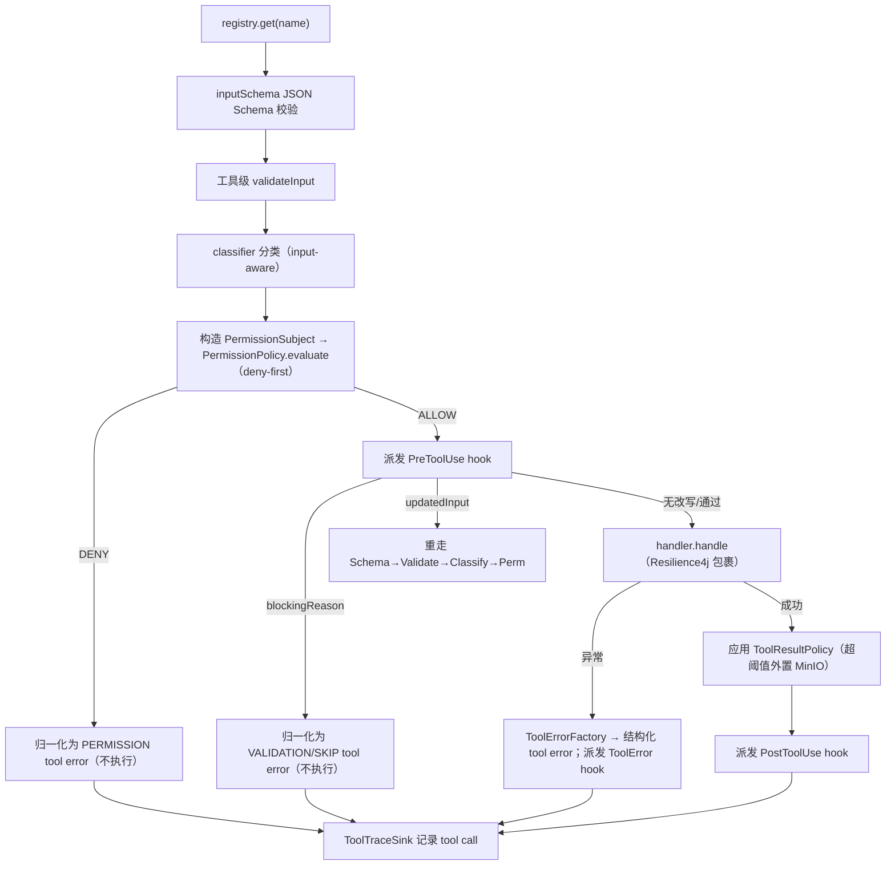

# tools —— 工具注册表与执行管线（Wave 3 横切组合）

> 本文是 PixFlow 完整重写阶段 `harness/tools` 模块的设计文档，对应 `design.md` 第五章 5.1「Execution Loop」/ 5.2「Tool Registry」、第六章「Agent 决策层」，以及 `module-dependency-dag-plan.md` 的 **Wave 3 横切组合**。
> 范围：Agent 级工具的注册表、可见集合单一来源、输入校验、分类、权限对接、Hook 接线、并发调度、结果预算、可观测接缝，以及本期确定的工具清单与 Plan 模式机制。
> 思路参考 `docs/references/tool-runtime-architecture.md`、`tool-design-guidelines.md`（Python/OneCode），但**仅借鉴「Descriptor 单一事实源 + 执行管线顺序 + 可见集合单一来源 + 结果预算」的理念，工具空间、安全模型、并发与类型契约全部以 Java 17 + Spring Boot 3 重新设计**。
> 本文对 `design.md §6.1` 工具清单做了重构（见 [二.3](#23-与-designmd-工具清单的偏离)）。2026-06-29 已将新工具口径同步回 `design.md`、`module/commerce.md`、`infra/permission.md` 等相关设计文档；本文件继续作为 tools 模块的详细设计口径。

---

## 目录

- [一、文档定位与设计原则](#一文档定位与设计原则)
- [二、与参考实现的本质差异](#二与参考实现的本质差异)
- [三、工具清单（本期）](#三工具清单本期)
- [四、模块结构与依赖位置](#四模块结构与依赖位置)
- [五、核心抽象](#五核心抽象)
- [六、执行管线](#六执行管线)
- [七、并发调度](#七并发调度)
- [八、权限对接](#八权限对接)
- [九、Hook 接线](#九hook-接线)
- [十、结果预算](#十结果预算)
- [十一、可观测接缝](#十一可观测接缝)
- [十二、Plan 模式机制](#十二plan-模式机制)
- [十三、可见集合单一来源与 prompt/schema 分离](#十三可见集合单一来源与-promptschema-分离)
- [十四、入参校验](#十四入参校验)
- [十五、错误处理](#十五错误处理)
- [十六、配置项](#十六配置项)
- [十七、测试策略](#十七测试策略)
- [十八、暂不考虑](#十八暂不考虑)
- [Revision Notes](#revision-notes)

---

## 一、文档定位与设计原则

`harness/tools` 在依赖 DAG 中处于 `{permission, hooks, storage} → tools → loop` 的位置（Wave 3）。它是 **Agent 级动作**的注册表与执行管线：把模型产出的工具调用，经「校验 → 分类 → 权限 → PreToolUse hook → handler → 结果预算 → 观察 hook → trace」串行 preflight 后执行，并把任意失败归一化为回填模型的结构化 tool error，绝不让主循环崩溃。

`tools` 专属设计原则：

1. **两套工具严格分离**。本 Registry 只管 **Agent 级动作**（`search` / `read` / `get_product_visual_facts` / `agent` / `submit_image_plan` / `submit_imagegen_plan` / `plan` / `plan_exit`）。DAG 内部的**像素工具**（`remove_bg` / `resize` / `compose_group` …）由 `module/dag` 执行引擎管理，**绝不进入本 Registry**（`design.md §5.2`）。
2. **工具集不直接执行用户副作用**。会产生像素处理、付费生图或任务的动作只请求发布已完整校验的 Proposal，由用户在 Conversation REST 边界逐项确认。系统没有确认令牌、challenge 或第二次确认。
3. **Descriptor 是工具的唯一事实来源**。模型可见 schema、prompt 片段、输入校验、并发分类都从 `ToolDescriptor` 或其派生结构读取，不散落在执行器里。
4. **可见集合单一来源**。LLM 可见 tool schema 与 system prompt 的工具说明来自同一个 `visibleDescriptors(context)`；被 deny / disabled / 隐藏（含 Plan 模式隐藏）的工具同时从两处消失。
5. **分类 input-aware**。只读性、并发安全、Plan 模式准入、权限主体都基于**本次调用输入**判断；分类失败 fail-closed（按非只读、不可并发、需鉴权处理）。
6. **安全边界在 permission，不在本层文案**。执行器只负责把分类翻译成 `PermissionSubject` 交 `PermissionPolicy.evaluate`，并尊重其 deny；它不自行发明权限规则。
7. **handler 倒置归属业务模块**。`harness/tools` 只定义 SPI（`ToolDescriptor` / `ToolHandler` 等纯形状），具体工具实现放各自业务模块并以 Spring bean 贡献，Registry 自动收集；本模块对 `dag` / `commerce` / `vision` / `imagegen` 等**零编译依赖**（见 [四](#四模块结构与依赖位置)）。
8. **结果预算治理在执行器统一做**。超阈值结果外置 MinIO（`infra/storage`），模型只见引用 + 预览；handler 不各自手写大结果处理。
9. **零观测依赖**。本模块不依赖 `harness/eval`；tool-call trace 经一个极薄的 `ToolTraceSink` SPI 倒置出去，由 app / loop 接线 eval 实现（honor 依赖 DAG 中 `tools` 无 `→ eval` 边）。

---

## 二、与参考实现的本质差异

### 2.1 参考实现的形态

OneCode 的 tool runtime 是**围绕文件系统工具**建的编码 Agent runtime：`ToolTarget(kind=file/directory/glob)` 抽象、guard 路径校验、`FileStateCache` 防写竞态、相邻 read-only 调用并发分批、`ToolResultPolicy` 结果预算、deny-first permission。工具空间开放（含 `bash` 任意命令），所以 guard / 路径规范化 / 可疑路径检测占了一大半复杂度。

### 2.2 PixFlow 的本质差异

PixFlow 的 Agent 级工具是一组**粗粒度、固定、领域化的决策动作**，不碰文件系统、没有路径资源。差异点：

| 维度 | OneCode（参考） | PixFlow（本模块） |
|---|---|---|
| 工具空间 | 开放（含 bash、文件读写、glob…） | 固定 7 个领域动作，无任意命令/文件工具 |
| 资源模型 | `ToolTarget`（file/directory/glob/command/url）+ guard 路径校验 | canonical `referenceKey/referenceKeys` + permission；无任意路径模型 |
| 文件竞态 | `FileStateCache` 防 write 竞态、生成 diff | **不需要**（无文件工具） |
| 权限输入 | 由 targets 推导 + 路径规则匹配 | 由分类构造 `PermissionSubject`（toolName/readOnly/...），对接已落地的 `DefaultPermissionPolicy` |
| 副作用闸门 | 工具直接执行真实副作用 | 会产生后果的动作只能发布已校验 Proposal；确认后由带外 REST 执行 |
| 令牌 | 无 | PixFlow 同样无确认令牌；`proposalId` 是任务幂等业务身份 |
| 并发 | asyncio Semaphore + gather | Java 有界线程池 + `CompletableFuture`，相邻并发候选分批 |
| schema 校验 | JSON Schema 子集 + 工具级 validate | networknt JSON Schema + 工具级 `validateInput` + handler 兜底 |
| 可观测 | executor 持 `TraceRecorder` 直记 | executor 经 `ToolTraceSink` SPI 倒置记录，不依赖 eval |
| 异常归一化 | 转 `ToolExecutionResult(is_error=True)` | 经 `common` 归一化为 tool error（`ErrorCategory` + `RecoveryHint`） |

**可借鉴的结构骨架**：Descriptor 单一事实源、执行管线固定顺序、可见集合单一来源、PreToolUse 改写后重校验、结果预算外置、工具异常不崩主循环。
**必须重写或删除的内核**：`ToolTarget` / guard / 路径模型（删除）、`FileStateCache`（删除）、并发模型（Java 化）、权限输入构造（对接 `PermissionSubject`）、令牌（移出工具层）、可观测责任（上移）。

### 2.3 与 design.md 工具清单的偏离

`design.md §6.1` 原列的 Agent 动作是 `query_commerce_data / compile_dag / submit_dag / run_vision_subagent / run_imagegen_subagent`。本文据后续设计讨论重构为下表，并已同步回相关设计文档：

| design.md 现状 | 本文 | 偏离说明 |
|---|---|---|
| `query_commerce_data` | `search` + `read` | 拆成「发现候选」与「精读单 SKU」两步；`read` 以 `include=["data"]` 控制是否读电商指标 |
| `compile_dag` + `submit_dag` | `submit_image_plan` | 合并：Agent 提交 `referenceKeys + DAG`；工具完成解析、校验、编译和 preflight 后发布 Proposal，**不执行** |
| `run_vision_subagent` | `get_product_visual_facts` | 取消通用视觉子 Agent；只读取/补偿持久化商品视觉事实 |
| `run_imagegen_subagent` | `submit_imagegen_plan` | 生图不直接执行：一个具体 IMAGE key 产生一个单图 Proposal，确认后带外执行 |
| —— | `agent`（type=explore） | 新增只读探索子 Agent |
| —— | `plan` / `plan_exit` | 新增 Plan 模式开关（`design.md` 无此概念） |

> 连带的非工具变更：上传后按 SKU 异步生成并持久化 Product Visual Facts，不再让 VLLM 抽取商品名/描述或写 `asset_copy`。`asset_copy` 仍是文档/用户提供的商品资料；视觉事实细节归 `module/vision`。

---

## 三、工具清单（本期）

本 Registry 在本期承载 8 个 Agent 级工具。所有命名为 snake_case，作为 registry key 与 provider-visible function name。

| name | 用途 | readOnly | concurrencySafe | Plan 模式可见 | handler 归属模块 |
|---|---|:---:|:---:|:---:|---|
| `search` | 按文本模糊检索商品目录，返回候选 SKU 列表 | 是 | 是 | 是 | `module/commerce` |
| `read` | 精读单个 SKU 的商品信息（`include=["data"]` 时附电商指标/历史） | 是 | 是 | 是 | `module/commerce` |
| `get_product_visual_facts` | 精确读取当前 SKU/目标图视觉事实；缺失时可完成内部补偿分析 | 是 | 是 | 是 | `module/vision` |
| `agent` | 运行只读探索子 Agent（`type=explore`） | 是 | 是 | 是 | `agent` 层 runner |
| `submit_image_plan` | 对 canonical references 发布一条已校验确定性处理 Proposal（不执行） | 否 | 是 | 否 | `module/dag` |
| `submit_imagegen_plan` | 对一个具体 IMAGE reference 发布一条单图重绘 Proposal（不执行） | 否 | 是 | 否 | `module/imagegen` |
| `plan` | 进入 Plan 计划模式 | 控制 | 否 | 入口 | `agent` / `harness/loop` 接线 |
| `plan_exit` | 退出 Plan 计划模式（可附带提交草拟计划供用户审阅） | 控制 | 否 | 是（必须可见） | `agent` / `harness/loop` 接线 |

### 3.1 search

- **入参**：`query`（必填，模糊词）、可选 `limit`（默认如 10，上限受结果预算约束）。
- **行为**：对 `asset_copy` 的 `product_name` / `description`（FULLTEXT）+ `sku_id` 做模糊检索，返回候选列表（每项含 `sku_id` + 名称 + 短描述摘要），供 Agent 判断该精读哪个。
- **不返回**电商指标（数字不适合模糊匹配，且控制上下文体积）；要看指标走 `read`。
- 只读、可并发、Plan 模式可见。

### 3.2 read

- **入参**：`sku_id`（必填）、可选 `include`（字符串数组；当前唯一可选值 `"data"`）。
- **行为**：默认只读 `asset_copy`（名称 / 关键词 / 描述）；`include=["data"]` 时再 join `commerce_data`（曝光 / 点击率 / 加购率 / 购买率）与 `sku_history`。
- 「无 `data` 不读指标」是刻意的上下文经济设计：默认精读不拉数字，需要数据支撑时显式索取。
- 只读、可并发、Plan 模式可见。

### 3.3 agent

- **入参**：`type`（本期唯一值 `explore`）、`prompt`（交给子 Agent 的任务描述）。
- **行为**：经统一 subagent runner（`design.md §10.3` 的「一个 `agent` 动作 + type 参数」边界）装配独立 child runtime，**只回最终总结 `ToolExecutionResult`**，child 中间消息不写回父链（参考 `subagent-architecture.md` 的装配与裁剪思路）。
- `explore` 搜索关联 SKU 及其数据，汇总情报回主 Agent；通用 `vision` type 已由持久化事实工具取代。
- child runtime 标记 read-only，由 permission 硬约束其工具集（递归 `agent` 禁用）。
- 只读、可并发、Plan 模式可见。
- **生图不在此 type 内**（见 [3.5](#35-submit_imagegen_plan)）：生图是带后果的提案动作，不放进只读 runner。

### 3.3.1 get_product_visual_facts

- **入参**：`referenceKey` 必填；工具声明允许的 PACKAGE/SKU/IMAGE 种类。
- **行为**：不传目标图时读取当前 SKU Visual Snapshot；传目标图时同时确保该图片的 Image Visual Snapshot 可用。当前事实缺失时，handler 可在 `module/vision` 的同一工作项、Redisson 锁、MySQL epoch 与 provider-attempt 预算下完成补偿分析。
- **结果**：`AVAILABLE` 返回结构化事实/限制/冲突；`ANALYSIS_PENDING` 表示已有 owner 正在分析；`UNAVAILABLE` 表示无图、预算耗尽或终态失败。历史输入指纹的事实不作为当前结果返回。
- **强制调用规则**：主 Agent 生成任何依赖商品外观的营销文案、描述、比较或 YAML 重绘 Prompt 前必须调用本工具；不可用时不得编造外观断言。
- 只读、可并发、Plan 模式可见。其内部补偿不是用户域副作用，也不绕过 provider 额度与持久化执行边界。

### 3.4 submit_image_plan

- **入参**：`referenceKeys`（1..20 个 backend-produced canonical keys）、`dag`（nodes/edges，节点 `tool` 仅限像素工具白名单）、可选 `note`。
- **行为**：后端解析并展开 references、按 `(packageId,imageId)` 去重，然后完成 `DagValidator`、compile、permission/readiness 和 GroupPreflight。任何错误都回到当前 Agent 回合；全部成功才由 Conversation 分配 `proposalId` 并发出 `proposal_ready`。
- **不执行/不持久化**：实际处理由用户确认触发；pending Proposal 只在 active runtime 和当前 SPA 页面存在。
- 多变体并行：白底一条、蓝底一条 = 两次工具调用（可并发）；有序步骤（蓝底→压缩）放同一条 `dag` 的 edges。
- 非只读、可并发、Plan 模式**不可见**。

### 3.5 submit_imagegen_plan

- **入参**：单个具体 IMAGE `referenceKey`、`prompt`、可选 `params/note`。
- **行为**：解析并校验源图、权限、readiness、提示词和参数后发布一个 Proposal。**不直接调生图模型**。一个 Proposal/任务只生成一张图；单个 Agent 回合最多发布 20 个。
- 与 `submit_image_plan` 对称：两条产图路径（确定性 / 生成式）都走 propose → confirm → execute，工具层都不扣扳机。
- 非只读、可并发、Plan 模式**不可见**。

### 3.6 plan / plan_exit

- `plan`：进入 Plan 计划模式（详见 [十二](#十二plan-模式机制)）。进入后只读工具可用，带后果工具被硬 deny 且从可见集隐藏，system prompt 切入「写作计划」section。
- `plan_exit`：退出 Plan 模式，恢复常规可见集与 prompt；可附带把草拟的计划交用户审阅。
- 二者是控制动作：`plan` 在 Plan 模式中无意义（隐藏），`plan_exit` 在 Plan 模式中**必须可见**（否则无法退出）。

---

## 四、模块结构与依赖位置

源码包：`com.pixflow.harness.tools`（与仓库根包 `com.pixflow` 对齐；物理位置见 `design.md` 第十二章 `harness/tools/`）。

```
harness/tools/
├── ToolDescriptor.java          # 工具唯一事实源（name/description/inputSchema/outputSchema/prompt/handler/...）
├── ToolHandler.java             # handler SPI：业务模块实现，Registry 收集
├── ToolInvocation.java          # 单次调用上下文（已校验入参 + 标识 + RuntimeScope）
├── ToolCallClassification.java  # input-aware 分类（readOnly/concurrencySafe/permission 视图/resultPolicy）
├── ToolResultPolicy.java        # 结果预算策略（阈值/外置/预览）
├── ToolExecutionResult.java     # 归一化工具结果（content/error/metadata）
├── ToolRegistry.java            # 注册/排序/可见集合/导出 schema 与 prompt（接口）
├── DefaultToolRegistry.java     # Spring bean 收集实现
├── ToolExecutor.java            # 执行管线入口（接口）
├── RegistryToolExecutor.java    # 完整管线 + 并发调度 + 结果预算 + hook/permission 接线实现
├── classify/
│   └── ClassificationResult.java # 分类产物（含拟构造的 PermissionSubject 输入字段）
├── result/
│   ├── ToolResultStorage.java    # 大结果外置 SPI（默认实现走 infra/storage）
│   └── ToolTraceSink.java        # 可观测倒置 SPI（默认 no-op；app/loop 接 eval）
├── schema/
│   └── ToolSchemaExporter.java   # descriptor → provider tool schema（对接 infra/ai 的工具调用抽象）
├── plan/
│   └── PlanModeView.java         # Plan 模式只读视图（executor 读，用于可见集与分类门控）
├── config/
│   ├── ToolsProperties.java
│   └── ToolsAutoConfiguration.java
└── error/
    └── ToolErrorFactory.java     # 把各类失败经 common 归一化为结构化 tool error
```

依赖方向：

```
tools ──► common（ErrorCode / PixFlowException / ToolErrorRenderer：失败归一化）
tools ──► permission（构造 PermissionSubject，调 PermissionPolicy.evaluate / isToolVisible）
tools ──► hooks（在 permission 之后派发 PreToolUse/PostToolUse/ToolError）
tools ──► infra/storage（ToolResultStorage 默认实现：大结果外置 tool-results 桶）
loop  ──► tools（主循环编排工具调用）
business modules（dag/commerce/vision/imagegen/agent）──► tools（实现 ToolHandler + 贡献 ToolDescriptor bean）
```

**关键倒置**：`harness/tools` 对 `dag` / `commerce` / `vision` / `imagegen` 等业务模块**零编译依赖**。具体工具在各自模块实现 `ToolHandler` 并把 `ToolDescriptor` 暴露为 `@Bean`；`DefaultToolRegistry` 注入 `List<ToolDescriptor>` 自动收集。这与 `common` 的 `ErrorRecorder` / `ProgressNotifier` 倒置接缝同构。

**不依赖项**：
- **不依赖 confirmation contracts**：这些类型已从目标设计删除。
- **不依赖 `harness/eval`**：trace 经 `ToolTraceSink` SPI 倒置（见 [十一](#十一可观测接缝)）。
- **不依赖任何 DAG/像素工具类型**：`submit_image_plan` 的 `dag` 入参在本层只是不透明 JSON/Map，校验委托给 `module/dag` 的 handler，本层不理解 DAG 语义。

---

## 五、核心抽象

### 5.1 ToolDescriptor —— 工具唯一事实源

```java
public record ToolDescriptor(
    String name,                       // snake_case，registry key 与 provider function name
    String description,                // 进 provider schema 的一句话短描述
    Map<String, Object> inputSchema,   // JSON Schema（object，关闭多余 additionalProperties）
    Map<String, Object> outputSchema,  // 内部结果对象 schema
    String prompt,                     // system prompt 用法片段（与 description 分层）
    boolean readOnlyHint,              // 静态粗粒度只读提示，仅用于可见集计算（Plan 模式）
    ToolHandler handler,
    ToolClassifier classifier,         // input-aware 分类器；缺省 fail-closed
    ToolInputValidator validator       // 可选：JSON Schema 之外的工具级值校验
) {}
```

- `readOnlyHint` 是**静态**粗粒度提示，仅供「可见集 / Plan 模式隐藏」这类无具体入参时的判断；**执行期的真实只读判定以 `classifier` 的 input-aware 结果为准**（见 [八](#八权限对接)、[十二](#十二plan-模式机制)）。两者职责不同，不矛盾。
- `description`（provider schema 短描述）与 `prompt`（system prompt 使用规则）严格分层，对应 `tool-design-guidelines.md` 的分离约定。

### 5.2 ToolHandler / ToolInvocation —— 执行 SPI

```java
public interface ToolHandler {
    ToolHandlerOutput handle(ToolInvocation invocation);
}

public record ToolInvocation(
    String toolCallId,
    String toolName,
    Map<String, Object> arguments,   // 已过 schema + 工具级校验、可能被 PreToolUse 改写后的入参
    String conversationId,
    Integer turnNo,
    String traceId,
    RuntimeScope runtime             // 主/子 Agent 作用域（复用 hooks 的 RuntimeScope 语义）
) {}
```

- handler **保持纯净**：只消费已校验入参、产出原始结果（content + metadata + data）；不直接改主循环状态、不自行外置大结果、不写 trace——这些由执行器统一负责（executor-owned side effects 的精神，但 PixFlow 无文件副作用，故仅保留结果预算与 trace 两类）。
- `ToolHandlerOutput` 是 handler 的原始产物，执行器据 `ToolResultPolicy` 包装成 `ToolExecutionResult`。

### 5.3 ToolCallClassification —— input-aware 分类

```java
public record ToolCallClassification(
    boolean readOnly,
    boolean concurrencySafe,
    ToolResultPolicy resultPolicy,
    PermissionInputs permissionInputs   // 构造 PermissionSubject 所需的域字段
) {}

// 构造 permission.PermissionSubject 的最小输入（tools 不直接 new PermissionSubject，
// 由 executor 在 permission 接线处组装，避免把 permission 细节散进各 classifier）
public record PermissionInputs(
    boolean readOnly,
    List<String> referenceKeys,
    Map<String, Object> subjectMetadata
) {}
```

- 分类**基于本次输入**：`agent` 只接受 `type=explore` 且恒为只读；`get_product_visual_facts` 是只读事实获取（内部补偿仍受独立 provider 边界控制）；`read` 恒只读；`submit_*_plan` 恒非只读。
- **fail-closed 默认**：`classifier` 抛异常或缺失 → 按 `readOnly=false`、`concurrencySafe=false` 处理，且权限按需鉴权。
- `ToolCallClassification` 不再包含 `confirmationAction` 或 token 字段。Proposal publication 作为明确的非只读 action subject 进入 permission。

### 5.4 ToolResultPolicy / ToolExecutionResult

```java
public record ToolResultPolicy(
    int maxResultSizeChars,      // 默认 50_000
    boolean persistWhenExceeded, // 默认 true
    int previewChars             // 默认 4_000
) {}

public record ToolExecutionResult(
    String toolCallId,
    String toolName,
    String content,              // 模型可见文本（或外置后的引用 + 预览）
    boolean error,
    Map<String, Object> metadata // result_truncated / original_size / stored ref / 错误分类 等
) {}
```

### 5.5 ToolRegistry / ToolExecutor

```java
public interface ToolRegistry {
    Optional<ToolDescriptor> get(String name);
    List<ToolDescriptor> visibleDescriptors(ToolVisibilityContext context); // schema 与 prompt 的共同入口
    List<Map<String, Object>> toolSchemas(ToolVisibilityContext context);
    List<String> toolPromptSections(ToolVisibilityContext context);
}

public interface ToolExecutor {
    List<ToolExecutionResult> execute(List<ToolCall> calls, ToolExecutionContext context);
}
```

`ToolVisibilityContext` 携带 `PermissionContext`（驱动 `isToolVisible`）+ Plan 模式视图 + runtime 上 disabled/denied/hidden 集合。`visibleDescriptors` 是 schema 与 prompt 的**单一来源**（见 [十三](#十三可见集合单一来源与-promptschema-分离)）。

---

## 六、执行管线

`RegistryToolExecutor.execute` 对一批工具调用（provider 顺序）扫描、分批（见 [七](#七并发调度)），每个调用的 **preflight 始终串行**，顺序固定：



要点：

- **顺序固定**：lookup → schema → validate → classify → permission → PreToolUse → （改写则重走前置）→ handler → 结果预算 → PostToolUse/ToolError → trace。
- **permission deny 在 handler 前短路**，归一化为 `PERMISSION` 类 tool error（`recovery=TERMINATE`）。
- **PreToolUse 阻断**归一化为 `VALIDATION` 类（`recovery=SKIP`），与 permission 硬拒绝严格区分（`hooks.md §7.1`）。
- **改写必重校验**：PreToolUse 改写 `arguments` 后，必须重新 schema→validate→classify→permission；hook 不能借改写绕过 deny。
- **handler 异常不崩主循环**：经 `common` 的 `ToolErrorRenderer` 转结构化 tool error 回填模型，按 `RecoveryHint` 决定继续/终止（`common.md §6.2`）。失败策略（重试/跳过/终止）由分类 + Resilience4j 落地。

---

## 七、并发调度

本期**启用并发**（用户决策：现在就做）。Java 化的相邻分批策略：

- 扫描这批工具调用（provider 原始顺序），把**相邻**且并发候选的调用聚为一批。并发候选条件：descriptor 存在、schema/validate 通过、`classifier` 不抛异常且 `concurrencySafe == true`。
- **整批仍先串行 preflight**；若 preflight 后任一项 `concurrencySafe` 变 false，整批降级串行。
- handler 阶段用**有界线程池** + `ExecutorService.submit` 返回的 `Future`（`pixflow.tools.max-concurrency`，默认 8）并发执行；结果按 **provider 原始顺序** finalize 与输出。
- 非并发调用单独成批，串行执行。

`ToolExecutionContext` 必须显式携带同一 Agent 回合的 `CancellationToken`。执行器在每个 call 前、handler 前后以及 join 前后检查 token；并行 batch 注册 cancellation callback，对尚未完成的 `Future` 调 `cancel(true)`。`OperationCancelledException` 必须原样向上抛，不能落入通用 `catch (RuntimeException)` 后变成模型可见 tool error。`Future.cancel(true)` 和线程 interrupt 只是 best-effort，所有 HTTP、数据库和第三方 handler 仍必须配置自身 timeout。

典型：

```
[search, read, get_product_visual_facts, submit_image_plan(白底), submit_image_plan(蓝底)]
  → 批1: search, read, get_product_visual_facts  并发（只读）
  → 批2: submit_image_plan×2                 并发（Proposal 互相独立）
```

> `submit_image_plan` / `submit_imagegen_plan` 标 `concurrencySafe=true`：每条 Proposal 独立校验。同一 `toolCallId` 在 active Agent runtime 内只发布一次；这不是 durable pending-plan 幂等表。

---

## 八、权限对接

### 8.1 构造 PermissionSubject

执行器在 permission 步把分类翻译成 `PermissionSubject.ToolInvocation` 或 `PermissionSubject.ProposalPublication`：包含 tool name/read-only 分类、conversation identity、canonical `referenceKey/referenceKeys` 和由属主计算的 payload hash。它不传 packageId 占位、Agent 声称的所有权结果或确认字段。`PermissionContext` 由 loop 提供。

> 不使用哨兵 packageId。没有素材输入的工具构造普通 ToolInvocation；素材工具必须提供 canonical keys 并由后端 resolver 验证。

### 8.2 deny-first 与可见性

- `evaluate` 返回 `DENY` → handler 前短路，归一化为 `PERMISSION` tool error。
- `evaluate` 返回 `CONFIRM_REQUIRED` → 本期工具集零令牌，**正常路径不应出现**；若出现（如 permission 配置异常）按 deny 语义短路并记 trace，fail-closed。
- `isToolVisible(toolName, context)` 被 `visibleDescriptors` 消费：被 deny/disabled 的工具不进 schema/prompt（见 [十三](#十三可见集合单一来源与-promptschema-分离)）。

### 8.3 HITL 在带外，直接确认 Proposal

Agent 调 `submit_image_plan` / `submit_imagegen_plan` 只请求发布已校验 Proposal。真正执行由用户在前端逐项确认后，经 Conversation direct-confirm endpoint 触发。该端点重做权限、资源、hash 与 CAS 校验，并以 `proposalId` 创建任务；没有 challenge、确认令牌、随机 `Idempotency-Key` 或第二次确认。

---

## 九、Hook 接线

执行器是 `PreToolUse` / `PostToolUse` / `ToolError` 的调用方（`hooks.md §六、§八`）：

- **PreToolUse**：在 permission **之后**派发；permission `DENY` 已短路的调用**不触发** PreToolUse。`HookResult.blocked()` → 归一化为 `VALIDATION`/`SKIP` tool error 并跳过 handler；`HookResult.inputRewritten()` → 重走前置校验 + 重新授权（hook 不能借改写绕过 deny）。典型用途：DAG 参数异常检测（针对 `submit_image_plan` 的 `dag` 入参）、输入规范化。
- **PostToolUse**：handler 成功后派发，观察结果摘要（不含大字节）。
- **ToolError**：handler 异常后派发，payload 带 `resultSummary` 的错误分类。
- tool 事件 payload（`ToolUsePayload`）由执行器**适配填充**：`toolName` / `toolCallId` / `toolInput` / `PermissionDecision` 只读视图 / 结果摘要。执行器**不**把 `ToolDescriptor` / `ToolCallClassification` 泄露给 hooks（否则 `hooks → tools` 倒挂，`hooks.md §三` 约束）。

---

## 十、结果预算

- 超 `maxResultSizeChars`（默认 50KB）且 `persistWhenExceeded=true` 时，执行器经 `ToolResultStorage` 写入 `infra/storage` 的 tool-results 桶（`design.md §13.4` 的 `tool-results/{id}.txt`），模型只见**引用 + 预览**（默认前 4KB）。
- `metadata` 记 `result_truncated` / `original_size_chars` / `max_result_size_chars` / 外置引用（`ObjectRef`）。
- `search` 返回候选列表可能较大，应受预算约束；`read(include=["data"])` 同理。
- `ToolResultStorage` 是 SPI，默认实现注入 `infra/storage` 的 `ObjectStorage`；测试可注入内存替身。

---

## 十一、可观测接缝

- 执行器在每次调用结束（成功或失败）经 `ToolTraceSink` SPI 记录一条 tool-call trace：`toolName` / `toolCallId` / 开始结束时间 / 是否 error / 错误分类 / 是否改写 / 结果是否外置。
- `ToolTraceSink` **默认 no-op**；`pixflow-app` 或 `agent` 接线层提供适配实现，把它桥接到 `harness/eval` 的 `TurnTrace.recordToolCall`。
- 如此 `harness/tools` 保持对 `harness/eval` 零编译依赖，honor 依赖 DAG（`tools` 无 `→ eval` 边），与 `hooks.md §9.3` 的「可观测责任上移」一致。
- Micrometer 指标 `pixflow.tool.exec{tool, error}` 由 sink 实现侧补充。

---

## 十二、Plan 模式机制

Plan 模式让 Agent 进入「只读 + 写作计划」状态，用于多步骤复杂任务（数据分析计划 / 多批次处理计划 / 优化迭代计划 / 报告生成计划）。它由 `plan` / `plan_exit` 工具开关，但**模式的效果靠 permission + prompt + 可见集三层强制，不靠工具 handler 自身**。

### 12.1 状态归属

Plan 模式是**会话级运行时状态**，归属 `harness/loop` / session，不归 tools。`plan` / `plan_exit` 的 handler 仅通过一个 `PlanModeController` SPI（loop 实现）置位/清除该标志；executor 与 prompt 组装每回合**读取**该标志。tools 自身不持久化 Plan 状态。

### 12.2 三层强制

1. **可见集（UX）**：Plan 模式下，`visibleDescriptors` 用 `readOnlyHint==false` 过滤掉带后果工具（`submit_image_plan` / `submit_imagegen_plan`），它们不进 schema/prompt——模型根本看不到。`plan_exit` 必须保持可见。
2. **permission（权威执行边界）**：即使模型凭历史幻觉出一个被隐藏工具的调用，executor 在分类后构造的 `PermissionSubject` 进入 permission，Plan 模式约束（类比参考实现的 `read_only_agent`）对 `readOnly==false` 的调用**硬 deny**。这是基于 input-aware 分类的真实判定，权威。
3. **prompt（行为引导）**：Plan 模式切入专门的 system prompt section（`design.md §6.2` 动态 section），明确「你在写作计划，只能调研与规划，不产生副作用」。这是引导，不替代前两层。

> 可见集用静态 `readOnlyHint`（无具体入参时的粗判），执行用 input-aware 分类（权威）——两者职责分离，见 [5.1](#51-tooldescriptor-工具唯一事实源)。

### 12.3 Plan 模式下的可用工具

- 允许：`search`、`read`、`get_product_visual_facts`、`agent(explore)`、`plan_exit`。
- 禁止（隐藏 + 硬 deny）：`submit_image_plan`、`submit_imagegen_plan`、`plan`（已在模式内，无意义）。

### 12.4 退出

`plan_exit` 清除标志、恢复常规可见集与 prompt，可把草拟的计划文本作为结果交用户审阅（具体「计划产物如何呈现」属 `agent` / 前端，本文不约束）。

> permission 模块需要新增「Plan 模式约束」的判定（与 `subagent` 约束并列）。这是本文向 `permission` 提出的接口扩展建议，落地时在 `permission.md` 同步。

---

## 十三、可见集合单一来源与 prompt/schema 分离

- `visibleDescriptors(context)` 是 LLM 可见 tool schema 与 system prompt 工具说明的**唯一共同入口**（参考 `prompt-architecture.md` 的「单一可见工具视图」）。
- 可见性来源叠加：构造期 `disabledTools`/`deniedTools` + `PermissionContext` 的 deny/disable + `PermissionPolicy.isToolVisible` + Plan 模式 `readOnlyHint` 过滤 + runtime `hiddenTools`。
- 被隐藏/禁用/拒绝的工具**同时**从 `toolSchemas` 与 `toolPromptSections` 消失，不会出现「prompt 说有、schema 没有」或反之的割裂。
- **schema 导出对接 infra/ai**：`ToolSchemaExporter` 把 `ToolDescriptor` 投影为 `infra/ai` 工具调用抽象所需的 schema 形态（Spring AI 的工具/函数定义）。本层只产出 provider-neutral schema，wire format 由 `infra/ai` 适配。
- **prompt 分层**：`description`（schema 短描述）vs `prompt`（用法规则）；后者由各工具提供，assembler 汇总，遵循 `tool-design-guidelines.md` 的工具 prompt 风格（英文、不写实现边界词、不重复 schema 字段、写清失败恢复）。

---

## 十四、入参校验

三层校验（用户决策：用 JSON Schema）：

1. **执行器 JSON Schema 校验**：用 networknt json-schema-validator 按 `inputSchema` 校验模型产出的 `arguments`。失败 → `invalid_tool_input` tool error，不调 handler。`inputSchema` 同时是导给 LLM 的 schema 来源，单一事实源。
2. **工具级 `validateInput`**：JSON Schema 表达不了的值规则（如 `read.include` 仅允许 `"data"`、`agent.type` 枚举、`submit_image_plan.dag` 的浅层形状）。失败 → 结构化 tool error。
3. **handler 内兜底**：handler 对关键不变量再做防御（如 `module/dag` 的 `DagValidator` 是 `submit_image_plan` 的深度校验，属 handler 内）。

> `submit_image_plan` 的 `dag` 在 tools 层只做「是合法 JSON object、含 nodes/edges 顶层键」的浅校验；**DAG 结构/白名单/无环等深度校验在 `module/dag` 的 handler 内**，tools 不理解 DAG 语义（保持零 DAG 依赖）。

---

## 十五、错误处理

所有失败形态都转成 `ToolExecutionResult(error=true)` 回填模型，不抛出主循环：

| 失败 | 归一化 category | recovery | 说明 |
|---|---|---|---|
| 未知工具 / schema 不合法 | `VALIDATION` | TERMINATE/SKIP | `invalid_tool_input`，不调 handler |
| 工具级 validate 失败 | `VALIDATION` | SKIP | 结构化错误回填 |
| 分类异常 | `INTERNAL` | SKIP | fail-closed：按非只读/不可并发处理 |
| permission DENY | `PERMISSION` | TERMINATE | 硬拒绝，不暴露内部细节 |
| PreToolUse 阻断 | `VALIDATION` | SKIP | 策略软挡，与 permission 硬拒严格区分 |
| handler 异常 | 由 `ErrorNormalizer` 判定（`TOOL`/`PROVIDER`/`STORAGE`/...） | 多为 SKIP | 经 `ToolErrorRenderer`，绝不泄露堆栈给模型 |

- 模型可见错误只含 `safeMessage` + 分类 + recovery，**不含堆栈/内部原文**（`common.md §6.2`）。
- 失败策略落地：分类 + Resilience4j（重试/熔断/限流）包裹 handler，针对调外部能力的工具（`agent[vision]`、确认后才执行的路径不在此）。

---

## 十六、配置项

```yaml
pixflow:
  tools:
    max-concurrency: 8            # handler 并发上限（有界线程池）
    result:
      max-size-chars: 50000       # 结果预算阈值
      persist-when-exceeded: true # 超阈值外置 MinIO
      preview-chars: 4000         # 外置后模型可见预览长度
```

- 不提供工具的运行时热插拔；增删工具经 Spring bean 装配。
- 可见性/禁用经 `PermissionContext` 与构造期集合控制，非配置文件热更新。

---

## 十七、测试策略

对齐 `tool-design-guidelines.md` 的「新增工具必测项」，并补 PixFlow 专属：

- **Registry schema 投影**：`visibleDescriptors` 含正确 name/description/inputSchema；被 deny/disabled/Plan 隐藏的工具不出现在 `toolSchemas` 与 `toolPromptSections`（同时消失）。
- **schema 校验**：非法 JSON 形状返回 `invalid_tool_input`，不调 handler。
- **工具级 validate**：`read.include` 非法值、`agent.type` 越界、`submit_image_plan.dag` 缺 nodes/edges → 结构化 tool error。
- **分类 input-aware**：`get_product_visual_facts` / `agent(explore)` 只读、`submit_image_plan` 非只读；分类异常 fail-closed。
- **permission 短路**：DENY 不调 handler、归一化为 `PERMISSION`；工具分类和 subject 均不含 confirmation token 字段。
- **PreToolUse 改写重校验**：hook 改写 `arguments` 后重走 schema→validate→classify→permission；改写后被 deny 仍 deny。
- **PreToolUse 阻断**：归一化为 `VALIDATION`/`SKIP`，**绝不** `PERMISSION`。
- **handler 异常**：转 tool error 不逃出 executor；断言无堆栈泄露。
- **结果预算**：超阈值结果外置 `ToolResultStorage`，模型只见预览 + 引用；metadata 正确。
- **并发**：相邻 concurrency-safe 批并发执行、结果按 provider 顺序 finalize；非并发工具单独成批；批内任一变非并发则整批降级串行。
- **Plan 模式**：进入后带后果工具从可见集消失且 permission 硬 deny；`plan_exit` 始终可见；退出恢复常规可见集。
- **可观测倒置**：`ToolTraceSink` 默认 no-op 不报错；注入 fake sink 断言记录字段；断言 tools 不依赖 eval。
- **handler 倒置**：用 fake `ToolDescriptor` bean 验证 Registry 自动收集，断言 tools 对业务模块零编译依赖。

---

## 十八、暂不考虑

- **任意命令 / 文件系统工具**（bash、read_file 等）：PixFlow 工具空间固定，不引入开放工具，故无 `ToolTarget`/guard/`FileStateCache`。
- **确认令牌/challenge**：目标设计已删除；HITL 使用直接 Proposal 确认。
- **deferred tool search / search_hint**：本期工具仅 7 个，全量进 schema，无需延迟检索（参考实现的 `search_hint` 不引入）。
- **MCP 工具接入**：本期不接外部 MCP server，无 `external_service` target 与相关鉴权。
- **followup_messages / skill 工具**：参考实现的 inline skill followup 机制本期无对应需求。
- **工具的运行时热插拔 / 远程治理面**：增删经 bean 装配。
- **像素工具（DAG 内部）的任何建模**：明确归 `module/dag`，与本 Registry 物理隔离。

---

## Revision Notes

2026-06-29 / Kiro: 新增 `harness/tools` 设计文档。基于设计讨论确定本期 7 个 Agent 级工具（`search` / `read` / `agent` / `submit_image_plan` / `submit_imagegen_plan` / `plan` / `plan_exit`），确立「工具集零真实副作用、零令牌，HITL 移到带外确认 REST 边界」「handler 倒置归属业务模块、Registry bean 收集」「可观测经 `ToolTraceSink` SPI 倒置、不依赖 eval」「并发相邻分批」「JSON Schema 三层校验」「Plan 模式三层强制」等口径。本文对 `design.md §6.1` 工具清单做了重构（见 §2.3），并向 `permission` 提出两项接口微调建议：① `PermissionSubject.packageId/payloadHash` 对无包上下文工具放宽为可空；② 新增 Plan 模式约束（与 `subagent` 约束并列）。

2026-06-29 / Codex: 已将新工具清单与「工具层只提交提案、确认 REST 边界触发真实执行」口径同步回 `design.md`、`module/commerce.md`、`module/file.md`、`harness/hooks.md`、`infra/permission.md`、`infra/ai.md`、`infra/thirdparty.md`、`module-dependency-dag-plan.md` 与 `commerce-module-implementation-plan.md`。
