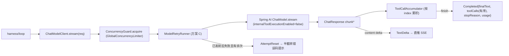
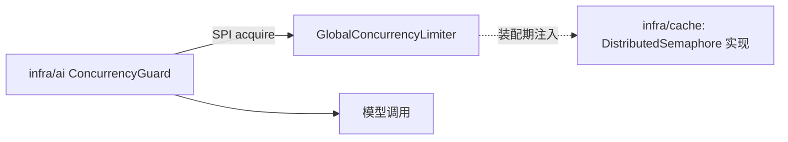

# infra/ai —— 模型调用层（Spring AI 封装，Wave 1 基础设施）

> 本文是 PixFlow 完整重写阶段 `infra/ai` 模块的设计文档，对应 `design.md` 第四章「技术栈选型」（Spring AI + Spring AI Alibaba）、第五章 §5.1「Execution Loop（手写循环，不依赖自动 function-calling）」、第十章「子 Agent 设计」、第十五章风险表，以及 `module-dependency-dag-plan.md` 的 **Wave 1 基础设施**。
> 范围：对模型供应商的**供应商无关调用抽象**——文本 chat（同步 + 真流式）、多模态、生图（源图重绘）、嵌入、重排，加模型路由、韧性重试、错误源头构造、全局并发封顶、用量与可观测。
> 本文不涉及 MVP 既有实现，从新架构需求重新推导，按生产级标准设计。两份参考实现（`docs/references/model-provider-architecture.md`、`cli-message-rendering-architecture.md`）仅借鉴**思路**（provider-neutral 事件、tool-call 分片累积、缓冲式重试取舍），不照搬其 Python 实现。

---

## 目录

- [一、文档定位与设计原则](#一文档定位与设计原则)
- [二、为什么 infra/ai 是「模型调用层」而非 Agent 层](#二为什么-infraai-是模型调用层而非-agent-层)
- [三、模块结构与依赖位置](#三模块结构与依赖位置)
- [四、模型路由：逻辑角色 → 供应商型号](#四模型路由逻辑角色--供应商型号)
- [五、核心抽象（能力隔离接口）](#五核心抽象能力隔离接口)
- [六、流式事件模型与 tool-call 累积](#六流式事件模型与-tool-call-累积)
- [七、韧性与重试：方案 C（首次发射为界）](#七韧性与重试方案-c首次发射为界)
- [八、错误归一化与源头构造](#八错误归一化与源头构造)
- [九、全局并发封顶：SPI 倒置](#九全局并发封顶spi-倒置)
- [十、多模态与生图边界](#十多模态与生图边界)
- [十一、嵌入与重排边界](#十一嵌入与重排边界)
- [十二、配置](#十二配置)
- [十三、可观测](#十三可观测)
- [十四、对其他模块的契约](#十四对其他模块的契约)
- [十五、测试策略](#十五测试策略)
- [十六、暂不考虑](#十六暂不考虑)

---

## 一、文档定位与设计原则

`infra/ai` 在依赖 DAG 中处于 **Wave 1**，只依赖 `common`，被 `module/memory`、`module/dag`、`module/vision`、`module/imagegen`、`module/rubrics` 直接消费，并经它们间接服务 `harness/loop` 与 `agent`。它承载对模型供应商的**纯调用原语**，和 `infra/storage` 封装 MinIO、`infra/mq` 封装 RocketMQ 是同一性质——把 Spring AI / Spring AI Alibaba 的调用细节收口成一组供应商无关、可替换的能力接口。

模块专属设计原则：

1. **只做调用层，不做 Agent 编排**。infra/ai 提供「单次模型调用」能力（chat / 多模态 / 生图 / 嵌入 / 重排）。think-act-observe 主循环、Prompt 组装、工具执行、上下文裁剪、子 Agent 编排**一律不在本模块**（见 [§二](#二为什么-infraai-是模型调用层而非-agent-层)）。
2. **手写循环，禁用自动 function-calling**。对齐 `design.md §5.1`：底层用 Spring AI 的 `ChatModel`，但**关闭其内部工具自动执行**（`internalToolExecutionEnabled=false`）。infra/ai 接收工具 schema、把模型返回的 tool-call 意图原样解析回传，**绝不自己执行工具、绝不自己续轮**。
3. **包住供应商类型，不向上泄漏**。请求/响应/流式事件全是 infra/ai 自有的不可变 record，对上不暴露 Spring AI 的 `Prompt`/`ChatResponse`/`Message`。这样 `design.md §15` 风险表的「必要时为个别能力直连 SDK」可在不惊动调用方的前提下落地。
4. **模型型号全部配置化**。逻辑角色（`PRIMARY_CHAT`/`VISION`/`IMAGEGEN`/`EMBEDDING`/`RERANK`）映射到 `provider + model + 默认参数`，由配置承载；换模型只动 YAML（见 [§四](#四模型路由逻辑角色--供应商型号)）。
5. **错误源头即构造**。按 `common.md §10` 的混合策略，模型调用的限流/网络/供应商/上下文超限错误**在源头即构造**带 `category` + `retryAfter` 的 `PixFlowException`（解析 `Retry-After`/限流头），让重试器尽早拿到 retryable 信息。这与 storage/cache「保留独立异常、边界再翻译」不同。
6. **真流式优先，重试不污染输出**。文本 chat 真流式直推 token；重试在「首次下游发射」为界做透明/可见两态处理（见 [§七](#七韧性与重试方案-c首次发射为界)），既低延迟又不把错乱半截推给前端。
7. **存储无感**。infra/ai 不依赖 `infra/storage`；多模态/生图的图片内容由调用方解析好（bytes / 预签名 URL / data-uri）再传入，本模块不碰 MinIO。
8. **向量库无感**。infra/ai 只做「文本 → 向量」的嵌入与「query+候选 → 重排」，Qdrant 读写检索归 `infra/vector`；不使用 Spring AI 把嵌入与存储耦合的 `VectorStore`（见 [§十一](#十一嵌入与重排边界)）。

---

## 二、为什么 infra/ai 是「模型调用层」而非 Agent 层

`design.md §5.1` 明确主循环是**手写显式循环**，目的是把 Tool Registry 执行管线、Hooks、Context Manager、权限拦截插入每一步。若把循环/续轮/工具执行塞进 infra/ai，依赖方向会倒挂（infra → harness）并架空主循环的可控性。因此边界这样切：

| 关注点 | 归属 | 说明 |
|---|---|---|
| 单次模型调用（chat/多模态/生图/嵌入/重排） | **infra/ai** | 供应商无关原语 |
| 流式 token 直推 + tool-call 分片累积成完整调用 | **infra/ai** | 供应商协议细节 |
| 模型调用的重试/退避/限流/熔断、错误归一化 | **infra/ai** | 与 retryable 判定强相关，源头处理最准 |
| think-act-observe 主循环、续轮判定、TurnStopped | `harness/loop` | `Completed.toolCalls` 是续轮唯一依据，但**判定动作**在 loop |
| 工具执行管线（schema 校验 / 分类 / 权限 / hook / handler） | `harness/tools` | infra/ai 只回传 tool-call 意图，不执行 |
| Prompt 组装 + section 缓存 | `agent` | infra/ai 接收已组装好的消息 |
| 上下文裁剪 / 压缩（jtokkit 预算、CONTEXT_LIMIT 后压缩重试） | `harness/context` | infra/ai 只如实抛 `CONTEXT_LIMIT`，不自行压缩 |
| `assistant_call_id` / `model_turn_index` 归属回链 | `harness/loop` | infra/ai 产出**无归属**纯事件，由 loop 打标 |
| tool result 有序提交 / scrollback commit / SSE 协调 | `harness/loop` + `module/conversation` | infra/ai 只保证 tool-call 按声明顺序输出 |

> 一句话：infra/ai 回答「调一次模型会发生什么」，不回答「Agent 这一轮该怎么走」。

---

## 三、模块结构与依赖位置

源码包：`com.pixflow.infra.ai`

```
infra/ai/
├── chat/
│   ├── ChatModelClient.java         # 文本 chat：call(阻塞) / stream(真流式)
│   ├── ChatRequest.java             # messages + toolSchemas + options（toolChoice 默认 AUTO）
│   ├── ChatResult.java              # finalText + toolCalls + stopReason + usage（阻塞结果）
│   ├── ChatStreamEvent.java         # sealed：TextDelta / AttemptReset / Completed
│   ├── ChatMessage.java             # 供应商无关消息（role + 文本/图片 part）
│   ├── ToolSchema.java              # 工具名 + JSON Schema（来自 harness/tools 的可见集合）
│   ├── ToolCall.java                # id + name + argumentsJson（原始 JSON 串）
│   ├── StopReason.java              # STOP / TOOL_CALLS / LENGTH / CONTENT_FILTER / OTHER
│   └── ToolCallAccumulator.java     # 跨 chunk 按 index 累积 tool-call 分片
├── vision/
│   ├── VisionModelClient.java       # 多模态 chat：文本 + 图片内容 → 结构化结果
│   └── VisionRequest.java
├── imagegen/
│   ├── ImageGenClient.java          # 源图重绘：源图 + 提示词 → 新图字节
│   ├── ImageGenRequest.java         # 必带源图（本期不做纯文生图）
│   └── ImageGenResult.java          # 生成图字节 + 元数据（调用方负责落 MinIO）
├── embedding/
│   ├── EmbeddingClient.java         # 文本 → 向量（批量）
│   └── EmbeddingResult.java
├── rerank/
│   ├── RerankClient.java            # query + 候选文档 → 重排序得分
│   └── RerankResult.java
├── model/
│   ├── ModelRole.java               # 逻辑角色枚举
│   ├── ModelRouter.java             # 角色 → 具体 provider/model/options 解析
│   └── TokenUsage.java              # promptTokens / completionTokens / totalTokens
├── resilience/
│   ├── ModelRetryRunner.java        # 方案 C：首次发射为界的透明/可见重试
│   ├── RetryPolicy.java             # max/base/cap/jitter + Retry-After 优先
│   └── ConcurrencyGuard.java        # 调用前经 GlobalConcurrencyLimiter 取许可
├── spi/
│   └── GlobalConcurrencyLimiter.java# SPI 倒置：infra/cache 提供 DistributedSemaphore 实现
├── error/
│   ├── AiErrorCode.java             # enum implements common.ErrorCode
│   └── ProviderErrorMapper.java     # 供应商异常/HTTP 状态 → 带 category+retryAfter 的 PixFlowException
├── config/
│   ├── AiProperties.java            # @ConfigurationProperties(pixflow.ai)
│   └── AiAutoConfiguration.java     # 装配各 provider 的 ChatModel/ImageModel/EmbeddingModel 等 bean
└── observability/
    └── AiMetrics.java               # Micrometer：latency / tokens / error / retry / 并发水位
```

依赖方向：

```
infra/ai ──► common（ErrorCode / PixFlowException / Sanitizer）
infra/ai ──► Spring AI + Spring AI Alibaba（DashScope：Qwen / Qwen-VL / 通义万相 / 嵌入）
infra/ai ──► Project Reactor（流式 Flux，随 Spring 引入）
infra/ai ──► (可选 SPI) GlobalConcurrencyLimiter ← infra/cache 提供实现（装配期注入）
module/{memory,dag,vision,imagegen,rubrics} ──► infra/ai
```

infra/ai **不依赖** `infra/cache`（全局并发经 SPI 倒置）、**不依赖** `infra/storage`（图片内容由调用方传入）、**不依赖** `infra/vector`（向量存取归 vector）、**不依赖任何 harness/module/agent**。

新增 Maven 依赖（版本由 Spring AI BOM 统一管理，此处不锁定具体版本，呼应 design「模型型号/能力由配置承载」）：

```xml
<!-- Spring AI 核心调用层 -->
<dependency>
    <groupId>org.springframework.ai</groupId>
    <artifactId>spring-ai-core</artifactId>
</dependency>
<!-- Spring AI Alibaba：DashScope（Qwen 文本 / Qwen-VL 多模态 / 通义万相生图 / 文本嵌入） -->
<dependency>
    <groupId>com.alibaba.cloud.ai</groupId>
    <artifactId>spring-ai-alibaba-starter-dashscope</artifactId>
</dependency>
```

> Spring AI 提供 `ChatModel`/`ImageModel`/`EmbeddingModel` 等模型抽象与 OpenAI 兼容/DashScope 适配；reranker 若 DashScope 未直供则由 `RerankClient` 实现侧直连对应能力 SDK（接口不变）。
---

## 四、模型路由：逻辑角色 → 供应商型号

调用方只声明**逻辑角色**，不写死型号；`ModelRouter` 据配置解析出具体 provider/model/默认参数。换模型、调参数、为某能力切供应商，都只动配置，调用方零改动（对齐 `design.md`「模型型号由配置承载」）。

```java
public enum ModelRole {
    PRIMARY_CHAT,   // 主 Agent 决策 / DAG 提案撰写 / rubrics 文本评估
    VISION,         // 视觉理解子 Agent（Qwen-VL 类）
    IMAGEGEN,       // 生图子 Agent（通义万相类，源图重绘）
    EMBEDDING,      // 记忆向量化（写 Qdrant 前的 text→vector）
    RERANK          // 记忆召回重排
}
```

- 每个角色在配置里绑定 `{ provider, model, options }`（温度、max-tokens、超时等默认值）。
- `ModelRouter` 返回的解析结果驱动选取对应的 Spring AI 模型 bean 与调用参数；`AiAutoConfiguration` 按配置装配各 provider bean。
- 角色与能力接口解耦：同一物理模型可被多个角色复用，反之一个角色未来也可按 A/B 配置切换型号。

---

## 五、核心抽象（能力隔离接口）

按消费者做**接口隔离**（同 `infra/cache` 把 Lock/Counter/Semaphore 分开的风格）：`memory` 只需 `EmbeddingClient`/`RerankClient`，`vision` 只需 `VisionModelClient`，谁都不必看见不相关能力，也便于「个别能力直连 SDK」时只替换一个实现。

### 5.1 ChatModelClient（文本，dag/loop/rubrics）

```java
public interface ChatModelClient {
    ChatResult call(ChatRequest req);                 // 阻塞：内部仍按 §七 重试
    Flux<ChatStreamEvent> stream(ChatRequest req);    // 真流式：TextDelta* → (AttemptReset*) → Completed
}

public record ChatRequest(
        ModelRole role,                 // 默认 PRIMARY_CHAT；rubrics 可显式指定
        List<ChatMessage> messages,     // 已由 agent 组装好的消息序列
        List<ToolSchema> toolSchemas,   // harness/tools 的可见工具集合；可空
        ToolChoice toolChoice,          // 默认 AUTO：模型自行决定是否调工具
        ChatOptions options             // 可空，覆盖角色默认参数
) {}

public record ChatResult(
        String finalText,
        List<ToolCall> toolCalls,       // 按模型声明顺序（index 升序）
        StopReason stopReason,
        TokenUsage usage
) {}
```

- **`toolChoice` 默认 `AUTO`**：本期不做强制 JSON / structured-output；Agent 可自主决定是否调用 `submit_image_plan` 等工具，DAG JSON 直接作为工具入参进入 tools 管线。
- 阻塞 `call` 内部把 `stream` 折叠成完整结果（同一套累积与重试逻辑），供不需要流式的场景（如 rubrics 评估）。

### 5.2 VisionModelClient（多模态，vision 子 Agent）

```java
public interface VisionModelClient {
    ChatResult call(VisionRequest req);   // 多模态走阻塞即可（抽样量小，design §10.1）
}

public record VisionRequest(
        List<ChatMessage> messages,       // 文本 part + 图片 part（图片内容由调用方解析好）
        ChatOptions options
) {}
```

`ChatMessage` 的图片 part 承载 **图片内容本身**（bytes / data-uri / 预签名 URL），不承载 MinIO 逻辑 key——infra/ai 不依赖 storage（见 [§十](#十多模态与生图边界)）。Chat 与 Vision 接口**分离**，但底层共享 `ChatMessage` 模型与同一套调用/累积实现。

### 5.3 ImageGenClient（生图，imagegen 子 Agent）

```java
public interface ImageGenClient {
    ImageGenResult generate(ImageGenRequest req);   // 源图 + 提示词 → 重绘新图
}

public record ImageGenRequest(
        byte[] sourceImage,               // 必填：本期只做源图重绘
        String sourceContentType,
        String prompt,                    // 由 agent 综合数据+记忆+用户要求撰写
        ChatOptions options
) {}

public record ImageGenResult(byte[] image, String contentType, TokenUsage usage) {}
```

- **只做源图重绘**，`sourceImage` 必填；本期不提供纯文生图（见 [§十六](#十六暂不考虑)）。
- HITL 确认令牌的硬拦截在 `permission`，与本模块无关——infra/ai 只在被调到时执行重绘，不判断是否被允许执行。
- 结果只回字节 + 元数据，**落 MinIO 由调用方**（`module/imagegen` 用 `StorageKeys.generated(...)`）。

### 5.4 EmbeddingClient / RerankClient（memory）

```java
public interface EmbeddingClient {
    EmbeddingResult embed(List<String> texts);        // 批量 text → 向量
}
public interface RerankClient {
    RerankResult rerank(String query, List<String> candidates);  // 召回重排
}
```

详见 [§十一](#十一嵌入与重排边界)。

---

## 六、流式事件模型与 tool-call 累积

借鉴 `model-provider-architecture.md` 的 provider-neutral 事件与「`message_completed.tool_calls` 是续轮唯一依据」，以及 tool-call 分片累积器思路；用 Java/Reactor 重做，并按 PixFlow 边界收敛（工具生命周期 UI 另有事件源，故不对上暴露 tool-call 分片）。

### 6.1 公共流式事件（sealed interface）

```java
public sealed interface ChatStreamEvent {
    // 可见文本增量，喂 SSE token 流式
    record TextDelta(String text, int blockIndex) implements ChatStreamEvent {}

    // 已发射文本后中途失败、且仍有重试次数时发出：下游把已显示半截定稿为错误码提示，随后接收新 attempt 的 TextDelta
    record AttemptReset(PixFlowException error, int nextAttempt, int retriesRemaining)
            implements ChatStreamEvent {}

    // 终态：主循环判定续轮 / TurnStopped 的【唯一】依据
    record Completed(String finalText,
                     List<ToolCall> toolCalls,   // 按模型声明顺序（index 升序）
                     StopReason stopReason,
                     TokenUsage usage) implements ChatStreamEvent {}
}
```

设计取舍：

- **不向上暴露 tool-call 分片事件**。参考的 `tool_call_delta` 是给 CLI 看的；PixFlow 前端的工具生命周期走 `harness/tools` 的 `tool_started/tool_progress/tool_result`（`design.md §5.2`），不靠模型原始分片。所以公共流只发 `TextDelta*`、（必要时）`AttemptReset*`、终态 `Completed`，**tool-call 累积完全在 ai 内部完成**。
- **`Completed.toolCalls` 非空 → 续轮；空 → TurnStopped**，对齐 `design.md §5.1`「无工具调用即 TurnStopped」。这是 ai 与 loop 之间唯一的续轮契约。
- **`argumentsJson` 保持原始 JSON 串**；ai 只保证「可解析为合法 JSON」，**不做 schema 校验**（那是 `harness/tools` 的事，ai 不认识工具 schema）。

### 6.2 ToolCallAccumulator（内部）

流式下 tool-call 分片按 `index` 到达：`id`/`name` 通常只在首片出现，`arguments` 以字符串增量到达（Qwen/DashScope 的 OpenAI 兼容流行为与参考一致）。累积器：

1. 以 `Map<Integer index, MutableToolCall>` 累积，`arguments` 做字符串拼接，**不依赖适配器是否已聚合**（为 provider 无关与健壮性，自己跨 chunk 累积）。
2. 收到 `finish_reason=tool_calls` 时，对每个累积项 `parse(argumentsJson)` 校验为合法 JSON；失败 → `AiErrorCode.INVALID_TOOL_ARGUMENTS`（category=PROVIDER）。
3. **按 `index` 升序**产出 `List<ToolCall>`。

> **顺序契约**：参考里「按声明顺序提交、不按完成时间」是 loop/UI 的提交约束，但源头的声明顺序必须由 ai 保证——ai 一定按 index 排序输出 `toolCalls`，下游（`harness/loop` + `module/conversation`）才能据此做有序提交与归属回链。

### 6.3 截断信号

`StopReason.LENGTH`（`finish_reason ∈ {length, max_tokens}`）如实暴露（类比参考的 `output_interrupted`）。**是否做 max-output 续写是 loop 的策略**，infra/ai 只给信号、不自行续写。

### 6.4 流式数据流



---

## 七、韧性与重试：方案 C（首次发射为界）

可重试错误按发生时机分两类，重试策略据此分流——既保留真流式低延迟，又不把错乱半截推给前端。

### 7.1 两类时机

| 时机 | 典型错误 | 是否已下游发射 | 处理 |
|---|---|---|---|
| **首个 `TextDelta` 之前** | 建连失败、握手期 429/5xx、TTFB 超时、`context_limit`(413) | 否 | **静默透明重试**（用户无感），生产中绝大多数可重试错误属此类 |
| **已发射 `TextDelta` 之后** | 生成中途断流、供应商中途 5xx | 是 | 发 `AttemptReset` 把半截定稿为错误码提示，**只要有余次就继续重试**新 attempt；耗尽才终态上抛 |

> 纯工具调用轮（如只提交 `submit_image_plan` 提案、无可见文本的「决策即行动」轮）整轮无可见 token，`emittedDownstream` 始终为 `false` → **失败可全程透明重试**，等价于自动缓冲。带可见文本的轮才可能走「已发射」分支。

### 7.2 ModelRetryRunner 机制

```java
public final class ModelRetryRunner {
    // 维护 emittedDownstream 标志（首个 TextDelta 发射时翻 true）
    // - 错误 && retryable && 有余次:
    //     · !emittedDownstream → 退避后重订阅新 attempt（下游无任何事件）
    //     · emittedDownstream  → 发 AttemptReset（携归一化错误 + 进度），重订阅新 attempt，
    //                             新 attempt 的 TextDelta 从空开始
    // - 错误 && !retryable                 → 直接终态上抛 PixFlowException
    // - 错误 && retryable && 次数耗尽       → RetryExhausted（terminal），上抛 cause
    // - 成功                                → 正常发 Completed
}
```

要点：

- **重试用同一份请求**（同一 `messages`/snapshot）：失败 attempt 的内容不进入下一 attempt 的模型上下文；模型上下文是否记录「中断 + 错误码提示」由 `harness/loop`/`module/conversation` 的 transcript 决定，**不在 ai 层**。infra/ai 只负责发 `AttemptReset` 信号。
- **`AttemptReset` 携带归一化后的 `PixFlowException`**（`code` + `safeMessage` + `traceId` + 重试进度），下游据此把已显示半截定稿为错误码提示行。
- **`CONTEXT_LIMIT` 不在本 runner 重试**：它天然在首 token 前（413/早期），归一化为 `category=CONTEXT_LIMIT`（`recovery=COMPACT`）直接上抛，交 `harness/context` 压缩后由 loop 重试一次（`common.md §6.2/§6.4`）。
- **退避策略**（`RetryPolicy`，借鉴参考默认值）：`maxRetries` 默认 10、`baseDelay` 0.5s、`maxDelay` 32s、`jitterRatio` 0.25；`delay = min(base·2^(n-1), cap) + jitter`；供应商给 `Retry-After` 时优先采用。
- **阻塞 `call`** 复用同一 runner：纯工具轮无可见输出，等价缓冲式重试；有文本则把 `AttemptReset`/`TextDelta` 折叠后返回最终 `ChatResult`。

### 7.3 与其他重试层的分工

infra/ai 的 `ModelRetryRunner` 负责**模型调用级**重试（NETWORK/RATE_LIMIT/PROVIDER）。它与 `infra/thirdparty` 的 Resilience4j（抠图 API 等非模型第三方）是不同模块、不同对象；与 `module/task` 的 MQ 重投（任务级）也不重叠。各层各管一段。

`ChatModelClient.stream` 是文本模型调用 retry 的唯一上行边界。`harness/loop` 与 `agent` 只调用并消费该 stream，不再注入、持有或外包 `ModelRetryRunner`；否则会把同一模型请求重复套 retry，导致等待时间和 SSE 协议状态被放大。

---

## 八、错误归一化与源头构造

按 `common.md §10` 混合策略，infra/ai **在源头即构造**带分类的 `PixFlowException`（不保留独立 `AiException` 到边界再翻译），因为重试器需尽早拿到 retryable 信息。`AiErrorCode implements common.ErrorCode`（仿 `MqErrorCode`）。

`ProviderErrorMapper` 把 Spring AI 异常 / HTTP 状态映射为分类（借鉴参考的 `provider_error_from_http_status`）：

| 供应商情形 | AiErrorCode | category | recovery | retryAfter |
|---|---|---|---|---|
| 429 / 限流 | `MODEL_RATE_LIMITED` | RATE_LIMIT | RETRY | 解析 `Retry-After` |
| 413 / 上下文超窗关键词 | `MODEL_CONTEXT_LIMIT` | CONTEXT_LIMIT | COMPACT | - |
| 连接失败 / 超时 | `MODEL_NETWORK_ERROR` | NETWORK | RETRY | - |
| 5xx / 非法响应 | `MODEL_PROVIDER_ERROR` | PROVIDER | RETRY | - |
| tool-call 参数非法 JSON | `INVALID_TOOL_ARGUMENTS` | PROVIDER | TERMINATE | - |
| 401/403 鉴权失败 | `MODEL_AUTH_ERROR` | PROVIDER | TERMINATE | - |

- 重试器据 `category`/`recovery` 决策：RATE_LIMIT/NETWORK/PROVIDER 可重试，CONTEXT_LIMIT 上抛压缩，鉴权/参数非法不重试。
- 落盘/对外文案前经 `common` 的 `Sanitizer` 脱敏（API key、AK/SK、Bearer 一律遮蔽）；**API key 禁止入日志**。
- 跨出 infra 边界已是 `PixFlowException`，`ErrorNormalizer` 直接透传（`common.md §5.5`）。

---

## 九、全局并发封顶：SPI 倒置

`design.md §9.3` 要求对生图/VLLM 等昂贵模型调用做跨实例并发封顶，但依赖图中 `infra/ai` 只依赖 `common`、不依赖 `infra/cache`。采用 **SPI 倒置**（同 `mq` 的 `ConsumerErrorHandler`、`permission` 的 `ConfirmationTokenStore` 手法）解决：

```java
// infra/ai 定义 SPI（不暗示任何实现介质）
public interface GlobalConcurrencyLimiter {
    Permit acquire(ModelRole role, Duration waitTime);   // 返回 AutoCloseable
    interface Permit extends AutoCloseable { @Override void close(); }
}
```

- `infra/cache` 提供实现，用 `DistributedSemaphore`（`RPermitExpirableSemaphore`，许可带租约、持有者崩溃自动回收）按角色/供应商封顶全局并发，装配期注入 infra/ai。
- `infra/ai` 调用前经 `ConcurrencyGuard` 取许可（try-with-resources 自动释放），**未注入实现时降级为不限并发**（开发/单测场景），不硬依赖 cache。
- 许可总数与各模型 API 全局上限对齐，由 `infra/cache` 侧配置（`cache.md §四`）。**单实例治理**（rate limiter/bulkhead）若需要，由 infra/ai 内部 Resilience4j 叠加；与全局信号量互补（`cache.md §十` 的分工）。



---

## 十、多模态与生图边界

- **infra/ai 不依赖 `infra/storage`**。`VisionRequest`/`ImageGenRequest` 接收的是**图片内容本身**（bytes / data-uri / 预签名 URL），由调用方先用 `ObjectStorage` 把 MinIO 引用解析好再传入。保持 ai 对存储无感、可独立测试。
- **生图只做源图重绘**：`ImageGenRequest.sourceImage` 必填，对齐确认决策；纯文生图本期不做。
- **生图结果落 MinIO 由调用方**：`ImageGenResult` 只回字节 + contentType，`module/imagegen` 负责 `put` 到 `GENERATED` 桶并写 `process_result`。
- **HITL 与本模块无关**：生图/重跑的确认令牌硬拦截在 `permission`；infra/ai 被调到即执行，不参与是否放行的判断。

---

## 十一、嵌入与重排边界

- **ai 只做「文本 → 向量」**（`EmbeddingClient`）和「query + 候选 → 重排序」（`RerankClient`）；**Qdrant 读写检索归 `infra/vector`**，`module/memory` 编排两者（向量化 → 写/检索 Qdrant → 重排）。
- **不使用 Spring AI 的 `VectorStore`**：该抽象把嵌入与存储耦合，与项目「`infra/vector` 独立成模块」的边界冲突。infra/ai 暴露裸嵌入能力，存储交给 vector，二者可分别替换。这是对 `design.md`「内置 Qdrant VectorStore」一处**有意收敛**，需与 design 对齐（建议后续在 design 标注：嵌入与向量存取分属 ai/vector 两模块）。
- **reranker**：DashScope 若直供则走其能力；否则 `RerankClient` 实现侧直连对应 SDK，接口不变。`module/memory` 召回「分析结论记忆」（Qdrant 语义召回）后可选重排提升精度。

---

## 十二、配置

`@ConfigurationProperties(prefix = "pixflow.ai")`：

```yaml
pixflow:
  ai:
    dashscope:
      api-key: ${DASHSCOPE_API_KEY:}     # 敏感：环境变量注入，禁止入日志
      base-url: https://dashscope.aliyuncs.com
    roles:                               # 逻辑角色 → 供应商/型号/默认参数（型号不锁死在代码）
      primary-chat: { provider: dashscope, model: ${AI_CHAT_MODEL:qwen-max}, temperature: 0.3, max-tokens: 4096 }
      vision:       { provider: dashscope, model: ${AI_VISION_MODEL:qwen-vl-max} }
      imagegen:     { provider: dashscope, model: ${AI_IMAGEGEN_MODEL:wanx-v1} }
      embedding:    { provider: dashscope, model: ${AI_EMBED_MODEL:text-embedding-v3} }
      rerank:       { provider: dashscope, model: ${AI_RERANK_MODEL:gte-rerank} }
    retry:
      max-retries: 10
      base-delay: 500ms
      max-delay: 32s
      jitter-ratio: 0.25
    timeout: 60s                         # 单次调用超时
    concurrency:                         # 全局并发上限（经 GlobalConcurrencyLimiter 落到 cache 信号量）
      imagegen: 4
      vision: 8
      primary-chat: 16
```

- 型号全部走配置/环境变量，**代码不锁死具体型号**（design 约定）。
- `api-key` 经 `Sanitizer` 遮蔽，不入日志、不入 trace、不进 LLM 可见区。

---

## 十三、可观测

- **Micrometer 指标**：`pixflow.ai.call{role, provider, capability, result=ok|error}` 计数与延迟计时；`pixflow.ai.tokens{role, type=prompt|completion}` 用量；`pixflow.ai.retry{role, reason}` 重试次数；`pixflow.ai.concurrency{role}` 在途许可 gauge。
- **不放高基数 tag**（如 conversationId）；按 role/provider/capability 聚合。
- **用量来源**：infra/ai 只从供应商响应**回传真实用量**（`TokenUsage`）放进结果，供 `harness/eval` / 计费观测；**调用前 token 估算（jtokkit）归 `harness/context`**，ai 不做，避免职责重叠。
- **原始 input/output 不在 ai 落库**：那是 loop 的 `ContextSnapshot` + `harness/eval` 的 `agent_trace` 职责，ai 只暴露调用元数据与用量。
- **traceId**：模型调用是同步链路，Micrometer Tracing 自动覆盖，无需像 `infra/mq` 那样手动透传。

---

## 十四、对其他模块的契约

| 模块 | 契约 |
|---|---|
| `common` | ai 源头构造带 `category`+`retryAfter` 的 `PixFlowException`；`AiErrorCode implements ErrorCode`；文案经 `Sanitizer` |
| `harness/loop` | 消费 `ChatModelClient.stream`；`Completed.toolCalls` 是续轮唯一依据；自行分配 `assistant_call_id`/`model_turn_index` 并打标；解释 `AttemptReset`/`StopReason.LENGTH` |
| `harness/context` | 接收 `CONTEXT_LIMIT` 上抛后压缩并触发重试；调用前 token 估算在 context，不在 ai |
| `harness/tools` | 提供 `ToolSchema` 可见集合；ai 回传的 `ToolCall.argumentsJson` 由 tools 做 schema 校验与执行 |
| `module/dag` | 提供 `DagValidator` 与执行引擎；Agent 通过 `ChatModelClient` 产出的 DAG JSON 会作为 `submit_image_plan` 入参进入 tools 管线，ai 不理解 DAG 语义 |
| `module/vision` | 经 `VisionModelClient` 传入已解析图片内容；ai 不碰 MinIO |
| `module/imagegen` | 经 `ImageGenClient` 源图重绘；结果字节由 imagegen 落 `GENERATED` 桶；HITL 令牌在 permission |
| `module/memory` | 经 `EmbeddingClient` 向量化、`RerankClient` 重排；Qdrant 存取走 `infra/vector` |
| `module/rubrics` | 经 `ChatModelClient`/`VisionModelClient` 做文案/图片质量评估（指定对应 role） |
| `infra/cache` | 提供 `GlobalConcurrencyLimiter` 实现（`DistributedSemaphore`），装配期注入；ai 不反向依赖 cache |
| `infra/vector` | 分工：ai 出向量，vector 存取检索；不使用 Spring AI 耦合 `VectorStore` |

**反向约束**：infra/ai 对 harness/module/agent 零依赖；对 cache/storage/vector 零硬依赖（cache 经 SPI 倒置，storage/vector 由调用方/分工规避）。

---

## 十五、测试策略

- **流式累积单测**：以伪造的 chunk 序列（含分片 tool-call：`id`/`name` 首片、`arguments` 多片）驱动 `ToolCallAccumulator`，断言按 index 有序、`arguments` 拼接正确、合法 JSON 校验、非法 JSON → `INVALID_TOOL_ARGUMENTS`。
- **方案 C 重试单测**（核心）：
  - 首 token 前失败 + 可重试 → 下游**无任何事件**，透明重试后成功。
  - 已发射 TextDelta 后失败 + 有余次 → 发 `AttemptReset`（携错误码 + 进度），新 attempt 重新流式，最终成功。
  - 纯工具轮（无 TextDelta）中途失败 → 全程透明重试。
  - 不可重试（鉴权/参数非法）→ 直接终态上抛，无重试。
  - 次数耗尽 → `RetryExhausted` 上抛 cause。
  - `Retry-After` 优先于退避公式。
- **错误映射单测**：429/413/5xx/超时/鉴权 → 对应 `AiErrorCode` + category + recovery + retryAfter。
- **CONTEXT_LIMIT**：断言不在 runner 内重试、归一化为 COMPACT 上抛。
- **能力接口契约**：`ChatModelClient`/`VisionModelClient`/`ImageGenClient`/`EmbeddingClient`/`RerankClient` 以 fake provider 替身验证请求投影与结果映射（无需真实模型）。
- **并发 SPI**：注入 fake `GlobalConcurrencyLimiter` 断言取/释许可；未注入时降级为不限并发可正常调用。
- **脱敏**：含 API key 的异常/日志样本经 `Sanitizer` 后无凭证泄露。
- **toolChoice=AUTO**：断言不强制工具、模型可自然结束（空 `toolCalls` → 由 loop 判 TurnStopped）。
- **集成（可选，按环境跳过）**：对真实 DashScope 端点跑一次 chat/vision/embedding 冒烟，CI 无凭证时跳过；纯单测保证最低覆盖。

---

## 十六、暂不考虑

- **纯文生图**（无源图）：本期生图只做源图重绘，接口不堵死，后续可加 text-to-image 模式。
- **强制 structured-output / JSON mode**：本期 `toolChoice=AUTO`，模型自行决定调工具；如未来 `submit_image_plan` 的 DAG 入参需要更强结构约束再评估。
- **真流式 + reset 之外的「边生成边改写已显示内容」**：已显示半截只做「定稿为错误码提示 + 重试新消息」，不做 token 级原地纠正。
- **多 provider 智能路由 / 成本路由 / 自动降级换模型**：本期角色→型号是静态配置映射，不做运行时智能调度。
- **provider 级 `/connect` 动态发现与切换**（参考的 connection flow）：本期型号由配置承载，不做运行时发现。
- **嵌入缓存 / 生图结果去重缓存**：待出现明确性能或成本瓶颈再做。
- **cache_creation/cache_read token 等服务商上下文缓存计量**：本期 Prompt 缓存是应用侧 section 缓存（`design.md §6.2`），不依赖服务商 context caching，故不计量其专属 token 字段。

---

## Revision Notes

2026-07-10 / Codex: 明确模型调用 retry 的单一所有权：`ChatModelClient.stream` 内部通过 `ModelRetryRunner` 负责 retry，`harness/loop` 与 `agent` 不再注入或外包 retry runner；已发射后的可恢复失败通过 `AttemptReset` 向上游暴露，由 loop/conversation/web 投影成非终态 `RATE_LIMIT_RETRY` 状态。
