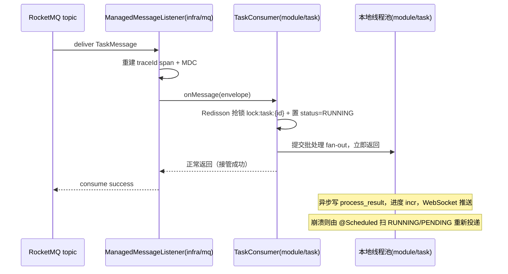

# infra/mq —— RocketMQ 消息设施（Wave 1 基础设施）

> 本文是 PixFlow 完整重写阶段 `infra/mq` 模块的设计文档，对应 `design.md` 第四章「技术栈选型」、第九章 9.2「异步任务分发」、9.4「断点恢复与失败隔离」、第十四章「异步执行时序」，以及 `module-dependency-dag-plan.md` 的 **Wave 1 基础设施**。
> 范围：领域无关的可靠消息设施——Topic / Tag / Consumer Group 命名规范、可靠投递、消费结果确认、分层重试 + DLQ、traceId 透传、可观测。本文不涉及 MVP 既有实现，从新架构需求重新推导。
> 本模块只依赖 `common`（`module-dependency-dag-plan.md` 明确 mq 在 Wave 1，仅依赖 common），**不依赖任何业务模块**。「任务」语义属于 `module/task`（Wave 4），见 [§二](#二为什么-inframq-必须领域无关)。
>
> 迁移说明：本文将 `infra/mq` 的权威设计从 RabbitMQ 改为 RocketMQ。`design.md`、`module/task.md`、`module/file.md`、`module/vision.md`、`module-dependency-dag-plan.md` 已同步到 RocketMQ 口径；`rabbitmq-to-rocketmq-refactor-plan.md` 已完成实现迁移，当前源码与运行配置不再保留 RabbitMQ / Spring AMQP 类型。

---

## 目录

- [一、文档定位与设计原则](#一文档定位与设计原则)
- [二、为什么 infra/mq 必须领域无关](#二为什么-inframq-必须领域无关)
- [三、模块结构与依赖位置](#三模块结构与依赖位置)
- [四、消息模型（topic / tag / consumer group / DLQ）](#四消息模型topic--tag--consumer-group--dlq)
- [五、可靠投递（SendResult + 恢复扫描）](#五可靠投递sendresult--恢复扫描)
- [六、消费模型：接管成功即确认](#六消费模型接管成功即确认)
- [七、分层重试与 DLQ](#七分层重试与-dlq)
- [八、traceId 透传](#八traceid-透传)
- [九、序列化与消息信封](#九序列化与消息信封)
- [十、可观测、配置](#十可观测配置)
- [十一、与 common / 业务模块的契约](#十一与-common--业务模块的契约)
- [十二、迁移约束与同步点](#十二迁移约束与同步点)
- [十三、测试策略](#十三测试策略)
- [十四、暂不考虑](#十四暂不考虑)

---

## 一、文档定位与设计原则

`infra/mq` 是 Wave 1 基础设施节点，向上被 `module/file`、`module/vision` 与 `module/task` 消费，是 PixFlow 异步执行链路的传输底座。它把「RocketMQ 的 producer、consumer、topic/tag 路由、consumer group、消费重试、DLQ、延迟消息、trace 透传」收口成一组**领域无关原语**，让业务模块只关心「发什么、收到怎么处理」，不关心 RocketMQ 客户端、broker 确认、重投、死信细节。

`infra/mq` 专属设计原则：

1. **领域无关**。infra/mq 不认识「任务」「素材包」「视觉富化」。它只提供 `MessagePublisher` / 消费容器 / 目的地声明 / 重试-DLQ 机制等通用能力；业务 topic、tag、consumer group、消息体、失败判定全部由上层模块声明与实现。
2. **至少一次投递（at-least-once）**。可靠投递 + consumer group 消费确认，保证消息不轻易丢；重复投递交由消费侧幂等消化（`process_result` checkpoint、包级 gap-fill、Redisson 锁），infra/mq 不自建幂等表。
3. **可靠性优先于吞吐**。本系统消息量天然低：任务消息是一条任务级消息，上传/富化消息是一条包级消息。默认同步发送、显式结果检查、较小并发、业务幂等兜底，不为吞吐牺牲可恢复性。
4. **失败判定下沉业务，机制留在 infra**。infra/mq 提供消费失败后的 `RECONSUME_LATER`、显式延迟重投、DLQ 记录等机制，但「这个异常该重试、跳过还是终态失败」由 `ConsumerErrorHandler` SPI 倒置给业务模块。
5. **长任务不占用 MQ 消费生命周期**。一条 task 消息会触发任务内 fan-out 数百上千张图、耗时数分钟。消费回调只负责快速接管，接管成功即返回成功；长任务可靠性由 MySQL 状态机与恢复扫描兜底。
6. **trace 贯穿异步边界**。RocketMQ 是 `common.md` §9.2 明确的「traceId 手动透传边界」，infra/mq 负责发布注入、消费重建，使任务执行链与提交请求在排障时可关联。
7. **Broker 语义显式化**。RabbitMQ 的 exchange/queue/routing key/DLX 不再作为 PixFlow 公共模型；新的公共模型以 `topic + tag + keys + consumerGroup` 为准。

---

## 二、为什么 infra/mq 必须领域无关

`module-dependency-dag-plan.md` 把 mq 放在 Wave 1（仅依赖 common），把 task 放在 Wave 4（依赖 mq + cache + dag + storage + state）。若 infra/mq 直接内建「任务队列」并 import `process_task` / `TaskMessage`，依赖方向会倒挂（infra → module），违反 design 原则四「Harness/infra 是横切层，不按业务领域切分」。

因此边界这样切：

| 关注点 | 归属 | 说明 |
|---|---|---|
| RocketMQ 客户端、producer、push/pull consumer、发送结果归一、消费结果归一 | **infra/mq** | 领域无关传输底座 |
| 目的地声明 API（topic、tag、consumer group、retry / DLQ 策略） | **infra/mq** | 提供声明式值对象，不预置业务 topic |
| `pixflow.task` / `pixflow.file` / `pixflow.vision` topic、tag、group、消息体 | **业务模块** | 业务拓扑与消息内容 |
| 「异常 → 重试 / DLQ / 直接确认丢弃 / 业务终态失败」判定 | **业务模块** | 消费 `common` 归一化错误模型按 `recovery` 决策 |
| 任务接管、抢锁、置状态、线程池 fan-out、断点恢复 | **module/task** | 业务流程 |
| 上传解压、视觉富化、gap-fill 幂等写入 | **module/file / module/vision** | 包级业务流程 |

infra/mq 永不出现业务类型；未来若有第二个异步场景（如离线 rubrics 触发、批量导入），同一套设施可直接复用。

---

## 三、模块结构与依赖位置

源码包：`com.pixflow.infra.mq`

```
infra/mq/
├── MessagePublisher.java                 # 发布入口：send + trace header 注入 + SendResult 归一
├── PublishResult.java                    # 投递结果（confirmed/failed），供业务补偿
├── PublishRequest.java                   # topic + tag + keys + payload + headers
├── MessageEnvelope.java                  # 通用消息信封（schemaVersion + payload + headers）
├── destination/
│   ├── MessageDestination.java           # topic / tag / keys / consumerGroup 的值对象
│   ├── ConsumerBinding.java              # 消费绑定：topic + tag expression + group + payloadType
│   └── DestinationRegistrar.java         # topic / group 预检与启动期校验（不承诺自动建 broker 资源）
├── consumer/
│   ├── ConsumerErrorHandler.java         # SPI：业务实现「异常 → 重试 / DLQ / ack drop」判定
│   ├── RetryDecision.java                # RETRY(delay) / DEAD_LETTER / ACK_DROP
│   ├── ManagedMessageHandler.java        # 业务 handler：收到反序列化 envelope 后处理
│   ├── ManagedMessageListener.java       # 包裹业务 handler：trace 重建 + 重试计数 + 错误路由
│   ├── ManagedMessageContainer.java      # broker-neutral 容器句柄：start/stop/isRunning
│   └── ManagedListenerContainerFactory.java
├── retry/
│   └── RetryHeaders.java                 # x-retry-count / x-original-topic / x-original-tag 等 header
├── rocket/
│   ├── RocketMessagePublisher.java       # RocketMQ producer 实现
│   ├── RocketManagedMessageContainer.java# RocketMQ consumer 容器适配
│   ├── RocketDestinationRegistrar.java   # RocketMQ 资源预检 / topic 声明策略
│   └── RocketMessageCodec.java           # RocketMQ Message 与 MessageEnvelope 转换
├── trace/
│   └── TraceHeaderPropagator.java        # 发布注入 traceId / 消费重建 span + MDC
├── config/
│   ├── MqProperties.java                 # pixflow.mq.* 配置绑定
│   └── MqAutoConfiguration.java          # 装配 producer、consumer factory、publisher、registrar
├── error/
│   └── MqErrorCode.java                  # enum implements common.ErrorCode（DEPENDENCY 类）
└── observability/
    └── MqMetrics.java                    # Micrometer 发布/消费/重试/DLQ 指标
```

依赖方向：

```
infra/mq ──► common（ErrorCode / PixFlowException / Sanitizer）
infra/mq ──► RocketMQ Java client / rocketmq-spring（传输实现）
infra/mq ──► (SPI) ConsumerErrorHandler      ← module/* 提供实现
module/file ──► infra/mq（发布/消费解压消息）
module/vision ──► infra/mq（消费富化消息）
module/task ──► infra/mq（发布/消费任务消息）
```

infra/mq **不依赖任何业务模块**；失败判定经 `ConsumerErrorHandler` SPI 倒置，保持 `common → infra/mq → module/*` 的单向依赖。

---

## 四、消息模型（topic / tag / consumer group / DLQ）

RabbitMQ 的 exchange / queue / routing key / DLX 模型不再进入业务 API。PixFlow 对 RocketMQ 的抽象固定为：

| 概念 | PixFlow 抽象 | 说明 |
|---|---|---|
| Topic | `MessageDestination.topic` | 一个业务域或消息族，例如 `pixflow-task`、`pixflow-file`、`pixflow-vision` |
| Tag | `MessageDestination.tag` | 同一 topic 下的消息类型，例如 `TASK_EXECUTE`、`PACKAGE_EXTRACT`、`COPY_ENRICH` |
| Keys | `MessageDestination.keys` | 业务排障键，例如 `task:{taskId}`、`package:{packageId}` |
| Consumer Group | `ConsumerBinding.consumerGroup` | 一类消费者的负载均衡组，例如 `pixflow-task-worker` |
| DLQ | RocketMQ 消费组死信队列 | 消费重试耗尽后的终态出口；infra/mq 采样深度与记录失败上下文 |

建议业务命名：

| 业务场景 | Topic | Tag | Consumer Group | Key |
|---|---|---|---|---|
| 任务执行 | `pixflow-task` | `TASK_EXECUTE` | `pixflow-task-worker` | `task:{taskId}` |
| 上传包解压 | `pixflow-file` | `PACKAGE_EXTRACT` | `pixflow-file-extractor` | `package:{packageId}` |
| 上传期文案富化 | `pixflow-vision` | `COPY_ENRICH` | `pixflow-vision-enricher` | `package:{packageId}` |

`MessageDestination` 是值对象，描述「topic / tag / keys / consumerGroup / retry 策略 / DLQ 策略」；infra/mq 不预置任何业务目的地实例，业务模块在自己模块里声明。

### 4.1 Topic 创建策略

RocketMQ 集群是否允许自动创建 topic 是运维策略，不应由业务代码隐式决定。PixFlow 采用：

- 开发 / 测试：允许 `DestinationRegistrar` 在启动期尝试创建或校验 topic，便于 Testcontainers 和本地 compose。
- 生产：默认只做启动期校验；缺 topic / group 权限时 fail-fast，避免运行时第一条消息才失败。

---

## 五、可靠投递（SendResult + 恢复扫描）

对应决策点 4「可靠投递 + 恢复扫描覆盖待执行」。infra/mq 只提供**确认机制**，发布成功/失败后的业务补偿留在业务模块。

### 5.1 配置与机制

- `MessagePublisher.publish(...)` 同步发送消息，等待 RocketMQ 返回发送结果。
- `PublishResult` 语义：
  - `confirmed`：broker 接收消息，返回可追踪的 messageId / transactionId / queue 信息。
  - `failed(reason)`：发送异常、超时、broker 返回非成功状态、topic/tag 非法、序列化失败。
- 默认同步等待发送结果（默认 5s，可配）。消息量低，同步等待开销可接受；这比异步 fire-and-forget 更适合 PixFlow 的任务事实源模型。
- 消息写入 `keys`，用于 RocketMQ 控制台和日志排障；业务 ID 不作为高基数 metrics tag。

### 5.2 submit / enqueue 投递缺口的闭合

异步入口通常是「DB 创建事实记录 → 发布消息 → 返回业务 ID」。裂缝是：**DB 已提交但发消息失败 → 任务或包永远卡在待处理**。

闭合方式（**机制在 infra/mq，补偿在业务模块**）：

1. 业务模块先在本地事务提交事实源记录，例如 `process_task(status=PENDING)` 或 `asset_package(status=UPLOADED)`。
2. 事务提交后调 `MessagePublisher.publish`，读取 `PublishResult`：
   - `confirmed` → 状态迁移到 queued/running 所需的业务状态，正常返回。
   - `failed` → 记录待补偿状态，保持事实源可扫描；由业务模块 `@Scheduled` 恢复扫描超龄待处理记录补发。
3. 这样无论发送成功与否，事实源都不会丢：要么已入 RocketMQ，要么被恢复扫描补发。

> 决策记录：选同步 SendResult + 恢复扫描，而非事务性 outbox。理由：消息量低、submit 链路对强一致要求可由「事实源在 MySQL + 恢复扫描补发」满足，避免 outbox 表与独立 relay 的额外复杂度。

---

## 六、消费模型：接管成功即确认

PixFlow 有两类消费模式：

1. **长任务接管型**：`module/task` 收到任务消息后抢锁、置状态、提交线程池，然后立即确认消费成功。真正的 `[图片×支路]` fan-out 在业务线程池里跑，崩溃后靠恢复扫描重新投递。
2. **包级处理型**：`module/file` 解压、`module/vision` 富化可以在消费回调内完成，但仍必须保证单条消息处理时间受控；若处理可能过长，应先接管到本地 executor，再确认消费成功。

任务执行推荐流程：



要点：

- **确认时机**：在「成功接管」后返回消费成功，而非整批跑完。
- **可靠性兜底**：确认后崩溃不依赖 MQ 重投，而依赖 design §9.4 已有的恢复扫描（扫 `PENDING` / `RUNNING` 重新入队，worker 靠 checkpoint 和锁跳过已完成单元）。
- **接管失败才用 MQ 语义**：若接管阶段失败（抢锁失败、依赖不可用、反序列化失败），交 `ConsumerErrorHandler` 走 [§七](#七分层重试与-dlq)。
- **包级幂等**：file/vision 类消费者必须以 `packageId` 做幂等：已解压文件跳过、已写 `asset_copy` 按 gap-fill 跳过。

---

## 七、分层重试与 DLQ

RocketMQ 自带消费失败重试和消费组 DLQ。PixFlow 保留业务可控的三段式重试，但实现方式改为 RocketMQ 语义：

1. **进程内瞬时重试**：仅对明确瞬时依赖错误（`category=DEPENDENCY/NETWORK`），`ManagedMessageListener` 在回调内有限次快速退避重试，默认 ≤2 次。严格限次，因为它占用消费线程。
2. **Broker 级消费重试或显式延迟重投**：
   - 默认：业务返回 `RetryDecision.Retry` 时，listener 返回 RocketMQ 的 reconsume 结果，让 broker 按 consumer group 策略重投。
   - 需要自定义退避时：infra/mq 可重新发送一条延迟消息，携带 `x-retry-count++`、原 topic/tag/key 和失败原因，再对当前消息返回成功，避免 broker 默认退避不可控。
3. **终态 DLQ**：`x-retry-count` 超过 `max-retries` 或 SPI 直接返回 `DeadLetter` 时，消息进入终态死信路径。优先使用 RocketMQ consumer group DLQ；若业务需要可查询的统一记录，infra/mq 额外写脱敏失败日志和 metrics，业务模块负责把任务状态迁移为失败。

### 7.1 SPI：ConsumerErrorHandler

```java
public interface ConsumerErrorHandler {
    RetryDecision onError(MessageEnvelope<?> envelope, Throwable error, int retryCount);
}

public sealed interface RetryDecision {
    record Retry(Duration delay, String reason) implements RetryDecision {}
    record DeadLetter(String reason) implements RetryDecision {}
    record AckDrop(String reason) implements RetryDecision {}
}
```

业务实现对齐 `common.md` §6.4：

| common `RecoveryHint` | RetryDecision | RocketMQ 行为 |
|---|---|---|
| `RETRY` | `Retry(backoff(retryCount))` | broker 重投或显式延迟重投；超 `max-retries` → DLQ |
| `SKIP` | `AckDrop` | 返回消费成功，业务已记录跳过/部分成功 |
| `TERMINATE` | `DeadLetter` | 进入终态失败路径，业务状态迁移为 failed |

### 7.2 延迟消息约束

RocketMQ 延迟消息适合分钟级/小时级重试退避，但不作为长周期调度器使用。PixFlow 的 retry-backoff 默认控制在 30 分钟内；超过该范围的恢复依赖 MySQL 事实源扫描，而不是 MQ 延迟消息。

---

## 八、traceId 透传

RocketMQ 是 `common.md` §9.2 明确的两个「Micrometer 不自动覆盖、需手动透传」边界之一。`TraceHeaderPropagator` 负责：

- **发布注入**：`MessagePublisher` 发布前从当前 trace 上下文取 `traceId`（及 spanId），写入 message user properties（`x-trace-id`）。
- **消费重建**：`ManagedMessageListener` 收到消息后从 user properties 取 `traceId`，重建 span 并注入 MDC（日志 `%X{traceId}`），使异步任务执行链与提交请求的同步链在排障时通过同一 `traceId` 关联。
- 与业务回合维度并存：`agent_trace.conversation_id + turn_no` 是业务回合维度，`traceId` 是技术调用链维度，二者不合并。

---

## 九、序列化与消息信封

- **转换器**：Jackson JSON 序列化，便于 DLQ 中肉眼排查与跨语言兼容。
- **消息体最小化**：消息只放业务 ID + 少量元信息，例如 `taskId`、`packageId`、`taskType`。DAG、文件列表、大结果已落 MySQL/MinIO，**不进消息**。
- **信封 `MessageEnvelope`**：统一外层结构 `{ schemaVersion, payload, headers }`。`schemaVersion` 预留消息演进；反序列化时校验版本，不识别的版本进 DLQ 或 ack drop，并记录错误。
- **Keys**：发布时必须写 `keys`，用于 RocketMQ 控制台和日志定位；建议格式为 `task:{id}`、`package:{id}`。
- **幂等**：至少一次投递 → 重复消息可能（broker 重试、恢复扫描补发、显式延迟重投）。靠业务 checkpoint、包级 gap-fill、Redisson 锁去重，infra/mq 不自建幂等表。

---

## 十、可观测、配置

### 10.1 可观测（Micrometer）

- `pixflow.mq.publish{result=confirmed|failed}`：发布确认率，监控投递缺口。
- `pixflow.mq.consume{topic, group, result=success|retry|dead_letter|ack_drop}`：消费结果分布。
- `pixflow.mq.retry.count{topic, group}`：重试次数分布。
- `pixflow.mq.dlq.depth{topic, group}`：DLQ 深度或估算深度，**> 0 触发告警**。
- `pixflow.mq.consumer.lag{topic, group}`：消费积压，辅助判断 worker 不足或卡死。
- 失败原因日志经 `common` 的 `Sanitizer` 脱敏后落 error 日志；不在指标 tag 里放高基数值（如 taskId、packageId）。

### 10.2 配置项

```yaml
pixflow:
  mq:
    namesrv-addr: localhost:9876
    producer-group: pixflow-producer
    send-timeout: 5s
    consumer:
      consume-thread-min: 2
      consume-thread-max: 8
      consume-timeout: 5m
    in-process-retries: 2
    max-retries: 5
    retry-backoff: [5s, 30s, 2m, 10m, 30m]
    retry-mode: broker      # broker | explicit-delay
    dlq-alert-threshold: 1
    topic-auto-create: false
```

topic、tag、consumer group 由各业务模块在自己的 `MessageDestination` / `ConsumerBinding` 里声明，不在 infra/mq 配置里硬编码业务目的地。

---

## 十一、与 common / 业务模块的契约

| 对接方 | 契约 |
|---|---|
| `common/error` | MQ 连接、发送、消费、反序列化失败归一化为 `MqErrorCode`（`ErrorCategory.DEPENDENCY`，默认 RETRY/503）；`MqErrorCode implements ErrorCode` |
| `module/file` | 上传包创建后发布 `PACKAGE_EXTRACT`；消费端按 `packageId` 幂等解压，失败由 `ExtractionErrorHandler` 判定 |
| `module/vision` | file 解压完成后发布或转发 `COPY_ENRICH`；消费端按 `packageId` gap-fill 写 `asset_copy`，失败由 `CopyEnrichmentErrorHandler` 判定 |
| `module/task`（发布侧） | 调 `MessagePublisher.publish` 并据 `PublishResult` 做投递缺口补偿；恢复扫描覆盖超龄 `PENDING` / `RUNNING` |
| `module/task`（消费侧） | 声明 `ConsumerBinding`；实现接管型 consumer 与 `ConsumerErrorHandler`；消费成功只代表接管成功，不代表任务完成 |
| `harness/eval` | 通过 `traceId` 关联异步任务链与提交请求；MQ 指标并入运维面板 |
| `infra/cache`（Redisson） | infra/mq 不直接依赖；任务去重锁、断点缓存、进度计数由业务模块在接管/批处理时使用 |

**关键不变量**：infra/mq 不出现任何业务类型；失败判定经 `ConsumerErrorHandler` SPI 倒置；trace 在发布注入、消费重建；长任务在「成功接管」后确认，可靠性由 MySQL 恢复扫描兜底。

---

## 十二、迁移约束与同步点

MQ 目标设计已切到 RocketMQ，设计文档同步状态如下：

1. `design.md` 第四章、第九章、第十二章、第十四章已改为 RocketMQ。
2. `module-dependency-dag-plan.md` 中 `infra/mq` 节点、Wave 1 任务清单、task 集成说明已改为 RocketMQ。
3. `module/task.md` 已把任务消费入口从 `@RabbitListener` 口径改为 RocketMQ consumer / `ConsumerBinding` / DLQ 处理器口径。
4. `module/file.md` 已把解压作业从 RabbitMQ 队列组改为 `pixflow-file` topic、`PACKAGE_EXTRACT` tag 与 `pixflow-file-extractor` consumer group。
5. `module/vision.md` 已把富化作业从 RabbitMQ 队列组改为 `pixflow-vision` topic、`COPY_ENRICH` tag 与 `pixflow-vision-enricher` consumer group。
6. `rabbitmq-to-rocketmq-refactor-plan.md` 已清理当前代码中的 `spring-boot-starter-amqp`、`RabbitTemplate`、`RabbitAdmin`、`RabbitListener` 与 Spring AMQP `MessageListenerContainer`。
7. Docker Compose 已从 RabbitMQ 改为 RocketMQ NameServer + Broker；测试侧保留 Docker 不可用时跳过集成测试的既有策略。

本文确立的 RocketMQ 目标设计已经由 `rabbitmq-to-rocketmq-refactor-plan.md` 落地到当前实现；后续模块应只依赖 `MessageDestination`、`ConsumerBinding`、`ManagedMessageContainer` 与 `MessagePublisher` 等 PixFlow MQ 抽象。

---

## 十三、测试策略

- **目的地声明 / 校验**：用 Testcontainers 起 RocketMQ，断言 `DestinationRegistrar` 能校验 topic、tag、consumer group 配置；生产模式缺 topic fail-fast。
- **可靠投递**：发布得到 `confirmed` 和 messageId；向不存在 topic 发布得到 `failed`；发送超时模拟得到 `failed`。
- **接管成功即确认**：task consumer 在抢锁、置状态、提交线程池后返回成功；线程池内失败不触发 MQ 重投，恢复扫描负责补偿。
- **分层重试**：注入瞬时异常断言进程内重试；持续失败断言 broker 重投或显式延迟重投，`x-retry-count` 递增；超 `max-retries` 进入 DLQ。
- **SPI 三态**：`Retry` / `DeadLetter` / `AckDrop` 三种 `RetryDecision` 分别驱动重试、死信、直接消费成功。
- **trace 透传**：发布注入 `x-trace-id`，消费侧 MDC 中 `traceId` 与发布侧一致。
- **信封版本**：未知 `schemaVersion` 进入终态失败路径，而非崩溃消费者进程。
- **业务幂等**：重复投递 `taskId` 不重复执行已完成单元；重复投递 `packageId` 不覆盖已 gap-fill 的 `asset_copy`。
- **错误码目录**：`MqErrorCode` 全部归 DEPENDENCY、code 全局唯一、i18n 文案齐全。

---

## 十四、暂不考虑

- RocketMQ 多集群、跨机房容灾、ACL 细粒度租户隔离（本期单集群部署）。
- 事务消息（采用 MySQL 事实源 + 发送结果 + 恢复扫描，不引入 outbox / 事务消息双写复杂度）。
- 顺序消息（当前任务、解压、富化都靠业务幂等，不要求严格顺序）。
- 广播消费（本期全部使用集群消费，保证同组负载均衡）。
- 消息轨迹的独立可视化运维界面（先依赖 RocketMQ 控制台 + Micrometer 指标）。
- 长周期定时调度（超过 retry-backoff 范围的恢复交给 MySQL 扫描）。
- 跨服务 Saga / 分布式事务补偿（以 MySQL 为事实源 + 侧存储可重建）。

## Revision Notes

2026-07-02 / Codex: 将 `infra/mq` 设计文档从 RabbitMQ + Spring AMQP 改为 RocketMQ 目标设计。核心变化包括：公共模型从 exchange/queue/routingKey/DLX 改为 topic/tag/keys/consumerGroup/DLQ；可靠投递从 publisher confirms + mandatory return 改为同步 SendResult + 恢复扫描；消费容器改为 broker-neutral `ManagedMessageContainer`；重试从 TTL+DLX 改为 broker 重投或显式延迟重投；新增迁移约束，要求后续同步 `design.md`、`module/task.md`、`module/file.md`、`module/vision.md`、`module-dependency-dag-plan.md` 与当前代码中的 Spring AMQP 类型泄漏。
