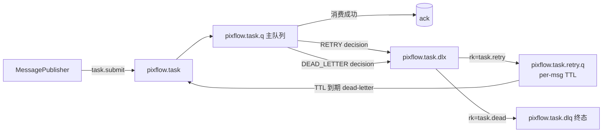
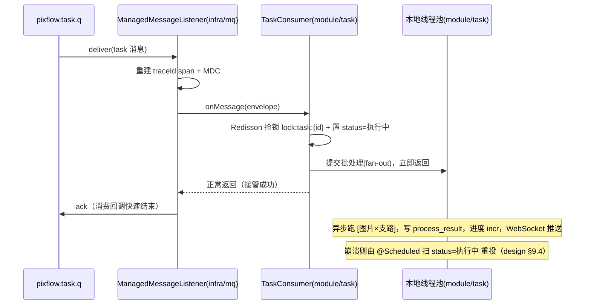

# infra/mq —— RabbitMQ 消息设施（Wave 1 基础设施）

> 本文是 PixFlow 完整重写阶段 `infra/mq` 模块的设计文档，对应 `design.md` 第四章「技术栈选型」（RabbitMQ + Spring AMQP）、第九章 9.2「异步任务分发」、9.4「断点恢复与失败隔离」、第十四章「异步执行时序」，以及 `module-dependency-dag-plan.md` 的 **Wave 1 基础设施**。
> 范围：领域无关的可靠消息设施——拓扑声明、可靠投递（publisher confirms）、手动 ack 消费容器、分层重试 + DLQ、traceId 透传、可观测。本文不涉及 MVP 既有实现，从新架构需求重新推导。
> 本模块只依赖 `common`（`module-dependency-dag-plan.md` 明确 mq 在 Wave 1，仅依赖 common），**不依赖任何业务模块**。「任务」语义属于 `module/task`（Wave 4），见 [§二](#二为什么-inframq-必须领域无关)。

---

## 目录

- [一、文档定位与设计原则](#一文档定位与设计原则)
- [二、为什么 infra/mq 必须领域无关](#二为什么-inframq-必须领域无关)
- [三、模块结构与依赖位置](#三模块结构与依赖位置)
- [四、拓扑模型（exchange / queue / DLX / DLQ / 重试队列）](#四拓扑模型exchange--queue--dlx--dlq--重试队列)
- [五、可靠投递（Publisher Confirms）](#五可靠投递publisher-confirms)
- [六、消费模型：ack-then-process](#六消费模型ack-then-process)
- [七、分层重试与 DLQ](#七分层重试与-dlq)
- [八、traceId 透传](#八traceid-透传)
- [九、序列化与消息信封](#九序列化与消息信封)
- [十、可观测、配置](#十可观测配置)
- [十一、与 common / 业务模块的契约](#十一与-common--业务模块的契约)
- [十二、测试策略](#十二测试策略)
- [十三、暂不考虑](#十三暂不考虑)

---

## 一、文档定位与设计原则

`infra/mq` 是 Wave 1 基础设施节点，向上被 `module/task`（Wave 4）消费，是 PixFlow 异步执行链路的传输底座。它把「Spring AMQP + RabbitMQ 的可靠投递、手动确认、重试、DLQ、prefetch 公平分发」收口成一组**领域无关原语**，让业务模块只关心「发什么、收到怎么处理」，不关心 RabbitMQ 的连接、确认、重投、死信细节。

`infra/mq` 专属设计原则：

1. **领域无关**。infra/mq 不认识「任务」「DAG」「素材包」。它只提供 `MessagePublisher` / 消费容器 / 拓扑声明 / 重试-DLQ 机制等通用能力；task 的交换机、队列、路由键、消息体、失败判定全部由 `module/task` 声明与实现（见 [§二](#二为什么-inframq-必须领域无关)）。
2. **至少一次投递（at-least-once）**。durable 队列 + persistent 消息 + publisher confirms，保证消息不丢；重复投递交由消费侧幂等消化（design 已有 `process_result` checkpoint + Redisson 锁），infra/mq 不自建幂等表。
3. **可靠性优先于吞吐**。本系统消息量天然低（一条消息 = 一个任务，design 9.2），不为吞吐牺牲可靠性；默认 `prefetch=1` 公平分发、手动 ack、强制持久化。
4. **失败判定下沉业务，机制留在 infra**。infra/mq 提供 DLX/DLQ/延迟重试的**机制**，但「这个异常该重试还是进 DLQ」是 `common` 错误模型 + 业务语义的判断，经 `ConsumerErrorHandler` SPI 倒置给 `module/task`（沿用 `common` 的 `ErrorRecorder`、`permission` 的 `ConfirmationTokenStore` 依赖倒置手法）。
5. **不阻塞消费线程做长任务**。一条 task 消息会触发任务内 fan-out 数百上千张图、耗时数分钟。消费回调**绝不**同步跑完整批处理，而是快速接管后 ack（见 [§六](#六消费模型ack-then-process)），规避 RabbitMQ `consumer_timeout` 并保持消费容量。
6. **trace 贯穿异步边界**。RabbitMQ 是 `common.md` §9.2 明确的「traceId 手动透传边界」，infra/mq 负责发布注入、消费重建，使任务执行链与提交请求在排障时可关联。

---

## 二、为什么 infra/mq 必须领域无关

`module-dependency-dag-plan.md` 把 mq 放在 Wave 1（仅依赖 common），把 task 放在 Wave 4（依赖 mq + cache + dag + storage + state）。若 infra/mq 直接内建「任务队列」并 import `process_task`/`TaskMessage`，依赖方向会倒挂（infra → module），违反 design 原则四「Harness/infra 是横切层，不按业务领域切分」。

因此边界这样切：

| 关注点 | 归属 | 说明 |
|---|---|---|
| 连接、channel、confirm、ack、prefetch、重投、死信机制 | **infra/mq** | 领域无关传输底座 |
| 拓扑声明 API（如何声明一个带 DLX/DLQ/重试队列的队列组） | **infra/mq** | 提供声明式构建器，不预置业务队列 |
| `task.exchange` / `task.q` / 路由键 / `TaskMessage{taskId}` 实体 | **module/task** | 业务拓扑与消息体 |
| 「异常 → 重试 / 进 DLQ / 任务终态失败」判定 | **module/task** | 消费 `common` 归一化模型按 `recovery` 决策（`common.md` §6.4） |
| ack-then-process 的任务编排（抢锁、置状态、交线程池） | **module/task** | 业务流程 |

infra/mq 永不出现业务类型；未来若有第二个异步场景（如离线 rubrics 触发、批量导入），同一套设施可直接复用。

---

## 三、模块结构与依赖位置

源码包：`com.pixflow.infra.mq`

```
infra/mq/
├── MessagePublisher.java            # 发布入口：confirm + mandatory + trace header 注入
├── PublishResult.java               # 投递结果（confirmed/failed），供业务补偿
├── MessageEnvelope.java             # 通用消息信封（schemaVersion + payload + headers）
├── topology/
│   ├── QueueTopology.java           # 一个队列组（主队列 + DLX + DLQ + 延迟重试队列）的声明值对象
│   ├── QueueTopologyBuilder.java    # 声明式构建器（业务侧用它描述自己的队列组）
│   └── TopologyRegistrar.java       # 把 QueueTopology 注册进 RabbitAdmin（声明幂等）
├── consumer/
│   ├── ConsumerErrorHandler.java    # SPI：业务实现「异常 → 重试 / DLQ / 终态」判定
│   ├── RetryDecision.java           # SPI 返回值：RETRY(delay) / DEAD_LETTER / ACK_DROP
│   ├── ManagedMessageListener.java  # 包裹业务 handler：trace 重建 + 重试计数 + 错误路由
│   └── ListenerContainerFactory.java# 手动 ack / prefetch / 并发 容器工厂
├── retry/
│   └── RetryHeaders.java            # x-retry-count / x-original-routing-key 等 header 常量与读写
├── trace/
│   └── TraceHeaderPropagator.java   # 发布注入 traceId / 消费重建 span + MDC（对齐 common §9.2）
├── config/
│   ├── MqProperties.java            # pixflow.mq.* 配置绑定
│   └── MqAutoConfiguration.java     # 装配 ConnectionFactory 调优、转换器、Publisher、容器工厂
├── error/
│   └── MqErrorCode.java             # enum implements common.ErrorCode（DEPENDENCY 类）
└── observability/
    └── MqMetrics.java               # Micrometer 发布/消费/重试/DLQ 指标
```

依赖方向：

```
infra/mq ──► common（ErrorCode / PixFlowException / Sanitizer）
infra/mq ──► Spring AMQP / RabbitMQ client（传输实现）
infra/mq ──► (SPI) ConsumerErrorHandler   ← module/task 提供实现（Wave 4 注入）
module/task ──► infra/mq（声明 task 拓扑、发布任务消息、注册消费容器）
```

infra/mq **不依赖任何业务模块**；失败判定经 `ConsumerErrorHandler` SPI 倒置，保持 `common → infra/mq → module/task` 的单向依赖。

---

## 四、拓扑模型（exchange / queue / DLX / DLQ / 重试队列）

不使用 default exchange，全部显式声明、`durable`、消息 `persistent`。一个「队列组」由四个 RabbitMQ 对象组成，由 `QueueTopologyBuilder` 一次性描述、`TopologyRegistrar` 幂等注册：

| 对象 | 命名约定（以 task 为例） | 作用 |
|---|---|---|
| 主交换机 | `pixflow.task`（direct） | 业务消息入口 |
| 主队列 | `pixflow.task.q`（绑定路由键 `task.submit`） | 消费者监听；声明 `x-dead-letter-exchange=pixflow.task.dlx` |
| 延迟重试队列 | `pixflow.task.retry.q` | 无消费者；消息带 per-message TTL，到期经 DLX 路由**回主队列**（原生 TTL+DLX，不依赖 delayed 插件） |
| 终态死信交换机/队列 | `pixflow.task.dlx` → `pixflow.task.dlq` | 重试耗尽 / 不可恢复消息的最终归宿，留待人工排查与手动重投 |

重试与终态死信复用同一个 DLX 但用**不同路由键**区分流向：



> 设计选择：**原生 TTL + DLX 实现延迟重试**，零运维依赖（不装 `rabbitmq_delayed_message_exchange` 插件）。代价是每次重试用 per-message TTL（`message.expiration`）而非队列级 TTL，以支持按 `x-retry-count` 递增退避；这要求重试消息重新发布到 `retry.q` 并带上当次 TTL（由 `ManagedMessageListener` 处理，业务无感）。

`QueueTopology` 是值对象，描述「主交换机名 / 队列名 / 路由键 / 是否启用重试队列 / DLQ 名」；infra/mq 不预置任何业务队列实例，task 在自己模块里 `new QueueTopologyBuilder("pixflow.task")...build()`。

---

## 五、可靠投递（Publisher Confirms）

对应决策点 4「Publisher Confirms + 恢复扫描覆盖待执行」。infra/mq 只提供**确认机制**，发布成功/失败后的业务补偿留在 `module/task`。

### 5.1 配置与机制

- `ConnectionFactory` 开启 `publisher-confirm-type=CORRELATED` + `publisher-returns=true`，发布用 `mandatory=true`。
- `MessagePublisher.publish(...)` 返回 `PublishResult`，语义：
  - `confirmed`：broker ack 了该消息（已落 durable 队列）。
  - `failed(reason)`：confirm nack、return（无队列可路由）、或超时（默认 5s，可配）。
- 同步等待 confirm（`CorrelationData.getFuture().get(timeout)`），把异步 confirm 转成调用方可判定的结果，保持「submit 路径线性可读」。消息量低，同步等待开销可接受。

### 5.2 submit_dag 投递缺口的闭合

design 14 的时序「创建 process_task(待执行) + DAG 入库 → 发布消息 → 立即返回 taskId」存在裂缝：**DB 已提交但发消息失败 → 任务永远卡在「待执行」**，而 §9.4 的 `@Scheduled` 恢复只扫「执行中」。

闭合方式（**机制在 infra/mq，补偿在 module/task**）：

1. `module/task` 先在本地事务提交 `process_task(status=待执行)` + DAG 入库。
2. 事务提交后调 `MessagePublisher.publish`，**读 `PublishResult`**：
   - `confirmed` → 正常返回 taskId。
   - `failed` → 不抛断请求，记录待补偿（任务保持「待执行」），由 `module/task` 的 `@Scheduled` 恢复扫描**额外覆盖超龄「待执行」任务**补发。
3. 这样无论 confirm 成功与否，任务都不会丢——要么已入队，要么被恢复扫描补发。与 design「以 MySQL 为事实源、Redis/MinIO 可重建」理念一致，不引入 outbox 表。

> 决策记录：选 Publisher Confirms + 恢复扫描而非事务性 outbox。理由：消息量低、submit 链路对强一致要求可由「事实源在 MySQL + 恢复扫描补发」满足，避免 outbox 表与独立 relay 的额外复杂度。

---

## 六、消费模型：ack-then-process

对应决策点 2。一条 task 消息会触发任务内 fan-out `[图片×支路]`、耗时数分钟。若 process-then-ack，会踩两个生产坑：消费回调长时间不返回占满消费容量；RabbitMQ 3.8+ 默认 `consumer_timeout`（30 分钟）未 ack 强制关 channel 并重投。

因此采用 **ack-then-process**：



要点：

- **ack 时机**：在「成功接管」（抢到锁 + 置执行中 + 提交线程池）后立即 ack，而非整批跑完。
- **可靠性兜底**：ack 后崩溃不依赖 MQ 重投，而依赖 design §9.4 已有的恢复扫描（`@Scheduled` 扫 `status=执行中` 重新入队，worker 靠 `process_result` + Redis 缓存跳过已完成单元）。二者本就一致，不新增机制。
- **接管失败才用 MQ 语义**：若「接管阶段」本身失败（如抢锁失败=已有 worker 在跑、依赖不可用），交 `ConsumerErrorHandler` 走 [§七](#七分层重试与-dlq) 的重试/DLQ。
- **prefetch**：默认 `1`，配合手动 ack 公平分发，避免单 worker 囤积消息（design 9.2「prefetch 公平分发」）。

> ManagedMessageListener 由 infra/mq 提供，负责 trace 重建、重试计数、ack/nack 与错误路由；业务的 `TaskConsumer` 只实现「接管」逻辑，返回即代表接管成功。

---

## 七、分层重试与 DLQ

对应决策点 3「内存瞬时 + DLX/TTL 延迟 + 终态 DLQ」三段式。重试**机制**在 infra/mq，重试**判定**由 `ConsumerErrorHandler` SPI 决定。

### 7.1 SPI：ConsumerErrorHandler

```java
public interface ConsumerErrorHandler {
    // 业务把异常归一化为 common 模型并按 recovery 给出投递判定
    RetryDecision onError(MessageEnvelope envelope, Throwable error, int retryCount);
}

public sealed interface RetryDecision {
    record Retry(Duration delay) implements RetryDecision {}  // 进延迟重试队列
    record DeadLetter(String reason) implements RetryDecision {} // 进终态 DLQ
    record AckDrop(String reason) implements RetryDecision {}    // 已业务消化(如 SKIP)，直接 ack 丢弃
}
```

`module/task` 的实现对齐 `common.md` §6.4：

| common `RecoveryHint` | RetryDecision | RabbitMQ 行为 |
|---|---|---|
| `RETRY` | `Retry(backoff(retryCount))` | 发布到 `retry.q` 带递增 TTL；超 `max-retries` → 转 `DeadLetter` |
| `SKIP` | `AckDrop`（支路 `status=2` + 脱敏 `error_msg` 已在业务侧落库） | ack 丢弃，任务其余继续 |
| `TERMINATE` | `DeadLetter`（任务终态失败已落库） | 进 DLQ 留痕 |

### 7.2 三段流转

1. **进程内瞬时重试**（少量、快速）：仅对明确瞬时依赖错误（`category=DEPENDENCY/NETWORK`），`ManagedMessageListener` 在回调内有限次（默认 ≤2）快速退避重试，避免为一次网络抖动走完整 MQ 重投环路。**严格限次、极短退避**，因为它占用消费线程。
2. **DLX/TTL 延迟重试**（跨重启、较长退避）：进程内重试仍失败且 SPI 返回 `Retry(delay)` → 发布到 `retry.q`、`message.expiration=delay`、`x-retry-count++`；TTL 到期经 DLX 自动路由回主队列。退避按 `x-retry-count` 递增（如 5s/30s/2m，可配）。
3. **终态 DLQ**：`x-retry-count` 超 `max-retries` 或 SPI 直接返回 `DeadLetter` → 路由到 `pixflow.task.dlq`。DLQ 消息保留原始 payload + 失败原因 header，供人工排查与手动重投；DLQ 深度 > 0 触发告警（见 [§十](#十可观测配置)）。

`retryCount` 由 `RetryHeaders` 在消息 header 维护（`x-retry-count`），跨重投持久。

---

## 八、traceId 透传

RabbitMQ 是 `common.md` §9.2 明确的两个「Micrometer 不自动覆盖、需手动透传」边界之一。`TraceHeaderPropagator` 负责：

- **发布注入**：`MessagePublisher` 发布前从当前 trace 上下文取 `traceId`（及 spanId），写入 message header（`x-trace-id`）。
- **消费重建**：`ManagedMessageListener` 收到消息后从 header 取 `traceId`，重建 span 并注入 MDC（日志 `%X{traceId}`），使**异步任务执行链**与**提交请求的同步链**在排障时通过同一 `traceId` 关联。
- 与业务回合维度并存：`agent_trace.conversation_id + turn_no` 是业务回合维度，`traceId` 是技术调用链维度，二者不合并（沿用 common 约定）。

---

## 九、序列化与消息信封

- **转换器**：`Jackson2JsonMessageConverter`，JSON 序列化，便于 DLQ 中肉眼排查与跨语言兼容。
- **消息体最小化**：消息只放 `taskId` + 少量元信息（DAG 已落库，**不进消息**，保持消息小、MQ 量低，呼应 design 9.2「任务级消息保持 MQ 消息量低」）。
- **信封 `MessageEnvelope`**：统一外层结构 `{ schemaVersion, payload, headers }`。`schemaVersion` 预留消息演进；反序列化时校验版本，不识别的版本进 DLQ 而非抛崩消费者。
- **幂等**：至少一次投递 → 重复消息可能（恢复重投、retry 回流）。靠 design 已有的 `process_result` checkpoint + Redisson 锁 `lock:task:{id}` 去重，infra/mq 不自建幂等表。

---

## 十、可观测、配置

### 10.1 可观测（Micrometer）

- `pixflow.mq.publish{result=confirmed|failed}`：发布确认率，监控投递缺口。
- `pixflow.mq.consume{queue, result=ack|retry|dead_letter|ack_drop}`：消费结果分布。
- `pixflow.mq.retry.count{queue}`：重试次数分布。
- `pixflow.mq.dlq.depth{queue}`：DLQ 深度（定时采样），**> 0 触发告警**——DLQ 有消息意味着有任务彻底失败需人工介入。
- 失败原因日志经 `common` 的 `Sanitizer` 脱敏后落 error 日志；不在指标 tag 里放高基数值（如 taskId）。

### 10.2 配置项

```yaml
pixflow:
  mq:
    publish-confirm-timeout: 5s     # 同步等待 confirm 超时
    prefetch: 1                     # 手动 ack 公平分发
    consumer-concurrency: 4         # 消费容器并发（接管很快，少量即可）
    in-process-retries: 2           # 进程内瞬时重试次数（极短退避）
    max-retries: 5                  # DLX 延迟重试上限，超出进终态 DLQ
    retry-backoff: [5s, 30s, 2m, 10m, 30m]  # 按 x-retry-count 取退避 TTL
    dlq-alert-threshold: 1          # DLQ 深度告警阈值
```

队列/交换机/路由键名由各业务模块在自己的 `QueueTopology` 里声明，不在 infra/mq 配置里硬编码业务队列名。

---

## 十一、与 common / 业务模块的契约

| 对接方 | 契约 |
|---|---|
| `common/error` | MQ 连接/channel/confirm 失败归一化为 `MqErrorCode`（`ErrorCategory.DEPENDENCY`，默认 RETRY/503）；`MqErrorCode implements ErrorCode` |
| `module/task`（发布侧） | 调 `MessagePublisher.publish` 并据 `PublishResult` 做投递缺口补偿（恢复扫描覆盖「待执行」，见 §5.2） |
| `module/task`（消费侧） | 声明 `QueueTopology`；实现 `TaskConsumer`（ack-then-process 接管）与 `ConsumerErrorHandler`（按 `common` `recovery` 给 `RetryDecision`） |
| `harness/eval` | 通过 `traceId` 关联异步任务链与提交请求；MQ 指标并入运维面板 |
| `infra/cache`（Redisson） | infra/mq 不直接依赖；任务去重锁 `lock:task:{id}`、断点缓存由 `module/task` 在接管/批处理时使用 |

**关键不变量**：infra/mq 不出现任何业务类型；失败判定经 `ConsumerErrorHandler` SPI 倒置；trace 在发布注入、消费重建；ack 在「成功接管」后，可靠性由 design §9.4 恢复扫描兜底。

---

## 十二、测试策略

- **拓扑声明**：用 Testcontainers 起 RabbitMQ，断言 `TopologyRegistrar` 幂等声明主队列 + DLX + retry.q + DLQ，重复声明不报错。
- **可靠投递**：发布得到 `confirmed`；向不存在路由键发布（mandatory return）得到 `failed`；confirm 超时模拟得到 `failed`。
- **ack-then-process**：消费回调在「接管」后即 ack（断言消息从主队列移除）；接管内异步任务失败不影响该消息已 ack。
- **分层重试**：注入瞬时异常断言进程内重试；持续失败断言进 `retry.q` 且 `x-retry-count` 递增、TTL 到期回主队列；超 `max-retries` 进 DLQ。
- **SPI 三态**：`Retry`/`DeadLetter`/`AckDrop` 三种 `RetryDecision` 分别驱动 retry.q / DLQ / 直接 ack。
- **trace 透传**：发布注入 `x-trace-id`，消费侧 MDC 中 `traceId` 与发布侧一致。
- **信封版本**：未知 `schemaVersion` 进 DLQ 而非崩溃消费者。
- **错误码目录**：`MqErrorCode` 全部归 DEPENDENCY、code 全局唯一、i18n 文案齐全（并入 `common` 启动期聚合测试）。

---

## 十三、暂不考虑

- RabbitMQ 集群/镜像队列/Quorum 队列的高可用拓扑（本期单节点 broker + Docker Compose，design 选型为单体）。
- `rabbitmq_delayed_message_exchange` 插件（采用原生 TTL+DLX，零运维依赖）。
- 事务性 outbox + 独立 relay（采用 Publisher Confirms + 恢复扫描，见 §5.2 决策记录）。
- 消息级加密/签名（单租户内网部署，传输安全由网络层保障）。
- 优先级队列、消费者端流控背压的自适应调参（消息量低，固定 prefetch 足够）。
- 跨服务 Saga / 分布式事务补偿（以 MySQL 为事实源 + 侧存储可重建）。
- DLQ 消息的自动重投与可视化运维界面（本期人工排查 + 手动重投，未来再做）。
