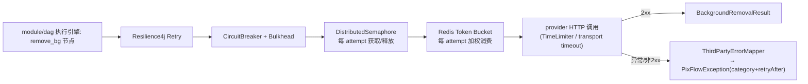

# infra/thirdparty —— 非模型第三方集成层（抠图 API + Redis 令牌桶 + Resilience4j，Wave 1 基础设施）

> 本文是 PixFlow 完整重写阶段 `infra/thirdparty` 模块的设计文档，对应 `design.md` 第四章「技术栈选型」（去背景=第三方 API、第三方韧性=Resilience4j）、第九章 §9.3「并发保障」、第十五章风险表，以及 `module-dependency-dag-plan.md` 的 **Wave 1 基础设施**。
> 范围：对**非模型、非电商平台**的外部 HTTP 服务做供应商无关封装——当前唯一落地集成是**背景去除（抠图）API**（remove.bg / 阿里云智能抠图）；附带单实例韧性治理（Resilience4j）、Redis 全局加权令牌桶、全局并发封顶、错误源头构造与可观测。
> 本文不涉及 MVP 既有实现，从新架构需求重新推导，按生产级标准设计。
> 依赖契约沿用 `common`（错误模型与脱敏）；全局并发与出站速率经 `infra/cache` 的 `DistributedSemaphore` + `DistributedTokenBucket`。

---

## 目录

- [一、文档定位与设计原则](#一文档定位与设计原则)
- [二、边界：什么进 thirdparty，什么不进](#二边界什么进-thirdparty什么不进)
- [三、模块结构与依赖位置](#三模块结构与依赖位置)
- [四、供应商路由：逻辑能力 → 具体 provider](#四供应商路由逻辑能力--具体-provider)
- [五、核心抽象](#五核心抽象)
- [六、调用管线：Retry → 每 attempt 准入 → HTTP → 错误映射](#六调用管线retry--每-attempt-准入--http--错误映射)
- [七、韧性治理（Resilience4j）](#七韧性治理resilience4j)
- [八、全局准入（infra/cache 信号量 + 令牌桶）](#八全局准入infracache-信号量--令牌桶)
- [九、错误归一化与源头构造](#九错误归一化与源头构造)
- [十、存储无感与图片传输](#十存储无感与图片传输)
- [十一、配置](#十一配置)
- [十二、可观测](#十二可观测)
- [十三、对其他模块的契约](#十三对其他模块的契约)
- [十四、与依赖 DAG 计划的差异说明](#十四与依赖-dag-计划的差异说明)
- [十五、测试策略](#十五测试策略)
- [十六、暂不考虑](#十六暂不考虑)

---

## 一、文档定位与设计原则

`infra/thirdparty` 在依赖 DAG 中处于 **Wave 1**，依赖 `common`（错误/脱敏）与 `infra/cache`（全局并发信号量），被 `module/dag` 的执行引擎消费（`remove_bg` 节点的派发，见 [§十三](#十三对其他模块的契约)、[§十四](#十四与依赖-dag-计划的差异说明)）。它和 `infra/storage` 封装 MinIO、`infra/ai` 封装 Spring AI 是同一性质——把某一类外部依赖的调用细节收口成供应商无关、可替换、带生产级韧性的能力接口。

> 边界澄清（与 `image.md §二` 一致）：`remove_bg` 虽在 DAG 像素工具白名单内，但它是第三方 HTTP 调用、不是本地栅格运算，**不归 `infra/image`**。`module/dag` 的执行引擎缝合一条 `remove_bg → set_background → resize` 支路时，调 `infra/thirdparty.removeBg(bytes)` 拿到抠图（带 alpha 的 PNG），再喂给 `infra/image` 的 `decode → setBackground → resize → encode`。因此 **thirdparty 的直接消费者是 `module/dag`，`infra/image` 不依赖 thirdparty**。

模块专属设计原则：

1. **只封非模型第三方，不做 Agent/业务编排**。本模块提供「调一次外部 HTTP 服务会发生什么」，不做 think-act-observe、不做 DAG 编排、不做结果落库。
2. **供应商无关**。请求/响应全是 thirdparty 自有的不可变 record，对上不暴露 remove.bg / 阿里云 SDK 的原始类型；换供应商只动配置与实现类，调用方零改动。
3. **韧性内建，源头带分类**。HTTP 调用一律经 Resilience4j（重试/熔断/舱壁/超时）与 Redis 令牌桶治理；本地额度不足、供应商限流、网络和供应商错误**在源头即构造**带 `category` + `retryAfter` 的 `PixFlowException`，让 retry 与上层尽早拿到 retryable 信息。
4. **存储无感**。本模块**不依赖 `infra/storage`**；图片内容（bytes / 预签名 URL）由调用方解析好再传入，结果字节回给调用方落 MinIO（对齐 `ai.md §10`）。
5. **全局并发与速率靠 cache，故障治理靠 Resilience4j**。`DistributedSemaphore` 封跨实例在途数，`DistributedTokenBucket` 封跨实例出站速率/相对成本，Resilience4j 只保留重试/熔断/舱壁/超时，不再维护单 JVM RateLimiter。
6. **与 ai 的重试各管一段**。本模块的 Resilience4j 只管**非模型**第三方（抠图）；模型调用级重试归 `infra/ai` 的 `ModelRetryRunner`；任务级重投归 `module/task` 的 MQ。三者不同模块、不同对象（`ai.md §7.3`）。

---

## 二、边界：什么进 thirdparty，什么不进

`design.md` 架构图把 `抠图API/VLLM/生图/文本LLM` 画进同一个「对外调用」方框，但那只是数据流示意；模块切分以 design §12「业务模块划分」与 `ai.md §7.3` 为准：

| 外部依赖 | 归属 | 理由 |
|---|---|---|
| 背景去除（抠图）API（remove.bg / 阿里云智能抠图） | **infra/thirdparty** | 无 Spring AI 抽象的纯 HTTP 服务 |
| 文本 LLM / 多模态 VLLM / 生图 / 嵌入 / 重排 | `infra/ai` | 走 Spring AI + Spring AI Alibaba，有自己的 `ModelRetryRunner` |
| 电商平台店铺数据 API | `module/commerce` | 业务数据接入，适配器在 commerce（design §8） |
| MinIO / RocketMQ / Redis / Qdrant | 各自 infra 模块 | 各有专门封装 |

所以本期 thirdparty 的**唯一具体集成是抠图**。模块设计成「非模型第三方 HTTP 集成框架 + 抠图首个落地」，结构上为未来新增同类第三方留位，但**不为想象中的扩展过度设计**。

---

## 三、模块结构与依赖位置

源码包：`com.pixflow.infra.thirdparty`

```
infra/thirdparty/
├── bgremoval/
│   ├── BackgroundRemovalClient.java     # 供应商无关接口：remove(req) -> result
│   ├── BackgroundRemovalRequest.java    # 图片 bytes + contentType + options（storage 无感）
│   ├── BackgroundRemovalResult.java     # 结果图 bytes + contentType + 元数据
│   ├── BackgroundRemovalOptions.java    # 输出格式、是否裁切、边缘羽化等供应商无关选项
│   ├── RoutingBackgroundRemovalClient.java  # 按配置选 provider 的门面
│   └── provider/
│       ├── RemoveBgClient.java          # remove.bg：multipart 上传 bytes
│       ├── AliyunMattingClient.java     # 阿里云智能抠图：同步 RPC / 异步任务轮询封在同步接口后
│       └── AliyunMarketBackgroundRemovalProvider.java # 阿里云市场去背景：submit/query POST JSON + nonce
├── resilience/
│   ├── ResilienceRegistry.java          # 每 provider 一套 Retry/CircuitBreaker/Bulkhead/TimeLimiter
│   ├── OutboundQuotaPolicy.java         # provider/api → bucket policy + attempt cost
│   └── ThirdPartyCallTemplate.java      # 每 attempt：bulkhead → semaphore → token bucket → HTTP
├── error/
│   ├── ThirdPartyErrorCode.java         # enum implements common.ErrorCode
│   └── ThirdPartyErrorMapper.java       # HTTP 状态/异常 → 带 category+retryAfter 的 PixFlowException
├── config/
│   ├── ThirdPartyProperties.java        # @ConfigurationProperties(pixflow.thirdparty)
│   └── ThirdPartyAutoConfiguration.java # 装配 HTTP client、provider bean、ResilienceRegistry、门面
└── observability/
    └── ThirdPartyMetrics.java           # Micrometer：latency / error / retry / cb 状态 / 在途许可
```

依赖方向：

```
infra/thirdparty ──► common（ErrorCode / PixFlowException / Sanitizer）
infra/thirdparty ──► infra/cache（DistributedSemaphore + DistributedTokenBucket）
infra/thirdparty ──► Resilience4j + HTTP client（传输与韧性实现）
module/dag ──► infra/thirdparty（执行引擎在 remove_bg 节点调 BackgroundRemovalClient，结果喂给 infra/image）
```

infra/thirdparty **不依赖** `infra/ai`（二者无关，见 [§十四](#十四与依赖-dag-计划的差异说明)）、**不依赖** `infra/storage`（图片内容由调用方传入）、**不依赖任何 harness/module/agent**。

新增 Maven 依赖（版本由父 `pom.xml` / Spring Boot BOM 统一管理，此处不锁定）：

```xml
<!-- Resilience4j：重试 / 熔断 / 舱壁 / 限速 / 超时 -->
<dependency>
    <groupId>io.github.resilience4j</groupId>
    <artifactId>resilience4j-spring-boot3</artifactId>
</dependency>
```

> HTTP 调用优先用 Spring 自带的 `RestClient`（Spring Boot 3）；阿里云抠图若用其官方 SDK，则封在 `AliyunMattingClient` 实现内，不外泄。

---

## 四、供应商路由：逻辑能力 → 具体 provider

调用方只面对**能力接口**（`BackgroundRemovalClient`），不关心当前是 remove.bg 还是阿里云。`RoutingBackgroundRemovalClient` 门面据配置 `pixflow.thirdparty.bg-removal.provider` 选取实际 provider 实现（对齐 `ai.md §4` 的 `ModelRouter` 思路）：

- 每个 provider 在配置里绑定 `{ endpoint, api-key, 默认参数 }`。
- 换供应商、调超时与韧性参数，只动 YAML，调用方零改动。
- 同一能力接口下可挂多个 provider 实现；本期默认 remove.bg，阿里云作为可切换替代。

> 本期只有「背景去除」一类能力，故只有一个能力接口。未来若新增同类第三方（如某种纯 HTTP 图像增强服务），按相同模式新增 `XxxClient` 接口 + provider 适配 + 路由门面，不在主链路加特例分支。

---

## 五、核心抽象

按消费者做接口隔离（同 `infra/ai` 把各能力分接口的风格）。本期只暴露背景去除一组。

### 5.1 BackgroundRemovalClient

```java
public interface BackgroundRemovalClient {
    BackgroundRemovalResult remove(BackgroundRemovalRequest req);   // 同步：抠图 worker 线程内调用
}

public record BackgroundRemovalRequest(
        byte[] image,                 // 必填：源图字节（调用方已从 MinIO 取出）
        String contentType,           // 如 image/jpeg、image/png
        BackgroundRemovalOptions options
) {}

public record BackgroundRemovalOptions(
        OutputFormat outputFormat,    // PNG（透明）/ 保持原格式；供应商无关枚举
        boolean crop,                 // 是否按前景裁切
        Integer featherRadius         // 可空：边缘羽化半径
) {
    public static BackgroundRemovalOptions defaults() { ... }
}

public record BackgroundRemovalResult(
        byte[] image,                 // 抠好的结果字节（通常带 alpha 的 PNG）
        String contentType,
        ThirdPartyUsage usage         // 可空：credits / 计费元数据，供观测
) {}
```

- **同步接口**：抠图在 DAG worker 的「图片×支路」线程内调用，同步语义最自然。若某 provider 是「提交任务 + 轮询」的异步模型（如部分阿里云能力），由该 provider 实现把轮询封在同步接口后面，对上仍是一次 `remove`。
- **无 MinIO 概念**：入参是 bytes，出参是 bytes；落 MinIO 与喂给 `infra/image` 的缝合是 `module/dag` 的事。
- HITL 确认、令牌与本模块无关：抠图是确定性像素工具，Agent 工具层只提交 `submit_image_plan` / `submit_imagegen_plan` 提案；真实执行经确认 REST 边界触发后，thirdparty 被调到即执行。

### 5.2 ThirdPartyUsage

```java
public record ThirdPartyUsage(Integer creditsCharged, Map<String,Object> raw) {}
```

仅承载供应商回传的计费/用量元数据，供 `ThirdPartyMetrics` 观测；不参与业务流程。

---

## 六、调用管线：Retry → 每 attempt 准入 → HTTP → 错误映射

每次第三方调用走统一管线（`ThirdPartyCallTemplate`）。`Retry` 是最外层调用控制；**信号量和令牌桶必须在 attempt 内部**，保证每次真实 provider 尝试都重新准入，退避期间不占许可：

```
Retry(
  CircuitBreaker(
    Bulkhead(
      attempt:
        acquire DistributedSemaphore(sem:thirdparty:{provider}:{api})
        tryConsume DistributedTokenBucket(bucket:thirdparty:{provider}:{api}, costPerAttempt)
        TimeLimiter(httpCall)
        release semaphore
    )
  )
)
→ 成功：映射为 BackgroundRemovalResult
→ 失败：ThirdPartyErrorMapper 源头构造 PixFlowException(category + retryAfter)
```



准入顺序固定为 `Bulkhead → DistributedSemaphore → DistributedTokenBucket → HTTP`。令牌桶不等待；额度不足立即返回 `retryAfter`，随后释放已获取的 semaphore/bulkhead permit。将令牌消费放在 semaphore 之后，可避免本次 attempt 因并发许可获取失败而白白扣费。进入 HTTP 后即使网络失败也视为一次真实 attempt，令牌不返还。

---

## 七、韧性治理（Resilience4j）

每个 provider 一套独立的 Resilience4j 实例集（互不影响），由 `ResilienceRegistry` 按 provider 名装配：

| 组件 | 作用 | 默认（可配） |
|---|---|---|
| `Retry` | 仅对 retryable（NETWORK/PROVIDER/RATE_LIMIT）退避重试；供应商给 `Retry-After` 时优先采用 | maxAttempts=3，指数退避 base 500ms / cap 8s |
| `CircuitBreaker` | 失败率超阈值熔断，快速失败保护下游与自身 | failureRateThreshold=50%，滑窗 20，开断 30s |
| `Bulkhead` | 进程内并发隔离，防单一第三方耗尽线程 | maxConcurrent 与全局信号量许可对齐或略小 |
| `TimeLimiter` | 单次调用超时，避免长挂 | 30s |

要点：

- **重试判定只看 `category`/`retryable`**（来自 `ThirdPartyErrorMapper`），不在重试逻辑里 `instanceof` 具体异常（对齐 `error-handling-architecture.md` 重试下沉理念）。本地桶拒绝与 provider 429 都是 `RATE_LIMIT/RETRY`，但错误码和来源必须区分。
- **不可重试错误**（鉴权 401/403、图片非法 4xx）直接终态上抛，不浪费重试与熔断额度。
- **熔断打开**时调用快速失败，映射为 `category=PROVIDER`（`recovery=SKIP`），交上层 `FailureIsolator` 把该支路隔离（design §9.4），不拖垮整批。
- CircuitBreaker 的失败率只统计真实网络/超时/5xx；本地桶拒绝、信号量拒绝和 provider 429 不计为可用性故障，避免因正常配额耗尽错误开断。
- 与 cache 分工明确：信号量管「集群级在途总数」，令牌桶管「集群级出站速率/相对成本」，Resilience4j 管「retry/circuit/bulkhead/timeout」。

---

## 八、全局准入（infra/cache 信号量 + 令牌桶）

第三方 API（抠图）成本与配额敏感，需同时封顶跨实例在途数与出站速率。本模块直接依赖 `infra/cache` 的两个通用原语：

- 调用前 `DistributedSemaphore.acquire(key, permits, waitTime)` 拿全局许可（`Permit` 为 `AutoCloseable`，try-with-resources 自动释放）。
- 信号量键由 thirdparty 构造为 `sem:thirdparty:{provider}:{api}`；获取失败按依赖错误上抛。
- 令牌桶键为 `bucket:thirdparty:{provider}:{api}`。每个 attempt 调 `tryConsume(policy, costPerAttempt)`；拒绝时映射为 `THIRDPARTY_LOCAL_RATE_LIMITED`，保留 decision 的 `retryAfter`。
- Redis/Lua 故障映射为 `THIRDPARTY_QUOTA_UNAVAILABLE`（DEPENDENCY/RETRY），**fail-closed**，不得退化为本机桶或直接放行。
- policy 与 cost 归 `pixflow.thirdparty.*` 配置；cache 不理解 provider/api。V1 抠图默认每次 attempt 消费 1 个权重令牌。
- 许可总数与该 API 的全局并发上限对齐，由 cache 侧 `pixflow.cache.semaphore.{api}.permits` 配置（`cache.md §十二`）。
- Redisson 实现选 `RPermitExpirableSemaphore`（许可带租约，持有者崩溃自动回收，`cache.md §4.5`），避免许可永久泄漏。
- 获取许可失败按 `cache.md §八`「信号量上抛」——映射为 `DEPENDENCY`/RETRY 由上层决策，不静默放行（放行会冲垮第三方）。

> 与 `infra/ai §9` 的差异：thirdparty 的依赖 DAG 已授权直连 cache，因此直接消费两个原语；ai 通过自有 SPI 在组合根接 Redis adapter，避免 ai 反向依赖 cache。两条路径最终共享同一个 Redis token-bucket 实现。

---

## 九、错误归一化与源头构造

按 `common.md §10` 混合策略，thirdparty 与 ai 同属「源头即构造」一类（不像 storage/cache 保留独立异常到边界再翻译），因为 Resilience4j 重试判定需尽早拿到 retryable 信息。`ThirdPartyErrorCode implements common.ErrorCode`（仿 `AiErrorCode`/`MqErrorCode`）。

`ThirdPartyErrorMapper` 把 provider HTTP 状态 / 异常映射为分类：

| 供应商情形 | ThirdPartyErrorCode | category | recovery | retryAfter |
|---|---|---|---|---|
| 429 / 限流 / 配额超限 | `THIRDPARTY_RATE_LIMITED` | RATE_LIMIT | RETRY | 解析 `Retry-After` |
| Redis 本地策略桶额度不足 | `THIRDPARTY_LOCAL_RATE_LIMITED` | RATE_LIMIT | RETRY | 使用 token-bucket decision |
| Redis/Lua 令牌桶不可用 | `THIRDPARTY_QUOTA_UNAVAILABLE` | DEPENDENCY | RETRY | 使用基础依赖退避 |
| 连接失败 / 读超时 | `THIRDPARTY_NETWORK_ERROR` | NETWORK | RETRY | - |
| 5xx / 非法响应体 | `THIRDPARTY_PROVIDER_ERROR` | PROVIDER | RETRY | - |
| 熔断器打开（快速失败） | `THIRDPARTY_CIRCUIT_OPEN` | PROVIDER | SKIP | - |
| 图片非法 / 参数错误（4xx 业务） | `THIRDPARTY_INVALID_REQUEST` | VALIDATION | TERMINATE | - |
| 401 / 403 鉴权失败 | `THIRDPARTY_AUTH_ERROR` | PROVIDER | TERMINATE | - |

- Resilience4j 据 `category`/`retryable` 决策：RATE_LIMIT/NETWORK/PROVIDER 可重试，鉴权/参数非法不重试。
- 落盘/对外文案前经 `common` 的 `Sanitizer` 脱敏：API key、Bearer、阿里云 AK/SK 一律遮蔽，**禁止入日志**。
- 跨出 infra 边界已是 `PixFlowException`，`ErrorNormalizer` 直接透传（`common.md §5.5`）。
- `recovery=SKIP`（熔断/供应商错误重试耗尽）让支路 `status=2` 被隔离，其余图片/支路继续（design §9.4，`common.md §6.4`）。

---

## 十、存储无感与图片传输

- **不依赖 `infra/storage`**：`BackgroundRemovalRequest` 收的是图片字节，调用方（`module/dag` 执行引擎）先用 `ObjectStorage` 从 MinIO 取出再传入；结果字节由调用方喂给 `infra/image` 或落 `RESULTS`/`TMP` 桶。保持 thirdparty 对存储无感、可独立测试（对齐 `ai.md §10`）。
- **传输方式由 provider 适配器决定**：
  - remove.bg：`multipart/form-data` 上传图片字节。
  - 阿里云智能抠图：依其接口要求传 base64 或可公网访问的 URL；若需 URL，由调用方传入预签名 URL（thirdparty 仍不碰 MinIO，只转发），具体编码封在 `AliyunMattingClient` 内。
  - 阿里云市场去背景：`POST /api/v1/bg-remove/submit` 提交公网图片 URL，读取 `result_key` 后用 `POST /api/v1/bg-remove/query` 轮询；每次请求由 provider 动态生成 `X-Ca-Nonce`，对上仍表现为一次同步 `BackgroundRemovalClient.remove(...)`。
- **大小约束**：抠图源图为商品图，体积可控；provider 适配器对超过供应商上限的图片在源头构造 `THIRDPARTY_INVALID_REQUEST`（VALIDATION/TERMINATE），不发起无意义调用。

---

## 十一、配置

`@ConfigurationProperties(prefix = "pixflow.thirdparty")`：

```yaml
pixflow:
  thirdparty:
    bg-removal:
      default-provider: removebg          # removebg | aliyun-market，切供应商只动此处
    providers:
      removebg:
        type: removebg
        enabled: true
        endpoint: https://api.remove.bg/v1.0/removebg
        auth:
          type: api-key
          properties:
            header: X-Api-Key
            value: ${REMOVEBG_API_KEY:}   # 敏感：环境变量注入，禁止入日志
      aliyun-market:
        type: aliyun-market-bgrem
        enabled: true
        endpoint: https://bgrem.market.alicloudapi.com
        auth:
          type: header
          properties:
            header: Authorization
            value: APPCODE ${ALIYUN_BGREM_APPCODE:}
        model-type: general               # general | human
        polling:
          submit-path: /api/v1/bg-remove/submit
          status-path: /api/v1/bg-remove/query
          timeout: 30s
          interval: 1s
    resilience:                           # Resilience4j：不再包含 RateLimiter
      max-attempts: 3
      base-delay: 500ms
      max-delay: 8s
      bulkhead-max-concurrent: 8
      timeout: 30s
    outbound-quota:                       # provider attempt 级 Redis 令牌桶策略
      removebg:
        bg-removal:
          capacity: 20
          refill-tokens: 10
          refill-period: 1s
          idle-ttl: 10m
          cost-per-attempt: 1
    # 全局并发许可总数仍在 pixflow.cache.semaphore.*；令牌桶 policy 归本模块
```

- 凭证（api-key / AK / SK）经 `Sanitizer` 遮蔽，不入日志、不入 trace。
- 全局并发许可数归属 `infra/cache` 配置；令牌桶 capacity/refill/cost 是 provider 策略，归 thirdparty 配置。两者不是同一个上限，不得复用字段。

---

## 十二、可观测

- **Micrometer 指标**：
  - `pixflow.thirdparty.call{provider, api, result=ok|error}` 计数与延迟计时。
  - `pixflow.thirdparty.retry{provider, api}` 重试次数。
  - `pixflow.thirdparty.circuit{provider, state}` 熔断器状态。
  - `pixflow.thirdparty.semaphore{api}` 在途许可 gauge（与 `cache.md §11.2` 的 `pixflow.cache.semaphore` 一致，二者可对照）。
  - `pixflow.thirdparty.quota{provider, api, result=allowed|rejected|error}` 令牌桶决策；不使用 taskId/imageId/userId 等高基数 tag。
  - `pixflow.thirdparty.credits{provider}`（如供应商回传）观测成本水位。
- **不放高基数 tag**（如 taskId/imageId）；按 provider/api 聚合。
- 失败原因日志经 `Sanitizer` 脱敏后落 error 日志；指标 tag 不含凭证或高基数值。
- traceId：抠图调用在同步任务链路内，Micrometer Tracing 自动覆盖，无需像 `infra/mq` 那样手动透传。

---

## 十三、对其他模块的契约

| 模块 | 契约 |
|---|---|
| `common` | thirdparty 源头构造带 `category`+`retryAfter` 的 `PixFlowException`；`ThirdPartyErrorCode implements ErrorCode`；文案经 `Sanitizer` |
| `infra/cache` | 直接消费 `DistributedSemaphore` 与 `DistributedTokenBucket`；信号量获取和桶故障 fail-closed，正常额度不足保留 `retryAfter` |
| `module/dag` | **唯一直接消费方**：执行引擎在 `remove_bg` 节点调 `BackgroundRemovalClient.remove`，传入从 MinIO 取出的源图字节，拿回结果字节喂给 `infra/image`（decode→setBackground→…）或落桶 |
| `infra/image` | **无依赖关系**：`remove_bg` 是第三方 HTTP 调用、非本地栅格运算，image 不碰 thirdparty；二者经 dag 间接协作（`image.md §二`/§契约表） |
| `infra/ai` | **无依赖关系**：抠图非模型调用，ai 与 thirdparty 各管一段（`ai.md §7.3`） |
| `harness/eval` | thirdparty 指标并入运维面板；错误经 common 链路落 trace |

**反向约束**：thirdparty 对 harness/module/agent 零依赖；对 storage/ai 零依赖；仅向下依赖 common + cache。

---

## 十四、与依赖 DAG 计划的差异说明

`module-dependency-dag-plan.md` 的依赖图与本设计有两处出入，已在相应文档同步修订，记录如下：

1. **消费者：`thirdparty → tools` 应为 `dag → thirdparty`**。`remove_bg` 是 **DAG 级像素工具**（design §5.2 白名单），不是 Agent 级工具；且它是第三方 HTTP 调用、非本地栅格运算，按 `image.md §二` 的工具归属表归 `infra/thirdparty` 而非 `infra/image`。由 `module/dag` 的执行引擎在 `remove_bg` 节点调 `BackgroundRemovalClient`、把结果喂给 `infra/image`。因此真正依赖 `infra/thirdparty` 的是 **`module/dag`**，`infra/image` 与 `harness/tools` 都不依赖 thirdparty（`harness/tools` 的「handler 用 Resilience4j 包裹」针对 Agent 级工具 handler，与 thirdparty 内部第三方 HTTP 韧性是两件事）。
2. **`ai → thirdparty` 这条边应删除**。`ai.md` 确立 `infra/ai` 只依赖 `common`，且 §7.3 明说 ai 与 thirdparty「不同模块、不同对象」。thirdparty 不需要 ai，ai 也不依赖 thirdparty。thirdparty 的依赖应为 **`common` + `infra/cache`**。

> 修订动作：在 `module-dependency-dag-plan.md` 中删除 `ai --> thirdparty` 与 `thirdparty --> tools`，新增 `thirdparty --> dag`（即 dag 依赖 thirdparty），并把 Wave 表中 thirdparty 的依赖由「ai + cache」改为「cache」。thirdparty 仍在 Wave 1（依赖 cache，排在 cache 之后）；`module/dag` 仍在 Wave 3，其依赖补上 thirdparty。`infra/image` 保持仅依赖 common、与 thirdparty 无直接依赖。

---

## 十五、测试策略

- **能力接口契约**：以 MockWebServer / WireMock 桩 provider HTTP，验证 `RemoveBgClient` / `AliyunMattingClient` / `AliyunMarketBackgroundRemovalProvider` 的请求投影（multipart / 编码 / submit-query POST JSON + nonce）与响应映射为 `BackgroundRemovalResult`。
- **路由**：`RoutingBackgroundRemovalClient` 按配置选对 provider；切配置切实现。
- **韧性**：注入瞬时失败断言 `Retry` 重试后成功；持续失败断言 `CircuitBreaker` 打开后快速失败；`TimeLimiter` 超时触发；`Retry-After` 优先于退避公式。
- **每 attempt 准入**：两次 provider attempt 必须消费两次令牌、分别获取/释放 semaphore；退避期间 semaphore 在途数为 0；本地桶拒绝不执行 HTTP 且不计入 CircuitBreaker 失败率。
- **配额错误**：额度不足保留 `retryAfter` 并可被 Retry 消费；Redis 故障 fail-closed；provider 429 与本地桶拒绝使用不同 errorCode。
- **错误映射**：429/5xx/超时/鉴权/4xx 非法 → 对应 `ThirdPartyErrorCode` + category + recovery + retryAfter；熔断打开 → `THIRDPARTY_CIRCUIT_OPEN`(SKIP)。
- **全局并发**：注入 fake/真实（Testcontainers Redis）`DistributedSemaphore` 断言取/释许可、许可耗尽时等待/上抛；许可在 try-with-resources 后释放。
- **脱敏**：含 api-key / AK-SK 的异常与日志样本经 `Sanitizer` 后无凭证泄露。
- **错误码目录**：`ThirdPartyErrorCode` code 全局唯一、i18n 文案齐全、category 非空（并入 `common` 启动期聚合测试）。
- **集成（可选，按环境跳过）**：对真实 remove.bg 端点跑一次抠图冒烟，CI 无凭证时跳过；纯单测保证最低覆盖。

---

## 十六、暂不考虑

- **抠图结果去重缓存**：DAG 支路幂等 + `process_result` checkpoint 已覆盖重跑（design §9.4），无需在 thirdparty 缓存结果；待出现明确成本瓶颈再评估。
- **用户级 HTTP 入站防滥用 / 每日费用预算 / 供应商账单对账**：这里限制的是 provider attempt。没有 owner/tenant 上下文时不得伪造“按用户限流”能力。
- **本地抠图模型**：design 明确去背景用第三方 API、无本地模型；不做本地推理回退。
- **纯文生图 / 模型类第三方**：归 `infra/ai`，不进本模块。
- **电商平台数据 API**：归 `module/commerce`，不进本模块。
- **多 provider 智能路由 / 成本路由 / 自动降级换供应商**：本期 provider 由静态配置选定，不做运行时智能调度。

## Revision Notes

2026-07-11 / Codex: 删除目标设计中的 resilience4j 单 JVM RateLimiter，改由 `infra/cache` Redis Lua 加权令牌桶承担集群级出站速率/相对成本。固定 `Retry -> CircuitBreaker -> Bulkhead -> 每 attempt(semaphore -> token bucket -> HTTP)` 顺序，区分本地桶拒绝、provider 429 与 Redis 故障，并明确每个 retry attempt 都重新消费、退避期间不持有 semaphore。
