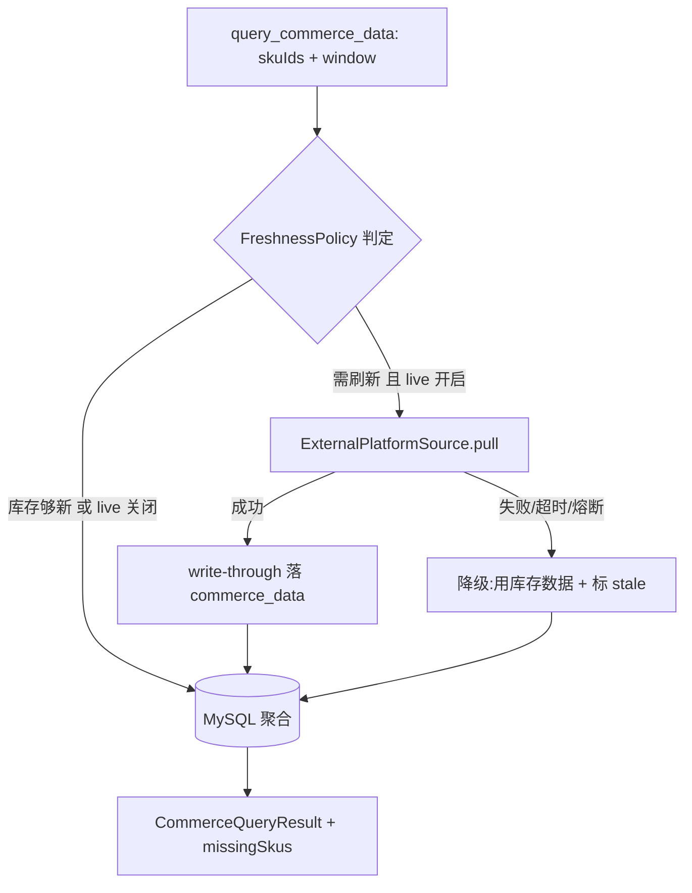

# module/commerce —— 电商数据接入层（导入 + 实时查询 + 类目基准，Wave 2）

> 本文是 PixFlow 完整重写阶段 `module/commerce` 模块的设计文档，对应 `design.md` 第八章「电商数据接入层」、§6.1 数据支撑说明、§13.1 数据模型，以及 `module-dependency-dag-plan.md` 的 **Wave 2**。
> 范围：本地数据集导入（CSV/Excel）、按 SKU 的电商指标查询与**类目基准对比**、时间窗口/趋势聚合、外部店铺数据 API 的**实时查询 + 导入**适配（适配器模式）。
> 本文不涉及 MVP 既有实现，从新架构需求重新推导。参考模块文档范式见 `module/memory.md`、`base/common.md`。

---

## 目录

- [一、文档定位与设计原则](#一文档定位与设计原则)
- [二、模块结构与依赖位置](#二模块结构与依赖位置)
- [三、职责分解](#三职责分解)
- [四、数据模型](#四数据模型)
- [五、导入管线](#五导入管线)
- [六、查询与分析层](#六查询与分析层)
- [七、外部数据源适配（实时查询 + 导入）](#七外部数据源适配实时查询--导入)
- [八、query_commerce_data 工具契约](#八query_commerce_data-工具契约)
- [九、一致性与重建](#九一致性与重建)
- [十、配置](#十配置)
- [十一、错误与降级](#十一错误与降级)
- [十二、对其他模块的契约](#十二对其他模块的契约)
- [十三、测试策略](#十三测试策略)
- [十四、对 design.md 的细化](#十四对-designmd-的细化)
- [十五、暂不考虑](#十五暂不考虑)

---

## 一、文档定位与设计原则

`module/commerce` 处于依赖 DAG 的 **Wave 2**，是一个**纯业务数据模块**：依赖 `common`（错误归一化/脱敏）+ MySQL（MyBatis-Plus）+ POI/commons-csv（文档解析）；实时查询适配器额外用 Spring `RestClient` + Resilience4j（库依赖，非模块依赖）。被 `agent` 决策层（`query_commerce_data` 动作）消费；与 `module/rubrics`、`module/memory`（`sku_history.metrics_before/after`）在数据语义上相关，但**无代码依赖**。

> `infra/thirdparty.md §十五` 与 `permission.md` 已明确：**电商平台数据 API 适配器归 `module/commerce`，不进 `infra/thirdparty`**（thirdparty 只封非模型、无业务语义的第三方）。commerce 的外部数据源是有业务语义的数据接入，自带适配与韧性。

模块专属设计原则：

1. **commerce 是「数据 + 描述性分析」，不做决策**。它产出结构化的指标、类目基准、偏离与趋势这类**客观事实**；要不要白底处理、要不要重绘是 `agent` 的判断。commerce 永远不输出处理建议。
2. **MySQL 为唯一事实源与基准聚合源**。无论数据来自本地导入还是外部 API 实时拉取，一律 **write-through 落 `commerce_data`**；`query_commerce_data` 的类目均值/趋势永远基于 MySQL 聚合，不在内存里跨源拼算。
3. **实时性靠新鲜度策略，不靠实时穿透**。`query_commerce_data` 在 agent 同步回合内执行（秒级），外部 API 调用必须有紧超时 + 失败降级到库存数据，**绝不让第三方抖动阻塞或拖垮主循环回合**。
4. **数据源可替换**。对内统一 `CommerceDataSource` 端口：本期 `LocalDatasetSource`（导入落库），预留/可启用 `ExternalPlatformSource`（真实平台 API）。换平台只动实现与配置，查询/分析层零改动。
5. **导入容错、可观测**。行级校验失败跳过并记录（`ImportReport`），不让单个坏行炸掉整批；导入幂等（自然键 upsert），重复导入不污染均值。
6. **数据诚实**。无数据的 SKU 在查询结果里**显式列出**（`missingSkus`），避免 agent 对没有数据支撑的 SKU 编造结论。

---

## 二、模块结构与依赖位置

源码包：`com.pixflow.module.commerce`

```
module/commerce/
├── CommerceService.java               # 对外门面：importData(...) + query(...)
├── importer/
│   ├── CommerceImportService.java     # 导入管线编排
│   ├── CommerceFileParser.java        # 接口：嗅探格式后选实现
│   ├── CsvCommerceParser.java         # commons-csv 实现
│   ├── ExcelCommerceParser.java       # POI 实现（xlsx）
│   ├── ColumnMapping.java             # 表头/列序 → 字段映射（可配，容忍中英文表头）
│   ├── RowValidator.java              # 行级校验（sku 非空 / 比率∈[0,1] / 日期可解析）
│   ├── RawCommerceRow.java            # 解析中间态（全字符串，不提前转型）
│   └── ImportReport.java              # 总数/成功/跳过/失败明细（行号+原因）
├── query/
│   ├── CommerceQueryService.java      # 单/批量查询 + 类目基准 + 窗口 + 趋势
│   ├── CommerceQuery.java             # record(skuIds, window, withBenchmark, withTrend)
│   ├── CommerceQueryResult.java       # perSku[] + missingSkus[]
│   ├── SkuMetrics.java                # 单 SKU 指标 + benchmark + trend DTO
│   ├── TimeWindow.java                # record(from, to)；默认近 30 天
│   └── BenchmarkCalculator.java       # 类目均值/偏离百分比（纯算法，单测）
├── source/
│   ├── CommerceDataSource.java        # SPI 端口：pull(PullSpec)
│   ├── LocalDatasetSource.java        # 本期默认：读已落库数据
│   ├── ExternalPlatformSource.java    # 实时：平台 API 适配（RestClient + Resilience4j）
│   ├── PlatformApiClient.java         # 平台 HTTP 客户端（供应商无关 record 出入参）
│   └── FreshnessPolicy.java           # 新鲜度判定：库存够新则不打 API
├── store/
│   ├── CommerceData.java              # 实体（MyBatis-Plus）
│   └── CommerceDataMapper.java        # CRUD + 聚合 SQL（类目均值/趋势）
├── error/
│   └── CommerceErrorCode.java         # enum implements common.ErrorCode
└── config/
    └── CommerceProperties.java        # @ConfigurationProperties(pixflow.commerce)
```

依赖方向：`commerce → common`（+ MySQL/MyBatis-Plus + POI/commons-csv）。实时数据源用 Resilience4j + RestClient（库）。

> **关于 `infra/cache` 依赖**：本期 `ExternalPlatformSource` 的并发治理用 Resilience4j 单实例（bulkhead/ratelimiter/timelimiter）。若未来需要**集群级**对平台 API 的全局并发上限，复用 `infra/cache` 的 `DistributedSemaphore`（与 `infra/thirdparty` 同一机制）——这会新增 `cache → commerce` 依赖边，须同步更新 `module-dependency-dag-plan.md` 的 DAG。本期不引入，保持 Wave 2 依赖最小（见 [§十五](#十五暂不考虑)）。

---

## 三、职责分解

| 职责 | 子组件 | 说明 |
|---|---|---|
| **数据导入** | `importer/*` | CSV/Excel → 校验 → 幂等 upsert，产 `ImportReport` |
| **查询与分析** | `query/*` | 按 SKU（单/批）查指标，算类目基准、偏离、时间窗口、趋势 |
| **数据源适配** | `source/*` | 本地库存源 + 外部平台实时源，统一 `CommerceDataSource`；write-through 落库 |
| **存储** | `store/*` | `commerce_data` 实体 + 聚合 SQL |

边界再强调：commerce **不**做 think-act-observe、不做处理建议、不碰 DAG/MQ/harness。它只回答「这些 SKU 的客观电商表现是什么、相对类目如何」。

---

## 四、数据模型

### 4.1 MySQL `commerce_data`

对 `design.md §13.1` 的 `commerce_data`（原字段 `id, sku_id, impressions, ctr, add_cart_rate, purchase_rate, period, created_at`）做**细化**：补 `category`（决策 A：SKU→类目随数据进来）、把单字段 `period` 拆为结构化时间维度、补 `source`/`fetched_at`/`updated_at`（支持多源与新鲜度判定）。细化登记见 [§十四](#十四对-designmd-的细化)。

| 字段 | 类型 | 说明 |
|---|---|---|
| `id` | BIGINT PK | 自增主键 |
| `sku_id` | VARCHAR | 商品 SKU 标识 |
| `category` | VARCHAR | **新增**：类目（类目均值的 group by 维度）；随数据进来（决策 A） |
| `impressions` | BIGINT | 曝光量（≥0） |
| `ctr` | DECIMAL(6,4) | 点击率 [0,1] |
| `add_cart_rate` | DECIMAL(6,4) | 加购率 [0,1] |
| `purchase_rate` | DECIMAL(6,4) | 购买率 [0,1] |
| `period_type` | VARCHAR | **新增**：DAY / WEEK / MONTH（统计粒度枚举） |
| `period_start` | DATE | **新增**：统计区间起（含） |
| `period_end` | DATE | **新增**：统计区间止（含） |
| `source` | VARCHAR | **新增**：数据来源（`LOCAL_IMPORT` / `EXTERNAL_API:{platform}`） |
| `fetched_at` | DATETIME | **新增**：导入/拉取时刻（新鲜度判定用） |
| `created_at` | DATETIME | 落库时间 |
| `updated_at` | DATETIME | **新增**：upsert 更新时间 |

**幂等自然键（唯一索引）**：`uk_commerce_natural = (sku_id, period_type, period_start, source)`。

- `category` 不入自然键，作为**可 upsert 的属性**：同一 SKU 不同行类目不一致时，导入期做软一致性检查并在 `ImportReport` 记 warn（取最后一次为准），不阻断（呼应决策 A 接受的约束）。
- 重复导入同一文件 → 命中自然键 upsert 覆盖（更新指标 + `updated_at`/`fetched_at`），**不追加重复行**，避免污染类目均值。

**索引**：
- `uk_commerce_natural`（幂等 + 单 SKU 精确查）。
- `idx_category_period = (category, period_type, period_start)`（类目均值聚合 + 窗口过滤下推）。
- `idx_sku_period = (sku_id, period_start)`（趋势序列读取）。

### 4.2 时间维度语义

- 每行 = 「某 SKU 在某粒度某区间」的指标快照。
- **时间窗口**（如「近 30 天」）= `period_end >= :from AND period_start <= :to` 的行集合。
- **趋势** = 同 SKU 在窗口内按 `period_start` 升序的指标序列。
- 跨粒度混用由查询层约束：基准与趋势在**同一 `period_type`** 内计算（默认取窗口内最细可用粒度，或由查询显式指定），避免日/月口径混算。

---

## 五、导入管线

CSV 走 commons-csv，xlsx 走 POI。生产级关注点是**幂等、行级容错、批量、可观测**。`CommerceImportService` 编排：

```
上传文件（或外部源拉取的标准化记录）
  → 嗅探格式(csv/xlsx) → 选 CommerceFileParser 实现
  → 逐行解析为 RawCommerceRow（全字符串，不提前转型）
  → ColumnMapping：表头/列序 → 字段（容忍中英文表头，如「曝光量/impressions」）
  → RowValidator 行级校验：
        sku_id 非空；impressions≥0；ctr/add_cart_rate/purchase_rate ∈ [0,1]；
        period_type 合法枚举；period_start/end 可解析且 start≤end
  → 失败行：收集 RowError(行号 + 原因)，跳过，不中断整批
  → 通过行：规整为 CommerceData + 计算自然键 + category 软一致性检查
  → 批量 upsert（saveOrUpdateBatch / ON DUPLICATE KEY，按自然键）
  → 返回 ImportReport{ total, succeeded, skipped, failures[] }
```

要点：

- **幂等**：自然键 upsert，重复导入同一文件覆盖而非追加。
- **部分失败 = SKIP 语义**：单行校验失败跳过并记录（对齐 `common.md` 的 `RecoveryHint.SKIP`），整批仍提交成功行；解析器/文件级不可恢复错误（文件损坏、无法识别格式）才抛 `VALIDATION` 终止整次导入。
- **列映射可配**：`ColumnMapping` 支持表头名映射与列序映射两种模式，默认表头名优先；表头缺失必填列 → 整次导入 `VALIDATION` 失败（带缺失列名 `details`）。
- **批量**：分批 flush（默认 500 行/批），控制内存与事务大小。
- **错误文案脱敏**：`ImportReport.failures` 文案经 `common` 的 `Sanitizer` 截断（≤1000 字），不回显敏感路径。

---

## 六、查询与分析层

`design.md §6.1` 要求「关联**本批** SKU 电商数据」并产出「类目均值对比」式数据支撑——所以是**批量查询 + 类目基准**，不是单 SKU 裸查。

### 6.1 查询契约

```java
record CommerceQuery(
    List<String> skuIds,      // 本批 SKU
    TimeWindow window,        // 默认近 30 天
    boolean withBenchmark,    // 是否算类目基准对比
    boolean withTrend         // 是否返回趋势序列
) {}

record CommerceQueryResult(
    List<SkuMetrics> perSku,  // 每个有数据的 SKU
    List<String> missingSkus  // 窗口内无任何数据的 SKU，显式列出
) {}

record SkuMetrics(
    String skuId,
    String category,
    Metrics aggregated,       // 窗口内聚合指标（曝光合计 / 各率加权或均值）
    Benchmark benchmark,      // 可空（withBenchmark=false 时）
    List<TrendPoint> trend    // 可空（withTrend=false 时）
) {}

record Benchmark(
    Metrics categoryAverage,  // 同类目同窗口均值
    Deviation deviation       // 该 SKU 相对均值的偏离百分比（按指标）
) {}
```

### 6.2 聚合规则

- **单 SKU 窗口聚合**：曝光量求和；点击率/加购率/购买率按**曝光加权平均**（避免简单算术均值在不同曝光量级下失真）。聚合在 SQL 完成。
- **类目均值**：`AVG`/加权聚合 `WHERE category=? AND period_type=? AND 窗口` GROUP BY category，**SQL 层算，不取回内存**。
- **偏离**：`BenchmarkCalculator`（纯算法，单测覆盖）算 `(skuValue - categoryAvg) / categoryAvg`，输出带符号百分比。类目样本数过小（< 配置阈值）时 `benchmark` 置空并标 `insufficientSample`，agent 据此不强行对比。
- **趋势**：`idx_sku_period` 读同 SKU 窗口内按 `period_start` 升序序列。
- **`missingSkus`**：查询的 skuIds 中窗口内无任何行的，显式回填，保证数据诚实（[§一](#一文档定位与设计原则) 原则 6）。

### 6.3 与实时源的协作

`CommerceQueryService` 先经 `FreshnessPolicy` 判定是否需要实时刷新被查 SKU（见 [§七](#七外部数据源适配实时查询--导入)）：刷新成功 write-through 落库后，**所有聚合仍统一从 MySQL 读**——保证基准计算口径一致、可重算。

---

## 七、外部数据源适配（实时查询 + 导入）

外部店铺数据 API 既是**导入源**，也是**实时查询源**。两种用法共用同一适配器，统一 write-through 落 `commerce_data`，使查询/基准始终基于 MySQL。

### 7.1 端口与实现

```java
interface CommerceDataSource {
    List<CommerceData> pull(PullSpec spec);   // 按 SKU/窗口拉取标准化指标
    boolean supportsLive();                   // 是否支持实时拉取
}
```

- `LocalDatasetSource`（本期默认）：不打外部网络，数据来自导入落库；`supportsLive()=false`。
- `ExternalPlatformSource`（可启用）：适配真实平台 API；`supportsLive()=true`。供应商无关——`PlatformApiClient` 出入参是 commerce 自有不可变 record，不泄漏平台 SDK 原始类型，换平台只动实现 + 配置。

### 7.2 实时查询时序（不阻塞主循环）



关键约束：

- **新鲜度策略**：`FreshnessPolicy` 按 `fetched_at` 与配置 TTL 判定。库存数据在 TTL 内 → 直接走 MySQL，不打 API；过期或缺失且 `live-enabled` → 尝试实时拉取被查 SKU。**只刷新被查 SKU**，不做全量同步。
- **紧超时 + 降级**：实时拉取经 Resilience4j（Retry/CircuitBreaker/Bulkhead/RateLimiter/**TimeLimiter** 紧超时，默认 ≤2s）。失败/超时/熔断打开 → **降级用库存数据**（即使过期），结果标 `stale=true`；库存也无 → 计入 `missingSkus`。**任何外部故障都不抛到 agent 主循环、不拖慢回合**。
- **源头带分类**：`PlatformApiClient` 按 `common.md §10` 混合策略，在源头构造带 `category`（RATE_LIMIT/NETWORK/PROVIDER）+ `retryAfter` 的 `PixFlowException`，供 Resilience4j 与降级逻辑判定；这些异常**在 commerce 内部被降级消费**，不外泄。
- **write-through 一致性**：实时结果先落 MySQL（同自然键 upsert，`source=EXTERNAL_API:{platform}`、刷新 `fetched_at`），再参与聚合。类目均值因此可能混合「被查 SKU 的实时值 + 其余 SKU 的库存值」——这是可接受的、并在结果里以 `benchmark` 的样本时效暗示；需要严格同口径时由 `FreshnessPolicy` 配置关闭实时、走纯库存快照。

### 7.3 批量导入用法

`ExternalPlatformSource` 也可被 `CommerceImportService` 当作导入源：定时/手动触发 `pull(全量或增量 spec)` → 走 [§五](#五导入管线) 的校验 + 幂等 upsert 落库。实时查询与批量导入复用同一适配器与落库路径。

---

## 八、query_commerce_data 工具契约

`design.md` 的 `query_commerce_data` Agent 级动作落为 `CommerceService.query(CommerceQuery)`，由 `agent` 模块注册为工具：

| 维度 | 约定 |
|---|---|
| 调用方 | `agent` 决策层（Tool Registry 执行管线） |
| 权限 | 默认 `ALLOW`（`permission.md §阶段C` 只读动作放行），不需确认令牌 |
| 入参 | `skuIds`（本批）、`window`（默认近 30 天）、`withBenchmark`、`withTrend` |
| 出参 | `CommerceQueryResult`：每 SKU 指标 + 类目基准/偏离 + 趋势 + `missingSkus` + `stale` 标记 |
| 结果预算 | 批量大时受 Tool Registry「结果预算」约束；超阈值由 harness/tools 外置 MinIO（commerce 不感知） |

agent 拿到结构化结果后自行组织成数据支撑文案（如「点击率低于类目均值 40%」），commerce 只供事实。

---

## 九、一致性与重建

呼应 `design.md §15` 多存储一致性：

- **MySQL 为事实源**：本地导入与实时拉取都 write-through 落 `commerce_data`，无独立缓存层（本期不引 Redis）。
- **实时为旁路刷新**：外部 API 仅刷新被查 SKU 行，失败不影响已有数据可用性（降级用库存）。
- **重算友好**：所有聚合（类目均值/偏离/趋势）都是 MySQL 上的确定性查询，无内存态需重建；类目均值随底层行 upsert 自动反映最新值。
- **导入幂等**：自然键 upsert 保证重复导入收敛到同一状态。

---

## 十、配置

`@ConfigurationProperties(prefix = "pixflow.commerce")`：

```yaml
pixflow:
  commerce:
    import:
      batch-size: 500                 # 批量 upsert 每批行数
      strict-header: true             # 必填列缺失则整次导入失败
      category-conflict: WARN         # 同 SKU 类目冲突：WARN(取最后) / FAIL
    query:
      default-window-days: 30         # query 默认时间窗口
      benchmark-min-sample: 5         # 类目样本数下限，不足则不出 benchmark
      default-period-type: DAY        # 聚合默认粒度
    source:
      live-enabled: false             # 是否启用外部 API 实时查询
      freshness-ttl: 6h               # 库存数据新鲜度 TTL（过期才打 API）
      platform: ""                    # 平台标识（决定 ExternalPlatformSource 配置）
      resilience:
        timeout: 2s                   # 实时拉取紧超时（保护主循环回合）
        max-retries: 1
        fallback-to-stored: true      # 拉取失败降级用库存数据
```

> 平台 API 的 endpoint/凭证等明细随 `platform` 走各自实现配置，凭证经 `common` 的 `Sanitizer` 禁止入日志。

---

## 十一、错误与降级

`CommerceErrorCode implements common.ErrorCode`（码自治，并入 `common.md §11` 启动期聚合测试校验唯一性 + i18n + category 非空）：

| code | category | 场景 |
|---|---|---|
| `COMMERCE_IMPORT_FORMAT_UNSUPPORTED` | VALIDATION | 非 csv/xlsx 或无法嗅探 |
| `COMMERCE_IMPORT_MISSING_COLUMN` | VALIDATION | 必填列缺失（带列名 details） |
| `COMMERCE_IMPORT_FILE_CORRUPTED` | VALIDATION | 文件损坏/无法解析 |
| `COMMERCE_INVALID_METRIC` | VALIDATION | 行级指标越界（行号 details，单行跳过而非整批失败） |

降级矩阵：

| 场景 | 行为 |
|---|---|
| 单行校验失败 | 跳过 + 记 `ImportReport.failures`，整批继续（SKIP） |
| 文件级解析失败 | 整次导入 `VALIDATION` 失败，不落任何行 |
| 同 SKU 类目冲突 | 按 `category-conflict`：WARN（取最后）或 FAIL |
| 实时 API 限流/超时/熔断 | 降级用库存数据 + 标 `stale`；异常在 commerce 内消费，不外泄 |
| 实时 API 失败且无库存 | 该 SKU 计入 `missingSkus` |
| 类目样本不足 | `benchmark` 置空 + `insufficientSample`，agent 不强行对比 |
| MySQL 不可用 | 查询/导入抛 `DEPENDENCY`（事实源不可用，严重故障，上报） |

`infra` 风格的异常归一化由 `common` 的 `ErrorNormalizer` 在边界完成；commerce 在导入/查询/实时三处按上表做策略性降级，文案经 `Sanitizer`。

---

## 十二、对其他模块的契约

| 模块 | 契约 |
|---|---|
| `common` | 抛 `PixFlowException`（导入 VALIDATION / 依赖 DEPENDENCY）；`CommerceErrorCode implements ErrorCode`；文案经 `Sanitizer` |
| `agent` | 注册 `query_commerce_data` 动作 → `CommerceService.query`；默认 ALLOW，无需确认令牌 |
| `module/file` | 可在素材包上传后触发电商数据导入（调 `CommerceService.importData`）；commerce 不反向依赖 file |
| `module/memory` | `sku_history.metrics_before/after` 的指标语义来自 commerce 的 `Metrics`（数据语义对齐，无代码依赖） |
| `module/rubrics` | 决策质量评估读 commerce 指标做前后对比（数据语义对齐，无代码依赖） |
| MySQL | `commerce_data` 为事实源；自然键唯一索引保证导入幂等 |

**反向约束**：本模块不依赖 `harness`、`module/dag`、`module/task`、`infra/thirdparty`；本期不依赖 `infra/cache`（见 [§二](#二模块结构与依赖位置) 说明）。

---

## 十三、测试策略

- **导入解析单测**：CSV/Excel 双解析器、中英文表头映射、列序映射、缺列失败。
- **行级校验测试**：比率越界/曝光为负/日期非法/sku 空 → 跳过并进 `ImportReport.failures`；文件损坏 → 整批失败。
- **幂等测试**：重复导入同一文件 → 行数不增、指标按自然键覆盖；类目冲突 WARN/FAIL 两路。
- **`BenchmarkCalculator` 单测**：偏离百分比正负、类目样本不足置空、零均值除零保护。
- **聚合 SQL 集成测试（Testcontainers MySQL）**：曝光加权率均值、类目均值窗口过滤、趋势序列顺序、`missingSkus` 回填。
- **实时源测试**：fake `PlatformApiClient` 验证 write-through 落库后聚合反映新值；注入超时/限流/熔断断言降级用库存 + `stale` 标记、异常不外泄主循环；`live-enabled=false` 时不打 API。
- **新鲜度策略测试**：TTL 内不触发拉取、过期触发、只刷新被查 SKU。
- **错误码目录**：`CommerceErrorCode` 唯一性 + i18n + category 非空并入 `common` 聚合测试。

---

## 十四、对 design.md 的细化

本模块对 `design.md` 做如下**细化（非冲突）**，需同步回 design 记录（与 `module/memory.md §十四` 同一处理方式）：

1. **`commerce_data` 表扩字段**（§13.1）：新增 `category`（SKU→类目随数据进来，决策 A）、把单字段 `period` 拆为 `period_type` + `period_start` + `period_end`（支持窗口与趋势）、新增 `source`/`fetched_at`/`updated_at`（多源 + 新鲜度）。加自然键唯一索引 `(sku_id, period_type, period_start, source)` 保证导入幂等。
2. **commerce 拥有描述性分析**（§8、§6.1）：`query_commerce_data` 不止裸查指标，还在 SQL 层算**类目均值 / 偏离 / 时间窗口 / 趋势**，为 agent 的「数据支撑说明」供事实；decision 仍属 agent。
3. **外部 API 同时是实时查询源 + 导入源**（§8）：在「预留 API 接入」基础上明确**支持实时查询**，但统一 write-through 落 MySQL、紧超时 + 失败降级库存，不阻塞 agent 主循环。MySQL 始终为事实源与基准聚合源。
4. **数据诚实**：查询结果显式返回 `missingSkus` 与 `stale` 标记，约束 agent 不对无数据/过期数据编造支撑。

> 这些是对既有设计的补充落地，不改变 §8 的「系统不拥有电商数据、通过标准接口消费」原则与 §15 的「MySQL 事实源 / 可重建侧存储」原则。

---

## 十五、暂不考虑

- **`infra/cache` 接入**：本期实时源用 Resilience4j 单实例治理；集群级全局并发上限（复用 `DistributedSemaphore`）与 Redis 缓存层待规模证据出现再加，届时同步更新依赖 DAG。
- **独立 `sku_category` 维度表**（决策 B）：本期类目随数据进 `commerce_data`；类目治理复杂化后再抽维度表。
- **实时全量同步 / 增量订阅**：本期实时只按需刷新被查 SKU；不做后台全量轮询或 webhook 订阅。
- **多平台智能路由 / 成本路由**：平台由静态配置选定，不做运行时调度。
- **滞后电商反馈写回决策质量评估**：随 `design.md §16` 本期不做（属 `module/rubrics`）。
- **跨币种 / 多市场口径归一**：本期单口径数据集。
