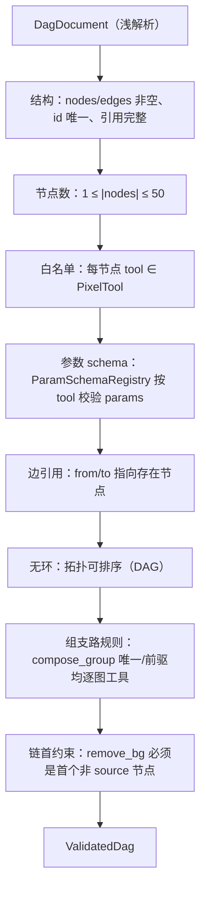

# module/dag —— DAG 编译/校验/分支展开/确定性单元执行（Wave 3 确定性核心）

> 本文是 PixFlow 完整重写阶段 `module/dag` 模块的设计文档，对应 `design.md` 第二章设计原则一/二（两层循环分离、确定性底座不被污染）、第五章 §5.2（两套工具严格分离）、第九章「DAG 确定性执行引擎」（§9.1 编译校验分支展开、§9.4 断点恢复与失败隔离、§9.5 分组聚合）、第十三章数据模型，以及 `module-dependency-dag-plan.md` 的 **Wave 3 横切组合 + 确定性核心**。
> 范围：DAG 中间表示与校验、`submit_image_plan` 提案接线、分支/组支路展开、把一条已展开支路缝合为 `infra/{thirdparty,image,ai,storage}` 调用链的**确定性单元执行器**、`generate_copy` 独立文案分支、失败的源头归一化。
> 配套阅读：`harness/tools.md`（`submit_image_plan` 工具边界、零令牌）、`infra/image.md`（类型化像素操作与 `ImagePipeline`）、`infra/thirdparty.md`（抠图 `BackgroundRemovalClient`）、`infra/ai.md`（`generate_copy` 走 `ChatModelClient`）、`harness/state.md`（`RunStateRefStore`/`UnitKey`/恢复协调）、`module/file.md`（`asset_image`/`asset_copy` 来源）、`base/contracts.md`（确认令牌形状 + 待确认提案 SPI）、`base/common.md`（错误归一化/脱敏）。本文不涉及 MVP 既有实现，从生产级需求重新推导。

---

## 目录

- [一、文档定位与设计原则](#一文档定位与设计原则)
- [二、核心边界：dag 是确定性库，task 是异步外壳](#二核心边界dag-是确定性库task-是异步外壳)
- [三、模块结构与依赖位置](#三模块结构与依赖位置)
- [四、DAG 中间表示与像素工具白名单](#四dag-中间表示与像素工具白名单)
- [五、DagValidator：可重复调用的服务端校验](#五dagvalidator可重复调用的服务端校验)
- [六、提案与确认边界（pending_plan + 双重校验 + HITL preflight）](#六提案与确认边界pending_plan--双重校验--hitl-preflight)
- [七、BranchExpander：分支与组支路展开](#七branchexpander分支与组支路展开)
- [八、确定性单元执行器（缝合 infra 的核心）](#八确定性单元执行器缝合-infra-的核心)
- [九、generate_copy 独立文案分支](#九generate_copy-独立文案分支)
- [十、失败隔离边界与错误归一化](#十失败隔离边界与错误归一化)
- [十一、中间产物引用与恢复（走 state，缓存收窄到组支路）](#十一中间产物引用与恢复走-state缓存收窄到组支路)
- [十二、配置](#十二配置)
- [十三、对其他模块的契约](#十三对其他模块的契约)
- [十四、测试策略](#十四测试策略)
- [十五、对 design.md 与依赖计划的细化](#十五对-designmd-与依赖计划的细化)
- [十六、暂不考虑](#十六暂不考虑)
- [Revision Notes](#revision-notes)

---

## 一、文档定位与设计原则

`module/dag` 在依赖 DAG 中处于 **Wave 3**，依赖 `infra/image`（类型化像素操作）、`infra/ai`（`generate_copy` 文案）、`infra/thirdparty`（抠图）、`infra/storage`（MinIO I/O 缝合）、`harness/state`（中间产物引用 `RunStateRefStore`）、`common`（错误/脱敏）。被 `harness/tools`（`submit_image_plan` handler bean）、`module/task`（异步外壳逐单元调用执行器）、`module/conversation`（确认 REST 边界调 preflight）消费。

模块专属设计原则：

1. **确定性底座不被污染**。dag 是 `design.md` 设计原则一/二里「下层确定性执行引擎」的落点：可预测、可测试、无自主迭代、无随机性。dag 内**绝不出现** think-act-observe、LLM 决策续轮、线程池、MQ 消费、Redis 锁/进度自增。它是一组**纯函数式 + 无状态**的服务（校验器、展开器、单元执行器），由 `module/task` 的异步外壳逐单元调用（见 [§二](#二核心边界dag-是确定性库task-是异步外壳)）。
2. **两套工具严格分离**。dag 拥有 **DAG 级像素工具**白名单（`remove_bg`/`set_background`/`resize`/`compress`/`watermark`/`convert_format`/`generate_copy`/`compose_group`）的语义、参数 schema 与派发；它们**绝不进入** `harness/tools` 的 Agent 级注册表（`design.md §5.2`、`tools.md §一`）。Agent 永不直接调像素工具，只通过 `submit_image_plan` 提交 DAG 提案。
3. **dag 不理解副作用闸门，只产出确定性结果**。真实执行的触发（确认令牌、HITL）在带外确认 REST 边界 + `permission` 硬校验（`tools.md §8.3`、`contracts.md §六`）；dag 既不签发也不消费令牌。dag 提供「校验 + 展开 + 单元执行」的能力，**是否允许执行**不归它判断。
4. **像素语义集中、I/O 在两端缝合**。`infra/image` 是「纯计算无 I/O」（`image.md §一`），`infra/thirdparty`/`infra/ai` 是「存储无感」。把「从 MinIO 取字节 → 调第三方/像素/模型 → 写回 MinIO」的缝合收口在 dag 的单元执行器，是 dag 不可替代的职责（`image.md §二` 明确「缝合在 module/dag」）。
5. **领域输入靠中立投影喂入，不直连业务表**。dag 不依赖 `module/file`、不直连 `asset_image`/`asset_copy`/`process_*` 表。分组成员、文案上下文由调用方（task）以 dag 自有的中立 record 喂入（见 [§七](#七branchexpander分支与组支路展开)、[§九](#九generate_copy-独立文案分支)）。这保持 dag 只懂「DAG 语义 + 像素缝合」，与它「无状态确定性库」的定位一致。
6. **生产级、不简化**。节点上限、无环校验、组支路 fan-in、确定性 branchId、失败源头归一化、像素炸弹兜底（委托 image）、确认边界独立重校验齐备，不走 MVP 捷径。

---

## 二、核心边界：dag 是确定性库，task 是异步外壳

`design.md §12` 把「执行引擎」列在 `module/dag`，又把「fan-out / 进度 / 断点恢复 / 失败隔离」列在 `module/task`，字面上「执行引擎」与「失败隔离」归属含混。本模块据 `design.md` 设计原则一/二（两层循环分离、确定性底座不被污染）与各 infra 文档的缝合描述，把这条线**明确钉死**：

| 维度 | `module/dag`（本模块） | `module/task`（Wave 4） |
|---|---|---|
| 性质 | **无状态、线程无关、确定性** 的库/服务 | **有状态、并发、异步** 的编排外壳 |
| 拥有 | DagValidator、像素工具白名单 + 参数 schema、`submit_image_plan` handler、提案 `pending_plan`、BranchExpander（分支/组支路展开）、**确定性单元执行器**（缝合 storage→thirdparty→image→ai→storage，产出 `UnitOutcome`）、确认前 HITL `preflight` | MQ 消费、按 `package_id` 加载图片、调 BranchExpander 展开、把 `[图片×支路]/[组×支路]` 单元 fan-out 到线程池、逐单元调 dag 执行器、写 `process_result`、进度自增、Redisson 锁、取消标志、`@Scheduled` 恢复重扫与重新入队、下载 |
| 不碰 | 线程池、MQ、Redis 进度/锁/取消、`process_*` 落库、任务终态判定 | 像素语义、DAG 结构解析、节点→工具映射、缝合细节 |
| 失败隔离 | 单元执行器**捕获并归一化**单元内异常 → 返回 `FAILED` 的 `UnitOutcome`（**从不抛出去打断批次**） | fan-out 循环拿到 `FAILED` outcome → 落 `process_result.status=2` + 脱敏 `error_msg` + 继续兄弟单元；终态判定（至少一条成功→完成 / 全失败→失败） |

一句话：**dag 回答「这条支路对这张图/这组图跑出来是什么」，task 回答「这一批要跑哪些单元、并发多少、断点怎么续、进度怎么报」。** dag 的「执行引擎」是一个被 task worker 逐单元调用的纯服务，不是一个自己跑批的东西。这样「确定性底座不被污染」才真正落地：dag 里没有任何 while/线程/MQ。

> 设计取舍：为什么不把 fan-out 也放 dag？因为 fan-out 必然绑定线程池、进度计数、取消检查、`process_result` checkpoint 这些**有状态运行态**，一旦进 dag，dag 就不再是可独立属性测试的确定性库，且会与 `harness/state` 的运行态读模型、`module/task` 的恢复扫描职责重叠。把并发与状态全留在 task，dag 专注「单元 → 结果」的确定性映射，是两层循环分离原则的硬要求。

---

## 三、模块结构与依赖位置

Maven 模块：`pixflow-module-dag`（需加入根 `pom.xml` `<modules>` 与 `dependencyManagement`）。源码包：`com.pixflow.module.dag`

```
module/dag/
├── DagFacade.java                    # 对外门面：validate / proposeImagePlan / expand / executeUnit / preflightGroups
├── ir/
│   ├── DagDocument.java              # 解析后的 DAG IR（nodes + edges，未校验）
│   ├── DagNode.java                  # record(id, tool, params:Map<String,Object>)
│   ├── DagEdge.java                  # record(from, to)
│   ├── PixelTool.java                # 像素工具白名单枚举 + 基数语义（N→1 / 1→1 / 文案）
│   ├── ValidatedDag.java             # 校验通过的不可变 DAG（结构已确认，可安全展开）
│   └── DagJsonReader.java            # JSON → DagDocument（浅解析，不信任结构）
├── validate/
│   ├── DagValidator.java             # 服务端独立严格校验（多次可调用、无状态）
│   ├── ParamSchemaRegistry.java      # 每像素工具的 JSON Schema（参数校验单一事实源）
│   ├── DagValidationResult.java      # ok | 逐项错误（结构/白名单/参数/边/环/组规则）
│   └── rule/                         # 结构 / 节点数 / 白名单 / 参数 / 边引用 / 无环 / 组支路 规则
├── propose/
│   ├── PendingPlan.java              # 提案实体（pending_plan 表）
│   ├── PendingPlanStatus.java        # PENDING / CONFIRMED / DISCARDED / EXPIRED
│   ├── PendingPlanService.java       # 入队/读取/状态迁移/过期清理
│   ├── PendingPlanMapper.java        # MyBatis-Plus
│   ├── PendingPlanPortAdapter.java   # contracts.proposal.PendingPlanPort 的唯一生产实现
│   └── SubmitImagePlanHandler.java   # 贡献给 harness/tools 的 ToolHandler bean（深校验 + 入队）
├── expand/
│   ├── BranchExpander.java           # ValidatedDag + 图片成员 → List<ExecutableBranch>
│   ├── ExecutableBranch.java         # 一条可执行支路：有序 op 计划 + 单元身份 + 类型
│   ├── BranchId.java                 # 确定性 branchId 派生（同 DAG 同路径 → 同 id）
│   ├── ImageDescriptor.java          # 中立输入 record(imageId, skuId, groupKey, viewId, objectKey, contentType)
│   └── GroupPreflight.java           # expected_count vs 实际成员数比对结果（供确认边界 HITL）
├── exec/
│   ├── UnitExecutor.java             # 单元执行器接口：execute(ExecutableBranch, UnitInput) -> UnitOutcome
│   ├── PipelineUnitExecutor.java     # 逐图支路：storage.get → 缝合 → image.run → storage.put
│   ├── GroupUnitExecutor.java        # 组支路：N 成员 → image.runComposed → storage.put
│   ├── CopyUnitExecutor.java         # generate_copy 文案支路：asset_copy 上下文 → ai → 文本
│   ├── NodeDispatcher.java           # 节点 tool → infra 调用 + 类型化 spec 映射
│   ├── SpecMapper.java               # DagNode.params → infra/image 类型化 spec（ResizeSpec 等）
│   ├── UnitInput.java                # 单元输入（图片字节来源引用 + 可选 CopyContext）
│   ├── CopyContext.java              # 中立输入 record(skuId, productName, keywords, description)
│   └── UnitOutcome.java              # SUCCEEDED(outputKey/generatedCopy/members) | FAILED(归一化错误)
├── error/
│   └── DagErrorCode.java             # enum implements common.ErrorCode
└── config/
    └── DagProperties.java            # @ConfigurationProperties(pixflow.dag)
```

依赖方向：

```
module/dag ──► infra/image      （类型化像素操作 + ImagePipeline.run/runComposed）
module/dag ──► infra/thirdparty  （remove_bg → BackgroundRemovalClient.remove）
module/dag ──► infra/ai          （generate_copy → ChatModelClient）
module/dag ──► infra/storage     （两端缝合：取源图字节、写结果/中间产物）
module/dag ──► harness/state     （中间产物引用 RunStateRefStore；仅组支路用，见 §十一）
module/dag ──► common            （PixFlowException / ErrorCode / Sanitizer / ErrorNormalizer 边界）
module/dag ──► contracts         （只实现 contracts.proposal.PendingPlanPort，不消费 confirmation 令牌契约）
module/dag ──► MySQL/MyBatis-Plus（pending_plan 表）

harness/tools ──► module/dag     （收集 SubmitImagePlanHandler 的 ToolDescriptor/ToolHandler bean）
module/task   ──► module/dag     （调 BranchExpander.expand、UnitExecutor.execute；喂 ImageDescriptor/CopyContext）
module/conversation ──► module/dag（确认 REST 边界调 DagValidator 重校验 + GroupPreflight HITL）
```

**反向约束**：dag **不依赖** `module/file`（分组成员/文案以中立 record 喂入）、**不依赖** `module/task`/`harness/loop`/`agent`、**不依赖** `infra/cache`（中间产物引用经 `harness/state`，见 [§十一](#十一中间产物引用与恢复走-state缓存收窄到组支路)）。dag 只允许依赖 `contracts.proposal` 这条纯待确认提案 SPI，用于把 `pending_plan` 持久化能力暴露给 imagegen；dag 不依赖 `contracts.confirmation`，不签发、不消费确认令牌。

> 关键倒置说明：`harness/tools` 对 dag 零编译依赖，`SubmitImagePlanHandler` 在 dag 实现 `ToolHandler` 并把 `ToolDescriptor` 暴露为 `@Bean`，`DefaultToolRegistry` 自动收集（`tools.md §四`）。这与 memory 的 `InsightKeywordSearch`、permission 的 `ConfirmationTokenStore` 倒置同构。
---

## 四、DAG 中间表示与像素工具白名单

### 4.1 DAG IR

Agent 直接产出 DAG JSON（nodes/edges）作为 `submit_image_plan` 入参（`design.md §9.1`，省掉单独 `compile_dag` 的二次 LLM 往返）。dag 把它解析为不可变 IR：

```java
public record DagNode(String id, PixelTool tool, Map<String,Object> params) {}
public record DagEdge(String from, String to) {}
public record DagDocument(List<DagNode> nodes, List<DagEdge> edges) {}     // 浅解析，未校验
public record ValidatedDag(List<DagNode> nodes, List<DagEdge> edges) {}    // 校验通过，可安全展开
```

- `DagJsonReader` 只做浅解析（合法 JSON object、含 `nodes`/`edges` 顶层键、节点 `tool` 可识别为白名单枚举），结构正确性交 `DagValidator`。
- `tools` 层对 `submit_image_plan.dag` 只做「是合法 JSON object、含 nodes/edges」的浅校验（`tools.md §十四`），**深度校验在本模块的 handler 内**——这是「tools 不理解 DAG 语义」的兑现点。

### 4.2 像素工具白名单（PixelTool 枚举）

`design.md §9` 白名单的语义、参数 schema、派发目标、输入基数集中在 `PixelTool`：

| tool | 输入基数 | 派发目标（§八） | 参数（映射到的 infra spec） |
|---|---|---|---|
| `remove_bg` | 1→1 | `infra/thirdparty` | `BackgroundRemovalOptions`（outputFormat/crop/featherRadius） |
| `set_background` | 1→1 | `infra/image` | `SetBackgroundSpec`（纯色或背景图 + 适配模式） |
| `resize` | 1→1 | `infra/image` | `ResizeSpec`（width/height/mode/keepAspect/upscale） |
| `compress` | 1→1 | `infra/image` | `CompressSpec`（quality 或 targetBytes，互斥） |
| `watermark` | 1→1 | `infra/image` | `WatermarkSpec`（水印图引用 + 九宫格/透明度/缩放/边距） |
| `convert_format` | 1→1 | `infra/image` | `ConvertFormatSpec`（目标格式 + 质量 + alpha 扁平化底色） |
| `compose_group` | **N→1** | `infra/image` | `ComposeSpec`（layout/order/gap/background）+ 可选 `expected_count` |
| `generate_copy` | 文案（不串像素流水线） | `infra/ai` | 文案生成参数（风格/长度约束等） |

- 输入基数是分支展开与校验的关键：`compose_group` 是唯一 N→1 节点（组支路 fan-in），其余逐图工具 1→1；`generate_copy` 不在像素链上（独立文案分支，见 [§九](#九generate_copy-独立文案分支)）。
- 白名单是**封闭枚举**：未知 `tool` 名在校验期即拒，不存在运行时动态注册像素工具（与像素工具「确定性处理单元」定位一致）。

---

## 五、DagValidator：可重复调用的服务端校验

`DagValidator` 是**无状态、可被多次调用**的服务端独立严格校验器。它在两个时机各跑一次（`design.md §9.1/§14`「服务端独立校验、不信任前端回传」）：① `submit_image_plan` 提案入队前；② 确认 REST 边界创建任务前。两次都用同一份校验逻辑，保证「便宜方案确认、贵方案执行」的漂移被堵死。

校验顺序（任一失败即收集为 `DagValidationResult` 的逐项错误，不创建任何后续产物）：



要点：

- **节点数上限 50**（`design.md §9.1`），防超大图编译。
- **参数 schema 单一事实源**：`ParamSchemaRegistry` 持有每个 `PixelTool` 的 JSON Schema（networknt 校验，与 `tools.md §十四` 的校验栈一致）。缺必填参数不自动猜测——LLM 在编译期就应逐项追问用户（`design.md §9.1`「不自动猜测」）；漏到校验期则列为逐项错误。
- **组支路规则**（对应 `design.md §9.5`、`image.md §6.6`）：任一含 `compose_group` 的支路里，`compose_group` 必须唯一，且其所有前驱节点必须是**逐图工具**（不可在聚合前再放一个聚合）。
- **链首约束（remove_bg 必须是逐图节点序列的第一个）**：`remove_bg` 是第三方抠图，输出带 alpha 的 PNG；其后再串其他像素操作（resize/watermark 等）等于在抠图结果上再处理，语义正确但资源浪费（先把图整张发送第三方，再让 image 二次处理）。约束：`remove_bg` 必须出现在该路径的**第一个**非 source 节点位置（普通支路整条链的第一个节点；组支路 perMemberOps 的第一个节点）。违例 → `DAG_INVALID_OP_ORDER`。
- **无环**：以拓扑排序判定；存在环则 `DAG_HAS_CYCLE`。
- 校验器**不**做 `expected_count` 与实际成员数的比对（那需要运行期成员数据，属确认边界的 HITL，见 [§六](#六提案与确认边界pending_plan--双重校验--hitl-preflight)）。校验器只看 DAG 结构与参数本身。

---

## 六、提案与确认边界（pending_plan + 双重校验 + HITL preflight）

dag 是 `submit_image_plan` 的实现归属，也是确认边界的校验/preflight 提供方。整条「提案 → 确认 → 执行」的链路里，dag 提供确定性能力，**令牌与 HITL 决策在带外**。

### 6.1 提案入队（submit_image_plan handler）

`SubmitImagePlanHandler`（贡献给 `harness/tools` 的 bean）：

```
Agent 调 submit_image_plan(dag, note?)
  → tools 管线浅校验（合法 JSON、含 nodes/edges）→ 进 handler
  → DagJsonReader 解析 → DagValidator 深度校验
       失败 → 返回结构化 tool error（VALIDATION/SKIP，不入队）
  → PendingPlanService.enqueue(conversationId, ValidatedDag, note)
       幂等：同 toolCallId 重复不产生重复 pending plan（tools.md §七 要求 submit_* 入队幂等）
  → 返回 plan 引用（planId + 摘要）供 Agent 告知用户
```

- handler **不执行**像素处理、**不携带确认令牌**（`tools.md §3.4/§8.3`）。它只「校验 + 入队 + 返回引用」。
- 多变体并行（白底一条、蓝底一条）= Agent 两次 `submit_image_plan` 调用 → 两条 `pending_plan`；有序步骤（蓝底→压缩）放同一条 `dag` 的 edges。

### 6.2 pending_plan 表（提案载体，决策 1=A）

提案是「未确认、可能被丢弃」的临时物，语义上不同于「已确认要跑」的 `process_task`，故独立成表，不污染任务状态机：

| 表 | 关键字段 | 说明 |
|---|---|---|
| `pending_plan` | id, conversation_id, type, dag_json, note, payload_hash, status, created_at, expires_at | 待确认提案统一事实表；`type`=IMAGE_PLAN 或 IMAGEGEN；`status`=PENDING/CONFIRMED/DISCARDED/EXPIRED |

- `payload_hash` = 规范化载荷哈希，供确认边界比对「确认的就是执行的」（与 `TokenClaims.payloadHash` 同源理念，`contracts.md §6.2`）。DAG 路径使用规范化 DAG JSON；IMAGEGEN 路径使用 sourceImageIds + prompt + params 的规范载荷 JSON。
- `type` 字段区分 `IMAGE_PLAN` 与 `IMAGEGEN`。`dag_json` 字段作为历史命名保留，实际承载中立 `payloadJson`：DAG 路径写 DAG JSON，imagegen 路径写源图引用集 + 提示词载荷。
- `PendingPlanPortAdapter` 是 `contracts.proposal.PendingPlanPort` 的唯一生产实现：`IMAGE_PLAN` 仍委托 `PendingPlanService.enqueue(...)` 做 DAG 深校验与 canonical hash；`IMAGEGEN` 只保存已由 imagegen handler 校验过的中立载荷，不把生图业务校验塞进 dag。
- 过期清理：`@Scheduled` 扫超龄 `PENDING` 转 `EXPIRED`（防提案无限堆积）。**注意**：定时扫描在调用方/app 接线，dag 只提供 `PendingPlanService` 的迁移能力；dag 自身不持调度器（保持无运行态循环）。

### 6.2.1 Schema 演进与加法兼容约束

schema 是 dag 行为的契约，必须能平滑演进。策略：

1. **加法兼容（默认）**：每个 `PixelTool` 的 schema 只准**加 optional 字段**（新参数有默认值，不传时按默认值走）。理由：原 DAG 缺新参数时仍能通过校验，且 dag 执行器对缺省值的处理由 `SpecMapper` 兜底。
2. **破坏性变更需大版本**：删除字段、改字段语义、改 enum 值、收紧类型（如 string → int）→ 必须升级 schema 大版本号（如 `1.x` → `2.0`），同时 `pending_plan` 表新增 `schema_version` 字段。**确认时校验**：当前 dag 加载的 schema 大版本与 `pending_plan.schema_version` 不一致 → 拒绝（`DAG_SCHEMA_INCOMPATIBLE`），提示用户"方案已过期，请重新提交"。
3. **pending_plan 的 schema_version**：每个 `pending_plan` 记录入队时的 schema 大版本号；确认时双边校验（plan 自带 + 当前 dag 加载）。
4. **过期联动**：schema 大版本升级时，**所有 `PENDING` 的旧版本 plan 立即标记为 `EXPIRED`**（由 `PendingPlanService` 的迁移接口在启动时跑一次）。
5. **回滚兼容**：上一版本的 schema 资源文件必须保留 N 个大版本（默认 2），允许回滚到旧版 dag 时旧 plan 仍能校验通过。
6. **schema 版本元数据**：每个 schema 资源文件带 `version` 字段（`{"version": "1.2", "tool": "resize", ...}`），启动期扫描所有 schema，断言同 tool 的 schema 版本号单调递增（防回退）。

### 6.3 确认 REST 边界的协作（dag 提供能力，不持闸门）

确认端点在 `module/conversation`（`contracts.md §十`、`design.md §6.3`），其执行前序列由它编排，dag 提供两项确定性能力：

```
用户确认（前端带 planId）→ module/conversation 确认 REST 端点：
  ① permission.ConfirmationTokenService 校验令牌（硬 deny 边界，dag 不参与）
  ② 取 pending_plan → DagValidator 再次独立深度校验（dag 提供；不信任前端回传）
  ③ GroupPreflight：expected_count vs 实际成员数比对（dag 提供纯函数）
       不一致 → 不执行、走 HITL 二次确认（由 conversation/permission 裁决）
  ④ 全过 → 创建 process_task + 序列化 ValidatedDag 入库 → 发 MQ（task 接管）
  ⑤ pending_plan.status = CONFIRMED
```

- **双重校验**：提案入队（6.1）与确认执行（②）各跑一次 `DagValidator`，dag 的校验器无状态故可重复调用，无副作用。
- **HITL preflight（决策 3）**：`GroupPreflight` 是 dag 的**纯函数**——入参 `ValidatedDag` + 各组实际成员计数（由 conversation/task 提供），出参每个含 `expected_count` 的 `compose_group` 的「期望 vs 实际」差异（`design.md §9.5`「该组实际仅 2 张：确认按 2 张处理，还是漏传图片？」）。dag **只算差异、不发起 HITL、不碰令牌**；是否拦截、如何二次确认由确认边界 + permission 决策。
- dag 不签发/不消费 `ConfirmationToken`：`ConfirmationAction.SUBMIT_DAG`（`contracts.md §6.3`，「重跑」复用此动作、以实际待执行支路集合算 `payloadHash`）的令牌闸门完全在 permission + 确认边界。

---

## 七、BranchExpander：分支与组支路展开

`BranchExpander` 把一个 `ValidatedDag` + 一批图片成员展开成一组可独立执行的支路。这是恢复幂等单元（`UnitKey`）的定义者。

### 7.1 中立输入：成员由调用方喂入（决策 2=B）

dag **不读 `asset_image`**。展开所需的图片成员由调用方（`module/task`，它本就「按 package_id 加载图片」）以 dag 自有的中立 record 喂入：

```java
public record ImageDescriptor(
        String imageId, String skuId,
        String groupKey,        // 非空=分组成员（对齐 asset_image.group_key）
        String viewId,          // 组内排序（对齐 compose_group 的 order）
        String objectKey, String contentType
) {}

List<ExecutableBranch> expand(ValidatedDag dag, List<ImageDescriptor> images);
```

这样 dag 只认「成员列表」这个中立投影，零 file 依赖、零 `asset_image` 表知识，符合 [§一](#一文档定位与设计原则) 原则五。`groupKey`/`viewId` 的来源（文件名驱动解析）是 `module/file` 的事（`file.md §七`）。

> 取舍：相较定义 `ImageGroupingPort` SPI，直接「参数喂入中立 record」更简单——调用方 task 本就持有这批数据，无需再绕一层 SPI 注入。dag 只拥有 `ImageDescriptor` 的形状，不拥有取数逻辑。

### 7.2 普通支路 vs 组支路

- **普通支路 `[图片×支路]`**：DAG 中不含 `compose_group` 的 source→sink 路径，对每张图片各展开为一条 `ExecutableBranch`（`design.md §9.1` 分支展开：单节点后可分多条并行路径，如去背景后同出 800×800 主图与 200×200 缩略图，各自一条支路）。
- **组支路 `[组×支路]`**：含 `compose_group` 的支路（`design.md §9.5`）。同 `(packageId, groupKey)` 的成员构成一组；聚合节点之前的逐图节点对**每个成员各自施加**，`compose_group` fan-in 合成，聚合之后的节点作用于合成后的单图。展开为 `perMemberOps → compose → postOps` 的有序计划（直接对应 `image.md §七` 的 `runComposed` 形态）。

```java
public record ExecutableBranch(
        UnitKind kind,               // BRANCH | GROUP（对齐 state.UnitKind）
        String branchId,             // 确定性派生（见 7.3）
        String memberId,             // BRANCH: imageId；GROUP: groupKey
        List<DagNode> perMemberOps,  // 逐图节点（组支路：施加到每个成员；普通支路：整条链）
        DagNode composeNode,         // 仅组支路：compose_group 节点；普通支路 null
        List<DagNode> postOps,       // 仅组支路：聚合后节点；普通支路 null
        EncodeTarget encode          // 末端编码目标（convert_format/隐式默认）
) {}
```

### 7.3 确定性 branchId（恢复对齐的关键）

`branchId` 必须**确定性派生**：同一 `ValidatedDag` 的同一条 source→sink 路径，每次展开得到同一 `branchId`。否则崩溃恢复时 `harness/state` 的 `UnitKey(taskId, memberId, branchId)` 对不上，已成功单元无法被正确跳过（`state.md §5.1`、`design.md §9.4`「支路幂等：恢复时整条支路重跑」）。

- 派生方式：对路径的节点序列（id + tool + 规范化 params）做稳定哈希，或用规范化的节点 id 路径串。要求与 `process_result.branch_id`、`UnitKey.branchId` 三处一致。
- `BranchExpander` 是纯函数：同输入 → 同输出（含 branchId 集合），可属性测试。

### 7.4 Canonical Form 规则（branchId 与 payload_hash 的共同基石）

branchId 与 `pending_plan.payload_hash`（§6.2）都基于"规范化形式（Canonical Form）"派生，二者**共用同一套规范化函数**，避免恢复语义与确认一致性口径漂散。

**规范化目标**：对同一份 DAG 语义，无论 JSON 字段顺序如何、空白如何、嵌套层级如何，都能得到**逐字节一致**的字节序列，作为哈希输入。

**规则集**：

1. **对象键按字典序排序**（递归）：Jackson 的 `MapperFeature.SORT_PROPERTIES_ALPHABETICALLY` + 自定义 `ObjectMapper`；不允许任何"保留原始顺序"的形态。
2. **数组顺序保留**：数组是有序的（节点的 edges、compose_group 的 order 等），不重排。
3. **数字**：JSON 数字统一为最简形式（如 `1.0` → `1`，`-0` → `0`，禁止尾随零）；整数无小数点。
4. **字符串**：禁止前后空白，UTF-8 NFC 规范化；不区分 Unicode 是否组合字符。
5. **布尔/null**：保留字面量，不归一化。
6. **缺失字段 vs null**：两者等价——序列化前把缺失字段补 null，再做规范化。
7. **默认值不参与哈希**：dag 校验过的必填字段必现，但若 schema 标注 optional 的字段未提供，序列化时**不补默认值**（保持原样），哈希基于"实际传入"。
8. **不规范化内容**：参数值若是 MinIO key、URL 等业务标识符，原样保留（不去重、不规范化大小写，hash 是 fingerprint 不是归一化）。

**branchId 的拼接形式**：

```
branchId = sha256(canonicalJson(sourceSinkPath) + "|" + sha256(canonicalJson(nodeParams)))
       其中：sourceSinkPath = source nodeId → ... → sink nodeId 的 id 序列
             nodeParams    = 该路径上每节点按出现顺序的 canonical params 拼接
```

实现位置：`com.pixflow.module.dag.expand.CanonicalJson`（纯函数，零依赖，单测覆盖所有规则）。`BranchExpander` 与 `PendingPlanService.payloadHash()` 都依赖它。

**为什么不用 Jackson `writeValueAsString` 默认形态？** 因为 Jackson 默认不排序键、不处理缺失字段、不去尾随零——必须用专用 `ObjectMapper`（封装在 `CanonicalJson` 内）。

---

## 八、确定性单元执行器（缝合 infra 的核心）

`UnitExecutor` 是 dag 的「执行引擎」本体——被 `module/task` 的 worker **逐单元**调用，把一条 `ExecutableBranch` 缝合成 infra 调用链，产出 `UnitOutcome`。它**无线程、无 MQ、无锁、无 process_result 落库**。

### 8.1 接口与产物

```java
public interface UnitExecutor {
    UnitOutcome execute(ExecutableBranch branch, UnitInput input);   // 从不抛业务异常打断批次
}

public record UnitOutcome(
        UnitKind kind, String branchId, String memberId,
        Status status,                 // SUCCEEDED | FAILED
        String outputObjectKey,        // 成功：结果图 MinIO key（确定性/组支路）
        String generatedCopy,          // 成功：文案支路产物（generate_copy）
        List<MemberRef> members,       // 组支路成功：N 张源成员明细（→ process_result_member）
        DagErrorView error             // 失败：归一化错误（code + safeMessage + category=SKIP）
) { enum Status { SUCCEEDED, FAILED } }
```

`UnitOutcome` 是中立产物：task 据它写 `process_result`（`design.md §13.1`：组支路 `group_key` 非空、`image_id` 置空；`members` → `process_result_member`）。dag 不知道 `process_result` 表，只回这个 record。

### 8.2 逐图支路缝合（PipelineUnitExecutor）

```
storage.getStream(objectKey)                      // 取源图字节（dag 缝合 I/O）
  → 顺序遍历 perMemberOps，按 NodeDispatcher 派发：
       remove_bg      → thirdparty.removeBg(bytes) → 抠图（带 alpha 的 PNG 字节）
       set_background/resize/compress/watermark/convert_format
                      → 累积为 List<ImageOp>（类型化 spec via SpecMapper）
  → image.run(decodedStream, ops, EncodeSpec)      // 解码一次→链式 op→编码一次（image.md §七）
  → storage.put(StorageKeys.result(taskId, skuId, imageId, branchId), bytes)
  → UnitOutcome.SUCCEEDED(outputObjectKey)
```

关键：**解码一次、编码一次**由 `infra/image` 的 `ImagePipeline.run` 保证（`image.md §七`）；dag 不在节点间反复 decode/encode。`remove_bg` 是链中可能的第一步（第三方抠图），其输出（带 alpha 字节）作为 `image.decode` 的输入继续缝合——这正是 `image.md §二` / `thirdparty.md §十三` 描述的 `remove_bg → set_background → resize` 缝合。

> 边界细节：`infra/image` 是「字节进 / 字节出」的纯计算，dag 负责把 `remove_bg` 的第三方结果字节喂给 image，把 image 的最终字节落 MinIO。watermark 的水印图本身也由 dag 先取出字节、解码为 `RasterImage` 传入 `WatermarkSpec`（`image.md §6.3`）。

### 8.3 组支路缝合（GroupUnitExecutor）

```
对组内每个成员 m（按 viewId 排序）：
   storage.getStream(m.objectKey) → 缝合 perMemberOps → 得到预处理后的成员栅格
   （成员预处理中间产物引用按需经 RunStateRefStore 暂存，见 §十一）
  → image.runComposed(members, perMemberOps, ComposeOp(ComposeSpec), postOps, EncodeSpec)
  → storage.put(StorageKeys.result(taskId, groupKey, branchId), bytes)
  → UnitOutcome.SUCCEEDED(outputObjectKey, members=[...view 明细])
```

`image.md §七` 的 `runComposed(members, perMemberOps, compose, postOps, encode)` 正是此形态：聚合前逐成员施加 `perMemberOps`、`compose` fan-in、聚合后 `postOps`、末端编码一次。dag 决定**结构**（哪些 op 在聚合前/后），image 只按既定步骤执行、不懂「组」语义。

### 8.4 NodeDispatcher 与 SpecMapper

- `NodeDispatcher`：节点 `tool` → 派发目标（thirdparty / image / ai）。封闭枚举驱动，无反射、无动态注册。
- `SpecMapper`：把已校验的 `DagNode.params`（Map）映射为 `infra/image` 的类型化 spec（`ResizeSpec`/`CompressSpec`/…）。这是「dag 把 DAG 节点参数映射为类型化 spec」的落点（`image.md §一` 原则三：image 不解析 JSON、只收类型化 spec）。映射前参数已过 `DagValidator` 的 schema 校验，`SpecMapper` 只做结构转换 + 防御式兜底。

### 8.5 资源生命周期（执行器的隐性 SLA）

dag 单元执行器在 I/O + 像素处理路径上，需对 native 资源（`BufferedImage` 持有堆外 native 内存、scrimage/libwebp 的 native buffer、`ImageInputStream`/`ImageOutputStream`）做严格清理。这是 `image.md §八` 像素炸弹防护之外的**第二道资源安全网**——前者防 DoS 式 OOM，后者防执行期间资源泄漏。

**统一原则**：每个单元执行的入口处创建 `BranchExecutionContext`（`AutoCloseable`），try-finally 保证任何异常/正常返回都触发清理。

```java
public final class BranchExecutionContext implements AutoCloseable {
    private final Deque<Runnable> cleanups = new ArrayDeque<>();   // LIFO 顺序
    private final AtomicBoolean closed = new AtomicBoolean(false);

    public void onDispose(RasterImage img) {
        cleanups.push(() -> { try { img.buffer().getGraphics().dispose(); } catch (Throwable ignored) {} });
    }
    public void onClose(InputStream s) {
        cleanups.push(() -> { try { s.close(); } catch (IOException ignored) {} });
    }

    @Override public void close() {
        if (closed.compareAndSet(false, true)) {
            while (!cleanups.isEmpty()) safeRun(cleanups.pop());
        }
    }
}
```

**步骤级清理责任**：

| 阶段 | 持有的资源 | 失败后清理责任 |
|---|---|---|
| `storage.getStream` | `InputStream` | try-with-resources 自动关；失败则只关流，无其他残留 |
| `thirdparty.removeBg` | HTTP 调用产生的 bytes（dag 喂给 image 之前是 `byte[]`） | 失败时该 `byte[]` 由 GC 回收；成功时该字节进入 image 处理链 |
| `image.decode` | `RasterImage`（含 `BufferedImage`） | 必须 `RasterImage.dispose()` 注册到 ctx；解码失败抛 `ImageProcessingException` 时 ctx 自动 dispose |
| 链中每步 `op.apply` | 新产出的 `RasterImage` | 每步产生的 `RasterImage` 注册到 ctx；上一步的 `RasterImage` 在下一步成功后**显式 dispose**（除非有引用计数提示可复用；默认即时 dispose） |
| `image.encode` | 输出 `byte[]` + 临时 `RasterImage` | 成功：编码前的 `RasterImage` dispose，输出 byte[] 进入 storage 链路；失败：ctx 自动 dispose 所有未释放的 `RasterImage` |
| `storage.put` | 输出 `byte[]` + HTTP 流 | 失败时输出 `byte[]` 不落 MinIO，必须吞掉（重试时重新生成），不能产生半成功 |
| 异常 finally | —— | ctx.close() 触发 LIFO 清理 |

**关键约束**：

- `BufferedImage.dispose()` 必须在产出者所在的最短 try 块 finally 中调用，**不允许把 RasterImage 传到链尾再统一 dispose**（链路长时链中持有大量 native 内存）。
- 上游 op 的输出 RasterImage 在下游 op 成功完成后**立即 dispose**（`ImagePipeline.run` 不提供"持有源"契约，故默认即时 dispose）。
- scrimage WebP 编码路径的 native buffer 由 `ImageCodec.encode` 内部 `try-with-resources` 保证释放；dag 不二次介入。
- watermark / 第三方调用的中间 bytes 数组用完置 null（便于 GC）。
- `BranchExecutionContext.close()` 幂等（`closed.compareAndSet` 守护）。

**单元测试覆盖**：

- 注入各阶段失败，断言 native 资源全部释放（用 `RasterImage.disposeCount` 计数桩）。
- 多线程并发跑 `PipelineUnitExecutor`，断言无 `BufferedImage` 残留（用 `WeakReference` + System.gc 跟踪）。
- 注入 `storage.put` 失败（fake 抛异常），断言上游字节不残留、上游 RasterImage 已 dispose。

---

## 九、generate_copy 独立文案分支

`generate_copy` 是与像素流水线**解耦的独立分支**（`design.md §9.1`「文案分支解耦，不串接像素流水线末端」），以 SKU 的 `asset_copy` 为上下文。

- **不在像素链上**：`BranchExpander` 把 `generate_copy` 节点展开为独立的文案支路（`CopyUnitExecutor`），不与 remove_bg/resize 等串接。
- **中立文案上下文喂入（决策 2 同理）**：dag 不读 `asset_copy` 表；`CopyContext(skuId, productName, keywords, description)` 由调用方（task）喂入 `UnitInput`。
- **缝合 infra/ai**：`CopyUnitExecutor` 调 `infra/ai.ChatModelClient`（`ModelRole.PRIMARY_CHAT`），把 `CopyContext` + 文案参数组装为 prompt，产出文案文本 → `UnitOutcome.generatedCopy`（task 写入 `process_result.generated_copy`）。
- HITL 与本分支无关：文案生成是确定性工具调用（非生成式重绘路径），随 DAG 一同确认执行。

---

## 十、失败隔离边界与错误归一化

「失败隔离」按 [§二](#二核心边界dag-是确定性库task-是异步外壳) 分两半：**单元内归一化在 dag，批次内继续在 task**。

- **dag 单元执行器从不抛业务异常打断批次**：单元内任一步骤失败（抠图 5xx 重试耗尽、像素解码失败、不可编码格式、组支路成员缺失/解码失败……）→ 捕获并经 `common` 的 `ErrorNormalizer` 归一化 → 返回 `UnitOutcome.FAILED(DagErrorView)`。`DagErrorView` 只含 `code + safeMessage + category`，**不泄露堆栈/内部原文**（`common.md §6.2`），`error_msg` 经 `Sanitizer` 截断 ≤1000 字（`design.md §9.4`）。
- **task 据 FAILED outcome 落库 + 继续**：写 `process_result.status=2` + `error_msg`、不保留半成品 `output_path`，同图其余支路 / 批次其余图片 / 其他组继续（`design.md §9.4/§9.5`）。终态判定（至少一条成功→完成 / 全失败→失败）在 task。

错误来源与归一化对接（各 infra 已在边界归一化，dag 透传/再归一化为 SKIP 隔离）：

| 来源 | infra 归一化（已有） | dag 单元结果 | 任务终态影响 |
|---|---|---|---|
| 抠图限流/网络/5xx 重试耗尽、熔断 | `thirdparty` → `PROVIDER/NETWORK/RATE_LIMIT`，熔断 `SKIP`（`thirdparty.md §九`） | `FAILED`（隔离该支路） | 该支路失败，整批其他支路继续 |
| 损坏图/不可编码格式/超大图 | `image` → `IMAGE_PROCESSING`（默认 `SKIP`，`image.md §9.2`） | `FAILED`（隔离该支路） | 该支路失败，其他继续 |
| 文案模型调用失败 | `ai` → `PROVIDER/NETWORK`（`ai.md §八`） | `FAILED`（隔离该文案支路） | 该文案支路失败，其他继续 |
| **组支路源 MinIO 读失败（storage STORAGE/RETRY）** | storage 抛 `StorageException`，`ErrorNormalizer` 归 `STORAGE`/`RETRY` | 整条组支路 FAILED，`details.missingViews` 列出失败成员 | **整组 SKIP**，其他组/支路继续；如 task 已重试耗尽则上报 |
| **组支路源 MinIO 读失败（NON-retryable / 4xx）** | storage `BucketType`/`NoSuchKey` → 上抛 `STORAGE`/`TERMINATE` | 整条组支路 FAILED，但**整批任务 FAILED**（数据不完整） | **整批失败**，不再继续 |
| **组支路成员数据质量违规**（viewId 重复、groupKey 不一致） | dag 内部校验抛 `DAG_INVALID_GROUP_BRANCH`（VALIDATION/TERMINATE） | 整批任务 FAILED | **整批失败** |
| 组支路图像处理失败（损坏图 / 不可编码格式） | image → `IMAGE_PROCESSING/SKIP` | 整条组支路 FAILED，`details.missingViews` 标注 | 整组 SKIP，其他组/支路继续 |
| 非法操作参数漏到执行期 | image `INVALID_OP_PARAM`（应已被 DagValidator 拦） | `FAILED`（防御兜底，正常不发生） | 该支路失败 |
| 单元执行超时 | dag 内部抛 `DAG_UNIT_TIMEOUT`（DEPENDENCY/RETRY） | FAILED | 该支路失败；task 可整体重试 |
| 原始字节超大（dag pre-stat 超阈值） | dag 内部抛 `DAG_SOURCE_BYTES_TOO_LARGE`（VALIDATION/TERMINATE） | FAILED | 该支路失败 |

> **关键区分**：组支路失败按 `STORAGE retryable` vs `VALIDATION/不可恢复 STORAGE` 走两条路径——前者 task 还能重试（依赖基础设施抖动恢复），后者直接任务失败（数据问题不可自愈）。`DagErrorCode.DAG_UNIT_EXECUTION_FAILED` 作为归一化外壳，对应 SKIP 的语义由 ErrorNormalizer 据原始异常决定。

dag 自有错误码 `DagErrorCode implements common.ErrorCode`（并入 `common` 启动期聚合测试：code 唯一 + i18n 齐全 + category 非空）：

| code | category | recovery | 场景 |
|---|---|---|---|
| `DAG_INVALID_STRUCTURE` | VALIDATION | TERMINATE | nodes/edges 缺失、id 重复、引用断裂 |
| `DAG_NODE_LIMIT_EXCEEDED` | VALIDATION | TERMINATE | 节点数 >50 或 <1 |
| `DAG_UNKNOWN_TOOL` | VALIDATION | TERMINATE | tool 不在白名单 |
| `DAG_INVALID_PARAMS` | VALIDATION | TERMINATE | 参数 schema 校验失败 |
| `DAG_HAS_CYCLE` | VALIDATION | TERMINATE | 存在环 |
| `DAG_INVALID_GROUP_BRANCH` | VALIDATION | TERMINATE | compose_group 非唯一/前驱非逐图工具 / 成员数据质量违规 |
| `DAG_INVALID_OP_ORDER` | VALIDATION | TERMINATE | remove_bg 不在逐图节点序列首位 |
| `DAG_PAYLOAD_HASH_MISMATCH` | VALIDATION | TERMINATE | 确认时 DAG payload_hash 与 pending_plan 不一致 |
| `DAG_SCHEMA_INCOMPATIBLE` | VALIDATION | TERMINATE | pending_plan schema_version 与当前不兼容 |
| `DAG_PLAN_NOT_FOUND` | NOT_FOUND | TERMINATE | 确认时 pending_plan 不存在/已过期 |
| `DAG_PLAN_EXPIRED` | NOT_FOUND | TERMINATE | pending_plan 状态为 EXPIRED |
| `DAG_PLAN_ALREADY_CONFIRMED` | BUSINESS_RULE | TERMINATE | pending_plan 已被确认（重复确认） |
| `DAG_UNIT_EXECUTION_FAILED` | （由 ErrorNormalizer 定，多为 SKIP） | SKIP | 单元执行失败的归一化外壳 |
| `DAG_UNIT_TIMEOUT` | DEPENDENCY | RETRY | 单元执行超时（image/thirdparty/ai 任一阶段） |
| `DAG_SOURCE_BYTES_TOO_LARGE` | VALIDATION | SKIP | 源字节超过 dag 大图防护阈值（避免浪费下载带宽） |
| `DAG_GROUP_MEMBER_MISSING` | NOT_FOUND | SKIP | 组支路成员缺失视图（业务已确认按现有处理） |

> 校验类错误（VALIDATION/TERMINATE）发生在提案/确认边界（不创建任务）；单元执行类（SKIP）发生在 task worker 调用执行器时（隔离支路）。两类不混淆。

---

## 十一、中间产物引用与恢复（走 state，缓存收窄到组支路）

### 11.1 引用经 harness/state，不直连 cache（决策 4）

dag 需要的中间产物**引用**（节点完成标记 + MinIO key，非字节）经 `harness/state` 的 `RunStateRefStore` 读写 `ArtifactRef`（`state.md §七`），**不直连 `infra/cache`**。键命名空间与生命周期由 dag 决定（`design.md §13.3`：`branch:cache:*` / `group:cache:*`），但 `ArtifactRef` 形状与「引用 ↔ checkpoint 对账」收敛到 state。原始字节一律落 MinIO（`state.md §七`「字节不进 Redis」）。

> 这把 `module-dependency-dag-plan.md` 中 `cache → dag` 的直连边修正为 `state → dag`（见 [§十五](#十五对-designmd-与依赖计划的细化)）。dag 仍可能在键命名上引用 cache 的 `CacheNamespace` 约定，但读写一律经 state facade。

### 11.2 缓存收窄到组支路（决策 5）

普通逐图支路是 `infra/image` 的「解码一次→链式 op→编码一次」**全程内存**（`image.md §七`），单条支路内部没有跨节点的中间字节需要落盘。因此：

- **普通支路不做节点级中间缓存**：恢复就是整条支路幂等重算（`design.md §9.4`「支路幂等：恢复时整条支路重跑，非节点级续传」）。`branch:cache` 在普通支路里唯一有意义的标记是「整支路完成」，而那等价于 `process_result` 成功记录——故普通支路的真正断点是 `process_result`（MySQL，task 写），dag 不在普通支路用 Redis 引用。
- **组支路才用 `group:cache`**：组内各成员的**预处理产物引用**需要暂存到「整组 compose 完成」才用得上（`design.md §9.5` 边界①：`group:cache:{taskId}:{groupKey}:{branchId}:{imageId}`，整组聚合成功后统一删）。这是 `RunStateRefStore` 在 dag 侧的唯一实际用途——组支路成员产物的同次运行避算。

### 11.3 恢复语义对齐

- **可跳过单元 = MySQL 成功 `process_result`**（`state.md §十` `RecoveryCoordinator`）。dag 的确定性 `branchId`（§7.3）保证恢复时 `UnitKey` 对得上。
- **支路/组支路整体幂等重算**：被判定需重算的单元，dag 执行器整条重跑；组支路重算时可经 `RunStateRefStore` 读成员预处理引用避算，引用缺失则全算（`state.md §十`「引用仅在支路内避算」）。
- 组结果 `process_result` 落库即视为整组完成，恢复时整组跳过（`design.md §9.5` 恢复段）。

### 11.4 任务级共享素材缓存（watermark 与同类资源）

§11.2 收窄到组支路的是「**单支路中间产物**」，但像素链路上还有一类**任务级共享素材**——典型是 watermark 节点使用的水印图（一张图被 N 张主图复用），未来可能还有：通用底图、画布、印章等。

这两类资源的缓存**性质完全不同**，不能复用 `branch:cache`/`group:cache`：

| 维度 | 单支路中间产物（§11.2） | 任务级共享素材（本节） |
|---|---|---|
| 缓存对象 | 节点完成后产出的 MinIO key | watermark 图的 `RasterImage`（或源字节） |
| 共享范围 | 单条支路内部避算 | 同一 task 内所有支路共享 |
| 生命周期 | 支路成功即删 / 整组成功后统一删 | task 结束时统一清理 |
| 存储 | Redis 引用 + MinIO 字节 | dag 进程内**内存缓存**（不是 Redis） |
| 持久性 | 进程崩溃后由 MinIO 重建 | 进程崩溃后从 MinIO 重新拉取（task 重新入队时按需） |

**关键决策**：watermark 缓存放在 **dag 进程内存**（Caffeine），不写 Redis。理由：

- 同一 watermark 图被 N 张主图引用，进程内复用避免重复 MinIO 拉取 + decode；
- 任务生命周期与 dag worker 进程同尺度，进程退出 = task 也退出，缓存自然清空；
- 写 Redis 等于把"可能被多机 worker 共享"的隐含假设带进来，但本设计 task worker 跑在多节点，每节点各自读 MinIO 即可（MinIO 已经是共享存储），进程内缓存足够。

**实现**：

```java
@Component
public class TaskAssetCache {
    // 缓存：taskId -> (assetRef -> RasterImage)
    // 仅持有 RasterImage 引用；不缓存 byte[]（用完即丢）
    // task 结束时由 TaskCleanupHook 调 evict(taskId)
}
```

**关键约束**：

- 缓存 key = `(taskId, assetRef)`，assetRef 是 watermark 节点的 `params.watermarkImage`（MinIO key）。
- **不缓存栅格跨线程持有**：每次 cache hit 拿到 RasterImage 后，调用方立即 `try (RasterImage copy = source.copy())` 复制一份用于本次支路（线程安全）；源 RasterImage 留在 cache 给其他支路用。
- **缓存容量上限**：默认 task 数 × 5 entries（防内存爆），LRU 淘汰；eviction 触发时 `RasterImage.dispose()`。
- **不缓存 byte[]**：byte[] 在 decode 后立即丢弃，raster 也不允许持有跨任务。
- **task 结束清理**：当 task 终态写入（成功/失败/取消）后，dag 监听 task 终态事件（来自 `module/task` 的 SPI 回调）→ `TaskAssetCache.evict(taskId)`。

**为什么不让 `infra/image` 自带 watermark 缓存？** 因为 watermark 图属于 dag 编排层面的"被节点引用资源"，不在 `infra/image` 的纯计算边界内（`image.md §一`原则一）。dag 拥有该缓存的责任是天然的。

**单元测试覆盖**：

- 同一 task 两条支路用同一 watermark → cache hit 计数 == 1（decode 只发生一次）。
- 不同 task 用同一 watermark → 各自 cache miss，各自 decode（不跨任务复用）。
- 注入 RasterImage 跨线程持有 → 强制拷贝，断言无数据竞争。
- 注入 task 结束事件 → 缓存清空，dispose 计数 == entries 数。

---

## 十二、配置

`@ConfigurationProperties(prefix = "pixflow.dag")`：

```yaml
pixflow:
  dag:
    validate:
      max-nodes: 50                 # 节点数上限（design §9.1）
      min-nodes: 1
    pending-plan:
      ttl: 30m                      # 提案过期时长
      cleanup-cron: "0 */5 * * * *" # 超龄 PENDING → EXPIRED（接线在 app，dag 只提供迁移能力）
    group-cache:
      ref-ttl: 2h                   # 组支路成员预处理引用 TTL（兜底回收，state.md 强制 TTL）
    execution:
      unit-timeout: 60s             # 单支路总超时（含 remove_bg+resize+encode+put 全链路）
      per-node-timeout: 30s         # 单节点超时（针对第三方的 remove_bg）
      copy-timeout: 30s             # generate_copy 文案生成超时
      source-bytes-limit: 209715200 # 200MB；超过则 DAG_SOURCE_BYTES_TOO_LARGE → SKIP
    asset-cache:
      max-entries-per-task: 5       # 任务级 watermark 缓存容量上限
      enabled: true                 # 关闭后每次重新 decode（仅排障用）
```

- 配置只承载**校验护栏、提案/组缓存生命周期、执行超时、共享素材缓存容量**；具体像素参数（resize 尺寸、compress 质量…）来自 DAG 节点，不在此配置（与 `image.md §十` 一致）。
- 像素工具的执行调优（质量默认、像素炸弹阈值、并发上限）分别属 `infra/image`（`pixflow.image.*`）与 `module/task`（线程池）；dag 不重复定义。

### 十二.2 超时与可中断

dag 是同步、阻塞式的执行器，**没有线程池、没有取消监听器**——所有超时与取消都通过**配置 + 调用方协作**实现：

**超时策略**（单元执行器内部）：

```java
public UnitOutcome execute(ExecutableBranch branch, UnitInput input) {
    BranchExecutionContext ctx = new BranchExecutionContext();
    try (ctx) {
        Future<UnitOutcome> future = EXECUTOR.submit(() -> doExecute(branch, input, ctx));
        return future.get(pixflow.dag.execution.unit-timeout, TimeUnit.SECONDS);
    } catch (TimeoutException e) {
        future.cancel(true);
        return UnitOutcome.FAILED(DagErrorCode.DAG_UNIT_TIMEOUT);  // SKIP 隔离该支路
    }
}
```

- 单元总超时由 `unit-timeout` 控制，命中后 `UnitOutcome.FAILED(DAG_UNIT_TIMEOUT)` → SKIP。
- 单节点超时（特别是 remove_bg）由 `infra/thirdparty` 内的 Resilience4j `timeLimiter` 控制，dag 不二次包装（与 `thirdparty.md §九` 韧性边界一致）。
- `generate_copy` 单独给一档（`copy-timeout`），文案生成可能慢。
- 超时即视为可重试（recovery=RETRY），由 task 层决定是否整体重试该支路。

**大图防护**（避免下载带宽浪费）：

- 单元执行器在 `storage.getStream` 之前先调 `storage.stat(loc)`，拿 size 与 `source-bytes-limit` 比对；
- 超限则立即返回 `UnitOutcome.FAILED(DAG_SOURCE_BYTES_TOO_LARGE)`（VALIDATION/SKIP），**不发起下载**；
- 与 `infra/image` 的像素炸弹防护（看 width×height）互补：前者看字节大小防带宽浪费，后者看像素尺寸防 OOM。

**取消协议**（dag 不持取消标志）：

- 取消是**协作式**（cooperative），状态查询走 `harness/state` 的 `CancellationReader`（`state.md §九`）；
- task worker 在调用 `UnitExecutor.execute(...)` **之前**先调 `cancellationReader.throwIfCancelled(taskId)`（`state.md §九` 接口）；
- **不在**单元执行**内部**检查（避免 `state` 模块被引入 dag 单元热路径）；
- 取消发生时 task 已停止调度新单元，正在跑的单元跑完自然结束。

**幂等性保证**：

- 单元超时返回 FAILED 后，task 据 SKIP 语义隔离该支路；不写 `process_result`（避免污染 checkpoint）；
- 下次 worker 触发恢复时，dag 执行器对未完成单元整支路重跑（与 `design.md §9.4`「支路幂等：恢复时整条支路重跑」一致）。

**单元测试覆盖**：

- 注入各阶段 `Thread.sleep(超时 + 1s)`，断言超时触发、返回 `FAILED`、不写 `process_result`。
- 注入 `storage.stat` 返回超大 size，断言不发起 `getStream` 调用（计数桩）。
- 注入 task 调用前 `throwIfCancelled` 命中，断言 `UnitExecutor.execute` 不被调用。

---

## 十三、对其他模块的契约

| 模块 | 契约 |
|---|---|
| `harness/tools` | dag 贡献 `SubmitImagePlanHandler` 的 `ToolDescriptor`/`ToolHandler` bean，tools 自动收集；`submit_image_plan.dag` 深度校验在 dag handler；tools 对 dag 零编译依赖 |
| `module/task` | 调 `BranchExpander.expand(dag, images)` 展开、`UnitExecutor.execute(branch, input)` 逐单元执行；喂 `ImageDescriptor`/`CopyContext` 中立输入；据 `UnitOutcome` 写 `process_result`/`process_result_member`、进度、终态；持线程池/锁/取消/恢复扫描 |
| `module/conversation` | 确认 REST 边界调 `DagValidator` 重校验 + `GroupPreflight` 算 expected_count 差异；编排令牌（permission）与 HITL；创建 `process_task` |
| `module/imagegen` | 经 `contracts.proposal.PendingPlanPort` 提交/取回 `IMAGEGEN` 待确认提案；dag 只提供中立持久化，不理解 imagegen 业务语义 |
| `infra/image` | 调 `ImageCodec`/`ImagePipeline.run`（逐图）/`runComposed`（组），传类型化 spec；字节 I/O 由 dag 在两端缝合；image 不依赖 dag |
| `infra/thirdparty` | dag 是唯一直接消费方：`remove_bg` 节点调 `BackgroundRemovalClient.remove(源图字节)`，结果喂给 image |
| `infra/ai` | `generate_copy` 调 `ChatModelClient`（PRIMARY_CHAT）；ai 不理解 DAG 语义 |
| `infra/storage` | 两端缝合：`getStream` 取源图、`put` 写结果（`StorageKeys.result(...)`）与组中间产物引用对应字节 |
| `harness/state` | 中间产物引用经 `RunStateRefStore`（仅组支路）；确定性 `branchId` 与 `UnitKey.branchId` 对齐；恢复可跳过集由 state 的 `RecoveryCoordinator` 给出 |
| `module/file` | **无直接依赖**：分组成员（`group_key`/`view_id`）、文案（`asset_copy`）由 task 以中立 record 喂入；文件名分组规则属 file |
| `common` | 单元失败经 `ErrorNormalizer` 归一化为 SKIP 的 `UnitOutcome.FAILED`；`DagErrorCode implements ErrorCode`；文案经 `Sanitizer` |

**反向约束**：dag 不依赖 task/conversation/loop/agent、不依赖 file、不依赖 cache（经 state）、不依赖 `contracts.confirmation`。仅允许依赖 `contracts.proposal`，作为 `pending_plan` 生产实现对外暴露的纯 SPI。

---

## 十三.五、可观测性

dag 通过 Micrometer 暴露指标，**不依赖 `harness/eval`**（与 `harness/tools` 同款做法，honor 依赖 DAG 中 `dag` 无 `→ eval` 边）。指标由 Spring Boot Actuator 端点暴露，Prometheus/Grafana 直接消费。

**指标清单**：

| 指标名 | 类型 | 标签 | 含义 |
|---|---|---|---|
| `pixflow.dag.unit.exec` | counter | `tool`, `outcome=success\|failed\|timeout` | 单元执行计数（按 tool + outcome 维度） |
| `pixflow.dag.unit.exec.duration` | timer | `tool`, `outcome` | 单元执行耗时分布（应 P99 < 5s 普通支路 / 10s 组支路） |
| `pixflow.dag.op.call` | counter | `tool=remove_bg\|set_background\|resize\|...` | 单个像素工具的调用次数（穿透到 infra 层） |
| `pixflow.dag.op.call.duration` | timer | `tool` | 单节点耗时（infra 层调用耗时） |
| `pixflow.dag.validate` | counter | `result=ok\|reject`, `code=DAG_*` | 校验结果分布（reject 按错误码细分） |
| `pixflow.dag.validate.duration` | timer | —— | 校验耗时（应 P99 < 5ms） |
| `pixflow.dag.expand` | counter | `type=branch\|group` | 展开结果分布（多少普通支路、多少组支路） |
| `pixflow.dag.expand.duration` | timer | —— | 展开耗时 |
| `pixflow.dag.cache.asset` | gauge | `taskId`（动态注册） | 任务级 watermark 缓存当前条目数 |
| `pixflow.dag.cache.group.refs` | gauge | `taskId` | 组支路中间产物引用条目数（来自 state 的对账） |
| `pixflow.dag.resource.buffered_image` | gauge | —— | 活跃 `BufferedImage` 数（每次 `RasterImage` 创建 +1，dispose -1） |

**关键约束**：

- 指标**不带业务字段**（skuId、imageId 不入标签），避免高基数打爆指标存储。
- `pixflow.dag.resource.buffered_image` 是生产级**核心健康度指标**：与 `infra/image` 的同指标对齐（image.md §十六应有同名指标），两数对照可发现"dispose 漏掉"的隐患。
- `outcome=failed` 指标按 `DagErrorCode` 细分 label，便于定位"哪些错误码高频出现"。
- timer 直方图分位点（SLO 友好）默认启用 `publishPercentileHistogram()`，Actuator 端点 `/actuator/prometheus` 暴露分位数据。

**trace 与日志**：

- dag **不写** `agent_trace` 表（属 harness/eval 职责），但关键错误会通过 SLF4J + traceId 输出（traceId 由 `common.PixFlowException.traceId` 提供）。
- 与 `infra/image` 同样经 `common.Sanitizer` 脱敏，凭证/绝对路径不进日志。

**与 `infra/image` 指标的边界**：

- `pixflow.image.*`（image.md 自身）记录 image 内部细节（decode 次数、像素炸弹拦截数）。
- `pixflow.dag.*` 记录 dag 编排层（支路数、单元结果、校验通过率、缓存状态）。
- 二者**不重叠**：dag 指标按「支路/单元」维度，image 指标按「像素操作」维度，prod 排查时按层级下钻。

---

## 十四、测试策略

- **DagValidator 单测**：结构缺失/id 重复/引用断裂、节点数越界、未知 tool、参数 schema 失败、环、组支路规则（compose_group 非唯一/前驱非逐图）逐项断言；无状态可重复调用同输入同结果。
- **ParamSchemaRegistry 单测**：每像素工具参数 schema 命中/越界（resize mode 枚举、compress quality∈[1,100]/targetBytes 互斥、compose layout 枚举、watermark position 九宫格）。
- **BranchExpander 单测（纯函数）**：单节点后分多支路；组支路 perMemberOps/compose/postOps 拆分正确；普通支路无 compose；**确定性 branchId**（同 DAG 同路径多次展开 id 稳定、与 process_result.branch_id 口径一致）；中立 `ImageDescriptor` 输入驱动、零 file 依赖。
- **GroupPreflight 单测（纯函数）**：expected_count 与实际成员数一致/不一致的差异结果正确；无 expected_count 时不产生差异。
- **PipelineUnitExecutor 测试**：缝合 remove_bg→set_background→resize（用 fake thirdparty/image 桩），断言 image.run 仅解码一次/编码一次（计数桩）、结果落正确 StorageKeys；失败注入（image 抛 IMAGE_PROCESSING）→ `UnitOutcome.FAILED`、不抛出、error 脱敏。
- **GroupUnitExecutor 测试**：组内成员排序（viewId）、runComposed 顺序（perMember→compose→post）、members 明细回填；成员缺失 → 整组 FAILED 标注缺失视图。
- **CopyUnitExecutor 测试**：CopyContext 注入 prompt、ChatModelClient 桩返回文案 → generatedCopy；零 asset_copy 表依赖。
- **SubmitImagePlanHandler 测试**：合法 DAG → 入队返回 planId；非法 DAG → 结构化 tool error 不入队；同 toolCallId 幂等不重复入队。
- **pending_plan 状态机测试**：PENDING→CONFIRMED/DISCARDED/EXPIRED；payload_hash 计算稳定（规范化 DAG）。
- **失败隔离边界测试**：单元执行器对各类异常一律返回 FAILED outcome、从不抛出；断言无堆栈泄露、category=SKIP。
- **恢复对齐测试**：确定性 branchId 使 UnitKey 可匹配 process_result；组支路整组幂等重算；普通支路无节点级缓存（断言不写 branch:cache）。
- **边界守护（ArchUnit）**：`com.pixflow.module.dag..` 不依赖 `module/file`、`module/task`、`module/conversation`、`infra/cache`、`contracts.confirmation`、`harness/loop`、`agent`；只允许 `contracts.proposal` 作为 pending-plan SPI；不出现线程池/MQ/Redisson/process_result 实体直连。
- **错误码目录一致性**：`DagErrorCode` 并入 `common` 启动期聚合测试。

---

## 十五、对 design.md 与依赖计划的细化

本模块对既有设计做如下**细化（非冲突）**，需同步记录（落地时在相应文档同步）：

1. **明确 dag/task 的「执行引擎」边界**：`design.md §12` 字面上「执行引擎」在 dag、「失败隔离」在 task 含混。本文钉死为：dag 是**无状态确定性单元执行器 + 校验 + 展开**，task 是**有状态异步外壳**（fan-out/进度/锁/恢复/process_result 落库）。失败隔离分两半——单元内归一化在 dag（返回 FAILED outcome），批次内继续在 task。
2. **提案载体新增 `pending_plan` 表**：`tools.md` 只说提案「归属 module/dag/task」未定载体。本文确定独立 `pending_plan` 表（不复用 `process_task` 状态机），对 IMAGE_PLAN / IMAGEGEN 两类提案中立；生产写入 port 由 dag 实现 `contracts.proposal.PendingPlanPort` 暴露。
3. **分组成员/文案以中立 record 喂入，dag 不依赖 file**：`file.md §十三` 契约表写「dag 读 asset_image」，本文改为 task 以 `ImageDescriptor`/`CopyContext` 喂入，**不新增 file→dag 边**。需回写 `file.md` 契约表（把「dag 读 asset_image」改为「dag 经 task 以中立投影消费 group_key/view_id」）。
4. **中间产物引用走 `harness/state`，依赖边 `cache → dag` 改为 `state → dag`**：`dag-plan` 依赖图画的是 `cache → dag` 直连，与 `state.md §七`（dag 经 `RunStateRefStore`）冲突。本文采纳 state facade，建议 `dag-plan` 删 `cache → dag`、补 `state → dag`（state Wave2 / dag Wave3，无环）。
5. **中间产物缓存收窄到组支路**：普通逐图支路全程内存（image「解码一次/编码一次」），不做节点级缓存、不写 `branch:cache`；恢复整支路幂等重算。`branch:cache`/`group:cache` 中真正使用的是组支路成员预处理引用（`group:cache:*`）。这细化 `design.md §13.3` 的 `branch:cache:*` 用途说明。
6. **GroupPreflight（expected_count HITL）是 dag 纯函数，决策在确认边界**：dag 只算「期望 vs 实际」差异；拦截/二次确认/令牌在 `module/conversation` + `permission`，与 `design.md §9.5`、§6.3 一致。

> 以上为对既有设计的补充落地，不改变 `design.md §9` 的两条产图路径、§9.5 文件名分组规则、§13 数据模型与「MySQL 事实源」原则。

---

## 十六、暂不考虑

- **节点级断点续传**：恢复以支路/组为幂等单元整体重算（`design.md §9.4`），不做节点级续传；引用仅在组支路内避算。
- **动态注册像素工具 / 自定义工具插件**：白名单是封闭枚举，不支持运行时扩展（确定性底座要求）。
- **DAG 可视化编辑 / 前端编排器**：本期 DAG 由 Agent 产出 JSON，不做可视化编辑面板。
- **组内参数联合推导**（如取组内最大尺寸回填各图）：`design.md §9.5` 本期不做；静态固定参数的「各自处理保持一致」沿用逐图支路同参数处理。
- **生图提案的业务执行细节**：`submit_imagegen_plan` 的校验、payload hash 与执行属 `module/imagegen`；本文只保证 `pending_plan` 表结构与 `PendingPlanPort` 持久化实现对生图提案中立。
- **DAG 模板/预设方案库**：本期不做常用方案模板沉淀，后续按运营需求评估。
- **跨任务 DAG 复用/缓存编译结果**：DAG 编译是轻量纯函数，不缓存编译产物。

---

## Revision Notes

2026-06-29 / Kiro: 新增 `module/dag` 设计文档。确立核心边界「dag 是无状态确定性库（校验/展开/单元执行），task 是有状态异步外壳」；确定 5 项设计决策——① 提案独立 `pending_plan` 表；② 分组成员/文案以中立 `ImageDescriptor`/`CopyContext` 喂入、dag 不依赖 file；③ `GroupPreflight` 为 dag 纯函数、expected_count HITL 决策在确认边界；④ 中间产物引用经 `harness/state` 的 `RunStateRefStore`，依赖边 `cache→dag` 改为 `state→dag`；⑤ 中间缓存收窄到组支路、普通支路全程内存幂等重算。向 `design.md §12`、`module-dependency-dag-plan.md` 依赖图、`file.md`/`state.md` 契约表提出连带修订建议（见 §十五）。

2026-06-29 / Kiro: 第二轮细化（与用户讨论后落实生产级细节）。本轮新增/细化如下：
- §5 校验顺序新增 S8「remove_bg 必须是首个非 source 节点」约束，新增错误码 `DAG_INVALID_OP_ORDER`（避免「先 resize 再抠图」的资源浪费）。
- §6.2.1 schema 演进：确定"加法兼容 + 大版本升级"策略，`pending_plan` 新增 `schema_version` 字段；破坏性变更走大版本 + 强制 `EXPIRED`。
- §7.4 branchId Canonical Form 规则集：节点路径 + 每节点 canonical JSON 哈希拼接；`payload_hash` 复用同一套规范化函数（`CanonicalJson`），确保恢复语义与确认一致性口径一致。
- §8.5 资源生命周期：`BranchExecutionContext`（AutoCloseable）保证 native 资源（`BufferedImage`、`ImageInputStream`、scrimage native buffer）严格 LIFO 清理；每 op 完成后立即 dispose 上游 RasterImage。
- §10 错误归一化细化：组支路源 MinIO 读失败按 `retryable`/`non-retryable` 分两条路径（前者整组 SKIP 重试，后者整批失败）；新增 8 个错误码覆盖 timeout/大图/数据质量/schema 不兼容等场景。
- §11.4 任务级共享素材缓存：watermark 图走 dag 进程内 Caffeine 缓存（不写 Redis），与 `branch:cache`/`group:cache` 性质不同；task 结束时统一清理。
- §十二.2 超时与可中断：单元总超时 / 节点超时 / COPY 超时三档；dag 不持取消标志，task 在调用 `UnitExecutor.execute` 前后经 `CancellationReader` 协作；`source-bytes-limit` 在 stat 阶段拦截大图避免下载带宽浪费。
- §十三.5 可观测性：列出 11 类指标（unit.exec、validate、expand、cache、resource 等），与 `infra/image` 指标按层级区分；`buffered_image` gauge 是生产级健康度核心指标。

