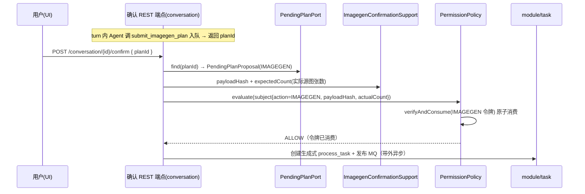

# module/imagegen —— 生成式产图路径（提案 + 带外重绘执行，Wave 3）

> 本文是 PixFlow 完整重写阶段 `module/imagegen` 模块的设计文档，对应 `design.md` 第六章 6.3「HITL 确认」、第十章 10.2「生图子 Agent（生成式重绘路径）」、第九章 9.2 异步执行、第十三章数据模型，以及 `module-dependency-dag-plan.md` 的 **Wave 3**。
> 范围：`submit_imagegen_plan` 提案工具的 handler（校验 + 入待确认队列）、无状态单图重绘执行器、确认令牌载荷计算、与确定性 DAG 路径并列的第二条产图路径的落地边界。
> 配套阅读：`infra/ai.md`（`ImageGenClient` 源图重绘、模型无感、全局并发）、`infra/storage.md`（`GENERATED` 桶与 `StorageKeys.generated`）、`infra/permission.md`（`IMAGEGEN` 确认令牌、子 Agent 硬约束）、`harness/tools.md`（`submit_imagegen_plan` 工具边界、零令牌、handler 倒置）、`module/file.md`（`asset_image` 源图事实）、`harness/state.md`（`process_result` 断点）。本文不涉及 MVP 既有实现，从新架构需求重新推导，按生产级标准设计。

---

## 目录

- [一、文档定位与设计原则](#一文档定位与设计原则)
- [二、定位校正：生成式路径而非「子 Agent」](#二定位校正生成式路径而非子-agent)
- [三、两张脸：提案侧 vs 执行侧](#三两张脸提案侧-vs-执行侧)
- [四、模块结构与依赖位置](#四模块结构与依赖位置)
- [五、提案侧：submit_imagegen_plan handler](#五提案侧submit_imagegen_plan-handler)
- [六、待确认提案的存储（与会话关联，复用 pending-plan）](#六待确认提案的存储与会话关联复用-pending-plan)
- [七、HITL 与 permission 对接](#七hitl-与-permission-对接)
- [八、执行侧：复用 task 异步外壳](#八执行侧复用-task-异步外壳)
- [九、与 infra/ai 的边界](#九与-infraai-的边界)
- [十、存储与 process_result 落点](#十存储与-process_result-落点)
- [十一、断点恢复、幂等与失败隔离](#十一断点恢复幂等与失败隔离)
- [十二、错误与降级](#十二错误与降级)
- [十三、配置](#十三配置)
- [十三.五、可观测性](#十三五可观测性)
- [十四、对其他模块的契约](#十四对其他模块的契约)
- [十五、测试策略](#十五测试策略)
- [十六、对 design.md 与依赖 DAG 的细化](#十六对-designmd-与依赖-dag-的细化)
- [十七、暂不考虑](#十七暂不考虑)

---

## 一、文档定位与设计原则

`module/imagegen` 处于依赖 DAG 的 **Wave 3**，依赖 `infra/ai`（`ImageGenClient` 源图重绘）、`infra/storage`（`GENERATED` 桶落生图）、`permission`（+ `contracts` 的确认令牌契约）、`contracts.proposal`（待确认提案 SPI）、`common`（错误归一化、脱敏）。它被 `agent`（接线 `submit_imagegen_plan` 工具）与 `module/task`（带外执行时调用重绘执行器）消费。

模块专属设计原则：

1. **零真实副作用、零令牌的提案侧**。`submit_imagegen_plan` 只校验源图引用 + 提示词并入待确认队列，**不调生图模型、不携带确认令牌**（`harness/tools.md §3.5/§8.3`）。Agent 没有任何能扣下生图扳机的工具。
2. **纯能力模块，不自持异步外壳**。imagegen 只提供「提案 handler」与「无状态单图重绘执行器」两类能力，**不拥有 MQ / Redis / `process_*` 表 / 进度 / 恢复**。批量编排、fan-out、断点恢复、`process_result` 落库全部复用 `module/task`（见 [§八](#八执行侧复用-task-异步外壳)）。这是它保持 Wave 3 依赖最小（只 ai/storage/permission/common）的前提。
3. **与确定性 DAG 路径严格对称**。两条产图路径（确定性 / 生成式）都走 `propose → confirm → execute`：提案工具只入队，真实执行只能由用户确认 REST 边界触发；产物同样落 MinIO + `process_result`（`design.md §10.2`）。imagegen 之于生成式路径，等同 `module/dag` 之于确定性路径。
4. **存储/模型边界清晰**。imagegen 负责把 MinIO 源图引用解析成字节喂 `ImageGenClient`、把结果字节落 `GENERATED` 桶；`infra/ai` 对存储无感（`infra/ai.md §十`）。
5. **安全边界在 permission 与确认 REST 边界，不在 imagegen 文案**。`IMAGEGEN` 令牌的签发与消费在确认 REST 边界（`module/conversation`）由 permission 硬校验；imagegen 只负责**重算真实载荷**（payloadHash / 实际张数）供 permission 比对（`permission.md §5.3`）。
6. **只做源图重绘**。本期不做纯文生图（`infra/ai.md §5.3/§十六` 已堵），`source_image_ids` 必填。
7. **生产级、不简化**。批量重绘的进度、失败隔离、断点恢复（借 task）、全局并发封顶（借 infra/ai 的 `GlobalConcurrencyLimiter`）、紧错误归一化齐备。

---

## 二、定位校正：生成式路径而非「子 Agent」

`design.md §10.2` 把本模块称作「生图子 Agent」。但把 `harness/tools.md §3.3/§3.5`、`infra/ai.md §5.3`、`subagent` 边界串起来看，它**不是 `agent` 工具那种 turn 内只读 child runtime**：

- 真正的「子 Agent」是 `agent(type=vision/explore)`：独立 child runtime、turn 内同步跑、只读、只回最终 `ToolExecutionResult`。`harness/tools.md` 明确把生图**排除在该只读 runner 之外**（「生图是带后果的提案动作，不放进只读 runner」）。
- 生图提示词是**主 Agent 自己撰写的**（`design.md §10.2`「主 Agent 综合数据分析 + 召回记忆 + 用户要求，撰写生图提示词」），imagegen 这里只有一次模型调用（`ImageGenClient.generate`），**没有 child runtime、没有 think-act-observe 循环**。

因此本文把 imagegen 定位为**「与确定性 DAG 并列的第二条产图路径（生成式重绘路径）」**，而非子 Agent。这一措辞细化已登记在 [§十六](#十六对-designmd-与依赖-dag-的细化)，需同步回 `design.md §10.2`。它直接决定本模块**只做能力、不做编排/循环**。

---

## 三、两张脸：提案侧 vs 执行侧

零副作用 + 带外确认的硬约束让 imagegen 天然劈成两段，与 DAG 路径一一对应：

| | 提案侧（Agent turn 内） | 执行侧（带外，确认后异步） |
|---|---|---|
| 触发 | `submit_imagegen_plan` 工具 handler | 确认 REST 端点校验 `IMAGEGEN` 令牌通过 → task 异步执行 |
| 动作 | 校验 `source_image_ids` + `prompt`，产出规范化 `ImagegenPlan` 入待确认队列 | task fan-out 生成式单元 → 每单元调 `ImageGenExecutor.redraw` |
| 副作用 | 零、零令牌 | 真实生图（付费模型调用）、落 `GENERATED` 桶 |
| 归属组件 | `proposal/`（本模块） | `exec/`（本模块）+ `module/task`（外壳）|
| 对应确定性路径 | `submit_image_plan`（`module/dag` handler）| confirm REST → task worker 执行像素链 |

判断准则：**imagegen 拥有「校验提案 + 单图重绘能力」；批量异步执行的一切（fan-out / 进度 / `process_result` / 恢复 / 取消）属 task。** 任何「进度自增 / 加锁 / 落 `process_*` / 发 MQ」一旦出现在 imagegen，就是越界。

> **执行器的装配时机**：imagegen 在 Wave 3 **实现并自测** `DefaultImageGenExecutor`（fake ai + fake storage 集成测试），但**不在 Wave 3 通过 AutoConfiguration 装配到 Spring 上下文**——待 Wave 4 task 模块就绪后，由 task 的 AutoConfiguration 主动 import 该 executor。这是 SPI 倒置 + 波次边界的具体落地，避免 imagegen 在 task 未就绪时把 executor 暴露给无人消费的 runner。

---

## 四、模块结构与依赖位置

Maven 模块：`pixflow-module-imagegen`（需加入根 `pom.xml` `<modules>` 与 `dependencyManagement`）。源码包：`com.pixflow.module.imagegen`

```
module/imagegen/
├── proposal/
│   ├── ImagegenPlanToolHandler.java   # submit_imagegen_plan 的 ToolHandler（harness/tools 收集）
│   ├── ImagegenPlanDescriptor.java    # 暴露 ToolDescriptor @Bean（name/inputSchema/prompt）
│   ├── ImagegenPlan.java              # 规范化提案 record：sourceImageIds + prompt + params + note
│   ├── ImagegenPlanValidator.java     # 深校验：源图存在/归属、prompt 长度、张数上限、参数白名单
│   └── ImagegenPlanInputs.java        # 工具入参浅层形状（source_image_ids / prompt / note / params）
├── exec/
│   ├── ImageGenExecutor.java          # SPI：无状态单图重绘（被 module/task 消费）
│   ├── DefaultImageGenExecutor.java   # 实现：解析源图字节→ai.generate→put GENERATED→返回产物
│   ├── GenerativeUnitSpec.java        # 执行单元载荷：源图 ObjectLocation + 输出 key + prompt + params
│   └── GeneratedArtifact.java         # 产物：ObjectRef + contentType + TokenUsage
├── confirm/
│   ├── ImagegenConfirmationSupport.java # 重算 payloadHash / expectedCount，供 confirm 边界构造 PermissionSubject
│   └── ImagegenPayloadHasher.java     # 规范化(有序源图集 + prompt + 参数白名单) → 稳定哈希
├── port/
│   └── SourceImageReader.java         # SPI：按 imageId 解析源图 ObjectLocation + 归属校验（file 实现，倒置）
├── error/
│   └── ImagegenErrorCode.java         # enum implements common.ErrorCode（提案侧校验错误）
└── config/
    └── ImagegenProperties.java        # @ConfigurationProperties(pixflow.imagegen)
```

依赖方向：

```
imagegen ──► infra/ai        （ImageGenClient.generate 源图重绘）
imagegen ──► infra/storage   （getStream 解析源图字节、put 结果到 GENERATED 桶）
imagegen ──► permission      （ConfirmationAction.IMAGEGEN / 构造 PermissionSubject 输入）
imagegen ──► contracts       （confirmation 令牌形状 + proposal.PendingPlanPort / PendingPlanProposal）
imagegen ──► common          （PixFlowException / ErrorCode / Sanitizer）
agent    ──► imagegen        （接线 submit_imagegen_plan 工具）
module/task ──► imagegen      （执行侧消费 ImageGenExecutor；Wave 4 落地的依赖边，见 §十六）
```

> **Wave 3 实现 vs 装配边界**：`DefaultImageGenExecutor` 在 Wave 3 范围内实现并自测齐全（含 fake `infra/ai` + fake `infra/storage` 的集成测试），但**不通过 imagegen 自己的 AutoConfiguration 装配到 Spring 上下文**——避免在 task 还没就绪时（Wave 4）把 executor 暴露给无人消费的 runner。待 task 模块就绪后，由 task 的 AutoConfiguration 主动 `import` 该 executor 的 `@Bean`（SPI 倒置 + 波次边界清晰）。这一边界由一个 imagegen 侧的 sentinel 单测守护（断言 `DefaultImageGenExecutor` 的 `@Configuration` 装配开关默认关闭）。

两条 SPI 倒置（避免 imagegen 反向依赖 file 或 pending-plan 持久化实现，与 `state.CheckpointReadPort`←task、`context.TranscriptPort`←session 同款手法）：

- **`PendingPlanPort`**：契约位于 `contracts.proposal`，生产实现由拥有 `pending_plan` 表的 `module/dag` 提供；imagegen 只消费 SPI 提交/取回提案（见 [§六](#六待确认提案的存储与会话关联复用-pending-plan)）。
- **`SourceImageReader`**：按 `imageId` 解析 `asset_image.minio_key` 与归属校验由 `module/file` 实现（imagegen 不直连 `asset_*` 表）。

**不依赖**：`infra/mq`、`infra/cache`、`harness/state`、`module/dag`、`module/task` 的业务类型、`module/conversation`、MySQL/MyBatis-Plus（提案持久化倒置给 `contracts.proposal.PendingPlanPort`，生产实现由 dag 承担；结果落库由 task 承担）。

---

## 五、提案侧：submit_imagegen_plan handler

`submit_imagegen_plan` 是 Agent 级工具，handler 归属本模块、由 `harness/tools` 的 Registry 收集（`harness/tools.md §3.5/§四`）。它在 turn 内执行，零副作用、零令牌。

### 5.1 入参与校验三层

对齐 `harness/tools.md §十四` 的三层校验：

1. **JSON Schema（tools 层）**：`source_image_ids`（非空字符串数组，必填）、`prompt`（非空字符串，必填）、`note`（可选）、`params`（可选对象）。形状不合法 → `invalid_tool_input`，不进 handler。
2. **工具级 `validateInput`（tools 层）**：`source_image_ids` 去重非空、`prompt` 长度上下界、`params` 仅含白名单键。
3. **handler 深校验（`ImagegenPlanValidator`，本模块）**：
   - 经 `SourceImageReader` 校验每个 `imageId` 存在、且归属当前会话绑定的素材包（`packageId` 由 `ToolInvocation` 的会话上下文给定）；不存在/不归属 → 结构化 tool error，不入队。
   - 张数 ≤ `pixflow.imagegen.max-source-images`；超限 → tool error（提示拆分提案）。
   - 源图内容类型在 `supported-source-types` 白名单（仅形状校验，不解码——解码留给执行侧 ai）。

### 5.2 产出与返回

校验通过 → 规范化为 `ImagegenPlan`（有序 `sourceImageIds`、trim 后的 `prompt`、归一化 `params`、`note`、`conversationId`、`packageId`），经 `PendingPlanPort.enqueue` 入待确认队列，返回**提案引用**（`planId` + 摘要：源图张数、prompt 摘要、note），由 Agent 通过 SSE 告知用户「已生成生图提案，待确认」。

- **入队幂等**：同 `toolCallId` 重复提交不产生重复 pending plan（`harness/tools.md §七` 要求 `submit_*_plan` 入队幂等）；当前 `pending_plan` 表按 `toolCallId` 去重。若未来存在跨会话 toolCallId 碰撞风险，应另起 migration 改为 `(conversationId, toolCallId)` 联合唯一键。
- **并发安全**：`submit_imagegen_plan` 标 `concurrencySafe=true`，多条提案（不同变体/不同 prompt）可在一轮内并发提交。
- **结果预算**：返回摘要受 Tool Registry 结果预算约束，正常体积很小，无需外置。

> handler **不**写 `process_result`、**不**调生图模型、**不**签发或读取任何令牌。

---

## 六、待确认提案的存储（与会话关联，复用 pending-plan）

确认时序要求 confirm REST 端点能**按 `planId` 取回提案原文**以重算 `payloadHash` 与张数（`permission.md §5.1` 时序）。因此提案必须在「提交 → 确认」之间持久化。

设计决策：

- **提案与会话关联**：pending plan 记录包含 `conversationId`，确认 REST 边界可按会话校验归属。
- **DAG 与生图提案共用同一套 pending-plan 机制**：`submit_image_plan`（DAG 提案）与 `submit_imagegen_plan`（生图提案）写入同一 `pending_plan` 存储，用 `planType ∈ {IMAGE_PLAN, IMAGEGEN}` 区分载荷，统一生命周期（创建 / 取回 / 确认消费 / 过期失效）。
- **倒置接缝 `PendingPlanPort`**：imagegen 只依赖 `contracts.proposal` 中的纯 SPI；生产实现由拥有 `pending_plan` 表、mapper 与状态机的 `module/dag` 提供，避免 imagegen 直连 MyBatis 或依赖 conversation。

```java
public interface PendingPlanPort {
    /** 入队待确认提案，返回 planId（同 toolCallId 幂等）。 */
    String enqueue(PendingPlanProposal proposal);
    /** confirm 边界按 planId 取回原文（供重算 payloadHash / count）。 */
    Optional<PendingPlanProposal> find(String planId);
}
```

- `PendingPlanProposal` 是 `contracts.proposal` 中立 record（`planType` + 载荷 JSON + `conversationId` + `packageId` + `toolCallId` + 创建时间），不绑定 imagegen/dag 具体类型，便于两路共用。
- imagegen 把 `ImagegenPlan` 序列化为载荷写入；confirm 边界与 `ImagegenConfirmationSupport` 反序列化回 `ImagegenPlan` 重算载荷。
- **持久化介质归 dag**：MySQL `pending_plan` 表、TTL、状态机与 idempotency 由 dag 的 `PendingPlanPortAdapter` / `PendingPlanService` 承担，本模块不感知。

> 该 `PendingPlanPort` 的精确形状属 `base/contracts.md §六.五`；生产实现属 `module/dag`。本文只钉死 imagegen 侧契约：**产出 `ImagegenPlan`、经端口入队取回，不自持提案表，也不依赖 dag 业务类型**。已登记为 [§十六](#十六对-designmd-与依赖-dag-的细化) 的跨切细化。

---

## 七、HITL 与 permission 对接

`IMAGEGEN` 令牌闸门**整体在 imagegen 之外**——在确认 REST 边界（`module/conversation`）由 permission 硬校验、单次消费。imagegen 的职责是**为该边界重算真实载荷**，不在 worker 里二次验令牌（与 DAG 路径完全一致：令牌在 confirm 边界消费，task worker 不再验）。



- **payloadHash**：`ImagegenPayloadHasher` 对 `规范化(有序 sourceImageIds + prompt + 参数白名单)` 算稳定哈希。**sourceImageIds 的"有序"口径按 imageId 字典序规范化**（与 dag.md §7.4 Canonical Form 一致——哈希是 fingerprint，不携带"用户拖拽顺序"这类业务意图；用户的业务意图由 prompt 与 params 承载）。confirm 边界与签发时口径一致，防「确认 A 提示词、执行 B 提示词」漂移（`permission.md §5.2`）。
- **expectedCount**：= 生成式单元数（默认 = 源图张数，见 [§八](#八执行侧复用-task-异步外壳)）。超 `pixflow.permission.bulk-threshold` 需 `BULK` 令牌。
- **子 Agent 双重拦截**：`agent(type=vision/explore)` 等只读 child **不应看到也调不到** `submit_imagegen_plan`，拦截分两层——① **Schema 层**：`ToolDescriptor` 在子 Agent 上下文中由 `harness/tools.isToolVisible` 过滤掉（不进 LLM schema/prompt）；② **执行层**：`SubmitImagegenPlanHandler` 在 ToolHandler 中标 `readOnly=true`，permission 阶段 A 一旦收到 readOnly=false 的子 Agent 调用 → `SUBAGENT_FORBIDDEN_ACTION` 硬 deny（`permission.md §七`）。这是 dag 路径同款写法，双层防护避免 schema 被绕过时的意外越权。
- **令牌与 LLM 隔离**：`submit_imagegen_plan` 的工具 schema 不含任何 token 字段；imagegen 全程不读、不填、不复读令牌（`permission.md §5.1`）。

imagegen 对 permission 的依赖仅限：引用 `ConfirmationAction.IMAGEGEN`（contracts）、产出 `PermissionSubject` 所需的 `payloadHash`/`actualCount` 输入。**verifyAndConsume 由 permission 在 confirm 边界执行**，不在本模块。

---

## 八、执行侧：复用 task 异步外壳

确认令牌消费后，真实重绘是「批量、慢、需进度/失败隔离/断点恢复」的生产级异步活。决策（与你确认一致）：**imagegen 保持纯能力，复用 `module/task` 的异步外壳**——task 像处理 DAG 支路一样处理「生成式单元」，每单元调 `ImageGenExecutor.redraw`。

### 8.1 执行单元与 fan-out

- **生成式单元 = 「1 源图 → 1 重绘图」**，与 DAG 的 `[图片×支路]` 单元粒度对齐，天然复用 task 的 fan-out / `UnitKey` / 进度计数 / 失败隔离 / 幂等重算（`state.md §五`、`design.md §9.4`）。
- 一个生成式 `process_task` 持有 `planId` 对应的 `ImagegenPlan`；task 把它展开成 N 个单元（N = 源图张数），并发执行（并发上限叠加 task 线程池与 infra/ai 的 `GlobalConcurrencyLimiter` 双重封顶）。
- 本期一个 prompt → 每源图一张重绘（单变体）；多变体属 [§十七](#十七暂不考虑)。

### 8.2 ImageGenExecutor SPI

```java
public interface ImageGenExecutor {
    /** 无状态单图重绘：解析源图字节 → ai 重绘 → 落 GENERATED 桶 → 返回产物。不写 process_result、不发进度。 */
    GeneratedArtifact redraw(GenerativeUnitSpec spec);
}

public record GenerativeUnitSpec(
        String taskId,
        String skuId,
        String sourceImageId,
        ObjectLocation sourceLocation,   // 源图在 PACKAGES 桶的位置（task 从 asset_image 取得后传入）
        String prompt,
        Map<String,Object> params,
        String outputExt                 // 输出格式（默认配置）
) {}

public record GeneratedArtifact(ObjectRef output, String contentType, TokenUsage usage) {}
```

`DefaultImageGenExecutor.redraw` 流程：

```
spec
  → ObjectStorage.getStream(spec.sourceLocation) 解析源图字节（受 max-read-bytes 保护）
  → ImageGenClient.generate(ImageGenRequest{sourceImage, sourceContentType, prompt, options(params)})
  → 字节预检：result.image.length > max-output-bytes → 抛 PixFlowException(IMAGEGEN_OUTPUT_BYTES_TOO_LARGE, VALIDATION, SKIP)
       （与 dag §十二.2 的 source-bytes-limit 对称；超限单位隔离、避免堆上同时持多张超大生成图）
  → ObjectStorage.put(StorageKeys.generated(taskId, skuId, sourceImageId, outputExt), 生成字节, size, ct)
  → 返回 GeneratedArtifact{ObjectRef, contentType, usage}
```

- **无状态**：executor 不持久化任何东西、不发进度、不碰 `process_result`。它只「把一张源图重绘成一张新图并落桶」。
- **task 承接其余**：task 拿 `GeneratedArtifact` 写 `process_result`（`output_minio_key`、`source_path` 标生成式、`status`、`usage`），incr 进度计数，推 WebSocket，处理失败隔离与单元间取消检查。

### 8.3 为什么不让 imagegen 自建异步

- 自建会引入 `imagegen → mq/cache/state` 依赖，破坏 Wave 3 干净边界，并把 task 的 worker/恢复逻辑重造一遍。
- task 已是「DAG 异步执行外壳」，让它再承接生成式单元是最小增量；新增 `imagegen → task` 依赖边与现有 `dag → task` 完全对称（见 [§十六](#十六对-designmd-与依赖-dag-的细化)）。
- 内联同步执行（在 confirm 端点跑完）只适合极小批量，缺断点恢复/失败隔离，不达生产标准——故否决。

---

## 九、与 infra/ai 的边界

严守 `infra/ai.md §5.3/§十` 的「模型调用层对存储无感」边界：

- imagegen 把 MinIO 源图引用解析成 `byte[]`（`ObjectStorage.getStream`）再传 `ImageGenRequest.sourceImage`；**ai 不碰 MinIO**。
- ai 只回生成字节 + `contentType` + `TokenUsage`（`ImageGenResult`）；**落 `GENERATED` 桶由 imagegen**。
- **只做源图重绘**：`ImageGenRequest.sourceImage` 必填，本期不传纯文生图路径。
- **模型型号配置化**：生图模型（通义万相类）由 `infra/ai` 的 `ModelRole.IMAGEGEN` 路由配置承载，imagegen 不锁型号、不调参数细节（仅透传白名单内 `params`）。
- **全局并发与重试归 ai**：付费生图调用的限流/重试/熔断（`ModelRetryRunner`）与跨实例并发封顶（`GlobalConcurrencyLimiter`）在 `infra/ai` 内完成；imagegen 不自建重试层。
- **HITL 与 ai 无关**：ai 被调到即执行重绘，不判断是否被允许（`infra/ai.md §十`）；放行判断已在 confirm 边界完成。

---

## 十、存储与 process_result 落点

- **生图产物桶**：`BucketType.GENERATED`（`storage.md §三`），key 由 `StorageKeys.generated(taskId, skuId, imageId, ext)` → `{taskId}/{skuId}_{imageId}.{ext}`（`imageId` = 源图 id）。imagegen 负责 `put`。
- **`process_result`（task 写，imagegen 不写）**：生成式单元的结果落 `process_result`，对齐 `design.md §13.1`——`source_path` 标生成式来源（源图引用）、`output_minio_key` = `GENERATED` 桶内 key、`image_id` = 源图 id、`branch_id` 用生成式标识（默认单变体）、`status`/`error_msg` 按执行结果。
- **`RESULTS` vs `GENERATED` 分桶**：确定性结果落 `RESULTS`、生成式落 `GENERATED`（`storage.md §三`），便于按路径统计与差异化策略；`process_result.output_minio_key` 存桶内 key，桶由结果类型推导。

---

## 十一、断点恢复、幂等与失败隔离

全部复用 task 的运行态协调（`state.md §十`、`design.md §9.4`），imagegen 只保证单图重绘可重复执行：

- **单元幂等重算**：生成式单元整体幂等重算（与支路幂等一致）；`process_result` 落库即视为该单元完成，恢复时跳过。崩溃/重启由 task 的 `@Scheduled` 重扫 + MQ 重投续跑。
- **执行器幂等性质**：`redraw` 无副作用累积——重跑覆盖同一 `GENERATED` key（`put` 幂等），不产生残留。
- **失败隔离**：单源图重绘失败（源图读取/解码失败、ai 调用最终失败）→ 该 `process_result` 标失败、记 `error_msg`（≤1000 字脱敏）、不留半成品 `output_minio_key`；同任务其余源图继续（`design.md §9.4`）。隔离动作在 task；executor 只把失败以 `PixFlowException` 抛出交 task 判定。
- **任务终态**：至少一条成功 → 完成；全失败 → 失败（task 裁决，`design.md §9.4`）。
- **取消**：task 在单元间检查取消标志；executor 不感知取消。

---

## 十二、错误与降级

`ImagegenErrorCode implements common.ErrorCode`（码自治，并入 `common` 启动期聚合测试校验唯一性 + i18n + category 非空）。提案侧校验错误：

| code | category | recovery | 场景 |
|---|---|---|---|
| `IMAGEGEN_SOURCE_IMAGE_NOT_FOUND` | NOT_FOUND | SKIP | `source_image_ids` 含不存在的 imageId |
| `IMAGEGEN_SOURCE_NOT_IN_PACKAGE` | BUSINESS_RULE | SKIP | 源图不归属当前会话绑定素材包 |
| `IMAGEGEN_PROMPT_INVALID` | VALIDATION | SKIP | prompt 为空 / 超长度上下界 |
| `IMAGEGEN_TOO_MANY_SOURCES` | BUSINESS_RULE | SKIP | 源图张数超 `max-source-images` |
| `IMAGEGEN_UNSUPPORTED_SOURCE_TYPE` | VALIDATION | SKIP | 源图内容类型不在白名单 |
| `IMAGEGEN_OUTPUT_BYTES_TOO_LARGE` | VALIDATION | SKIP | 生成图字节超过 `max-output-bytes`（执行期字节超限，单图隔离）|
| `IMAGEGEN_STORAGE_WRITE_FAILED` | STORAGE | SKIP | 写 `GENERATED` 桶失败（细化 storage 通用错误，便于 UI 提示"生图结果未保存"）|
| `IMAGEGEN_PAYLOAD_HASH_MISMATCH` | VALIDATION | TERMINATE | confirm 端点重算 payloadHash 与 token claims 不一致（与 `DAG_PAYLOAD_HASH_MISMATCH` 对称）|
| `IMAGEGEN_CONTENT_POLICY_VIOLATION` | PROVIDER | SKIP | 供应商内容审查拒生图（细化 ai 的 `MODEL_PROVIDER_ERROR`，便于 UI 提示"生图被供应商拒绝"）|
| `IMAGEGEN_PLAN_NOT_FOUND` | NOT_FOUND | TERMINATE | confirm 边界按 planId 取回提案落空（过期/已消费）|

降级与边界：

- **提案侧失败**：转结构化 tool error 回填模型（`harness/tools.md §十五`），不崩主循环；recovery 多为 `SKIP`（Agent 可修正后重提）。
- **执行侧失败**：`infra/ai` 在源头构造带 `category`（NETWORK/RATE_LIMIT/PROVIDER/CONTEXT_LIMIT）的 `PixFlowException`（`infra/ai.md §八`）；imagegen executor 不吞、不重试（重试在 ai 层），原样抛给 task，由 task 落 `process_result` 失败 + 失败隔离。
- **脱敏**：所有对外/落库文案经 `common.Sanitizer`；prompt 可能含业务文字，但不含凭证——生图模型 API key 由 `infra/ai` 管理，imagegen 不接触。

---

## 十三、配置

`@ConfigurationProperties(prefix = "pixflow.imagegen")`：

```yaml
pixflow:
  imagegen:
    proposal:
      max-source-images: 200          # 单条生图提案的源图张数上限（超限要求拆分提案）
      prompt-min-chars: 1
      prompt-max-chars: 2000          # 生图提示词长度上下界
      allowed-param-keys: [style, strength, negative_prompt, seed]  # params 白名单
    output:
      default-ext: png                # 生图结果默认输出格式（落 GENERATED 桶）
      max-output-bytes: 52428800     # 50MiB；生成图字节超过此值 → IMAGEGEN_OUTPUT_BYTES_TOO_LARGE（与 dag 的 source-bytes-limit 对称）
    source:
      supported-types: [image/jpeg, image/png, image/webp]  # 源图内容类型白名单（仅形状校验，不解码）
      max-read-bytes: 52428800        # 50MiB；源图字节解析上限（保护堆）
```

- 生图模型型号、温度/尺寸等生成参数、紧超时与并发上限**不在此**——归 `infra/ai`（`pixflow.ai.roles.imagegen` 与 `pixflow.ai.concurrency.imagegen`）。
- `bulk-threshold` 等令牌阈值归 `permission`（`pixflow.permission.bulk-threshold`）。

## 十三.五、可观测性

imagegen 通过 Micrometer 暴露指标，**不依赖 `harness/eval`**（与 `harness/tools` / `module/dag` 同款做法，honor 依赖 DAG 中 `imagegen` 无 `→ eval` 边）。指标由 Spring Boot Actuator 端点暴露，Prometheus/Grafana 直接消费。

| 指标名 | 类型 | 标签 | 含义 |
|---|---|---|---|
| `pixflow.imagegen.proposal` | counter | `result=ok\|reject`, `code=IMAGEGEN_*` | 提案校验结果分布（按错误码细分） |
| `pixflow.imagegen.proposal.duration` | timer | —— | 提案 handler 耗时（应 P99 < 30ms，含源图归属校验）|
| `pixflow.imagegen.redraw` | counter | `outcome=ok\|failed\|timeout\|rate_limited\|provider\|payload_too_large` | 单图重绘结果分布（outcome 维度对齐 dag.md §十三.5）|
| `pixflow.imagegen.redraw.duration` | timer | `outcome` | 单图重绘耗时（应 P99 < 10s，正常源图重绘）|
| `pixflow.imagegen.payload.bytes` | distribution summary | `direction=source\|generated` | 源图与生成图字节分布（用于容量规划）|
| `pixflow.imagegen.payload.hash.mismatch` | counter | —— | payloadHash 不一致计数（确认漂移/重放尝试）|

**关键约束**：
- 指标**不带业务字段**（taskId、skuId、imageId 不入标签），避免高基数打爆指标存储。
- `outcome=failed` 与 `result=reject` 按 `ImagegenErrorCode` 细分 label，便于定位"哪些错误码高频出现"。
- timer 直方图分位点（SLO 友好）默认启用 `publishPercentileHistogram()`，Actuator 端点 `/actuator/prometheus` 暴露分位数据。
- 异常时仅记录 `code + safeMessage + traceId`；prompt 内容**不落**指标、不落 trace（脱敏 + 避免 prompt 通过指标反向泄露）。

**trace 与日志**：
- imagegen **不写** `agent_trace` 表（属 harness/eval 职责），但关键错误会通过 SLF4J + traceId 输出（traceId 由 `common.PixFlowException.traceId` 提供）。
- 与 `infra/ai` 同样经 `common.Sanitizer` 脱敏，凭证/绝对路径不进日志。

**与 `dag` 指标的边界**：
- `pixflow.dag.*`（dag.md §十三.5）记录确定性路径（支路数、单元结果、校验通过率、缓存状态）。
- `pixflow.imagegen.*` 记录生成式路径（提案分布、单图重绘结果、payload 大小）。
- 二者**不重叠**：dag 指标按「支路/单元」维度，imagegen 指标按「提案/重绘」维度，prod 排查时按路径下钻、与 `infra/ai` 的 `pixflow.ai.*` 联看（imagegen → ai 调用链是 sync，链路级 Micrometer 自动串联）。

---

## 十四、对其他模块的契约

| 模块 | 契约 |
|---|---|
| `harness/tools` | 暴露 `submit_imagegen_plan` 的 `ToolDescriptor` @Bean + `ToolHandler`；Registry 自动收集；零令牌、`concurrencySafe=true`、Plan 模式不可见、入队幂等 |
| `infra/ai` | 经 `ImageGenClient.generate` 源图重绘；imagegen 传字节、收字节，落桶自理；重试/并发/型号归 ai |
| `infra/storage` | `getStream` 解析源图字节；`put` 结果到 `GENERATED` 桶（`StorageKeys.generated`）|
| `permission` | confirm 边界 `evaluate(action=IMAGEGEN)` 由 permission 校验消费令牌；imagegen 经 `ImagegenConfirmationSupport` 提供 `payloadHash`/`actualCount`；子 Agent 调本工具被硬 deny |
| `contracts` | 引用 `ConfirmationAction.IMAGEGEN` 等确认令牌动作枚举；消费 `contracts.proposal.PendingPlanPort` / `PendingPlanProposal` 提交与取回待确认提案 |
| `module/dag` | 提供唯一生产 `PendingPlanPort` 实现，统一写入/读取 `pending_plan`；imagegen 不依赖 dag 业务类型，只通过 contracts SPI 接入 |
| `module/conversation` | confirm REST 端点通过 pending-plan 事实视图取回提案、算载荷、构造 `PermissionSubject`、触发 task；不实现 `PendingPlanPort` |
| `module/file` | 实现 `SourceImageReader`（按 imageId 解析 `asset_image.minio_key` + 归属校验）；imagegen 不直连 `asset_*` 表 |
| `module/task` | 消费 `ImageGenExecutor.redraw` 执行生成式单元；fan-out / 进度 / `process_result` 落库 / 失败隔离 / 恢复 / 取消全在 task |
| `agent` | 撰写生图提示词、接线 `submit_imagegen_plan`、向用户呈现提案与确认引导 |
| `common` | 抛 `PixFlowException`（`ImagegenErrorCode`）；文案经 `Sanitizer` |

**反向约束**：imagegen 不依赖 `infra/mq`、`infra/cache`、`harness/state`、`module/dag`、`module/task`（仅被 task 反向依赖）、不直连 MySQL。

---

## 十五、测试策略

- **提案校验单测**：`ImagegenPlanValidator` 覆盖源图不存在/不归属、prompt 空/超长、张数超限、源图类型白名单内外；均转结构化 tool error 不崩。
- **入队幂等**：同 `toolCallId` 重复 `submit_imagegen_plan` → 只产生一条 pending plan（fake `PendingPlanPort` 断言）。
- **payloadHash 稳定性**：`ImagegenPayloadHasher` 对源图集顺序无关（先排序）、prompt trim、参数白名单归一后哈希稳定；改 prompt/源图集 → 哈希变化（防漂移）。
- **令牌隔离**：断言 `submit_imagegen_plan` 的 schema 不含 token 字段；handler 不读令牌；子 Agent 调本工具 → `SUBAGENT_FORBIDDEN_ACTION`（与 permission 联测）。
- **执行器单测（fake ai + fake storage）**：`redraw` 解析源图字节 → 调 `ImageGenClient` → `put` 到正确 `GENERATED` key → 返回 `GeneratedArtifact`；断言不写 `process_result`、不发进度。
- **执行器错误透传**：注入 ai `PixFlowException`（RATE_LIMIT/PROVIDER）→ executor 原样抛出、不吞不重试。
- **存储边界**：源图超 `max-read-bytes` → 拒绝读取（保护堆）；结果落 `GENERATED` 桶 key 形态正确。
- **SPI 倒置守护（ArchUnit）**：`com.pixflow.module.imagegen..` 不出现 MyBatis-Plus/JDBC/Redisson/`SimpMessagingTemplate`/MQ 直连，不依赖 `module/dag`、`module/task`、`module/conversation` 业务类型。
- **错误码目录**：`ImagegenErrorCode` 唯一性 + i18n + category 非空并入 `common` 聚合测试。
- **集成（task 侧承载）**：生成式 `process_task` fan-out → executor → `process_result` 落库 → 失败隔离 → 恢复跳过，全链路在 `module/task` 集成测试覆盖（imagegen 自身不拥有这些表/队列）。

---

## 十六、对 design.md 与依赖 DAG 的细化

本模块对 `design.md` 及相邻设计/计划文档做如下**细化（非冲突）**，需同步记录：

1. **定位措辞校正**（`design.md §10.2`）：把「生图子 Agent」明确为「与确定性 DAG 并列的生成式重绘**路径**」——它无 child runtime、无 think-act-observe，只有「提案 handler + 单图重绘能力」。生图提示词由**主 Agent** 撰写。
2. **依赖边 `task → imagegen`（Wave 4 落地）**（`module-dependency-dag-plan.md`）：执行侧复用 task 异步外壳，task 消费 imagegen 暴露的 `ImageGenExecutor` SPI；与现有 `dag` 在形状上完全对称——dag 同样是被 task 消费，task 才是异步外壳方。**imagegen 本身不依赖 task**，保持 Wave 3 边界的最小依赖（仅 `infra/ai`/`infra/storage`/`permission`/`contracts`/`common`）。这条边在 Wave 4 真正由 task 模块引入时再登记到依赖图。
3. **待确认提案统一归 dag 的 `pending_plan` 持久化实现**：`submit_image_plan`（DAG）与 `submit_imagegen_plan`（生图）共用一套 `pending_plan` 存储，`planType` 区分；`PendingPlanPort` 契约位于 `contracts.proposal`，生产实现位于 `module/dag`，imagegen 经 SPI 倒置接入，不自持提案表。这细化了 `design.md §9.1` 与 `harness/tools.md §3.5` 的「入确认队列」落点。
4. **`IMAGEGEN` 令牌在 confirm 边界单次消费、worker 不再验**（细化 `permission.md`「module/imagegen 生图执行前校验 IMAGEGEN 令牌」表述）：与 DAG 路径一致，令牌在确认 REST 边界 `verifyAndConsume`；imagegen 的 permission 职责是**重算 payloadHash/张数**供比对，异步 worker 执行时令牌已消费、不二次校验。
5. **生成式单元粒度 = 「1 源图 → 1 重绘」**：`expectedCount` = 源图张数，复用 task 的 `[图片×支路]` fan-out/失败隔离/幂等模型；`process_result` 以 `source_path` 标生成式、`image_id` = 源图 id。
6. **倒置接缝 `SourceImageReader`**：imagegen 不直连 `asset_*` 表，按 imageId 解析源图位置/归属由 `module/file` 实现，保持 imagegen 对 file 零编译依赖。
7. **生成图字节防护 `max-output-bytes`**：在 `DefaultImageGenExecutor.redraw` 中对 ai 返回的生成字节做预检，超限抛 `IMAGEGEN_OUTPUT_BYTES_TOO_LARGE`（VALIDATION/SKIP，单图隔离）。与 dag 的 `source-bytes-limit`（防止下载带宽浪费）对称，本条防"重绘返回超大图导致堆上同时持多张图"。这是生产级必做、文档原本缺失的一项。
8. **错误码补强（4 条）**：在原有 6 条 `ImagegenErrorCode` 基础上，新增 ① `IMAGEGEN_OUTPUT_BYTES_TOO_LARGE`（见 §十二、对称 dag `DAG_SOURCE_BYTES_TOO_LARGE`）、② `IMAGEGEN_STORAGE_WRITE_FAILED`（细化 storage 通用错）、③ `IMAGEGEN_PAYLOAD_HASH_MISMATCH`（对称 dag `DAG_PAYLOAD_HASH_MISMATCH`）、④ `IMAGEGEN_CONTENT_POLICY_VIOLATION`（细化 ai `MODEL_PROVIDER_ERROR`）。合计 10 条，全部并入 `common` 启动期聚合测试。
9. **可观测性 6 类指标**：与 dag 的 11 类指标（dag.md §十三.5）在 shape 上对称，按 `proposal`/`redraw`/`payload`/`hash.mismatch` 4 组维度组织；不依赖 `harness/eval`；不带业务字段；细分到 `ImagegenErrorCode` 的 label。
10. **子 Agent 双重拦截**：`submit_imagegen_plan` 对子 Agent 不可见（`harness/tools.isToolVisible`）+ handler 标 `readOnly=true` 让 permission 阶段 A 短路拒绝（`SUBAGENT_FORBIDDEN_ACTION`）。双层防护避免 schema 被绕过时的意外越权，与 dag 路径同款写法。
11. **payloadHash 排序口径**：sourceImageIds 按 imageId 字典序规范化（与 dag Canonical Form 一致）——哈希是 fingerprint，不携带"用户拖拽顺序"这类业务意图；用户的业务意图由 prompt 与 params 承载。
12. **两道独立护栏的明示**：`pixflow.imagegen.proposal.max-source-images`（提案入队上限，提示 agent 拆分提案；防 agent 一次送千张图）与 `pixflow.permission.bulk-threshold`（确认执行时超阈值触发 BULK 二次确认 UI；用户层面的二次慎重）是两道**独立的护栏**，不可合并——前者是入提案时的成本控制，后者是执行前的用户慎重复核，含义与时点完全不同。
13. **多变体 / 多 prompt 对照本期不做**：每条提案一个 prompt、每源图一张重绘（单变体）；用户要"3 个风格候选"需 3 次 `submit_imagegen_plan` → 3 张 `pending_plan` → 3 个生图 `process_task`（3 次确认 UI）。耦合面最小、与 dag 路径单元粒度对齐；多变体留待 [§十七](#十七暂不考虑) 与需求明确后评估。
14. **Wave 3 实现 vs 装配边界**：`DefaultImageGenExecutor` 在 Wave 3 范围内实现并自测齐全（含 fake ai + fake storage 集成测试），但**不通过 imagegen 自己的 AutoConfiguration 装配到 Spring 上下文**——避免在 task 还没就绪时（Wave 4）把 executor 暴露给无人消费的 runner。待 task 模块就绪后，由 task 的 AutoConfiguration 主动 `import` 该 executor 的 `@Bean`（SPI 倒置 + 波次边界清晰）。这一边界由一个 imagegen 侧的 sentinel 单测守护（断言 `DefaultImageGenExecutor` 的 `@Configuration` 装配开关默认关闭）。

> 以上为对既有设计的补充落地，不改变 `design.md §6.3` 的 HITL 硬约束、§10.2 的两条产图路径并列、§13.4 的 MinIO 布局与「安全边界在权限层」原则。

---

## 十七、暂不考虑

- **纯文生图（无源图）**：本期只做源图重绘（`infra/ai.md §5.3` 已堵），接口不堵死，后续可加 text-to-image。
- **单提案多变体 / 多 prompt 批量**：本期一条提案一个 prompt、每源图一张重绘（单变体）；多变体（同源图多风格）或同源图多 prompt 对照，均需发起多次 `submit_imagegen_plan` 走多次确认，不在 v1 范围；待需求明确后再评估单元维度扩展。
- **生成结果的多图合成 / 后处理串接**：生成式产物落桶即止，不接确定性 DAG 像素链；如需「生图后再缩放/加水印」由用户另起确定性提案。
- **生图提示词的自动优化 / 评估闭环**：提示词质量评估属 `module/rubrics`（离线），本模块不做。
- **生图结果去重缓存 / 相同源图+prompt 复用**：待成本瓶颈出现再评估（与 `infra/ai.md §十六` 一致）。
- **imagegen 自建异步执行管线**：执行编排坚持复用 task；若未来生成式路径与确定性路径执行语义分叉过大再评估独立化。

## Revision Notes

2026-06-29 / Kiro: 新增 `module/imagegen` 设计文档。基于设计讨论确定：① 定位为「生成式重绘路径」而非子 Agent（校正 `design.md §10.2` 措辞）；② 两张脸——提案侧 `submit_imagegen_plan`（零副作用零令牌）+ 执行侧无状态 `ImageGenExecutor`；③ 执行复用 `module/task` 异步外壳，新增 `imagegen → task` 依赖边（对称 `dag → task`）；④ 待确认提案与会话关联、与 DAG 提案共用 pending-plan，经 `PendingPlanPort` SPI 倒置；⑤ 生成式单元 =「1 源图→1 重绘」，`IMAGEGEN` 令牌在 confirm 边界单次消费、worker 不再验，imagegen 仅重算 payloadHash/张数。向 `design.md`、`module-dependency-dag-plan.md`、`permission.md`、`module/conversation`（未来）提出 §十六 所列细化与新增依赖边。

2026-07-07 / Codex: 更新待确认提案所有权：`PendingPlanPort` / `PendingPlanProposal` 迁入 `contracts.proposal`，`module/dag` 提供唯一生产实现并写同一张 `pending_plan` 表，imagegen 只消费 contracts SPI；删除旧 `com.pixflow.module.imagegen.port.PendingPlanPort` / `PendingPlanProposal` 设计描述，不再要求 conversation 实现该 port。
