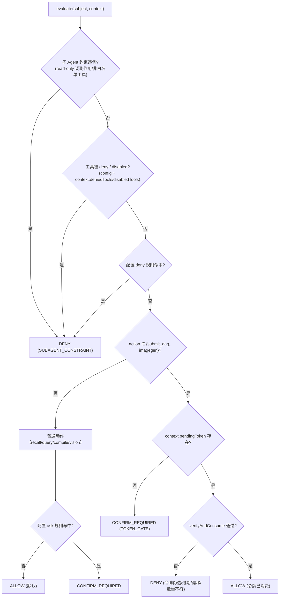

# permission —— 确认令牌与硬安全边界（Wave 0 地基）

> 本文是 PixFlow 完整重写阶段 `permission` 模块的设计文档，对应 `design.md` 第五章 5.5「Lifecycle Hooks」拦截点表、第六章 6.3「HITL 确认」、设计原则三「安全边界是硬约束，不是 Prompt 约束」，以及 `module-dependency-dag-plan.md` 的 **Wave 0 地基**。
> 范围：deny-first 权限决策、确认令牌签发与校验、子 Agent 硬约束、工具可见性。本文不涉及 MVP 既有实现（MVP 无鉴权），从新架构需求重新推导。
> 思路参考 `docs/references/permission-architecture.md`（Python/OneCode），但**仅借鉴 deny-first 骨架与「代码边界不靠 prompt」理念，业务内核完全不同**，全部以 Java 17 + Spring Boot 3 重新设计。

---

## 目录

- [一、文档定位与设计原则](#一文档定位与设计原则)
- [二、与参考实现的本质差异](#二与参考实现的本质差异)
- [三、模块结构与依赖位置](#三模块结构与依赖位置)
- [四、核心抽象](#四核心抽象)
- [五、确认令牌（核心机制）](#五确认令牌核心机制)
- [六、deny-first 评估顺序](#六deny-first-评估顺序)
- [七、子 Agent 硬约束](#七子-agent-硬约束)
- [八、与 harness/common 的接缝契约](#八与-harnesscommon-的接缝契约)
- [九、错误码与 common 集成](#九错误码与-common-集成)
- [十、可观测、脱敏与配置](#十可观测脱敏与配置)
- [十一、测试策略](#十一测试策略)
- [十二、暂不考虑](#十二暂不考虑)

---

## 一、文档定位与设计原则

`permission` 是依赖 DAG 中仅次于 `common` 的最底层节点（Wave 0）。`module-dependency-dag-plan.md` 把它提前到 Wave 0 与 `common` 并列，理由是：**它是硬约束安全边界，被 `harness/tools`、`harness/hooks`、`harness/loop`、`module/imagegen` 直接依赖，越早钉死越能避免下游返工。**

`permission` 专属设计原则：

1. **安全边界是代码边界，不是 Prompt 文本**。「Agent 必须等用户确认才能执行」「超阈值二次确认」由权限层硬 deny 强制，Agent 无法通过任何 prompt 技巧或工具参数自签发确认令牌（`design.md` 设计原则三）。
2. **deny-first 短路**。评估按固定顺序进行，任一硬拒绝阶段命中即返回，绝不被后续的 allow 翻转。
3. **令牌与 LLM 物理隔离**。确认令牌只在服务端可信上下文中流转，**永不进入** prompt、消息 transcript、工具 schema 或 LLM 可见的 `tool_input`。Agent 看不到、填不了、复读不了令牌。
4. **Hook allow 不能覆盖权限 deny**。Hook 可观察/改写/软阻断，但其 allow 永远不能翻转权限层的 deny（`hook-architecture.md` 一致约束）。
5. **三态决策**。区分「正常 HITL 等待确认」与「违规硬拒绝」：前者是 happy path 的暂停（`CONFIRM_REQUIRED`），后者才是错误（`DENY`）。
6. **契约 Wave 0 定稿，实现可延迟注入**。令牌存储等需要 infra 能力的部分以 SPI 接口暴露，permission 只依赖接口，Redis 实现由 `infra/cache`（Wave 1）注入，保持 permission 的 Wave 0 纯净（依赖倒置，沿用 `common` 的 `ErrorRecorder` 手法）。

---

## 二、与参考实现的本质差异

参考实现 OneCode 是**编码 Agent**，其权限层 ~80% 围绕「文件系统/命令/目录访问控制」——deny-first 合并工具规则、`.onecode/settings.json` 项目持久规则、guard 路径分类、受保护目录、可疑 Windows 路径、session 目录授权、交互式 prompter。

PixFlow **没有「Agent 自由读写文件系统」这个面**。它的工具集是固定的六个 Agent 级动作，受控点高度收敛。两者对照：

| 维度 | OneCode（参考） | PixFlow（本模块） |
|---|---|---|
| 内核 | 目录/路径/命令授权 | **确认令牌签发与校验** |
| 工具空间 | 开放（含 bash 任意命令） | 固定六动作，仅 `submit_dag`/`run_imagegen_subagent` 受控 |
| 受保护资源 | `.git`/`.vscode`/`.onecode` 等目录 | 无（无文件系统面） |
| 规则字符串 | `tool(content)` + fnmatch | 不需要（工具集小、单租户） |
| 交互式 prompter | CLI 当场弹窗 / fail-closed | 跨回合走对话 UI（`CONFIRM_REQUIRED`） |
| session 目录授权 | 有 | 无 |
| 子 Agent 硬约束 | `read_only_agent` 等 | 保留并对齐（vision 只读 / imagegen 需令牌） |
| deny-first 骨架 | 有 | **保留借鉴** |
| Registry 可见性 | 有 | **保留借鉴** |

**可借鉴的结构骨架**：deny-first 有序短路、决策模型（action+reason+source+metadata）、特殊 agent 硬限制、fail-closed、Registry 可见性过滤、二次校验通道。
**必须重写的业务内核**：把「目录授权」整体替换为「确认令牌闸门」。

`design.md` 5.5 的 requirement 强规则拦截落点，明确归属本模块的有三条（均为权限层硬 deny）：

| 拦截点 | 机制 |
|---|---|
| 生成建议后必须等用户确认，禁止自动执行 | `submit_dag` 要求携带用户确认令牌，Agent 无法自签发 |
| 大批量重处理二次确认（超阈值张数） | 超阈值的 submit 要求 `BULK` 级令牌 |
| 生图/重跑前用户确认 | 同上（生图 = `run_imagegen_subagent` 令牌；重跑 = 复用 `submit_dag` 令牌） |

---

## 三、模块结构与依赖位置

源码包：`com.pixflow.harness.permission`（与仓库实际根包 `com.pixflow` 对齐；模块物理位置见 `design.md` 第十二章 `harness/permission/`）。

```
harness/permission/
├── PermissionPolicy.java          # deny-first evaluate() / isToolVisible()
├── PermissionSubject.java         # 权限评估最小输入视图；由 harness/tools 适配生成，不依赖 ToolDescriptor
├── PermissionContext.java         # 回合可信上下文（令牌句柄、subagent 标记、deniedTools）
├── PermissionDecision.java        # action + reason + source + subject + metadata
├── PermissionAction.java          # ALLOW / DENY / CONFIRM_REQUIRED
├── PermissionSource.java          # 决策来源枚举（用于 trace/审计）
├── token/
│   ├── ConfirmationToken.java     # 不透明令牌句柄（仅 tokenId，对 LLM 不可见）
│   ├── TokenClaims.java           # action / payloadHash / level / expectedCount / conversationId / exp / nonce
│   ├── ConfirmationAction.java    # SUBMIT_DAG / IMAGEGEN
│   ├── ConfirmationLevel.java     # NORMAL / BULK
│   ├── ConfirmationTokenService.java   # issue() / verifyAndConsume()
│   └── ConfirmationTokenStore.java     # SPI 接口（save/consume 原子）；Redis 实现由 infra/cache 注入
├── subagent/
│   └── SubagentConstraint.java    # read-only / scoped-tools 硬约束描述
└── PermissionErrorCode.java       # enum implements common.ErrorCode（PERMISSION 类）
```

依赖方向：

```
permission ──► common（ErrorCode / PixFlowException / Sanitizer）
permission ──► (SPI) ConfirmationTokenStore   ← infra/cache 提供 Redis 实现（Wave 1 注入）
harness/tools ──► permission（执行管线调 evaluate）
harness/hooks ──► permission（hook allow 不覆盖 deny）
harness/loop  ──► permission（CONFIRM_REQUIRED 转 needConfirm）
module/imagegen ──► permission（令牌校验）
```

permission **不依赖任何上层模块，也不直接依赖 infra**——令牌存储经 `ConfirmationTokenStore` SPI 倒置。

> **Wave 0 接口约束**：permission 不能在 Java 类型层面引用 `harness/tools` 的 `ToolDescriptor`、`ToolCallClassification` 或任何上层模块类型。上层工具执行管线后续负责把自身的 descriptor/classification 适配成 permission 自己定义的 `PermissionSubject`。这样才能保证 `module-dependency-dag-plan.md` 中的 `common → permission → tools` 依赖方向不倒挂。

---

## 四、核心抽象

### 4.1 `PermissionAction` —— 三态决策

```java
public enum PermissionAction {
    ALLOW,             // 放行执行
    DENY,              // 硬拒绝：违规（伪造令牌/只读子Agent越权/工具被deny）→ PERMISSION 错误
    CONFIRM_REQUIRED   // 正常 HITL 暂停：需用户确认，非错误，由 loop 转 needConfirm
}
```

去掉了 OneCode 的 `passthrough`（未使用的占位）和 `ask`（PixFlow 无循环内同步 prompter）。`CONFIRM_REQUIRED` 取代 `ask`，但语义不同：它不是「当场弹窗」，而是「结束本回合、走对话 UI 跨回合确认」。

**为什么三态而非两态**：`submit_dag` 无令牌在 PixFlow 里**绝大多数是正常时序**（Agent 想推进、用户还没点确认），不是违规。用 `DENY`/错误表达它会让日志被大量「假错误」污染，前端也无法区分「你要确认」和「你被拒了」。`CONFIRM_REQUIRED` 把 HITL 暂停建模为一等公民状态。

### 4.2 `PermissionDecision` —— 决策结果

```java
public record PermissionDecision(
    PermissionAction action,
    String reason,                  // 人类可读原因（审计/trace，非对外文案）
    PermissionSource source,        // 决策来源（见下）
    String subject,                 // permission_subject：被判定的动作主体（如 "submit_dag"）
    Map<String, Object> metadata    // confirmReason / requiredLevel / expectedCount 等
) {
    public static PermissionDecision allow(String subject, PermissionSource src) { ... }
    public static PermissionDecision deny(String subject, PermissionSource src, String reason) { ... }
    public static PermissionDecision confirm(String subject, ConfirmationLevel level, Map<String,Object> meta) { ... }
}
```

`PermissionSource` 枚举：`SUBAGENT_CONSTRAINT` / `TOOL_DISABLED` / `TOOL_DENIED` / `CONFIG_RULE` / `TOKEN_GATE` / `DEFAULT_ALLOW`，仅用于 trace 与审计，不影响控制流。

### 4.3 `PermissionContext` —— 回合可信上下文

这是**令牌与 LLM 隔离**的关键载体。它由后端在执行回合开始时装配，持有 LLM 完全不可见的信息：

```java
public record PermissionContext(
    String conversationId,
    ConfirmationToken pendingToken,   // 用户确认后由 REST 端点注入；无确认则为 null
    SubagentConstraint subagent,      // 当前 runtime 的子 Agent 约束；主 Agent 为 null
    Set<String> deniedTools,          // 运行期附加禁用（如 context.metadata）
    Set<String> disabledTools
) {
    public boolean isSubagent() { return subagent != null; }
}
```

> **关键边界**：`evaluate()` 读取令牌**只从 `PermissionContext.pendingToken`**，绝不从工具调用的 `tool_input` 读取。`PermissionContext` 由服务端可信代码（确认 REST 端点 + loop 装配）构造，LLM 无法触达。

### 4.4 `PermissionSubject` —— 权限评估最小输入视图

`PermissionSubject` 是 permission 与 `harness/tools` 的隔离层。它只表达权限层需要知道的事实，不携带完整工具 schema、handler、DAG 对象或业务服务对象。

```java
public record PermissionSubject(
    String toolName,                         // Agent 级动作名，如 submit_dag
    boolean readOnly,                        // 本次调用是否只读；由 tools 分类后适配
    ConfirmationAction confirmationAction,   // 普通动作为空；submit_dag=SUBMIT_DAG，生图=IMAGEGEN
    String conversationId,
    String packageId,
    String payloadHash,                      // 上层按真实待执行载荷规范化后计算
    int actualCount,                         // 上层按真实待执行工作单元重新计算
    Map<String, Object> metadata
) {}
```

字段约束：

- `confirmationAction == null` 表示普通动作，不走确认令牌闸门。
- `payloadHash` 与 `actualCount` 由上层可信服务计算，permission 只比较，不解析 DAG、不读取素材包、不调用 imagegen。
- `toolName` 与 `readOnly` 足够支撑子 Agent 硬约束与工具可见性判断。
- `metadata` 仅用于 trace/审计与确认提示，不作为令牌秘密通道。

### 4.5 `PermissionPolicy` —— 评估入口

```java
public interface PermissionPolicy {
    PermissionDecision evaluate(PermissionSubject subject,
                                PermissionContext context);

    boolean isToolVisible(String toolName, PermissionContext context);
}
```

- `evaluate()`：每次工具调用执行前，由 `harness/tools` 执行管线在 `classify → guard → permission` 步骤调用；调用前先把 tools 内部类型适配为 `PermissionSubject`。
- `isToolVisible()`：被 `ToolRegistry.visibleDescriptors()` 消费——被 disable/deny 的工具不进入 LLM 可见 schema 与 prompt（与 tool-runtime-architecture 一致）。但**路径/令牌级判断不能在 prompt 组装期猜测，仍必须在执行入口基于真实 `PermissionContext` 重判**。

---

## 五、确认令牌（核心机制）

确认令牌是本模块最核心、最体现生产级标准的部分。它解决 `design.md` 的硬约束：副作用动作必须经用户确认，且 Agent 无法自签发。

### 5.1 令牌走可信上下文通道，不做 LLM 工具参数

**反例（不采用）**：把令牌作为 `submit_dag` 的 schema 字段由 LLM 填写。即使服务端验签能挡住「捏造」，也挡不住 LLM「重放」上下文里见过的旧令牌。

**本设计**：令牌全程不进 LLM 可见区。

```mermaid
sequenceDiagram
    participant U as 用户(UI)
    participant API as 确认 REST 端点
    participant Store as ConfirmationTokenStore(Redis)
    participant Loop as harness/loop
    participant Perm as PermissionPolicy
    participant Tools as harness/tools

    Note over Loop: 第 N 轮：Agent 调 compile_dag 产出预览
    Loop->>U: SSE 返回建议 + needConfirm=true
    U->>API: POST /conversation/{id}/confirm (用户点确认)
    API->>API: 服务端按已校验 DAG 算 payloadHash + 数实际 count
    API->>Store: save(tokenId, claims, TTL)
    API-->>Loop: 触发第 N+1 轮，PermissionContext.pendingToken=tokenId
    Note over Loop: 第 N+1 轮：Agent 调 submit_dag
    Tools->>Perm: evaluate(subject, context)
    Perm->>Store: verifyAndConsume(tokenId)  原子读取+删除
    Store-->>Perm: claims（校验 payloadHash/count/exp/action）
    Perm-->>Tools: ALLOW（令牌已消费）
```

`submit_dag` / `run_imagegen_subagent` 的工具 schema **不含任何 token 字段**。

### 5.2 令牌与动作载荷强绑定

令牌绝不是「万能确认」。`TokenClaims` 绑定本次要执行的真实载荷，防止「确认便宜方案、执行贵方案」的漂移（无论来自 Agent 还是前端回传篡改）。这与 `design.md` 5.3「服务端独立校验、不信任前端回传」一脉相承。

```java
public record TokenClaims(
    ConfirmationAction action,    // SUBMIT_DAG / IMAGEGEN
    String conversationId,
    String packageId,
    String payloadHash,           // 规范化 DAG JSON 的哈希；生图为 源图集+提示词 哈希
    ConfirmationLevel level,      // NORMAL / BULK
    int expectedCount,            // 签发时服务端算出的 图片×支路 总数
    Instant issuedAt,
    Instant expiresAt,
    String nonce                  // 单次使用标识
) {}
```

> **`ConfirmationAction` 只有两个值 `SUBMIT_DAG` / `IMAGEGEN`**（决策 Q4）：「重跑」不是独立动作，它在确定性路径上就是「再提交一次（可能裁剪过的）DAG」，复用 `submit_dag` 的令牌闸门即可；`payloadHash` 以「实际要执行的 DAG/支路集合」计算，天然覆盖「只重跑失败支路」的场景。

### 5.3 校验：verifyAndConsume

`submit_dag`/imagegen 执行前，`ConfirmationTokenService.verifyAndConsume` 读取 `PermissionSubject` 中的真实执行事实，依次校验：

1. **存在性**：`context.pendingToken` 非空，且 `Store.consume(tokenId)` 命中（未过期、未被用过）。命中即原子删除（单次使用）。
2. **action 匹配**：claims.action == 当前动作。
3. **会话绑定**：claims.conversationId == context.conversationId。
4. **载荷绑定**：claims.payloadHash == 本次实际待执行载荷的规范化哈希。
5. **数量复核**：实际 `图片×支路` count == claims.expectedCount（防止确认后素材包又变）。
6. **阈值级别**：若实际 count 超配置阈值，要求 claims.level == `BULK`。

任一不通过 → `DENY`（伪造/过期/漂移/数量不符），抛 `PixFlowException(PERMISSION, TERMINATE)`。

> permission 不负责计算 `payloadHash` 或 `actualCount`。`module/conversation` 的确认端点、`module/task` 的提交路径、`module/imagegen` 的生图路径必须在各自业务边界重新计算真实值，再通过 `PermissionSubject` 交给 permission 比对。这样既防止前端/Agent 篡改，也保持 permission 不依赖 dag/file/task/imagegen。

### 5.4 单次使用 + 过期（防重放）

采用**不透明令牌存 Redis** 方案：

- 签发：服务端生成随机 `tokenId`（UUID），claims 存 Redis，带 TTL（默认 10 分钟，可配）。
- 校验：`consume(tokenId)` 用 Lua 脚本原子 `GET + DEL`，保证并发下只有一次成功，杜绝重放与重复提交。
- 撤销：删除 key 即撤销（如对话被关闭、素材包被删）。

选不透明令牌而非 HMAC 自包含签名的理由：PixFlow 本就重度依赖 Redis（锁/进度/断点），单次消费用 `DEL` 最干净，撤销方便，且无需分发/轮换签名密钥。HMAC 方案为实现单次使用仍要在 Redis 存 nonce，负担不减反增。

### 5.5 阈值二次确认（BULK）

对应 `design.md` 5.5「大批量重处理二次确认」：

- 阈值（`图片×支路` 总数）由配置 `pixflow.permission.bulk-threshold` 承载（默认 500）。
- **签发时**：REST 端点算实际 count，超阈值则 `level=BULK` 并在 metadata 标注，UI 必须展示数量让用户二次确认后才发起。
- **submit 时**：`verifyAndConsume` 重新数实际 count，要求超阈值的提交必须持 `BULK` 令牌，且 `expectedCount` 一致。

普通 `NORMAL` 令牌用于未超阈值的提交。

### 5.6 SPI：ConfirmationTokenStore（依赖倒置）

为保持 permission 的 Wave 0 纯净（不依赖 infra），令牌存储以 SPI 接口暴露：

```java
public interface ConfirmationTokenStore {
    void save(String tokenId, TokenClaims claims, Duration ttl);
    Optional<TokenClaims> consume(String tokenId);   // 原子 读取+删除，实现单次使用
}
```

- permission 模块只依赖此接口与一个测试用 `InMemoryConfirmationTokenStore`（单测不起 Redis）。
- `infra/cache`（Wave 1）提供 `RedisConfirmationTokenStore implements ConfirmationTokenStore`（Lua 原子 GET+DEL），由 Spring 注入。
- 手法与 `common` 的 `ErrorRecorder` SPI 一致，避免 `permission → infra` 的顺序倒挂。

---

## 六、deny-first 评估顺序

保留参考的「首个命中即短路」骨架，替换为 PixFlow 的真实拦截点。



**阶段 A（硬拒绝，命中即返回 DENY）**，按顺序：
1. 子 Agent 硬约束违例（见第七节）。
2. 工具级 deny / disabled（config 注册期 + `context` 运行期附加）。
3. 配置 deny 规则命中（`permission_subject` 匹配）。

**阶段 B（副作用动作令牌闸门）**：`submit_dag` / `run_imagegen_subagent`：
- 无令牌 → `CONFIRM_REQUIRED`（正常暂停，非错误）。
- 有令牌但校验失败 → `DENY`。
- 校验通过 → `ALLOW`（消费令牌）。

**阶段 C（普通动作）**：`recall_memory` / `query_commerce_data` / `compile_dag` / `run_vision_subagent` 默认 `ALLOW`；命中配置 ask 规则才 `CONFIRM_REQUIRED`。

> PixFlow 工具集固定且小，阶段 C 远比 OneCode 轻——只读动作几乎全是默认放行，真正受控的就是阶段 B 两个副作用动作。

---

## 七、子 Agent 硬约束

对齐 `subagent-architecture.md`：child runtime 共享父级 `PermissionPolicy`，只读/工具裁剪由权限层**硬强制**，不靠 prompt。`SubagentConstraint` 描述当前 runtime 的约束：

```java
public record SubagentConstraint(
    String agentType,             // vision / imagegen / explore ...
    boolean readOnly,             // 只读：硬 deny 任何副作用动作
    Set<String> allowedTools,     // 工具白名单（"*" 表示除 disallowed 外全部）
    Set<String> disallowedTools
) {}
```

映射到 PixFlow 三类子 Agent：

| 子 Agent | readOnly | 受控点 |
|---|---|---|
| 视觉理解（vision） | 是 | 只读分析；调任何副作用动作 → 阶段 A DENY |
| 生图（imagegen） | 否 | 副作用动作，必须携带 `IMAGEGEN` 令牌（同主路径令牌机制） |
| 通用/规划（10.3 可选） | 是 | 探索/规划只读 |

阶段 A 的子 Agent 校验逻辑：

1. `context.isSubagent()` 且 `subagent.readOnly` 且当前 `PermissionSubject.readOnly == false` → `DENY`。
2. `context.isSubagent()` 且工具不在 `subagent.allowedTools`（或命中 `disallowedTools`） → `DENY`。

工具裁剪与 `isToolVisible()` 协同：子 Agent 不可见的工具不进其 child schema（与 tool-runtime 的 Registry 可见性一致）。

---

## 八、与 harness/common 的接缝契约

| 对接方 | 契约 |
|---|---|
| `harness/tools` 执行管线 | 在 `validate → classify → guard → **permission** → PreToolUse hook` 步骤把内部 descriptor/classification 适配为 `PermissionSubject` 后调 `evaluate`；`DENY`/`CONFIRM_REQUIRED` 在 handler 前短路返回结构化结果（参考 tool-runtime 的 `_prepare_input`） |
| `harness/hooks` | Hook 执行在 permission 之后；PreToolUse 改写 `tool_input` 后必须**重新走** classify→guard→permission；Hook 的 allow **不能**覆盖 permission DENY（hook-architecture 明确） |
| `harness/loop` | `CONFIRM_REQUIRED` → 主循环转成 `needConfirm` 流式结果、本回合 `TurnStopped`，等待用户确认 |
| `harness/tools` 二次通道 | permission ALLOW 且令牌已消费后，把「已批准」事实随执行上下文下传，防止 handler 内再次质疑（参考的「二次 guard 通道」同构） |
| `module/conversation`（REST 确认端点） | 唯一的令牌**签发**入口：用户确认 → 算 payloadHash/count → `ConfirmationTokenService.issue` → 写 `PermissionContext`。权限层只**校验+消费**，从不签发给 Agent |
| `module/imagegen` | 生图执行前校验 `IMAGEGEN` 令牌 |
| `common/error` | DENY → `PixFlowException(category=PERMISSION, recovery=TERMINATE)`；`PermissionErrorCode implements ErrorCode` |
| `harness/eval` | 每次 evaluate 的 `PermissionDecision`（action/source/subject）写 trace，供审计与回放 |

**关键不变量**：令牌只从 `PermissionContext.pendingToken` 读取，从不从 `tool_input` 读取；签发与校验分离（签发在 REST 端点，校验在权限层）。

---

## 九、错误码与 common 集成

permission 不自造错误体，复用 `common` 归一化模型。`PermissionErrorCode` 全部归 `ErrorCategory.PERMISSION`（默认 `recovery=TERMINATE`、HTTP 403）：

```java
public enum PermissionErrorCode implements ErrorCode {
    PERMISSION_DENIED,            // 通用硬拒绝
    CONFIRMATION_TOKEN_MISSING,  // 应有令牌却缺失（非正常暂停，而是越权调用路径）
    CONFIRMATION_TOKEN_INVALID,  // 伪造/签名/格式非法
    CONFIRMATION_TOKEN_EXPIRED,  // 过期或已被消费（重放）
    CONFIRMATION_PAYLOAD_MISMATCH, // payloadHash 不匹配（载荷漂移）
    CONFIRMATION_COUNT_MISMATCH, // expectedCount 与实际不符
    BULK_CONFIRMATION_REQUIRED,  // 超阈值但只持 NORMAL 令牌
    SUBAGENT_FORBIDDEN_ACTION;   // 只读子 Agent 越权 / 非白名单工具

    @Override public String code() { return name(); }
    @Override public ErrorCategory category() { return ErrorCategory.PERMISSION; }
}
```

- 所有 PERMISSION 错误**不可重试、不可降级**（`common.md` 设计原则四），渲染时只给 `safeMessage` + `traceId`，不暴露令牌内部细节。
- `CONFIRM_REQUIRED` **不是错误**，不走 `PixFlowException`，由 loop 转 `needConfirm` 业务结果。仅真正违规才落 `PermissionErrorCode`。
- i18n 文案以 code 为 key，遵循 `common.md` 第十一节错误码目录约定（启动期聚合测试校验唯一性与文案齐全）。

---

## 十、可观测、脱敏与配置

### 10.1 可观测与脱敏

- 每次 `evaluate` 产出的 `PermissionDecision` 经 `harness/eval` 写 trace（`subject`/`action`/`source`/`reason`），供审计「谁在什么时候因为什么被拒/被要求确认」。
- 令牌相关日志**绝不落 tokenId 明文 / payloadHash 全文**，经 `common` 的 `Sanitizer` 遮蔽；trace 中只记 `level`、`expectedCount`、校验结论。
- Micrometer 指标：`pixflow.permission.decision{action, source, subject}`，观察确认/拒绝/重放分布。

### 10.2 配置项

```yaml
pixflow:
  permission:
    bulk-threshold: 500          # 图片×支路 超此值需 BULK 令牌
    token-ttl: 10m               # 令牌有效期
    denied-tools: []             # 全局禁用动作（进 isToolVisible）
```

配置 deny/ask 规则在 PixFlow（工具集固定、单租户）下保持**极简**：仅支持整动作级 `denied-tools`，不引入 OneCode 的 `tool(content)` fnmatch 规则字符串——当前无路径/命令内容需要细粒度匹配。后续若出现细粒度需求再扩展，不预先过度设计。

---

## 十一、测试策略

- **deny-first 顺序**：参数化覆盖阶段 A 各拒绝点的短路优先级（子 Agent 约束先于工具 deny 先于配置 deny）。
- **令牌闸门三态**：无令牌→`CONFIRM_REQUIRED`；有效令牌→`ALLOW` 且令牌被消费；伪造/过期/payload 漂移/count 不符→对应 `DENY` 码。
- **单次使用**：同一 tokenId 第二次 `consume` 必失败（用 `InMemoryConfirmationTokenStore` + 并发用例断言原子性）。
- **载荷绑定**：确认 DAG-A、提交 DAG-B（不同 payloadHash）→ `CONFIRMATION_PAYLOAD_MISMATCH`。
- **阈值**：count 超阈值持 `NORMAL` 令牌 → `BULK_CONFIRMATION_REQUIRED`；持 `BULK` → 放行。
- **子 Agent 硬约束**：只读 vision 调 `submit_dag` → `SUBAGENT_FORBIDDEN_ACTION`；imagegen 无令牌 → `CONFIRM_REQUIRED`。
- **令牌与 LLM 隔离**：断言 `submit_dag`/`run_imagegen_subagent` 的 schema 不含 token 字段；evaluate 不读 `tool_input` 中的任何令牌状字段。
- **Hook 不可越权**：构造 PreToolUse hook 返回 allow，断言不能翻转 permission DENY。
- **错误码目录**：`PermissionErrorCode` 全部归 PERMISSION、code 全局唯一、i18n 文案齐全（并入 `common` 的启动期聚合测试）。

---

## 十二、暂不考虑

- 多租户/多账号的权限视图与细粒度 RBAC（`design.md` 第十六章明确暂不做用户权限与多账号）。
- OneCode 式的目录/路径授权、受保护目录、可疑路径检测（PixFlow 无文件系统面）。
- `tool(content)` 规则字符串与 fnmatch 细粒度内容匹配（工具集固定，当前无需求）。
- 令牌签名密钥的轮换/分发（采用不透明 Redis 令牌，无对外密钥）。
- 权限规则的运行时热更新/远程配置中心（本期配置文件承载）。
- 项目级持久化 allow/deny/ask 规则的用户自助编辑入口（本期无此交互面）。
