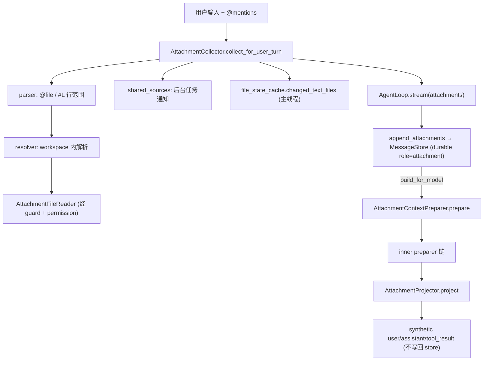

# Attachment Architecture

本文描述 `services/attachments/` 的架构边界：用户 turn 前的附件收集、durable `attachment` role 的承载，以及模型调用前把 attachment 投影成 provider-visible messages。底层消息存储见 `context-architecture.md`，preparer 链顺序见 `compaction-architecture.md` 与 `memory-architecture.md`。

## 文件职责

| 文件 | 职责 |
|:---|:---|
| `collector.py` | `AttachmentCollector`：用户 turn 前收集 @mention、共享源、文件变更 |
| `parser.py` | 解析 `@file`、`@"path"`、`#L10-20` 行范围 |
| `resolver.py` | workspace 内路径解析（exact / rglob 模糊 / ambiguous） |
| `types.py` | `AttachmentMessage`、`AttachmentScope` |
| `projector.py` | `AttachmentProjector`：attachment → provider-visible messages |
| `context_preparer.py` | `AttachmentContextPreparer`：preparer 链最外层包装 |

## 接口设计

### AttachmentCollector

```python
async def collect_for_user_turn(prompt, state, messages, *, is_main_thread=True) -> tuple[dict, ...]
```

收集顺序：用户 prompt 中的 `@mention`（→ file/directory/error attachment）→ `shared_sources`（如 `BackgroundTaskNotificationSource`）→ 主线程 only 的 `file_state_cache.changed_text_files()`（→ `edited_text_file` diff）。`todo_reminder` 类型在收集阶段被跳过。

### AttachmentMessage / AttachmentScope

`AttachmentMessage`：`attachment`、`attachment_id`、`created_at`、`scope`、`source`；`to_message()` 产出 `{role: "attachment", content: "", attachment, metadata}`。`AttachmentScope`：`SHARED`、`MAIN_THREAD`。

### AttachmentContextPreparer

```python
async def prepare(messages, state) -> PreparedContext
# inner.prepare() → AttachmentProjector.project()
```

它是 preparer 洋葱链的最外层：`AttachmentContextPreparer( RelevantMemoryContextPreparer( ContextCompactionService ) )`。

## 核心数据流



## 关键机制

### Attachment 投影表

`AttachmentProjector.project()` 把 `attachment` role 投影为合法 provider-visible 消息，synthetic 消息**不写回** `MessageStore` 或 transcript：

| attachment type | 投影结果 |
|:---|:---|
| `file` | synthetic `assistant`（`read_file` tool_call）+ synthetic `tool_result` |
| `skill` | synthetic `user`：`[skill loaded: name]` + args + source + 技能正文 |
| `directory` | synthetic `user` notice |
| `edited_text_file` | synthetic `user` notice + diff |
| `queued_command` | synthetic `user`：`[queued command from coordinator]` |
| `background_task_notification` | synthetic `user`：`<task_notification>` XML |
| `relevant_memories` / `nested_memory` | synthetic `user`：`[memory attachment]` |
| `plan_mode` / `hook_result` | synthetic `user` notice |
| `attachment_error` | synthetic `user`：resolution error |
| 未知 | `Unsupported attachment type: ...` |

### 职责边界

CLI 或其他入口只负责在调用 loop 前收集并提交预构建 attachment messages；`ContextEngine` 通过 context preparer 在 provider 调用前隐藏 raw attachment role。Provider adapter 不应包含 attachment-specific 分支；若 provider payload 中出现 `role="attachment"`，应视为 context preparation bug。

### 附件权限

`AttachmentFileReader` 复用 runtime 的 guard、permission policy 和 permission prompter，构造 synthetic `ToolCall`/classification 走同一 `PermissionPolicy.evaluate()`，可单独 prompt 并 `record_response`（见 `permission-architecture.md`）。

### 两种 projector 的分工

| 组件 | 作用域 | 处理 role |
|:---|:---|:---|
| `ContextProjector` | compaction 内部（snip、tail） | user/assistant/tool_result 配对 |
| `AttachmentProjector` | preparer 链最外层 | `attachment` → user/assistant/tool_result |

### plan_mode

`plan_mode` attachment 仅在 `AttachmentProjector` 有投影逻辑，当前 collector/runtime 无主动生产路径，是预留类型。
