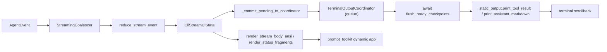
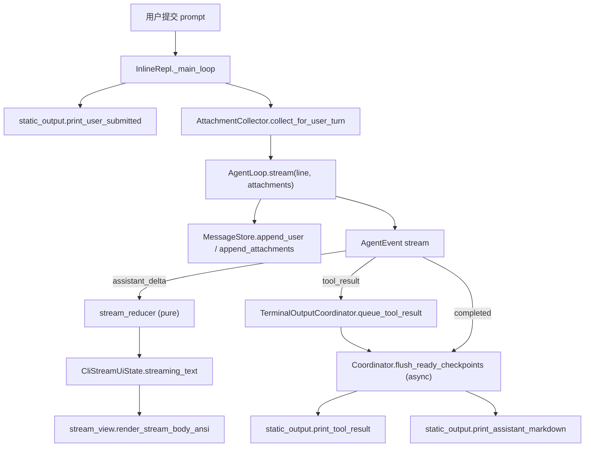

# CLI Message Rendering Architecture

本文记录当前 CLI 如何把会话消息、模型流式输出、工具调用和恢复历史渲染到终端界面。它只描述现有实现，不定义新的 UI 目标。

## 边界定位

CLI 主界面不是以 `messages.map(renderMessage)` 的方式每轮重绘整个 message 数组。正常对话时，`MessageStore` 是模型上下文和 transcript 的事实来源；终端输出由 `AgentLoop.stream()` 产出的事件驱动。

TTY 路径入口是 `ui/cli/app.py::main()` 创建 `CliRuntime` 后运行 `ui/cli/terminal/repl.py::InlineRepl`。非 TTY 路径仍由 `ui/cli/batch.py` 消费同一事件流并打印到 stdout。

## 输出区域

当前 TTY UI 分成三类区域：

- 静态区：`ui/cli/terminal/static_output.py` 使用 Rich `Console` 直接写 stdout。banner、反色用户行、assistant 定稿 Markdown、工具横幅和工具结果摘要会进入终端 scrollback。**静态区写入在流式会话中由 `ui/cli/terminal/output_coordinator.py::TerminalOutputCoordinator` 统一调度**（详见下文"流式 UI 协调"）。
- 动态区：`ui/cli/terminal/prompt_session.py`（空闲态输入）和 `ui/cli/terminal/stream_session.py`（运行中动态区）使用非全屏 `prompt_toolkit.Application(..., erase_when_done=True)`。空闲态是带边框的输入框；运行中动态区是 live Markdown 预览 + 状态行 + 底部 running input box（共享 `InputQueue`），同时 view 渲染 queued preview。所有动态区在阶段结束时擦除。
- 备用屏幕：`ui/cli/terminal/page.py`、`selector.py` 和 `connect_flow.py` 用临时全屏界面处理 page、选择器和 connect；退出后不把临时正文写入主 scrollback。权限确认使用非全屏、可擦除的临时动态区面板。

## 流式 UI 协调（execplan §M3 之后）

`StreamingSession` 内部按四个职责拆分：

- **State 模型**：`ui/cli/terminal/stream_state.py::CliStreamUiState` 持有 `streaming_text`、`current_assistant_call_id`、`current_model_turn_index`、`tools`、`pending_static_commits`（**统一**的 checkpoint 队列）、`stream_mode`、`error_text`、`assistant_completed`、`assistant_committed`、`turn_completed` 等字段；它是 turn 内 UI 状态的事实来源，**不是**模型上下文或 transcript 的事实来源。
- **Reducer**：`ui/cli/terminal/stream_reducer.py::reduce_stream_event` 是唯一的事件→state 转换入口，是纯函数，不写 stdout、不创建 Rich `Console`、不退出 prompt_toolkit app。
- **View**：`ui/cli/terminal/stream_view.py::render_stream_body_ansi` 和 `render_status_fragments` 把 state 翻译成 prompt_toolkit `ANSI` / `FormattedText`，不修改 state、不写 stdout。View 把 assistant 文本尾部和 tool panel 用一个空行隔开以避免视觉融合。
- **输出协调器**：`ui/cli/terminal/output_coordinator.py::TerminalOutputCoordinator` 是流式会话里**唯一**允许调用 `print_tool_result` / `print_assistant_markdown` 的组件。它的 `queue_commit` 只 append 到内部队列；`flush_ready_checkpoints` 是 async 提交边界，ready checkpoint 会在事件循环内被及时写入静态区。dynamic app 运行时，协调器通过 `prompt_toolkit.run_in_terminal` 暂停动态区后再写入，避免 Rich 静态输出和输入框重叠。

## Checkpoint 提交（execplan §M1/§M2 之后）

UI 的"commit to scrollback"边界由 **checkpoint** 决定，不是由"turn 结束"决定。checkpoint 指一个可以定稿并写入终端 scrollback 的边界。`StaticCommit` 表达两类 checkpoint：

- `assistant_markdown`：在 `assistant_message_completed` 事件到达时由 reducer 立即 stage，payload 是 `streaming_text`，提交后 reducer 立即清空 `streaming_text`，让下一轮 assistant 文本从空动态区开始。
- `tool_result`：在 `tool_result` 事件到达时由 reducer stage，payload 是 `ToolExecutionResult`。**提交顺序以模型声明工具的顺序为准**，而不是以工具完成时间为准 —— reducer 在 `release_ready_tool_result_commits` 中只释放"同一 `assistant_call_id` 下从最小未提交 index 开始连续完成"的结果，防止"后声明但先完成"的工具越过前面的工具。

每个 commit 都携带稳定的 `assistant_call_id` 和 `model_turn_index`：

- `assistant_call_id` 是当前 runtime session 内稳定唯一的字符串，由 `core/stream_events.py::mint_assistant_call_id` 派生。它是 `core/loop.py` 每次进入模型调用时分配的，作为 assistant 文本、tool_call_ready、tool_started、tool_progress、tool_result 的 UI 归属回链。
- `model_turn_index` 是 session 内严格递增的整数。同一 `turn_count` 内可能有多次模型调用（因为工具调用而触发），每次新模型调用都使用新 index。

这两个字段由 `core/loop.py` 注入到所有归属于某次模型调用的事件 metadata 中；reducer 用 `_require_attribution` 强制消费它们，缺失即进入 error 状态而不是静默回退到上一条事件。

事件流图：

状态行从 `stream_mode` 和 active tool 集合推导，**绝不会在仍有运行工具时显示裸 `thinking…`**；运行工具时显示 `tool: <name>`，多个工具时显示 `tools: N running`。

## 正常对话渲染流

普通用户输入的显示路径如下：

`InlineRepl._run_turn()` 将 agent event async iterator 交给 `StreamingSession.run()`。事件经 `StreamingCoalescer` 合并后通过 `reduce_stream_event` 折叠进 `CliStreamUiState`。`assistant_delta` 累加到 `state.streaming_text` 并由 `stream_view.render_stream_body_ansi` 节流渲染。`completed` 在 reducer 中翻 `turn_completed` 标志，最终由 `TerminalOutputCoordinator.flush_ready_checkpoints()` 提交到静态区。

因此，正常对话中屏幕上的流式 assistant 文本来自 runtime event；定稿文本来自同一个 state buffer，而不是从已经持久化的 assistant message 重新读取。

## 工具调用渲染流

工具事件仍来自 `core/stream_events.py` 的 `AgentEvent`，当前 TTY 主屏会显示工具生命周期，而不是只显示最终结果：

- `tool_call_ready`：reducer 把工具加入 `state.tools`，状态 `queued`；动态区 view 显示 `tool: <name> (queued)`。
- `tool_started` / `tool_progress`：reducer 把工具状态切到 `running` 并更新 `progress`；view 在 body 显示 `tool: <name> <progress>`，状态行显示 `tool: <name>`（多个工具时显示 `tools: N running`）。
- `tool_result`：reducer 把工具从 `state.tools` 移除并把 `ToolExecutionResult` 包装成 `CompletedToolCommit` append 到 `state.pending_static_commits`。`StreamingSession._commit_pending_to_coordinator` 把未提交的 commits 转交给 `TerminalOutputCoordinator`。`TerminalOutputCoordinator.flush_ready_checkpoints()` 负责调用 `print_tool_result` 写入静态区，dynamic app 活跃时通过 `run_in_terminal` 挂起输入框。

工具结果摘要只消费 `ToolExecutionResult` 的公共字段和 metadata，不读取文件、不执行工具，也不导入 `tools/*` handler。未覆盖的工具继续走 fallback 摘要，服务 MCP、插件或未来新工具。

工具执行完成后，loop 会把结果追加回 `MessageStore`，作为内部 `role="tool_result"` message；如果工具结果带有 followup attachment，loop 还会追加 attachment message。UI 的静态摘要只是展示，不是上下文事实来源。

## 权限 UI

权限确认不走普通 `AgentEvent` 渲染，而是在工具 executor preflight 中等待 `runtime.permission_prompter.request_permission(request)`。

TTY 路径使用 `ui/cli/terminal/permission_prompt.py::TtyPermissionPrompter`。它显示非全屏、`erase_when_done=True` 的三选项临时面板。如果当前存在运行中的 prompt_toolkit preview app，它通过 `run_in_terminal` 临时挂起动态区并用同样三选项的阻塞确认避免嵌套应用。非 TTY 路径继续使用 `ui/cli/permissions.py::CliPermissionPrompter` 的 stdin/stdout fallback。

权限面板内容仍由 `ui/cli/permissions.py::render_permission_panel()` 生成，权限策略和 guard 判断仍属于 services 层。

## 恢复历史渲染

`/resume` 成功后会真正恢复到可继续交互的主 REPL，并把恢复后的历史消息按正常会话规则重放进主 scrollback，而不是打开临时历史 page。两条入口语义一致：

- 带 target 的 `/resume <id>` 由 `dispatch_command()` 直接恢复 runtime，返回 `presentation="inline"`、`renderer.render_resume()` 一行恢复通知，以及 `replay_messages`（恢复后的当前消息链）。
- 无参数 `/resume` 由 `InlineRepl._run_resume_selector()` 打开 `TransientSelector`。按 Enter 选中后立即调用 `restore_runtime_from_target()`，返回与带 target 路径完全相同形态的 `CommandResult`，不做二次确认，不展示历史 page。

`InlineRepl._handle_command()` 在恢复 runtime、重置 prompt session 后，等 selector（若有）退出备用屏幕、下一次读取输入前，调用 `ui/cli/terminal/transcript_replay.py::replay_messages_to_static()` 把 `replay_messages` 重放进主 scrollback。

重放复用正常静态输出函数，没有恢复专用摘要格式：user 走 `print_user_submitted()`（反色），有正文的 assistant 走 `print_assistant_markdown()`，tool result 重建为 `ToolExecutionResult` 后走 `print_tool_result()`。只有 tool call 没有正文的 assistant 消息不打印（与正常 scrollback 一致），attachment 当前没有稳定主屏静态渲染因此也不重放。旧的 `renderer.render_restored_messages()` / `_restored_message_line()` 摘要路径已删除。

## 兼容历史视图

`renderer.render_history()` 仍存在，用表格显示 `role/detail`。它主要服务测试和诊断视图，不是普通主屏或 `/resume` 的主要路径。

## 设计约束

- CLI 主界面消费 `AgentEvent` 和 renderer helper，不依赖 provider wire format。
- UI 不能解析完整工具 stdout/stderr 来判断成功或失败；工具结果状态来自 `ToolExecutionResult.is_error`。
- 工具开始、进度和结果展示应继续消费现有 `tool_call_ready`、`tool_started`、`tool_progress`、`tool_result` 事件，不从 message 数组反推正在执行的工具。
- 权限面板由 permission prompter 负责，不能被 `/permissions` 只读视图或普通 tool result 摘要替代。
- 静态区展示不是上下文事实来源；`MessageStore`、transcript 和 tool result store 才是模型上下文与恢复依据。
- **流式会话里任何模块都不得绕过 `TerminalOutputCoordinator` 直接调用 `print_tool_result` / `print_assistant_markdown`**。reducer、view、flush helper 全部只走 coordinator。
- 动态区只渲染 `CliStreamUiState`；不允许 reducer 写入 stdout，不允许 view 修改 state，不允许 flush helper 直接调 Rich 静态打印函数。

## 运行中输入与命令排队

执行计划 `docs/exec-plans/active/cli-running-input-queue.md` 重新设计了用户输入在 agent turn 期间的提交路径：

- **空闲输入归 `PromptSession`**：底部输入框只在 `InlineRepl` 空闲时出现，提交后 `SubmissionKind.SUBMIT` 触发 `_run_turn`。`PromptSession` 不再暴露 `queue_mode` 或 `SubmissionKind.QUEUE`。
- **运行中输入归 `StreamingSession`**：同一 prompt_toolkit `Application` 内追加底部 Buffer（`multiline=False`，`InlineCompleter` 复用 idle 补全）。Enter 通过 buffer 的 `accept_handler` 把文本 push 到共享 `InputQueue` 并 reset buffer。
- **`InputQueue` 存 `QueuedInput`**：text、kind (`prompt` / `slash`)、单调 sequence、可见性。空白不入队；`snapshot()` 是只读快照。
- **drain 归 `InlineRepl._drain_queue`**：当前 turn 结束后按 FIFO 弹出；`kind == "slash"` 走 `_handle_command`（不进 agent），`kind == "prompt"` 走 `_run_turn`。Slash 命令若替换 runtime（`/clear` / `/resume` / `/connect`），drain 继续并复用新的 prompt session。
- **queued preview 归 `stream_view.render_queued_inputs`**：动态区显示最多 N 条可见 queued input + overflow 摘要；预览只在动态区，不写静态 scrollback，也不绕过 coordinator。
- **静态区写入边界保持不变**：`_handle_command` / `_run_turn` 调用 `print_user_submitted`，reducer 继续走 coordinator。运行中输入框的 Enter 不写静态区，只改 `InputQueue`。
