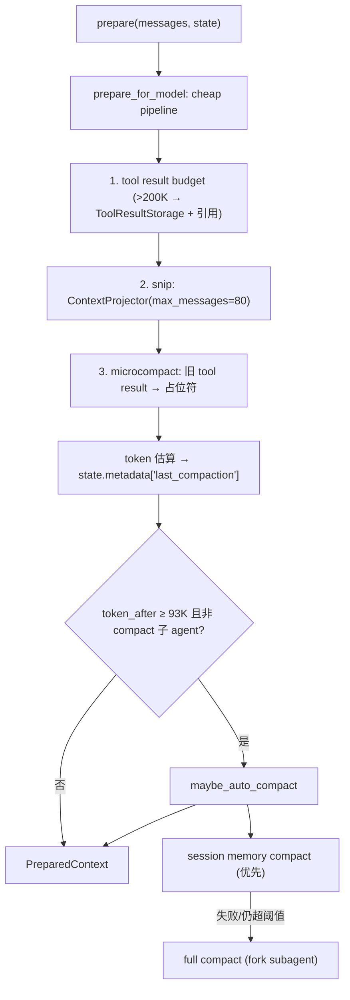
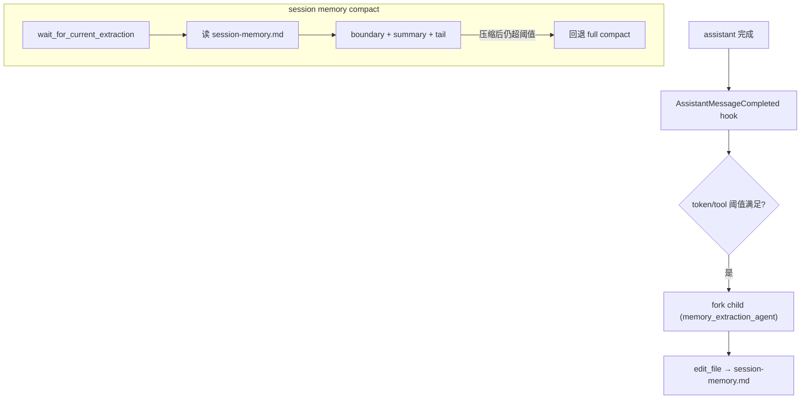

# Compaction Architecture

本文描述 `services/compaction/` 的架构边界：tool result 预算、micro/auto/manual/reactive 压缩和 session memory。它作为 `ContextEngine` preparer 链的最内层接入，不进入 `core/loop.py` 的具体分支。底层消息存储见 `context-architecture.md`，跨会话长期记忆见 `memory-architecture.md`，共享工具结果存储见 `utils/toolResultStorage`。

## 文件职责

| 文件 | 职责 |
|:---|:---|
| `service.py` | `ContextCompactionService`：cheap pipeline + auto/manual/reactive compact |
| `token_estimator.py` | 保守本地 token 估算（文本 ≈ ceil(len/3)） |
| `session_memory.py` | session 级 Markdown 记忆：存储、规则更新、fork agent 提取 |
| `types.py` | `CompactionConfig`、`CompactionTrigger`、`CompactionResult` |

## 接口设计

### ContextCompactionService

```python
async def prepare(messages, state) -> PreparedContext          # preparer 入口
async def prepare_for_model(messages, state) -> CompactionResult # cheap pipeline，不改写 store
async def maybe_auto_compact(messages, state) -> CompactionResult | None
async def manual_compact(state, *, focus=None) -> CompactionResult
async def reactive_compact(state, *, error: ProviderError) -> CompactionResult
def bind_runtime(*, message_store, session_memory_store, session_memory_extractor, result_store, subagent_runner) -> None
```

它实现 `core` 期望的 `ReactiveCompactor` 协议。

### CompactionConfig（关键默认值）

| 字段 | 默认 |
|:---|:---|
| `default_context_window_tokens` | 128_000 |
| `summary_output_reserved_tokens` | 20_000 |
| `auto_compact_buffer_tokens` | 15_000 |
| `tool_result_budget_chars` | 200_000 |
| `microcompact_keep_recent` | 5 |
| `snip_max_messages` | 80 |
| `session_memory_min_tokens` / `max_tokens` | 10_000 / 40_000 |
| `max_consecutive_auto_compact_failures` | 3 |
| `max_reactive_compact_retries` | 1 |

派生：`effective_context_window_tokens = 108_000`，`auto_compact_threshold_tokens = 93_000`。

### CompactionTrigger / CompactionResult

`CompactionTrigger`：`MICRO`、`AUTO_SESSION_MEMORY`、`AUTO_FULL`、`MANUAL`、`REACTIVE`。`CompactionResult`：`trigger`、`messages`、`token_before`、`token_after`、`transcript_refs`、`metadata`。

## 核心数据流



## 关键机制

### Cheap pipeline（投影，不改写 store）

`prepare_for_model` 顺序：tool result 预算（超 200K 字符的结果写共享 `ToolResultStorage`，模型只见引用+preview）→ snip（`ContextProjector` 滑窗，最多 80 条）→ microcompact（旧的非 stored tool result content 替换为占位符）→ token 估算。这一阶段只投影，不调用 `replace_messages_for_compaction`。

### Destructive compact（改写活动链）

`maybe_auto_compact` / `manual_compact` / `reactive_compact` 才调用 `replace_messages_for_compaction`。full compact 产物为 `(boundary_user_msg, summary_user_msg, *tail)`：boundary metadata 含 `is_compact_boundary`、`compact_trigger`、`compact_source`；summary metadata 含 `is_compact_summary`。摘要由 fork subagent 生成。

### 触发与断路器

`prepare()` 先跑 cheap pipeline，若 `token_after ≥ auto_compact_threshold`（93K）且当前不是 compact 子 agent 调用，则尝试 `maybe_auto_compact`。连续 auto compact 失败 ≥ 3 次（`max_consecutive_auto_compact_failures`）后跳过自动压缩。reactive compact 由 loop 在 `context_limit_exceeded` 时触发（最多 `max_reactive_compact_retries` 次）。

### Session memory

`SessionMemory` 字段：`content`、`last_summarized_message_uuid`、`updated_at`、`covered_turn_count`、`source`。`SessionMemoryStore` 读写 `.onecode/sessions/<session_id>/session-memory.md`，只服务当前会话压缩后的连续性，不是跨会话长期记忆。

两种生成模式（loop 中二选一）：

- `SessionMemoryExtractionService`（优先）：assistant 完成后按 `SessionMemoryExtractionPolicy`（init ≥ 10_000 tokens、更新间隔 ≥ 5_000 tokens 或 ≥ 3 次 tool call）触发 fork child 更新 memory；child 被标记 `memory_extraction_agent`，只能 `edit_file` 写 `allowed_memory_path`（权限层强制，见 `permission-architecture.md`、`subagent-architecture.md`）。
- `SessionMemoryUpdater`（fallback）：无 extractor 时，纯文本 turn 后用规则摘要写 memory。



compaction service 不生成 session memory；它在 session-memory compact 前只等待进行中的 extraction，读取现有 Markdown 作为摘要来源；tail 由 token/文本消息数选取，并用 `ContextProjector.adjust_start_index_to_preserve_tool_pairs` 保配对。

### ToolResultStorage

路径 `<session_dir>/tool-results/<result_id>.txt`，`persist_tool_result(...) -> StoredToolResultRef`，`format_model_reference(ref, preview)` 生成模型可见引用。该实现位于 `utils/toolResultStorage`，同时服务 transcript 外置、compaction 层 200K 字符预算和 executor `ToolResultPolicy` 预算；compaction 只消费 ref 和模型引用文本，不拥有通用存储实现。

### PreCompact hook

`PRE_COMPACT` hook 返回的 `metadata["summary_instructions"]` 可注入 compact prompt；`POST_COMPACT` / `COMPACT_FAILED` 为观察事件。详见 `hook-architecture.md`。

## 持久化路径

- session memory：`.onecode/sessions/<session_id>/session-memory.md`
- shared tool result storage：`.onecode/sessions/<session_id>/tool-results/<result_id>.txt`
