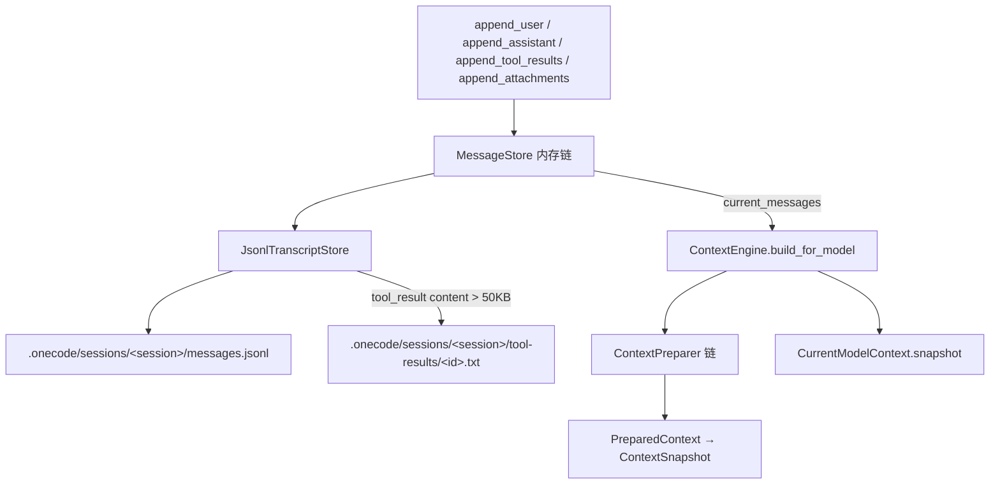

# Context Architecture

本文描述 `services/context/` 的架构边界：内部消息结构、session transcript、模型调用前的上下文快照和消息滑窗投影。上层的压缩、记忆、附件治理见 `compaction-architecture.md`、`memory-architecture.md`、`attachment-architecture.md`；动态 prompt 见 `prompt-architecture.md`。

## 文件职责

| 文件 | 职责 |
|:---|:---|
| `message_store.py` | 内存优先 append-only 消息存储，每次追加同时写 JSONL transcript |
| `transcript.py` | `JsonlTranscriptStore`：按 session 缓冲/定时 flush 写 `messages.jsonl`，大 tool result 外置 |
| `snapshot.py` | `PreparedContext`（preparer 中间产物）和 `ContextSnapshot`（模型调用快照） |
| `projector.py` | `ContextProjector`：消息滑窗投影，保留 tool call/result 配对，丢弃孤立 tool_result |
| `current_model_context.py` | `CurrentModelContext`：持有最近一次 `ContextSnapshot`，供 subagent fork 继承 |

## 接口设计

### MessageStore

```python
def append_user(content) -> dict
def append_assistant(message) -> dict
def append_tool_results(results) -> list[dict]
def append_attachments(attachments) -> list[dict]
def current_messages() -> tuple[dict, ...]          # 返回 deepcopy
def seed_messages(messages) -> list[dict]
def replace_messages_for_compaction(messages, *, reason, metadata=None) -> list[dict]
def bind_session(session_id) / clear_for_new_session(new_session_id) / flush_transcript()
@classmethod from_transcript(transcript_store, state) -> MessageStore
```

内部消息角色：`user`、`assistant`、`tool_result`、`attachment`。OneCode 内部保留 provider-neutral `tool_result`，provider adapter 投影为目标 wire format；`attachment` 是 durable internal role，由 context preparer 在调用前投影后隐藏（详见 `attachment-architecture.md`）。`current_messages()` 返回 deepcopy，避免外部直接修改内部状态。

### PreparedContext / ContextSnapshot

```python
PreparedContext(messages, usage_hints={}, transcript_refs=())
ContextSnapshot(system_prompt, messages, tool_schemas=(), usage_hints={}, transcript_refs=(), transition=None)
```

`usage_hints` 和 `transcript_refs` 由 compaction-aware preparer 填充，携带 token 估算、compact 信息、外置结果引用和 `request_overrides`（如 `max_output_tokens`）。

### ContextProjector

```python
def project(messages) -> tuple[dict, ...]   # 深拷贝 + 滑窗 + 丢弃孤立 tool_result
def adjust_start_index_to_preserve_tool_pairs(messages, start_index) -> int
```

仅处理 `user`/`assistant`/`tool_result` 配对，**不处理 `attachment` role**（attachment 投影由 `AttachmentProjector` 负责）。

## 核心数据流



## 关键机制

### JsonlTranscriptStore

`messages.jsonl` 每条 record：`type`、`uuid`、`parent_uuid`、`session_id`、`timestamp`、`cwd`、`message`。`VALID_MESSAGE_ROLES = {user, assistant, tool_result, attachment}`。写入采用缓冲，默认 `flush_interval_seconds=1.0`，测试/退出/session 切换/恢复时可显式 flush。

### Tool result 外置

仅对 `role="tool_result"` 且 UTF-8 内容 > 50KB（`TOOL_RESULT_EXTERNALIZE_THRESHOLD_BYTES`）触发：通过 `utils/toolResultStorage` 写入 `tool-results/<result_id>.txt`，JSONL content 替换为 `[tool result externalized: ...]` + 前 4000 字符预览，metadata 增加 `tool_result_externalized`、`tool_result_path`、`tool_result_id`、`original_tool_call_id`、`original_size_bytes`、`original_size_chars`、`preview_chars`。同一 `tool_call_id` 且内容相同会复用同一文件；同一 ID 但内容不同会使用稳定内容 hash 后缀。恢复（`load_messages` / `from_transcript`）时尝试读回完整 content，缺失时保留预览并标记 `missing_external_tool_result`。

> transcript 外置、compaction 结果预算和 executor 结果预算共享同一个 `ToolResultStorage` 命名、去重和读取实现；不同上下文只决定模型或 JSONL 中展示的引用文本。

### 压缩消息替换契约

`replace_messages_for_compaction(messages, *, reason, metadata)` 替换内存链并 append-only 写入新 records，是 compaction service 改写活动链的唯一入口；cheap pipeline 的投影则不改写 store。

### CurrentModelContext

`ContextEngine` 每次 `build_for_model` 后写入最近 snapshot，供 subagent fork 继承父轮次已渲染的 `system_prompt` 字符串（见 `subagent-architecture.md`）。该 holder 位于通用 context service 边界，避免 `core.loop` 依赖 subagent 包。

## 持久化路径

- 消息：`.onecode/sessions/<session_id>/messages.jsonl`
- 外置 tool result：`.onecode/sessions/<session_id>/tool-results/<id>.txt`

transcript 是会话恢复和上下文治理的事实来源，但不是完整 durable result store 的替代品。
