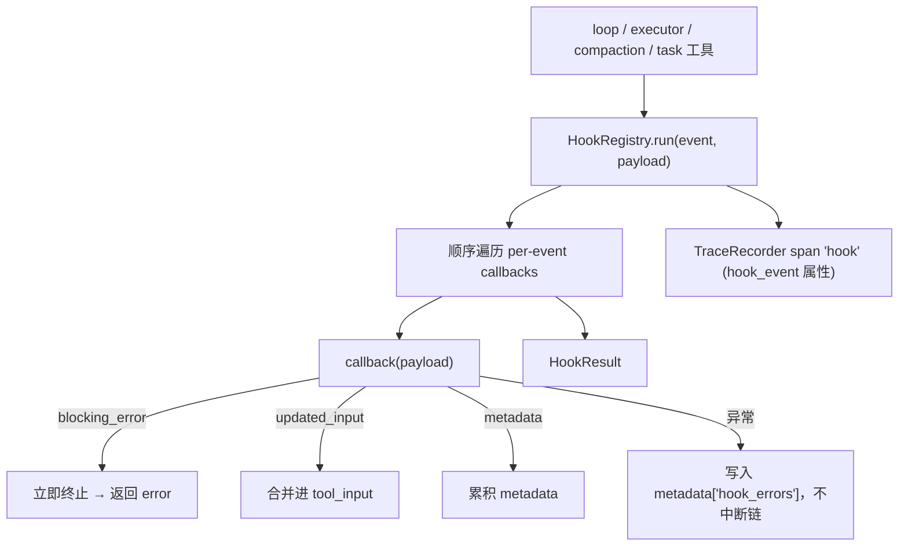

# Hook Architecture

本文描述 `services/hooks/` 的架构边界：runtime 生命周期扩展点。hook 可以阻断、改写输入、补充 metadata 或审计，但不是安全边界的替代品——hook 不能绕过 guard deny 或 permission deny（见 `guard-architecture.md`、`permission-architecture.md`）。

## 文件职责

| 文件 | 职责 |
|:---|:---|
| `events.py` | `HookEvent` 枚举 |
| `registry.py` | `HookRegistry` 注册与顺序执行、`HookResult`、`HookPayload` |

## 接口设计

### HookEvent

`StrEnum`，当前 11 个事件：

| 枚举 | 值 | 阶段 |
|:---|:---|:---|
| `PRE_TOOL_USE` | `PreToolUse` | 工具执行前 |
| `POST_TOOL_USE` | `PostToolUse` | 工具成功后 |
| `TOOL_ERROR` | `ToolError` | 工具出错 |
| `USER_PROMPT_SUBMIT` | `UserPromptSubmit` | 用户输入提交 |
| `ASSISTANT_MESSAGE_COMPLETED` | `AssistantMessageCompleted` | assistant 消息完成 |
| `TURN_STOPPED` | `TurnStopped` | 一轮无 tool call 自然结束 |
| `TASK_CREATED` | `TaskCreated` | 任务创建 |
| `TASK_COMPLETED` | `TaskCompleted` | 任务完成 |
| `PRE_COMPACT` | `PreCompact` | 压缩前 |
| `POST_COMPACT` | `PostCompact` | 压缩后 |
| `COMPACT_FAILED` | `CompactFailed` | 压缩失败 |

### HookRegistry

```python
def register(event, callback) -> None
async def run(event, payload) -> HookResult
```

callback 类型：`Callable[[HookPayload], HookResult | Awaitable[HookResult | None] | None]`，同步/异步自动适配。

### HookResult

| 字段 | 语义 |
|:---|:---|
| `blocking_error: str \| None` | 非空则立即终止后续 callback，返回该错误 |
| `updated_input: dict \| None` | 合并进 `payload["tool_input"]`，供后续 hook 与 executor 使用 |
| `metadata: dict` | 跨 callback 累积合并 |

返回 `None` 表示无效果。

## 核心数据流



## 关键机制

### 执行与异常隔离

`run` 按注册顺序执行 per-event callbacks。callback 异常被捕获写入 `metadata["hook_errors"]`，不中断链（仅 `blocking_error` 可阻断）。可选 `TraceRecorder` 用统一 span 名 `hook`，属性含 `hook_event`、`callback_count`、`tool_name`、`tool_call_id`、`blocking`、`updated_input`、`hook_error_count`。

### 各事件调用点与阻断语义

| 事件 | 调用位置 | 语义 |
|:---|:---|:---|
| `UserPromptSubmit` | `core/loop.py`（`stream` 入口） | 观察 |
| `AssistantMessageCompleted` | `core/loop.py` | 观察；触发 session memory 提取 |
| `TurnStopped` | `core/loop.py` | 观察；CLI 据此启动长期记忆 dream |
| `PreToolUse` | `services/tools/executor.py` | `blocking_error` 阻止执行；`updated_input` 触发重新校验/guard/permission |
| `PostToolUse` | `executor.py` | 观察成功结果 |
| `ToolError` | `executor.py` | 观察错误（payload 含 guard policies） |
| `PreCompact` | `compaction/service.py` | 返回 `metadata`（如 `summary_instructions`）影响 compact prompt |
| `PostCompact` / `CompactFailed` | `compaction/service.py` | 观察 |
| `TaskCreated` | `tools/task_create/tool.py` | 阻断则回滚删除已创建 task |
| `TaskCompleted` | `tools/task_update/tool.py` | 阻断则阻止状态更新为 completed |

### PreToolUse 重检

hook 改写 `tool_input` 后，executor 重新走 `_prepare_input`（schema → classify → guard → permission），不能被 hook 绕过 deny。executor 在 `PreToolUse` 前已先执行原始输入的 schema validation、工具 validation、classification、guard 和 permission policy；若原始输入已被 deny 或 ask 阻断，handler 不会执行。

## 设计原则

新增 hook 事件应代表 agent 生命周期中的稳定节点，且没有该事件时扩展会被迫侵入主流程。hook 可以阻断、记录、更新输入或补充 metadata，但 hook 的 allow 不能覆盖更底层的 deny 或 ask 规则。冲突时 guard 与 permission policy 优先。
