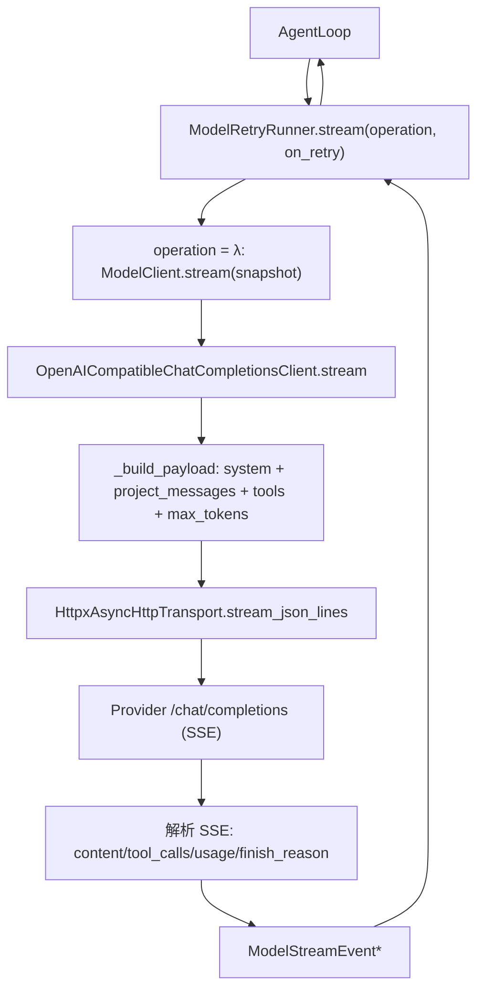

# Model And Provider Architecture

本文描述 `services/model/` 与 `infrastructure/` 的架构边界。模型 provider 必须隔离在 infrastructure 中，core 和 services 只依赖 provider-neutral 类型；`core/` 不直接依赖 `infrastructure/`。

## 文件职责

### services/model/

| 文件 | 职责 |
|:---|:---|
| `client.py` | `ModelClient` Protocol：`stream(snapshot) -> AsyncIterator[ModelStreamEvent]` |
| `stream.py` | provider-neutral 流式事件 `ModelStreamEvent` 及工厂方法 |
| `types.py` | `ProviderError`、`ModelUsage`、`LLMResponse` |
| `retry.py` | `ModelRetryRunner` 缓冲式重试引擎、`RetryPolicy`、`RetryDecision` |

### services/errors.py

provider-neutral 错误分类层，仅依赖 stdlib，供 core/services/infrastructure 共用，避免循环 import。定义 `ErrorCategory`、`ErrorDetails`、`OneCodeError` 及子类（`AbortError`、`ConfigParseError`、`ShellError`、`McpOperationError`、`ToolRuntimeError`、`RetryExhaustedError`）和 `onecode_error_details()` 等工具函数。

### infrastructure/

| 文件 | 职责 |
|:---|:---|
| `config/env.py` | 从项目 `.env` 加载 `ResolvedProviderConfig` |
| `providers/catalog.py` | 内置 OpenAI-compatible provider 目录 `ProviderDefinition` |
| `providers/chat_completions.py` | OpenAI Chat Completions 适配器（消息投影、流式解析） |
| `providers/http.py` | JSON HTTP transport（sync/async），HTTP 错误归一化为 `ProviderError` |
| `providers/model_catalog.py` | 通过 `/models` 端点发现 `ProviderModel` |
| `providers/connection.py` | 预留 CLI `/connect` 流程的 `ConnectOption` |
| `providers/factory.py` | 从 `.env` 装配 model client 与 catalog client |
| `filesystem/paths.py` | 跨平台路径规范化底层函数（sandbox 策略不在此） |

## 接口设计

### ModelStreamEvent

`type` 取值：`content_delta`、`tool_call_delta`、`tool_call_completed`、`message_completed`、`usage`、`error`。关键字段：`text`、`block_index`、`tool_call`、`assistant_message`、`final_text`、`stop_reason`、`usage`、`output_interrupted`、`metadata`。`message_completed` 的 `metadata["tool_calls"]` 是主循环判定续轮的唯一依据。

### ProviderError

继承 `OneCodeError`。字段：`message`、`provider_id`、`status_code`、`error_type`、`retryable`、`retry_after_seconds`。已知 `error_type`：`rate_limit_error`、`context_limit_exceeded`、`network_error`、`timeout_error`、`configuration_error`、`invalid_response`、`invalid_tool_arguments`。

### ModelUsage

`input_tokens`、`output_tokens`、`cache_read_input_tokens`、`cache_creation_input_tokens`；`add(other)` 累加。

### ResolvedProviderConfig

`provider`、`provider_id`、`display_name`、`base_url`、`model`、`api_key`、`timeout_seconds`（默认 60）、`headers`、`default_params`、`models_path`（`/models`）、`chat_completions_path`（`/chat/completions`）。

`load_provider_config(env_path=".env")` 读取 `ONECODE_PROVIDER_ID` 作为当前激活供应商，然后按 provider id 派生大写前缀读取供应商块：`<PREFIX>_MODEL`、`<PREFIX>_API_KEY`、`<PREFIX>_BASE_URL`。例如 `deepseek` 使用 `DEEPSEEK_MODEL` / `DEEPSEEK_API_KEY` / `DEEPSEEK_BASE_URL`，`custom` 使用 `CUSTOM_*`。`ONECODE_TIMEOUT_SECONDS`、`ONECODE_EXTRA_HEADERS`、`ONECODE_DEFAULT_PARAMS` 仍为全局可选键。OneCode 只从 `.env` 读取，dotenv interpolation 已禁用。

## 核心数据流

### 消息投影

`_project_messages` 把内部 role 投影为 wire format：

| 内部 role | Wire format |
|:---|:---|
| `tool_result` | `{role: "tool", tool_call_id, content}` |
| 其它 | 原样复制 |

`ContextSnapshot.system_prompt` 投影为首条 system message。`attachment` role 不应出现在 provider payload——若出现视为 context preparation bug。

## 关键机制

### ModelRetryRunner 缓冲式重试

`stream(operation, *, on_retry)`：
1. 每次 attempt 执行 `operation()`，**缓冲全部 events**。
2. 捕获 `ProviderError`：`_should_retry = error.retryable is True and error_type != "context_limit_exceeded"`。
3. 可重试 → 计算 `RetryDecision` → trace + error log → 调用 `on_retry` → sleep → 丢弃失败 attempt 的 buffer → 下一 attempt。
4. 成功 → 按原顺序 yield buffer。
5. 不可重试或耗尽 → 抛 `RetryExhaustedError`（cause 为原错误）。

失败 attempt 的 partial content delta / tool call delta / completed event 不会释放给 CLI、message store 或 transcript。`context_limit_exceeded` 不在 retry runner 内处理，交给 `AgentLoop` 做 reactive compact。

`RetryPolicy` 默认：`max_retries=10`、`base_delay_seconds=0.5`、`max_delay_seconds=32`、`jitter_ratio=0.25`。delay = `min(0.5·2^(attempt-1), 32)` + jitter；provider 提供 `retry_after_seconds` 时优先。

### HTTP 错误归一化

`provider_error_from_http_status`：413 或含 context limit 关键词 → `context_limit_exceeded`（不可重试）；401/403 → `authentication_error`；429 → `rate_limit_error`（可重试）；≥500 → `server_error`（可重试）；网络/超时 → `network_error`（可重试）。SSE 解析跳过 `[DONE]`。

### 流式解析

`content` delta → `content_delta`；`tool_calls` delta 累积到内部 accumulator → 最终 `tool_call_completed`；`usage` 解析 `prompt_tokens`/`completion_tokens`/`prompt_tokens_details.cached_tokens`；`finish_reason ∈ {length, max_tokens, max_output_tokens}` → `output_interrupted=True`，驱动 loop 的 max-output 恢复。

### Provider 目录

内置 8 个 OpenAI-compatible provider：`openai`、`deepseek`、`glm`、`minimax`、`siliconflow`、`gemini`、`claude-openai-compatible`、`custom`。`requires_base_url` 的 provider 必须在 `.env` 提供 base URL。`ProviderConnectionService` 当前是占位，供未来 CLI `/connect`。

## 依赖约束

- `core/` 只依赖 `services/model/client.py` 协议和 provider-neutral event。
- provider adapter 可依赖 `services/context`、`services/model`、`services/tools` 类型完成协议转换。
- `infrastructure/` 不能依赖 `core/`。
- 新 provider 支持进入 `infrastructure/providers/`，不改变主循环对模型响应的理解。

## 已知差异与限制

- `ModelUsage.cache_creation_input_tokens` 字段存在，但适配器当前未从 provider 响应填充（恒为 0）。
- `timeout_error`、`authentication_error`、`server_error` 在 `errors.py` 可分类，但 `ProviderError._provider_error_category` 未单独映射后两者（落 `PROVIDER`），超时实际抛 `network_error`。
- `retry_after_seconds` 的 delay 逻辑已实现，但 `provider_error_from_http_status` 暂未解析 HTTP `Retry-After` 头。
