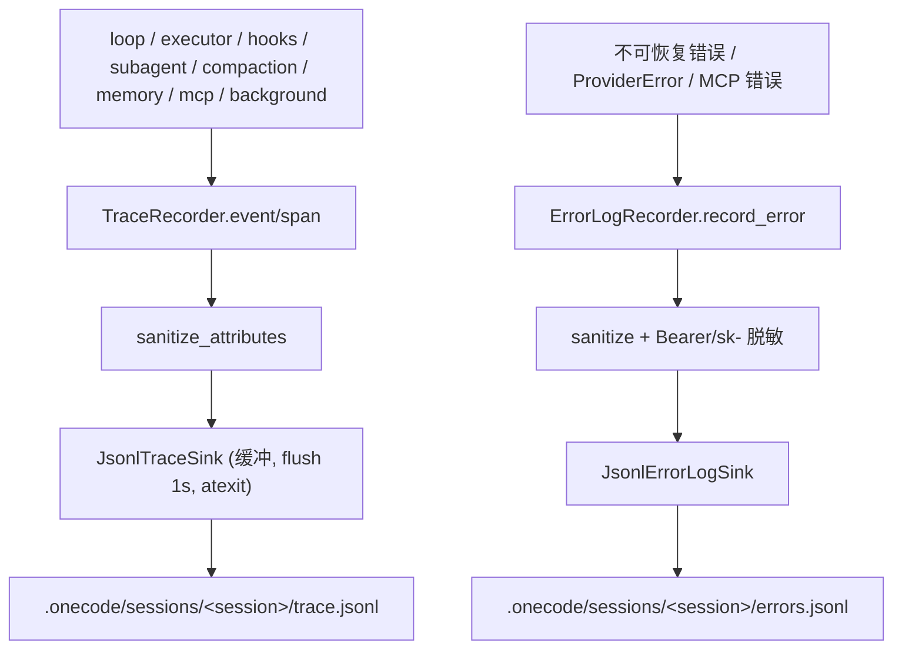

# Observability Architecture

本文描述 `services/observability/` 的架构：结构化 runtime trace 与独立 error log。trace 记录短小 runtime 事实，是 CLI、测试、回放和未来 UI 共享的事实来源；error log 记录未恢复失败的调试证据。两者分离。

## 文件职责

| 文件 | 职责 |
|:---|:---|
| `events.py` | `TraceRecord` 数据类与 `record_to_json_dict()` |
| `trace.py` | `TraceRecorder`（event/span）、`TraceSpan`（上下文传播）、`recent_records()` |
| `sinks.py` | `TraceSink` 协议、`NoopTraceSink`、`JsonlTraceSink` |
| `sanitize.py` | trace/error 共用的属性脱敏与路径相对化 |
| `error_log.py` | `ErrorLogRecorder`、`JsonlErrorLogSink` |

## 接口设计

### TraceRecord

`record_type`（`event`/`span_start`/`span_end`）、`timestamp`（UTC ISO8601）、`session_id`、`trace_id`（每 session 一个）、`name`、`span_id`、`parent_span_id`、`attributes`。

### TraceRecorder

```python
def event(name, attributes, *, parent_span_id) -> None
def span(name, attributes) -> TraceSpan      # 上下文管理器，自动 span_end + duration_ms
def flush() / switch_session(session_id) -> None
def recent_records(limit=20) -> list[dict]
@classmethod noop(session_id) -> TraceRecorder
```

`TraceSpan` 用 `ContextVar` 传播当前 span，`__exit__` 自动 `end(error=exc)`；trace 发射内部异常被吞掉，不影响主流程。

### ErrorLogRecorder

```python
def record_error(error, *, source, attributes) -> None
def record_mcp_error(server_name, error, attributes) -> None
def switch_session(session_id) / flush() -> None
```

记录字段：`timestamp`、`session_id`、`source`、`category`、`error_type`、`message`、`safe_message`、`retryable`、`stack`、`attributes`（经 sanitize）。

## 核心数据流



## 关键机制

### 脱敏

`sanitize_attributes`：最多 20 个 key、字符串 240 字符、嵌套深度 2；敏感 key 子串（`key`/`token`/`secret`/`password`/`authorization`/`header`/`env`/`content`/`prompt`/`stdout`/`stderr`/`old_string`/`new_string`）→ `[redacted]`；安全计数器白名单（`input_tokens`、`stdout_chars` 等）不 redact；路径 key 相对 workspace，外部路径 → `[external_path]{suffix}`。error log 额外对 message/stack 做 Bearer token 和 `sk-*` 正则替换。

### Trace 事件目录

| 来源 | 事件/span |
|:---|:---|
| loop | span `interaction`、`context_prepare`、`model_call`；event `transition`、`model_call_error`、`reactive_compact_retry`、`max_output_tokens_escalate`、`max_output_tokens_recovery`、`max_output_tokens_recovery_exhausted` |
| executor | span `tool_batch`、`tool_preflight`、`tool_execution`、`permission_wait`；event `tool_result`、`permission_wait` |
| hooks | span `hook`（`hook_event` 属性区分具体事件） |
| subagent | event `subagent_start`、`subagent_completed`、`subagent_error` |
| model retry | event `model_retry` |
| mcp | span `mcp_connect`；event `mcp_tool_call` |
| background | event `background_task_started`、`background_task_completed` |
| compaction | event `compact_prepare`、`compact_auto_decision`、`compact_start`、`compact_completed`、`compact_failed`、`compact_result_budget`、`compact_micro` |
| session memory | event `session_memory_update`、`session_memory_extraction_decision`/`_completed`/`_failed` |
| long-term memory | event `long_term_memory_selector_completed`/`_failed`、`long_term_memory_extraction_decision`/`_completed`/`_cancelled`/`_failed` |

trace 只记录摘要 metadata，不记录完整 prompt、源码或工具输出。

### 分离原则

trace 保存短小 runtime 事实，不承载完整 stack 或 debug 文本；error log 保存经脱敏的错误类别、类型、message、safe_message、短 stack 和属性，用于排查不可恢复错误。`switch_session` 时两者同步切换。

## 持久化路径

- trace：`{workspace}/.onecode/sessions/<session_id>/trace.jsonl`
- error log：`{workspace}/.onecode/sessions/<session_id>/errors.jsonl`
