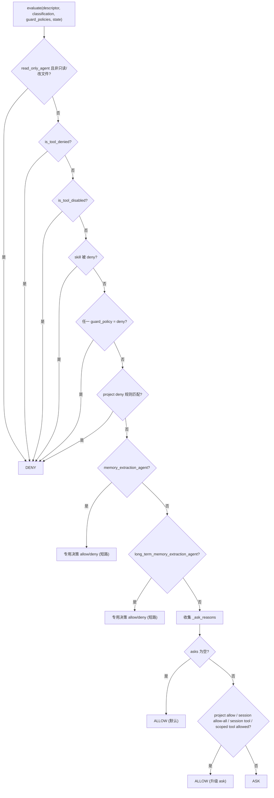

# Permission Architecture

本文描述 `services/permissions/` 的架构边界：把工具级规则、项目级持久规则、guard 结果、危险/受保护目录规则、可疑路径规则、session 临时授权和 UI 用户确认合并成 deny-first 的最终工具调用决策。确定性路径分类见 `guard-architecture.md`，生命周期扩展见 `hook-architecture.md`。

## 文件职责

| 文件 | 职责 |
|:---|:---|
| `policy.py` | deny-first `PermissionPolicy`、`evaluate()`、特殊 agent 硬限制、ask 原因聚合 |
| `session.py` | `SessionPermissionStore`：会话级内存授权 |
| `rules.py` | 规则字符串解析/序列化、`PermissionRule`/`PermissionUpdate` |
| `project_settings.py` | `.onecode/settings.json` 中 `permissions` 字段读写 |
| `types.py` | `PermissionDecision`/`Request`/`Response`/`Option` 及 action/scope |
| `prompter.py` | `PermissionPrompter` 协议（async `request_permission`） |

## 接口设计

### 核心类型

- `PermissionAction`：`allow`/`ask`/`deny`/`passthrough`（`passthrough` 仅类型定义，未使用）。
- `PermissionScope`：`once`/`session`/`project`。
- `PermissionDecision`：`action`、`reason`、`source`、`targets`、`guard_policies`、`metadata`（如 `ask_reasons`）。
- `PermissionRequest`：`request_id`、`tool_call`、`descriptor`、`classification`、`decision`、`tool_input`、`options`。
- `PermissionResponse`：`action`（allow/deny）、`scope`、`feedback`、`metadata`、`permission_updates`。

### SessionPermissionStore

`allow_directory`/`is_allowed`（按工具+操作授权目录，`contains_path` 语义）、`allow_tool`/`is_tool_allowed`、`deny_tool`/`is_tool_denied`、`disable_tool`/`is_tool_disabled`、`allow_skill`/`is_skill_allowed`（已实现但未接入 evaluate）、`deny_skill`/`is_skill_denied`、`clear()`。session grant 只能把 ask 升为 allow，永不覆盖 deny。`PermissionPolicy(scoped_allowed_tools=...)` 提供 runtime-local 工具授权，供 fork skill 等 child runtime 使用，不写入 `SessionPermissionStore`。

### 规则字符串与 project settings

规则字符串：整工具 `tool_name`，或内容规则 `tool_name(rule content)`（内容中 `\`、`(`、`)` 可转义）。`.onecode/settings.json` 结构：

```json
{ "permissions": { "allow": ["read_file", "bash(npm test:*)"], "deny": ["agent"], "ask": ["edit_file(src/**)"] } }
```

内容匹配用 `fnmatch.fnmatchcase`，或以 `:*` 结尾时前缀匹配（`bash(npm run:*)` 匹配 `npm run test`）。匹配值来源于 classification targets 的 `value`/`normalized_value` 和 guard policies 的 `original_path`/`normalized_path`。

### PermissionPolicy

```python
def evaluate(...) -> PermissionDecision
def is_tool_visible(...) -> bool      # 被 ToolRegistry 消费
def record_response(request, response) -> None
```

## 核心数据流：evaluate 的 deny-first 顺序



阶段 A（硬拒绝，首个命中即返回 deny）按顺序为：`read_only_agent` → 工具级 deny（session deny + project 整工具 deny + `metadata.denied_tools`）→ 工具 disable → skill deny → guard deny → project 内容 deny。阶段 B 为特殊 agent 短路。阶段 C 收集 ask 原因并尝试通过 project allow、session directory grant、session tool grant 或 scoped tool grant 升级为 allow，否则 ask；无 ask 时默认 allow。

## 关键机制

### ask 原因来源

`_ask_reasons` 收集：project ask 规则匹配；非只读 `command/execute` target；非只读 `external_service/call`（MCP）；受保护项目目录命中（除 session tool-results 读取和长期记忆路径例外）；可疑 Windows 路径；guard policy 为 ask 的 reason。

### 受保护目录与可疑路径

`PROTECTED_PROJECT_DIRS = (.git, .vscode, .idea, .onecode)`，大小写不敏感按路径段匹配。例外：读取 `.onecode/sessions/<session_id>/tool-results/...`、`.onecode/memory/` 下的长期记忆路径。可疑 Windows 路径检测绝对 Windows 形态和保留设备名（`CON`/`PRN`/`AUX`/`NUL`/`COM1-9`/`LPT1-9`），仅在 guard 非 allow 时纳入 ask。

### 特殊 agent 硬强制

- `read_only_agent`：非只读或改文件系统的调用直接 deny。
- `memory_extraction_agent`：必须有 `allowed_memory_path`，工具必须是 `edit_file`，单一 `file/write` target，且 `resolve_path(target) == resolve_path(allowed_memory_path)`，否则 deny；通过则 allow（绕过 ask）。
- `long_term_memory_extraction_agent`：必须有 `allowed_memory_dir`；读工具（read_file/grep/glob）须只读且 guard 全 allow；写工具（write_file/edit_file）的 target 须是 `.onecode/memory/` 下的 `.md` 文件（`is_auto_memory_markdown_path`），否则 deny。

这些限制是代码边界，不依赖 prompt 文本。配置入口见 `subagent-architecture.md`。

### record_response 与 UI

`request_for_decision` 默认 options 为 allow once / allow session directory / deny。CLI 权限请求只消费这三项：once 不写 session grant；session scope 对非 deny 的 guard policy 调用 `allow_directory`（directory 取自身，file 取 parent）；deny 直接返回拒绝。权限请求 prompt 不写 project settings，也不提供 bash project 快捷授权。项目级 allow/deny/ask 规则只能由 `/permissions add|remove|replace ...` 构造 `PermissionUpdate(destination="projectSettings")` 并写入 project settings。`record_response` 仍能处理 `projectSettings` update，以保持权限层通用入口；当前 CLI 运行时权限请求不会产生这类 update。`PermissionPrompter` 是 async 协议；非交互 executor 未注入 prompter 时，ask 变为结构化 `permission_ask_required` 错误，保持 fail closed。

### Registry 可见性

`is_tool_visible()` 被 `ToolRegistry.visible_descriptors(state)` 消费：工具级 deny、project 整工具 deny 或 disable 的工具不进入 provider schema 或 prompt。路径参数级判断不能在 prompt 组装阶段猜测，仍必须在执行入口基于实际 `ToolTarget` 重复 guard 和 permission policy。

### 二次 guard 通道

permission allow 后，`approved_guard_policies` 传给 handler，`is_guard_policy_allowed` 认可已批准的 ask policy，防止 session 授权后 handler 再次拒绝；deny policy 永不放行。
