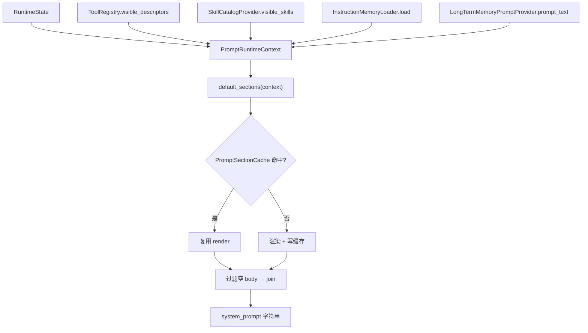

# Prompt Architecture

本文描述 `prompts/` 的架构边界：根据当前运行时状态动态组装 system prompt。它从 `ToolRegistry`、skill catalog、记忆系统等读取当前事实，不执行工具，也不解析 provider 协议。

## 文件职责

| 文件 | 职责 |
|:---|:---|
| `assembler.py` | `DynamicPromptAssembler`：组装完整 system prompt |
| `sections.py` | 可组合 `PromptSection` 定义与 `default_sections()` |
| `runtime_context.py` | `PromptRuntimeContext` 数据类 |
| `cache.py` | `PromptSectionCache`：按 `(section_key, fingerprint)` 缓存 |

## 接口设计

### DynamicPromptAssembler

```python
def __init__(self, cwd, tool_registry, skill_provider, instruction_memory_loader,
             long_term_memory_provider, section_cache)
def assemble(self, state) -> str   # default_sections(context) → 过滤空 body → "\n\n".join
```

### PromptRuntimeContext

字段：`state`、`cwd`、`visible_tools`、`visible_skills`、`files_read`、`transition`、`mcp_server_instructions`、`instruction_memory` + `instruction_memory_fingerprint`、`long_term_memory_prompt` + `long_term_memory_fingerprint`。它刻意不包含 API key、provider 配置、session id、transcript 路径或 CLI mode。

### PromptSection

`key`、`title`、`body`、`fingerprint`、`cacheable`；`render() -> "# {title}\n{body}"`。输出顺序稳定，空 body 被跳过。

## 核心数据流



## 关键机制

### Section 顺序

`default_sections()` 当前顺序：

1. `identity`（固定）
2. `behavior_rules`（固定 7 条）
3. `engineering_practices`（固定工程行为约束：读代码、控制范围、避免过早抽象）
4. `risk_and_safety`（固定风险与安全约束：高风险动作确认、prompt injection 防护）
5. `verification_and_reporting`（固定验证与汇报约束：失败诊断、运行检查、如实报告）
6. `instruction_memory`（ONECODE.md 规则，来自 `InstructionMemoryLoader`）
7. `long_term_memory`（MEMORY.md 索引与使用说明）
8. `workspace_state`（cwd、工具列表、files_read）
9. `available_tools`（可见 tool descriptor）
10. `available_skills`（技能目录，≤8000 字符预算，只列 name/description/when_to_use）
11. `mcp_server_instructions`（来自 `state.metadata`）
12+. `tool_prompt:{name}`（各工具的 `prompt` 字段）

前三个工程行为 section 是固定文案，只指导模型如何执行任务和沟通结果；它们不替代 guard、permission policy、工具输入校验或执行入口的安全检查。

### 单一可见工具视图

CLI 装配把 `ToolRegistry` 和 skill catalog provider 传给 assembler，因此 prompt 中的可用工具说明与 provider-visible tool schema 来自同一个可见工具视图；被 deny/disabled/hidden 的工具不出现在 schema 或 prompt 中。skill section 只展示摘要，不展示技能全文（全文在加载时经 attachment 注入，见 `skill-architecture.md`）。

### 工具 prompt 分离

工具专属 prompt 不放在 `prompts/`，而由 `tools/<tool_name>/prompt.py` 提供，再通过 `ToolDescriptor.prompt` 暴露给 assembler。这保持 `description`（provider schema 短描述）与 `prompt`（system prompt 使用规则）分层。

### Section 缓存

`PromptSectionCache` 提供进程内 section 级缓存，key 为 `(section_key, fingerprint)`，统计 hits/misses。fingerprint 应覆盖影响 section 输出的输入（cwd、已读文件、可见工具集合、工具 prompt 文本、记忆 fingerprint、prompt 版本）。记忆相关 section 的 fingerprint 由 `InstructionMemoryLoader` 和 `LongTermMemoryPromptProvider` 提供。

## 与记忆/技能/MCP 的关系

- 指令记忆与长期记忆索引层见 `memory-architecture.md`。
- skill catalog 来源与可见性过滤见 `skill-architecture.md`。
- MCP server instructions 注入见 `mcp-architecture.md`。
