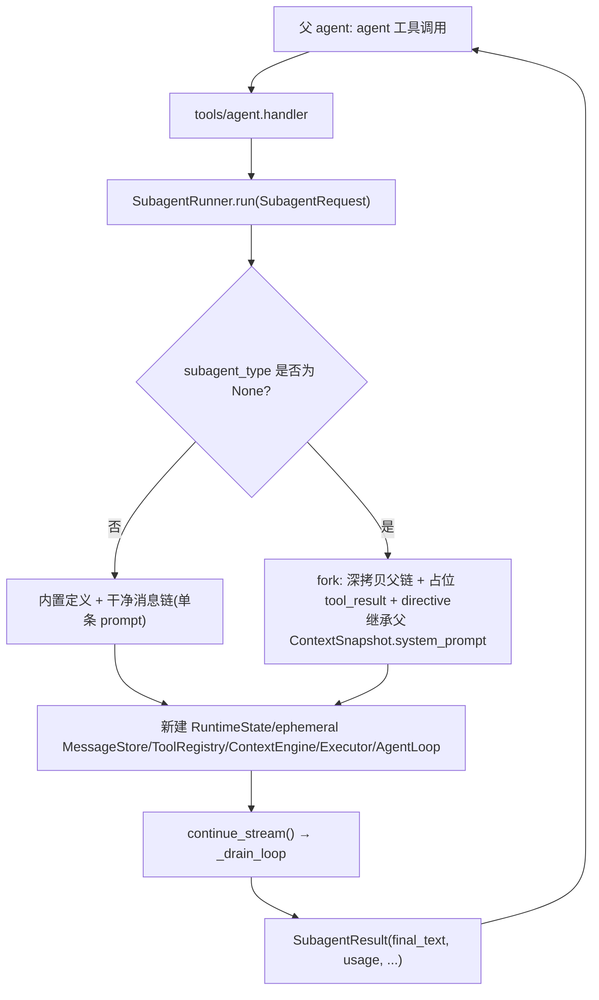

# Subagent Architecture

本文描述 `services/subagents/` 与 `tools/agent/` 的架构。subagent 机制通过普通 `agent` 工具接入父 agent，不在 `core/loop.py` 中增加工具名分支。

## 文件职责

| 文件 | 职责 |
|:---|:---|
| `types.py` | `AgentDefinition`、`SubagentRequest`、`SubagentResult`、`SubagentRunMode` |
| `definitions.py` | 内置 agent 定义表 `BUILT_IN_AGENTS` 与 `get_agent_definition()` |
| `forking.py` | 构造 fork child 消息链（深拷贝父历史 + 占位 tool_result + directive） |
| `runner.py` | `SubagentRunner`：装配 child runtime、`run()` / `run_skill()` |

`services/context/current_model_context.py` 的 `CurrentModelContext` 保存父轮次 `ContextSnapshot`，供 fork child 继承父 prompt 字符串（见 `context-architecture.md`）。`tools/agent/tool.py` 把 runner 包装成普通工具 descriptor（见 `builtin-tools-architecture.md`）。

## 接口设计

### AgentDefinition

`agent_type`、`when_to_use`、`system_prompt`、`source`、`tools=("*",)`、`disallowed_tools=()`、`max_turns`、`model`、`read_only=False`、`hidden=False`。

### SubagentRequest / SubagentResult

`SubagentRequest`：`prompt`、`subagent_type`（`None` = fork 信号）、`parent_session_id`、`parent_tool_call_id`、`mode`、`metadata`。`SubagentResult`：`agent_type`、`session_id`、`final_text`、`is_error`、`transition`、`usage`、`tool_result_count`、`metadata`。

### 内置 agent

| agent_type | tools | disallowed_tools | read_only | hidden |
|:---|:---|:---|:---:|:---:|
| `general-purpose` | `*` | `agent` | 否 | 否 |
| `Explore` | `*` | `agent`、`edit_file`、`write_file` | 是 | 否 |
| `Plan` | `*` | `agent`、`edit_file`、`write_file` | 是 | 否 |
| `fork` | `*` | `agent` | 否 | 是（省略 `subagent_type` 时使用） |

## 核心数据流

## 关键机制

### Child runtime 装配

`SubagentRunner.run()` 为每次调用创建独立的 `RuntimeState`、ephemeral `MessageStore`（只保留运行期内存消息链，不写 `.onecode/sessions/<child_session_id>/messages.jsonl`）、`ToolRegistry`、`ContextEngine`、`RegistryToolExecutor`、`AgentLoop`，共享父级的 workspace、model client、sandbox guard、permission policy、permission prompter、trace recorder 和 base descriptors。child 的中间消息只存在于 child runtime 内存中，不写回父 `MessageStore`，也不会成为可 `/resume` 的用户会话；父链只收到 `agent` 工具的最终 `ToolExecutionResult`。

### Fork 机制

fork 由 `subagent_type is None` 决定（不是 `request.mode`）。`build_forked_messages`：深拷贝父 `current_messages()`；若最后一条 assistant 有未闭合 tool_use，为每个缺失 tool_call_id 追加占位 `tool_result`（content `Fork started...`，metadata `placeholder: fork_started`），修复 provider 协议错误；再追加含 `FORK_DIRECTIVE_TEMPLATE` 的 user 消息。fork child 继承父轮次已渲染的 `ContextSnapshot.system_prompt` 字符串，复用父上下文和 prompt 字节，而非重新组装。

> `SubagentRequest.mode`（`clean`/`fork`）已定义但 `run()` 不读取；仅 `run_skill()` 显式设 `mode="clean"`。

### 工具裁剪

`_child_descriptors`：始终额外禁止 `agent`（`hidden_tools={"agent"}`），避免递归 subagent；`tools=("*")` 保留除 disallowed 外全部，否则白名单过滤。definition 标记 read-only 时设 `read_only_agent=True`，由 `PermissionPolicy` 硬性 deny 非只读或修改文件系统的调用——只读限制由权限层强制，不只是 prompt 约束（见 `permission-architecture.md`）。

### 内部 runtime 任务（窄 fork mode）

通过 `SubagentRequest.metadata["purpose"]` 进入更窄的受限模式：

- `purpose="session_memory_extraction"`：仅暴露 `edit_file`，state 写 `memory_extraction_agent=True` 和 `allowed_memory_path`，只能写指定的 `session-memory.md`。
- `purpose="long_term_memory_extraction"`：仅暴露 `read_file`/`grep`/`glob`/`write_file`/`edit_file`，state 写 `long_term_memory_extraction_agent=True` 和 `allowed_memory_dir`，写入限于 `.onecode/memory/` 下 `.md`。

这些限制由权限层强制（见 `permission-architecture.md`、`memory-architecture.md`、`compaction-architecture.md`）。

### 后台 agent

`agent` 工具 `run_in_background=True` 经 `BackgroundTaskManager.start_agent()` 启动；后台 child 不挂 `permission_prompter`，遇 ask 直接返回 `permission_ask_required` 错误，避免阻塞（见 `background-task-architecture.md`）。child 继承 `task_list_id`/`parent_task_list_id`，与父共享 task graph（见 `task-architecture.md`）。

### Trace

runner 写入 `subagent_start`、`subagent_completed`、`subagent_error`，metadata 含 parent/child session、agent type、是否 fork、是否 read-only、usage、tool result count 和 duration（见 `observability-architecture.md`）。`child_session_id` 仅用于 trace、后台任务输出和父级 tool result 关联，不代表存在可恢复的 child transcript。

## 当前限制

尚未支持 child worktree 隔离、从用户/项目/插件目录加载自定义 agent、持久 agent catalog、完整 prompt-cache identical fork 参数校验。后续扩展应保持 `agent` tool descriptor 和 `SubagentRunner` 作为接入边界，不在主循环中添加 subagent 特例。
