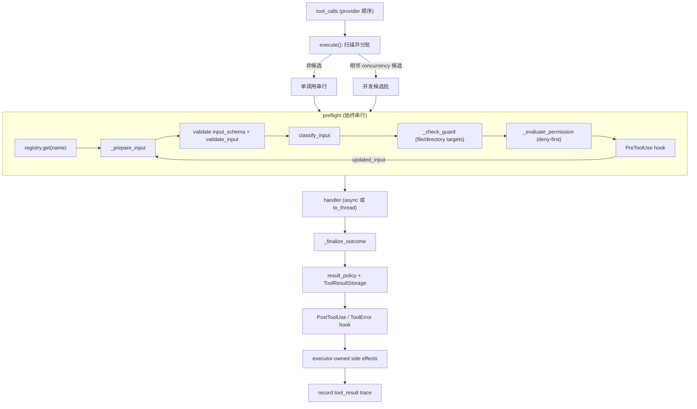

# Tool Runtime Architecture

本文描述 `services/tools/` 的架构边界。该模块是工具运行时，不放具体工具实现；具体工具位于顶层 `tools/<tool_name>/`，见 `builtin-tools-architecture.md`。新增工具约定见 `tool-design-guidelines.md`。

## 文件职责

| 文件 | 职责 |
|:---|:---|
| `types.py` | 共享类型：`ToolDescriptor`、`ToolCall`、`ToolExecutionResult`、`ToolRuntime`、`ToolTarget`、`ToolResultPolicy`、`ToolCallClassification`、`ValidationResult`；fail-closed 默认分类器；`is_guard_policy_allowed()` |
| `registry.py` | `ToolRegistry`：注册/排序、可见性过滤、导出 schema 与 prompt 片段 |
| `schema.py` | `descriptor_to_openai_tool_schema()`：descriptor → OpenAI function schema |
| `executor.py` | `RegistryToolExecutor`：完整执行管线、guard/permission/hook、并发、结果预算、side effects |
| `file_state.py` | `FileStateCache`：缓存文件 mtime/内容，供 `write_file` 防竞态、生成 diff |

## 接口设计

### ToolDescriptor

字段：`name`（snake_case，registry key 与 provider-visible function name）、`description`（schema 短描述）、`input_schema`、`output_schema`、`handler`、`prompt`、`search_hint`、`validate_input`（可选）、`classify_input`（默认 `fail_closed_classification`）。

### ToolCallClassification（input-aware）

字段及 fail-closed 默认值：`read_only=False`、`modifies_filesystem=True`、`concurrency_safe=False`、`targets=()`、`result_policy=ToolResultPolicy()`、`permission_subject=""`。每次调用执行前必须通过 `classify_input()` 生成；分类失败按非只读、会修改、不可并发处理。

### ToolTarget

`kind`（`file`/`directory`/`glob`/`command`/`url`/`session_state`/`external_service`）、`operation`（`read`/`write`/`execute`/`list`/`delete`/`network`/`mutate_state`/...）、`value`、`normalized_value`、`metadata`。它是 guard 和 permission policy 的统一资源描述，executor 不判断具体工具名。

### ToolResultPolicy

`max_result_size_chars`（默认 50_000）、`persist_when_exceeded`（默认 True）、`preview_chars`（默认 4_000）。

### ToolExecutionResult

`tool_call_id`、`tool_name`、`content`、`is_error`、`metadata`、`followup_messages`（成功后追加的 durable internal messages，错误结果会清空）。

### ToolRuntime

handler 入参：`state`、`guard`、`file_state_cache`、`approved_guard_policies`、`tool_call_id`。

### ToolRegistry

`visible_descriptors(state)` 是 schema 与 prompt 的共同入口，可见性来源：registry 构造期的 `disabled_tools`/`denied_tools`、`state.metadata` 中的 `disabled_tools`/`denied_tools`/`hidden_tools`、注入的 `PermissionPolicy.is_tool_visible()`。被隐藏/禁用/拒绝的工具不进入 `tool_schemas(state)` 或 `tool_prompt_sections(state)`。

## 核心数据流

## 关键机制

### 执行管线顺序

`_preflight_one` 始终串行执行：lookup → `_prepare_input`（validate → classify → guard → permission）→ `PreToolUse` hook → 若 hook 改写 input 则重新 `_prepare_input`。guard deny 或 permission deny 在 handler 前返回结构化 tool error。hook 不能通过改写输入绕过 guard/permission（改写后必须重新校验和重新授权）。

`_finalize_outcome`：handler 异常 → `_tool_error`（清空 followup）；否则组装结果 → `_apply_result_policy` → `PostToolUse` hook → `_apply_success_side_effects` → 记录 trace。

### 三层校验

executor 的 JSON Schema 子集校验 → 工具级 `validate_input` → 文件类工具 handler 内基于 `ToolRuntime.guard` 的兜底检查（`is_guard_policy_allowed` 允许 session 批准的 ask policy 通过，但 deny 不可绕过）。

### 并发调度

仅将**相邻**且并发候选（descriptor 存在、schema/validate 通过、`classify_input` 不抛异常、`concurrency_safe == True`）的调用聚为一批。并发批仍先**串行 preflight**整批；若 preflight 后任一项 `concurrency_safe` 变为 False，则整批降级串行。handler 用 `asyncio.Semaphore(min(max_concurrency, batch_size))` + `gather` 并发执行，结果按 provider 原始顺序 finalize 和输出。上限默认 `DEFAULT_MAX_TOOL_CONCURRENCY=10`，可由构造参数或 `ONECODE_MAX_TOOL_CONCURRENCY` 覆盖。

### 结果预算

超出 `max_result_size_chars` 时，若 `persist_when_exceeded=True` 且注入了 `ToolResultStorage`，写入 durable result storage 并返回模型可见引用；否则返回 JSON 预览。metadata 记录 `result_truncated`、`original_size_chars`、`max_result_size_chars` 和 stored result 引用。

### Executor-owned side effects

工具 handler 不直接改主循环状态。成功后 executor 统一维护：

- `read_file`/`edit_file`/`write_file`（及兼容别名 `filewrite`）成功 + `metadata.path` → 追加 `state.metadata["files_read"]`。
- `edit_file`/`write_file` → 追加 `files_changed`；命中 `.onecode/memory/*.md` → 记录 `long_term_memory_writes`。
- 文件工具成功 → `file_state_cache.snapshot_path()`（partial read 标记 offset/limit）。

`skill` 工具结果中的 `metadata.allowed_tools` 不由 executor 写入共享 session grant；fork skill 的临时授权由 child-local permission policy 处理，inline skill 只加载内容。

### followup_messages

handler 可设置（当前仅 inline skill 使用），主循环把成功结果的 followup 追加到 `MessageStore`（`append_attachments`）。错误结果强制清空 followup。

## 错误形态

未知工具、schema 错误、工具级校验错误、分类错误、guard 错误、permission ask required、用户拒绝和 handler exception 都转换为 `ToolExecutionResult(is_error=True)`，作为 tool result 回填给模型，而不是让主循环崩溃。

## 已知差异

`ToolExecutionUpdate.type` 含 `progress`，executor 当前未 yield。`FILE_STATE_TOOL_NAMES` 含遗留别名 `filewrite`，无对应工具目录，仅用于 side effect 兼容。
